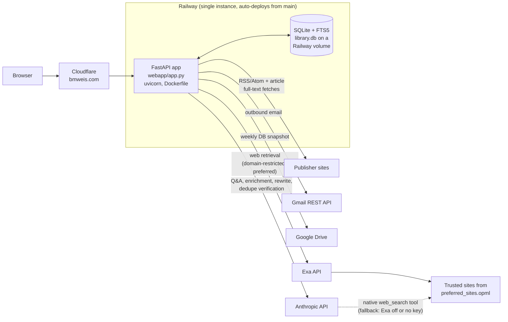

# Architecture

A living technical overview of CFO Navigator / bmweis.com, written for someone
seeing the codebase for the first time. It covers how the system is put
together and *why* it's put together that way — not a line-by-line tour.
Keep it current: see the **Documentation** section of `CLAUDE.md` for the
maintenance rules that apply to every PR.

## 1. System overview

The whole site is **one FastAPI monolith** (`webapp/app.py`) over **one SQLite
database** with FTS5 full-text search (`linklib/db.py`), running as a single
process on Railway. All HTML/CSS/JS is inline in Python strings — there is no
template framework and no frontend build step. The public face (bio, thought
leadership, CFO Toolbox, contact) needs no login; a signed-cookie login gates
the member tools (article archive, feed reader, FP&A Buddy) and a ~40-page
admin back office. Railway auto-deploys from `main` (all changes ship via PR),
the database lives on a Railway volume so it survives deploys, and Cloudflare
sits in front of Railway serving the `bmweis.com` domain.



Notes on the edges:

- **Cloudflare** is infrastructure outside this repo — nothing in the codebase
  references it; its config lives in the Cloudflare dashboard. Current setup
  (verified July 2026): both `bmweis.com` and `www` are **proxied** (orange
  cloud), so Cloudflare is on the request path, not just DNS. SSL/TLS mode is
  **Full** — deliberately not Full (strict), per Railway's guidance about cert
  renewal windows. No custom cache rules or WAF rules and no edge rate
  limiting (stock defaults — HTML isn't cached, so the app's
  `/admin/*` `no-store` behavior is unaffected); **Bot Fight Mode is on**.
  Always Use HTTPS and HSTS are enabled (max-age 6 months, includeSubDomains,
  preload deliberately off). One edge **Redirect Rule** 301s
  `www.bmweis.com/*` → `bmweis.com/$1`, which wins over the app's
  canonical-host middleware for proxied traffic — the middleware still covers
  the legacy `*.up.railway.app` hostname and any traffic that reaches the
  origin directly.
- **The Railway origin is publicly reachable** (`*.up.railway.app` still
  serves, and Railway has no built-in IP allowlisting), so direct requests
  bypass every edge protection — the redirect rule, Bot Fight Mode, HSTS.
  This is an **accepted risk**; the only real fix would be a Cloudflare
  Tunnel, which isn't implemented. Consequence for app code: only
  `CF-Connecting-IP` (set by Cloudflare on proxied requests) is a trustworthy
  client IP — `X-Forwarded-For` can be spoofed by anyone hitting the origin
  directly (see Known limitations).
- **The volume path** is Railway configuration, not code: the app reads
  `LINKLIB_DB` (default `./library.db`); production points it at the mounted
  volume. The DB is deliberately not in git — it's personal reading history.
- **Web retrieval never leaves the allowlist, whichever mechanism handles
  it.** `preferred_sites.opml` (the same file that drives the `/feed`
  reader) restricts both paths: Exa's `includeDomains` on the preferred
  path, and `allowed_domains` on the native `web_search_20250305` tool on
  the fallback path. Exa — a direct `/search` API call from
  `linklib/agent.py` (`retrieve_exa`), not an Anthropic-hosted tool — is
  preferred whenever the `exa_enabled` setting is on and `EXA_API_KEY` is
  set (Phase 2's migration, later made toggleable in Phase 7). Otherwise
  Claude's native tool (Anthropic-hosted, restored in Phase 7 after Phase 2
  had removed it outright) steps in instead. Exactly one of the two runs
  per question — see `linklib.agent._web_provider` for the unified
  condition, and `/admin/exa-settings` for the toggle and its connection
  test.
- **Email is the Gmail REST API, not SMTP** — Railway's Hobby plan blocks SMTP
  ports. Every send is best-effort and must never block the underlying DB
  write; failures land in the `email_failures` table and surface as an admin
  badge instead of dying in a log. At the DNS level (Cloudflare-managed) the
  domain has SPF and DKIM in place, plus DMARC in `p=none` monitoring mode —
  collecting reports, not yet enforcing.

## 2. Database

**There is exactly one database for the whole app: a single SQLite file,
`library.db`** (path configurable via `LINKLIB_DB`), containing every table
the app uses — content archive, FP&A Buddy, accounts, the entire CFO Toolbox
(including Communities), site operations, and the `/play` game. There is no
separate database for any one feature — in particular, **Communities
(`communities`, `community_categories`, `community_profiles`,
`community_gap_submissions`, `community_profile_views`) lives in this same
`library.db` file, in the same tables list below, not a database of its own.**
Every table in the file, grouped by feature area:

| Group | Tables |
|---|---|
| Content spine | `articles`, `articles_fts`, `articles_vec`, `article_embeddings`, `enrichment_cost`, `library_queue`, `dedupe_decisions`, `read_later` |
| FP&A Buddy (Ask) | `ask_questions`, `ask_feedback` |
| Chat Matchmaker | `matchmaker_questions` |
| Accounts | `users`, `password_reset_requests` |
| CFO Toolbox | `tools`, `tool_categories`, `benchmarks`, `tool_leads`, `communities`, `community_categories`, `community_profiles`, `community_gap_submissions`, `community_profile_views` |
| Site operations | `settings`, `contacts`, `email_failures`, `archive_audit_log`, `contact_audit_log` |
| "Sail, Don't Row" (`/play`) | `game_rank_settings`, `game_runs` |

`linklib/db.py` defines and migrates all of it — the `Library` class is the
only write path. The schema script runs on every boot (`CREATE TABLE IF NOT
EXISTS`) followed by an **additive-only migration list** of `ALTER TABLE ADD
COLUMN` statements that ignore "already exists" errors. There are no declared
foreign-key constraints — relationships below are by convention (`user_id`,
`tool_id`, `item_id` columns), enforced in code.

**`/admin/system/database`** (System nav group) renders a live Mermaid ER
diagram of this same schema — table names, key (PK/FK) columns, and row
counts — generated by introspecting `sqlite_master`/`PRAGMA table_info` at
request time, never by parsing this document. It's a self-updating visual
complement to the tables below, not a replacement for them: summary-level
only, and since this schema has no real `FOREIGN KEY` constraints, the
relationship lines it draws come from a small hand-maintained map
(`_DB_RELATIONSHIPS` in `webapp/app.py`) that mirrors the "by convention"
relationships described in this section — update both together. FTS5's and
sqlite-vec's shadow tables (`articles_fts_data`/`_idx`/`_docsize`/`_config`,
`articles_vec`'s equivalents) are filtered out of the diagram since they're
SQLite implementation detail, not schema.

**`/admin/system/page-index`** (System nav group) is the same live-introspection
pattern applied to routes instead of tables: on every page load it walks
`app.routes`, keeps GET routes whose `response_class` is `HTMLResponse`
(skipping POST-only action routes, redirect stubs, JSON/AJAX APIs, file
downloads, and other non-page endpoints), and reads each page's width tier
(`page-full`/`page-grid`/`page-form`/`page-admin`, or "custom
exception" for `/library/archive` and `/library/feed` — see BRAND.md §5 for
the tier system itself) straight from that route's own source via
`inspect.getsource` (following one hop into a directly-called helper function
when a route builds its body that way, e.g. `/play` via `_sdr_build_body`).
Any page route whose source carries no recognized tier class is flagged —
this is the actual point of the feature: it turns "did every page get
tiered," a one-time manual audit (Phase 9), into something that catches a
newly added, never-tiered page automatically. `_page_index_snapshot()` in
`webapp/app.py` is the single source; no maintained list of pages or tiers
exists elsewhere.

**`/admin/system/how-fpa-buddy-works`** (added in the Exa migration's
Phase 4; moved from the System nav group into its own "FP&A Buddy" section
in Phase 6, alongside the report/feedback pages and the Phase 7 toggle
below — the route itself didn't change, only its section) is a
plain-language technical explainer of FP&A Buddy's mechanism — retrieval
tiers (library/feed/web), the Quick/Standard/Deep effort tiers, citation
verification, and the per-user dollar cost cap — written for a technically
comfortable reader (a PM, an engineer, or a CFO) who wants the real
mechanism, not marketing copy. It plays the same reference-doc role
`_COMMUNITIES_REFERENCE_HTML` plays for the Communities feature, but as its
own page rather than a collapsible block on a working admin page, since
explaining the mechanism IS this page's whole purpose. Per-tier source
counts read live from `linklib.agent.EFFORT_SETTINGS` and the default
monthly cap reads live from `Library.get_default_ask_cap()`, so neither can
drift out of sync with the code the way a hand-typed number would; model
names are deliberately described qualitatively (fastest/balanced/most-
capable) rather than pinned to a canonical model ID, since those rotate
independently of this page. Phase 5 added a concept-level Mermaid
`flowchart` above the prose (question → library/feed/web → synthesis →
cited answer, no token counts or API names) — deliberately not the
developer-grade sequence diagram above, which stays the reference for
anyone debugging the actual request flow. Renders via the same
CDN-hosted `mermaid.min.js` used by `/admin/system/database`'s ER diagram,
not a new dependency.

**`/admin/exa-settings`** (Phase 7, FP&A Buddy nav group) is the Exa kill
switch: an `exa_enabled` toggle (`settings` table, `Library.get_exa_enabled`/
`set_exa_enabled`, defaults on) plus a "Test connection" action that fires
one real, minimal Exa `/search` call and reports pass/fail — manual and
on-demand only, never a background job, via `linklib.agent.test_exa_connection`.
The page also flags when `EXA_API_KEY` isn't set on the host at all, since
that's an independent condition from the toggle and an admin could
otherwise be confused about why Buddy is using the fallback. Not persisted
to a cost ledger — the test's tiny real cost (via `compute_exa_cost`) is
only surfaced in the result, not written to a table, since it's a rarely-
used manual check rather than a per-turn or overhead cost.

### Content spine

| Table | Purpose | Columns that carry meaning |
|---|---|---|
| `articles` | The archive: ~1,500+ curated articles. **URL is the natural key** (`UNIQUE`, normalized) — upserts merge tags and fill empty fields, never duplicate. | `url`, `summary` (Claude-generated, the member-facing asset), `content` (fetched full text — internal input only, never served), `tags_json`/`tags_text` (structured list + flattened copy for FTS), `enriched`/`enrich_model`/`enrich_rules` (provenance), `in_scope`/`scope_reason` (off-audience review flags) |
| `articles_fts` | FTS5 virtual table (`content='articles'`, porter tokenizer) over title/author/source/summary/content/notes/tags_text. | Kept in sync by three triggers (`articles_ai`/`_ad`/`_au`) on insert/delete/update — no manual reindex, ever. |
| `articles_vec` | `sqlite-vec` vec0 virtual table (#93) — one embedding vector per article, `rowid = articles.id` (same external-content-by-rowid idiom as `articles_fts`, minus trigger sync — see §4, "Hybrid retrieval..."). Powers the vector half of hybrid retrieval. | `embedding` (`float[1536]`, OpenAI `text-embedding-3-small`) |
| `article_embeddings` | Companion ledger table (#93): which articles are embedded, with what text, and at what cost. Also **an overhead-cost ledger** for embed-on-save/backfill spend — never summed into `ask_questions`, never counts toward a user's Ask cap. Its sibling ledger, `enrichment_cost` (#105), covers enrichment spend; the two stay separate rather than sharing a schema — see §4, "Embedding cost is split by who pays for it" and "Enrichment cost gets its own ledger, not a shared one" below. | `article_id` (PK), `content_hash` (of the exact embedded text — detects staleness after an edit), `model`, `input_tokens`, `cost_usd` |
| `enrichment_cost` | Overhead-cost ledger for `linklib.enrich.enrich()` calls (#105). Unlike `article_embeddings`, this is **append-only**, not upserted — an article can be enriched more than once (backfill force-reruns, a rules-version bump), and each call's real cost stays in history. `article_id` is nullable: `linklib/queue.py`'s pre-save enrichment (a candidate enriched before it's queued or promoted) has no `articles.id` yet, but the API call still cost real money even if the candidate is later dismissed. | `id` (PK, autoincrement), `article_id` (nullable), `model`, `input_tokens`, `output_tokens`, `cost_usd` |
| `library_queue` | Staging area for proposed additions (RSS scan, sitemap backfill, reader submissions). Candidates arrive enriched-but-unsaved for review; promoting moves the row into `articles`, preserving enrichment already paid for. | `url` (unique, same natural key), `origin` (`feed` \| `backfill:<source>` \| `submission:<who>`), `status` (`pending` \| `dismissed` — dismissed rows stay, so a rejected candidate is never re-proposed) |
| `dedupe_decisions` | Curator verdicts on near-duplicate *pairs*, keyed by the sorted URL pair. Suppresses already-judged pairs from future scans and teaches the Claude verifier. | `pair_key` (unique), `verdict` (`dup` \| `distinct`) |
| `read_later` | Per-user private bookmark list, never shared or mixed into the archive. | `user_id` + `url` (unique together — enforced by a post-migration index because the column arrived by migration) |

### FP&A Buddy (Ask)

| Table | Purpose | Columns that carry meaning |
|---|---|---|
| `ask_questions` | One row per conversation **turn**; the single table behind all three surfaces (admin report, a user's own history, the member-public community view). | `conversation_id` (groups follow-up turns; `= str(id)` of the first turn) + `turn_index`; token columns for the answer call; `rewrite_input_tokens`/`rewrite_output_tokens`/`rewrite_cost_usd` for the follow-up query-rewrite call; `embed_input_tokens`/`embed_cost_usd` for embedding the retrieval QUESTION during hybrid retrieval (#93 — a **user-cap** cost, unlike `article_embeddings.cost_usd`, which is embed-on-save overhead); **`cost_usd` is the turn TOTAL (answer + rewrite + query embedding)** so every `SUM(cost_usd)` — the monthly cap, the reports — needs no special handling; `hidden_public`/`anonymized` affect only the community view; `citations_json` is the turn's **API-verified cited-source snapshot** (`[{n, title, url, type, article_id?}]` — `article_id` on library entries only; feed/web sources are transient, so the stored title/url *is* the record, never re-resolved) |
| `ask_feedback` | Member ratings of individual answers — **one row per rated turn per user**, upserted on `(question_id, user_id)` so a changed rating updates in place. Feeds the `/admin/ask-feedback` triage view and, later, a retrieval eval set (flagged questions + the rated turn's citation snapshot). Capture + triage only — feedback never mutates prompts or retrieval automatically. | `question_id` (→ `ask_questions.id`), `rating` (`helpful` \| `inaccurate` \| `not_helpful`), `comment` (optional "what was off?" free text), `updated_at` (`''` until first changed — the empty-string-sentinel idiom) |

Cost figures are computed from **real API token usage** at call time
(`linklib/pricing.py`) — never estimates.

### Accounts

| Table | Purpose | Columns that carry meaning |
|---|---|---|
| `users` | Member accounts. Passwords are scrypt-hashed (`linklib/passwords.py`, stdlib only). | `role` (`user` \| `admin`), `active`, `ask_cap_usd` (per-user monthly dollar-cap override; `NULL` = inherit the global default from `settings`) |
| `password_reset_requests` | Self-service "forgot password" requests. | `token_hash` (SHA-256 of the emailed token — never the raw token, so a DB leak alone can't reset a password), `expires_at`, `resolved_at` (`''` = pending — the empty-string-sentinel idiom used throughout) |

### CFO Toolbox

| Table | Purpose | Columns that carry meaning |
|---|---|---|
| `tools` | The vendor directory on `/tools/software`. `scripts/seed_tools.py` is re-runnable, not one-shot: it adds any tool missing by URL and syncs `name`/`description` on existing rows when the script's copy changes (#113), via `Library.update_tool_content` — a narrow update that never touches `categories`/`advisor`/`promoted`/vendor/warm-intro fields, so admin edits made directly on the live site survive a re-run. Rendered publicly, one entry at a time, at `/tools/software/{slug}` (Software search overhaul Phase 2) via `get_tool_by_slug` — same only-approved-rows rule as `get_community_by_slug`. | `slug` (unique), `approved` (reader submissions wait for approval), `advisor`, `promoted`, `warm_intro_enabled` + `vendor_name`/`vendor_email` (the intro button needs both), `differentiation_note` (Phase 3 — free-text "how this differs from the competition," rendered on the profile page when non-empty; hand-written by Brian via a narrow `update_tool_differentiation`, deliberately kept off the general `update_tool` path so the Software bulk-edit panel — which resaves every field it knows about on every call — can never blank it out), `agent_taxonomy_note` (a Phase 0 decision — standalone feature vs. agent-assisted vs. fully independent agent, deliberately free text rather than a structured/enum field — that went unimplemented through Phases 1-4 and was added in Phase 5 since the comparison matrix is the first thing that needed it rendered; same narrow-update-method pattern as `differentiation_note` via `update_tool_agent_taxonomy`, and additionally folded into the public directory's client-side search string on `/tools/software` since Phase 0 required it be searchable, not just decorative), `agent_taxonomy_needs_verification` (added by the automated-research follow-up below — a per-tool confidence flag, same shape as `tool_features.needs_verification`, cleared automatically whenever a human saves the field through the admin edit form's `update_tool_agent_taxonomy`, and set fresh by an LLM-drafted note via `set_tool_agent_taxonomy_draft`; a dedicated `mark_tool_agent_taxonomy_verified` clears it without touching the text, mirroring the equivalent `tool_features` action), `screenshot_url`/`screenshot_is_product`/`screenshot_captured_at` (Phase 5 follow-up, rendered in a bordered sidebar box on the profile page — two write paths land on the same fields: `update_tool_screenshot` for a manually pasted external URL from the admin edit form, which clears `screenshot_captured_at` since a hand-pasted image has no known capture time; `set_tool_screenshot_capture` for an automated homepage capture, used by both `scripts/capture_tool_screenshots.py` (bulk backfill, run from the terminal) and the live "Recapture" button on the admin edit page — both go through `linklib/screenshots.py::capture_homepage` (Playwright + Chromium, fixed 1280×800 viewport) so a bulk backfill and a one-off recapture stay visually consistent, and both always set `screenshot_is_product=0` since automated capture is deliberately homepage-only, not attempting to auto-identify a real product screenshot. Captured images are stored on the persistent volume alongside `library.db` (`_SCREENSHOT_DIR`, not the Docker image's static/ dir) and served via `GET /tools/software/screenshot/{filename}` — same basename-only traversal guard as `/static/{filename}`. Profile-page caption is provenance-aware: "Product screenshot" when flagged, "Homepage screenshot, captured {date}" for an automated capture, "Homepage screenshot (no product screenshot available yet)" for a manually pasted URL with no capture date — never implies a homepage grab is the product), `summary` (description-length follow-up — `description` grew from a short 1-3 sentence blurb into a full ~8-12 sentence profile-page write-up, so `summary` is a new short 2-3 sentence field for the directory card and the client-side search string on `/tools/software`, drafted alongside `description` in one `generate_tool_description` call rather than derived from it, since a proper condensed rewrite reads better than a truncated long-form opening. Every write path that touches `description` also carries `summary` (`add_tool`, `update_tool`, `quick_update_tool`) — including the bulk-edit route, which must echo the row's existing `summary` back on every call the same way it already does for `description`, or the "resaves every field it knows about" hazard would blank it on an unrelated advisor/promoted toggle. A boot-time backfill (`summary=description` for any row where `summary` is still empty) covers every pre-existing row's already-short description, so cards keep showing sensible text until a tool is re-enriched; the compare matrix and card/search surfaces fall back to `description` if `summary` is somehow still empty, the profile page always renders the full `description`) |
| `tool_categories` | Controlled vocabulary of filter pills — can exist empty, unlike article tags which are purely usage-derived. Consolidated (Software search overhaul Phase 1) from a 21-tag ad hoc list, grown organically as tools were added, to a fixed, deliberately-designed 15-tag taxonomy — always shown alphabetized in the UI (`ORDER BY sort_order, name`, seeded with `sort_order` already alphabetical): `Accounting`, `BI/Analytics`, `Cloud/IT Spend`, `Equity Management`, `ERP`, `FP&A`, `Headcount Planning`, `Legal and Contracting`, `Neobanking`, `Procurement/Spend`, `Revenue`, `Revenue Operations`, `Tax Management`, `Travel Management`, `Treasury/Cash Management`. `scripts/migrate_software_tags.py` is the one-off, re-runnable migration that remapped every existing tool's `categories_json` from the old vocabulary and rebuilt this table — see its module docstring for the full old-to-new mapping. `_DEFAULT_TOOL_CATEGORIES`/`_DEFAULT_CATEGORY_DESCRIPTIONS` in `webapp/app.py` only matter for a fresh DB's first-time seed now that the migration has run. A tool's own assigned categories (as opposed to this vocabulary table) are sorted alphabetically at read time in `Library._tool_to_dict` — the one choke point every read path (`get_tool`, `list_tools`, `get_tool_by_slug`) goes through — rather than relying on every write path (`add_tool`/`update_tool`/the bulk-edit route) to sort before saving; `Library._community_to_dict` does the same for `communities.categories`. This surfaced as a real gap after a production tag-consolidation dry-run: two straggler category names (`CPQ`, `Finance Agents`) that Brian fixed by hand via the admin UI weren't guaranteed to come back out sorted the same way a migration-touched row would. | `name` (unique), `sort_order` |
| `tool_competitors` | Manually curated competitor cross-links between Software entries (Phase 3), rendered as "Closest competitors" on `/tools/software/{slug}`. One undirected edge per pair, normalized so `tool_id` is always the smaller id (`Library.add_tool_competitor` sorts before insert) — `UNIQUE(tool_id, competitor_id)` dedupes against that normalized form, and curating from either tool's `/tools/software/{slug}/edit` page links both directions. This table is the source of truth; `Library.suggest_tool_competitors` (shared-category count, most overlap first) is a separate read-only helper that only powers an admin-UI suggestion list — deliberately not a live auto-computed "competitors" feature, since the 15-tag taxonomy is broad enough that pure tag overlap surfaces plenty of non-competitors (see Phase 0's investigation). | `tool_id`, `competitor_id` (composite unique, normalized pair) |
| `tool_features` | Per-feature standalone-vs-bundled availability for a Software entry (Phase 4a) — the data the Phase 5 comparison matrix reads. `standalone_available`/`bundled_only` are independent booleans (a feature can be sold both a la carte and folded into a tier, so both can be `1`). `needs_verification` reuses the exact confidence-flag shape from `linklib.enrich`'s community-listing autofill (`NEEDS_VERIFICATION`) rather than a new mechanism, but as a per-row bool rather than per-field, since one row is already one semantic unit. Manually admin-added rows default `needs_verification=0`; rows from the Phase 4b LLM enrichment pass default it to `1` (`source='llm_enrichment'`, `model` set) and stay flagged until an admin edits or explicitly marks them verified at `/admin/tools/{id}/features/{id}/edit` (or the one-click "Mark verified" action). No DB-level uniqueness on `(tool_id, feature_name)` — de-duplication across enrichment re-runs is the batch script's job, not a constraint. Enrichment cost is recorded through the existing generic `enrichment_cost` ledger (`article_id=NULL`), the same pattern `generate_tool_description`/`generate_community_profile` already use. | `tool_id`, `feature_name`, `needs_verification`, `source` (`'manual'`\|`'llm_enrichment'`) |
| `benchmarks` | The Benchmarking page at `/tools/benchmarks`, managed at `/admin/tools/benchmarks`. `_DEFAULT_BENCHMARKS` in `webapp/app.py` syncs the same way as `tools`: adds any entry missing by URL and syncs `name`/`description` on existing rows via `Library.update_benchmark_content`, leaving `coverage`/`pricing` untouched so admin edits survive a re-sync. | `coverage` (`Private`\|`Public`\|`Both`), `pricing` (`free`\|`paid`\|`freemium`) |
| `tool_leads` | Warm Intro request submissions per tool. | `tool_id`, contact fields |
| `communities` | The directory on `/tools/communities` — CFO/finance peer groups, associations, and Slack communities (a sibling of `tools`, not a variant of it). `scripts/seed_communities.py` is re-runnable like `seed_tools.py`: adds any community missing by URL and syncs `name`/`notes` on existing rows via `Library.update_community_content`, plus `advisor` (a direct `UPDATE`, mirroring `tools.advisor` exactly — see below) — the identical name+description+advisor contract as `tools`. Every other field (`reach`, `local_markets`, `featured`, `cost_band`, `cost_note`, `sponsorship_type`, `sponsor_name`, `access`, `format`, `categories_json`, `approved`) is admin-owned, edited at `/admin/tools/communities`, and never touched by a re-sync. | `slug` (unique), `reach` (`Regional`\|`National`\|`Global` — a community's overall footprint), `local_markets` (free text, e.g. "Boston, New York, SF Bay Area" — cities/areas where it has a chapter, hub, or local focus; independent of `reach`, so a National community like FEI can still carry local markets; replaced a fixed 18-city checkbox grid — see "Metros -> free text migration" below), `featured` (pin-to-top + coral badge, same pattern as `tools.promoted`; independent of `reach`/`local_markets`/`advisor`), `advisor` (⭐ marker + "Advisor" filter chip, same pattern as `tools.advisor` — discloses a personal relationship, e.g. The F Suite; independent of `featured`), `cost_band` (one of five fixed bands: `Free`\|`Undisclosed dues`\|`<$1k/yr`\|`<$2,500/yr`\|`$2,500+/yr` — bucketed by individual/base rate, exact dues go in `cost_note`), `sponsorship_type` (`Independent`\|`Vendor-sponsored`\|`Investor-sponsored`), `access` (`Open`\|`Application`\|`Invite-only`\|`Qualification-based` — a fixed `<select>`, converted from free text; see the auto-populate section below for how the option list was derived), `format` (`Hybrid`\|`In-person`\|`Slack`\|`Online`\|`LinkedIn group` — same conversion), `approved`, `screenshot_url`/`screenshot_is_product`/`screenshot_captured_at` (Phase 3b — built from scratch for Communities, mirroring `tools`' three columns of the same name exactly: `update_community_screenshot` for a manually pasted URL from the admin edit form, `set_community_screenshot_capture` for an automated homepage capture via the same `linklib/screenshots.py::capture_homepage`; served at `GET /tools/communities/screenshot/{filename}` from its own `_COMMUNITY_SCREENSHOT_DIR`, kept separate from Software's `_SCREENSHOT_DIR` since the two types' slugs can collide — Phase 0 found `airbase`/`datarails`/`rillet` shared across both) |
| `community_categories` | Controlled vocabulary of filter pills for `/tools/communities`, same shape and same reasoning as `tool_categories`. | `name` (unique), `sort_order` |
| `community_profiles` | Deep, opinionated read per community (Community Profiles, Phase 2) — the qualitative judgment a directory row's cost/access fields can't carry, edited at `/admin/tools/communities/{id}/profile`. 1:1 with `communities` via `community_id` as the primary key (no SQL-level `REFERENCES`, same as `article_embeddings.article_id` — this codebase does cleanup on delete in application code, not via a declared FK; see `delete_community`). Empty/thin until Research content backfills it or an admin generates a draft. Rendered publicly at `/tools/communities/{slug}` (Phase 3) and side by side at `/tools/communities/compare` (Phase 6) — a community with no profile row, or one whose fields are all empty, falls back to a minimal page (or, on Compare, a "Not available yet" cell) rather than an error or empty-looking layout. | `community_id` (PK), `sponsor_relationship_note` (qualitative — value-add or sales funnel? — distinct from the factual `sponsor_name`/`sponsorship_type` on `communities`), `business_model` (added post-launch — how the community structurally sustains itself, e.g. a gated dues-funded peer group vs. a wide-funnel free-to-join community monetized via paid tiers/events/sponsorships; distinct from `sponsor_relationship_note`, which judges whether a *sponsor's* presence feels salesy, not how the community itself makes money), `application_friction` (the real barrier to entry, not just the `access` label), `founded_year` (nullable), `notable_members`/`public_criticism` (nullable — only when verifiably public/reported), `low_confidence`, `primary_purpose`/`cpe_eligible`/`platform_type`/`meeting_format`/`event_style`/`seniority_band`/`resources_included` (added for the bulk community-profile import below — short factual/categorical research fields, deliberately `TEXT` rather than a strict boolean/enum since the source research carries qualifiers like "Yes (NASBA-approved sponsor)"; excluded from the voice-rewrite pass since they're not prose; originally hand-entry-only, folded into `generate_community_profile`'s single Claude call alongside the narrative fields per the AI-first-pass-on-every-field standing principle — see `field_reviews` below), `needs_review` (added by the same import — flags a profile as imported/edited but not yet personally read and approved by Brian; admin-only, independent of `communities.approved`, which controls public visibility rather than content review), `seniority_band_tags`/`cpe_eligible_tags`/`platform_type_tags` (Recommender best-fit weighting — a JSON array of controlled-vocabulary values per dimension, edited via checkbox groups alongside the free-text field of the same base name; kept separate from that free-text column rather than parsed from it because the research prose is too inconsistent for reliable keyword matching, e.g. a `platform_type` of "not a Slack/forum" would false-match a naive "Slack" substring check — see `webapp/app.py`'s `_WEIGHT_DIMENSIONS` for the fixed vocabulary per dimension and `scripts/backfill_community_weight_tags.py` for the one-off pass that classified the existing corpus), `function_tags` (post-#159 addition, no free-text sibling column — Overall finance org/FP&A/Accounting/Treasury), `looking_for_tags` (post-#159 addition merging the old `primary_purpose_tags`/`resources_included_tags` into one multi-select — Peer discussions/Networking/Learning & education/Vendor connections/Resources & templates), `programming_tags` (post-#159 addition merging the old `meeting_format_tags`/`event_style_tags` into one multi-select, reusing the "Programming" label — Meals/Conferences/Retreats/Virtual Panels — the four retired `*_tags` columns and their free-text siblings still exist on the table but are frozen historical data, no longer written by `upsert_community_profile` or read by `_WEIGHT_TAG_COLUMNS`), `paid_free_tags` (post-#159 addition — Dues moved here from a `communities.cost_band`-derived computation so a freemium community can carry both Free and Paid, independently of the single-value `cost_band`), `industry_tags` (post-#159 addition, no free-text sibling column — Life sciences/Healthcare/Private equity/funds/Industry-neutral), `stage_focus`/`jobs_program`/`team_or_individual` (placeholder factual/categorical columns, same pattern as `business_model` when it was first added — empty until a future research round backfills them; visible in the admin edit form and the generate-profile-draft prompt, but not yet part of the Recommender's weighting) |
| `community_gap_submissions` | Gap-collection (Phase 5): the native replacement for the old `/community` page's Google Form, folded into the live directory rather than a separate parked page. Submitted at `POST /tools/communities/gap`, triaged at `/admin/community-gaps` (mirrors `/admin/ask-feedback`'s layout). No login required — anyone can submit. Also doubles (Phase 7) as the log for every completed Recommender quiz at `/tools/communities/find` — same table, distinguished by `submission_type` rather than a second table, since a zero/thin recommender result is the same kind of gap signal as a zero-result directory search. Doubles a third way (best-fit weighting) for the quiz's optional "What matters most to you?" step: a visitor's checked values, logged only when they set at least one (never on a skip), for Brian's own aggregate insight into what finance leaders say matters most — not shown to other visitors. Doubles a fourth way as the per-listing correction report from `POST /tools/communities/correct`, since it's the same kind of free-text triage signal, just about factual accuracy on one specific listing rather than a gap in the directory. | `current_communities`/`gaps`/`looking_for` (free text, the visitor's own words — always `''` on a `submission_type='recommender'` or `'weight_preferences'` row, since neither collects free text; on a `'correction'` row, only `gaps` is populated, holding the correction report itself), `search_context_json` (on a `'gap'` row: directory search/filter state at submission time, built client-side from JS-only filter state and carried through a hidden form field; on a `'recommender'` row: the quiz answers plus `result_count`; on a `'weight_preferences'` row: `{"weights": {dimension_key: [chosen values]}}`; always `''` on a `'correction'` row, since it isn't a directory search), `viewed_community_ids_json` (server-computed at submission from `community_profile_views`, not client-supplied), `closest_community_id` (nullable, no FK — always `NULL` on a recommender/weight_preferences row; always populated on a `'correction'` row, since a correction is always about one specific listing), `email` (nullable), `reviewed`, `submission_type` (added by migration — `'gap'`\|`'recommender'`\|`'weight_preferences'`\|`'correction'`, defaults `'gap'` so every pre-existing row keeps its meaning) |
| `community_profile_views` | Session-scoped, no-login view tracking for `/tools/communities/{slug}`: which profile pages a visitor opened before (maybe) submitting the gap form above. Keyed by an anonymous `cfo_visitor` cookie (`webapp/app.py`, 30-day TTL, not signed — the first anonymous-session primitive in the codebase; everything else, e.g. `read_later`, requires a logged-in `user_id`). No cleanup job for stale sessions yet — rows are small and carry no PII. | `session_id` + `community_id` (composite PK, dedups repeat views), `viewed_at` |
| `field_reviews` | Review-status audit trail for every AI-drafted field on Software/Communities profiles — the standing principle that AI drafts a first pass into the edit form and nothing publishes without Brian reviewing and saving it. One generic table rather than a `{field}_reviewed_at`/`_by` column pair per field, since there are 15+ generatable fields across two record types (Software's `description`/`summary`/`differentiation_note`, Communities' full narrative profile) and more likely to come later. Written by `Library.record_field_review`, called from an edit-submit route whenever the submitted form's `ai_drafted_fields` hidden input names a field — that input is populated client-side by `markAiDrafted()` inside each Generate button's success handler (`_MARK_AI_DRAFTED_JS`, shared across every generate-button script), never inferred from content after the fact. Read by `Library.list_field_reviews` for a future "last reviewed" admin display. Cleaned up on delete alongside `tools`/`communities` rows, no SQL-level FK (same pattern as `community_profiles`). | `entity_type` (`'tool'`\|`'community'`), `entity_id`, `field_name` (composite PK), `reviewed_at`, `reviewed_by` (stored even though there's only one admin today, so the schema doesn't need revisiting if that changes) |

**Domain-derived slugs (Phase 2).** `tools.slug` and `communities.slug` were
originally generated from the entry's *name* (`linklib.db._slugify`,
suffix-numbered on collision). Phase 2 switched slug generation to the entry's
*URL* instead: `_domain_slug_base(url)` takes the hostname, strips a leading
`www.`, and takes the first label before the remaining first dot (e.g.
`https://www.abacum.io` → `abacum`). If that short slug collides with another
row of the *same* type, the colliding rows fall back to `_domain_slug_full(url)`
— the full hostname with dots replaced by hyphens (e.g. `abacum-io`) — rather
than a numeric suffix; a numeric suffix is still the final fallback if even
that collides. `add_tool`/`add_community` apply this at insert time and never
regenerate a slug on `update_tool`/`update_community` — a slug is stable for
the life of the row, same as before. Software and Communities each enforce
slug uniqueness only within their own table (separate `/tools/software/...`
and `/tools/communities/...` prefixes), so a domain shared across a vendor's
software listing and its own branded community — Phase 0 found three:
airbase, datarails, rillet — is not a collision. `scripts/migrate_domain_slugs.py`
is the one-off, re-runnable migration that recomputed every pre-existing row's
slug under this algorithm; per the build plan this was a hard cutover with no
redirect from the old name-based slugs (or from the even-older numeric-ID
edit URLs — see the *Admin* auth bullet above for where the edit routes live
now).

`POST /admin/tools/generate-description` (admin-only) drafts a description
from just a name + URL — used by the "Generate" button on the Add Tool form,
Quick Edit, and Full Edit. It's stateless: fetches the URL via
`linklib/extract.py` (same best-effort fetch as article capture) for
grounding, then one Claude call (`linklib/enrich.py::generate_tool_description`,
`LINKLIB_ENRICH_MODEL`) drafts the description — never auto-saved, and never
asserts an acquisition, since that stays a manual/reviewed call. When the page
fetch comes back empty, the draft is flagged `low_confidence` so the admin UI
can warn that it's working from the model's own knowledge rather than the live
page. The call's cost lands in the same `enrichment_cost` ledger as article
enrichment (`article_id=NULL`) — overhead, not a user-facing budget.

`POST /admin/tools/communities/generate-profile` (admin-only) mirrors that
exact contract for `community_profiles`, sized up for a much larger field
count: one Claude call (`linklib/enrich.py::generate_community_profile`)
drafts all thirteen qualitative fields as structured JSON from a community's
name + URL (plus whatever's already on the edit form, fed back as context so
a regenerate refines rather than starts over), grounded in the same
`linklib/extract.py` page fetch, with the same `low_confidence` rule and the
same never-auto-saved review contract — the draft lands in the
`/admin/tools/communities/{id}/profile` form fields for the admin to check
before saving. Cost lands in the same `enrichment_cost` ledger, `article_id=NULL`.

`POST /admin/tools/communities/generate-listing` (admin-only) is the "Auto-fill
from URL" button on the Add/Edit Community form — the equivalent of
`generate-description` above, but for `communities`' basic directory-listing
fields (`demographic`, `reach`, `local_markets`, `cost_band`, `cost_note`,
`sponsorship_type`, `sponsor_name`, `access`, `format`, `categories_json`)
rather than `community_profiles`' qualitative deep-dive. One Claude call
(`linklib/enrich.py::generate_community_listing`), same page-fetch grounding
and `low_confidence` rule as the other `generate_*` helpers. The five enum
fields (`reach`, `cost_band`, `sponsorship_type`, `access`, `format`) and the
one controlled-list field (`categories_json`) are constrained to the
caller-supplied vocabularies the admin form itself uses (`webapp/app.py`'s
`_COMMUNITY_REACH`/`_COMMUNITY_COST_BANDS`/`_COMMUNITY_SPONSORSHIP_TYPES`/
`_COMMUNITY_ACCESS`/`_COMMUNITY_FORMAT` plus the live `community_categories`
list) and re-validated against them on the way back, since a directory Brian
vets personally can't tolerate a hallucinated value. `local_markets` is free
text (no controlled vocabulary — see the Metros -> free text migration
below) and is only trimmed, not re-validated against a list.
`_COMMUNITY_ACCESS`/`_COMMUNITY_FORMAT` (4 and
5 options respectively) were derived from the leading word/phrase of every
pre-existing community's free-text `access`/`format` value — a deliberately
lossy bucketing (e.g. "Invite-only (~10% acceptance, ~95% referral rate)" ->
"Invite-only") reconciled once via `scripts/backfill_community_access_format.py`,
not an ongoing data-preserving migration. Any field the model isn't confident
about is drafted as the literal sentinel string `"Needs verification"`
(`linklib.enrich.NEEDS_VERIFICATION`) instead of a guess — deliberately a
different mechanism from `community_profiles.needs_review` above (that one is
Brian's manual whole-profile sign-off; this one is a machine-set, per-field
gap marker on the basic listing, so the two get distinct labels rather than
sharing the "Needs review" text). Each of the five enum `<select>`s carries
`"Needs verification"` as a literal, selectable option, distinct from that
field's real default, so a drafted gap is visually a value, not just an
empty/default-looking field. `webapp/app.py::_public_community` is the single
choke point every public-facing community route (`/tools/communities`,
`/tools/communities/compare`, `/tools/communities/{slug}`,
`/tools/communities/find/results`) runs a community dict through before
rendering. **Reversed from the original design** (which blanked the sentinel
so an unreviewed gap never reached a visitor at all): per Brian's call while
the Software/Community richness work was landing, unresearched fields now
render *visibly*, flagged rather than hidden, so visitors can see what's
been researched while a review pass is still in progress —
`_public_community` is now a no-op copy kept as that same choke point in
case a field needs public-side handling again, and the actual rendering
happens through `_verify_html` (server-rendered compare/profile pages) or
the parallel `commVerify` JS helper (the JS-templated `/tools/communities`
directory card), both keyed on the exact `NEEDS_VERIFICATION` sentinel
string and both rendering the same muted, dashed-border "Needs
verification" flag — visually distinct from a confirmed value's vivid
`comm-cost`/`comm-cat` badge styling, so a visitor can't mistake a
still-unresearched field for a real one. `_community_geo_line`
(server) and `commGeoLine` (client) both special-case an unverified
`reach` explicitly, since their normal fallback logic (no `local_markets`
→ guess "National · online") would otherwise present a guess as if it
were confirmed. On `/admin/tools/communities`, a community with any gap
still gets the same passive "N fields need verification" badge (distinct
styling and text from the "Needs review" badge) — a nudge toward Edit, not
a save blocker; there's no dedicated free-text search across the admin
communities table today; the table isn't paginated, so the sentinel text
is reachable with a browser find until/unless pagination is added later.
Cost lands in the same `enrichment_cost` ledger, `article_id=NULL`.

**Automated Software research (search overhaul automation follow-up)**
replaced Phase 4b's guessed-path grounding with a real crawl and folded
agent-taxonomy drafting into the same call. `linklib/enrich.py::
_discover_nav_pages` fetches a tool's homepage and parses its own `<a>` nav
links for ones whose text matches product/solution/platform/feature/agent/AI
keywords (same-domain only, deduped, capped at 10) — a vendor's real
Product or Agents page can live at any slug, so parsing the site's own
navigation finds it where guessing `/pricing`, `/solutions`, `/product`
(still the fallback when nav discovery finds nothing, e.g. a blocked fetch)
often missed it entirely. `_fetch_feature_grounding` fetches the homepage
plus up to 10 discovered pages (up to 10k characters each, 60k total) and
feeds all of it to one Claude call, `generate_tool_features`, which now
returns two things in one response: a whole-tool `agent_taxonomy_note` (3-6
sentences, instructed to name every specific agent the content mentions —
not just the first one noticed — and to say plainly when "AI-powered"
language doesn't actually describe agentic behavior) and 8-15
`tool_features` rows (feature name, standalone-vs-bundled availability, a
substantive note). Both carry independent `confident`/`agent_taxonomy_
confident` flags that become `needs_verification`/`agent_taxonomy_needs_
verification` on write. This call runs at up to 4000 output tokens — richer
drafts cost more per call (bounded well under $1 even at these settings
given Opus 4.8 pricing), a deliberate tradeoff since profile quality matters
more than the per-tool cost here. Two trigger points, both confirmed
deliberately rather than picking one: (1) automatically, via `BackgroundTasks`,
right after a tool is added — `webapp/app.py::_run_tool_research`, fired
from both `/admin/tools/new` and the public `/tools/submit` form, so a
slow/failed research call never blocks the add from completing; and (2)
on demand, from a "Refresh AI research" button on `/tools/software/{slug}/edit`
(`POST /admin/tools/{id}/research/refresh`), which runs the same
`_run_tool_research` synchronously so the redirect can show a success/
failure banner — for re-running after a vendor redesigns their site, or
backfilling a tool added before this pipeline existed. Every field this
writes lands via the needs-verification-flagged draft paths
(`add_tool_feature`, `set_tool_agent_taxonomy_draft`) — never auto-
confirmed; the Features section and a "Mark verified" action next to the
Agent taxonomy field are how an admin reviews and clears the flag (or just
edits the field directly, which clears it as a side effect via
`update_tool_agent_taxonomy`). The flag isn't admin-only: both public render
sites (`/tools/software/{slug}`'s "Agent taxonomy" block and the compare
matrix's "How agents are involved" row) show the same muted `.cc-verify`
"unverified" badge next to a drafted-but-unconfirmed note, mirroring how
`tool_features` rows already render `needs_verification` there — a visitor
sees the note itself rather than nothing while review is pending, same
reasoning as the Community listing fields' "Needs verification" flag below.
Cost lands in the same `enrichment_cost` ledger, `article_id=NULL`.

**`scripts/enrich_tool_features.py`** (search overhaul Phase 4b, extended by
the automation follow-up above) is a different shape from the `generate_*`
web routes and the auto-trigger: a standalone CLI batch job, not an
admin-page button or a per-add trigger, since it's meant to run against many
tools at once under Brian's own API credits rather than one row at a time —
this is what re-enriched the ~240-tool existing catalog once the real-crawl
grounding replaced the original guessed-path approach. It calls the exact
same `generate_tool_features` described above, so it drafts both feature
rows and the agent-taxonomy note in one pass per tool. Re-running is safe: a
tool that already has an `agent_taxonomy_note` is skipped (not re-drafted)
unless `--force` — that's what marks a tool "already researched" by this
pipeline now, not feature-row presence, since a tool drafted before this
follow-up may carry old guessed-path features but no taxonomy note at all —
and within a single run a feature name matching one already present for
that tool (case-insensitive) is skipped as a duplicate rather than
double-written. Requires explicit scope (`--tools` or `--limit`) —
deliberately has no "run against everything" default, and `--dry-run`
reports what would be drafted per feature and the agent-taxonomy note (and
a projected full-catalog cost) without writing. Nothing written by this
script is treated as reliable until the same admin review each row needs
anyway (`/tools/software/{slug}/edit`'s Features section and Agent taxonomy
field, or the fuller `/admin/tools/{id}/features/{id}/edit` page) — the
Phase 5 comparison matrix is what actually starts reading this data, and
only once reviewed.

**`scripts/enrich_community_profiles.py`** is the Communities equivalent of
the script above — a standalone CLI batch job wrapping the exact same
`generate_community_profile` call the "Auto-fill from URL"/"Regenerate"
button on `/tools/communities/{slug}/edit` makes one community at a
time, for running it against many communities in one pass instead of
clicking that button repeatedly. Every profile it writes lands via
`upsert_community_profile` with `needs_review=1` — never auto-confirmed,
same review contract as the admin button and as the Software agent-taxonomy
draft above; the admin communities list's existing "N pending review"
badge/filter is how these get reviewed. Because `upsert_community_profile`
fully replaces every `community_profiles` column rather than partially
patching it, and `generate_community_profile` only drafts sixteen of that
row's fields, this script reads the existing row first and passes every
other column — the retired `primary_purpose`/`cpe_eligible`/`platform_type`/
`meeting_format`/`event_style`/`seniority_band`/`resources_included` fields —
straight through unchanged, the same "echo every field back or it gets silently blanked"
discipline `tools.summary` needed in the Software bulk-edit route. Re-running
is safe: a community whose profile already has a non-empty `ideal_member` is
skipped unless `--force`. Requires explicit scope (`--communities` or
`--limit`) — no "run against everything" default — and `--dry-run` reports
every field that would be drafted (and a projected full-catalog cost)
without writing.

**Software admin rename + column picker/bulk edit (both tables).** The Software
admin page moved from `/admin/tools` to `/admin/software` (hard cutover, no
redirect), then again from `/admin/software` to `/admin/tools/software` — each
step a hard cutover with no redirect; both prior URLs now 404. The second move
also brought the bulk-edit sub-route along (`/admin/software/bulk-edit` →
`/admin/tools/software/bulk-edit`), matching the `/admin/tools/communities/
bulk-edit` naming pattern. Every other `/admin/tools/*` sub-path
(`/admin/tools/communities`, `/admin/tools/categories`, `/admin/tools/benchmarks`,
`/admin/tools/leads`, etc.) is a distinct admin area under the historical
"Toolbox" URL prefix and was left alone both times. (The per-entry edit page
itself moved again in Phase 2, off `/admin/tools/{id}/edit` and
`/admin/tools/communities/{id}/edit` entirely — see "Domain-derived slugs"
below.)
Both the Software and Communities approved-rows tables gained a
matching column picker and bulk-edit panel — `_admin_column_picker_html` and
`_admin_bulk_panel_html` in `webapp/app.py` render one shared, table-key-
parameterized UI (`_ADMIN_BULK_EDIT_JS`) reused by both pages, the same
pattern `saveCommunityWeights()` already used for a no-reload settings save.
The column picker persists per-table to `localStorage`
(`cfo_admin_cols_communities` / `cfo_admin_cols_software`) and only toggles
`<td>`/`<th>` visibility client-side — no server round-trip. Bulk edit is
scoped to shared/categorical fields only, never the per-record unique ones
(`name`, `url`, `description`/`notes`, vendor contact fields, `submitted_by`):
`_COMMUNITY_BULK_FIELDS` (`cost_band`, `sponsorship_type`, `access`, `format`,
`reach`, `categories`, `featured`, `advisor`) and `_SOFTWARE_BULK_FIELDS`
(`categories`, `advisor`, `promoted`, `warm_intro_enabled`) are the server-side
allowlists `POST /admin/tools/communities/bulk-edit` and
`POST /admin/tools/software/bulk-edit` check the requested `field` against before
touching the DB — enum fields (`cost_band`/`sponsorship_type`/`access`/
`format`/`reach`) are further checked against their fixed option lists
(`_COMMUNITY_BULK_SELECT_OPTIONS`). Both routes loop the selected ids, fetch
each row's current values, and call the existing `update_community`/
`update_tool` with just the target field overridden — no new `Library`
methods. The confirmation summary ("Set 'Cost band' = 'Free' on 6 rows.") is
built client-side before the POST fires; the apply itself is a single
`fetch()` that reloads the page on success.

**Sort + filter (both tables).** Same client-only approach as the column
picker above, and for the same reason — neither table paginates, so the full
row set is already in the DOM and there's no need for a server round-trip.
`_admin_sort_filter_toolbar_html` (`webapp/app.py`) renders a "Sort by"
`<select>` + ascending/descending toggle, per-field filter `<select>`s for
scalar/enum columns, and an OR-matched categories checkbox filter, reusing
`_admin_row_data_attrs` to stamp lowercased `data-*` attributes (`data-name`,
`data-cost_band`, `data-categories="cat-a|cat-b"`, etc.) on each `<tr>` —
`_ADMIN_SORT_FILTER_JS`'s `applySortFilter()` reads those attributes rather
than visible `<td>` text, so filtering still works correctly when a column is
hidden by the picker. Default sort is Name ascending on both tables, matching
the existing server-side `ORDER BY name` in `list_communities`/`list_tools` —
the toolbar is a pure client-side view on top of that default, not a
replacement for it (a no-JS load still shows the same alphabetical order).
Sort/filter targets: Communities gets `cost_band`/`access`/`sponsorship_type`/
`format`/`reach` (scalar `<select>`s, AND-combined) plus `categories`
(checkbox filter, OR-combined) — the same field set the Phase 1 column picker
already exposes. Software has no comparable enum field (Phase 0 found no
pricing/tags column distinct from `categories_json`), so its filter is
`categories` only, with `promoted` (Featured) added as a second sort option
alongside Name. Sorting re-orders `<tr>`s via repeated `tbody.appendChild()` — appending an
already-attached node moves it rather than duplicating it, so this reorders
in place; filtering toggles `style.display`. A `Showing N of M` counter and a
`Reset` button read the same row set the sort/filter logic does.

**Duplicate-URL blocking on save (both tables, create and edit).**
`linklib.db.DuplicateURLError` and a `_find_tool_by_normalized_url`/
`_find_community_by_normalized_url` lookup on `Library` guard `add_tool`,
`update_tool`, `add_community`, and `update_community` — each compares the
incoming URL's `normalize_url()` value against every other row's, and raises
if it matches. Deliberately placed at the `Library` layer rather than only in
the admin route handlers, so any caller is covered, not just the admin form —
this is what let `scripts/seed_tools.py`/`scripts/seed_communities.py` keep
working: their own re-run idempotency check used to be an exact-string
`WHERE url = ?` lookup, which would have missed a normalized-duplicate (e.g.
a `www.` variant) and then crashed on the newly-enforced `DuplicateURLError`
when it tried to insert it as new — both scripts' lookups were switched to
build an `{normalize_url(url): row}` map up front and compare against that
instead, so they now recognize the same rows `add_tool`/`add_community`
would. On `update_tool`/`update_community`, the check only runs when the URL
is actually changing (compared via `normalize_url()` against the row's
current stored URL) — critical so the bulk-edit routes above, which always
resave a row's own unchanged URL as part of every bulk update, can never trip
on a duplicate that has nothing to do with the field they're actually
changing. `webapp/app.py`'s four submit routes
(`admin_tools_new_submit`/`admin_tools_edit_submit`/
`admin_communities_new_submit`/`admin_communities_edit_submit`) catch
`DuplicateURLError` and turn it into a `400` whose `detail` names the
conflicting entry and links straight to its edit page
(`_duplicate_url_message`) — same `HTTPException(400, detail=...)` mechanism
already used for the existing required-field validation on those routes, not
a new error-rendering pattern.

**Metros -> free text migration.** The directory's geography field started as
an 18-city checkbox grid (`_COMMUNITY_METROS`, backed by `metros_json`, a
controlled vocabulary) with a public click-to-filter `<select>` on
`/tools/communities`. The fixed list was too narrow — a community with a
chapter in a city not on the list had no way to say so — so it was replaced
with a single free-text `local_markets` field ("Boston, New York, SF Bay
Area"), and the click-to-filter region `<select>` was removed rather than
left pointing at nothing: a visitor now finds a specific city through the
existing `comm-search` search bar instead, which already indexed `metros`
client-side and now indexes `local_markets` the same way — filtering moved
from click to search rather than disappearing outright. `metros_json` is
frozen in place rather than dropped (same no-destructive-migration precedent
as the retired `*_tags` columns above); `Library._migrate_community_local_markets`
backfilled every existing community's `local_markets` from whatever
`metros_json` already held, once, on first boot after the migration.
`local_presence` (the Recommender weighting dimension) now derives from
`local_markets` non-empty instead of `metros_json` non-empty — same
semantics, new source column. The Communities Recommender quiz
(`/tools/communities/find`) never asked about location, so it needed no
changes.

**Bulk community-profile import** (`scripts/import_community_profiles.py`,
one-time). Unlike the single-community generate-profile flow above (which
drafts fields from a live page fetch), this imports pre-researched profiles
for many communities at once from `scripts/_community_profile_data.py` — a
static module of researched field values, reconciled against manual
corrections. For each community it runs the 11 narrative fields
(`linklib.enrich.VOICE_REWRITE_FIELDS` — everything except `notable_members`
and the 8 short factual/categorical fields) through one Claude call per
community (`linklib.enrich.voice_rewrite_community_fields`), using the live
`voice_core` setting as the style guide: a **style pass only** — every number,
date, dollar figure, and specific claim must survive unchanged, only tone and
sentence structure are rewritten. Cost lands in the same `enrichment_cost`
ledger as the flows above (`article_id=NULL`). Every imported row is saved
with `needs_review=1`, so the profile is live on its public page immediately
(the directory isn't left thin while Brian works through reviews) but flagged
on the admin communities list — a badge plus a `?filter=needs_review` link,
and a per-row "Mark reviewed" action that clears the flag — until he's
personally read and approved it. The count also folds into the shared admin
badge system (`webapp/tasks.py::open_task_counts`) alongside pending
submissions on the same `/admin/tools/communities` href.

`--only NAME` restricts a run to a single community (exact `name` match) —
for a community whose research lands after the original batch (e.g. a later
research round covering one new addition), so it can be imported without
re-voice-rewriting (and re-spending on) every community already done.

**Targeted research updates** (`scripts/patch_round3_community_profiles.py`,
and any similar later-round script following the same shape) handle the
other case: a later research round that only deepens a handful of fields on
an *already-imported* community, not the whole profile. These use
`Library.update_community_profile_research_fields` — a genuine partial
`UPDATE` (only the columns actually passed are touched) — rather than
`upsert_community_profile`'s full-row replace, so fields outside that
round's scope are never disturbed. The voice-rewrite pass, when one runs, is
scoped the same way: only the specific narrative fields the round actually
re-researched go through `voice_rewrite_community_fields`, not all 11.

**Community submissions.** `GET/POST /tools/communities/submit` mirrors the
tool-submission flow (`/tools/submit`) exactly, deliberately trimmed to just
name + URL (no description/categories, since a pending community is thin
until Brian writes or generates its profile). It's member-gated like the
tool form (`_is_member`), and is reachable from a single subtle text link at
the bottom of `/tools/communities` ("Know a community that belongs here?
Submit it for review →", or "Sign in to submit →" signed out) — the same
auth-aware footer-link pattern used at the bottom of `/tools/software`. The
submission lands via `add_community(...,
submitted_by=..., approved=0)`, fires the internal notification email plus a
`COMMUNITY_SUBMISSION_*`-templated confirmation to the submitter (both
admin-editable at `/admin/emails`, same `_send_email_safely` best-effort
pattern as tool submissions), and waits at `/admin/tools/communities` in a
"Pending submissions" table above the "Approved communities" list — the same
two-section layout as `/admin/tools/software`. `POST
/admin/tools/communities/{id}/approve` calls `approve_community` and redirects
straight to `/admin/tools/communities/{id}/profile` (rather than back to the
list) so the "Generate profile draft" button is immediately in front of
Brian for a community that would otherwise sit thin in the directory;
`POST .../reject` deletes the row, mirroring `approve_tool`/reject for
tools. Pending-count badging (`lib.count_pending_communities()`) feeds
`webapp/tasks.py::open_task_counts` at `/admin/tools/communities`, the same
mechanism as pending tool submissions.

**Community gap-collection** (Phase 5) is reachable three ways: a subtle text
link at the bottom of `/tools/communities`, directly below the submission
line ("Can't find the right one, or the one you're in isn't quite enough?
I'd love to know what's missing →" — this and the submission line replaced
an earlier seafoam CTA card that carried the same prompt plus a "Suggest a
community" button), a zero-result search state ("No communities match. Tell
me what's missing →", the link inline in the message itself rather than
requiring the visitor to notice a separate CTA elsewhere on the page), and a
per-profile "Not quite the right fit?" mini-CTA on
`/tools/communities/{slug}` that pre-fills `closest_community_id`. The quiz
mention ("Not sure which community's for you? Take the quiz →") is a
separate, unrelated link now folded inline into the subtitle paragraph at
the very top of the page, rather than paired with the gap-form link in a
shared CTA block — the two used to sit together below the filters, but the
gap link's natural home is bottom-of-page alongside the other submission
prompts, while the quiz is a wayfinding aid that belongs with the intro
copy. All three gap-collection entry points
land on `GET /tools/communities/gap`, which builds a transparency note from
whatever session state it can detect — the directory's search/filter state
(passed via query params, since those filters are pure client-side JS state
never otherwise posted to the server) and profiles viewed via the
`cfo_visitor` cookie — telling the visitor what was picked up rather than
capturing it silently. Both the bottom-of-page and zero-result gap links are
built client-side by the same `gapFormHref(isZero)` helper, so the query
params (search/filter state, plus `zero=1`) stay identical regardless of
which entry point a visitor uses. `POST /tools/communities/gap` needs no
login and recomputes `viewed_community_ids_json` server-side from
`community_profile_views` rather than trusting a client value. Triage lives
at `/admin/community-gaps`, and unreviewed submissions feed the shared admin
badge system (`webapp/tasks.py::open_task_counts`) the same way pending tool
submissions and unread contacts do.

**Suggest-a-correction.** `GET/POST /tools/communities/correct?community_id=<id>`
is the "this specific field is wrong" counterpart to the gap form's "this
directory is missing something" — a public, no-login, single free-text field
("What's incorrect or out of date?") plus optional email, linked from the
bottom of `/tools/communities/{slug}` as "Something here out of date?
Suggest a correction →". Unlike the gap form, `community_id` is required
(the route 404s without a valid one, since a correction is never about "none
in particular"); registered ahead of `/tools/communities/{slug}` in
`webapp/app.py` for the same reason `gap`/`submit`/`compare`/`find` are, so
`correct` isn't swallowed as a slug. Rather than a new table, it reuses
`community_gap_submissions` with `submission_type='correction'` — storing
just `gaps` (the free-text report) and `closest_community_id`, leaving
`current_communities`/`looking_for`/`search_context_json` empty since a
correction isn't a directory search — and is triaged alongside gap/recommender
submissions at `/admin/community-gaps`, which renders a "Correction" type
badge and shows the correction text under "What's incorrect or out of date"
instead of the gap-form's three-field layout. Never auto-applied to the
listing; it's capture-and-triage only, same as gap submissions.

**Feature reference.** A collapsible "How this works" block at the top of
`/admin/tools/communities` (`_COMMUNITIES_REFERENCE_HTML` in `webapp/app.py`)
is the durable, in-admin record of every user-facing prompt/CTA across the
feature and how the `cfo_visitor` anonymous-tracking mechanism works —
static reference content, not a DB-backed editable field, since it documents
what the code does rather than something Brian tunes. Any PR that changes
Communities-feature copy or tracking mechanics must update it in the same
PR (see the Documentation rules in `CLAUDE.md`).

**Community compare** (Phase 6). `GET /tools/communities/compare?ids=<id>,<id>,<id>`
renders 2-3 selected communities side by side, reusing the same directory-card
fields (region/access/sponsor/cost) and `_COMMUNITY_PROFILE_PUBLIC_FIELDS`
profile fields as the single profile page. `ids` is a plain comma-separated
query param — deduped and capped at 3 server-side, with unapproved/unknown
ids silently dropped — and carries no session or server-side selection state,
so a compare URL is copy/paste-able and bookmarkable on its own. The
selection itself lives only in the directory page's JS (`compareSelected`, a
capped array persisted across re-renders as the visitor filters/paginates);
a sticky compare bar surfaces the count and the link once 1+ communities are
checked, and disables further checkboxes with an inline message (not a
browser alert) once the cap of 3 is reached. Rows in the comparison table are
per-field: a row renders only if at least one selected community has content
for that field, and any still-empty cell in a rendered row shows "Not
available yet" rather than leaving a blank or erroring — the same
degrade-gracefully contract as a thin/profile-less community on the single
profile page, just applied per cell instead of to a whole page. Registered
before `/tools/communities/{slug}` so "compare" isn't swallowed as a slug,
same reasoning as `/gap` and `/submit`.

**Communities Chat Matchmaker** (replaces the quiz below). `GET
/tools/communities/find` is now a free-type chat, not a 4-question form: the
visitor describes what they're looking for, Claude (`linklib/matchmaker.py`)
asks a small number of clarifying questions, then narrows to 2-3 best-fit
suggestions with links to their profile pages. Unlike FP&A Buddy, there's no
retrieval layer — every approved community's directory listing plus its
Community Profile rides as full context in the system prompt on every turn
(`_build_communities_context`), since the ~38-community dataset is small
enough that this is cheap and simpler than retrieving a subset of it. The
system prompt is cached server-side (Anthropic prompt caching,
`cache_control` on the system block), since that context is identical across
every turn of every visitor's conversation until a community changes.

`POST /tools/communities/find/chat` is the turn-by-turn API, mirroring `POST
/ask`'s server-rebuilds-history-from-DB-rows contract exactly (see the Ask
sequence diagram below) but against its own table, `matchmaker_questions`,
kept separate from `ask_questions` so FP&A Buddy and the matchmaker(s) track
spend against independent monthly dollar caps — a matching conversation can
run more back-and-forth turns than a typical FP&A Buddy question even though
each turn is individually cheaper (no retrieval, no web search, no
citations). Unlike Ask, **this page needs no login** (same as the quiz it
replaced), so `matchmaker_questions.user_id` is nullable and rate limiting
keys off the anonymous `cfo_visitor` session cookie for the common signed-out
case (`matchmaker_cost_this_month_session`), falling back to a per-user cap
(`users.matchmaker_cap_usd` / `settings['matchmaker_default_cap_usd']`,
same override-else-default shape as Ask's cap, admin controls on
`/admin/users`) only when the visitor happens to be signed in. Thumbs
up/down feedback on suggestions is UI-only, session-scoped — no server call,
no persistence, unlike Ask's `ask_feedback` table.

The old quiz's best-fit weighting infrastructure described below (dimensions,
per-community `*_tags` columns, the `/admin/tools/communities` "Recommender
ranking weights" panel) has since been **removed entirely**, by Brian's
explicit call: it was never read by the Matchmaker and had no other
consumer, so the admin panel, its Python helpers
(`_WEIGHT_DIMENSIONS`/`_get_default_community_weights`/`_community_weight_
tags`/etc.), the eight `*_tags` columns those dimensions wrote
(`seniority_band_tags`, `cpe_eligible_tags`, `platform_type_tags`,
`function_tags`, `looking_for_tags`, `programming_tags`, `paid_free_tags`,
`industry_tags`), the four already-retired `*_tags` columns from before it
(`primary_purpose_tags`, `resources_included_tags`, `meeting_format_tags`,
`event_style_tags`), and the one-off classification scripts that populated
them (`scripts/backfill_community_weight_tags.py` and the
`scripts/recategorize_*.py` family) are all gone. `community_profiles`' free-
text columns of the same base name (`seniority_band`, `platform_type`, etc.)
are untouched — the Matchmaker reads those directly, needing no controlled
vocabulary. The dimension-by-dimension design history below is kept as a
historical record of a system that no longer exists, same as the "Community
recommender" section that follows it.

**Software Chat Matchmaker** (Phase 2 — same pattern, applied to Software; no
existing quiz to replace, so this is a new build rather than a route swap).
`GET /tools/software/find` / `POST /tools/software/find/chat` mirror the
Communities matchmaker exactly (same chat UI, same server-rebuilds-history
contract), with `linklib/matchmaker.py::_build_software_context` sending
every approved Software entry's directory fields (summary,
differentiation_note, agent_taxonomy_note) plus its `tool_features` rows as
system-prompt context instead of the Communities dataset — the ~150-tool
dataset is still small enough to send as full context rather than retrieve a
subset. `_build_system(lib, kind)` shares the conversation-shape instructions
and voice layering between both matchmakers, branching only on the dataset,
link format (`/tools/software/<slug>` vs. `/tools/communities/<slug>`), and
the clarifying-question hint text (finance function / integrations / budget
vs. role / stage / access).

Both matchmakers write to the same `matchmaker_questions` table with
`kind='community'`/`kind='software'` distinguishing the rows, and — by
design, not accident — **share one monthly dollar budget**: a session or
user's cap is the SUM of `cost_usd` across both kinds
(`matchmaker_cost_this_month[_session]` never filters by `kind`), rather than
each matchmaker getting its own pool. A `/tools/software`-page CTA ("Not sure
which tool's for you? Software Matchmaker →") mirrors the Communities
directory's own inline CTA ("Community Matchmaker →").

**Community recommender** (Phase 7, historical — the quiz replaced above). A
4-question quiz at `GET /tools/communities/find` (role, budget, access, a
catch-all "anything more specific") routed to `GET
/tools/communities/find/results`, a filtered read of the directory. Each
answer mapped onto one of the directory's existing filterable dimensions —
`community_categories`, `cost_band`, or the access bucket the directory's own
`accessBucket()` JS helper already computes — so `_recommender_filter`
(removed from `webapp/app.py` along with the rest of the quiz's routes) was a
Python port of the directory's `commFiltered()` semantics (categories
OR-matched against each other, every dimension AND-matched against the
others). This filtering step was unchanged by the best-fit weighting below
and stayed the sole gate on which communities appeared at all; weighting only
reordered what had already passed it.
`POST /tools/communities/find` logged every completed quiz — including a zero
or thin result, the same kind of gap signal as a zero-result directory
search — as a `community_gap_submissions` row with `submission_type=
'recommender'`, reusing the `cfo_visitor` session infrastructure from Phase 5
(`get_viewed_community_ids`) rather than a parallel one, then redirected to
the plain, bookmarkable GET results page so a refresh or a shared link never
re-logged.

**Best-fit weighting** (historical — ranking within the quiz's filtered
results; orphaned by the Matchmaker above, see the note there). Filtered
results are sorted by a per-community weighted match score, `featured`
breaking ties same as everywhere else in the directory — replacing the
plain featured-first/alphabetical order the filter alone produced before
this. Scoring runs over 10 dimensions, defined once in `webapp/app.py`'s
`_WEIGHT_DIMENSIONS` (each with a fixed controlled vocabulary, an admin
label, a quiz label, and a `source`):
- 8 are `source: "profile"` — 3 of them correspond to a `community_profiles`
  column (`seniority_band`, `cpe_eligible`, `platform_type`) and read from
  that column's sibling `*_tags` JSON column (`seniority_band_tags`, etc.)
  — a controlled-vocabulary classification kept separate from the
  free-text research column of the same base name, because that prose was
  investigated and found too inconsistent for reliable keyword/substring
  matching (e.g. a `platform_type` of "not a Slack/forum" would
  false-match a naive "Slack" check; `platform_type`'s own vocabulary was
  later re-derived to Slack/Circle/Email/Proprietary, naming the actual
  platform rather than chat/in-person/mix — a community with no matching
  platform, or one on a platform outside this vocabulary like a LinkedIn
  group, gets an empty tag list rather than a forced fit). `function`,
  `looking_for`, and `programming` are post-#159 additions with no
  free-text sibling column of their own:
  - `function` (Overall finance org / FP&A / Accounting / Treasury) is
    classified straight from `ideal_member`/`value_prop`/`categories` into
    `function_tags`, splitting out the controller/accounting-focused
    distinction that `seniority_band` used to carry before its own
    vocabulary narrowed to a pure seniority read (CFO / Senior Exec (VP+) /
    Open to all).
  - `looking_for` ("What you're looking for": Peer discussions / Networking
    / Learning & education / Vendor connections / Resources & templates,
    stored in `looking_for_tags`) retired and merged two of the original 7
    dimensions — `primary_purpose` and `resources_included` — rather than
    relabeling them: the old `primary_purpose` vocabulary bundled "peer
    networking" as one option, this one splits it into Peer discussions
    (an active Q&A/discussion mechanic) vs. Networking (events/dinners/
    conferences), folds the old Resources included into one of five
    checkboxes, and adds Vendor connections as a wholly new concept (a
    vendor/tool-matchmaking service, e.g. GaapSavvy's auditor/tech-stack
    matchmaking) the old vocabulary never captured.
  - `programming` (Meals (dinners, etc.) / Conferences / Retreats / Virtual
    Panels, stored in `programming_tags`) retired and merged the other two
    original dimensions — `meeting_format` and `event_style` — deliberately
    reusing the "Programming" admin label that used to belong to
    `meeting_format` alone (a repurposing to a new vocabulary, not a
    naming collision to preserve). Derived from `format_reality` (the
    narrative field describing actual programming) rather than from
    `meeting_format`/`event_style`, since that's where this level of detail
    actually lives. A 5th originally-proposed option, "Demo Days," has no
    supporting text anywhere in the current research corpus and was left
    out rather than force-fit — a candidate for a future research round,
    same treatment as the `stage_focus` placeholder below.
  - `paid_free` (Dues: Free / Paid, stored in `paid_free_tags`) moved here
    from `source: "derived"` — it used to be computed on the fly as a
    single value (`["free"]` if `communities.cost_band == 'Free'` else
    `["paid"]`), which could never represent a freemium community with
    both a free tier and a paid tier (e.g. Finance Alliance, GaapSavvy,
    Startup CFO, CFO Connect). `paid_free_tags` is a dedicated column,
    independently editable from `cost_band` — a community's `cost_band`
    stays the single-value directory-listing fact shown on its own edit
    form, while `paid_free_tags` can diverge (e.g. `cost_band` reads
    "Free" while `paid_free_tags` is `["free","paid"]` for a freemium org).
    `scripts/recategorize_dues.py` seeded every community's `paid_free_tags`
    from its current `cost_band` (preserving the prior derived behavior)
    before applying the freemium overrides; Proformative is confirmed
    single-tagged (`["free"]`) rather than dual-tagged despite similarly-
    worded freemium language in its own research prose — Brian's read is
    that its free tier (forums, webinars) is the actual community/product,
    and its paid CPE courses are an add-on purchase, not a membership gate
    the way the freemium four's paid tiers are.
  - `industry` (Life sciences / Healthcare / Private equity/funds /
    Industry-neutral, stored in `industry_tags`) is a wholly new dimension,
    no free-text sibling column. Vocabulary drawn from the natural
    categories that emerged from the "Industry-specific"-tagged
    communities' research text during Phase 0 — deliberately narrower than
    that category's own framing (which also gestures at nonprofit and
    tech): no community in the current 38 is nonprofit-focused (the one
    candidate was already removed via `REMOVALS` before this Recommender
    build started), and "tech" overlaps the `stage_focus` placeholder's
    in-flight Research Round 4 work, so neither was added as an option with
    zero or contested matches. Only 4 of the 38 communities get a
    non-neutral tag (Finance & Accounting for Bioscience → life sciences;
    HFMA → healthcare; PECFOA and Private Funds CFO Network → PE/funds);
    the other 34 are `industry_neutral`.

  (Update: all four retired `*_tags` columns above, and the eight still-live
  ones described through the rest of this section, were later dropped
  entirely — see the note at the top of this Matchmaker/Recommender
  subsection for why and when. Their free-text siblings on
  `community_profiles` were never touched.)

  `platform_type`'s own vocabulary was also re-derived post-#159, from
  Slack/chat-based, In-person only, Mix to naming the actual platform:
  Slack / Circle / Email / LinkedIn / Proprietary. A community with no
  matching platform — pure in-person, or coordinating only over a tool
  like Zoom/Luma that isn't itself a community hub — gets an empty
  `platform_type_tags` list rather than a forced fit (the schema and
  scoring already support a dimension with no tags for a given community).
  `linkedin` was added specifically for Modern Finance Forum for CFOs,
  whose actual platform is a LinkedIn group — flagged during the initial
  pass as a real vocabulary gap rather than left untagged or force-fit into
  Proprietary.

  `scripts/backfill_community_weight_tags.py` hand-classified the original
  38 communities into the first 7 (now 3 of the current 7, since 4 were
  retired); `scripts/recategorize_level_function.py` re-classified
  `seniority_band_tags` into its narrowed vocabulary and classified
  `function_tags` for the first time; `scripts/
  recategorize_purpose_resources.py` classified `looking_for_tags`;
  `scripts/recategorize_platform.py` re-classified `platform_type_tags`
  into its new vocabulary; `scripts/recategorize_programming.py` classified
  `programming_tags` for the first time; `scripts/recategorize_dues.py`
  seeded `paid_free_tags` from `cost_band` and applied the freemium
  overrides; `scripts/recategorize_industry.py` classified `industry_tags`
  for the first time. New communities get theirs set via checkbox groups on
  the admin profile edit form (`/admin/tools/communities/{id}/profile`),
  alongside the free-text fields where one exists.
- 2 are `source: "derived"` — computed on the fly from an existing
  `communities` column instead of a stored `*_tags` column: `local_presence`
  (`local_markets` non-empty), and `sponsorship_type` (straight off
  `communities.sponsorship_type`, already a fixed 3-value enum —
  `Independent`/`Vendor-sponsored`/`Investor-sponsored` map onto the
  dimension's own `independent`/`vendor`/`investor` vocabulary).
  `_community_weight_tags` computes all 10 dimensions' tags uniformly
  regardless of source; `source` only changes two things — how that function
  derives the tag, and whether the dimension gets a checkbox group on the
  admin profile-edit form (only `"profile"` ones do, since a `"derived"`
  dimension's value already lives on the directory-listing edit form, e.g.
  `sponsorship_type`'s existing dropdown, so a second control there would
  just invite drift between the two).

For **all 10** dimensions — `"profile"` and `"derived"` alike, no
distinction — Brian sets a default **weight** (0–5, a
`community_weight_<dim>` setting) AND a default **target value** (one or
more of that dimension's vocabulary, a `community_weight_values_<dim>`
setting storing a JSON array) at `/admin/tools/communities` — both are
required for a default to actually rank anything: a weight alone has
nothing to match a community's tags against. The admin UI edits both
together (`_get_default_community_weights`/
`_get_default_community_weight_values`), same no-reload settings pattern as
`/admin/voice`. (An earlier revision of this feature gave the 3 derived
dimensions no admin default at all, on the theory that they're structural
directory facts rather than a research judgment — that shipped as a bug:
Local presence and Cost were silently missing from the admin panel
entirely, and a weight with nothing to match against can't rank anything
regardless of source. Corrected so all 10 dimensions get the identical
default-weight-and-value treatment.)

The quiz's `GET /tools/communities/find` page added one further optional
step after the 4 filter questions: "What matters most to you?", a checkbox
group per dimension (all 10) letting a visitor check every value they'd
accept — not a single-choice control, since e.g. a visitor might find both
"CFO" and "Open to all" acceptable for `seniority_band`.
Skipping the whole step (simply not checking anything) was the same action
as leaving any individual dimension's boxes unchecked: **resolution was
per-dimension, not all-or-nothing** — `_recommender_effective_weights_and_
values` merged a visitor's checked values with Brian's admin default
independently for each of the 10 dimensions, so a visitor who only weighed
in on 2 dimensions got their own preference on those 2 and Brian's defaults
on the other 8. The visitor never set a numeric weight directly — only a
target value — the weight applied was always Brian's admin weight for that
dimension, regardless of which side (visitor or admin default) supplied the
target value. `_recommender_score` then summed the weight for every
dimension whose effective target value(s) intersected the community's
tag(s) for that dimension.

`POST /tools/communities/find` carried the visitor's checked values through
to the results page as repeated query params (`w_<dim key>=<value>`, same
bookmarkable-GET reasoning as the 4 filter answers) and, only when the
visitor checked at least one box (never on a skip), logged a *second*
`community_gap_submissions` row with `submission_type='weight_preferences'`
storing the chosen values as JSON in `search_context_json` — kept as its own
row rather than folded into the `'recommender'` row so this signal wasn't
diluted by the (majority of) quiz completions that didn't set any
preference. The results page stated plainly which weights ranked what was
shown (`_recommender_disclosure_html`): the visitor's own choices restated
back if they set any, "Ranked using Brian's default priorities" otherwise —
by design, no separate methodology explanation beyond stating the weights in
effect.

### Site operations

| Table | Purpose | Columns that carry meaning |
|---|---|---|
| `settings` | Generic key/value store (global Ask cap default, `matchmaker_default_cap_usd`, editable email copy, tag-style guide, `voice_core`/`voice_fpa_buddy`/`voice_matchmaker` voice guide, …). | `key`/`value` |
| `contacts` | Contact-form submissions. | `deleted_at` (`''` = live — soft delete for spam, never hard delete) |
| `email_failures` | Durable record of failed outbound-email attempts, so "best-effort" email never means "silent". | `context` (which send path), `resolved_at` |
| `archive_audit_log` | Who did what to the archive: one row per admin add/edit/delete. | `admin_id` (nullable — the break-glass login has no `users` row), `item_id` (an `articles.id`; `NULL` = bulk operation with a summary in `detail`) |
| `contact_audit_log` | Same shape for contact deletions — kept separate so `item_id` is never ambiguous about which table it references. | as above, `item_id` → `contacts.id` |

### "Sail, Don't Row" (the /play game)

| Table | Purpose | Columns that carry meaning |
|---|---|---|
| `game_rank_settings` | One row per difficulty rank — the tunable knobs the game engine reads, editable from `/admin/game-settings` without a redeploy. Contains deliberately-kept dead columns (`row_speed`, `stamina_*`) from a removed mechanic — migrations here are additive-only. | `rank` (PK), speed/obstacle/shark tuning columns |
| `game_runs` | Public leaderboard, one row per submitted run. Client-reported scores (client-authoritative game, bounds-checked at write time only). | `score`, `course_week`, `difficulty_index`/`difficulty_label` (**frozen at write time** — a later admin retune can't relabel past runs) |

```mermaid
erDiagram
    users ||--o{ ask_questions : "user_id"
    users ||--o{ ask_feedback : "user_id"
    ask_questions ||--o{ ask_feedback : "question_id"
    users ||--o{ matchmaker_questions : "user_id (nullable — public page)"
    users ||--o{ read_later : "user_id"
    users ||--o{ game_runs : "user_id"
    users ||--o{ password_reset_requests : "user_id"
    users ||--o{ archive_audit_log : "admin_id (nullable)"
    users ||--o{ contact_audit_log : "admin_id (nullable)"
    articles ||--|| articles_fts : "rowid, via triggers"
    articles ||--o| articles_vec : "rowid, written from Python (#93)"
    articles ||--o| article_embeddings : "article_id"
    articles ||--o{ enrichment_cost : "article_id (nullable)"
    library_queue }o--|| articles : "promoted into (by URL)"
    articles ||--o{ archive_audit_log : "item_id (nullable)"
    contacts ||--o{ contact_audit_log : "item_id (nullable)"
    tools ||--o{ tool_leads : "tool_id"
    tools }o--o{ tools : "tool_competitors, normalized pair"
    tools ||--o{ tool_features : "tool_id"
    tool_categories }o--o{ tools : "by name in categories_json"
    community_categories }o--o{ communities : "by name in categories_json"
    communities ||--o| community_profiles : "community_id"
    game_rank_settings ||--o{ game_runs : "rank"

    articles {
        int id PK
        text url UK "natural key, normalized"
        text summary "member-facing asset"
        text content "internal grounding input only"
        text tags_json
        int enriched
        int in_scope
    }
    ask_questions {
        int id PK
        text conversation_id "groups turns"
        int turn_index
        int user_id
        real cost_usd "turn TOTAL: answer + rewrite + embed"
        real rewrite_cost_usd "rewrite's share of cost_usd"
        real embed_cost_usd "query-embed's share of cost_usd (#93)"
        int hidden_public
        int anonymized
        text citations_json "cited-source snapshot per turn"
    }
    article_embeddings {
        int article_id PK
        text content_hash "detects staleness after an edit"
        text model
        real cost_usd "overhead — never in ask_questions"
    }
    enrichment_cost {
        int id PK
        int article_id "nullable — pre-save queue enrichment"
        text model
        int output_tokens "enrichment generates text; embeddings don't"
        real cost_usd "overhead — never in ask_questions"
    }
    ask_feedback {
        int id PK
        int question_id "rated turn, UNIQUE with user_id"
        int user_id
        text rating "helpful | inaccurate | not_helpful"
        text comment "optional free text"
    }
    matchmaker_questions {
        int id PK
        text kind "community | software"
        text conversation_id "groups turns"
        int turn_index
        int user_id "NULL for anonymous — public page, no login"
        text session_id "cfo_visitor cookie; the anonymous rate-limit key"
        real cost_usd "turn TOTAL, no rewrite/embed split (no retrieval)"
    }
    users {
        int id PK
        text username UK
        text role "user | admin"
        real ask_cap_usd "NULL = global default"
        real matchmaker_cap_usd "NULL = global default; tracks separately from ask_cap_usd"
    }
    library_queue {
        int id PK
        text url UK
        text origin "feed | backfill | submission"
        text status "pending | dismissed"
    }
    tools {
        int id PK
        text slug UK
        int approved
        int warm_intro_enabled
    }
    communities {
        int id PK
        text slug UK
        text reach "Regional | National | Global"
        text local_markets "free text: cities/areas with a chapter, hub, or local focus"
        int featured "pin-to-top + coral badge, mirrors tools.promoted"
        int advisor "star marker + filter chip, mirrors tools.advisor"
        text cost_band "Free | Undisclosed dues | <$1k/yr | <$2,500/yr | $2,500+/yr"
        text sponsorship_type "Independent | Vendor-sponsored | Investor-sponsored"
        int approved
    }
    community_profiles {
        int community_id PK "1:1 with communities, no SQL FK"
        text sponsor_relationship_note "qualitative — distinct from sponsor_name/type"
        text application_friction "real barrier to entry, not just the access label"
        int founded_year "nullable"
        text notable_members "nullable — only if verifiably public"
        text public_criticism "nullable"
        int low_confidence "drafted without a successful page fetch"
        text cpe_eligible "short factual field, not voice-rewritten"
        int needs_review "imported/edited, not yet personally reviewed"
    }
    game_runs {
        int id PK
        text rank
        int score "client-reported"
        int difficulty_index "frozen at write"
    }
```



(Diagram shows key columns and conventional relationships only; `settings`,
`contacts`, `email_failures`, `benchmarks`, `dedupe_decisions`, `read_later`,
`tool_categories`, `community_categories`, `articles_vec`, and the audit
tables carry no columns beyond what the tables above describe.)

## 3. Key request flows

### FP&A Buddy — `POST /ask`

The retrieval-augmented Q&A flow. The UI exposes only a Quick/Standard/Deep
effort tier; each tier maps internally to a model, retrieval counts, token
budget, and per-source/global grounding-character caps (`EFFORT_SETTINGS` in
`linklib/agent.py`). The server is the source of truth for conversation
history: the client sends only `conversation_id` + the new question, and the
server rebuilds the transcript from the conversation's recorded
`ask_questions` rows — client-fabricated history is impossible, and both the
follow-up cap and the money guards are fully server-side.

```mermaid
sequenceDiagram
    participant B as Browser (/library/ask page)
    participant W as webapp/app.py
    participant DB as SQLite (Library)
    participant AG as linklib/agent.py
    participant H as Anthropic API (Haiku)
    participant O as OpenAI API (embeddings)
    participant X as Exa API (search)
    participant C as Anthropic API (tier model)

    B->>W: POST /ask {question, conversation_id?, effort}
    W->>W: _require_member (cookie or save token)
    opt follow-up turn (conversation_id present)
        W->>DB: load the conversation's ask_questions rows (turn_index order)
        W->>W: ownership: 404 unknown id, 403 someone else's conversation
        W->>W: follow-up cap: count recorded rows (max 7 turns)
        alt turn cap reached
            W-->>B: {capped: true}
        end
        W->>W: rebuild history[] from the rows (question/answer pairs)
    end
    W->>DB: _current_user_id -> effective cap vs SUM(cost_usd) this month
    alt monthly dollar cap reached
        W-->>B: {capped: true, budget message}
    end
    W->>AG: answer_question(question, rebuilt history, effort)
    opt follow-up turn only (history non-empty)
        AG->>H: rewrite follow-up into a standalone search question
        H-->>AG: rewritten query (+ real token usage)
        Note over AG: best-effort - on any failure,<br/>retrieval falls back to the raw question
    end
    AG->>DB: FTS5 search (bm25-ranked) on the retrieval question, 2x max_library
    AG->>O: embed the retrieval question (text-embedding-3-small)
    O-->>AG: query vector (+ real token usage)
    Note over AG: best-effort - vector search unavailable or the<br/>embed call fails -> falls back to FTS5-only silently
    AG->>DB: vec0 KNN search on the query vector, 2x max_library
    AG->>AG: reciprocal rank fusion - merge FTS5 + vector hits,<br/>dedupe by article id, take top max_library
    AG->>AG: optional feed matching (keyword overlap, 30-min cached feed)
    AG->>DB: _web_provider - exa_enabled setting AND EXA_API_KEY set?
    alt Exa is the provider (preferred)
        AG->>X: retrieve_exa: /search, includeDomains from OPML, max_web results
        X-->>AG: results (+ real result count)
        Note over AG: best-effort - the call fails<br/>-> falls back to library/feed-only silently, does NOT re-arm the native tool this turn
        AG->>C: messages.create: library + feed + Exa sources,<br/>all as document blocks with citations enabled (no web tool armed)
    else native tool is the provider (Exa off, or no key)
        AG->>C: messages.create: library + feed as document blocks,<br/>web_search_20250305 tool armed (allowed_domains from OPML)
        Note over C: the model decides whether/how many times<br/>to call the tool (max_uses = max_web), same as pre-Exa
    end
    C-->>AG: text blocks with citation spans<br/>(+ automatic web citations when the native tool fired) + usage
    AG->>AG: reassemble answer - append [n] after each cited span,<br/>one deduped first-use-ordered list across library/feed/web sources;<br/>each web citation tagged provider "exa" or "native"
    AG->>AG: compute_cost from real token usage (pricing.py)
    AG-->>W: Answer {text, citations, cost_usd = answer + rewrite + query embed + Exa (if it ran)}
    W->>DB: record_ask_question - one row per turn<br/>(conversation_id, turn_index, tokens, cost breakdown,<br/>citations_json snapshot of the cited sources)
    W-->>B: {answer, citations, sources, followups_left,<br/>conversation_id, turn_id, usage: {spent, cap}}
    opt member rates the answer
        B->>W: POST /ask/feedback {question_id: turn_id, rating, comment?}
        W->>DB: record_ask_feedback - upsert on (question_id, user_id)
    end
```

Details worth knowing:

- **The system prompt's voice block is DB-backed, two fields, live-editable
  from `/admin/voice`.** `_build_system` (`linklib/agent.py`) reads the
  `voice_core` and `voice_fpa_buddy` settings and concatenates them; each
  falls back to its code-constant default (`VOICE_CORE_DEFAULT`,
  `VOICE_FPA_BUDDY_DEFAULT`) when empty, so the field is never silently
  blank. `voice_core` is written persona-neutrally (mechanics + tone only,
  no assistant framing) so it also serves standalone as `/admin/voice`'s
  "General / site copy" reviewer rubric; `voice_fpa_buddy` layers the
  analyst-specific register (third-person, cite-or-name-the-gap, no
  first-person experience claims) on top for both generation and its own
  "FP&A Buddy answer" rubric. No caching — one indexed SELECT on an
  already-open connection is immaterial next to the Claude API round-trip.
- **Two to four API calls can happen per turn.** On follow-ups, a cheap Haiku
  call first rewrites e.g. *"what about at Series A?"* into a standalone
  search question so retrieval sees the conversation's subject. It's
  retrieval-only (the answering prompt always gets the verbatim question plus
  raw history), strictly best-effort (10s timeout, malformed output rejected,
  silent fallback), and its spend is still recorded — folded into the same
  row's `cost_usd` with `rewrite_*` columns breaking out its share. A
  separate OpenAI call embeds that same retrieval question for the vector
  half of hybrid search, and (when `use_web` and Exa is the provider — see
  below) an Exa `/search` call retrieves web results — same best-effort
  contract, same fold-into-`cost_usd` pattern (`embed_*` and `exa_*` columns
  respectively). When the native tool is the provider instead, its own
  per-search fee is billed by Anthropic and isn't captured in `cost_usd` at
  all — a pre-existing gap flagged back in the Phase 0 investigation, not
  introduced or worsened by Phase 7's restoration of the tool.
- **Exactly one mechanism handles the web tier per turn — never both.**
  `linklib.agent._web_provider(lib)` decides once, before retrieval starts:
  Exa when the `exa_enabled` setting is on (default) AND `EXA_API_KEY` is
  set; otherwise the native `web_search_20250305` tool (Phase 7 restored it
  from before Phase 2's removal — same `allowed_domains`/`max_uses` shape).
  This is a one-time decision, not a reactive retry: if Exa is chosen but
  its call fails mid-turn, that turn just gets zero web results (the
  existing best-effort contract) rather than falling back to the native
  tool for the same turn — avoiding any scenario where both could fire.
  Toggle and connection test live at `/admin/exa-settings`.
- **Library retrieval is hybrid: FTS5 keyword search + vector semantic
  search, merged by reciprocal rank fusion (`agent._rrf_merge`, k=60).** Each
  path fetches 2x the tier's `max_library` so the merge has real rank signal
  to work with, not two already-truncated top-N lists. Chosen over blending
  bm25 scores with cosine distances: the two live on incomparable scales with
  no corpus-scale signal (a ~1,500-article library) to calibrate a blend
  weight against, whereas RRF only needs rank position. Every failure mode —
  `sqlite-vec` unavailable, no `OPENAI_API_KEY`, the embed call erroring —
  degrades silently to FTS5-only, never blocking an answer.
- **Citations are API-verified, not prompted.** When Exa is the provider,
  library, feed, and web sources all ride as Citations-API `document` blocks
  — one uniform citation shape. When the native tool is the provider instead
  (Phase 7 fallback), its automatic URL-based citations are reassembled
  alongside the document-block citations from library/feed — both shapes
  are unified into one continuous, deduplicated, first-use-ordered `[n]`
  list either way, so the answer text and source list look identical
  regardless of which mechanism handled the web tier. Every web-type
  citation additionally carries a `provider` field ("exa" | "native") not
  present on library/feed citations — a separate marker from citation
  `type` (which stays "web" for both), used only to gate the "Powered by
  Exa" caption (Phase 3) on the real mechanism. Any surprise in citation
  metadata degrades to plain text — citation handling can never fail an
  answer.
- **Cost guards are layered**: per-turn grounding-character caps, a max-tokens
  budget per tier, a follow-up cap (6 extra turns, counted from the
  conversation's recorded `ask_questions` rows — never from anything
  client-supplied), a history-character cap carried into the prompt, and the
  authoritative monthly per-user dollar cap checked against real recorded
  spend before any API call. The monthly cap SUMs `cost_usd`, which already
  includes the query-embedding cost — but never embed-ON-SAVE cost, which
  lives on a separate table entirely (`article_embeddings`, Brian's overhead,
  never a user's).
- **Conversations resume across reloads and devices.** The `/library/ask` page offers
  a "Recent conversations" list on load (`GET /ask/conversations` — the
  user's last 5, first question as the label) and loads a full transcript
  from `GET /ask/conversations/{id}`: per-turn question, answer, the
  `citations_json` snapshot (parsed server-side so the client re-renders each
  turn's `[n]` markers as links against that turn's own list), and the user's
  existing feedback state, ready to re-rate. Both endpoints enforce the same
  ownership contract as `POST /ask` (404 unknown, 403 someone else's); a
  conversation at the turn cap loads read-only with the "start a new
  question" affordance. Resume is offered, never forced — a fresh question
  starts a new conversation exactly as before.
- **Two compatibility notes.** A stale pre-deploy tab that still sends a
  `history` field in the `POST /ask` payload is tolerated: the field is
  ignored (untrusted), and the request proceeds on the server-rebuilt
  history. And token-only access (`X-Save-Token`) is now effectively
  one-shot: its turns were never recorded (there's no `users` row to
  attribute them to), so there is nothing server-side to continue — it gets
  `conversation_id: null` back and any `conversation_id` it sends is
  rejected. Turns recorded before `conversation_id` existed (stored as `''`)
  are likewise not resumable; they still appear in `/ask/history`.
- **Each turn's cited sources are persisted, and answers can be rated.** The
  API-verified citation list is stored on the turn's row
  (`ask_questions.citations_json`) as a snapshot — feed and web sources are
  transient, so the stored title/url is the record and is never re-resolved;
  library entries additionally carry their `articles.id`. Under each answer on
  `/library/ask`, quiet 👍/⚠️/👎 controls post to `POST /ask/feedback` (same auth as
  `/ask`; you can only rate turns from your own conversations), upserting one
  `ask_feedback` row per turn per user — a changed rating updates in place. The
  `/admin/ask-feedback` page triages ratings with the question, answer, and
  cited sources; nothing feeds back into prompts or retrieval automatically.
  The snapshot shape is deliberately per-turn — it's what the resume flow
  replays to re-render past turns' `[n]` markers.
- **Server-rendered surfaces share one citation renderer.** Every
  server-rendered view of a stored answer — `/ask/history`, the
  `/library/past-questions` view, and `/admin/ask-feedback` — calls
  `_render_cited_answer(answer, citations_json, truncate=?)` in
  `webapp/app.py`: it linkifies each `[n]` marker against that turn's own
  snapshot (same marker contract as the client — 1–2 digits, not followed by
  `(`, only in-range numbers link, so a literal `[2026]` stays text),
  truncates without ever splitting a marker, and returns the matching
  numbered source list. Legacy rows (backfilled `citations_json='[]'`)
  degrade to plain literal markers with no source list — never fabricated
  links, never an error. **Any future server-rendered answer surface must
  call this helper**, and it is deliberately *not* unified with `/library/ask`'s
  client-side JS rendering (`mdInline`/`srcListHtml` over live API
  responses) — that's a different layer; keep them separate. The admin CSV
  export deliberately keeps raw literal `[n]` markers (no HTML in a CSV) and
  instead appends a plain-text `citations` column resolving them.

### Archive save / enrichment pipeline

All capture paths converge on `linklib/pipeline.py::ingest_url` or the
`library_queue` review flow:

- **Direct saves** (trusted — go straight into `articles`): the bookmarklet →
  `POST /save` (token auth), `POST /feed/save` from the feed reader (admin),
  and the CLI (`scripts/add_link.py`). `ingest_url` fetches the page
  (trafilatura preferred, BeautifulSoup fallback — `linklib/extract.py`),
  upserts by normalized URL, then enriches: one Haiku call
  (`linklib/enrich.py`) generates a summary and tags biased toward the
  existing tag vocabulary (`linklib/tagstyle.py` learns the curator's tagging
  style and feeds the prompt). Enrichment is **additive and optional** — a
  save without an API key just leaves `enriched=0` for
  `scripts/enrich_backfill.py` to fill later. `ingest_url` then calls
  `pipeline.embed_article` (#93) — same additive-and-optional shape: no
  `OPENAI_API_KEY` or a failed call just leaves the article FTS5-searchable
  but not yet in `articles_vec`, for `scripts/embed_backfill.py` to catch
  later.
- **Queued candidates** (reviewed — land in `library_queue` first): the RSS
  scan and one-time sitemap backfill (`linklib/queue.py`), and member reader
  submissions (`POST /library/submit`, honeypot-protected, deliberately
  un-enriched until review). `linklib/suggest.py` adds an advisory
  Claude-predicted keep/skip. The admin reviews at `/admin/queue`;
  **promoting** moves the row into `articles` preserving any enrichment
  already paid for, **dismissing** keeps the row so it's never re-proposed.
  Embedding happens after promotion too, off-request (`background_tasks`,
  same pattern as the post-promotion DB backup) since promotion itself has no
  other network call to piggyback the latency on.
- FTS5 stays in sync automatically via the triggers — every insert/update
  cascades into the index. `articles_vec` does **not**: a SQL trigger can't
  make a network call, so embeddings are written from Python instead
  (`embed_article`, `embed_backfill.py`), making vector search **eventually
  consistent by design** rather than trigger-synchronous like FTS5 — an
  article is always immediately findable via FTS5, and via vector search
  once its embed call (inline or backfilled) has actually completed.

### Auth: three tiers, one cookie

Implemented with the stdlib only (`hmac`/`hashlib`/scrypt) — deliberately no
`itsdangerous`/SessionMiddleware dependency.

- **Login** (`POST /login`): username + password verified against `users`
  (scrypt). One **break-glass** path: the host password
  (`LINKLIB_PASSWORD`, falling back to `LINKLIB_SAVE_TOKEN`) with a reserved
  admin username works even with an empty `users` table, so a lost password
  can't lock the owner out. Success sets `cfo_session`: an HMAC-SHA256-signed
  value `exp|role|username` (key: `LINKLIB_SECRET_KEY`, falling back to the
  password — unset means restarts invalidate sessions), HttpOnly,
  SameSite=Lax, 30-day TTL.
- **Post-login/logout redirect**: `GET/POST /login` carries an optional
  `next` query param/hidden field, validated by `_safe_next` (must be a
  same-app relative path — rejects absolute URLs, `//host` scheme-relative,
  and `/\host` backslash tricks). A present, valid `next` wins after a
  successful login regardless of role. With no `next`, the default is
  role-based: admins land on `/admin`, everyone else on the homepage (`/`) —
  never `/library`, which isn't every signed-in user's home. Any private page
  that redirects to `/login` (`_login_redirect`) already round-trips through
  `next` this way. `GET /logout` always redirects to `/` for every role.
  The Software/Community Matchmaker links (`/tools`, `/tools/communities`)
  use this: signed out, the link is replaced with a "Sign in for access…"
  prompt pointing at `/login?next=<matchmaker path>`; the matchmaker routes
  themselves stay public (see below) — this is a soft, discovery-level nudge
  toward signing in, not a hard gate on the chat itself.
- **Three surfaces**:
  - *Public* — no auth: `/`, `/thought-leadership`,
    `/thought-leadership/growth-engine-ratio`, `/thought-leadership/ai-hackathon-playbook`,
    `/thought-leadership/netsuite-mcp`, `/tools`, `/tools/software`,
    `/tools/software/{slug}` (the profile page, Software search overhaul Phase 2;
    opened in a new tab via each card's "Full profile →" link — 404s for an
    unknown or unapproved slug, same rule as the communities equivalent below),
    `/tools/software/compare` (the comparison matrix, Phase 5 — 2-4 tools via
    `?ids=`, registered *before* `/tools/software/{slug}` so "compare" isn't
    swallowed as a slug, same fix as `/tools/communities/compare` below;
    fewer than 2 approved ids among those given renders an instructional
    empty state rather than an error),
    `/tools/software/screenshot/{filename}` (serves a captured homepage
    screenshot from `_SCREENSHOT_DIR` on the persistent volume — same
    basename-only traversal guard as `/static/{filename}`, kept as a
    separate route/directory since these don't ship inside the Docker
    image),
    `/tools/benchmarks`,
    `/tools/communities`, `/tools/communities/{slug}` (the profile page, redesigned
    in Phase 3b against the same card system as Software's Phase 3 page — a
    "Bottom line" callout, a Details card for cost/access/sponsorship/format/reach/
    founded/CPE, four themed Community Profile cards ("Who it's for" / "What you
    get" / "How it works" / "Cost & structure") grouping the qualitative narrative
    fields instead of one long flat scroll, and a screenshot card built from
    scratch — opened in a new tab from a directory card),
    `/tools/communities/screenshot/{filename}` (Communities equivalent of
    `/tools/software/screenshot/{filename}` above, serving from its own
    `_COMMUNITY_SCREENSHOT_DIR` rather than sharing `_SCREENSHOT_DIR` — Software
    and Communities slugs can collide, e.g. `airbase`/`datarails`/`rillet`),
    `/tools/communities/gap` (the "not
    quite the right fit?" CTA on a profile page — currently a stub that redirects
    into `/contact` with the community pre-filled as context, pending the real
    Phase 5 gap-collection flow), `/tools/communities/correct` (per-listing
    "suggest a correction" — 404s without a valid `community_id`, since a
    correction is always about one specific listing), `/contact`, `/privacy`, `/play`, `/login`,
    `/static/*`, `/health`. (The old flat `/growth-engine-ratio`, `/finops-ai-hackathon`,
    `/netsuite-mcp` URLs 301-redirect to the nested paths above.)
  - *Member* (`_is_member` — any valid session): `/library`, `/library/archive`,
    `/library/feed`, `/read`, `/library/ask`, `/library/past-questions`,
    `/library/submit`. HTML pages redirect to `/login`; APIs return 401. (The
    old flat `/archive`, `/feed`, `/ask`, `/questions` URLs 301-redirect to
    their nested equivalents.)
  - *Admin* (`_is_authed` — session with `role=admin`): everything under
    `/admin/*`, plus admin-only actions on shared pages. This includes two
    routes that live on the public `/tools/*` prefix rather than under
    `/admin/*` — `GET/POST /tools/software/{slug}/edit` and
    `GET/POST /tools/communities/{slug}/edit` (Phase 2), the full edit forms
    for a Software/Community entry. They moved off the old
    `/admin/tools/{id}/edit` / `/admin/tools/communities/{id}/edit` paths so
    a profile page's Edit button and its edit form share one slug-based URL
    family; `_is_authed` gates them exactly like every other admin route
    (redirect to `/login` on the GET, 401 on the POST) — the prefix changed,
    not who can reach it. Every other per-entry admin action (screenshot
    recapture, research refresh, agent-taxonomy verify, competitors,
    features, delete) stayed on its existing numeric-ID `/admin/tools/{id}/*`
    sub-route and now redirects back to the new slug-based edit URL on
    success.
- **Token auth in parallel**: `POST /save` is token-only
  (`X-Save-Token`/`?token=`) because the bookmarklet calls it cross-origin
  where the cookie can't be sent; member/admin APIs (`/ask`, `/api/search`,
  `/feed/save`) accept the token as an alternative to the cookie. All token
  comparisons are constant-time (`hmac.compare_digest`).
- If **no password is configured at all**, private routes are open — a
  local-development convenience, never the hosted configuration.
- Two middlewares wrap everything: a canonical-host 301 (www + legacy Railway
  hostname → apex, guarded so dev instances and `/health` never redirect —
  for proxied www traffic Cloudflare's edge Redirect Rule fires first, so this
  middleware is the backstop for the legacy hostname and direct-origin hits)
  and `Cache-Control: no-store` on `/admin/*` (so task badges are never
  served stale from the back-forward cache).

## 4. Design decisions and their reasons

Short entries: what was decided, and why. Rationale below is taken from code
comments, docstrings, `CLAUDE.md`, and PR history — where the "why" isn't
recorded anywhere, it's flagged rather than invented.

- **Inline HTML in Python strings; no template framework.** The whole UI lives
  in `webapp/app.py` (~130 routes) as f-strings, with vanilla JS only where a
  page needs interactivity. *Why:* not explicitly recorded in the repo. It is
  consistent with the codebase's documented minimal-dependency ethos (see the
  stdlib-only auth note below), and it keeps every page greppable in one
  file — but treat that as inference, not recorded rationale.
- **SQLite + FTS5 on a Railway volume, not a hosted database.** *Why:* the
  scale is one curator plus a small member base; a single file needs zero
  operational overhead, backs up by copying (`/admin/download-db`, weekly
  Drive snapshots), and FTS5 gives ranked full-text search for free.
  `db.py`'s docstring records the exit path: the same schema works on
  libSQL/Turso/D1 later — only the connection changes.
- **Dollar-based rate limiting, computed from real token usage.** Each Ask
  turn records exact USD cost from the API response's token counts against a
  published-rate table (`linklib/pricing.py` — "no approximation"), and the
  monthly cap compares `SUM(cost_usd)` to a per-user cap. *Why:* query counts
  misprice reality — a Deep Opus answer costs ~60× a Quick Haiku one. Caps
  are data (a settings row + a per-user column), not logic, so a future paid
  tier is a different row, not a code branch.
- **Hybrid retrieval (FTS5 + vector search) inside the same SQLite file,
  merged by reciprocal rank fusion.** `sqlite-vec`'s vec0 virtual table lives
  in `library.db` alongside `articles_fts` — no separate vector database, no
  migration off SQLite. RRF (`agent._rrf_merge`, k=60) merges the two ranked
  lists rather than blending bm25 scores with cosine distances. *Why:* the
  two score types are on incomparable scales with no corpus-scale signal (a
  ~1,500-article library) to calibrate a blend weight against; RRF needs only
  rank position, so it's scale-free and deterministic without tuning. A
  network call can't run inside a SQL trigger the way FTS5 sync does, so
  embeddings are written from Python (`embed_article`, `embed_backfill.py`)
  and vector search is eventually consistent by design, not
  trigger-synchronous — an accepted tradeoff, not an oversight (issue #93).
- **Embedding cost is split by who pays for it.** Embed-on-save/backfill cost
  lives on `article_embeddings.cost_usd` and is never summed into
  `ask_questions`; embedding the retrieval QUESTION at ask-time is a
  user-cap cost and folds into `ask_questions.cost_usd` exactly like the
  follow-up rewrite's cost already does. *Why:* one is Brian's overhead (he
  chose to build the archive), the other is spend triggered by a member's own
  question — conflating them would either overcharge members for the archive
  existing or undercount what a heavy asker actually costs.
- **Enrichment cost gets its own ledger, not a shared one with embeddings
  (#105).** `linklib.enrich.enrich()`'s real Claude usage is recorded in
  `enrichment_cost`, a separate table from `article_embeddings` rather than a
  generalized `overhead_costs` schema covering both. *Why:* #105's Phase 0
  investigation found only one real precedent (`article_embeddings`) to
  generalize from, and it already differs from enrichment's needs in ways
  that matter — enrichment calls produce `output_tokens` (embeddings never
  do), and `enrichment_cost` is append-only (an article can be re-enriched)
  where `article_embeddings` is upserted (only the latest vector matters).
  Building a shared schema from one real case would have meant guessing at
  the shape of a second. Other Claude-calling modules (`dedupe.py`,
  `suggest.py`, `tagstyle.py`, `voice_review.py`) spend real API money with
  no cost capture at all today, but were deliberately left out of this
  ledger too — none share `enrich()`'s per-article entity shape (they're
  batch- or free-text-scoped), and two of them need bigger plumbing changes
  first (`dedupe.py` doesn't receive `Library` today and raises on failure;
  `voice_review.py` has no `Library` param and doesn't wrap its API call in
  try/except at all). A generalized overhead-cost schema stays deferred
  until a third real consumer needs one — see `/admin/overhead-spend` for
  the admin view surfacing both ledgers today.
- **Citations link to original external URLs only; stored full text is never
  served to members.** The archive's `content` column is an internal
  grounding/search input; the member-facing surface is summary + tags +
  a link out. The Ask system prompt forbids verbatim reproduction, and
  `/admin/library` states the rule explicitly. *Why:* resale-safety — the
  archive is built from other people's articles, so the product is the
  curation and synthesis, never republication.
- **Server-held conversation history, reconstructed per request.** The
  `/library/ask` client sends only `conversation_id` + the new question; the server rebuilds
  the transcript from the conversation's `ask_questions` rows (which were
  already recording every turn) and enforces the follow-up cap by counting
  those rows. There is still no session store or in-memory conversation
  state — the DB rows *are* the state, re-read on each turn. *Why:*
  client-supplied history was both the resume blocker (a reload orphaned the
  conversation) and the trust gap (#96 — a client could fabricate or trim
  history); reconstruction closes both without adding any new
  infrastructure. History previously lived in the browser and was echoed
  back each turn — chosen then as the simplest stateless thing that worked.
- **Per-turn citation numbering.** Each answer's `[n]` markers resolve against
  that turn's own citation list (the frontend re-scopes `CITES` per response,
  and the resume flow replays each turn's `citations_json` snapshot the same
  way); numbering restarts every turn rather than accumulating across the
  conversation. *Why:* each turn's list is verified against that API
  response's citation metadata, and the persisted snapshot is per-turn —
  conversation-global renumbering would mean rewriting stored answers'
  markers whenever a conversation continues.
- **Additive-only schema migrations.** Boot runs `CREATE TABLE IF NOT EXISTS`
  then a list of `ALTER TABLE ADD COLUMN`s that swallow "duplicate column"
  errors; columns are never dropped (dead game columns are kept and labeled).
  Indexes on migrated-in columns must go in `_POST_MIGRATION_INDEXES`, never
  in the schema script — the comment in `db.py` records the real incident: an
  index in the schema referencing a not-yet-migrated column crashed every
  boot against pre-existing DBs. *Why:* no migration tooling, one writer, and
  a production DB that predates most columns — additive is the only shape
  that's always safe to re-run.
- **URL is the natural key, aggressively normalized.** `normalize_url` forces
  https, strips `www.`, fragments, tracking params, and trailing slashes
  before any insert; upserts merge tags and fill blanks. *Why:* the same
  article arrives from Feedly boards, share links, and feeds — idempotent
  re-imports and safe double-saves matter more than surrogate-key purity.
- **Single-process in-memory state.** Long-running admin jobs
  (enrich/backfill progress), the `/contact` rate limiter, and the 30-minute
  feed cache are all module-level dicts behind locks. *Why:* the deployment
  is one Railway instance; a queue or Redis would be pure overhead. This is a
  standing constraint: the app does not scale horizontally without moving
  that state.
- **Best-effort everywhere an AI or email call rides along a user action.**
  Enrichment, the follow-up rewrite, embed-on-save/query-embedding, citation
  assembly, and every outbound email are wrapped so failure degrades
  (unenriched row, raw-question retrieval, FTS5-only retrieval, uncited text,
  logged failure) instead of blocking the save or the answer. Failures that
  need a human land in durable tables (`email_failures`) with admin badges —
  best-effort must not mean silent.
- **Seed once for some fields, sync forever for others.** Tool categories,
  community categories, and game tuning are seeded on first boot from source
  constants and never re-synced — admin edits survive every deploy, source
  constants are just day-one data. Tools, benchmarks, and communities are
  different: their `name`/`description` (or `name`/`notes` for communities,
  plus the `advisor` flag on both tools and communities) re-sync from the
  source constants (`scripts/seed_tools.py`'s `TOOLS`, `webapp/app.py`'s
  `_DEFAULT_BENCHMARKS`, `scripts/seed_communities.py`'s `COMMUNITIES`) on
  every startup, while every other field (categories, promoted/featured,
  vendor/warm-intro, coverage, pricing, reach, local_markets, cost_band,
  access, sponsorship) stays admin-owned and untouched. *Why:* content
  (name/description) and the advisor disclosure are meant to be maintained
  in the source list and pushed live by deploying, per #113; everything else
  is meant to be edited live via the admin UI. Each narrow sync method
  documents which fields it touches.
- **Effort tiers instead of a model picker.** `/library/ask` exposes
  Quick/Standard/Deep; the model behind each tier is an implementation detail
  (`EFFORT_SETTINGS`). *Why:* members shouldn't need model literacy to make a
  cost/quality choice (PR #84 collapsed the previous model+effort UI).
  Elsewhere, enrichment model pickers stay curated (no auto-surfacing of new
  models) so a whole-archive re-enrich can't accidentally target a pricey new
  model.
- **stdlib-only auth primitives.** HMAC-signed cookie, scrypt password
  hashing, constant-time comparisons — no `itsdangerous`, no
  SessionMiddleware. *Why:* recorded in `CLAUDE.md`: one fewer dependency for
  a small, well-understood surface.
- **The game is client-authoritative.** `/play` is a DOM+CSS game; scores are
  client-reported and only bounds-checked. *Why:* recorded in the schema
  comment — server-side simulation isn't worth it for a leaderboard among
  members; the trust model is stated, not accidental.
- **Voice is two DB-backed settings, not a hardcoded constant (#95).**
  `voice_core` (mechanics + tone, persona-neutral) and `voice_fpa_buddy`
  (FP&A Buddy's analyst-specific register, appended after core) replace the
  old `BRIAN_VOICE_CORE` append that `_build_system` used to pull from
  `linklib/social.py`. *Why:* Phase 0 investigation (#95) found first-person
  Brian phrasing — asserted personal experience, personal-interest metaphors
  — actively conflicted with the prompt's citation-grounding rules; an
  assistant citing someone else's saved articles can't also claim to have
  personally done the thing it's citing. Splitting into two fields (rather
  than one combined constant) lets `voice_core` double as the `/admin/voice`
  reviewer's "General / site copy" rubric on its own, while `voice_fpa_buddy`
  stays specific to the analyst persona. Both are editable live from
  `/admin/voice` with no redeploy, each falling back to a code-constant
  default when the field is empty — the reviewer, the fallback panel on
  `/admin/voice`, and `_build_system` all read the same live settings, so
  there's no separate hardcoded copy to drift out of sync. LinkedIn/social
  generation (`linklib/social.py`, `scripts/post.py`) was removed entirely in
  the same change — superseded by Brian's `write-like-brian` skill used
  directly in Claude, so the app no longer needs its own drafting surface.

## 5. Directory map

```
webapp/
  app.py                    # THE app: ~130 routes, all inline HTML/CSS/JS, auth, admin hub
  checks.py                 # aggregates automated checks for /admin/checks (mirrors CI)
  tasks.py                  # open-task badge counts for the admin hub
  thought_leadership_data.py# curated content for /thought-leadership
  static/                   # served assets (headshot etc.) via GET /static/{filename}
linklib/                    # the core library — everything durable lives here
  db.py                     # SQLite + FTS5 + sqlite-vec schema, migrations, Library class — the spine
  agent.py                  # FP&A Buddy: hybrid retrieval (FTS5+vector, RRF), rewrite, Citations
                            #   API, cost capture; VOICE_CORE_DEFAULT/VOICE_FPA_BUDDY_DEFAULT (#95)
  embeddings.py             # OpenAI text-embedding-3-small: document text, content hash, embed calls (#93)
  pricing.py                # exact per-call USD cost from real token usage (Claude + embeddings)
  pipeline.py               # shared ingest (fetch → upsert → enrich → embed) for CLI and web
  enrich.py                 # Claude summary + auto-tags per article
  extract.py                # full-text fetch (trafilatura preferred, BS4 fallback)
  archive.py                # parses the one-time Feedly "Download your data" export
  feed.py                   # RSS/Atom reader over the OPML list (concurrent, 30-min cache)
  sources.py                # preferred_sites.opml → web-search domain allowlist
  queue.py                  # fills the Archive Queue from RSS (ongoing) + sitemaps (backfill)
  suggest.py                # advisory Claude keep/skip predictions for queue candidates
  dedupe.py                 # near-duplicate detection (similarity + Claude verification)
  tagstyle.py               # learns the curator's tagging style; feeds enrichment
  models.py                 # curated model registry reconciled with the live Models API
  passwords.py              # scrypt hashing (stdlib only)
  email_utils.py            # outbound email via Gmail REST API (Railway blocks SMTP)
  backup.py                 # weekly off-site DB snapshot to Google Drive
  authcheck.py              # probes paywall auth cookies so a stale one surfaces
  brand_check.py, voice_review.py  # deterministic BRAND.md palette/voice checks
scripts/                    # CLI entry points (import, add_link, enrich_backfill,
                            #   embed_backfill, ask, seed_tools, backfill_queue,
                            #   mcp_server, …)
tests/                      # pytest suite run by CI (.github/workflows/qa.yml)
preferred_sites.opml        # dual-purpose: web-search allowlist AND /library/feed subscriptions
Dockerfile, Procfile, railway.toml  # Railway deploy (uvicorn, /health healthcheck)
CLAUDE.md, BRAND.md         # working agreements: context for agents, design system
```

## 6. Known limitations / deferred work

- **Citation markers in the admin CSV export are literal text, on purpose.**
  The server-rendered surfaces (`/ask/history`, `/library/past-questions`,
  `/admin/ask-feedback`) now linkify `[n]` markers via the shared
  `_render_cited_answer` helper (see §3), but the CSV keeps raw `[1]`/`[2]`
  markers deliberately — no link conversion in a CSV — with a trailing
  plain-text `citations` column resolving them. Don't "fix" the CSV markers
  later. Turns recorded before the snapshot existed (`citations_json='[]'`)
  still render their markers as plain text everywhere — those citations were
  never stored and can't be recovered.
- **Library retrieval is hybrid (FTS5 + vector, #93); feed matching is still
  keyword-only.** `agent.retrieve` merges FTS5 keyword search with
  `sqlite-vec` semantic search via reciprocal rank fusion, but
  `retrieve_feed`'s keyword overlap is unchanged — feed items are transient
  (30-minute cache, no stable IDs) and were deliberately excluded from
  embedding, so a feed-only question phrased entirely in synonyms can still
  miss relevant items even though library retrieval no longer has that gap.
- **Vector search is eventually consistent, not trigger-synchronous like
  FTS5.** A SQL trigger can't make a network call, so an article is
  immediately findable via FTS5 on save but only findable via vector search
  once its embed call has actually completed — inline (embed-on-save,
  best-effort, can fail silently) or via `scripts/embed_backfill.py`. An
  article whose embed-on-save call failed (no `OPENAI_API_KEY`, a transient
  API error) stays FTS5-only until the next backfill run; there's no retry
  queue or admin visibility into which articles are in that state yet.
- **Overhead cost is tracked for embeddings and enrichment; other
  Claude-calling modules aren't yet (#105).** `article_embeddings.cost_usd`
  and `enrichment_cost.cost_usd` cover embed-on-save/backfill and enrichment
  spend, surfaced together on `/admin/overhead-spend`. `dedupe.py`,
  `suggest.py`, `tagstyle.py`, and `voice_review.py` still spend real API
  money with zero cost capture — deliberately out of scope for #105's build
  (see §4, "Enrichment cost gets its own ledger, not a shared one"), a
  natural follow-up if/when tracking their spend matters enough to justify
  the plumbing each one needs.
- **The `/contact` rate limiter can be evaded via the origin.** `_client_ip`
  prefers `CF-Connecting-IP` (set authoritatively by Cloudflare on proxied
  traffic — Cloudflare only *appends* to `X-Forwarded-For`, so XFF's first
  hop is client-forgeable even through the proxy), falling back to the first
  `X-Forwarded-For` hop, then the socket peer. The residual gap: the Railway
  origin is directly reachable (bypassing Cloudflare — see the deployment
  notes), and a direct hit can forge either header. Accepted risk, same as
  the origin-exposure note above; a Cloudflare Tunnel is the real fix.
- **Single-instance assumptions.** Job progress, the contact rate limiter,
  and the feed cache are in-process memory; SQLite is a local file. Scaling
  beyond one instance means externalizing all of that.
- **Model pricing is a manual table.** `pricing.py` has no live pricing API to
  reconcile against; a stale row silently mis-records spend. Standing example:
  Sonnet 5's introductory pricing row must be hand-edited after 2026-08-31.
- **iOS Share Sheet shortcut** (from the original migration plan) remains
  unbuilt; capture from a phone goes through the bookmarklet.
