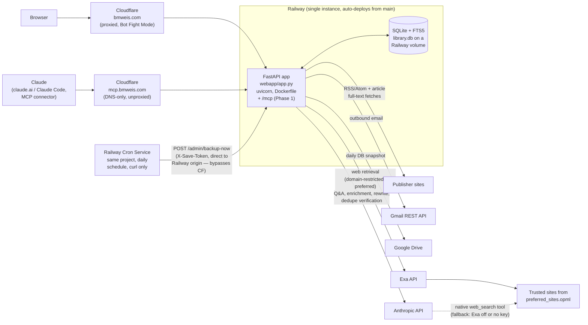

# Architecture

A living technical overview of CFO Navigator / bmweis.com, written for someone
seeing the codebase for the first time. It covers how the system is put
together and *why* it's put together that way — not a line-by-line tour.
Keep it current: see the **Documentation** section of `CLAUDE.md` for the
maintenance rules that apply to every PR.

## 1. System overview

The whole site is **one FastAPI monolith** (`webapp/app.py`) over **one SQLite
database** with FTS5 full-text search (`linklib/db.py`), running as a single
process on Railway. All HTML/CSS/JS is inline in Python strings — there is no
template framework and no frontend build step. The public face (bio, thought
leadership, CFO Toolbox, contact) needs no login; a signed-cookie login gates
the member tools (article archive, feed reader, FP&A Buddy) and a ~40-page
admin back office. Railway auto-deploys from `main` (all changes ship via PR),
the database lives on a Railway volume so it survives deploys, and Cloudflare
sits in front of Railway serving the `bmweis.com` domain.



Notes on the edges:

- **Cloudflare** is infrastructure outside this repo — nothing in the codebase
  references it; its config lives in the Cloudflare dashboard. Current setup
  (verified July 2026): both `bmweis.com` and `www` are **proxied** (orange
  cloud), so Cloudflare is on the request path, not just DNS. SSL/TLS mode is
  **Full** — deliberately not Full (strict), per Railway's guidance about cert
  renewal windows. No custom cache rules or WAF rules and no edge rate
  limiting (stock defaults — HTML isn't cached, so the app's
  `/admin/*` `no-store` behavior is unaffected); **Bot Fight Mode is on**.
  Always Use HTTPS and HSTS are enabled (max-age 6 months, includeSubDomains,
  preload deliberately off). One edge **Redirect Rule** 301s
  `www.bmweis.com/*` → `bmweis.com/$1`, which wins over the app's
  canonical-host middleware for proxied traffic — the middleware still covers
  the legacy `*.up.railway.app` hostname and any traffic that reaches the
  origin directly.
- **The Railway origin is publicly reachable** (`*.up.railway.app` still
  serves, and Railway has no built-in IP allowlisting), so direct requests
  bypass every edge protection — the redirect rule, Bot Fight Mode, HSTS.
  This is an **accepted risk**; the only real fix would be a Cloudflare
  Tunnel, which isn't implemented. Consequence for app code: only
  `CF-Connecting-IP` (set by Cloudflare on proxied requests) is a trustworthy
  client IP — `X-Forwarded-For` can be spoofed by anyone hitting the origin
  directly (see Known limitations).
  **This is also why the daily backup trigger (originally `.github/workflows/backup.yml`,
  now a Railway Cron Service — see below) deliberately targets
  `cfo-navigator-production.up.railway.app`, not `bmweis.com`:** the
  first live run against `bmweis.com` got a `403` from Cloudflare's Bot
  Fight Mode before the request ever reached the app (confirmed via the
  app's own auth path, which returns `401` for a bad token, never `403` —
  so this wasn't the app rejecting the token). Cloudflare was never meant to
  gate this one authenticated backend-to-backend call — `X-Save-Token`
  remains the actual auth boundary either way — so the trigger routes around
  the CDN on purpose rather than trying to carve out a Bot Fight Mode
  exception for a rotating set of runner/caller IPs. This is the first
  deliberate consumer of the "accepted risk" above, not an accident.
- **`mcp.bmweis.com` (Phase 1) is a second custom domain on the same Railway
  service, deliberately configured differently from the apex.** Its
  Cloudflare DNS record is **DNS-only (unproxied, "grey cloud")**, not
  proxied like `bmweis.com`/`www` — so Bot Fight Mode, the edge Redirect
  Rule, and every other Cloudflare-layer behavior above never touch MCP
  traffic. This is a deliberate choice, not an oversight: MCP clients are
  automated, non-browser HTTP callers by definition, and Bot Fight Mode
  exists specifically to challenge exactly that kind of traffic — the same
  reasoning that already sent the backup cron around Cloudflare entirely
  (see below) applies here, just via a DNS-level bypass instead of a
  same-origin one. Railway terminates TLS for this domain the same way it
  does for the apex. App-side, this only required one thing: making sure
  the existing canonical-host-redirect middleware — which otherwise 301s
  *every* non-canonical hostname to the apex — treats `mcp.bmweis.com`
  specially (serve `/mcp` and `/health` directly, redirect everything else
  to the apex rather than shadow-mirroring the whole site) instead of
  either redirecting `/mcp` away (which Cloudflare's Bot Fight Mode would
  then 403, the exact silent-failure shape the backup cron already hit
  once) or serving the full public+admin site on an MCP-branded subdomain.
  See the "MCP server" flow section below for the auth model and mount
  mechanics; see CLAUDE.md's MCP bullet for the full write-up.
- **The volume path** is Railway configuration, not code: the app reads
  `LINKLIB_DB` (default `./library.db`); production points it at the mounted
  volume. The DB is deliberately not in git — it's personal reading history.
- **Web retrieval never leaves the allowlist, whichever mechanism handles
  it.** `preferred_sites.opml` (the same file that drives the `/feed`
  reader) restricts both paths: Exa's `includeDomains` on the preferred
  path, and `allowed_domains` on the native `web_search_20250305` tool on
  the fallback path. Exa — a direct `/search` API call from
  `linklib/agent.py` (`retrieve_exa`), not an Anthropic-hosted tool — is
  preferred whenever the `exa_enabled` setting is on and `EXA_API_KEY` is
  set (Phase 2's migration, later made toggleable in Phase 7). Otherwise
  Claude's native tool (Anthropic-hosted, restored in Phase 7 after Phase 2
  had removed it outright) steps in instead. Exactly one of the two runs
  per question — see `linklib.agent._web_provider` for the unified
  condition, and `/admin/system/ai` for the toggle and its connection
  test.
- **Email is the Gmail REST API, not SMTP** — Railway's Hobby plan blocks SMTP
  ports. Every send is best-effort and must never block the underlying DB
  write; failures land in the `email_failures` table and surface as an admin
  badge instead of dying in a log. At the DNS level (Cloudflare-managed) the
  domain has SPF and DKIM in place, plus DMARC in `p=none` monitoring mode —
  collecting reports, not yet enforcing.
- **The daily (bumped from weekly, 2026-08) Drive backup is triggered by a
  Railway Cron Service in the same project (migrated off GitHub Actions,
  2026-08).** A small standalone cron service calls `POST
  /admin/backup-now` on a daily schedule (`X-Save-Token` auth, same as
  RUNBOOK.md's manual curl example) — this is Phase O's fix for the
  original mechanism (`linklib.backup.maybe_backup`, debounced and only
  fired as a side effect of ~18 admin/save routes in `webapp/app.py`) never
  getting a reliable weekly opportunity to run in practice. The trigger was
  originally a scheduled GitHub Action, moved to Railway Cron after the
  Action's schedule silently stopped firing for 9 straight days during a
  GitHub Actions billing/spending-limit outage unrelated to Railway or this
  app — see the "backup trigger" bullet further down for the full
  migration write-up and the exact cron command. Those ~18 call sites are
  unchanged and still fire opportunistically as a harmless bonus trigger.
  Every attempt from either path — success or failure — is logged to the
  `backup_log` table (see the Site operations table below) and surfaced on
  `/admin/library-backup`'s status banner + history table; the cron
  service's own run history in the Railway dashboard is a second,
  independent signal that catches the case where the site itself is
  unreachable and there's no in-app record at all.

## 2. Database

**There is exactly one database for the whole app: a single SQLite file,
`library.db`** (path configurable via `LINKLIB_DB`), containing every table
the app uses — content archive, FP&A Buddy, accounts, the entire CFO Toolbox
(including Communities), site operations, and the `/play` game. There is no
separate database for any one feature — in particular, **Communities
(`communities`, `community_categories`, `community_profiles`,
`community_gap_submissions`, `community_profile_views`) lives in this same
`library.db` file, in the same tables list below, not a database of its own.**
Every table in the file, grouped by feature area:

| Group | Tables |
|---|---|
| Content spine | `articles`, `articles_fts`, `articles_vec`, `article_embeddings`, `enrichment_cost`, `library_queue`, `dedupe_decisions`, `read_later`, `content_refetch_log`, `url_correction_log` |
| FP&A Buddy (Ask) | `ask_questions`, `ask_feedback` |
| Chat Matchmaker | `matchmaker_questions` |
| Accounts | `users`, `password_reset_requests`, `api_tokens` |
| CFO Toolbox | `tools`, `tool_categories`, `tool_audit_log`, `benchmarks`, `tool_leads`, `communities`, `community_categories`, `community_audit_log`, `community_profiles`, `community_gap_submissions`, `community_profile_views`, `field_reviews`, `narrative_review_log` |
| Thought Leadership | `thought_leadership`, `original_content` |
| Site operations | `settings`, `contacts`, `email_failures`, `archive_audit_log`, `contact_audit_log`, `backup_log`, `integrity_check_log`, `job_run_log` |
| "Sail, Don't Row" (`/play`) | `game_rank_settings`, `game_runs` |

`linklib/db.py` defines and migrates all of it — the `Library` class is the
only write path. The schema script runs on every boot (`CREATE TABLE IF NOT
EXISTS`) followed by an **additive-only migration list** of `ALTER TABLE ADD
COLUMN` statements that ignore "already exists" errors. There are no declared
foreign-key constraints — relationships below are by convention (`user_id`,
`tool_id`, `item_id` columns), enforced in code.

**`/admin/system/database`** (System nav group) renders a live Mermaid ER
diagram of this same schema — table names, key (PK/FK) columns, and row
counts — generated by introspecting `sqlite_master`/`PRAGMA table_info` at
request time, never by parsing this document. It's a self-updating visual
complement to the tables below, not a replacement for them: summary-level
only, and since this schema has no real `FOREIGN KEY` constraints, the
relationship lines it draws come from a small hand-maintained map
(`_DB_RELATIONSHIPS` in `webapp/app.py`) that mirrors the "by convention"
relationships described in this section — update both together. FTS5's and
sqlite-vec's shadow tables (`articles_fts_data`/`_idx`/`_docsize`/`_config`,
`articles_vec`'s equivalents) are filtered out of the diagram since they're
SQLite implementation detail, not schema.

The diagram's click-to-expand modal (`_diagram_lightbox_html` in
`webapp/app.py`, shared with the FP&A Buddy flowchart below) got real
pan/zoom in a Phase I follow-up, after direct testing showed a bigger
static view alone didn't solve anything — individual table fields on the
~39-table diagram stayed illegible even fully expanded, because the
problem was density/layout, not size. Pan/zoom/fullscreen-style navigation
is `svg-pan-zoom` (CDN script, MIT, same no-build-step pattern as
Cropper.js and Mermaid itself) wrapping the already-rendered SVG. The
modal also carries a search box: typing a table name finds its erDiagram
entity node (`g[id^="entity-{name}-"]`, matched by stripping non-
alphanumeric characters the same way Mermaid sanitizes the id), gives it a
coral highlight border, and pans/zooms the view to center it — cleared
when the search box empties or the modal is closed. The FP&A Buddy
flowchart below gets the same pan/zoom but not the search box, since a
flowchart has no "find a table" concept.

The Content volume table below the diagram is grouped into collapsible
sections (same `<details class="admin-group">` disclosure the admin hub's
own nav groups use), collapsed by default — the flat 39-row table pushed
the diagram far down the page. `_TABLE_GROUPS` in `webapp/app.py` is the
grouping map; `_grouped_table_sections` buckets the live schema against
it and puts anything the map hasn't caught up with in a trailing "Other"
group rather than dropping it silently. A separate "Cost & spend" section
with dollar totals for `enrichment_cost`/`manual_overhead` used to live on
this page too — removed as a duplicate of `/admin/overhead-spend`, which
already owns cost reporting; the page now just links there, and both
tables appear in the regular grouped listing with their row counts like
any other table.

**`/admin/system/page-index`** (System nav group) is the same live-introspection
pattern applied to routes instead of tables: on every page load it walks
`app.routes`, keeps GET routes whose `response_class` is `HTMLResponse`
(skipping POST-only action routes, redirect stubs, JSON/AJAX APIs, file
downloads, and other non-page endpoints), and reads each page's width tier
(`page-standard`/`page-form` as of PR 14's two-tier collapse, 2026-09 —
briefly `page-standard`/`page-content`/`page-form` after PR 13's three-tier
collapse, and `page-full`/`page-grid`/`page-form`/`page-admin` before
that), or "custom exception" for `/read` (the merged Reader shell —
see the Reader merge section below) — see BRAND.md §5 for the tier system
itself) straight from that route's own source via
`inspect.getsource` (following one hop into a directly-called helper function
when a route builds its body that way, e.g. `/play` via `_sdr_build_body`).
Any page route whose source carries no recognized tier class is flagged —
this is the actual point of the feature: it turns "did every page get
tiered," a one-time manual audit (Phase 9), into something that catches a
newly added, never-tiered page automatically. `_page_index_snapshot()` in
`webapp/app.py` is the single source; no maintained list of pages or tiers
exists elsewhere.

**Sitewide width pass (PR 12, 2026-09)** — `.page-full` narrowed 1900px →
1440px and `.page-admin` narrowed 1500px → 1400px, changing the two token
values rather than reassigning any page to a different tier (Brian's
complaint covered essentially every page on those tiers, not a scattered
subset, so one value change in one place was the right lever). `.page-grid`
(1300px) is unchanged — it was the one tier Brian pointed to as already
feeling right, and both other tiers moved toward it without merging into
it. `.reader-layout` (the standalone `/read/{article_id}` view's own
bespoke max-width, which deliberately tracks `.page-full`'s value even
though that page never uses the `.page`/`.page-full` classes — see the
`_PAGE_INDEX_CUSTOM_EXCEPTIONS` comment above) moved from 1900px to 1440px
in the same PR to stay in sync. `.page-full` and `.page-grid` were left
only 140px apart — close enough that PR 13 (below) went ahead and
collapsed them into one tier.

**Width-tier collapse, four tiers to three (PR 13, 2026-09)** — the 140px
gap PR 12 flagged as "close enough to collapse" is exactly what this PR
did: `.page-full` (1440px) and `.page-admin` (1400px) retire outright into
one **Standard** tier (`.page-standard`, 1300px — the old `.page-grid`'s
own value, which Brian had already confirmed felt right), a genuine
3-into-1 merge of `.page-full`/`.page-grid`/`.page-admin`, not a rename of
one survivor kept as an alias. `.page-grid` itself is gone too, folded into
the same `.page-standard` class. A new **Content** tier (`.page-content`,
900px) splits off from `.page-full`'s old audience for pages that are pure
long-form reading — About, the three ported thought-leadership articles
(Growth Engine Ratio, the AI Hackathon Playbook/Sail Don't Row piece,
Connecting Claude to NetSuite), the FP&A Buddy "how it works" explainer,
and `/ask/history`. Investigated first, per the PR's own gate: on every one
of those pages, everything outside the 760px `.tool-prose` reading column
is a back-link line, an eyebrow, or a diagram/table already capped
narrower than `.tool-prose` (a diagram lightbox pinned to 680px; a data
table inside its own `overflow-x:auto` scroll wrapper) — nothing on them
needs 1300px, so 900px was chosen as a little breathing room over the
reading column rather than a value anything on those pages actually
requires. `.page-form` (640px) is untouched — it already matched the
target "Form" tier by name and value. Every page that used to sit on
`.tool-inner` (FP&A Buddy chat, the GER calculator, Sail Don't Row + its
leaderboard, both matchmaker chat pages) moved from `.page-full` onto
`.page-standard` — a no-op in practice, since `.tool-inner`'s own 1300px
cap already equals Standard's value and was always the real binding
constraint on those pages. `/read/{article_id}`'s `.reader-layout` moved
onto `.page-standard` too, not the new Content tier: its two-column layout
(a 760px reading column plus a 220px sticky "On this page" TOC, joined by
a 40px gap) needs ~1020px of real headroom before any side padding —
Content's 900px would have forced the reading column to shrink below its
own 760px floor via the flex layout's `min-width:0`, exactly the measure
this page exists to protect. Admin data tables (the old `.page-admin`
audience) sit on the same 1300px Standard tier as everything else now, not
a dedicated wider tier — they already carry their own `min-width` floors
and `overflow-x:auto` horizontal scroll from PR 12, so a narrower shell
scrolls a wide table sooner rather than squeezing its columns; verified
directly against the widest admin tables (Users, with its column picker,
especially) at both 1300px and a 390px mobile viewport. `.tool-prose`
(760px) and its 16px body font are both untouched, per the standing
decision that settled them separately from this pass. **Recommendation,
not acted on in this PR**: Standard (1300px) and Content (900px) are far
enough apart that a case remains for collapsing to two tiers rather than
three — nearly everything Content covers renders entirely inside the 760px
`.tool-prose` column regardless of the outer shell's width, so the visual
difference between the two tiers on any current Content page would likely
be imperceptible. It stays a separate tier for now on the judgment that a
homepage-style hero/sidebar grid genuinely wants more width than a pure
reading page does, and conflating the two removes a distinction that might
matter to a future page — see BRAND.md §5's own "Open question" note.
`webapp.checks`' page-index (above) had its `_PAGE_TIER_RE`/
`_PAGE_TIER_LABELS`/`_PAGE_INDEX_CUSTOM_EXCEPTIONS` updated to the new
three-class set in the same PR, so it correctly recognizes every page's new
tier rather than flagging the whole site as untiered.

**Width-tier collapse, three tiers to two (PR 14, 2026-09)** — PR 13's own
"Recommendation, not acted on" above turned out to be right, and PR 14
acted on it: Content is retired outright, every page that used
`.page-content` now uses `.page-standard`, and `.page-content` is deleted
from the CSS entirely — no alias, no rename kept as a fallback. This isn't
a judgment call reversed on a whim; it's PR 13's own investigation taken to
its conclusion. On every Content-tier page (About, the three ported
thought-leadership articles, the FP&A Buddy explainer, `/ask/history`),
essentially nothing lives outside the 760px `.tool-prose` reading column —
a back-link line, an optional tag, a byline, at most a couple of short
lines. A tier that changes the width of a few short lines of text and
nothing else isn't a tier. Screenshots at 1280px and 1920px for About and a
long-form article, before and after, confirmed the reading column
(`.tool-prose`) is pixel-identical — only the outer shell's unused margin
changed, exactly as the investigation predicted. `webapp.checks`' page-index
had `_PAGE_TIER_RE`/`_PAGE_TIER_LABELS`/`_PAGE_INDEX_CUSTOM_EXCEPTIONS`
updated again, to the final two-class set. See BRAND.md §5 for the full
tier table and the historical-value narrative sections elsewhere in this
document (e.g. the FP&A Buddy explainer's own width-tier fix, and the
Homepage Restructure bullets in CLAUDE.md) for context on what each page's
width was **at the time it was written** — those numbers describe the
state as of their own PR, not the current value; BRAND.md §5 is the one
place that always reflects today's actual numbers.

**FP&A Buddy page redesign (PR 17, 2026-09)** — get-to-the-point copy,
a two-column top section, a reordered post-Ask sequence, and the last
`.tool-inner` wrapper on this page removed as a dead no-op. The bottom
"What FP&A Buddy can do" bulleted explainer box is retired outright: three
of its five bullets restated content already on the public
`/tools/fpa-buddy/how-it-works` explainer, so keeping both was the kind of
duplication the standing "less and simpler" rule exists to catch. Its two
non-duplicated facts (conversation memory, feedback-driven improvement)
were triaged rather than dropped wholesale, per Brian's own call: memory
earns a clause in the new top intro, because it changes what question
someone should even type first; the feedback-driven-improvement claim does
not, since it's a statement about the product's trajectory rather than
something the reader can act on right now, and it's already visible
in-product via the feedback buttons. The intro itself
(a fixed, Brian-authored 1-3 sentence block — not the tile blurb text the
build brief mistakenly assumed already existed verbatim on this page) sits
in a `.fpa-intro-layout` CSS Grid built with `grid-template-areas` rather
than plain source order — the only way to give desktop and mobile
genuinely different visual placements of the same DOM children with no JS
and no `order` property. Desktop stacks description → usage line →
Question box down the left column (named areas `intro`/`usage`/`question`)
so the input sits above the fold, while the illustrative example
(`example`) spans that whole column height on the right — reusing the
`.ask-example`/`.ask-q-bubble`/`.ask-answer` markup the real, live
question/answer thread renders with lower on the page, scaled down via
selectors scoped to `.fpa-intro-area-example` only so the shared classes'
real live-thread sizing is untouched. Mobile collapses the same grid to a
single `intro`/`example`/`usage`/`question` column — the exact order this
page already used before the redesign, kept because it already read well;
`grid-template-areas` is what let that order survive the desktop
restructure with zero DOM reshuffling. Below the grid, Sources/Depth/Ask
stayed exactly where they were; only "Search past questions" moved, from
above the Question box to below the Ask button — order below the button is
now Ask → Past questions → Recent conversations, not Ask → Recent
conversations with Past questions stranded above the form. The page's
back-link changed from `/` ("← Home") to `/tools` ("← Toolbox"), matching
every other Toolbox directory/tool page's own back-link convention (it was
the one holdout). `.tool-inner` itself is untouched as a class — GER
calculator and Sail, don't row + leaderboard still use it for a real
reason (see the width-tier passage above and BRAND.md §5) — only this one
page's own wrapper `<div>` was removed, since `.tool-inner`'s 1300px and
`.page-standard`'s 1300px have been identical since the PR 13 tier
collapse, making it a pure no-op on this page specifically once nothing
else needed a bounded card-grid width for the game/calculator use case
FP&A Buddy doesn't have.

**Same PR, round 2 — live review found ~350px of dead space under the
left column at desktop width, since three sentences and a Question box
can't fill the height a full mocked conversation needs.** Per Brian's
direct feedback: pulled Sources, Depth, and the Ask button into the SAME
left column, as two more `grid-template-areas` rows (`controls`, `action`)
with a literal `.` placeholder in the right-hand cell — the empty cell is
what keeps `example`'s spanning box confined to exactly the intro/usage/
question rows, rather than stretching down the full left-column height.
That confinement is also what makes the edge-alignment fix below possible:
if `example` spanned all five rows, "align its bottom with the Question
box" wouldn't even be a coherent request, since the Question box would
just be one of several items inside a taller shared span. Sources (3
chips) and Depth (3 buttons) share `.ask-controls`' existing 1fr/1fr
split everywhere else on the site, but at this column's ~600px width that
leaves each side only ~280px — plenty for Depth's three short buttons on
one line, tight enough that Sources' longer chip labels ("Web search
(trusted sites)") wrap to two ragged lines. Measured both ways before
deciding (a real screenshot comparison, not a guess): stacked (Sources
above Depth, one column) reads cleaner, so `.fpa-intro-area-controls
.ask-controls{grid-template-columns:1fr;}` overrides the shared rule
unconditionally, not inside a media query — this container is narrower
than `.ask-controls`' own 640px mobile breakpoint regardless of the real
viewport, so the same override is correct on both the desktop two-column
layout and the mobile single-column stack. Mobile's own
`grid-template-areas` gained `controls`/`action` as two more single-column
rows, in the same position they already occupied in this page's pre-
redesign source order — no visual change on mobile at all, confirmed via
`getBoundingClientRect()` y-ordering showing the identical
`intro → example → usage → question → controls → action` sequence before
and after this round.

The example-card/Question-box bottom-edge misalignment (~30px, close
enough to read as a mistake) turned out to be free to fix, not a
magic-number job: `align-self:stretch` on both the `question` and
`example` grid items (removing the blanket `align-items:start` the
container had) makes each item fill its assigned row(s) exactly, and
`display:flex` + `flex:1` on the actual visible cards inside each wrapper
(`.ask-card`, `.ask-example`, plus their innermost growable child —
the `<textarea>` and `.ask-answer` respectively) makes the visible
borders fill that stretched space rather than stopping at their own
content height. The mechanism that closes the gap without any hardcoded
value: `example`'s spanning area is naturally taller than the
intro/usage/question rows combined (the mocked conversation has more
content than three lines of prose), and CSS Grid's own auto-sizing
algorithm grows the LAST row a multi-row item spans — `question` — to
absorb that difference, which is exactly the row the Question box also
lives in. Verified with real `getBoundingClientRect()` measurements at
1280×1400 and 1920×1400, not eyeballed: question-box bottom and
example-card bottom landed at the identical y-coordinate, **0.0px diff**,
at both widths.

**Same PR, round 3 — round 2's stacked-and-narrowed Sources/Depth/Ask
traded one problem for another: the dead space moved from under the left
column to beside it.** Confining the whole Ask form to the ~600px left
column (round 2's fix for the earlier ~350px gap) meant Sources/Depth/Ask
never used the ~450px the example card's own wider column left unclaimed
under it — full width was never the actual problem; the mismatched left
edge round 2 was originally fixing was. Reverted the controls/action rows
back to spanning both grid columns (`"controls controls"`/`"action action"`
in `grid-template-areas`, replacing round 2's `"controls ."`/`"action ."`)
— `example`'s own spanning area is set by which rows it's *listed against*
in the template, not by what the controls/action rows do, so widening those
two rows to the full grid doesn't reopen the round-1 dead-space problem or
disturb the edge-alignment fix directly above; both keep working unchanged.
Because column 1 of the two-column grid starts at the same x-coordinate
regardless of how many columns a given row spans, `.fpa-intro-area-controls`
and `.fpa-intro-area-action` still open flush with the Question box's own
left edge above them — confirmed via `getBoundingClientRect()`, `0.00px`
left-edge diff at both 1280px and 1920px — while now running the form's own
full natural width instead of being squeezed into a ~280px-per-column
sub-split. The round-2 override forcing Sources/Depth into one stacked
column (`.fpa-intro-area-controls .ask-controls{grid-template-columns:1fr}`)
is removed outright, letting `.ask-controls`' own shared 1fr/1fr split
render exactly as it does everywhere else this component is used — at
1920px the three Sources chips fit one line and sit genuinely side by side
with Depth; at 1280px Sources wraps to two lines while Depth's shorter
column still renders one, an asymmetry confirmed identical against
`origin/main`'s pre-PR-17 markup for this exact shared component (`.ask-
controls`/`.ask-tags` CSS byte-for-byte unchanged there), not something
this PR introduced or is scoped to redesign.

The second ask — tightening the ~60px gap between the Depth row and the
Ask button — was genuinely a round-2 artifact, not a property of this
component: round 2's stacked layout summed `.ask-controls`' own 20px
bottom margin, the grid's 16px row-gap, and `.ask-action-row`'s own 22px
top margin into one visually continuous ~58px gap. `.fpa-intro-area-
controls .ask-controls{margin:0;}` and `.fpa-intro-area-action .ask-
action-row{margin:0;}` (both components have exactly one call site each,
confirmed by grep before zeroing their margins) leave only the grid's own
16px row-gap between every row in this section — verified directly: at
1920px, where Sources renders on one line, the measured gap from Depth's
row to the Ask button is 16.5px, matching every other row-gap on the page.
At 1280px the same gap measures ~57.5px, but that's the pre-existing
Sources-wraps-to-two-lines asymmetry from the paragraph above showing back
through (Depth's column finishes a full "wrapped line" earlier than
Sources' does, and the shared grid row's height is set by the taller
column) — not unresolved margin stacking, and not something a per-row gap
value can fix without either reflowing Sources' own chip labels or
un-pairing Sources/Depth from a shared grid row, neither of which was
asked for or in scope here.

**Same PR, round 4 — Sources and Depth stop sitting side by side; they now
stack, per Brian's direct feedback that a left/right split reads as two
separate decisions rather than one sequence.** Both are the same *kind* of
setting (a source-list choice, a depth choice), so splitting them across the
row made the eye travel left, then right, then back left for Ask — three
direction changes for what should read as one continuous list: Sources,
Depth, Ask. Fixed with a second scoped override on the same selector round 3
already used to zero `.ask-controls`' own margin —
`.fpa-intro-area-controls .ask-controls{grid-template-columns:1fr}` — rather
than editing `.ask-controls`' own shared 1fr/1fr rule, since that component
has exactly one live call site on the whole site (confirmed by grep) but a
future page could still reuse its side-by-side default. This single-column
override also happens to be what closes the chip-wrapping problem round 3
reported and left unresolved: at the page's full ~1300px width (vs. round
2's ~600px half-column), all three Source chips — including "Web search
(trusted sites)", deliberately kept un-shortened since the trusted-sites
qualifier does real work — fit on one line; confirmed live via
`getBoundingClientRect()` on every chip: one distinct `y` value at both
1280px and 1920px, where round 2's narrower column produced two.
`.ask-controls`' own default row-gap (20px, from its `gap:20px 28px` shared
rule) already matches "the ~20px spacing used elsewhere in this control
stack" once the column count drops to one, so no additional gap override
was needed — confirmed at exactly 20.0px between Sources and Depth at both
widths. Depth-to-Ask stayed at the grid's own 16.5px row-gap (round 3's
fix, unchanged by this round) rather than also being forced to 20px, since
that gap belongs to a different rule (the outer `.fpa-intro-layout` grid's
row-gap, not `.ask-controls`' internal gap) and the ask only named the
Sources-to-Depth spacing specifically. Left-edge alignment with the Question
box (0.00px diff) and full-width sizing were unaffected, both already
established by round 3's `"controls controls"` full-span change. Verified
at 1280px/1920px (stacked, full width, aligned, one-line chips) and 390px
(mobile's own single-column `grid-template-areas` stack was already
unaffected by anything inside `.fpa-intro-area-controls`, confirmed via the
same y-ordering check as every prior round — `intro → example → usage →
question → controls → action`, no horizontal overflow).

**Same PR, round 5 — chip labels shortened, and chips within each row made
equal width.** Source labels changed from "My saved archive"/"Current RSS
feed"/"Web search (trusted sites)" to "Saved archive"/"RSS feed"/"Trusted
web" — the top intro copy already establishes these are Brian's own
sources, so the chips no longer need to repeat "My"/"Current," and
"Trusted web" keeps the trusted-sites qualifier (deliberately not shortened
to a bare "Web") while dropping the parenthetical. No test asserted the old
label strings (confirmed by grep before renaming). Equal widths within each
row — Sources' three chips match each other, Depth's three match each
other, the two rows independent — via `.fpa-intro-area-controls .ask-
tags{display:grid;grid-template-columns:repeat(3,1fr)}` plus `width:100%`
on `.ask-tag` (a flex/inline-flex item doesn't stretch to its grid cell by
default the way a block element would). Scoped the same way every other
round-4-and-earlier override on this page is scoped — `.ask-tags` has
exactly two live call sites, both on this page (Sources, Depth), confirmed
by grep — rather than editing the shared flex-wrap rule other pages might
one day reuse. Verified equal at both 1280px and 1920px (405.3px/412px per
chip, exact match within each row) with no wrapping at either width.
**Flagged, not silently fixed**: at 390px mobile, equal-width sizing forces
the two-word Source labels ("Saved archive," "Trusted web") to wrap to a
second line (chip height doubles, 15px → 30px) — Depth's single-word labels
(Quick/Standard/Deep) stay single-line at that width. Confirmed this reads
cleanly in a real screenshot (uniform chip height, no overflow,
`document.body.scrollWidth` still exactly 390) rather than looking broken,
and the mobile stacking order (`intro → example → usage → question →
controls → action`) is unaffected — but it's a real change from the
previous single-line flex-wrap layout, reported per the standing "flag
what equal widths cost" instruction rather than assumed acceptable.

**Same PR, round 6 — chips revert to natural width (round 5's stretch-to-
fill was a misread of the actual ask), the ~110px gap above the Question
box closes to 20px, and Ask-before-Past-questions is confirmed correct with
no change.** The real ask all along was equal width *within* a group, sized
to that group's own widest label, left-aligned — not full-width. Round 5's
`grid-template-columns:repeat(3,1fr)` + `width:100%` on `.ask-tag` is
reverted; `.ask-tags`' own default `display:flex;flex-wrap:wrap` (zero
override) already gives each chip its natural content width. A new
`fpaEqualizeChipWidths()` (called once on page load, alongside
`updateEstimate()`/`loadRecent()`) then measures every chip's real
`getBoundingClientRect().width` within each `.ask-tags` group and applies
the group's max as a fixed `width` to all its siblings. This is a genuine
JS-only requirement, not a missed CSS trick: there is no pure-CSS way to
size N flex/grid siblings to the widest one's *natural* content width
without either stretching every sibling to fill the container (round 5's
approach) or duplicating the widest label's text into every cell just to
force a matching intrinsic size. Measuring in the browser also sidesteps a
hardcoded-pixel-value risk this repo has hit before (see the standing
`capture_homepage()`/Google-Fonts sandbox limitation note elsewhere in this
doc) — a value measured in this sandbox's font-loading-impaired headless
Chromium might not match a real browser's DM Sans metrics; measuring live
in whichever browser actually renders the page has no such gap. Verified:
Source chips 149.2px each (all three, matching "Saved archive"'s own
natural width), Depth chips 113.4px each (matching "Standard"'s), identical
at 1280px, 1920px, and 390px — since chip width is font/text-driven, not
viewport-driven, one run on load covers every breakpoint.

The ~93-110px gap fix needed real debugging, not a one-line CSS change, and
surfaced a genuine CSS Grid subtlety: `example` spans three rows
(`intro`/`usage`/`question`) via `grid-template-areas`, and when its own
content (a full mocked conversation) is taller than those three rows'
combined natural height, the leftover growth is NOT confined to the
last-spanned row by default the way round 2's own explanation above assumed
— every plain `auto` row the item spans shares the excess. A first fix
attempt, `grid-template-rows:max-content max-content auto auto auto`
(intended to cap `intro`/`usage` at their own content height and force all
overflow onto the `1fr`-free `question` row), measured **zero effect**
live — confirmed independently in an isolated standalone test file
(`grid_test.html`, loaded directly via `file://`, no app code involved)
reproducing the same three-row-span structure: the same failure
(`186px 132px 150px` — rows 1 and 2 still inflated) reproduced there too,
ruling out any interaction with this page's other CSS. Root cause, per the
CSS Grid spec's own "distribute space beyond growth limits" fallback step:
once every spanned track has hit its growth limit and space still remains
unaccounted for, ALL of them — even ones capped at `max-content` — grow
further to absorb the remainder; `max-content` only bounds the earlier
"resolve intrinsic sizes" pass, not this later fallback pass. The fix that
actually works, confirmed in the same isolated test before touching the
real page: make `question`'s own row `1fr`
(`grid-template-rows:auto auto 1fr auto auto`) rather than `auto` or
`max-content` — a flexible (`fr`) track is sized in a separate, later
distribution pass reserved for absorbing leftover space, so it's the
correct mechanism whenever one specific spanned track (and only that one)
needs to swallow an oversized item's overflow. Alone, this dropped the
gap from ~93px to 32px — the residual being two genuine 16px structural
row-gaps bracketing the `usage` row, which renders completely empty for a
signed-in admin session with no cap tracked (`usage_html == ""`). Closed
the rest by treating that emptiness as a fact to act on rather than a
number to fudge: `usage_html`'s div, its `grid-template-areas` entry, and
its `grid-template-rows` slot are now all omitted together (new
`usage_div`/`_intro_areas_desktop`/`_intro_rows_desktop`/
`_intro_areas_mobile` Python variables, computed once right after
`usage_html` itself) whenever `usage_html` is empty, on both the desktop
and mobile area strings — and `.fpa-intro-layout`'s own `row-gap` moved
from 16px to 20px, deliberately reusing round 4's own already-established
Sources→Depth spacing value (the ask's phrase "the same spacing used
elsewhere in the form" pointed straight at that number, not a fresh pick).
Net result: the gap measures exactly 20.0px at both 1280px and 1920px.
Bottom-edge alignment between `example` and `question` (round 2's fix)
stayed at 0.00px throughout this round — the `align-self:stretch`/`flex:1`
mechanism was untouched by any of this. Ask-before-Past-questions needed no
code change at all — the render order already put Ask first; confirmed
directly by reading the template and re-verified live at all three widths.
Mobile (390px) re-verified end to end after every change in this round:
visual order `intro → example → question → controls → action` (`usage`
confirmed genuinely absent from the DOM via a direct element-presence
check — `document.querySelector('.fpa-intro-area-usage') === null` — not
just inferred from the CSS change), `document.body.scrollWidth` exactly
390 (no horizontal overflow), and Source chip widths still 149.2px/equal
across all three, since the JS-measured sizing is font-driven and therefore
identical regardless of viewport.

**Depth and Sources become two dropdowns (2026-10), superseding rounds 3 to 6's
chip rows and the follow-up bubble's popover.** Measured on a phone first: the
bubble's Sources popover was absolutely positioned above its pill, 342px wide
against a 342px bubble, so it ran 11px past the bubble's right edge and covered
the follow-up input and button; the top box's three equalized chips needed 463px
against a 342px column, so "Trusted web" wrapped. One component fixes both:
`#ask-dd-top` holds two buttons in one row (`Depth: Standard`, `Sources: 2 of 3`,
44px) and two `hidden` panels in page flow directly under that row at the row's
full width. The panels contain the same `.ask-tag[data-tier]`/`[data-source]`
buttons as before (restyled as list rows), so `selectTier`, `toggleSource` and
`activeSources()` are unchanged. Depth is single-select and closes on pick;
Sources is multi-select and stays open until a tap outside, Escape, or the other
button. The bubble holds a deep clone of `#ask-dd-top` (id removed, panels
closed), so a panel opens inside the bubble at bubble width, below the input row,
and cannot cover it. `ddLabels()` keeps every button's value in step. The chip
equalizer (`fpaEqualizeChipWidths`) and the `.ask-controls`/`.fu-pop` CSS are gone.
**Second change in the same PR, found by the existing tests:** the bubble's
collapse-while-typing rule moved from `.fu:has(textarea:focus)` to a `.fu-compact`
class (set on focus; cleared by a tap outside the bubble or on the summary line).
With the taller controls block, blur re-expanded the sticky bubble upward on
mousedown and the Ask follow-up button moved out from under the tap, so the
follow-up never sent. Tests: `tests/test_buddy_dropdown_controls.py`.

**Admin table width floors, standardized to four buckets (PR 14, 2026-09)**
— replaces the 22 hand-picked `min-width` values PR 12/PR 529 chose by eye
per table with four rule-based buckets keyed to default-rendered column
count (`_TABLE_FLOOR_NARROW` 480px for 2-3 columns, `_TABLE_FLOOR_MEDIUM`
640px for 4-5, `_TABLE_FLOOR_WIDE` 800px for 6-7, `_TABLE_FLOOR_XWIDE`
960px for 8+ — named constants in `webapp/app.py`, not repeated literals).
Most of the 22 tables landed cleanly on a bucket by column count alone; a
handful of documented exceptions keep a floor above what column count
alone would assign, because real content — not eyeballing — forces it:
the Software and Communities approved-list tables (`admin-table-responsive`,
820px/880px respectively) each carry a sticky Name column with its own
explicit `min-width` (220px/280px) plus a fixed 3-button Actions grid
(100px × 3 + gaps = 312px), summing to almost exactly their shipped value —
confirmed against the real rendered table, not estimated, so both keep
their precise PR 12 values rather than being forced into Wide or Xwide.
The Reader content-backfill's "Recent attempts" and "Needs manual review"
tables both pair a shared, explicitly fixed 420px Article column
(`_th_article`) with a genuinely unbounded free-text column (Detail / Last
failure), so both are assigned Wide rather than the Medium a naive column
count would give them; "Accepted as final" pairs the same 420px Article
column with a short categorical reason string, so Medium fits it fine,
unchanged from PR 12. One real bug, not just a re-bucketing, was found and
fixed in the same sweep: the Users admin list's `admin-table-responsive`
table was left at PR 12's 480px even though — unlike Software/Communities,
whose column picker defaults to showing only `review_status` alongside
the always-visible columns — `users_default_visible` shows **every**
optional column by default, rendering 11 real desktop columns squeezed
into a 480px floor. Fixed to the Xwide bucket (960px). The three
`admin-table-responsive` tables' existing `min-width:0!important` mobile
card-stacking override (keyed off the class, not any specific pixel value)
needed no change and was re-verified at 390px after the edits, not just
assumed to still hold.

**Admin table column widths, standardized by field type (PR 19, 2026-09)**
— the natural next step after the floor-bucket work above: a floor keeps a
whole table from squeezing itself too narrow, but says nothing about
whether an individual "Name"/"Date"/"Email" column is the same width from
one admin table to the next. Six named constants in `webapp/app.py`,
alongside `_TABLE_FLOOR_*` (`_COL_WIDTH_NAME`=280px, `_COL_WIDTH_EMAIL`=220px,
`_COL_WIDTH_DATE`=140px, `_COL_WIDTH_STATUS`=110px, `_COL_WIDTH_COUNT`=80px,
`_COL_WIDTH_VENDOR`=160px — added 2026-09 for a short vendor/company label (also the FP&A Buddy report's Asker username column, 2026-10),
deliberately narrower than `_COL_WIDTH_NAME`'s full-software/community-name
calibration)
are applied as plain `width:` hints on `<th>` elements whose own header text
literally names that field type, across roughly 30 admin tables (Contact
submissions, Toolbox intros, the Software/Communities pending-submission
tables, Third-party/Original content, Tag cleanup, the FP&A Buddy report,
Overhead spend's "All vendor charges" details table (Vendor column, since
2026-09) and CSV-preview tables, the Users table's
Email/Last login/Status columns, the email-templates reference table, and
the several near-identical CSV import/purge preview tables that all share a
"Line"/"Article"/"Why" shape). `_COL_WIDTH_NAME` reuses the exact 280px
value the Software/Communities sticky Name column already established
(PR 12/15); `_COL_WIDTH_DATE` is sized to a full "YYYY-MM-DD HH:MM"
timestamp, not just a bare date, since several of these tables render the
longer form. None of these tables use `table-layout:fixed` (the one that
does — Resources — is a documented exception below), so a `width:` here is
a starting hint, not a hard cap: real content wider than the hint still
grows the column instead of getting clipped, which is what makes it safe to
apply one shared value across tables with very different real content
without a truncation risk. A column holding a description, reason, URL, or
any other free-text value is deliberately left unwidthed, same as before —
every table still needs at least one flexible column to absorb the rest of
the row.

**Scope, corrected**: this standard applies to auto-layout ENTITY-LIST
tables — tables whose rows are named database entities rendered with plain
typed columns. A first pass at this documentation over-counted by treating
every table that doesn't use these constants as an "exception"; most of
them were never in scope to begin with, for one of two structural reasons
(see BRAND.md §5 for the full itemized list and code comments at each
site):

- **Fixed-layout tables use a different sizing mechanism entirely** — a
  `table-layout:fixed` table's columns are set by percentage or by its own
  named-class pixel widths, and can't sensibly mix either with these
  constants: Resources' percentage-width table (PR 11);
  `/admin/reader/feeds`'s `.ff-table`/`.fs-table` (own percentage widths,
  same reasoning); `/admin/library-backup`'s `.backup-log-table` (own
  small named-class pixel widths tuned to its 700px mobile-card
  breakpoint, found during a full-inventory sweep, not part of the
  original hypothesis).
- **Diagnostic and reference tables aren't entity lists** — the three pages
  reusing the Compare page's `.cc-table` class for a schema table name, a
  route path, or a model tier; the admin brand-showcase page's two
  illustrative component tables; the Reader content-backfill's three
  tables (a diagnostic worklist of fetch attempts, with an already-tuned
  420px `_th_article` Article column and shared `_th`/`_th_nowrap` style
  strings reused across genuinely different field types per column, not
  the simple per-field-type shape this standard covers); and the Software
  name-duplicate check's Tool A/Tool B tables (a diagnostic comparison
  report holding rich multi-line cell content, not a plain name string).

That leaves **two real exceptions**, both genuine entity-list tables this
standard does cover: Overhead spend's two narrow "By source"/"By month"
summary tables sit inside a `flex:1 1 460px` column whose own tight
`min-width` a 280px Name column would blow past; and the Users table's
Username column (no clean field-type match, always visible with no
`data-col`) is left unwidthed, while its Name/Email/Last login/Status
columns do use the shared constants — within the handful this standard's
own PR anticipated. The Software/Communities approved-tables' sticky
Name column was the origin case for 280px; since Refs 655 (B1) it is one
pinned `admin-sticky-col` that holds the checkbox as well as the name, sized
by `_COL_WIDTH_NAME_STICKY` (230px).

**`/admin/system/scripts`** (System nav group, Phase N) is the opposite design
choice from the two pages above — a static, hand-maintained registry
(`_SCRIPT_REGISTRY` in `webapp/app.py`), not a live-introspected one. Phase N's
investigation weighed scanning `scripts/` for structured docstring metadata
against a hand-maintained list and picked the latter: the recurring/diagnostic
script corpus is small (a dozen scripts) and changes rarely, so a static list is
cheap to keep honest, while scanning would need a new docstring convention
retrofitted onto every script plus ongoing discipline to keep it valid — more
mechanism than this corpus's size or churn justifies. Same precedent as
`_OPEN_SOURCE`/`/admin/open-source` (§5 below), which is also hand-maintained
reference content. Lists each script's purpose, cadence, required env vars, and
exact invocation, split into two buckets: "Recurring & actively useful" (run by
hand on their own cadence — logo/screenshot backfills, seeders, enrichment
backfills, the MCP server, `generate_brand_docs.py`, orphaned-category/community
reports) and "Reusable diagnostic" (built for one investigation but generalized
— `diagnose_cookie_banner.py`, `verify_screenshot_capture.py`). One-time
migrations and closed-investigation reports that already did their job live in
`scripts/archive/` instead (moved via `git mv`, history preserved) and are
deliberately excluded from this page. CLAUDE.md's Documentation section carries
the standing rule keeping the registry in sync: any PR touching `scripts/`
(new script, or a changed purpose/env var/invocation for an existing one)
updates this page in the same PR, and any PR that finishes a recurring script's
job archives it and drops its entry, also in the same PR.

**`/tools/fpa-buddy/how-it-works`** (added in the Exa migration's Phase 4 as
`/admin/system/how-fpa-buddy-works`; moved from the System nav group into
its own "FP&A Buddy" section in Phase 6; made public and moved off
`/admin/*` entirely in the explainer-page follow-up round) is a
plain-language technical explainer of FP&A Buddy's mechanism — retrieval
tiers (library/feed/web), the Quick/Standard/Deep effort tiers, citation
verification, the archive's own content pipeline, and the per-user dollar
cost cap — written for a technically comfortable reader (a PM, an
engineer, or a CFO) who wants the real mechanism, not marketing copy. It
plays the same reference-doc role `_COMMUNITIES_REFERENCE_HTML` plays for
the Communities feature, but as its own page rather than a collapsible
block on a working admin page, since explaining the mechanism IS this
page's whole purpose. Per-tier source counts read live from
`linklib.agent.EFFORT_SETTINGS` and the default monthly cap reads live
from `Library.get_default_ask_cap()`, so neither can drift out of sync
with the code the way a hand-typed number would; model names are
deliberately described qualitatively (fastest/balanced/most-capable)
rather than pinned to a canonical model ID, since those rotate
independently of this page. Phase 5 added a concept-level Mermaid
`flowchart` above the prose (question → library/feed/web → synthesis →
cited answer, no token counts or API names) — deliberately not the
developer-grade sequence diagram above, which stays the reference for
anyone debugging the actual request flow. Renders via the same
CDN-hosted `mermaid.min.js` used by `/admin/system/database`'s ER diagram,
not a new dependency. **Made public in the explainer-page follow-up
round**, per Brian's ask that the page be a showcase reachable by anyone
with the link (not linked from primary public nav, no `noindex`, same
discoverability tier as a thought-leadership sub-page). A pre-move content
audit found three admin-insider assumptions baked into the page and fixed
each: the "← Admin" breadcrumb (a public visitor has no admin access to
return to) became "← FP&A Buddy", matching every other public sub-page's
own back-link convention; the inline `/admin/exa-settings` (since
merged into `/admin/system/ai` — PR 10) and `/admin/users` links were
de-linked to plain prose ("the site admin"),
since a public reader would only ever hit a login wall on either; and the
`ARCHITECTURE.md` link was removed outright, since this repository is
private and the link 404s for exactly the outside audience the page is
now written for. The admin dashboard's FP&A Buddy card (`_FPA_BUDDY_TOOLS`)
now points at this same public URL instead of hosting a separate
admin-only copy — no route lives at the old `/admin/system/*` path
anymore. The "Which engine handled this answer?" and "Why the citations
can be trusted" callouts were also reformatted from dense paragraphs to
bold-lead-in bullets, matching the "Where an answer's sources come from"
list directly above them; and the flowchart's `Quick / Standard / Deep`
annotation node — previously a single dotted edge into `Claude` that
Mermaid's layout rendered as a box disconnected below the main flow — now
fans dotted edges into `Library`/`Feed`/`Web` (the same three tiers its
label actually describes), landing it as a peer of the question node
instead of an orphan; the diagram frame is also wrapped in a
`max-width:680px` container so it no longer stretches to the full page
column regardless of the SVG's actual rendered size. **Width-tier fix
(follow-up):** the page carried `.page-admin` (~1400-1600px per BRAND.md's
layout system at the time; the tier itself narrowed to ~1350-1450px in
PR 12, 2026-09) verbatim from the `/admin/system/*` template it was
originally built under, while every other `article-atlantic` long-form
page (Growth Engine Ratio, AI Hackathon Playbook, Connecting Claude to
NetSuite) pairs `article-atlantic` with `.page-full` (~1800-2000px at the
time; narrowed to ~1400-1500px in the same PR 12) —
`article-atlantic` itself carries no width of its own, so the mismatch
went unnoticed until the page was compared side by side with those. Fixed
by switching the outer class to `.page-full`, confirmed with a live
bounding-box measurement showing the `.tool-prose` reading column is now
identical in width and position to the reference page. (Both classes named
here are retired — `.page-full` and `.page-content` as of PR 13's
three-tier collapse, then `.page-content` itself as of PR 14's two-tier
collapse, 2026-09 — this page now renders on `.page-standard`, alongside
the three articles it was matched against.)

**CFO-audience rewrite (2026-09) — the page's copy, audience, and structure
were rewritten wholesale, not polished.** A read-and-report investigation
(before any copy was touched) confirmed the page's own opening sentence
named its audience as "a PM, an engineer, or a technically comfortable
CFO" — contradicting the site's standing audience decision (CFOs and
finance leaders, full stop), which the page had been written against the
wrong reader for since it shipped. Brian rewrote the copy himself; this
entry records what the rewrite actually cut and kept, since most of the
page's earlier build history above (the Mermaid flowchart's several
tuning passes, the callout-formatting round) now describes content this
page no longer carries. Cut entirely: the Mermaid retrieval-flow diagram
and its CDN script/`_FPA_FLOW_DIAGRAM` constant (a pipeline flowchart is
exactly the kind of mechanism-forward element a CFO-audience rewrite
exists to remove — nothing else on the site shares that CDN include, so
it left with no dependent); the "Which engine handled this answer?"
callout (Exa-vs-native-fallback now belongs to
`/how-this-is-built/web-search`, which covers all four Exa call sites, not
just this one, and this page links there instead of re-explaining it);
and the "Behind the archive" tool inventory (OpenAI's embedding model by
name, the Wayback Machine recovery chain, structured extraction,
self-checking at every layer — all real, none of it what a CFO reader is
on the page to learn). Kept exactly as before: `.page-standard` +
`article-atlantic`, the five-section `display:grid` container (content
reshuffled to fill it differently, but the count is unchanged),
per-tier source counts read live from `linklib.agent.EFFORT_SETTINGS`
(only the three prose blurbs changed, from describing models to
describing jobs — "a fast read on something you mostly already know"
instead of "fastest and least expensive model"), and the live default cap
read from `Library.get_default_ask_cap()` — **now printed inline again**
in "What it costs" ("currently $X by default") rather than dropped from
the copy silently, specifically so the DB call isn't a live read with
nothing displaying its result. New: a closing "What it won't do" section,
stating the citation-source limit and the model's instructed behavior
when sources don't cover a question as an honest boundary rather than an
implied guarantee. The old Title Case `### Quick, Standard, Deep` heading
became sentence-case `### How much effort to spend`, per BRAND.md §3.2.
Word count roughly halved (~1,400 to ~500). `tests/test_admin_how_buddy_works.py`
was rewritten to match — the diagram/callout-formatting tests from the
earlier rounds are replaced with tests confirming those elements are
gone, not merely restyled.

**Reading-column fix (2026-09 rider) — amends the "kept exactly as
before" claim above: the five-section `display:grid` container's
structural relationship to `.tool-prose` changed, though its content and
section count didn't.** Found during review of the rewrite above, not by
this rider itself: the sections grid (and, inside it, the tier table) was
a SIBLING of the intro `.tool-prose` div, not its descendant, so the whole
grid rendered at the full `.page-standard` content width (1232px at
1280px viewport) instead of the 760px reading column above and below it.
Measured directly, both this branch and `origin/main`, before touching
anything: byte-identical widths on both, confirming the misalignment
predates the CFO-audience rewrite entirely and was only surfaced by
review of this page — the same "found while reviewing something else"
shape as the mobile grid-track fix two entries up. `/how-this-is-built`
had the identical shape (its cards grid was a sibling of `.tool-prose`
too, fixed by merging the whole page into one `.tool-prose` wrapper so
the grid becomes its descendant — see `how_this_is_built()`'s own
docstring) — applied the same treatment here rather than a narrower fix
scoped only to the table, per the standing rule against unexplained
one-off exceptions to a problem that already has a documented solution.
The per-section `class="tool-prose"` on each `<section>` (redundant once
one wrapper spans the whole page, and never present on `/how-this-is-
built`'s own cards) was dropped, along with the tier section's own
now-redundant nested `.tool-prose` div around its heading/intro
paragraph. The mobile-safety `grid-template-columns:minmax(0,1fr)` from
the rewrite's own first rider is kept, not reverted to `/how-this-is-
built`'s plain `1fr` — that page's cards carry no `min-width` floor of
their own, but this page's table still does (`.cc-table{min-width:680px}`),
so the track-level fix is still load-bearing here. **One real, reported,
expected side effect, not a spacing regression**: the tier table's own
"What changes" column wraps onto two lines per row now that it's
correctly constrained to 760px (it fit on one line at the old 1232px
width), growing that section by 79px and shifting every section below it
down by the same 79px — verified every section-to-section gap is still
exactly 20px throughout, in both the pre- and post-fix layout, so the
`gap:20px` rhythm itself is unaffected; only the one resized section's own
height changed. See BRAND.md §5's new rule for the general standard this
established, now that the same structural mistake has shown up on two
separate pages.

**The Exa kill switch** (Phase 7; originally its own `/admin/exa-settings`
page, merged into `/admin/system/ai`'s Configuration section — PR 10): an
`exa_enabled` toggle (`settings` table, `Library.get_exa_enabled`/
`set_exa_enabled`, defaults on) plus a "Test connection" action that fires
one real, minimal Exa `/search` call and reports pass/fail — manual and
on-demand only, never a background job, via `linklib.agent.test_exa_connection`.
The card also flags when `EXA_API_KEY` isn't set on the host at all, since
that's an independent condition from the toggle and an admin could
otherwise be confused about why Buddy is using the fallback. Not persisted
to a cost ledger — the test's tiny real cost (via `compute_exa_cost`) is
only surfaced in the result, not written to a table, since it's a rarely-
used manual check rather than a per-turn or overhead cost.

### Content spine

| Table | Purpose | Columns that carry meaning |
|---|---|---|
| `articles` | The archive: ~1,500+ curated articles. **URL is the natural key** (`UNIQUE`, normalized) — upserts merge tags and fill empty fields, never duplicate. | `url`, `summary` (Claude-generated, the member-facing asset), `content` (fetched full text — internal input only, never served), `tags_json`/`tags_text` (structured list + flattened copy for FTS), `enriched`/`enrich_model`/`enrich_rules` (provenance), `in_scope`/`scope_reason` — **frozen, not dropped, as of PR 4 (2026-09)**: the enricher no longer judges audience fit at all (the archive is hand-curated one article at a time now, so this bulk-import-era pre-filter had nothing left to do; production had 0 flagged rows at retirement time) — always `1`/`''` going forward, kept for non-destructive-retirement reasons only. `needs_content_check`/`content_check_reason` (durability audit item 1: set by `ingest_url` right after a fresh fetch fails `extract.assess_extraction_quality()` — never blocks the save, only flags it; cleared by `set_article_content_html` the moment a later backfill succeeds), `is_own_content` (FP&A Buddy published-content ingestion, 2026-09 — a **provenance flag, not a ranking signal**; see "Published-content ingestion" under FP&A Buddy below) |
| `articles_fts` | FTS5 virtual table (`content='articles'`, porter tokenizer) over title/author/source/summary/content/notes/tags_text. | Kept in sync by three triggers (`articles_ai`/`_ad`/`_au`) on insert/delete/update — no manual reindex, ever. |
| `articles_vec` | `sqlite-vec` vec0 virtual table (#93) — one embedding vector per article, `rowid = articles.id` (same external-content-by-rowid idiom as `articles_fts`, minus trigger sync — see §4, "Hybrid retrieval..."). Powers the vector half of hybrid retrieval. | `embedding` (`float[1536]`, OpenAI `text-embedding-3-small`) |
| `article_embeddings` | Companion ledger table (#93): which articles are embedded, with what text, and at what cost. Also **an overhead-cost ledger** for embed-on-save/backfill spend — never summed into `ask_questions`, never counts toward a user's Ask cap. Its sibling ledger, `enrichment_cost` (#105), covers enrichment spend; the two stay separate rather than sharing a schema — see §4, "Embedding cost is split by who pays for it" and "Enrichment cost gets its own ledger, not a shared one" below. | `article_id` (PK), `content_hash` (of the exact embedded text — detects staleness after an edit), `model`, `input_tokens`, `cost_usd` |
| `enrichment_cost` | Overhead-cost ledger for `linklib.enrich.enrich()` calls (#105). Unlike `article_embeddings`, this is **append-only**, not upserted — an article can be enriched more than once (backfill force-reruns, a rules-version bump), and each call's real cost stays in history. `article_id` is nullable for enrichment that has no `articles.id` yet to attach to — every batch/regen generation script is the live example today; the Archive Queue's own pre-save enrichment (a candidate enriched before it was queued or promoted) used to be another, retired along with the queue itself (2026-09, PR 3) — either way the API call still cost real money even when the NULL-`article_id` row's source is never saved anywhere. | `id` (PK, autoincrement), `article_id` (nullable), `model`, `input_tokens`, `output_tokens`, `cost_usd` |
| `library_queue` | **RETIRED, frozen not dropped (2026-09, PR 3).** Used to be the staging area for proposed additions (RSS scan, sitemap backfill, reader submissions) — candidates arrived enriched-but-unsaved for review at `/admin/library/queue`, and promoting a row moved it into `articles`, preserving enrichment already paid for. A 2026-09-09 production query found 5,508 rows, 100% dismissed, 0 pending, 0 member submissions ever, dormant since 2026-06-28 — the archive now grows by 1-2 articles every few days via the bookmarklet, which doesn't justify an AI-enriched proposal/review pipeline. `linklib/queue.py`, `linklib/suggest.py`, every `Library` read/write method for this table, and every admin route/page for it are all gone from the codebase; the table stays, unread and unwritten, as the historical record of 5,508 real dismissal decisions — not reconstructible from anywhere else. `/library/submit`'s "suggest an addition" form no longer writes here either — it now sends Brian a plain email notification instead (see the "Archive save / enrichment pipeline" section's member-reader-submissions bullet below); he reads it and saves the article himself with the bookmarklet. | `url` (unique, same natural key), `origin` (`feed` \| `backfill:<source>` \| `submission:<who>`), `status` (`pending` \| `dismissed`) |
| `dedupe_decisions` | Curator verdicts on near-duplicate *pairs*, keyed by the sorted URL pair. Suppresses already-judged pairs from future scans and teaches the Claude verifier. | `pair_key` (unique), `verdict` (`dup` \| `distinct`) |
| `read_later` | Per-user private bookmark list, never shared or mixed into the archive. `content`/`content_html` (2026-08 follow-up) cache a save-time fetch the same way `articles` does — see the "Read Later content caching + manual refresh" write-up below — write-once-on-empty (never blanked by a failed re-fetch), replaceable via the per-item "Refresh" action (`Library.update_read_later_content`). | `user_id` + `url` (unique together — enforced by a post-migration index because the column arrived by migration) |
| `content_refetch_log` | Per-attempt audit trail for the Reader content-structure backfill (Phase 5b) — one row per `linklib.pipeline.backfill_article_content()` call, success or failure, shape mirrors `backup_log`. A re-run after a stop or crash adds new rows rather than overwriting old ones, so a flaky source's full history stays visible; `Library.content_refetch_failure_counts()` reads only the latest attempt per article so a since-fixed failure doesn't keep inflating the tally, and `Library.content_refetch_failure_domains()` groups the same latest-attempt set by URL host so a source-wide problem (one site blocking/throttling this tool) is visible as a cluster, not N identical-looking rows. No SQL-level FK to `articles` (same convention as `tool_audit_log`'s `item_id`). Also backs the "needs manual review" capped-retry tier (Phase 5b follow-up #2, see the write-up below) — `Library._manual_review_article_ids()` counts attempts per article *since its last `url_correction_log` row* (or ever, if never corrected). A THIRD `status` value, `'accepted'` (durability audit item 4), is the "accept as final" override — see the write-up below — and composes with `_manual_review_article_ids()` for free: that query already only looks at the most recent attempt and requires `status='failure'`, so an `'accepted'` row as the latest attempt drops the article out of the manual-review list without any change to that query; `articles_needing_content_backfill()`'s default scope and `count_content_backfill_remaining()` separately exclude the same latest-row-`'accepted'` set (`Library._accepted_content_ids()`) so the override also sticks against future automatic retries, not just the one list. | `article_id` (no FK), `status` (`success` \| `failure` \| `accepted`), `reason` (failure only, or copied from the prior failure onto an `accepted` row for display/undo: `paywall` \| `bot-challenge` \| `too-thin` \| `fetch-error` \| `defunct-service`), `detail` (for `fetch-error`: the specific `PageData.fetch_error` reason — an HTTP status, `timeout`, or a connection/SSL error string, from `extract._describe_fetch_error()`; for a Wayback or migration success, the URL actually used; empty otherwise), `source` (added via migration, default `'direct'`: `'direct'` \| `'wayback'` \| `'migration'` \| `'medium-fetch'` \| `'medium-search'` \| `'save'` — distinguishes a Wayback-archived-snapshot, known-domain-migration, Medium-platform-tier (`'medium-fetch'` for a direct Exa fetch of the article's own URL, `'medium-search'` for a search-by-title match — see the "Medium-platform tier follow-up" note in §3), or save-time (durability audit item 1 — `ingest_url` itself, not a backfill re-fetch) success/failure from a normal live-fetch success; see the "fetch reliability", "retry backoff", and "Medium-platform Exa fetch tier" notes in §3 below) |
| `url_correction_log` | Durable trace of every manual URL correction applied via the manual-review CSV import (Phase 5b follow-up #2) — per CLAUDE.md's "every production data change leaves a trace" rule. Written by `Library.apply_article_url_correction()`, one row per correction, `old_url` snapshotted immediately before the `UPDATE` (same precedent as `tool_audit_log`/`community_audit_log`). No SQL-level FK to `articles`. `admin_id` is nullable and always `NULL` today — this app has no per-admin accounts (a single shared secret), so the column is forward-looking only. | `article_id` (no FK), `old_url`, `new_url`, `source` (default `'csv-import'`), `admin_id` (nullable, unused today) |

### FP&A Buddy (Ask)

| Table | Purpose | Columns that carry meaning |
|---|---|---|
| `ask_questions` | One row per conversation **turn**; the single table behind all three surfaces (admin report, a user's own history, the member-public community view). | `conversation_id` (groups follow-up turns; `= str(id)` of the first turn) + `turn_index`; token columns for the answer call; `rewrite_input_tokens`/`rewrite_output_tokens`/`rewrite_cost_usd` for the follow-up query-rewrite call; `embed_input_tokens`/`embed_cost_usd` for embedding the retrieval QUESTION during hybrid retrieval (#93 — a **user-cap** cost, unlike `article_embeddings.cost_usd`, which is embed-on-save overhead); **`cost_usd` is the turn TOTAL (answer + rewrite + query embedding)** so every `SUM(cost_usd)` — the monthly cap, the reports — needs no special handling; `hidden_public`/`anonymized` affect only the community view; `citations_json` is the turn's **API-verified cited-source snapshot** (`[{n, title, url, type, article_id?}]` — `article_id` on library entries only; feed/web sources are transient, so the stored title/url *is* the record, never re-resolved); `stop_reason` (2026-10, migration-added, `TEXT NOT NULL DEFAULT ''`) is the answer call's API `stop_reason`; `'max_tokens'` means the answer was cut off by the token budget. Measurement only, no UI: `SELECT model, COUNT(*) FROM ask_questions WHERE stop_reason='max_tokens' GROUP BY model;`. `''` for every row before the deploy and for a turn whose call never completed. The same column exists on `matchmaker_questions`; enrichment/generation calls (no table of their own) log one `stop_reason=max_tokens call_site=...` WARNING per cut-off instead (`linklib/stop_reason.py`) |
| `ask_feedback` | Member ratings of individual answers — **one row per rated turn per user**, upserted on `(question_id, user_id)` so a changed rating updates in place. Feeds the `/admin/fpa-buddy/feedback` triage view and, later, a retrieval eval set (flagged questions + the rated turn's citation snapshot). Capture + triage only — feedback never mutates prompts or retrieval automatically. | `question_id` (→ `ask_questions.id`), `rating` (`helpful` \| `inaccurate` \| `not_helpful`), `comment` (optional "what was off?" free text), `updated_at` (`''` until first changed — the empty-string-sentinel idiom), `reviewed` (2026-09, migration-added — a manual admin "Mark reviewed" toggle on `/admin/fpa-buddy/feedback`, matching `community_gap_submissions.reviewed`'s own column name/type/default exactly; deliberately **not** auto-clear-on-view, same reasoning as that table — badges `/admin/fpa-buddy/feedback` via `Library.count_unreviewed_ask_feedback()`) |

Cost figures are computed from **real API token usage** at call time
(`linklib/pricing.py`) — never estimates. Cache writes are priced per TTL: `cache_creation_tokens` at the 5-minute rate, `cache_creation_1h_tokens` at the 1-hour rate.

**Published-content ingestion (2026-09) — Brian's own writing joins retrieval
by mirroring, not a fourth retrieval branch.** Before this, FP&A Buddy was
structurally blind to `original_content` (the 3 native `/thought-leadership`
pieces) and `thought_leadership` (the ~30 rows describing externally-hosted
work) — neither table was ever in the Library/Feed/Web retrieval path. Also,
bmweis.com can't be self-fetched (Cloudflare Bot Fight Mode blocks it), so a
URL-fetch-based ingestion path — the normal way an external piece gets into
`articles` — can't reach the 3 native pieces at all; `original_content.body_md`
is mirrored directly instead, never via HTTP.

`linklib/original_content_sync.py`'s `sync_original_content_article(lib,
item_id)` is the single call site both admin routes
(`POST /admin/thought-leadership/original/new`, `POST /admin/thought-leadership/original/{id}/edit`)
use, called synchronously right after the `Library` write — the same
"regenerate at the point of mutation" convention `Library.write_opml()`
already established for the OPML file, not a background job or a cron.
`original_content.mirrored_article_id` tracks which `articles.id` (if any)
currently mirrors a given piece, so a re-sync on edit is a direct, narrow
overwrite (`Library.update_mirrored_article` — title/url/content, never
`Library.upsert()`'s merge-into-existing-row semantics, which are correct
for an external re-fetch but wrong for a deliberate edit: the edit must
always win). A piece whose `body_md` is cleared back to `NULL` (card-
metadata-only, one of the three literal bespoke routes) has its mirror
deleted outright (`Library.delete_article`) rather than left orphaned — the
delete route cascades the same way. `plain_text_from_body_md()` renders
`body_md` through the identical `python-markdown` pass the public page uses
(`_OC_MARKDOWN_EXTENSIONS`, duplicated in `original_content_sync.py` since
`linklib` never imports from `webapp` — flagged on both ends so a future
extension-list change is easy to notice needs mirroring), then strips it
with BeautifulSoup (already a dependency) using a plain `" "` separator —
deliberately not the newline separator the Reader's own past bug avoided:
that was about *display* text losing paragraph structure, this is *index*
text, where a space separator both keeps an inline run's words together
("Some **bold** text" → "Some bold text") and stops adjacent block
elements from gluing at a tag boundary.

**Provenance, not priority — the one rule this whole feature exists to
enforce.** `articles.is_own_content` is a citation-LABEL-only flag, read
solely by `linklib.agent._build_source_documents` (which copies a hit's
`is_own_content` onto its `sent_docs` entry as `own_content`) and
`linklib.citations.extract_citations` (which copies that onto the final
citation entry). **Nothing in retrieval reads this column** —
`linklib.agent.retrieve()`, `_rrf_merge()`, `Library.search()`, and
`Library.vector_search()` are all unmodified; a mirrored or matched article
surfaces only when it's a genuine merit-based FTS5/vector match, exactly
like any other article, and its rank among other hits is unaffected by the
flag either way (`tests/test_original_content_ingestion.py`'s
`test_rrf_merge_ignores_own_content_flag_entirely`/
`test_retrieve_does_not_boost_own_content_articles` cover this directly).
When a cited source does carry the flag, it renders with a small
"(own writing)" label in the citation list (both the client-side `srcListHtml`
renderer and the server-rendered `_render_cited_answer`) — a citation-list
label only, deliberately not an inline first-person prose mention (e.g. "as
I wrote…"): that was considered and explicitly rejected as a real
voice-integrity risk — the model narrating in first person about Brian's
own writing is exactly the kind of thing that could read off-register in
front of a real user, and the citation label alone already makes the
provenance visible and verifiable.

The provenance flag is also **set generically**, for a case this PR's own
data doesn't exercise but a future one will: `pipeline.ingest_url()` checks
every save's URL against `thought_leadership.url` (`Library.
is_thought_leadership_url`, comparing both sides through the same
`normalize_url()` `Library.upsert()` already applies) and flags a match —
this is how the ~9 externally-hosted, text-fetchable `thought_leadership`
pieces get the same provenance treatment once Brian bookmarklet-saves them
(see CLAUDE.md's "FP&A Buddy Published-Content Ingestion" entry for that
follow-up note). Like `needs_content_check`, this is a set-only, durable
fact — nothing clears it once learned.

**Mirror-consistency gap, found and closed (2026-09).** Two of the three
ported Original Content pieces (`ai-hackathon-playbook`, `netsuite-mcp`)
sat live with real `body_md` and no working `articles` mirror for roughly
three weeks — retrievable and citable in theory, invisible to FP&A Buddy in
practice, with nothing anywhere surfacing the gap. Root cause:
`sync_original_content_article()` (`linklib/original_content_sync.py`) only
ever runs from the two admin save routes (`POST /admin/thought-leadership/
original/new`, `.../{id}/edit`) — `scripts/archive/migrate_hackathon_
playbook_content.py` and `scripts/archive/migrate_netsuite_mcp_content.py`
both wrote `body_md` directly via `Library.update_original_content()`,
bypassing the sync entirely, since a one-time migration script has no
reason to import a web-route helper. Both rows self-healed the moment an
admin opened them and clicked Save — any save re-runs the sync
unconditionally, confirmed live in production before this was investigated
further.

**Decision: the sync stays in the routes, not moved into
`Library.update_original_content()`/`add_original_content()` itself** —
weighed and rejected for three reasons, not just left alone by default.
(1) **Circular import.** `original_content_sync.py` imports `.db` (for
`Library`) and lazily imports `.pipeline` (`embed_article`), which itself
imports `.db` — `linklib/db.py` importing `original_content_sync` at
module level would be `db -> original_content_sync -> db`, resolvable only
with a lazy import inside the method body, the same workaround
`original_content_sync.py` already uses for `pipeline`. Workable, but a
smell: `db.py` becoming aware of embedding/OpenAI-cost-tracking business
logic is a real layering violation, unlike the one precedent for a
write-time side effect already living in `db.py`
(`voice_mechanics.normalize_voice_mechanics`, imported at module level and
applied inside many write methods) — that's a pure, synchronous,
zero-I/O string transform, categorically simpler than "insert/update/
delete a row in a different table, cascade FTS/vector/citation-log rows,
attempt an OpenAI embedding call." (2) **Scope creep on a general CRUD
method.** At least seven test fixtures (`tests/test_thought_leadership_
homepage_teaser.py`, `test_narrative_field_markdown.py`, `test_play_route.py`,
`test_access_tiers.py`) call `add_original_content`/`update_original_content`
directly to seed a live row with `body_md`, deliberately without mirroring
— they're testing something else entirely (homepage rendering, access
tiers) and have no interest in an `articles` side effect. Folding the sync
into the data-layer method would silently start creating mirror rows in
every one of them; harmless today (no assertion relies on the mirror's
absence, and `embed_texts()` early-returns with no network call when
`OPENAI_API_KEY` is unset — confirmed, not assumed), but it couples a
general "store this row" method to one specific downstream feature
(FP&A Buddy retrieval indexing) with no way for a future caller to opt out
— e.g. a genuinely-in-progress draft an admin wants to keep out of search
while iterating. (3) **Precedent.** Every other cross-cutting side effect
of this shape in this codebase — `Library.write_opml()` on feed mutation,
the four AI-drafted-field generation-then-persist flows — is triggered
from the route/orchestration layer, not automatically inside the `Library`
write method itself; `voice_mechanics` is the one deliberate exception,
and it's the kind of transform (pure, cheap, can't fail, can't have side
effects on another table) that's actually safe to bake into every write
path. `sync_original_content_article` doesn't meet that bar.

**The safety net instead: a real, mechanically-enforced, no-judgment-call
invariant on `/admin/checks`** — "Original content mirrored for
retrieval" (`webapp.checks.original_content_mirror_problems()`, backed by
`Library.list_unmirrored_original_content()`) — same shape as `hub_nav_
orphan_problems()`/`ai_config_editable_outside_ai_page()` above it in
`run_all()`'s list, not the dated manual-attestation shape the pricing/
model-freshness banners use elsewhere on that same page, since this is a
plain SQL fact with no external truth or human judgment involved: any
`original_content` row with non-empty `body_md` (the same condition
`sync_original_content_article` itself checks, any `status`) must have a
`mirrored_article_id` pointing at a real `articles` row. A migration
script or any future non-route write path can still produce a temporarily
unmirrored row, but it can no longer do so silently — the next
`/admin/checks` load (or `/admin` nav badge, via `webapp.tasks.
_failing_checks_count()`) shows it, and the fix is always the same:
open the piece in `/admin/thought-leadership/original` and click Save.

**Follow-up (2026-09, durability audit): the invariant now also catches
DRIFT, not just a missing mirror.** `list_unmirrored_original_content()`
only ever asked "does a mirror exist at all" — a mirror that exists but
went stale (its `mirrored_article_id` still points at a real `articles`
row, but that row's `content` no longer reflects the current `body_md`)
passed the check silently. A future write path that bypasses the two
admin save routes — any script calling `Library.update_original_content()`
directly without also calling `sync_original_content_article()` — is
exactly the shape that produces this. `Library.
list_drifted_original_content_mirrors()` closes the gap: it re-derives
the expected indexed text via `plain_text_from_body_md(body_md)` (the
same function the sync itself calls) and compares it directly against
the stored `articles.content`, rather than comparing `updated_at`
timestamps. **Timestamps were deliberately rejected as the comparison
basis**: `scripts/normalize_original_content_tags.py` calls `update_
original_content()` with `body_md` UNCHANGED (only `tag_label`/
`link_label` differ), but `update_original_content()` bumps `updated_at`
on every call regardless — a timestamp-based drift check would false-
positive on that exact, already-shipping script. A content comparison
can't have that failure mode: no drift is reported unless the indexed
text has genuinely diverged. `original_content_mirror_problems()` now
reports both missing and drifted rows in one list, each naming the exact
fix (`/admin/thought-leadership/original/{id}/edit`, click Save — the
identical remedy either failure mode needs, since both self-heal on any
save). See `tests/test_original_content_ingestion.py`'s
`test_list_drifted_*`/`test_admin_checks_surfaces_a_drifted_row_with_an_
edit_page_link` for the regression coverage, including the tag-only-edit
false-positive guard.

**A separate, informational finding surfaced during this investigation,
deliberately not fixed here**: a no-op admin save on `netsuite-mcp` (no
field actually edited) changed `body_md` from 18,527 to 18,766 characters
— exactly +239, matching its newline count. The edit form's textarea
normalizes LF to CRLF on submit, so every save rewrites the full body
regardless of whether anything changed. This doesn't make the mirror-sync
decision above any worse (`embed_article`'s content-hash guard already
dedupes on the rendered plain text, which is whitespace-insensitive to
this exact difference — a CRLF/LF-only change doesn't survive markdown
rendering into a different `plain_text_from_body_md()` output, so no
extra embedding cost results), but it's a real, separate bug in the save
path worth its own investigation and fix later.

**Second follow-up (2026-09, voice-queue-durability PR): the Voice review
queue's own write paths — a genuinely new gap this drift check could
detect but never fixed — now fire the sync directly, at the point of
write.** The Voice review queue (see the "Voice review queue" section
below) can write back to `original_content.<column>` (including
`body_md`) three ways: the per-item and bulk-resolve routes' "Edit"/
"Revert"/"Use seed version" actions (`webapp.app._resolve_voice_item_
action`, shared by both `/admin/voice/review-queue/{item_id}/resolve` and
`/admin/voice/review-queue/bulk-resolve`), and the Ampersands rule's bulk
"Replace ampersands with and" apply route
(`admin_voice_review_bulk_replace_ampersand_apply`, via `Library.
apply_ampersand_replacement`). None of these three called `sync_original_
content_article()` before this fix — a queue action against an
`original_content.body_md` finding would quietly create a drifted mirror,
only ever caught later by `original_content_mirror_problems()`'s next
`/admin/checks` scan, asking Brian to re-open the same piece and click
Save to fix what the queue action itself should have fixed already. Found
live: a real production `original_content.body_md` id 36 sat as an open
review-queue finding with no corresponding sync. Fixed by calling
`sync_original_content_article(lib, item["row_id"])` immediately after
each of the three write paths' own successful write, exactly mirroring
how the two `/admin/thought-leadership/original` save routes already do
it — same "regenerate at the mutation point" call, one layer up in
`webapp/app.py`, not a new mechanism. The circular-import/embedding-cost
reasoning above (why the sync stays out of `Library`'s own write methods)
is about keeping it out of the *data layer*; it says nothing about which
route-layer caller may invoke `sync_original_content_article()` — these
three review-queue handlers live in the identical `webapp/app.py` layer
as the two admin save routes, so calling the same function from here is
the intended shape, not an exception to it. The "Always allow" (renamed
from "Allow everywhere") action is confirmed to never write to `original_content`
at all (it only inserts into `voice_approved_terms` and resolves matching
queue rows without touching the underlying stored text), so it needs no
sync call — documented inline at that route rather than left as a silent
omission. `list_drifted_original_content_mirrors()`'s own docstring, and
the code comment above `original_content_mirror_problems()`, are both
updated to say plainly that the check is now a safety net for a write
path this PR doesn't already know about — a future script, a future
admin route — not the primary fix for the review queue's own actions.
See `tests/test_original_content_ingestion.py`'s "Voice review queue
writes to original_content.body_md now re-sync the mirror synchronously"
section for the regression coverage — each test asserts the mirror is
already correct the instant the write path returns, not merely that a
later drift scan would eventually flag it.

### Accounts

| Table | Purpose | Columns that carry meaning |
|---|---|---|
| `users` | Member accounts. Passwords are scrypt-hashed (`linklib/passwords.py`, stdlib only). | `role` (`user` \| `admin`), `active`, `ask_cap_usd` (per-user monthly dollar-cap override; `NULL` = inherit the global default from `settings`), `password_change_recommended` (Encourage-password-change, 2026-09 — set whenever the current password was chosen by someone other than the account holder: `create_user`'s default, and `POST /admin/users/{id}/password`; cleared the moment the holder sets their own — self-service `/reset-password` or the in-session `/change-password` form. Drives `webapp.app._password_change_nudge_html`'s dismissible banner only — never a login block, per Brian's explicit call) |
| `password_reset_requests` | Self-service "forgot password" requests. | `token_hash` (SHA-256 of the emailed token — never the raw token, so a DB leak alone can't reset a password), `expires_at`, `resolved_at` (`''` = pending — the empty-string-sentinel idiom used throughout) |

### CFO Toolbox

| Table | Purpose | Columns that carry meaning |
|---|---|---|
| `tools` | The vendor directory on `/tools/software`. `scripts/seed_tools.py` is re-runnable, not one-shot: run by hand against a database, it adds any tool missing by URL and syncs `name` on existing rows when the script's copy changes (#113). `webapp/app.py`'s `@app.on_event("startup")` hook (`_seed_toolbox`) runs the *sync* half of that same logic — advisor/name on a row already matching by URL — on every process boot, but (after the deleted-tools-reappearing fix below) never the *insert* half: a seed entry with no matching row is skipped, not added, since this hook fires on every restart/crash-recovery, not just a first boot, and `tools` has no soft-delete column, so "missing by URL" can't be told apart from "an admin deleted this on purpose." A tool manually deleted at `/admin/tools/software` before this fix would silently reappear on the very next restart because the startup hook still treated a missing row as unseeded; first-time seeding of a brand-new DB is `scripts/seed_tools.py`'s job alone now, not something the startup hook duplicates. **`description` was in this same sync until a 2026-08 incident**: both call sites also compared/wrote `description` via `Library.update_tool_content`, which meant any deploy or manual re-run after a tool's description was AI-regenerated (or hand-edited to differ from the seed list's short blurb) silently reverted it — 81 of 148 seed-listed tools were caught with reverted descriptions from a single night's deploys before this was found (traced from a stale Abacum profile page). `description` sync is retired entirely, permanently, at both call sites — `name` sync is unaffected, since nothing ever AI-drafts a tool's name. `Library.update_tool_content` itself is left in place (still directly tested) but has no live caller left; see CLAUDE.md's dedicated incident bullet for the full write-up, including the companion fix in `scripts/regen_ai_drafted_fields.py`'s community `voice_core` gap found in the same investigation window. Rendered publicly, one entry at a time, at `/tools/software/{slug}` (Software search overhaul Phase 2) via `get_tool_by_slug` — same only-approved-rows rule as `get_community_by_slug`. | `slug` (unique), `approved` (reader submissions wait for approval), `advisor`, `promoted`, `warm_intro_enabled` + `vendor_name`/`vendor_email` (the intro button needs both), `competitive_differentiation` (Phase 3 — free-text "how this differs from the competition," rendered on the profile page when non-empty; hand-written by Brian via a narrow `update_tool_differentiation`, deliberately kept off the general `update_tool` path so the Software bulk-edit panel — which resaves every field it knows about on every call — can never blank it out), `agent_taxonomy_note` (a Phase 0 decision — standalone feature vs. agent-assisted vs. fully independent agent, deliberately free text rather than a structured/enum field — that went unimplemented through Phases 1-4 and was added in Phase 5 since the comparison matrix is the first thing that needed it rendered; same narrow-update-method pattern as `competitive_differentiation` via `update_tool_agent_taxonomy`, and additionally folded into the public directory's client-side search string on `/tools/software` since Phase 0 required it be searchable, not just decorative), `agent_taxonomy_needs_verification` (added by the automated-research follow-up below — a per-tool confidence flag, cleared automatically whenever a human saves the field through the admin edit form's `update_tool_agent_taxonomy`, and set fresh by an LLM-drafted note via `set_tool_agent_taxonomy_draft`; a dedicated `mark_tool_agent_taxonomy_verified` clears it without touching the text), `screenshot_url`/`screenshot_captured_at` (Phase 5 follow-up, rendered in a bordered sidebar box on the profile page — two write paths land on the same fields: `update_tool_screenshot_url` for a manually pasted external URL from the admin edit form, which clears `screenshot_captured_at` since a hand-pasted image has no known capture time (a 2026-08 incident found the admin edit-form submit route originally called the older `update_tool_screenshot` — which also writes `screenshot_is_product` — with that parameter hardcoded to 0 on every save, silently clearing a legacy `screenshot_is_product=1` flag on any unrelated resave, before `scripts/archive/migrate_app_screenshot_from_product_flag.py` ever got a chance to see it; `update_tool_screenshot` itself is kept only for pre-Phase-E callers/tests, never called from the live app anymore); `set_tool_screenshot_capture` for an automated homepage capture, used by both `scripts/capture_tool_screenshots.py` (bulk backfill, run from the terminal) and the live "Generate homepage screenshot" button on the admin edit page — both go through `linklib/screenshots.py::capture_homepage` (Playwright + Chromium, fixed 1280×800 viewport) so a bulk backfill and a one-off recapture stay visually consistent. Captured images are stored on the persistent volume alongside `library.db` (`_SCREENSHOT_DIR`, not the Docker image's static/ dir) and served via `GET /tools/software/screenshot/{filename}` — same basename-only traversal guard as `/static/{filename}`), `app_screenshot_source_url`/`app_screenshot_url`/`app_screenshot_captured_at` (Phase E — a second, independent screenshot slot for the actual product/app UI, stacked below the homepage screenshot on the profile page rather than replacing it. There's no single reliable URL for "the app" the way there's a homepage URL, so this is deliberately manual/curated per record, not something a backfill script can source: `app_screenshot_source_url` holds whatever login/demo/product-tour page Brian supplies, and either `set_tool_app_screenshot` write path — an auto-capture against that source URL via the same `capture_homepage()`, triggered by the "Generate app screenshot" admin button, or a manual crop-and-upload via a client-side Cropper.js modal (CDN, no server-side image-processing dependency — the browser produces the final fixed-size PNG) — writes the resulting served path to `app_screenshot_url`, with no provenance tracking between the two paths. Saved as `{slug}-app.png` in the same `_SCREENSHOT_DIR` and served by the same `GET /tools/software/screenshot/{filename}` route as the homepage slot — no new serving route needed, just a filename suffix. `screenshot_is_product` (the pre-Phase-E flag that let a manually pasted screenshot stand in as "the product shot," in the single slot that existed then) is retired by this phase — the admin checkbox is gone, and the actual data move (`Library.migrate_app_screenshot_from_product_flag`, moving any pre-existing `screenshot_is_product=1` row's `screenshot_url`/`screenshot_captured_at` into the new `app_screenshot_url`/`app_screenshot_captured_at` slot and clearing the homepage slot, since that's what the row actually had) is deliberately NOT wired into an automatic boot hook — it's a production data write, not a schema backfill, so the standing "human review before a production write" rule (CLAUDE.md) applies: Brian runs `scripts/archive/migrate_app_screenshot_from_product_flag.py` by hand (preview by default, `--apply` to write, write-then-read-back verified — same convention as `scripts/backfill_logos.py`) once he's reviewed the affected-row list it prints. The column itself is left in place, non-destructively (same precedent as the retired `community_profiles` `*_tags` columns below), as a frozen historical marker of which rows the migration touched. Profile-page captions are now per-slot, not provenance-flag-driven: "Homepage screenshot, captured {date}" / "Homepage screenshot (not yet captured)" for the homepage slot, "App screenshot, captured {date}" for the app slot, rendered only when that slot is populated — the old "(no product screenshot available yet)" hedge is gone, since an app screenshot is now a real, separate thing rather than a hoped-for override. Mobile (`<=800px`, the existing `.tp-band` collapse breakpoint) shows one screenshot at a time with a tap-to-toggle button (`.tp-shot-toggle`, the Phase J1 expand/collapse convention) when both slots are populated; a record with only a homepage screenshot renders with no `has-app` class and no toggle, identically to pre-Phase-E), `summary` (description-length follow-up — `description` grew from a short 1-3 sentence blurb into a full ~8-12 sentence profile-page write-up, so `summary` is a new short 2-3 sentence field for the directory card and the client-side search string on `/tools/software`, drafted alongside `description` in one `generate_tool_description` call rather than derived from it, since a proper condensed rewrite reads better than a truncated long-form opening. Every write path that touches `description` also carries `summary` (`add_tool`, `update_tool`, `quick_update_tool`) — including the bulk-edit route, which must echo the row's existing `summary` back on every call the same way it already does for `description`, or the "resaves every field it knows about" hazard would blank it on an unrelated advisor/promoted toggle. A boot-time backfill (`summary=description` for any row where `summary` is still empty) covers every pre-existing row's already-short description, so cards keep showing sensible text until a tool is re-enriched; the compare matrix and card/search surfaces fall back to `description` if `summary` is somehow still empty, the profile page always renders the full `description`), `logo_path` (Phase D — a relative path to a downloaded-and-stored logo asset, e.g. `logos/tools/abacum.svg`, never an external URL; written only by `scripts/backfill_logos.py` via `set_tool_logo`, which fetches Brandfetch's **Brand API** (`api.brandfetch.io/v2/brands/domain/{domain}`, Bearer-token auth) — not the free CDN Logo API a first investigation pass assumed, which turned out to be browser-embed-only and blocked all 216 programmatic requests uniformly (see that script's docstring for the full story). Files are saved next to `library.db` on the persistent volume (`logos/tools/` and `logos/communities/` subdirectories, mirroring `_SCREENSHOT_DIR`'s reasoning exactly, including the same slug-collision risk across the two types), not under `webapp/static/` as originally specified, since that directory ships inside the Docker image and doesn't survive a deploy. The Brand API's free tier is 100 requests/month, well under the 216-record catalog, so the backfill is deliberately split across three ~90-record monthly batches (`--limit`, default 90) rather than a single pass; the script's selection query only ever targets rows where `logo_path` is still empty. Rendered near the name on the profile page and small on each directory card via `GET /tools/software/logo/{filename}` (Phase F — see the Auth/routing table below), with a shared initial-monogram fallback for any record still missing one), `logo_manual_override`/`logo_override_stale` (2026-08 manual logo override, built after Aleph's profile page was found showing Zapier's logo — see the dedicated write-up under the Auth/routing table's `/tools/communities/logo/{filename}` entry above for the full mechanism; in short, `set_tool_logo` now refuses to overwrite a row with `logo_manual_override=1`, `set_tool_logo_manual`/`clear_tool_logo_override` are the admin edit page's write paths, and `logo_override_stale` flags — never silently clears or silently keeps applying — an active override when the tool's URL domain changes), `description_needs_verification`/`competitive_differentiation_needs_verification` (Phase G PR 2 — the same `narrative_review_log`-backed "Mark verified" gate `agent_taxonomy_needs_verification` established, extended to the other two tool-only narrative fields. Unlike Agent taxonomy, neither field has a separate Refresh route — Generate is AJAX-only and the main edit-submit route (`/tools/software/{slug}/edit`) is the only place a draft is ever persisted — so that one route sets the flag directly: `1` when this save's submitted `ai_drafted_fields` names the field (a fresh, unconfirmed AI draft), `0` otherwise (a hand-edited or untouched save is itself a confirmation, same convention `update_tool_agent_taxonomy` already used). `summary` shares `description_needs_verification` rather than getting its own column, since `generateDescription()` drafts and marks both in one click. `update_tool`'s new `description_needs_verification` parameter defaults to `None` — meaning "leave the column alone" via `COALESCE` in the `UPDATE` — since `update_tool` is also the bulk-edit panel's and `scripts/archive/fix_corpay_category.py`'s write path, neither of which should guess at this flag on a save they didn't originate. `mark_tool_description_verified`/`mark_tool_differentiation_verified` clear each without touching its text, mirroring `mark_tool_agent_taxonomy_verified` exactly), `description_ai_confident`/`competitive_differentiation_ai_confident` (2026-08 confidence indicator — a genuine model self-report, distinct from the `*_needs_verification` columns above: verification is human-review status, this is the model's own certainty at generation time, matching the pattern `agent_taxonomy_needs_verification` already established via `generate_tool_agent_taxonomy`'s `"confident"` JSON key. `NULL` means no signal yet; `0`/`1` is written only alongside a fresh generation this save (`admin_tools_edit_submit` parses a second hidden input, `ai_drafted_confidence`, the same "field:1,field2:0" shape `ai_drafted_fields` already uses for names). The UI's "Confidence: Yes/No" line (`_confidence_indicator_html`) renders permanently, regardless of verification state (2026-08 policy revision — Brian's call: the two facts are independent) — the only condition that hides it is a raw `NULL` column value, never cleared on an unrelated resave the way `*_needs_verification` itself must be), `agent_taxonomy_ai_confident` (2026-08 follow-up — the same genuine self-report extended to Agent taxonomy, the field the whole confidence-indicator effort started from. Until this column existed, `generate_tool_agent_taxonomy`'s own `"confident"` JSON key only ever fed `agent_taxonomy_needs_verification` (`needs_verification = not confident`) and was never stored on its own, so Agent taxonomy couldn't carry the same permanent display line Description/Differentiation have. Written by `set_tool_agent_taxonomy_draft` (COALESCE, same convention as the other two columns) alongside every fresh draft, left untouched by `update_tool_agent_taxonomy`'s hand-edit path. Deliberately independent of, and does NOT touch, either of Agent taxonomy's two pre-existing `needs_verification`-driven mechanisms: the `_narrative_verify_widget` badge/button on the edit page, and the public profile page's Abacum-fix publish gate that hides an unverified note from visitors entirely — both still key off `agent_taxonomy_needs_verification` exactly as before), `description_low_confidence`/`competitive_differentiation_low_confidence`/`agent_taxonomy_low_confidence` (item 6, Aug 2026 UI pass — the OTHER quality signal every `generate_tool_*` draft already returns, `draft.low_confidence` — whether the page fetch behind the draft actually succeeded, a mechanical pre-generation fact distinct from `*_ai_confident`'s post-generation model self-report; the two can and do disagree. Previously unpersisted for tools — it only ever flashed once in the Generate-status toast text and was lost on reload, unlike `community_profiles.low_confidence`, which already had a real persisted checkbox. Same `NULL`-means-no-signal, COALESCE-write convention as the `*_ai_confident` columns; carried from the browser via a second hidden input, `ai_drafted_low_confidence` (mirroring `ai_drafted_confidence`'s exact shape), parsed by `_ai_drafted_field_low_confidence`, since Description/Differentiation's Generate call is stateless client-side AJAX with no server persistence point until the submit route; Agent taxonomy's background/on-demand research job (`_run_tool_research`) writes it directly, no hidden input needed. Displayed via a new `_low_confidence_indicator_html`, permanently, right next to each field's existing `_confidence_indicator_html` line — phrased as "Source page fetch: Direct/Via Exa fallback/Not recorded" rather than a literal "Low confidence: Yes/No", since a literal mirror would put two Yes/No lines back to back whose "Yes" means opposite things. **2026-09 JS-render grounding fix**: `low_confidence=1` no longer means "no page content at all — drafted from the model's own knowledge" (a bare `not bool(page.content.strip())` truthiness check treated ANY non-empty text, including a JS-rendered vendor homepage's near-empty shell markup, as a successful fetch — see `linklib.extract.assess_extraction_quality`'s real word-count/paywall/bot-challenge gate below). That case now refuses to draft entirely rather than saving a hedge (`linklib.enrich.GroundingUnavailable`); `low_confidence=1` now means "the direct fetch was blocked/thin/unreachable and the Exa fallback (`linklib.medium_platform.fetch_content_by_url`) recovered usable content instead" — a second-choice route worth a second look, but genuinely grounded, not a "Failed" state) |
| `tool_categories` | Controlled vocabulary of filter pills — can exist empty, unlike article tags which are purely usage-derived. Consolidated (Software search overhaul Phase 1) from a 21-tag ad hoc list, grown organically as tools were added, to a fixed, deliberately-designed 15-tag taxonomy — always shown alphabetized in the UI (`ORDER BY sort_order, name`, seeded with `sort_order` already alphabetical): `Accounting`, `BI/Analytics`, `Cloud/IT Spend`, `Equity Management`, `ERP`, `FP&A`, `Headcount Planning`, `Legal and Contracting`, `Neobanking`, `Procurement/Spend`, `Revenue`, `Revenue Operations`, `Tax Management`, `Travel Management`, `Treasury/Cash Management`. `scripts/archive/migrate_software_tags.py` is the one-off, re-runnable migration that remapped every existing tool's `categories_json` from the old vocabulary and rebuilt this table — see its module docstring for the full old-to-new mapping. `_DEFAULT_TOOL_CATEGORIES`/`_DEFAULT_CATEGORY_DESCRIPTIONS` in `webapp/app.py` only matter for a fresh DB's first-time seed now that the migration has run. A tool's own assigned categories (as opposed to this vocabulary table) are sorted alphabetically at read time in `Library._tool_to_dict` — the one choke point every read path (`get_tool`, `list_tools`, `get_tool_by_slug`) goes through — rather than relying on every write path (`add_tool`/`update_tool`/the bulk-edit route) to sort before saving; `Library._community_to_dict` does the same for `communities.categories`. This surfaced as a real gap after a production tag-consolidation dry-run: two straggler category names (`CPQ`, `Finance Agents`) that Brian fixed by hand via the admin UI weren't guaranteed to come back out sorted the same way a migration-touched row would. | `name` (unique), `sort_order` |
| `tool_competitors` | Manually curated competitor cross-links between Software entries (Phase 3), rendered as "Competitors" on `/tools/software/{slug}`. One undirected edge per pair, normalized so `tool_id` is always the smaller id (`Library.add_tool_competitor` sorts before insert) — `UNIQUE(tool_id, competitor_id)` dedupes against that normalized form, and curating from either tool's `/tools/software/{slug}/edit` page links both directions. This table is the source of truth; `Library.suggest_tool_competitors` (shared-category count, most overlap first) is a separate read-only helper that only powers an admin-UI suggestion list — deliberately not a live auto-computed "competitors" feature, since the 15-tag taxonomy is broad enough that pure tag overlap surfaces plenty of non-competitors (see Phase 0's investigation). The AI-first-pass upgrade (Competitors/Similar-communities) added `POST /admin/tools/{tool_id}/competitors/generate-matches`, which runs `linklib.enrich.generate_competitor_matches` over that same suggestion shortlist to judge which candidates are genuine competitors — never written to this table directly; the admin edit page's suggestions section renders as a checkbox list that Generate pre-checks, and only a human clicking "+ Add selected" (`POST /admin/tools/{tool_id}/competitors/add-selected`, batch version of the older single-`competitor_id` `/add`) actually inserts rows, same generate-then-review contract as every other AI-drafted field (see `field_reviews`). | `tool_id`, `competitor_id` (composite unique, normalized pair) |
| `category_features` | **Feature Taxonomy (2026-08, Phase 1 — docs/FEATURE_TAXONOMY.md is canon).** The governed replacement for the retired `tool_features`' flat free text, built category by category as each is curated (see the Key architecture decisions bullet below for the full model; the legacy free-text table and every code path reading or writing it were retired outright in the Feature Taxonomy Phase 1b PR 2). `category_id` FKs to `tool_categories` — the *existing* `/tools/software` filter-pill vocabulary, not a separate feature-only taxonomy; a 2026-08 investigation found the pilot's three planned category names ("ERP & Accounting", "FP&A Planning", "Close Management") didn't match any live pill, resolved by reusing the real `ERP`/`FP&A` pills and adding `Close Management` as a genuine new one. `name` is unique per category, not globally — the same capability name (e.g. "Anomaly Detection") deliberately recurs across categories by design (rules doc §2), each a separate row. `retired_at` (nullable) — features are retired, never deleted; `retire_category_feature` soft-retires without cascading to existing `tool_feature_links` rows. Seeded via `scripts/seed_feature_taxonomy.py` (idempotent, `scripts/seed_data/*.csv`) from a nine-vendor pilot. **Admin CRUD at `/admin/tools/software/features` is now a single pivot table covering every category (Phase 1c, 2026-08), not the earlier category-index + per-category-subpage pattern** — one collapsible group per category (name, feature count, a coral "N pending" badge when that category has pending `feature_review_queue` items), the group's own table with inline Name/Definition/Pointer note/Order columns and per-row Save/Retire, a single "Add a feature" form above the table with a category selector (not a per-group add row), a category filter + expand-all/collapse-all (vanilla JS, `_FEATURE_TAXONOMY_JS`), and pending review-queue items for that category rendered as read-only rows right inside the group (linking out to the queue page — no approve/deny surface here, that stays exclusively on `/admin/tools/software/feature-review-queue`). Collapse/filter state round-trips through `category`/`open_ids` query params across the add/edit/retire POST-redirect-GET cycle rather than a client framework. The old per-category subpage URL (`/admin/tools/software/features/{category_id}`) is gone outright — no redirect, since it was never bookmarked/linked externally. All Feature Taxonomy admin routes follow the "software-directory admin lives under `/admin/tools/software/*`" convention decided in the original Feature Taxonomy PR (see CLAUDE.md); the old `/admin/tools/categories` URL 301-redirected at the time — since removed outright in the Phase 1b admin URL convention PR below, which completed the cutover with no legacy admin URLs left at all. | `category_id`, `name` (unique per category among live rows), `sort_order` **Length (2026-09):** `definition`/`pointer_note` are capped at `Library.CATEGORY_FEATURE_TEXT_MAX` (10,000), enforced in `add_category_feature`/`update_category_feature` by refusing an over-limit value, never truncating; the admin textareas show the same number through the shared character budget (`webapp.app._char_budget`, a live count under the field that turns `--alert` red and disables the form's submit button once over). The textareas carry no HTML `maxlength`: a browser silently cuts a paste to it, so the server check is the only enforcement. `Library.text_budget_length` counts a CRLF line break once, matching what the browser shows. The old 500 `maxlength` sat below real stored values (max 1,470). |
| `tool_feature_links` | One row per (tool, feature) — the vendor-specific designations (rules doc §6) live here, never on the feature itself, since the same feature is native/rules-based at one vendor and an add-on/AI-driven at another. `availability` is a real `CHECK` constraint (`native`\|`add_on`) — absence of a row is the third state ("not available"), never a stored value. `verified_as_of` is required per link (claims decay fast). `note` is the internal curation log, never shown publicly; `public_note` (2026-09) is the separate, visitor-facing vendor text, empty until Brian writes it, capped at `Library.FEATURE_LINK_PUBLIC_NOTE_MAX` (refused, never shortened) and left untouched by an upsert that doesn't pass it. Toggled from a checklist on each tool's own `/tools/software/{slug}/edit` page (`Library.upsert_tool_feature_link`/`delete_tool_feature_link`, via `POST /admin/tools/software/{tool_id}/feature-links/save`) — a direct admin edit, not routed through the review queue below, since the queue exists for scan/public proposals and admin fast-path logging, and a manual checklist toggle on the tool's own page already *is* the admin editing directly. **`Library.delete_tool`'s cascade fix (2026-08, see the `tool_audit_log` row above) deletes a deleted tool's own rows here** rather than leaving them orphaned. | `tool_id`, `feature_id` (composite unique) |
| `feature_review_queue` | The review gate (rules doc §9) — no proposed change reaches `category_features`/`tool_feature_links` without landing here first and being approved by a human, regardless of who or what proposed it. `source` (`admin`\|`scan`\|`public`) distinguishes an admin's own fast-pathed edit, the (later, unscheduled) recurring AI scan, and the (later, unscheduled) public suggestion channel — `category_id`/`tool_id`/`submitter_name`/`submitter_email` are nullable now so those later phases don't need a migration to add them. `payload` is the proposed change as JSON (new feature, new link(s), or an existing-feature link) since the three sources produce structurally different proposals. Approving (`Library.approve_feature_review_queue_item`) applies `payload` through the exact same `add_category_feature`/`upsert_tool_feature_link` methods a manual edit would call — never a direct table write from the approval path itself; passing `override_payload` is "edit-then-approve" (status lands `edited` rather than `approved`) and is the same route/form as a verbatim approval, not a separate mechanism — the admin edit page's approve form doubles as the edit form, pre-filled from the stored payload. `/admin/tools/software/feature-review-queue` lists pending items grouped by source with Approve/Deny actions; seeded with 15 pilot proposals (`source='scan'`) via `scripts/seed_feature_taxonomy.py`. **Merge confirmation step (Phase 1c, 2026-08):** when a `new_feature`-proposal Approve would resolve to an existing feature by exact case-insensitive name match in the category (`Library.find_category_feature_by_name`, extracted from `approve_feature_review_queue_item`'s own merge logic for reuse here) — the exact mechanism confirmed working in production on the Abacum/Aleph merge, 8/20 — the route now interposes a confirmation page (`_feature_merge_confirm_page`) naming the vendors already linked to the existing feature (`Library.list_tools_linked_to_feature`), with Merge (resubmits the identical approve request plus `confirm_merge=1`) and Change name (back to the queue page to edit the proposal's name first) actions, rather than merging silently. **`Library.delete_tool`'s cascade fix (2026-08, see the `tool_audit_log` row above) auto-denies any `pending` row naming a deleted tool** rather than leaving it pointing at nothing. | `status` (`pending`\|`approved`\|`edited`\|`denied`), `source` (`admin`\|`scan`\|`public`) |
| `benchmarks` | The Resources page at `/tools/resources` (renamed from `/tools/benchmarks`/"Benchmarking" in the admin URL convention PR — URL/copy only, table name unchanged), managed at `/admin/tools/resources`. `_DEFAULT_BENCHMARKS` in `webapp/app.py` syncs the same way as `tools`: run by hand it adds any entry missing by URL and syncs `name`/`description` on existing rows via `Library.update_benchmark_content`, leaving `coverage`/`pricing` untouched so admin edits survive a re-sync — but the `_seed_toolbox` startup hook's per-boot pass over `_DEFAULT_BENCHMARKS` only performs that sync, same insert-never fix and same reasoning as `tools` above (no soft-delete column here either). `section` (`'benchmarking'`\|`'books'`, default `'benchmarking'`) splits the page into two headings — see "Resources — Book recommendations" below for the full write-up; `_DEFAULT_BENCHMARKS`/`_seed_toolbox` only ever cover the `'benchmarking'` rows, since a sync-only mechanism can't originate new `'books'` rows. | `coverage` (`Private`\|`Public`\|`Both`), `pricing` (`free`\|`paid`\|`freemium`), `section` (`benchmarking`\|`books`) |
| `tool_leads` | Warm Intro request submissions per tool. | `tool_id`, contact fields |
| `tool_audit_log` | Deletion audit trail for Software entries — one row per hard delete, since `tools` has no `deleted_at` column (unlike `contacts`) and a deleted row leaves nothing else behind. Same shape as `archive_audit_log`/`contact_audit_log` below, but written from inside `Library.delete_tool` itself rather than at each route (`_log_archive_audit`'s pattern) — every current delete path (the admin Delete button, bulk delete, a pending submission's Reject, a name-duplicate merge's "delete the loser" step) already calls `delete_tool`, so logging there guarantees a future new call site can't add a delete without also logging it. `detail` carries a name/url/categories snapshot taken immediately before the `DELETE`, since that's the only record of what was removed once the row is gone. **Cascade fix (2026-08, the Pave/Culpepper/Radford removal investigation):** `delete_tool` used to leave `tool_feature_links` and `entity_citations` rows orphaned (nothing reads them once the tool is gone — a "no dead data" violation), and any `pending` `feature_review_queue` proposal naming the tool stayed pending forever, pointing at nothing. `delete_tool` now also deletes the tool's `tool_feature_links`/`entity_citations` rows and denies (never silently drops) any `pending` `feature_review_queue` row naming the tool, alongside its pre-existing `tool_competitors`/`tool_name_dedupe_decisions`/`field_reviews` cleanup. `tool_leads` and `narrative_review_log` are deliberately still untouched — historical record, same precedent as this table itself surviving a deleted tool. | `admin_id` (nullable, same break-glass-login caveat as `archive_audit_log`), `action` (`'delete'`\|`'reject'`\|`'merge'`), `item_id` (a former `tools.id` — the row no longer exists), `detail` (name/url/categories snapshot) |
| `communities` | The directory on `/tools/communities` — CFO/finance peer groups, associations, and Slack communities (a sibling of `tools`, not a variant of it). `scripts/seed_communities.py` is re-runnable like `seed_tools.py`: run by hand it adds any community missing by URL and syncs `name`/`notes` on existing rows via `Library.update_community_content`, plus `advisor` (a direct `UPDATE`, mirroring `tools.advisor` exactly — see below) — the identical name+description+advisor contract as `tools`. `_seed_toolbox`'s per-boot pass over `COMMUNITIES` carries the identical insert-never fix as `tools` above, for the identical reason (no soft-delete column, hook runs on every restart). Every other field (`reach`, `local_markets`, `featured`, `cost_band`, `cost_note`, `sponsorship_type`, `sponsor_name`, `access`, `format`, `categories_json`, `approved`) is admin-owned, edited at `/admin/tools/communities`, and never touched by a re-sync. | `slug` (unique), `reach` (`Regional`\|`National`\|`Global` — a community's overall footprint), `local_markets` (free text, e.g. "Boston, New York, SF Bay Area" — cities/areas where it has a chapter, hub, or local focus; independent of `reach`, so a National community like FEI can still carry local markets; replaced a fixed 18-city checkbox grid — see "Metros -> free text migration" below), `featured` (pin-to-top + coral badge, same pattern as `tools.promoted`; independent of `reach`/`local_markets`/`advisor`), `advisor` (⭐ marker + "Advisor" filter chip, same pattern as `tools.advisor` — discloses a personal relationship, e.g. The F Suite; independent of `featured`), `cost_band` (one of five fixed bands: `Free`\|`Undisclosed dues`\|`<$1k/yr`\|`<$2,500/yr`\|`$2,500+/yr` — bucketed by individual/base rate, exact dues go in `cost_note`), `sponsorship_type` (`Independent`\|`Vendor-sponsored`\|`Investor-sponsored`), `access` (`Open`\|`Application`\|`Invite-only`\|`Qualification-based` — a fixed `<select>`, converted from free text; see the auto-populate section below for how the option list was derived), `format` (`Hybrid`\|`In-person`\|`Slack`\|`Online`\|`LinkedIn group` — same conversion), `approved`, `screenshot_url`/`screenshot_captured_at`/`app_screenshot_source_url`/`app_screenshot_url`/`app_screenshot_captured_at` (Phase 3b — built from scratch for Communities, mirroring `tools`' homepage-screenshot columns of the same name exactly: `update_community_screenshot_url` for a manually pasted URL from the admin edit form (same `update_community_screenshot`-was-clobbering-`screenshot_is_product` incident and fix as the `tools` row), `set_community_screenshot_capture` for an automated homepage capture via the same `linklib/screenshots.py::capture_homepage`; served at `GET /tools/communities/screenshot/{filename}` from its own `_COMMUNITY_SCREENSHOT_DIR`, kept separate from Software's `_SCREENSHOT_DIR` since the two types' slugs can collide — Phase 0 found `airbase`/`datarails`/`rillet` shared across both. The `app_screenshot_*` trio and `screenshot_is_product`'s retirement (Phase E) mirror the `tools` row exactly — see there for the full design; the app slot's file is `{slug}-app.png`, same directory, same serving route), `logo_path` (Phase D — mirrors `tools.logo_path` exactly, written by `set_community_logo`; communities are the second and lower-priority half of the same three-batch `scripts/backfill_logos.py` backfill, processed only after every tool has one, saved under a separate `logos/communities/` subdirectory for the identical slug-collision reason as the screenshot columns above — see the `tools` row for the full backfill design), `logo_manual_override`/`logo_override_stale` (2026-08 — mirrors `tools.logo_manual_override`/`tools.logo_override_stale` exactly; see the `tools` row and the dedicated manual-logo-override write-up under the Auth/routing table above) |
| `community_categories` | Controlled vocabulary of filter pills for `/tools/communities`, same shape and same reasoning as `tool_categories`. | `name` (unique), `sort_order` |
| `community_audit_log` | Deletion audit trail for Communities entries — exact structural mirror of `tool_audit_log` above, same reasoning (hard delete, no `deleted_at`, logged from inside `Library.delete_community` so every call site is covered). | `admin_id` (nullable), `action` (`'delete'`\|`'reject'`), `item_id` (a former `communities.id`), `detail` (name/url/categories snapshot) |
| `community_competitors` | Manually curated "similar communities" cross-links (Competitors/Similar-communities upgrade), rendered as "Similar communities" on `/tools/communities/{slug}` — built from scratch, since no such concept existed for Communities before this. Exact structural mirror of `tool_competitors` (same normalized-pair-with-smaller-id-first shape, same `UNIQUE` constraint, same OR-both-sides lookup), kept as its own table rather than shared/polymorphic, matching this codebase's convention of keeping Software and Communities schema/routes independent throughout. `Library.suggest_community_competitors`/`add_community_competitor`/`remove_community_competitor`/`list_community_competitors` mirror the Software functions of the same name one-for-one. Curated at `/tools/communities/{slug}/edit`'s "Similar communities" section — same checkbox-suggestions + Generate + "+ Add selected" pattern as Software's Competitors card (`POST /admin/tools/communities/{community_id}/competitors/generate-matches` calls the same shared `generate_competitor_matches` judgment function as Software's equivalent route, since the underlying task — pick genuine matches from a pre-filtered tag-overlap shortlist — is identical for both entity types; `POST .../competitors/add-selected` is the only route that writes, and only once a human submits the reviewed checkbox selection). | `community_id`, `competitor_id` (composite unique, normalized pair) |
| `community_profiles` | **Eight of its columns are frozen since PR 2a, see "Community profile cleanup, PR 2a" in section 4.** Deep, opinionated read per community (Community Profiles, Phase 2) — the qualitative judgment a directory row's cost/access fields can't carry, edited on `/tools/communities/{slug}/edit` (the old `/admin/tools/communities/{id}/profile` page was merged into it). 1:1 with `communities` via `community_id` as the primary key (no SQL-level `REFERENCES`, same as `article_embeddings.article_id` — this codebase does cleanup on delete in application code, not via a declared FK; see `delete_community`). Empty/thin until Research content backfills it or an admin generates a draft. Rendered publicly at `/tools/communities/{slug}` (Phase 3) and side by side at `/tools/communities/compare` (Phase 6) — a community with no profile row, or one whose fields are all empty, falls back to a minimal page (or, on Compare, a "Not available yet" cell) rather than an error or empty-looking layout. | `community_id` (PK), `sponsor_relationship_note` (qualitative — value-add or sales funnel? — distinct from the factual `sponsor_name`/`sponsorship_type` on `communities`), `business_model` (added post-launch — how the community structurally sustains itself, e.g. a gated dues-funded peer group vs. a wide-funnel free-to-join community monetized via paid tiers/events/sponsorships; distinct from `sponsor_relationship_note`, which judges whether a *sponsor's* presence feels salesy, not how the community itself makes money), `application_friction` (the real barrier to entry, not just the `access` label), `founded_year` (nullable), `notable_members`/`public_criticism` (nullable — only when verifiably public/reported), `low_confidence`, `primary_purpose`/`cpe_eligible`/`platform_type`/`meeting_format`/`event_style`/`seniority_band`/`resources_included` (added for the bulk community-profile import below — short factual/categorical research fields, deliberately `TEXT` rather than a strict boolean/enum since the source research carries qualifiers like "Yes (NASBA-approved sponsor)"; excluded from the voice-rewrite pass since they're not prose; originally hand-entry-only, folded into `generate_community_profile`'s single Claude call alongside the narrative fields per the AI-first-pass-on-every-field standing principle — see `field_reviews` below), `needs_review` (added by the same import — flags a profile as imported/edited but not yet personally read and approved by Brian; admin-only, independent of `communities.approved`, which controls public visibility rather than content review. Originally manual-only, set only via the admin edit form's checkbox or the bulk import. Phase G PR 2 reused this exact column as the Community profile draft's needs-verification flag rather than adding a new one — `POST /admin/tools/communities/{id}/profile` now also sets it to `1` whenever that save's `ai_drafted_fields` names any of the 23 profile fields (OR'd with the submitted checkbox value, never overriding a manually-set flag to `0`), and the pre-existing "Mark reviewed" action (`mark_community_profile_reviewed`, previously admin-list-only) now also writes a `narrative_review_log` row and — Phase G PR 2 addition — is reachable directly from the profile edit page itself, not just the admin list row, closing the same discoverability gap the original Phase G investigation flagged for Agent taxonomy's missing button), `seniority_band_tags`/`cpe_eligible_tags`/`platform_type_tags` (Recommender best-fit weighting — a JSON array of controlled-vocabulary values per dimension, edited via checkbox groups alongside the free-text field of the same base name; kept separate from that free-text column rather than parsed from it because the research prose is too inconsistent for reliable keyword matching, e.g. a `platform_type` of "not a Slack/forum" would false-match a naive "Slack" substring check — see `webapp/app.py`'s `_WEIGHT_DIMENSIONS` for the fixed vocabulary per dimension and `scripts/backfill_community_weight_tags.py` for the one-off pass that classified the existing corpus), `function_tags` (post-#159 addition, no free-text sibling column — Overall finance org/FP&A/Accounting/Treasury), `looking_for_tags` (post-#159 addition merging the old `primary_purpose_tags`/`resources_included_tags` into one multi-select — Peer discussions/Networking/Learning & education/Vendor connections/Resources & templates), `programming_tags` (post-#159 addition merging the old `meeting_format_tags`/`event_style_tags` into one multi-select, reusing the "Programming" label — Meals/Conferences/Retreats/Virtual Panels — the four retired `*_tags` columns and their free-text siblings still exist on the table but are frozen historical data, no longer written by `upsert_community_profile` or read by `_WEIGHT_TAG_COLUMNS`), `paid_free_tags` (post-#159 addition — Dues moved here from a `communities.cost_band`-derived computation so a freemium community can carry both Free and Paid, independently of the single-value `cost_band`), `industry_tags` (post-#159 addition, no free-text sibling column — Life sciences/Healthcare/Private equity/funds/Industry-neutral), `stage_focus`/`jobs_program`/`team_or_individual` (placeholder factual/categorical columns, same pattern as `business_model` when it was first added — empty until a future research round backfills them; visible in the admin edit form and the generate-profile-draft prompt, but not yet part of the Recommender's weighting), `ideal_member_ai_confident`/`anti_fit_ai_confident`/`value_prop_ai_confident`/`business_model_ai_confident`/`format_reality_ai_confident`/`engagement_level_ai_confident`/`sponsor_relationship_note_ai_confident`/`application_friction_ai_confident`/`cost_value_verdict_ai_confident`/`notable_members_ai_confident`/`public_criticism_ai_confident`/`verdict_summary_ai_confident` (2026-08 confidence indicator — the model's own self-reported certainty per field, distinct from the shared `needs_review` flag above; see CLAUDE.md's "Confidence indicator" bullet for the full write-up, including why the submit route — not `upsert_community_profile` itself — is what carries a field's previous value forward on a save that only regenerated a different field). Item 6 (Aug 2026 UI pass) surfaces both this table's existing `low_confidence` column and these 12 `*_ai_confident` columns on the admin communities LIST page (`/admin/tools/communities`) for the first time — previously both signals were real and fully persisted but only ever shown on the per-profile edit view. No new columns: `Library.community_profile_quality_flags()` is a bulk read-only query (one call for every community, same reasoning as the pre-existing `community_profile_needs_review_ids()` just above it) returning a "Low confidence" badge when the whole-profile flag is set and a "N/12 fields low-confidence" badge counting how many of the 12 tracked fields self-reported `confident=False` — both read-only on this page, since only the per-profile edit view has a save action for either signal) |
| `community_gap_submissions` | Gap-collection (Phase 5): the native replacement for the old `/community` page's Google Form, folded into the live directory rather than a separate parked page. Submitted at `POST /tools/communities/gap`, triaged at `/admin/inbox/community-gaps` (mirrors `/admin/fpa-buddy/feedback`'s layout). No login required — anyone can submit. Also doubles (Phase 7) as the log for every completed Recommender quiz at `/tools/communities/find` — same table, distinguished by `submission_type` rather than a second table, since a zero/thin recommender result is the same kind of gap signal as a zero-result directory search. Doubles a third way (best-fit weighting) for the quiz's optional "What matters most to you?" step: a visitor's checked values, logged only when they set at least one (never on a skip), for Brian's own aggregate insight into what finance leaders say matters most — not shown to other visitors. Doubles a fourth way as the per-listing correction report from `POST /tools/communities/correct`, since it's the same kind of free-text triage signal, just about factual accuracy on one specific listing rather than a gap in the directory. | `current_communities`/`gaps`/`looking_for` (free text, the visitor's own words — always `''` on a `submission_type='recommender'` or `'weight_preferences'` row, since neither collects free text; on a `'correction'` row, only `gaps` is populated, holding the correction report itself), `search_context_json` (on a `'gap'` row: directory search/filter state at submission time, built client-side from JS-only filter state and carried through a hidden form field; on a `'recommender'` row: the quiz answers plus `result_count`; on a `'weight_preferences'` row: `{"weights": {dimension_key: [chosen values]}}`; always `''` on a `'correction'` row, since it isn't a directory search), `viewed_community_ids_json` (server-computed at submission from `community_profile_views`, not client-supplied), `closest_community_id` (nullable, no FK — always `NULL` on a recommender/weight_preferences row; always populated on a `'correction'` row, since a correction is always about one specific listing), `email` (nullable), `reviewed`, `submission_type` (added by migration — `'gap'`\|`'recommender'`\|`'weight_preferences'`\|`'correction'`, defaults `'gap'` so every pre-existing row keeps its meaning) |
| `community_profile_views` | Session-scoped, no-login view tracking for `/tools/communities/{slug}`: which profile pages a visitor opened before (maybe) submitting the gap form above. Keyed by an anonymous `cfo_visitor` cookie (`webapp/app.py`, 30-day TTL, not signed — the first anonymous-session primitive in the codebase; everything else, e.g. `read_later`, requires a logged-in `user_id`). No cleanup job for stale sessions yet — rows are small and carry no PII. | `session_id` + `community_id` (composite PK, dedups repeat views), `viewed_at` |
| `field_reviews` | Review-status audit trail for every AI-drafted field on Software/Communities profiles — the standing principle that AI drafts a first pass into the edit form and nothing publishes without Brian reviewing and saving it. One generic table rather than a `{field}_reviewed_at`/`_by` column pair per field, since there are 15+ generatable fields across two record types (Software's `description`/`summary`/`competitive_differentiation`, Communities' full narrative profile) and more likely to come later. Written by `Library.record_field_review`, called from an edit-submit route whenever the submitted form's `ai_drafted_fields` hidden input names a field — that input is populated client-side by `markAiDrafted()` inside each Generate button's success handler (`_MARK_AI_DRAFTED_JS`, shared across every generate-button script), never inferred from content after the fact. Read by `Library.list_field_reviews` for a future "last reviewed" admin display. Cleaned up on delete alongside `tools`/`communities` rows, no SQL-level FK (same pattern as `community_profiles`). | `entity_type` (`'tool'`\|`'community'`), `entity_id`, `field_name` (composite PK), `reviewed_at`, `reviewed_by` (stored even though there's only one admin today, so the schema doesn't need revisiting if that changes) |
| `entity_citations` | Citations-API grounding fix, Phase 1b (2026-08) — the API-verified citation set for one AI-drafted, grounded field, shared across entity types/fields rather than a `*_citations` column per field (a per-field column would have needed migrating off when Description/Community profile joined in Phase 2/3). Composite natural key, upsert-on-write (current state, not an append-only log the way `narrative_review_log` is — a fresh draft replaces the row wholesale). `citations_json` always holds the FULL deduped-by-url list, uncapped; a 5-source display cap is a render-time-only slice (`webapp.app._citations_list_html(cap=5)` on the public profile page; the admin edit page passes no cap, rendered next to the "Mark verified" action so a reviewer sees every source before publishing). Written by `Library.set_entity_citations` (direct write, not COALESCE'd — a fresh draft's citations always replace a stale prior draft's) from `webapp.app._run_tool_research` alongside every fresh `agent_taxonomy_note` draft; cleared by `Library.clear_entity_citations`, called from `update_tool_agent_taxonomy` when a human hand-edits the field (no citation trace to keep). `entity_type='tool'`/`field_name='agent_taxonomy'` since Phase 1b; `field_name='description'` joined in Phase 2 (2026-08) — written/cleared from the `/tools/software/{slug}/edit` and `/admin/tools/software/new` submit routes instead of a server-side refresh route, since Description's Generate call is stateless AJAX with no `tool_id` at draft time (see the Description grounding fix bullet above for the full browser-round-trip + server-side revalidation mechanism); `'community'`/`'community_profile'` still pending for Phase 3 as one shared row per profile draft (not per-field), per the "one shared citation set per profile" decision. **`Library.delete_tool`'s cascade fix (2026-08, see the `tool_audit_log` row above) deletes a deleted tool's `entity_type='tool'` rows here** rather than leaving them orphaned. | `entity_type`, `entity_id`, `field_name` (composite PK), `citations_json` (`[{n, title, url, type}]`, `'[]'` default), `model` + `generated_at` (the generation run reference — no separate run/log table, since nothing else in this codebase has a run-id concept to reference instead) |
| `compare_summary_cache` | Compare Redesign Phase 2 (2026-09) — permanent cache for the AI overlap/contrast summary shown above the Software/Communities Compare tables. Composite natural key `(entity_type, entity_ids, content_hash)` — `entity_ids` is a sorted, comma-joined list of the compared entities' ids; `content_hash` (`Library.compare_summary_content_hash`, sha256) is computed over every included field's label+text (never the unverified flag), so an edit to any compared entity's underlying content misses the cache on the next view with no separate invalidation mechanism. Upsert-on-write via `Library.set_compare_summary`, which also runs the stored summary through the same `linklib.voice_mechanics.normalize_voice_mechanics` backstop every other prose-capable `Library` write applies. No `has_unverified` column — that disclosure is computed live at render time from the current entities' `gates.GateState`, deliberately decoupled from this cache key (see the Compare Redesign Phase 2 bullet above). | `entity_type` (`'tool'`\|`'community'`), `entity_ids`, `content_hash` (composite PK), `summary`, `model`, `input_tokens`, `output_tokens`, `cost_usd` (also summed by `Library.compare_summary_cost_today` against the shared daily generation cap), `created_at` |
| `compare_summary_feedback` | Compare Redesign Phase 2 — a minimal, manually-reviewed flag on one cached comparison summary. `summary_text` snapshots the flagged summary verbatim so `/admin/compare-summary-feedback`'s review list still shows exactly what was flagged even if that cache row is later regenerated (a content edit changes the hash, which would otherwise orphan this row's context). No automated action on a submission — `reviewed_at` (blank until an admin clicks "Mark reviewed") is the only state this table tracks. | `id` (PK, autoincrement), `entity_type`, `entity_ids`, `content_hash`, `summary_text`, `note`, `created_at`, `reviewed_at` (blank = unreviewed) |
**Phase P column rename.** `tools.differentiation_note`/`differentiation_needs_verification`
were renamed to `competitive_differentiation`/`competitive_differentiation_needs_verification`
(the table above already reflects the new names) to match the Software edit
page's new "Competitive differentiation" field label. A real `ALTER TABLE
... RENAME COLUMN` migration, added to the existing idempotent migration
list in `linklib/db.py` alongside every other schema change there.
`scripts/archive/rename_differentiation_columns.py` provides the same rename as a
standalone dry-run/apply/write-then-read-back script for manually
pre-migrating a database copy outside of an app boot — see its docstring.
`tool_competitors`/`community_competitors` (below) were deliberately NOT
renamed alongside this — see CLAUDE.md's Phase P note for the full
reasoning (no single column to rename, and Communities' "Similar
communities" label never matched Software's "Competitors" in the first
place, so there's no display-label change to track there).

| `narrative_review_log` | Phase G: explicit "Mark verified" audit trail, deliberately separate from `field_reviews` above — that table is a passive by-product of saving the edit form after a Generate click (the save itself counts as "reviewed"), never surfaced in the UI. This table backs a stricter, opt-in gate: an AI-drafted narrative field stays flagged until an admin explicitly clicks "Mark verified"/"Mark reviewed", distinct from just saving the form. One shared table with `field_type`/`entity_type` discriminators rather than a `{field}_review_log` table per field, mirroring `tool_audit_log`/`community_audit_log`/`backup_log`'s `id`/`admin_id`(nullable FK to `users`)/`detail`/`created_at` shape. Append-only — re-verifying after a fresh AI draft writes a new row rather than updating one in place, so `Library.get_latest_narrative_review` (the "Verified by X on Y"/"Reviewed by X on Y" line next to the button) always reflects the most recent confirmation, not the first one ever made. PR 1 (Phase G) wrote only `field_type='agent_taxonomy'`; PR 2 added `'description'` and `'differentiation'` (both `entity_type='tool'`, each backed by its own `tools` column — see above) and `'community_profile'` (`entity_type='community'`, `item_id` a `communities.id` — deliberately reuses the pre-existing `community_profiles.needs_review` column rather than adding a fourth `*_needs_verification` column, since that flag already existed as a working whole-profile "flag for later" mechanism with its own admin-list badge/filter/count; PR 2 only added logging to its "Mark reviewed" click and auto-set it to `1` on a fresh Generate-and-save, where before it was manual-only). A 2026-08 follow-up (amended same phase — see CLAUDE.md's "Tools whole-record profile signoff" bullet for the full before/after) added `field_type='profile'` (`entity_type='tool'`), a whole-record signoff for tools mirroring `community_profile`'s concept: backed by a new dedicated `tools.needs_review` column (not a reused per-field column), settable via its own checkbox on the tool edit form or the `POST /admin/tools/software/{tool_id}/mark-reviewed` route (`Library.set_tool_needs_review`/`mark_tool_reviewed`). In its final, shipped form it IS auto-linked to the three per-field flags, same as `community_profile`'s own auto-OR-on-fresh-draft behavior — a fresh Generate/Refresh draft that lands any of the three on 1 forces `tools.needs_review` to 1 too (from `admin_tools_edit_submit` for Description/Differentiation, which share a request with the checkbox; from `_run_tool_research` for Agent taxonomy, which doesn't, so it force-sets rather than ORs) — the checkbox/button can still clear it to 0 at any time, and that manual 0 persists until the next fresh draft. Also unlike the original build, it defaults to `1` on tool creation (`add_tool()`'s own Python default, not the SQL column default, which stays `0` for migration-backfill safety). Admin-only bookkeeping is unchanged — unlike `community_profile`'s `needs_review`, it still gates nothing on the public profile/compare pages, since the three per-field flags already do that job for tools. A 2026-08 follow-up (same PR before merge) added the mirror "Flag for review" action on both admin lists (`POST /admin/tools/software/{tool_id}/flag-for-review`, `POST /admin/tools/communities/{community_id}/flag-for-review` — the latter backed by a new `Library.flag_community_profile_needs_review`, mirroring `mark_community_profile_reviewed`'s narrow single-column-UPDATE shape and its no-op-on-missing-profile-row precedent), so a profile can be flagged from the list view alone, not only from the edit form. Deliberately does NOT write to this table — flagging is not a confirmation, and logging it here would misrepresent what this table records — nor does it clear an existing live stamp. Folding all of this into `field_reviews` instead, rather than building this separate table, was considered and rejected — see CLAUDE.md's Phase G note for the full reasoning (field_reviews conflates "saved after Generate" with "a human reviewed it," and for the Community profile draft specifically it's per-field rather than whole-draft). **`superseded_at` (2026-08, stale-stamp fix)** closes a gap left by the append-only design above: `needs_verification` correctly flips back to `1` (the amber badge) the moment a field is regenerated, but nothing used to touch this table, so `get_latest_narrative_review` kept surfacing the PRIOR human's stamp — a real "Verified by X on {old date}" line next to content that admin never actually saw. Rows are still never deleted (`list_narrative_review_log`'s full history is unaffected); a regeneration instead calls `Library._supersede_narrative_review`, which stamps `superseded_at` on every currently-live row for that `(entity_type, field_type, item_id)`, and `get_latest_narrative_review` now filters `WHERE superseded_at IS NULL`, so a superseded row renders as "never verified" until a fresh "Mark verified"/"Mark reviewed" click writes a new, live row. Called from `set_tool_agent_taxonomy_draft` unconditionally (that method is used only for fresh AI drafts, never hand-edits), and from `update_tool`/`update_tool_differentiation`/`upsert_community_profile` via an explicit `clear_description_verification_stamp`/`clear_verification_stamp` parameter — deliberately NOT inferred from the `needs_verification`/`needs_review` value itself, since `scripts/regen_ai_drafted_fields.py` forces that flag to `0` (a different, pre-existing deliberate bypass of the review badge — see that script's own docstring) while still needing the stamp cleared, and since Community profile's `needs_review` can independently be set to `1` by a manual, non-AI checkbox that must NOT clear the stamp. | `admin_id` (nullable, same break-glass-login caveat as `tool_audit_log`), `entity_type` (`'tool'`\|`'community'`), `field_type` (`'agent_taxonomy'`\|`'description'`\|`'differentiation'`\|`'community_profile'`\|`'profile'`), `item_id` (a `tools.id`/`communities.id`, no SQL-level FK, same as `tool_audit_log`), `detail` (the reviewed text snapshot at verification time — the field's own text for the three tool-side field_types, `community_profiles.verdict_summary` for `'community_profile'` since that one flag covers 23 fields at once, and `tools.description` for `'profile'` since that's the single most representative field for a whole-record signoff), `created_at`, `superseded_at` (nullable — `NULL` means this is the live stamp; a timestamp means a later regeneration superseded it) |

**Domain-derived slugs (Phase 2).** `tools.slug` and `communities.slug` were
originally generated from the entry's *name* (`linklib.db._slugify`,
suffix-numbered on collision). Phase 2 switched slug generation to the entry's
*URL* instead: `_domain_slug_base(url)` takes the hostname, strips a leading
`www.`, and takes the first label before the remaining first dot (e.g.
`https://www.abacum.io` → `abacum`). If that short slug collides with another
row of the *same* type, the colliding rows fall back to `_domain_slug_full(url)`
— the full hostname with dots replaced by hyphens (e.g. `abacum-io`) — rather
than a numeric suffix; a numeric suffix is still the final fallback if even
that collides. `add_tool`/`add_community` apply this at insert time and never
regenerate a slug on `update_tool`/`update_community` — a slug is stable for
the life of the row, same as before. Software and Communities each enforce
slug uniqueness only within their own table (separate `/tools/software/...`
and `/tools/communities/...` prefixes), so a domain shared across a vendor's
software listing and its own branded community — Phase 0 found three:
airbase, datarails, rillet — is not a collision. `scripts/archive/migrate_domain_slugs.py`
is the one-off, re-runnable migration that recomputed every pre-existing row's
slug under this algorithm; per the build plan this was a hard cutover with no
redirect from the old name-based slugs (or from the even-older numeric-ID
edit URLs — see the *Admin* auth bullet above for where the edit routes live
now).

`POST /admin/tools/generate-description` (admin-only) drafts a description
from just a name + URL — used by the "Generate" button on the Add Tool form,
Quick Edit, and Full Edit. It's stateless: fetches the URL via
`linklib/extract.py` (same best-effort fetch as article capture) for
grounding, then one Claude call (`linklib/enrich.py::generate_tool_description`,
`LINKLIB_ENRICH_MODEL`) drafts the description — never auto-saved, and never
asserts an acquisition, since that stays a manual/reviewed call. **2026-09
JS-render grounding fix**: the fetch is no longer trusted just because it
came back non-empty — a bare `not bool(page.content.strip())` truthiness
check treated a JS-rendered vendor homepage's near-empty shell markup as a
successful fetch (discovered via Lumera's real homepage, whose actual
content only ever loads client-side), producing a low-confidence draft that
read as a genuine finding rather than a failed fetch. Every fetch is now run
through the shared `linklib.enrich._fetch_grounding_page` helper, which
gates the direct fetch through `extract.assess_extraction_quality()` (a real
60-word floor plus paywall/bot-challenge detection — the same bar the
Reader's content backfill already holds a fetch to); when that gate fails
but the direct request itself loaded (no `fetch_error`), a single Exa
fallback (`linklib.medium_platform.fetch_content_by_url`, which already
handles JS-rendered pages via Exa's own rendering) is tried and re-gated the
same way. When it succeeds via the fallback, the draft is flagged
`low_confidence` (still genuinely grounded, just via a second-choice route)
rather than "empty page, drafted from the model's own knowledge." When
BOTH the direct fetch and the Exa fallback fail the gate — or the direct
request never even loaded (a real 404/timeout, in which case Exa is never
tried at all) — the function raises `enrich.GroundingUnavailable(reason,
url)` and nothing is drafted or saved: this site's radical-transparency
standard renders a pending/unverified field to every visitor with only a
badge, never hidden, so drafting a hedge from nothing would be live, wrong,
public copy about a real vendor. The three AJAX Generate routes and
`_run_tool_research` all catch this exception and surface an honest,
specific coral error naming the reason (fetched/fetched via Exa/loaded but
unreadable/blocked/unreachable) and the URL, via the shared
`webapp.app._grounding_unavailable_error` helper, rather than a generic
failure message. Any Exa fallback cost is recorded as a second
`enrichment_cost` row (`model="exa-fetch"`), kept distinct from the Claude
call's own per-token cost. The call's cost lands in the same
`enrichment_cost` ledger as article enrichment (`article_id=NULL`) —
overhead, not a user-facing budget.

**2026-09 JS-render grounding fix, fetch-error follow-up**: the fix above
shipped with a real gap — the Exa fallback was tried ONLY when the direct
request itself loaded (a 2xx status) but failed the quality gate, never
when the request failed outright (`page.fetch_error` set). That left
exactly the case the Exa/Medium-platform tier was originally built for
unreachable: a Cloudflare-style WAF commonly returns a non-2xx status
(raising before `assess_extraction_quality` is ever reached), not a
200-with-thin-shell — so a blocked vendor page refused to draft at all
instead of recovering via Exa the way a JS-shell page already did. Fixed
by classifying the `fetch_error` string itself
(`linklib.extract.is_likely_bot_block_error`) into "looks like active
blocking" — HTTP 403 (Forbidden), 429 (Too Many Requests), 503 (Service
Unavailable, Cloudflare's own default status for its browser-check
challenge), or a timeout — versus "looks like a genuinely dead/wrong URL"
— a bare 404, a DNS failure, a refused connection, an SSL error, or any
other 5xx. Only the former now tries the Exa fallback; the latter still
refuses immediately, exactly as before, since a second fetch of a
confirmed-dead URL from a different crawler has no real chance of finding
anything. `_fetch_grounding_page` is unchanged in shape (still one gate,
one fallback, one refusal) — the new classification only widens *when*
the fallback is attempted, via a small shared `_try_exa_grounding_fallback`
helper so the two trigger paths (thin content, block-shaped fetch error)
share one Exa-attempt-and-classify tail rather than duplicating it. See
`tests/test_fetch_grounding_error_fallback.py` for the regression coverage
— including explicit call-tracking proving Exa is genuinely never invoked
on a 404/DNS/connection-error/other-5xx fetch_error, not just that the
end result happens to match.

`POST /admin/tools/communities/generate-profile` (admin-only) mirrors that
exact contract for `community_profiles`, sized up for a much larger field
count: one Claude call (`linklib/enrich.py::generate_community_profile`)
drafts all thirteen qualitative fields as structured JSON from a community's
name + URL (plus whatever's already on the edit form, fed back as context so
a regenerate refines rather than starts over), grounded via the same
`_fetch_grounding_page` gate/Exa-fallback/refusal mechanism as
`generate_tool_description` above — the never-auto-saved review contract is
unchanged, and the draft lands in the `/admin/tools/communities/{id}/profile`
form fields for the admin to check before saving. Cost (Claude call plus any
Exa fallback, as a separate row) lands in the same `enrichment_cost` ledger,
`article_id=NULL`.

`POST /admin/tools/communities/generate-listing` (admin-only) is the "Auto-fill
from URL" button on the Add/Edit Community form — the equivalent of
`generate-description` above, but for `communities`' basic directory-listing
fields (`demographic`, `reach`, `local_markets`, `cost_band`, `cost_note`,
`sponsorship_type`, `sponsor_name`, `access`, `format`, `categories_json`)
rather than `community_profiles`' qualitative deep-dive. One Claude call
(`linklib/enrich.py::generate_community_listing`), same `_fetch_grounding_page`
gate/Exa-fallback/refusal mechanism as the other `generate_*` helpers. The five enum
fields (`reach`, `cost_band`, `sponsorship_type`, `access`, `format`) and the
one controlled-list field (`categories_json`) are constrained to the
caller-supplied vocabularies the admin form itself uses (`webapp/app.py`'s
`_COMMUNITY_REACH`/`_COMMUNITY_COST_BANDS`/`_COMMUNITY_SPONSORSHIP_TYPES`/
`_COMMUNITY_ACCESS`/`_COMMUNITY_FORMAT` plus the live `community_categories`
list) and re-validated against them on the way back, since a directory Brian
vets personally can't tolerate a hallucinated value. `local_markets` is free
text (no controlled vocabulary — see the Metros -> free text migration
below) and is only trimmed, not re-validated against a list.
`_COMMUNITY_ACCESS`/`_COMMUNITY_FORMAT` (4 and
5 options respectively) were derived from the leading word/phrase of every
pre-existing community's free-text `access`/`format` value — a deliberately
lossy bucketing (e.g. "Invite-only (~10% acceptance, ~95% referral rate)" ->
"Invite-only") reconciled once via `scripts/archive/backfill_community_access_format.py`,
not an ongoing data-preserving migration. Any field the model isn't confident
about is drafted as the literal sentinel string `"Needs verification"`
(`linklib.enrich.NEEDS_VERIFICATION`) instead of a guess — deliberately a
different mechanism from `community_profiles.needs_review` above (that one is
Brian's manual whole-profile sign-off; this one is a machine-set, per-field
gap marker on the basic listing, so the two get distinct labels rather than
sharing the "Needs review" text). Each of the five enum `<select>`s carries
`"Needs verification"` as a literal, selectable option, distinct from that
field's real default, so a drafted gap is visually a value, not just an
empty/default-looking field. `webapp/app.py::_public_community` is the single
choke point every public-facing community route (`/tools/communities`,
`/tools/communities/compare`, `/tools/communities/{slug}`,
`/tools/communities/find/results`) runs a community dict through before
rendering. **Reversed from the original design** (which blanked the sentinel
so an unreviewed gap never reached a visitor at all): per Brian's call while
the Software/Community richness work was landing, unresearched fields now
render *visibly*, flagged rather than hidden, so visitors can see what's
been researched while a review pass is still in progress —
`_public_community` is now a no-op copy kept as that same choke point in
case a field needs public-side handling again, and the actual rendering
happens through `_verify_html` (server-rendered compare/profile pages) or
the parallel `commVerify` JS helper (the JS-templated `/tools/communities`
directory card), both keyed on the exact `NEEDS_VERIFICATION` sentinel
string and both rendering the same muted, dashed-border "Needs
verification" flag — visually distinct from a confirmed value's vivid
`comm-cost`/`comm-cat` badge styling, so a visitor can't mistake a
still-unresearched field for a real one. `_community_geo_line`
(server) and `commGeoLine` (client) both special-case an unverified
`reach` explicitly, since their normal fallback logic (no `local_markets`
→ guess "National · online") would otherwise present a guess as if it
were confirmed. On `/admin/tools/communities`, a community with any gap
still gets the same passive "N fields need verification" badge (distinct
styling and text from the "Needs review" badge) — a nudge toward Edit, not
a save blocker; there's no dedicated free-text search across the admin
communities table today; the table isn't paginated, so the sentinel text
is reachable with a browser find until/unless pagination is added later.
Cost lands in the same `enrichment_cost` ledger, `article_id=NULL`.

**Automated Software research (search overhaul automation follow-up;
narrowed to agent-taxonomy-only in the Feature Taxonomy Phase 1b PR 2
legacy retirement)** replaced Phase 4b's guessed-path grounding with a real
crawl. `linklib/enrich.py::_discover_nav_pages` fetches a tool's homepage
and parses its own `<a>` nav links for ones whose text matches
product/solution/platform/feature/agent/AI keywords (same-domain only,
deduped, capped at 10) — a vendor's real Product or Agents page can live at
any slug, so parsing the site's own navigation finds it where guessing
`/pricing`, `/solutions`, `/product` (still the fallback when nav discovery
finds nothing, e.g. a blocked fetch) often missed it entirely.
`_fetch_taxonomy_grounding` fetches the homepage plus up to 10 discovered
pages (up to 10k characters each, 60k total) and feeds all of it to one
Claude call, `generate_tool_agent_taxonomy`, which drafts a whole-tool
`agent_taxonomy_note` (3-6 sentences, instructed to name every specific
agent the content mentions — not just the first one noticed — and to say
plainly when "AI-powered" language doesn't actually describe agentic
behavior). **2026-09 JS-render grounding fix**: each candidate page now
runs through the same `linklib.enrich._fetch_grounding_page` gate/Exa-fallback
mechanism `generate_tool_description` uses — `assess_extraction_quality()`'s
real word-count/paywall/bot-challenge gate, then a single Exa fallback
attempt when a page loaded but was unusable — rather than the old bare
non-empty-string check; `generate_tool_agent_taxonomy` raises
`GroundingUnavailable` and drafts nothing when NO candidate page, direct or
via Exa, clears the gate, instead of silently drafting a note from zero real
page content. It used to also draft 8-15 `tool_features` rows (feature name,
standalone-vs-bundled availability, a substantive note) in the same call —
dropped along with the `tool_features` table itself; curated features are
now managed directly on the tool edit page's governed checklist
(`category_features`/`tool_feature_links`), not LLM-drafted. The
`confident` flag becomes `agent_taxonomy_needs_verification` on write. This
call runs at up to 2000 output tokens (lowered from 4000 once the response
narrowed to the taxonomy summary alone) — a deliberate tradeoff since
profile quality matters more than the per-tool cost here. Two trigger
points, both confirmed deliberately rather than picking one: (1)
automatically, via `BackgroundTasks`, right after a tool is added —
`webapp/app.py::_run_tool_research`, fired from both `/admin/tools/new` and
the public `/tools/submit` form, so a slow/failed research call never
blocks the add from completing; and (2) on demand, from a "Generate
summary" button (renamed from "Refresh AI research," moved next to the
Agent taxonomy field in the Phase 4 edit-page button reorg, then
standardized to the "Generate summary" label shared by every AI-draft-into-
field button on both the Software and Communities edit forms) on
`/tools/software/{slug}/edit` (`POST /admin/tools/software/{tool_id}/research/refresh`
— moved here in the admin URL convention PR, see below),
which runs the same `_run_tool_research` synchronously so the redirect can
show a success/failure banner — for re-running after a vendor redesigns
their site, or backfilling a tool added before this pipeline existed. The
field this writes lands via the needs-verification-flagged draft path
(`set_tool_agent_taxonomy_draft`) — never auto-confirmed; a "Mark verified"
action next to the Agent taxonomy field is how an admin reviews and clears
the flag (or just edits the field directly, which clears it as a side
effect via `update_tool_agent_taxonomy`). **The flag is now a publish gate,
not just a badge (2026-08 fix)** — a confirmed fabrication on Abacum's
record (invented, quoted-sounding language attributed to a page that never
existed, self-flagged `confident: false` by the model but never blocked
from rendering) showed that a badge alone lets an unreviewed, possibly-
fabricated note sit visible to every visitor indefinitely. Both public
render sites (`/tools/software/{slug}`'s "Agent taxonomy" block and the
compare matrix's "How agents are involved" row) now render an unverified
note only to a signed-in admin — labeled "unverified—hidden from
visitors"/"hidden from visitors until reviewed" — and read as absent
("Not documented yet" on Compare, no card at all on the profile page) to
everyone else. A verified note renders with no badge at all — a note
visible to the public is itself the verified signal now, replacing the
old always-visible-with-a-badge behavior. Cost lands in the same
`enrichment_cost` ledger, `article_id=NULL`. The underlying grounding gap
this surfaced — the generation prompt has no citation/quote-tie-back
mechanism the way `linklib/agent.py`'s FP&A Buddy does, so the `confident`
self-report is prompt-discipline only, not mechanically enforced — is
tracked as separate, not-yet-scoped follow-up work; see CLAUDE.md's "Agent
taxonomy publish gate" bullet for the full investigation.

**`scripts/enrich_agent_taxonomy.py`** (renamed from
`enrich_tool_features.py` in the Feature Taxonomy Phase 1b PR 2 legacy
retirement, which dropped this script's feature-drafting half; search
overhaul Phase 4b, extended by the automation follow-up above) is a
different shape from the `generate_*` web routes and the auto-trigger: a
standalone CLI batch job, not an admin-page button or a per-add trigger,
since it's meant to run against many tools at once under Brian's own API
credits rather than one row at a time — this is what re-enriched the
~240-tool existing catalog once the real-crawl grounding replaced the
original guessed-path approach. It calls the exact same
`generate_tool_agent_taxonomy` described above. Re-running is safe: a tool
that already has an `agent_taxonomy_note` is skipped (not re-drafted)
unless `--force`. Requires explicit scope (`--tools` or `--limit`) —
deliberately has no "run against everything" default, and `--dry-run`
reports what would be drafted for the agent-taxonomy note (and a projected
full-catalog cost) without writing. Nothing written by this script is
treated as reliable until the same admin review each row needs anyway
(`/tools/software/{slug}/edit`'s Agent taxonomy field) — the Phase 5
comparison matrix's "How agents are involved" row is what actually reads
this data, and only once reviewed. Curated feature data (Feature Taxonomy
Phase 1) is a separate, hand-curated admin workflow with no bulk-LLM-draft
script of its own — see the `category_features`/`tool_feature_links` schema
row above and the Feature Taxonomy section below.

**`scripts/enrich_community_profiles.py`** is the Communities equivalent of
the script above — a standalone CLI batch job wrapping the exact same
`generate_community_profile` call the "Auto-fill from URL"/"Regenerate"
button on `/tools/communities/{slug}/edit` makes one community at a
time, for running it against many communities in one pass instead of
clicking that button repeatedly. Every profile it writes lands via
`upsert_community_profile` with `needs_review=1` — never auto-confirmed,
same review contract as the admin button and as the Software agent-taxonomy
draft above; the admin communities list's existing "N pending review"
badge/filter is how these get reviewed. Because `upsert_community_profile`
fully replaces every `community_profiles` column rather than partially
patching it, and `generate_community_profile` only drafts sixteen of that
row's fields, this script reads the existing row first and passes every
other column — the retired `primary_purpose`/`cpe_eligible`/`platform_type`/
`meeting_format`/`event_style`/`seniority_band`/`resources_included` fields —
straight through unchanged, the same "echo every field back or it gets silently blanked"
discipline `tools.summary` needed in the Software bulk-edit route. Re-running
is safe: a community whose profile already has a non-empty `ideal_member` is
skipped unless `--force`. Requires explicit scope (`--communities` or
`--limit`) — no "run against everything" default — and `--dry-run` reports
every field that would be drafted (and a projected full-catalog cost)
without writing.

**Software admin rename + column picker/bulk edit (both tables).** The Software
admin page moved from `/admin/tools` to `/admin/software` (hard cutover, no
redirect), then again from `/admin/software` to `/admin/tools/software` — each
step a hard cutover with no redirect; both prior URLs now 404. The second move
also brought the bulk-edit sub-route along (`/admin/software/bulk-edit` →
`/admin/tools/software/bulk-edit`), matching the `/admin/tools/communities/
bulk-edit` naming pattern. Every other `/admin/tools/*` sub-path
(`/admin/tools/communities`, `/admin/tools/benchmarks` — renamed to
`/admin/tools/resources` in the admin URL convention PR, see below —,
`/admin/tools/leads`, etc.) is a distinct admin area under the historical
"Toolbox" URL prefix and was left alone both times. (The per-entry edit page itself moved again in
Phase 2, off `/admin/tools/{id}/edit` and `/admin/tools/communities/{id}/edit`
entirely — see "Domain-derived slugs" below. `/admin/tools/categories` did
later join the `/admin/tools/software/*` convention, but not until the
Feature Taxonomy PR below — see that section's "admin URL convention" note —
with a 301 redirect kept at the old URL, unlike this section's two earlier
hard cutovers.)
Both the Software and Communities approved-rows tables gained a
matching column picker and bulk-edit panel — `_admin_column_picker_html` and
`_admin_bulk_panel_html` in `webapp/app.py` render one shared, table-key-
parameterized UI (`_ADMIN_BULK_EDIT_JS`) reused by both pages, the same
pattern `saveCommunityWeights()` already used for a no-reload settings save.
The column picker persists per-table to `localStorage`
(`cfo_admin_cols_communities` / `cfo_admin_cols_software`) and only toggles
`<td>`/`<th>` visibility client-side — no server round-trip. Bulk edit is
scoped to shared/categorical fields only, never the per-record unique ones
(`name`, `url`, `description`/`notes`, vendor contact fields, `submitted_by`):
`_COMMUNITY_BULK_FIELDS` (`cost_band`, `sponsorship_type`, `access`, `format`,
`reach`, `categories`, `featured`, `advisor`) and `_SOFTWARE_BULK_FIELDS`
(`categories`, `advisor`, `promoted`, `warm_intro_enabled`) are the server-side
allowlists `POST /admin/tools/communities/bulk-edit` and
`POST /admin/tools/software/bulk-edit` check the requested `field` against before
touching the DB — enum fields (`cost_band`/`sponsorship_type`/`access`/
`format`/`reach`) are further checked against their fixed option lists
(`_COMMUNITY_BULK_SELECT_OPTIONS`). Both routes loop the selected ids, fetch
each row's current values, and call the existing `update_community`/
`update_tool` with just the target field overridden — no new `Library`
methods. The confirmation summary ("Set 'Cost band' = 'Free' on 6 rows.") is
built client-side before the POST fires; the apply itself is a single
`fetch()` that reloads the page on success.

**Bulk delete (both tables).** `_admin_bulk_panel_html` takes an opt-in
`show_delete_button` flag (both Software and Communities pass it) that
renders a second "Delete selected" button next to "Edit selected," plus its
own confirm panel — same enable-when-checked wiring as the bulk-edit button
(`updateBulkButton()` now also toggles a `{table}-bulk-delete-btn` if one
exists in the DOM). Clicking it calls `POST /admin/tools/{software|communities}/bulk-delete-check`,
which resolves the selected ids to names and does a lightweight check —
not a full blast-radius report — for whether any selected row is curated as
a competitor/similar-entity on another (non-selected) row's
`tool_competitors`/`community_competitors` row; any hits are shown as a
non-blocking warning listing which entry is referenced and by whom, so the
admin isn't surprised after the fact but nothing stops the delete. Confirming
calls `POST /admin/tools/{software|communities}/bulk-delete`, which loops the
selected ids through the same `Library.delete_tool`/`delete_community` the
single-row Delete button already uses (cascades `field_reviews` and the
competitor-pair table for each deleted id) — no new deletion logic, just the
existing path applied per id in the selection. The response's `tools` key
name is shared by both tables' JSON (the client-side `renderDeleteSelectedPanel`
is table-key-generic, same as the rest of `_ADMIN_BULK_EDIT_JS`), even for
Communities rows.

**Select-all respects the sort/filter toolbar (both tables).** `selectAllRows()`
skips any `.{table}-row-cb` checkbox whose `<tr>` is currently `display: none`
— a filtered-out row `applySortFilter()` hides rather than removes from the
DOM — so checking the header box means "select all visible," not "select
all," on either table. Fixed after #268 shipped bulk delete and a filtered
"select all" was found to silently include hidden rows.

**Sort + filter (both tables).** Same client-only approach as the column
picker above, and for the same reason — neither table paginates, so the full
row set is already in the DOM and there's no need for a server round-trip.
`_admin_sort_filter_toolbar_html` (`webapp/app.py`) renders a "Sort by"
`<select>` + ascending/descending toggle, per-field filter `<select>`s for
scalar/enum columns, and an OR-matched categories checkbox filter, reusing
`_admin_row_data_attrs` to stamp lowercased `data-*` attributes (`data-name`,
`data-cost_band`, `data-categories="cat-a|cat-b"`, etc.) on each `<tr>` —
`_ADMIN_SORT_FILTER_JS`'s `applySortFilter()` reads those attributes rather
than visible `<td>` text, so filtering still works correctly when a column is
hidden by the picker. Default sort is Name ascending on both tables, matching
the existing server-side `ORDER BY name` in `list_communities`/`list_tools` —
the toolbar is a pure client-side view on top of that default, not a
replacement for it (a no-JS load still shows the same alphabetical order).
Sort/filter targets: Communities gets `cost_band`/`access`/`sponsorship_type`/
`format`/`reach` (scalar `<select>`s, AND-combined) plus `categories`
(pill filter, OR-combined) — the same field set the Phase 1 column picker
already exposes. Software has no comparable enum field (Phase 0 found no
pricing/tags column distinct from `categories_json`), so its filter is
`categories` only, with `promoted` (Featured) added as a second sort option
alongside Name. Both tables also get a live name/URL search box. Sorting
re-orders `<tr>`s via repeated `tbody.appendChild()` — appending an
already-attached node moves it rather than duplicating it, so this reorders
in place; filtering toggles `style.display`. A `Showing N of M` counter and a
`Reset` button read the same row set the sort/filter logic does.

`_admin_sort_filter_toolbar_html` takes two opt-in params, both tables use
them: `category_style="pills"` renders the categories checkboxes as
always-visible, multi-select toggle pills (`.admin-cat-pill`, mirroring the
`.tcat-btn` pattern on the public `/tools/software` directory) instead of the
function's default click-to-reveal `<details>` dropdown (kept as the
fallback for any future caller that doesn't opt in), and `search_placeholder`
adds a live `<input type="search">` (no submit button) that AND-filters
against a `data-search` attribute (`_admin_row_data_attrs`, lowercased name +
URL). Software adopted pills + search first (the dropdown was hard to
discover and didn't render reliably); Communities' admin table picked up the
identical treatment right after, per the working agreement that a UI/UX fix
made on one admin table gets checked against the other and ported over where
it applies. Pills and the dropdown both feed the same
`#{table_key}-filter-categories input:checked` read in `applySortFilter()`,
so the OR-within-categories / AND-with-everything-else filtering semantics
are identical either way — only the affordance differs.

**`/admin/users` joins this convention (2026-09) — a third table on the same
machinery, with two deliberate divergences from the bulk-delete shape above.**
`/admin/users` moved off a one-card-per-user layout onto the identical
`_admin_column_picker_html`/`_admin_sort_filter_toolbar_html`/
`_admin_row_data_attrs` stack (column picker: Name/Email/Last login/Access
level/Status/FP&A Buddy cap/Matchmaker cap, all optional, Username/Actions
always visible; sort/filter: Username/Last login/Created plus Role/Status
scalar filters and a username/name/email search box) — reusing the shared,
table-agnostic pieces of `_ADMIN_BULK_EDIT_JS` (`updateBulkButton`,
`selectAllRows`, the column-picker and sort/filter functions) exactly as
Software/Communities do. Two things are NOT shared with the bulk-delete
mechanism documented just above, both because they don't fit rather than by
oversight: (1) **no "Edit selected"** — Software/Communities' bulk-edit
assumes one shared categorical field to set across every selected row; Users
has no such field that's safe to bulk-set, since the role/active toggles both
carry the last-active-admin lockout guard (`_is_last_active_admin`), which is
inherently a per-row question, not a batch one. (2) **the delete-confirm JS
is bespoke, not the shared `openDeleteSelectedPanel`/
`renderDeleteSelectedPanel`/`submitBulkDelete` trio** — those hardcode the
`/admin/tools/{tableKey}/bulk-delete-*` URL prefix and a
Software/Communities-specific response shape (a `tools` key, competitor-
reference warnings), neither of which fits Users, so
`openUsersDeleteSelectedPanel`/`renderUsersDeleteSelectedPanel`/
`submitUsersBulkDelete` live inline in the route instead, wired to the same
`{table}-bulk-delete-btn`/`{table}-delete-panel` id convention so
`updateBulkButton()` still enables/disables the button unmodified. New
`POST /admin/users/bulk-delete-check`/`/admin/users/bulk-delete` generalize
the single-row Delete button's `_is_last_active_admin` guard to a batch:
rather than the competitor-reference warning's non-blocking "shown but not
stopped" treatment above, a selection that would zero out active admins is
reported back as explicitly *blocked* (with the rest of the selection still
deletable) — never silently dropped, never silently allowed — and the commit
route re-derives the guard fresh via `Library.list_users()` on every
iteration rather than trusting the preview's snapshot, since deleting one
selected admin can change whether the next one is the last one.

**Direct-edit follow-up (2026-09) — the separate "Manage {user}" click-through
panel is retired; every per-user field the panel used to hold is now edited
directly in its own row/column, and "Add a member" moves to the top of the
page beside the two dollar-cap default forms.** Three things worth recording
about how the row itself is built, since none of them were needed by the old
card-per-user layout: (1) **Full name and Email share one `<form>`, not two.**
`admin_users_edit` writes whatever `name`/`email` values it's handed, so a
per-field form that only posts one of the two would blank the other out on
save. The `<form id="profile-form-{id}">` lives in the Email `<td>` (with a
hidden `username` input, since the route still requires it, and the Save
button); the Full name `<td>`'s `<input>` is outside that `<form>` element in
the DOM but carries a matching `form="profile-form-{id}"` attribute — a
standard HTML association, not a DOM-nesting trick — so one Save click submits
both fields together regardless of which column the button visually sits in.
(2) **Access level and Status are pure badge columns; every actual change —
password reset, Make admin/member, Disable/Enable, Delete — lives in the
Actions column instead**, a deliberate choice (flagged in the PR rather than
assumed) over pairing each badge with its own action button inline: it keeps
the two badge columns purely scannable and keeps every mutating control in
one place, matching the literal column/notes split in the build brief. (3)
**Username stays read-only** (display only, no input) — it is the login
identifier, and an accidental inline edit is a bigger footgun than the
convenience is worth; changing it would require deliberately opting into the
Full name/Email pattern, which this PR does not do. The FP&A Buddy/Matchmaker
cap columns keep their existing spend/cap display, now paired with their own
inline cap-override input + "Set" button directly in the same cell (unchanged
routes, `POST /admin/users/{id}/ask-cap`/`/matchmaker-cap`) instead of behind
Manage. **Layout**: "Add a member" (2/3 width) and the two cap-default forms,
stacked in a 1/3-width column, now render side by side above the table in a
`grid-template-columns:2fr 1fr` container that collapses to one column under
900px — replacing the old top-to-bottom order (cap defaults → table →
Add-a-member at the very bottom).

**Mobile-polish follow-up (2026-09), from a live-screenshot review against
Software/Communities' own mobile cards.** Three fixes, all verified with real
Playwright screenshots at 390×844 and 1280px, not just reasoned about: (1)
**`initColPicker()` had a real, pre-existing bug this page's own default
depended on** — its no-saved-view fallback was hardcoded to the single shared
`ADMIN_DEFAULT_VISIBLE_COLS = ['review_status']` for every admin table
(Software/Communities/Users), and its own `cb.checked = visible` line
overwrites the server-rendered checkbox state to match that fallback on every
load. Users has no `review_status` column, so every optional column
silently rendered hidden on first visit despite the page's own checkboxes
showing checked. Fixed with a new optional third argument,
`initColPicker(tableKey, cols, defaultVisible)` — Software/Communities omit
it and keep their exact original behavior; Users passes its own real
default-visible list. (2) **"Add a member"'s Username/Temp password inputs
now align** — "Temporary password" (which wrapped to two lines in its narrow
mobile column, pushing its input down out of alignment with Username's)
shortened to "Temp password" with `white-space:nowrap`. (3) **Make
member/admin, Disable/Enable, and Delete sit on one row on mobile** via a new
`.users-action-btns` class — equal-width flex, smaller font/padding, scoped
to the *existing* 700px breakpoint only (a first pass applied this globally
and broke the desktop Actions column — buttons overlapping/clipped — caught
by a desktop screenshot before shipping; desktop keeps its original natural
wrapping layout, unaffected).

**Usage limits: merged, then split back into two one-line fields (2026-09,
same follow-up) — a real reversal, flagged rather than silently overwritten.**
First pass: live screenshots of `/admin/tools/software` and
`/admin/tools/communities`' own mobile cards (the explicit reference point)
showed related info grouping under ONE section label (e.g. "Review status":
one label, a badge and its action button together), so FP&A Buddy cap and
Matchmaker cap were merged into one `users:usage` column/mobile-card section,
"Usage limits" — each cap a two-line sub-item, separated by a dashed divider.
Brian liked the mobile result but flagged the merged column as crowded on
desktop and asked for each cap to be its own field again, with every field on
one line. **Resolved by going back to two separate columns
(`("ask", "FP&A Buddy cap")`/`("matchmaker", "Matchmaker cap")` in
`users_cols`, matching every other admin table's "each column is a field"
convention) but redesigning each cap's cell to be genuinely ONE line at both
breakpoints** — `$0.00 / $` + an editable cap `<input>` (now the only place
the cap number renders — no separate bold-formatted duplicate) + a "Set"
button + a muted `(default)`/`(override)` note, all in one `flex-wrap:nowrap`
row, instead of a label line followed by a separate form line. The row is
allowed to render wider than the viewport on desktop, same as it already can
(the table's own `overflow-x:auto` wrapper, unchanged, handles it) — verified
live that the *page* never overflows even when the *table* does. `total_cols`
is still derived from `len(users_cols)`, so it updated automatically back to
9. Cap-override `<input>` values are now formatted to two decimals
(`f"{cap_override:.2f}"`, e.g. "12.50") for display consistency, widened to
72px so that doesn't clip. The two underlying routes (`POST
/admin/users/{id}/ask-cap`/`/matchmaker-cap`) were never touched by either
pass — this whole arc is display-layer only.

**"Access level" shortened to "Access" everywhere, not just mobile (2026-09,
same round).** The mobile-only round above shortened just the `data-label`
attribute (only ever read by the mobile CSS) so "ACCESS LEVEL" would stop
wrapping to two lines in the narrow mobile grid. Brian asked for the same
short label at both breakpoints, for consistency — `users_cols`' own label
and the desktop `<th>` text both now say "Access" too (the column-picker
checkbox and the table header), so there's one canonical label instead of a
mobile-only abbreviation living beside a longer desktop one.

**Mobile mini-table for Last login/Access level/Status (2026-09), same
follow-up — Brian's explicit ask: put these three "inline next to the name,
aligned vertically with one another, almost like a 3x2 table."** Each of the
three was its own full-width stacked block on mobile; now the `<tr>` itself
becomes a CSS grid (`grid-template-columns:repeat(3,1fr)`, scoped to the
existing 700px breakpoint) so they can share one row. Every OTHER cell in the
row (checkbox, username, name, email, usage limits, actions) gets
`grid-column:1/-1` — a spanning item always starts a fresh grid row, so the
three non-spanning cells (last_login/access_level/status), being consecutive
in the DOM and immediately preceded by a spanning cell, auto-place into one
row of their own with no markup restructuring needed. Each column still
carries its own `[data-label]::before` caption above its own value (Last
login/Access/Status), which is what gives the visual "2-row" read Brian
asked for — a label row and a value row — without a second, separate label
mechanism. `order` (also mobile-only) moves that row to sit directly under
the username, ahead of Name/Email/Usage limits/Actions, **without touching
DOM order** — desktop's column order, sort/filter, and the column picker are
completely unaffected, confirmed by a desktop screenshot showing the
original table layout unchanged. One label was shortened for this: "Access
level" → "Access" (the `data-label` attribute only — the desktop `<th>` text
stays "Access level"), since "ACCESS LEVEL" wrapped to two lines in a
1/3-width mobile column and threw its badge out of vertical alignment with
Last login's and Status's — exactly the kind of misalignment Brian was
asking to fix, caught by measuring bounding boxes across the three cells
before shipping, not just eyeballing a screenshot.

**View/edit-mode redesign (2026-09), same page — the row is read-only by
default; one "Edit" button per row reveals every editable control at once and
becomes "Save"; Password becomes its own field/column.** A further reversal of
the direct-edit design two rounds above: that design put Access/Status'
mutating actions (Make admin/member, Disable/Enable) in the Actions column,
separate from their badges, and showed every cap/name/email field as an
always-editable input. Brian's ask moved five things at once — Make
admin/member now renders directly under the Access badge (same `<td>`, not
Actions), Disable/Enable directly under the Status badge, Password gets its
own column (a view-mode bullet placeholder + a hidden input+Reset form,
previously nowhere on the page as its own field), the cap `<input>`s drop
their `(default)`/`(override)` note text entirely (the field just always
holds the current effective value, editable in place), and every field
(Name/Email/both caps, plus the two badge action forms and the password form)
starts `readonly`/`hidden` until a single per-row "Edit" button — the only
button left in Actions, immediately followed by Delete — reveals all of them
and turns itself into "Save". A second click on "Save" submits the Name/Email
`<form>` (`id="profile-form-{id}"`) specifically — every other revealed
control already carries its own visible submit button (Make admin/member,
Disable/Enable, password Reset, each cap's own Save), so the row-level
Edit/Save toggle only needs to submit Name/Email on its own behalf. Implemented
as `toggleUserEdit(uid, btn)` in the page's own `<script>`, checking
`btn.textContent === 'Save'` rather than tracking a separate boolean, since the
button's own visible label already is that state.

**Two real, non-obvious browser bugs were caught here live (Playwright,
before/after `getComputedStyle`), not by these rows' own passing test
assertions** — both are exactly the kind of thing a rendered-HTML string check
can't catch, per CLAUDE.md's own testing-standard note above:
1. **Mutating a button's `type` to `"submit"` (with a `form=` attribute)
   synchronously inside its OWN click handler submits the SAME click, not the
   next one.** The first version of `toggleUserEdit` set `btn.type =
   'submit'`/`btn.setAttribute('form', ...)` when entering edit mode, meaning
   to make the *next* click submit. Chromium evaluates a button's activation
   behavior using its state *after* the synchronous handler returns, so the
   very first "Edit" click silently navigated the page away — nothing was ever
   revealed. Fixed by never mutating the button's `type`; it stays
   `type="button"` permanently, and the second click calls
   `document.getElementById('profile-form-'+uid).requestSubmit()` explicitly.
   A regression test (`test_edit_button_renders_as_type_button_not_submit`)
   pins the rendered markup so this can't silently regress.
2. **The sitewide `.btn{display:inline-block}` rule defeated the `hidden`
   attribute on every button carrying that class — an author-origin-vs.-
   user-agent-origin cascade fact, not a specificity fact.** After fixing (1),
   a screenshot taken *before ever clicking Edit* still showed the cap Save
   buttons and the password Reset field visible. The browser's own
   `[hidden]{display:none}` rule is UA-stylesheet-origin; author-origin rules
   always win regardless of selector specificity, so `.btn`'s unconditional
   `display:inline-block` silently overrode `hidden` on every `.btn`-classed
   element (and the password edit form's own inline
   `style="display:flex"` did the same thing to itself, since an inline style
   also beats a non-`!important` stylesheet rule). Fixed with one page-scoped
   rule, `[hidden]{display:none!important;}` — `!important` is both necessary
   and sufficient to beat both offending declarations. Verified live via
   `getComputedStyle` before/after on an unedited row (all five gated elements
   read `display:'none'`) and an edited row (all five flip to `block`/`flex`).
   A regression test (`test_hidden_attribute_override_present`) pins the CSS
   rule's presence.

Both bugs were caught by this session's own live verification pass, not
reported by Brian — a direct instance of CLAUDE.md's standing rule that an
interactive change must be verified against what the browser actually
receives, never just a rendered-HTML string.

**Cap-consolidation follow-up (2026-09), same page — the two per-cap "Set"
buttons are gone; both cap fields now ride along in the row's one shared
Save.** Brian's ask after seeing the view/edit-mode redesign live: connect
the FP&A Buddy/Matchmaker cap inputs to the row-level Save button instead of
each having its own. Mechanically straightforward — both cap `<input>`s
already had `id`s; they gained `form="profile-form-{uid}"` (the same
`form=` attribute trick Name/Email already used to ride in a `<form>` that
isn't their DOM parent) and were renamed from a shared `name="cap"` (fine
when each lived in its own standalone form) to distinct `name="ask_cap"`/
`name="matchmaker_cap"`, since both now submit through the identical form.
Their wrapping `<form method="post" action=".../ask-cap">`/`.../matchmaker-
cap">` elements and the two hidden `ask-save-{uid}`/`mm-save-{uid}` buttons
are gone outright — replaced by a plain `<div>` for the flex layout.

**The real design problem this raised, not just a markup move**: the cap
input always displays the CURRENT effective value (default or override,
never blank — the `(default)`/`(override)` note text was already dropped in
the view/edit-mode redesign above), so once it's part of the same form as
Name/Email, an ordinary "fix this user's name" save would resubmit that
value on every save, not just an intentional cap change. Naively writing
whatever's submitted would silently convert every "follows the site
default" user into "pinned override at today's default" the first time
anyone touched their row for an unrelated reason — a real, easy-to-miss
regression, not a hypothetical. Fixed with a hidden `{field}_original`
sibling input (`ask_cap_original`/`matchmaker_cap_original`, also
`form=`-attached to the same shared form) that records the value the field
showed at render time; a new shared `_apply_user_cap_override_from_form`
helper in `webapp/app.py` only calls `Library.set_user_ask_cap`/
`set_user_matchmaker_cap` when the submitted value actually differs from
that original — an untouched cap field is a no-op regardless of what it
displays, exactly matching the pre-consolidation "only Set actually
changes it" behavior. A field cleared to blank still clears an existing
override (`setter(user_id, None)`), same as the standalone routes always
did. Verified live (Playwright + a direct DB read, not just an HTTP
status): editing jane's FP&A Buddy cap and clicking the row's Save applied
the new override; editing bob's Name (leaving both cap fields at their
unedited default value) left both of his caps `NULL` — the guard held.

**Follow-up: the two standalone routes, `POST /admin/users/{id}/ask-cap`/
`.../matchmaker-cap`, are now deleted outright.** Kept, initially, as a
flagged (not silent) choice — nothing in the UI posted to them any more,
but they were still real, independently tested routes offering a narrower
single-field API than the consolidated `/edit` route. Brian confirmed
they should go: per-user cap customization is unchanged (still editable
per-row inputs), it just saves through the one consolidated Edit/Save
action now instead of a separate Set button per field — no loss of
control, no remaining reason for the narrower routes to exist. Removed
both route handlers (`admin_users_ask_cap`/`admin_users_matchmaker_cap`)
and their direct tests
(`test_ask_cap_override_still_works`/`test_matchmaker_cap_override_still_works`
in `tests/test_admin_users_table.py`); the two tests that used them only
to seed state (`test_clearing_the_cap_input_clears_an_existing_override`,
and `tests/test_communities_matchmaker.py`'s own matchmaker-cap tests)
were rewired onto the consolidated `/edit` route instead, and
`test_saving_the_row_with_a_changed_cap_applies_the_override` picked up
the rendered-value assertion the removed test used to carry, so no
coverage was lost in the removal. `POST /admin/users/{ask,matchmaker}-cap-
default` (the two site-wide default-cap forms — a completely separate
mechanism, keyed by no user id) are untouched.

**Duplicate-URL blocking on save (both tables, create and edit).**
`linklib.db.DuplicateURLError` and a `_find_tool_by_normalized_url`/
`_find_community_by_normalized_url` lookup on `Library` guard `add_tool`,
`update_tool`, `add_community`, and `update_community` — each compares the
incoming URL's `normalize_url()` value against every other row's, and raises
if it matches. Deliberately placed at the `Library` layer rather than only in
the admin route handlers, so any caller is covered, not just the admin form —
this is what let `scripts/seed_tools.py`/`scripts/seed_communities.py` keep
working: their own re-run idempotency check used to be an exact-string
`WHERE url = ?` lookup, which would have missed a normalized-duplicate (e.g.
a `www.` variant) and then crashed on the newly-enforced `DuplicateURLError`
when it tried to insert it as new — both scripts' lookups were switched to
build an `{normalize_url(url): row}` map up front and compare against that
instead, so they now recognize the same rows `add_tool`/`add_community`
would. On `update_tool`/`update_community`, the check only runs when the URL
is actually changing (compared via `normalize_url()` against the row's
current stored URL) — critical so the bulk-edit routes above, which always
resave a row's own unchanged URL as part of every bulk update, can never trip
on a duplicate that has nothing to do with the field they're actually
changing. `webapp/app.py`'s four submit routes
(`admin_tools_new_submit`/`admin_tools_edit_submit`/
`admin_communities_new_submit`/`admin_communities_edit_submit`) catch
`DuplicateURLError` and turn it into a `400` whose `detail` names the
conflicting entry and links straight to its edit page
(`_duplicate_url_message`) — same `HTTPException(400, detail=...)` mechanism
already used for the existing required-field validation on those routes, not
a new error-rendering pattern.

**Metros -> free text migration.** The directory's geography field started as
an 18-city checkbox grid (`_COMMUNITY_METROS`, backed by `metros_json`, a
controlled vocabulary) with a public click-to-filter `<select>` on
`/tools/communities`. The fixed list was too narrow — a community with a
chapter in a city not on the list had no way to say so — so it was replaced
with a single free-text `local_markets` field ("Boston, New York, SF Bay
Area"), and the click-to-filter region `<select>` was removed rather than
left pointing at nothing: a visitor now finds a specific city through the
existing `comm-search` search bar instead, which already indexed `metros`
client-side and now indexes `local_markets` the same way — filtering moved
from click to search rather than disappearing outright. `metros_json` is
frozen in place rather than dropped (same no-destructive-migration precedent
as the retired `*_tags` columns above); `Library._migrate_community_local_markets`
backfilled every existing community's `local_markets` from whatever
`metros_json` already held, once, on first boot after the migration.
`local_presence` (the Recommender weighting dimension) now derives from
`local_markets` non-empty instead of `metros_json` non-empty — same
semantics, new source column. The Communities Recommender quiz
(`/tools/communities/find`) never asked about location, so it needed no
changes.

**Bulk community-profile import** (`scripts/archive/import_community_profiles.py`,
one-time). Unlike the single-community generate-profile flow above (which
drafts fields from a live page fetch), this imports pre-researched profiles
for many communities at once from `scripts/_community_profile_data.py` — a
static module of researched field values, reconciled against manual
corrections. For each community it runs the 11 narrative fields
(`linklib.enrich.VOICE_REWRITE_FIELDS` — everything except `notable_members`
and the 8 short factual/categorical fields) through one Claude call per
community (`linklib.enrich.voice_rewrite_community_fields`), using the live
`voice_core` setting as the style guide: a **style pass only** — every number,
date, dollar figure, and specific claim must survive unchanged, only tone and
sentence structure are rewritten. Cost lands in the same `enrichment_cost`
ledger as the flows above (`article_id=NULL`). Every imported row is saved
with `needs_review=1`, so the profile is live on its public page immediately
(the directory isn't left thin while Brian works through reviews) but flagged
on the admin communities list — a badge plus a `?filter=needs_review` link,
and a per-row "Mark reviewed" action that clears the flag — until he's
personally read and approved it. The count also folds into the shared admin
badge system (`webapp/tasks.py::open_task_counts`) alongside pending
submissions on the same `/admin/tools/communities` href.

`--only NAME` restricts a run to a single community (exact `name` match) —
for a community whose research lands after the original batch (e.g. a later
research round covering one new addition), so it can be imported without
re-voice-rewriting (and re-spending on) every community already done.

**Targeted research updates** (`scripts/archive/patch_round3_community_profiles.py`,
and any similar later-round script following the same shape) handle the
other case: a later research round that only deepens a handful of fields on
an *already-imported* community, not the whole profile. These use
`Library.update_community_profile_research_fields` — a genuine partial
`UPDATE` (only the columns actually passed are touched) — rather than
`upsert_community_profile`'s full-row replace, so fields outside that
round's scope are never disturbed. The voice-rewrite pass, when one runs, is
scoped the same way: only the specific narrative fields the round actually
re-researched go through `voice_rewrite_community_fields`, not all 11.

**Community submissions.** `GET/POST /tools/communities/submit` mirrors the
tool-submission flow (`/tools/submit`) exactly, deliberately trimmed to just
name + URL (no description/categories, since a pending community is thin
until Brian writes or generates its profile). It's member-gated like the
tool form (`_is_member`), and is reachable from a single subtle text link at
the bottom of `/tools/communities` ("Know a community that belongs here?
Submit it for review →", or "Sign in to submit →" signed out) — the same
auth-aware footer-link pattern used at the bottom of `/tools/software`. The
submission lands via `add_community(...,
submitted_by=..., approved=0)`, fires the internal notification email plus a
`COMMUNITY_SUBMISSION_*`-templated confirmation to the submitter (both
admin-editable at `/admin/emails`, same `_send_email_safely` best-effort
pattern as tool submissions), and waits at `/admin/tools/communities` in a
"Pending submissions" table above the "Approved communities" list — the same
two-section layout as `/admin/tools/software`. `POST
/admin/tools/communities/{id}/approve` calls `approve_community` and redirects
straight to `/admin/tools/communities/{id}/profile` (rather than back to the
list) so the "Generate summary" button is immediately in front of
Brian for a community that would otherwise sit thin in the directory;
`POST .../reject` deletes the row, mirroring `approve_tool`/reject for
tools. Pending-count badging (`lib.count_pending_communities()`) feeds
`webapp/tasks.py::open_task_counts` at `/admin/tools/communities`, the same
mechanism as pending tool submissions.

**Community gap-collection** (Phase 5) is reachable three ways: a subtle text
link at the bottom of `/tools/communities`, directly below the submission
line ("Can't find the right one, or the one you're in isn't quite enough?
I'd love to know what's missing →" — this and the submission line replaced
an earlier seafoam CTA card that carried the same prompt plus a "Suggest a
community" button), a zero-result search state ("No communities match. Tell
me what's missing →", the link inline in the message itself rather than
requiring the visitor to notice a separate CTA elsewhere on the page), and a
per-profile "Not quite the right fit?" mini-CTA on
`/tools/communities/{slug}` that pre-fills `closest_community_id`. The quiz
mention ("Not sure which community's for you? Take the quiz →") is a
separate, unrelated link now folded inline into the subtitle paragraph at
the very top of the page, rather than paired with the gap-form link in a
shared CTA block — the two used to sit together below the filters, but the
gap link's natural home is bottom-of-page alongside the other submission
prompts, while the quiz is a wayfinding aid that belongs with the intro
copy. All three gap-collection entry points
land on `GET /tools/communities/gap`, which builds a transparency note from
whatever session state it can detect — the directory's search/filter state
(passed via query params, since those filters are pure client-side JS state
never otherwise posted to the server) and profiles viewed via the
`cfo_visitor` cookie — telling the visitor what was picked up rather than
capturing it silently. Both the bottom-of-page and zero-result gap links are
built client-side by the same `gapFormHref(isZero)` helper, so the query
params (search/filter state, plus `zero=1`) stay identical regardless of
which entry point a visitor uses. `POST /tools/communities/gap` needs no
login and recomputes `viewed_community_ids_json` server-side from
`community_profile_views` rather than trusting a client value. Triage lives
at `/admin/inbox/community-gaps`, and unreviewed submissions feed the shared admin
badge system (`webapp/tasks.py::open_task_counts`) the same way pending tool
submissions and unread contacts do.

**Suggest-a-correction.** `GET/POST /tools/communities/correct?community_id=<id>`
is the "this specific field is wrong" counterpart to the gap form's "this
directory is missing something" — a public, no-login, single free-text field
("What's incorrect or out of date?") plus optional email, linked from the
bottom of `/tools/communities/{slug}` as "Something here out of date?
Suggest a correction →". Unlike the gap form, `community_id` is required
(the route 404s without a valid one, since a correction is never about "none
in particular"); registered ahead of `/tools/communities/{slug}` in
`webapp/app.py` for the same reason `gap`/`submit`/`compare`/`find` are, so
`correct` isn't swallowed as a slug. Rather than a new table, it reuses
`community_gap_submissions` with `submission_type='correction'` — storing
just `gaps` (the free-text report) and `closest_community_id`, leaving
`current_communities`/`looking_for`/`search_context_json` empty since a
correction isn't a directory search — and is triaged alongside gap/recommender
submissions at `/admin/inbox/community-gaps`, which renders a "Correction" type
badge and shows the correction text under "What's incorrect or out of date"
instead of the gap-form's three-field layout. Never auto-applied to the
listing; it's capture-and-triage only, same as gap submissions.

**Feature reference.** A collapsible "How this works" block at the top of
`/admin/tools/communities` (`_COMMUNITIES_REFERENCE_HTML` in `webapp/app.py`)
is the durable, in-admin record of every user-facing prompt/CTA across the
feature and how the `cfo_visitor` anonymous-tracking mechanism works —
static reference content, not a DB-backed editable field, since it documents
what the code does rather than something Brian tunes. Any PR that changes
Communities-feature copy or tracking mechanics must update it in the same
PR (see the Documentation rules in `CLAUDE.md`).

**Community compare** (Phase 6). `GET /tools/communities/compare?ids=<id>,<id>,<id>`
renders 2-3 selected communities side by side, reusing the same directory-card
fields (region/access/sponsor/cost) and `_COMMUNITY_PROFILE_PUBLIC_FIELDS`
profile fields as the single profile page. `ids` is a plain comma-separated
query param — deduped and capped at 3 server-side, with unapproved/unknown
ids silently dropped — and carries no session or server-side selection state,
so a compare URL is copy/paste-able and bookmarkable on its own. The
selection itself lives only in the directory page's JS (`compareSelected`, a
capped array persisted across re-renders as the visitor filters/paginates);
a sticky compare bar surfaces the count and the link once 1+ communities are
checked, and disables further checkboxes with an inline message (not a
browser alert) once the cap of 3 is reached. Rows in the comparison table are
per-field: a row renders only if at least one selected community has content
for that field, and any still-empty cell in a rendered row shows "Not
available yet" rather than leaving a blank or erroring — the same
degrade-gracefully contract as a thin/profile-less community on the single
profile page, just applied per cell instead of to a whole page. Registered
before `/tools/communities/{slug}` so "compare" isn't swallowed as a slug,
same reasoning as `/gap` and `/submit`.

**Communities Chat Matchmaker** (replaces the quiz below). `GET
/tools/communities/find` is now a free-type chat, not a 4-question form: the
visitor describes what they're looking for, Claude (`linklib/matchmaker.py`)
asks a small number of clarifying questions, then narrows to 2-3 best-fit
suggestions with links to their profile pages. Unlike FP&A Buddy, there's no
retrieval layer — every approved community's directory listing plus its
Community Profile rides as full context in the system prompt on every turn
(`_build_communities_context`), since the ~38-community dataset is small
enough that this is cheap and simpler than retrieving a subset of it. The
system prompt is cached server-side (Anthropic prompt caching,
`cache_control` on the system block), since that context is identical across
every turn of every visitor's conversation until a community changes.

`POST /tools/communities/find/chat` is the turn-by-turn API, mirroring `POST
/ask`'s server-rebuilds-history-from-DB-rows contract exactly (see the Ask
sequence diagram below) but against its own table, `matchmaker_questions`,
kept separate from `ask_questions` so FP&A Buddy and the matchmaker(s) track
spend against independent monthly dollar caps — a matching conversation can
run more back-and-forth turns than a typical FP&A Buddy question even though
each turn is individually cheaper (no retrieval, no web search, no
citations). Unlike Ask, **this page needs no login** (same as the quiz it
replaced), so `matchmaker_questions.user_id` is nullable and rate limiting
keys off the anonymous `cfo_visitor` session cookie for the common signed-out
case (`matchmaker_cost_this_month_session`), falling back to a per-user cap
(`users.matchmaker_cap_usd` / `settings['matchmaker_default_cap_usd']`,
same override-else-default shape as Ask's cap, admin controls on
`/admin/users`) only when the visitor happens to be signed in. Thumbs
up/down feedback on suggestions is UI-only, session-scoped — no server call,
no persistence, unlike Ask's `ask_feedback` table.

The old quiz's best-fit weighting infrastructure described below (dimensions,
per-community `*_tags` columns, the `/admin/tools/communities` "Recommender
ranking weights" panel) has since been **removed entirely**, by Brian's
explicit call: it was never read by the Matchmaker and had no other
consumer, so the admin panel, its Python helpers
(`_WEIGHT_DIMENSIONS`/`_get_default_community_weights`/`_community_weight_
tags`/etc.), the eight `*_tags` columns those dimensions wrote
(`seniority_band_tags`, `cpe_eligible_tags`, `platform_type_tags`,
`function_tags`, `looking_for_tags`, `programming_tags`, `paid_free_tags`,
`industry_tags`), the four already-retired `*_tags` columns from before it
(`primary_purpose_tags`, `resources_included_tags`, `meeting_format_tags`,
`event_style_tags`), and the one-off classification scripts that populated
them (`scripts/backfill_community_weight_tags.py` and the
`scripts/recategorize_*.py` family) are all gone. `community_profiles`' free-
text columns of the same base name (`seniority_band`, `platform_type`, etc.)
are untouched — the Matchmaker reads those directly, needing no controlled
vocabulary. The dimension-by-dimension design history below is kept as a
historical record of a system that no longer exists, same as the "Community
recommender" section that follows it.

**Software Chat Matchmaker** (Phase 2 — same pattern, applied to Software; no
existing quiz to replace, so this is a new build rather than a route swap).
`GET /tools/software/find` / `POST /tools/software/find/chat` mirror the
Communities matchmaker exactly (same chat UI, same server-rebuilds-history
contract), with `linklib/matchmaker.py::_build_software_context` sending
every approved Software entry's directory fields (summary,
competitive_differentiation, agent_taxonomy_note) plus its governed key-feature links (`tool_feature_links`) as
system-prompt context instead of the Communities dataset — the ~150-tool
dataset is still small enough to send as full context rather than retrieve a
subset. `_build_system(lib, kind)` shares the conversation-shape instructions
and voice layering between both matchmakers, branching only on the dataset,
link format (`/tools/software/<slug>` vs. `/tools/communities/<slug>`), and
the clarifying-question hint text (finance function / integrations / budget
vs. role / stage / access).

Both matchmakers write to the same `matchmaker_questions` table with
`kind='community'`/`kind='software'` distinguishing the rows, and — by
design, not accident — **share one monthly dollar budget**: a session or
user's cap is the SUM of `cost_usd` across both kinds
(`matchmaker_cost_this_month[_session]` never filters by `kind`), rather than
each matchmaker getting its own pool. A `/tools/software`-page CTA ("Not sure
which tool's for you? Software Matchmaker →") mirrors the Communities
directory's own inline CTA ("Community Matchmaker →").

**Community recommender** (Phase 7, historical — the quiz replaced above). A
4-question quiz at `GET /tools/communities/find` (role, budget, access, a
catch-all "anything more specific") routed to `GET
/tools/communities/find/results`, a filtered read of the directory. Each
answer mapped onto one of the directory's existing filterable dimensions —
`community_categories`, `cost_band`, or the access bucket the directory's own
`accessBucket()` JS helper already computes — so `_recommender_filter`
(removed from `webapp/app.py` along with the rest of the quiz's routes) was a
Python port of the directory's `commFiltered()` semantics (categories
OR-matched against each other, every dimension AND-matched against the
others). This filtering step was unchanged by the best-fit weighting below
and stayed the sole gate on which communities appeared at all; weighting only
reordered what had already passed it.
`POST /tools/communities/find` logged every completed quiz — including a zero
or thin result, the same kind of gap signal as a zero-result directory
search — as a `community_gap_submissions` row with `submission_type=
'recommender'`, reusing the `cfo_visitor` session infrastructure from Phase 5
(`get_viewed_community_ids`) rather than a parallel one, then redirected to
the plain, bookmarkable GET results page so a refresh or a shared link never
re-logged.

**Best-fit weighting** (historical — ranking within the quiz's filtered
results; orphaned by the Matchmaker above, see the note there). Filtered
results are sorted by a per-community weighted match score, `featured`
breaking ties same as everywhere else in the directory — replacing the
plain featured-first/alphabetical order the filter alone produced before
this. Scoring runs over 10 dimensions, defined once in `webapp/app.py`'s
`_WEIGHT_DIMENSIONS` (each with a fixed controlled vocabulary, an admin
label, a quiz label, and a `source`):
- 8 are `source: "profile"` — 3 of them correspond to a `community_profiles`
  column (`seniority_band`, `cpe_eligible`, `platform_type`) and read from
  that column's sibling `*_tags` JSON column (`seniority_band_tags`, etc.)
  — a controlled-vocabulary classification kept separate from the
  free-text research column of the same base name, because that prose was
  investigated and found too inconsistent for reliable keyword/substring
  matching (e.g. a `platform_type` of "not a Slack/forum" would
  false-match a naive "Slack" check; `platform_type`'s own vocabulary was
  later re-derived to Slack/Circle/Email/Proprietary, naming the actual
  platform rather than chat/in-person/mix — a community with no matching
  platform, or one on a platform outside this vocabulary like a LinkedIn
  group, gets an empty tag list rather than a forced fit). `function`,
  `looking_for`, and `programming` are post-#159 additions with no
  free-text sibling column of their own:
  - `function` (Overall finance org / FP&A / Accounting / Treasury) is
    classified straight from `ideal_member`/`value_prop`/`categories` into
    `function_tags`, splitting out the controller/accounting-focused
    distinction that `seniority_band` used to carry before its own
    vocabulary narrowed to a pure seniority read (CFO / Senior Exec (VP+) /
    Open to all).
  - `looking_for` ("What you're looking for": Peer discussions / Networking
    / Learning & education / Vendor connections / Resources & templates,
    stored in `looking_for_tags`) retired and merged two of the original 7
    dimensions — `primary_purpose` and `resources_included` — rather than
    relabeling them: the old `primary_purpose` vocabulary bundled "peer
    networking" as one option, this one splits it into Peer discussions
    (an active Q&A/discussion mechanic) vs. Networking (events/dinners/
    conferences), folds the old Resources included into one of five
    checkboxes, and adds Vendor connections as a wholly new concept (a
    vendor/tool-matchmaking service, e.g. GaapSavvy's auditor/tech-stack
    matchmaking) the old vocabulary never captured.
  - `programming` (Meals (dinners, etc.) / Conferences / Retreats / Virtual
    Panels, stored in `programming_tags`) retired and merged the other two
    original dimensions — `meeting_format` and `event_style` — deliberately
    reusing the "Programming" admin label that used to belong to
    `meeting_format` alone (a repurposing to a new vocabulary, not a
    naming collision to preserve). Derived from `format_reality` (the
    narrative field describing actual programming) rather than from
    `meeting_format`/`event_style`, since that's where this level of detail
    actually lives. A 5th originally-proposed option, "Demo Days," has no
    supporting text anywhere in the current research corpus and was left
    out rather than force-fit — a candidate for a future research round,
    same treatment as the `stage_focus` placeholder below.
  - `paid_free` (Dues: Free / Paid, stored in `paid_free_tags`) moved here
    from `source: "derived"` — it used to be computed on the fly as a
    single value (`["free"]` if `communities.cost_band == 'Free'` else
    `["paid"]`), which could never represent a freemium community with
    both a free tier and a paid tier (e.g. Finance Alliance, GaapSavvy,
    Startup CFO, CFO Connect). `paid_free_tags` is a dedicated column,
    independently editable from `cost_band` — a community's `cost_band`
    stays the single-value directory-listing fact shown on its own edit
    form, while `paid_free_tags` can diverge (e.g. `cost_band` reads
    "Free" while `paid_free_tags` is `["free","paid"]` for a freemium org).
    `scripts/recategorize_dues.py` seeded every community's `paid_free_tags`
    from its current `cost_band` (preserving the prior derived behavior)
    before applying the freemium overrides; Proformative is confirmed
    single-tagged (`["free"]`) rather than dual-tagged despite similarly-
    worded freemium language in its own research prose — Brian's read is
    that its free tier (forums, webinars) is the actual community/product,
    and its paid CPE courses are an add-on purchase, not a membership gate
    the way the freemium four's paid tiers are.
  - `industry` (Life sciences / Healthcare / Private equity/funds /
    Industry-neutral, stored in `industry_tags`) is a wholly new dimension,
    no free-text sibling column. Vocabulary drawn from the natural
    categories that emerged from the "Industry-specific"-tagged
    communities' research text during Phase 0 — deliberately narrower than
    that category's own framing (which also gestures at nonprofit and
    tech): no community in the current 38 is nonprofit-focused (the one
    candidate was already removed via `REMOVALS` before this Recommender
    build started), and "tech" overlaps the `stage_focus` placeholder's
    in-flight Research Round 4 work, so neither was added as an option with
    zero or contested matches. Only 4 of the 38 communities get a
    non-neutral tag (Finance & Accounting for Bioscience → life sciences;
    HFMA → healthcare; PECFOA and Private Funds CFO Network → PE/funds);
    the other 34 are `industry_neutral`.

  (Update: all four retired `*_tags` columns above, and the eight still-live
  ones described through the rest of this section, were later dropped
  entirely — see the note at the top of this Matchmaker/Recommender
  subsection for why and when. Their free-text siblings on
  `community_profiles` were never touched.)

  `platform_type`'s own vocabulary was also re-derived post-#159, from
  Slack/chat-based, In-person only, Mix to naming the actual platform:
  Slack / Circle / Email / LinkedIn / Proprietary. A community with no
  matching platform — pure in-person, or coordinating only over a tool
  like Zoom/Luma that isn't itself a community hub — gets an empty
  `platform_type_tags` list rather than a forced fit (the schema and
  scoring already support a dimension with no tags for a given community).
  `linkedin` was added specifically for Modern Finance Forum for CFOs,
  whose actual platform is a LinkedIn group — flagged during the initial
  pass as a real vocabulary gap rather than left untagged or force-fit into
  Proprietary.

  `scripts/backfill_community_weight_tags.py` hand-classified the original
  38 communities into the first 7 (now 3 of the current 7, since 4 were
  retired); `scripts/recategorize_level_function.py` re-classified
  `seniority_band_tags` into its narrowed vocabulary and classified
  `function_tags` for the first time; `scripts/
  recategorize_purpose_resources.py` classified `looking_for_tags`;
  `scripts/recategorize_platform.py` re-classified `platform_type_tags`
  into its new vocabulary; `scripts/recategorize_programming.py` classified
  `programming_tags` for the first time; `scripts/recategorize_dues.py`
  seeded `paid_free_tags` from `cost_band` and applied the freemium
  overrides; `scripts/recategorize_industry.py` classified `industry_tags`
  for the first time. New communities get theirs set via checkbox groups on
  the admin profile edit form (`/admin/tools/communities/{id}/profile`),
  alongside the free-text fields where one exists.
- 2 are `source: "derived"` — computed on the fly from an existing
  `communities` column instead of a stored `*_tags` column: `local_presence`
  (`local_markets` non-empty), and `sponsorship_type` (straight off
  `communities.sponsorship_type`, already a fixed 3-value enum —
  `Independent`/`Vendor-sponsored`/`Investor-sponsored` map onto the
  dimension's own `independent`/`vendor`/`investor` vocabulary).
  `_community_weight_tags` computes all 10 dimensions' tags uniformly
  regardless of source; `source` only changes two things — how that function
  derives the tag, and whether the dimension gets a checkbox group on the
  admin profile-edit form (only `"profile"` ones do, since a `"derived"`
  dimension's value already lives on the directory-listing edit form, e.g.
  `sponsorship_type`'s existing dropdown, so a second control there would
  just invite drift between the two).

For **all 10** dimensions — `"profile"` and `"derived"` alike, no
distinction — Brian sets a default **weight** (0–5, a
`community_weight_<dim>` setting) AND a default **target value** (one or
more of that dimension's vocabulary, a `community_weight_values_<dim>`
setting storing a JSON array) at `/admin/tools/communities` — both are
required for a default to actually rank anything: a weight alone has
nothing to match a community's tags against. The admin UI edits both
together (`_get_default_community_weights`/
`_get_default_community_weight_values`), same no-reload settings pattern as
`/admin/voice`. (An earlier revision of this feature gave the 3 derived
dimensions no admin default at all, on the theory that they're structural
directory facts rather than a research judgment — that shipped as a bug:
Local presence and Cost were silently missing from the admin panel
entirely, and a weight with nothing to match against can't rank anything
regardless of source. Corrected so all 10 dimensions get the identical
default-weight-and-value treatment.)

The quiz's `GET /tools/communities/find` page added one further optional
step after the 4 filter questions: "What matters most to you?", a checkbox
group per dimension (all 10) letting a visitor check every value they'd
accept — not a single-choice control, since e.g. a visitor might find both
"CFO" and "Open to all" acceptable for `seniority_band`.
Skipping the whole step (simply not checking anything) was the same action
as leaving any individual dimension's boxes unchecked: **resolution was
per-dimension, not all-or-nothing** — `_recommender_effective_weights_and_
values` merged a visitor's checked values with Brian's admin default
independently for each of the 10 dimensions, so a visitor who only weighed
in on 2 dimensions got their own preference on those 2 and Brian's defaults
on the other 8. The visitor never set a numeric weight directly — only a
target value — the weight applied was always Brian's admin weight for that
dimension, regardless of which side (visitor or admin default) supplied the
target value. `_recommender_score` then summed the weight for every
dimension whose effective target value(s) intersected the community's
tag(s) for that dimension.

`POST /tools/communities/find` carried the visitor's checked values through
to the results page as repeated query params (`w_<dim key>=<value>`, same
bookmarkable-GET reasoning as the 4 filter answers) and, only when the
visitor checked at least one box (never on a skip), logged a *second*
`community_gap_submissions` row with `submission_type='weight_preferences'`
storing the chosen values as JSON in `search_context_json` — kept as its own
row rather than folded into the `'recommender'` row so this signal wasn't
diluted by the (majority of) quiz completions that didn't set any
preference. The results page stated plainly which weights ranked what was
shown (`_recommender_disclosure_html`): the visitor's own choices restated
back if they set any, "Ranked using Brian's default priorities" otherwise —
by design, no separate methodology explanation beyond stating the weights in
effect.

### How this is built — `GET /how-this-is-built` (2026-09, explainers collection Phase 1/2)

The evidence behind `/about`'s "I was AI-native before AI-native was a
thing" claim — a plain public page naming where AI actually does real work
on the site, for a curious CFO or finance leader, not a hiring manager or an
engineer.

**Phase 1 replaced the hardcoded `_AI_SURFACES` tuple with a managed
collection, `ai_surfaces`** — the same "add a piece, set a slug, write the
body, flip it live" shape `original_content` already established. Schema
(`linklib/db.py`): `id`, `slug` (unique), `title`, `teaser`, `body_md`
(nullable), `external_href` (default `''`), `status` (`'draft'`\|`'live'`),
`display_order`, `created_at`, `updated_at`. `Library.list_ai_surfaces` /
`get_ai_surface` / `get_ai_surface_by_slug` / `add_ai_surface` /
`update_ai_surface` / `delete_ai_surface` mirror `original_content`'s own
CRUD methods exactly.

Href resolution (`_ai_surface_card_html`), in order: a **Draft** row never
links anywhere — unlinked "Explainer coming soon.", the same treatment the
old empty-href tuple entry always had, so the hub keeps showing what's
planned rather than hiding it. A **Live** row with `external_href` links
straight there — the case named in the build brief: an explainer whose own
page lives elsewhere. FP&A Buddy is exactly this: seeded Live,
`external_href="/tools/fpa-buddy/how-it-works"`, `body_md` left `NULL`,
since that explainer's own page is outside this system entirely. A Live row
with a real `body_md` and no external href links to its own
`GET /how-this-is-built/{slug}` page — same live/draft/404 contract as
`GET /thought-leadership/{slug}`: a draft renders only for a signed-in
admin at its own canonical URL, a row with no `body_md` 404s regardless of
status, an unknown slug 404s. A Live row with neither still reads as
coming soon (flipped live with nothing to show yet is a real, valid state).

`scripts/migrate_ai_surfaces.py` (not yet run against production, not yet
archived — same "human review before a production write" precedent as
`scripts/archive/migrate_original_content.py`) seeds the four original
cards: `planned_rows()` flattens the still-in-repo, now-unimported
`_AI_SURFACES` tuple (kept purely as the migration's own source data and a
rollback reference, same precedent as `_TL_FEATURED_CARDS`) into insert-
ready dicts, slugging each title (`_slug_from_title`). Admin CRUD lives at
`/admin/ai-surfaces` (list/new/edit/delete), under the "Brand, voice, and
content" hub-nav group, modeled directly on
`/admin/thought-leadership/original`'s own form/list/validation shape
(`_validate_ai_surface_slug`, no reserved-path check needed since nothing
under `/how-this-is-built/*` is a literal bespoke route the way three
`/thought-leadership/*` pieces used to be).

**Phase 2 rewrote the page's copy wholesale in Brian's own voice** (run
against his `write-like-brian` rules, passes `typography_findings`
untouched) and consolidated the prose fields:

- **The five original prose constants stay** (`_HTIB_INTRO_DEFAULT`,
  `_HTIB_WHY_I_BUILT_THIS_DEFAULT`, `_HTIB_HOW_I_DECIDED_DEFAULT`,
  `_HTIB_WHAT_ELSE_DEFAULT`, `_HTIB_FOOTNOTE_DEFAULT`) — Brian's actual
  copy, unduplicated — but the **admin-editable settings surface
  consolidates from five keys to two**, split exactly where the four
  surface cards interrupt the page: `htib_before_copy` (intro + "Why I
  built this") and `htib_after_copy` ("How I decided..." + "What else
  I've built..." + the footnote). Both still render through
  `_render_original_content_markdown`, the admin-authored-and-trusted
  renderer the three `original_content` long-form pieces use — that
  choice is load-bearing, not incidental: the copy carries nine inline
  links crediting other people's blogs, and `webapp/markdown_render.py`'s
  restricted renderer deliberately escapes links (a different trust
  model — AI-drafted fields, see its own docstring).
- **A genuinely single field per side isn't possible without either
  moving the cards to the end of the page or introducing a placeholder
  token** — and a single field for "before" or "after" alone runs into
  the same problem one level down, since the intro's own font-size/
  line-height/color and the footnote's own border-top/small-print
  treatment are each a template-level style around one sub-section of a
  combined field, not the whole thing. Rather than invent a bespoke
  scheme, both combined defaults (`_HTIB_BEFORE_DEFAULT`,
  `_HTIB_AFTER_DEFAULT`) are built by joining the original five constants
  with one lightweight marker, `_HTIB_SPLIT_MARKER = "\n\n<!--split-->\n\n"`,
  and `_htib_split(raw, n)` splits a saved field back into exactly `n`
  parts (padding with `""` if an edit removes a marker outright — never
  raising). This **is** a placeholder token, disclosed as exactly that in
  the constant's own comment rather than presented as a clean two-field
  design: it's the only way to reach two settings keys while keeping
  every sub-section's own distinct styling and reproducing the pre-
  consolidation five-field rendering byte-for-byte. Each field's admin
  description explains the marker and warns not to remove it.
- `how_this_is_built()` splits each combined field
  (`intro_copy, why_copy = _htib_split(copy["htib_before_copy"], 2)`;
  `how_copy, what_else_copy, footnote_copy = _htib_split(copy["htib_after_copy"], 3)`)
  and renders through the **exact same template structure** as before the
  consolidation — the "Why I built this" / "Where AI shows up" / "How I
  decided..." / "What else I've built..." headings, and the intro's/
  footnote's own distinct wrapper `<div>` styles, are all still literal
  template markup, untouched by the consolidation.
- **New sections**: "Why I built this" (the origin story) and "What else
  I've built with AI" (a closer naming work beyond this site), plus a
  footnote recording Fred Wilson's 2024 AVC.com → avc.xyz move. A skip
  link under the intro, "Skip to how the tooling works →", anchored to
  `#where-ai-shows-up` — the heading that actually holds the surface
  cards.
- **About's own bio, on its own separate `/admin/copy/about` page, now
  renders through this same trusted function too** (previously plain
  text via a retired `_about_copy_html`/`_link_phrase` pair) — see
  "About's body joins the trusted renderer" below.

Reachable three ways, deliberately never from the top nav: (1) the phrase
"AI-native before AI-native was a thing" inside `/about`'s own bio, now a
plain raw `<a href="/how-this-is-built">` baked directly into
`_ABOUT_COPY_DEFAULT` (see below — `_link_phrase` is retired); (2) a fourth
button in `/about`'s existing button row, between "Get in touch" and
"LinkedIn"; (3) a plain text link on the homepage, directly under the hero
subhead.

Lists four AI surfaces (FP&A Buddy, Exa's four call sites, profile/
description generation, matchmakers and compare summaries) but links only
the one with an existing explainer — the other three render a title +
teaser + "Explainer coming soon." rather than a placeholder link. Adding an
explainer for one of the other three is now an admin action at
`/admin/ai-surfaces` (write the body, flip to Live), not a code change.

No diagram — considered and deliberately skipped: the four surfaces are
independent mechanisms rendered as a list, not one branching/parallel flow
a picture would show better than prose. (This page's own diagram-free
stance predates and is independent of the 2026-09 CFO-audience rewrite of
`/tools/fpa-buddy/how-it-works`, which cut that page's own retrieval-flow
Mermaid diagram — an earlier version of this passage pointed here as "the
one diagram that does earn its place for this material," a claim this
rewrite makes false; corrected rather than left stale.) Zero coral
moments on this page (the site's per-page coral budget is already spent by
`/`'s and `/tools`' own `_mcp_callout_html`) — `coral_moment_problems()`
still passes with none used, since it flags more than one, not fewer.

See `docs/AI_SURFACES_BRIEF.md` for the underlying research (mechanism,
cost tracking, and rejected-decisions history for all four surfaces) that
a future per-surface explainer's body can draft from.

**Admin-editable prose (PR 35, 2026-09; split into its own page, 2026-09
follow-up; consolidated to two fields, explainers-collection Phase 2).**
Both combined fields are editable at **`/admin/copy/how-this-is-built`**,
one of three pages `/admin/copy` split into (Homepage, About, and this
one) — see CLAUDE.md's "`/admin/copy` split into three pages" bullet for
the full split write-up. No schema change — two rows in the existing
`settings` table (`htib_before_copy`, `htib_after_copy`), each resolved by
`_htib_copy(lib)` as `get_setting(key) or _HTIB_*_DEFAULT`. `POST
/admin/copy/how-this-is-built` is one route for both fields, validated
against `_HTIB_COPY_KEYS`; blank text is still rejected (a blank save
would silently fall back to the hardcoded default).

**A shared Preview action, new in Phase 2, on both this page and
`/admin/copy/about`.** `POST /admin/copy/preview` takes arbitrary text and
returns it rendered through `_render_original_content_markdown` — no save.
Motivated directly by the fact that raw HTML without a preview is exactly
how an unclosed `<div>` reaches production silently: an admin can now see
the actual rendered output (including a broken nesting) before clicking
Save, on any of these raw-HTML-tolerant fields. Both pages share one JS
helper (`_ADMIN_COPY_PREVIEW_JS`, a `previewCopy(textareaId, boxId)`
toggle) rather than duplicating it per page.

**About's body joins the trusted renderer (explainers-collection Phase
2).** `/about`'s bio previously rendered through `_about_copy_html`, a
plain-text-only renderer with one special case: whichever paragraph
contained the literal phrase "AI-native before AI-native was a thing" got
that phrase wrapped in a link via `_link_phrase`, a small phrase-matching
helper mirroring `_underline_phrase`'s shape. Both are now retired — the
About route calls `_render_original_content_markdown(about_copy)`
directly, the same function How this is built already used, and the link
is written as a literal raw `<a href="/how-this-is-built"
style="color:var(--navy);">` directly inside `_ABOUT_COPY_DEFAULT`. This
was verified byte-identical for the default copy before shipping (both
paths produce the same `<p>`-wrapped paragraphs with the same anchor tag)
and removes the one remaining single-purpose phrase-linking mechanism in
the codebase — `_link_phrase` had exactly one caller. The trade this
already made for How this is built now applies to About too: raw HTML
(including links) is admin-typeable here, correct because the page is
admin-only (`_is_authed`-gated) and the field is Brian's own bio, not
public input.

`_AI_SURFACES` stays in the repo, unimported by any live route — purely
`scripts/migrate_ai_surfaces.py`'s seed data and a rollback reference, same
precedent as `_TL_FEATURED_CARDS`/`webapp/thought_leadership_data.py`
elsewhere in this file.

**Follow-up (2026-09) — the surface-cards grid was rendering outside
`.tool-prose`.** The page's own body was split into three separate
`.tool-prose` divs (intro/"Why I built this" — "Where AI shows up" heading
— then a second `.tool-prose` for the rest), with the cards grid sitting
between them as its own unwrapped `<div style="display:grid;...">` —
exactly the same shape PR #515 fixed for the back-arrow. That div had no
`max-width`/centering of its own, so it rendered at the full
`.page-standard` width (1300px), left-shifted from the 760px reading
column above and below it, and relied on `display:grid`'s bare implicit
single-column stretch for per-card width consistency — correct per spec in
every engine, but redundant to state explicitly rather than lean on.
Fixed by merging the whole page back into ONE `.tool-prose` wrapper (the
cards grid is now a plain nested child, so its width comes from being an
ordinary block-level descendant of the 760px ancestor — no separate
centering rule needed), making `grid-template-columns:1fr` explicit
instead of implicit, and adding `width:100%;box-sizing:border-box`
directly to each card's own `<div>` in `_ai_surface_card_html` — two
independent mechanisms pinning every card to the identical width. This is
a single-column stack (never more than one card per row), so it doesn't
need one of BRAND.md §5's `_CARD_WIDTH_*_MIN` constants — matching
`.tool-prose` is both necessary and sufficient, since `auto-fill` vs.
`auto-fit` is moot with exactly one column. Verified live via Playwright
at 1280px and 390px: the cards grid's `x`/`width` now match `.tool-prose`
exactly at both widths, and every card matches its siblings.

### Current Feed — `GET /current-feed` (2026-09)

A public mixtape-tracklist page listing the writers and publications Brian
actually reads — Side A ("Timeless Classics") and Side B ("The New
Generation") — derived live from the `feeds` table, with no hardcoded names
or counts anywhere. It
exists because the origin story on `/how-this-is-built` names the writers
who shaped Brian's career, and this is the current, always-accurate version
of that list; it's also the exact allowlist
`linklib.sources.preferred_domains` builds from the same OPML
`feeds`/`feed_sections` generate, so it doubles as "which sources can FP&A
Buddy's web tier draw from."

**The split is two per-feed columns, not section-name matching — a real
mid-flight redesign, not the shipped v1.** `feeds` gained
`show_on_current_feed INTEGER NOT NULL DEFAULT 0` and
`current_feed_side TEXT NOT NULL DEFAULT ''` (free text —
`"old_school"`/`"new_school"`/`""` — deliberately not CHECK-constrained, so
a future third side is a rendering-code change, not a migration). The
original design (`_CURRENT_FEED_SIDES` matching `feed_sections.name`,
`_CURRENT_FEED_KNOWN_EXCLUDED_SECTIONS` for News/Market Insights) worked
for the two sections it named but left a real gap the build brief's own
investigation flagged: production already has an empty `Tools` section
that's neither a known side nor a known exclusion, and there's no way to
derive whether a genuinely new section like that belongs on the page or
not. The per-feed columns dissolve that question entirely — a feed in any
section, however new, simply isn't shown until someone deliberately marks
it. `Library.seed_current_feed_sides()` (settings-flagged, same
non-emptiness-check discipline as `seed_paywall_cookie_flags` — an empty
column can't be told apart from a deliberately-cleared one) seeded the
existing rows once, from their section at the time: Blogs → shown,
`old_school`; Substacks → shown, `new_school`; every other section left at
the column default (hidden). **New feeds default to hidden** — a
deliberate product decision, not just the schema default: a new
subscription should never appear on the public page unreviewed.

**Admin control lives on `/admin/reader/feeds` itself, not only the
per-feed edit form.** A `Current Feed` column (`.ff-cf`) holds one
auto-submitting `<select>` per row — `Hidden` / `Timeless Classics` / `The
New Generation` (`_CURRENT_FEED_SELECT_CHOICES`, shared by the table and
the add/edit form so the two surfaces can't drift on option labels) —
posting to
`POST /admin/reader/feeds/{id}/current-feed`
(`Library.set_feed_current_feed_display`, writing both columns together so
"shown but no side picked" can't exist as an intermediate state). The add/
edit form carries the identical single select rather than a checkbox plus
a separate side dropdown, for the same reason.

**The hidden-feed footnote is the concrete answer to "what happens when a
feed is excluded" — and it's public, not admin-only.** The page's whole
point is showing which sources feed FP&A Buddy's web search, so silently
hiding a feed from the tracklist while it's still in that allowlist would
make the page misrepresent the tool. `_current_feed_hidden_footnote()`
groups every feed with `show_on_current_feed=0` by its current section
name and renders one line — "Not on the tape: News: Crunchbase News,
TechCrunch · Market Insights: Public Comps. They're excluded from the
tracklist format, not from search — FP&A Buddy still searches every one of
them" — derived from `feeds`/`feed_sections` at render time, never a
hardcoded list, so it can't go stale as feeds are hidden, shown, or moved
between sections. Renders `""` (nothing) when every feed is currently
shown, since there's nothing to disclose.

**Investigation, before any code: does `feeds` have a homepage URL, or only
the RSS endpoint?** It already has one — `feeds.html_url`, populated at
add-time from the feed's own `<link>`/Atom alternate (`feed.probe_feed()`,
existing since well before this page), independent of `xml_url`. A live
check against production confirmed every one of the 21 real feed rows
already carries a real `html_url`, including the two cases that would have
defeated a naive "strip `/feed` from the URL" derivation:
`feeds.feedburner.com/FeldThoughts` resolves to `https://feld.com/`, not a
mangled feedburner URL. So no new column and no per-name heuristic was
needed — `_current_feed_track_html()` links to `html_url`, never `xml_url`,
with a defensive (currently untested-by-production-data, since every row
has one) unlinked-plain-text fallback for a hand-added row that somehow
has none. Renaming a feed (`feeds.name`) is reflected immediately, with no
code change — the page renders the field verbatim, so a Blog-then-Author
naming convention (e.g. "Kellblog (Dave Kellogg)") just works.

**Typography, per BRAND.md §4's own retirement note, then corrected again
on direct feedback.** The original build brief described the site's motif
system as "rope rule, compass star" — that pairing is fully retired
(BRAND.md §4: "The previous... motif...is retired completely, everywhere,
including the footer"), replaced by the graffiti/street-art accent layer
(marker-underline, sticker badge, card category icons, the
Permanent-Marker wordmark). The first pass used the wordmark font
(`var(--font-wordmark)`, Permanent Marker) for track titles — reversed on
direct instruction: Permanent Marker is built for a word or two, not
seventeen names of varying length, and a handwritten tracklist on a real
J-card was pen, not marker. Track titles now use `var(--font-sticker)`
(Caveat, 700 weight, 18px — bumped from 16px in a later pass) — the same
face already proven readable at sticker-badge size elsewhere on the site —
title only, never metadata. **Coral was dropped from the Side A/Side B
divider entirely**,
also on direct instruction: structure isn't a place to spend the page's one
coral moment, since coral on structure reads as decoration rather than
something a reader acts on. `_current_feed_side_html()` no longer accepts
a `flip` parameter at all — there is currently no coral anywhere on this
page.

**Three entry points, no top-nav link**: `/how-this-is-built`'s own origin
story (`_HTIB_HOW_I_DECIDED_DEFAULT`, "Search is restricted to
[a list of sites I trust](/current-feed)"); a small muted link on
`/tools/fpa-buddy` right under the Sources chip group ("See what's in the
current feed →"); and the `web-search` `ai_surfaces` explainer's own
body_md, which already described the allowlist in prose ("One list doing
two jobs...") with nothing to link to at the time it was written — closed
by `scripts/add_current_feed_link_to_web_search_explainer.py`, a one-off,
human-run (`railway ssh`) script (preview/`--apply`/write-then-read-back,
same convention as every other single-record admin fix in this repo) that
inserts the link into that already-migrated production row rather than
touching it from a coding session with no direct DB access.

**Display order (2026-09 follow-up) — a mixtape's running order is
deliberate, so it's a third per-feed column, not left to `list_feeds()`'s
own section/name ordering.** `feeds` gained
`current_feed_order INTEGER NOT NULL DEFAULT 0`. Within a side,
`current_feed()` sorts by `(current_feed_order, id)` — id (permanent,
already unique) is the stable tie-breaker, so two feeds sharing a number
render in a fixed sequence rather than whatever unspecified order SQLite
happens to return, and the page can't shuffle between requests.
`Library.set_feed_current_feed_display()` takes an `order` parameter
alongside `show`/`side`, written together in the same call for the same
reason those two are. **Seeded once**, via `Library.seed_current_feed_order()`
(settings-flagged, same non-emptiness-check discipline as every other
one-time feed seed in this file — `0` is also a real "goes first" value,
so "still at 0" can't mean "never seeded"): shown feeds are numbered
0, 1, 2, ... independently within each side, in the exact order
`list_feeds()` already produced them in before this column existed
(section display order, then feed display order/name) — so shipping the
column didn't visually reorder anything at ship time.

**The admin control was originally a second per-row typed number field —
retired in a 2026-09 follow-up for up/down arrows instead, after it
produced two real bugs in production.** The number `<input>`'s
`onchange="this.form.submit()"` fired on every keystroke, not once per
edit: typing "12" saved "1" first, a genuine intermediate value reaching
the database mid-keystroke. And nothing stopped two feeds from landing on
the same order value — Brian hit this directly, setting one feed's order
to 1 and silently tying it with another feed already there. Both problems
are fixed structurally, not validated around: the Order column
(`_cf_order_arrows_html`) is now two buttons, &uarr;/&darr;, each a plain
`<form method="post" action="/admin/reader/feeds/{id}/order-move">` with a
hidden `direction=up|down` field, posting to a new
`admin_feeds_move_order()` route. There is no text field left to type an
intermediate value into. `admin_feeds_move_order()` finds the feed's index
within its side (sorted by the same `(current_feed_order, id)` tie-break
`current_feed()` uses), swaps it with the adjacent index if one exists in
that direction, then **renumbers the entire side to a dense `0..N-1`
sequence** — not just the two swapped rows. That last step is what makes a
move self-healing: the very first move touching a side with a pre-existing
duplicate or gap collapses it to a clean sequence, and a fresh duplicate
can never be created by this route going forward, since every write is a
full, dense renumbering rather than an independent single-row edit. An
arrow renders as a plain non-form, `disabled` `<button>` — not merely
styled to look disabled — for a Hidden feed (its order is inert until
shown) or when the feed already sits at that end of its side, computed
per row in `admin_feeds()` from a `(is_first, is_last)` boundary dict built
once before the row loop. The typed field is also gone from the full
add/edit forms, not just the inline table: a brand-new feed, or a feed
whose Current Feed side actually changes (new feed; Hidden → shown; one
side → the other), is appended to the end of its target side via a new
`_next_current_feed_order(lib, side, exclude_feed_id=None)` helper — a
plain count of what's already shown there, always correct because every
side stays densely numbered as an invariant of every move. A feed whose
side is *unchanged* on an edit-form save keeps its existing order
untouched (reordering within a side is the arrows' job now, not something
a save can silently reset to a default). See `tests/test_current_feed.py`'s
order-move/boundary/append-to-end tests for the regression coverage.

**Cassette J-card visual treatment (2026-09) — an investigate-and-propose
build with an approval gate, since it needed a BRAND.md §4 exception before
any CSS shipped.** Brian's ask was the literal object, not a nod to the
1990s: the paper card, the ruled tracklist form, the boxed side letter, the
tilt, the shadow — the physical J-card a reader actually held. Investigated
first, per the brief's own gate: BRAND.md §4's graffiti/street-art accent
layer is a closed, four-item enumerated vocabulary (marker-underline,
sticker badge, card category icons, the spray-tag wordmark) that says so
explicitly ("That's the entire graffiti vocabulary. No broader illustration
style...") — none of the four cover a paper-card panel or a plastic case, so
this needed a fifth, page-scoped exception rather than reading as already
covered. Two full mockups (card-only, and card-plus-case) were built and
screenshotted at 1280px/390px before any real code — the case (a tinted
gradient panel, a diagonal sheen `::before`, repeating-gradient spine-hinge
dashes) was judged and reported honestly as a real CSS ceiling: it reads as
a convincing STYLIZED case, not a photorealistic one, since a flat gradient
sheen and a border-radius aren't real depth cues. **Brian's call: ship the
card alone (Version 1), drop the case — its cost wasn't earning its
keep.** The tilt, shadow, and paper panel alone already read as "cassette"
without anything that reads as trying.

**Two design iterations after the first mockup, both driven by direct
feedback, both worth keeping as the reasoning for why the shipped version
looks the way it does.** The first mockup paired the boxed A/B letter with
a small preprinted-looking "DATE/TIME · NOISE REDUCTION" label, matching
the reference photo's own form chrome. Cut on direct instruction: between a
standalone "Side A" eyebrow, the boxed letter, and the side's own name,
three labels were doing the one job of naming the side. The tradeoff was
flagged explicitly before cutting it, not silently dropped — on a real
J-card, that preprinted form text is what makes the handwriting read as
filled INTO a form; losing it makes the box read as a plain label rather
than a form field. Brian's own read, confirmed against a real screenshot
with real fonts loaded: exactly that tradeoff showed up, and it was
accepted as the simpler version to try first, with the door left open to
revisit if it stopped reading as a cassette. The boxed letter is kept
regardless — "the strongest cassette cue on the page," per direct
instruction — now rendered directly beside the side's name on one line
(`.cf-side-header{display:flex}`), with the standalone "Side A" eyebrow
gone and `aria-hidden="true"` on the box itself (the heading text already
names the side; a screen reader doesn't need "A" announced twice).

**Side names became mixtape themes, not category labels, in the same
pass — "Old School"/"New School" (the pre-cassette copy, in place since the
page's original 2026-09 launch) became "Timeless Classics"/"The New
Generation".** One vocabulary, in both places it appears:
`_CURRENT_FEED_SIDE_LABELS`' display heading on `/current-feed` itself, and
`_CURRENT_FEED_SELECT_CHOICES`' admin-dropdown label on
`/admin/reader/feeds` — both point at the identical two strings, so an
admin picking a side sees the same name a visitor reads on the page.
**Display copy only** — the stored `current_feed_side` values
(`old_school`/`new_school`) are completely unaffected; renaming what a side
is CALLED doesn't touch what's stored under it, matching this repo's
standing convention for a pure copy rename (see the "Benchmarking →
Resources" rename, or the tool/community edit-page label-alignment sweep,
elsewhere in this doc). Checked for crowding before shipping, per the
build brief's own ask: the admin `<select>` sits in an `11%`-width table
column (`.ff-cf`) — a closed `<select>`'s own box doesn't reflow or break
layout regardless of its selected option's text length (the browser
truncates the closed-state text, never the box), so "The New Generation"
was confirmed to fit without any column-width change. The `/current-feed`
page line (`[A] Timeless Classics`) sits beside the box inside a half-width
grid column at 1280px+ with no measured crowding either.

**Ruled lines are dotted, not the pre-cassette solid `1px` divider** —
`.cf-track{border-bottom:1.5px dotted rgba(15,15,10,.62)}`, thickened and
darkened from an earlier, fainter mockup pass specifically so the line
reads as part of a printed form (the reference J-card's own ruling) rather
than as a plain content divider that happens to be dotted.

**No coral anywhere on this page — still true, unchanged by this pass.**
The paper-card panel, its tilt, and its shadow are all achromatic
(off-white `#fbfaf6` panel — reusing the existing GER-input-background aux
color rather than a new hex — warm-gray `#d0cac0` border, warm-black
shadow), matching the black-ink-
on-white-card reference photo directly; Brian's explicit call was that the
page doesn't need a coral moment to work, so none was spent.

**Verified against real Google Fonts, not the sandbox's fallback-font
default, before sign-off** — a real, load-bearing verification step this
session almost skipped past: this sandbox's headless Chromium normally
can't reach `fonts.googleapis.com` (a documented, standing limitation
elsewhere in this doc), but a direct `curl` check found the sandbox's
outbound TLS proxy DOES reach it — Chromium was simply refusing the
connection with `ERR_CERT_AUTHORITY_INVALID` because it doesn't trust the
proxy's own CA the way the system `curl` does. Launched with
`--ignore-certificate-errors` (plus `ignore_https_errors=True` on the
browser context) as a scoped, throwaway verification measure for this one
mockup render — never something to carry into production code or a real
test — and confirmed via `document.fonts` (not just the CSS declaration,
which reports what was ASKED for regardless of whether it loaded) that
Caveat 700 genuinely reached `status:'loaded'` before the screenshot was
taken. This is the concrete instance of the standing "verify computed/
rendered values, not a screenshot glance" testing lesson elsewhere in this
doc — a fallback-font screenshot would have completely hidden the
handwriting-versus-print contrast that was the whole point of the review.

**Mobile (390px, `@media(max-width:430px)`)**: the tilt, shadow, and
rounded corners all flatten to a plain bordered rectangle
(`transform:none`, a smaller flat `box-shadow`, `border-radius:2px`); the
two sides stack via the pre-existing `.cf-sides` breakpoint at 800px, which
needed no change for this pass. Verified zero horizontal overflow via
direct `scrollWidth`/`clientWidth` measurement at 390px, not a screenshot
glance.

See BRAND.md §4 for the new, fifth accent-layer exception (scoped
explicitly to `/current-feed`, not a general license) and
`tests/test_current_feed.py` for the regression coverage — side names,
ruled-line styling, the boxed-letter/heading merge, and the tape-card
panel's presence at both viewport widths.

**Copy revision + "Last mixed" stamp (2026-09 follow-up).** The `<h1>`
moved to sentence case ("Current feed", per BRAND.md §3.2); the intro
copy and `_current_feed_hidden_footnote()`'s output were both revised —
the footnote is now a lead sentence followed by a real `<ul>` of the same
per-section `{section}: {names}` groups it always derived, plus a new
closing CTA line linking "Send me the demo track" to `/contact`. A new
`_current_feed_stamp_date(feeds)` computes `MAX(feeds.created_at)` from
the already-fetched `feeds` list — deliberately the date a feed was
*added* (`add_feed()` sets `created_at` on every insert; `update_feed()`
never touches it), not a general "last updated" timestamp, since editing
an existing feed's name/section/etc. must never move the stamp forward.
Renders as `.cf-stamp`, a small white write-on cassette-label box in a
`justify-content:flex-end` row placed after `.cf-sides` inside
`.cf-tape-card` — normal flow, not an absolute overlay, so it can never
overlap either side's tracklist regardless of track count. Renders only
when real data exists (a non-empty, parseable `created_at`); with no
feeds, or an unparseable value, the stamp is simply absent rather than
falling back to a different timestamp.

### Feeds-admin fixes: cookie domain registry, and per-row subscriber-cookie health (2026-09)

Two separate fixes on `/admin/reader/feeds`, diagnosed and shipped in the
same pass as the display-order arrows above.

**Cookie domain registry stopped being hardcoded.** Found live: Cautious
Optimism's cookie was set and deployed
(`LINKLIB_COOKIE_CAUTIOUSOPTIMISM_NEWS`), the feed had Subscriber ticked,
and the Cookie column still read "No cookie configured." Neither of the
two obvious culprits — the variable-name normalization
(`extract._cookie_env_var`, dots/hyphens → underscores, uppercased) or a
www mismatch between what the edit page displays and what `_cookie_for`
strips — was the cause; both already agreed. The real cause was
`linklib.extract._COOKIE_DOMAINS`, a fixed
`("mostlymetrics.com", "onlycfo.io")` tuple that was never extended for
the new subscription, so `_auth_cookies()` never even looked at
`cautiousoptimism.news`, regardless of what env var was set. Fixed by
replacing it with `_opml_feed_domains()` — parses `preferred_sites.opml`
(already regenerated from the feeds table by `Library.write_opml()` on
every mutation) for every feed's `xmlUrl`/`htmlUrl` domain, www-stripped
the same way `_cookie_for` already normalizes, read fresh on every call
(deliberately uncached, unlike `sources.preferred_domains`'s `lru_cache` —
a fetch already dwarfs an OPML parse, and skipping the cache avoids having
to wire a second `write_opml()`-clears-it dependency for the same file).
`has_configured_cookie`/`authcheck.check_auth_cookies` both read through
`_auth_cookies()` unchanged — this is a source-of-truth swap underneath
them, not a shape change. Adding a paid subscription is now a data event
(add the feed, set its env var) rather than a deploy. See
`tests/test_auth_fetch.py::test_opml_feed_domains_derives_from_the_feeds_table_not_a_hardcoded_list`
for the direct regression coverage.

**Subscriber-cookie health moved from a standalone summary panel into the
feed table itself.** The panel (`_cookie_status_panel`, retired) rendered
one row per domain above the table, separate from the feed rows it
described; the table's own Cookie column only ever said "configured" —
true the instant an env var exists, regardless of whether the cookie
actually still fetches full text. That gap is exactly what let Cautious
Optimism's mismatch go unnoticed as long as it did: the row read
identically to a genuinely healthy cookie. `_cf_cookie_cell_html(domain,
configured, status, feed_name)` now renders, per feed row: a dash for no
cookie configured; "configured, not yet checked" (seafoam) for a
configured domain with no stored probe result; or a colored dot (green/
red/amber, `_COOKIE_STATE_STYLES`, unchanged from the retired panel) plus
a relative "3h ago" (`_relative_age`) and the stored `detail` text as a
`title` tooltip. `_auth_cookie_controls()`'s return shape changed from
`(button_html, panel_html)` to `(button_html, refresh_steps_html, status)`
— the summary-panel half is gone from its output; the coral "Subscriber
cookie expired" step-by-step refresh block is unchanged and still renders
when any domain is stale, since a per-row dot can't carry "update this
exact env var in Railway" without cluttering every row with it. **"Re-check
subscriber access" is unchanged as the only trigger** — only where the
result renders moved, not how or when the check runs. The now-dead
`.ck-panel`/`.ck-row`/`.ck-dot`/`.ck-dom`/`.ck-state`/`.ck-detail`/`.ck-age`
CSS and `_cookie_status_panel()` are removed. See
`tests/test_cookie_status_panel.py` (rewritten to parse each feed's own
`.ff-cookie` cell instead of the retired `.ck-row` blocks) for the full
regression coverage, including all three health states, persistence
across a reload, and the "no cookies configured at all" dormant state.

### Feeds-admin follow-up: arrow sizing, a rank indicator, cookie-state consistency, copy trim (2026-09)

Three reports from live use, the same day the section above shipped —
investigated and fixed as one PR.

**Arrow sizing.** `_cf_order_arrows_html`'s outer `<span>` was
`display:inline-flex` with no `align-items` set. The default,
`stretch`, sizes every flex child to the tallest sibling's cross-axis
extent — and a bare `disabled` `<button>` and a `<form>`-wrapped
`<button>` (the enabled case; the move buttons post via a real `<form>`
so a click can't be replayed) don't report identical natural heights to
that calculation, so a disabled arrow rendered visibly smaller than an
enabled one two rows up. Fixed with `align-items:center` on the outer
span (which now also holds the rank text below), arrows nested in their
own inner flex span. One CSS property, verified with a direct
Playwright bounding-box measurement before/after.

**"Reordering doesn't work" — investigated, confirmed structural, not a
functional bug.** Brian's report (USV/Fred Wilson: the up arrow moved
once, then wouldn't move again, despite the row visibly sitting below
others in the table) was checked against real production data via the
`/mcp` introspection tools rather than assumed. USV genuinely held
`current_feed_order=0` — a real, valid, unique rank-1 value inside a
clean dense `0..10` sequence, no duplicates, no gaps. Both the
disabled-boundary check and the whole-side renumber (both from the
arrows-not-typing PR in the section above) were already correct.

Root cause: `Library.list_feeds()`'s own row ordering (by section, then
feed id) has never had any relationship to a feed's Current Feed rank
— confirmed directly against that method's `ORDER BY` clause. The
admin table's visual row position simply doesn't mean "this row is
first/last within its side," so a correctly-disabled up arrow on a row
sitting lower in the table reads as broken with nothing beside it to
say otherwise.

Fixed by rendering the feed's real rank ("1 of 11") next to the arrows.
`admin_feeds()`'s `_cf_boundary` map grew from `(is_first, is_last)` to
`(is_first, is_last, rank_1indexed, total)` — computed once per side
from the exact same `(current_feed_order, id)` sort the move/renumber
logic already uses, so the displayed number is guaranteed to agree with
what the arrows are keyed off, by construction. No change to the
disabled condition, the move route, or the renumber logic — this is a
display-only fix for a display-only confusion. See
`tests/test_current_feed.py::test_order_cell_shows_rank_matching_current_feed_order_not_row_position`
(reproduces the exact USV shape: 5 feeds inserted in one order, one
given `current_feed_order=0` out of insertion order, asserting the rank
text and disabled state track the real order, not table position) and
`::test_order_arrows_render_at_a_consistent_size_disabled_or_not` for
the regression coverage.

**Cookie column: cramped width, and disagreement with the edit page —
fixed at the root with one shared computation.** `_cf_cookie_cell_html`
(the list cell) and `_feed_cookie_readout` (the add/edit form's own
readout) each independently derived a cookie's state, and answered a
subtly different question: the edit form said "Cookie configured for
this domain" in green for any domain with a `LINKLIB_COOKIE_<DOMAIN>`
variable set, with no reference to whatever the list page's own health
probe had actually found for it — which is exactly how Cautious
Optimism's row read "expired" on the list and green on the edit page for
the identical feed at the same time.

New `_cookie_health_state(domain, configured, status)` is the single
function both now call, returning `{"configured", "state", "color",
"label", "age", "detail"}` covering the same four states either surface
needs: not configured, configured-but-unchecked, working, expired/
unknown. `_cf_cookie_cell_html` and `_feed_cookie_readout` both render
purely from this dict now — the two pages can no longer independently
disagree, because there's only one place the answer is computed.
Reaching the edit form's readout required threading `auth_status`
(`authcheck.get_auth_status(lib)`, the same live per-domain record the
list already reads) through `_feed_cookie_readout` -> `_feed_form_fields`
-> `_feed_form_page`, fetched fresh at every call site that renders that
form: `admin_feeds_edit`, and the `_reject()` closures inside both
`admin_feeds_new_submit` and `admin_feeds_edit_submit` (a rejected
submission re-renders the same form with the entered values, so it needs
the same live status). The plain add form (`admin_feeds_new`, no
existing `xml_url` to compute a domain from yet) passes `None` — nothing
to compute against until after the feed is saved.

Width fixed by switching `.ff-cookie`/the Cookie `<th>` from a
hand-picked `9%` to the existing shared `_COL_WIDTH_STATUS` (110px)
constant, plus shortening the unchecked-state visible text from
"configured, not yet checked" (which wrapped to three lines at that
width in production, on Cautious Optimism's own row) to "Not yet
checked" — the fuller phrase survives in the `title`/aria-label for a
hover or a screen reader, just not as the rendered text. See
`tests/test_cookie_status_panel.py::test_not_yet_checked_text_is_short_enough_for_the_column`,
`::test_cookie_column_width_uses_the_named_status_constant`, and
`::test_list_and_edit_pages_agree_on_a_feeds_cookie_state` (seeds a real
expired status, fetches both pages, asserts they agree and neither
shows the old always-green phrasing) for the regression coverage.

**Too much explanatory text above the table.** The 2-sentence intro
paragraph plus a 5-bullet mechanics list (Sources rail, Cookie,
Subscriber, Current Feed, Order) that used to sit between the auth
panel and the table is cut to one sentence — "The RSS subscriptions
behind the Reader's Feed view and FP&A Buddy's web-search allowlist."
The same five explanations move to a new "Column reference" `<h2>`
section directly after `</table>`, next to the pre-existing "Finding the
right cookie in DevTools" instructions they already sat beside — this is
reference material a returning admin skips past, not onboarding copy
that needs re-teaching on every visit, the same judgment call the
site-copy passes elsewhere in this doc already apply. The Order bullet
also gained an explicit line naming that the table's own row order
doesn't reflect a feed's real Current Feed rank — tying the copy fix
back to the rank-indicator fix above rather than leaving that a silent
design fact a reader has to infer. See
`tests/test_feed_cookie_flag.py::test_column_reference_moved_below_the_table`
and (superseded by the sortable-columns follow-up directly below)
`::test_order_bullet_explains_sorting_by_side_then_position` for the
regression coverage.

### Feeds table: click-to-sort headers, retiring the rank readout (2026-09)

The rank indicator from the section above was a workaround, not a fix —
it existed only because the table's default row order (section, then
feed id) never matched a feed's real Current Feed position, so a
correctly-disabled up arrow on a genuinely-first row looked broken with
nothing in the table to explain why. Making the Order column directly
sortable removes the need to compute and print a separate number: once
sorted, a feed's rank is just wherever it sits.

**Client-side sort, not server-side** — the table holds ~21 rows, small
enough that a full client-side reorder is instant, and (the deciding
factor) the Order arrows are still a plain `POST`-then-redirect full page
reload, not an AJAX call — a server-side sort would need its own
`?sort=`/`?dir=` query params threaded through every arrow's redirect
target for no simpler an implementation. Client-side sorting also
reorders existing `<tr>` DOM nodes rather than re-rendering server
output, which keeps every row's live `<form>`/`<select>` controls
(Section dropdown, Subscriber checkbox, Current Feed select) intact
across a sort with no extra plumbing.

**Six of eight columns are sortable** — Name, Section, Cookie,
Subscriber, Current Feed, Order; URL and Actions have nothing worth
sorting by and stay plain `<th>`s. Each sortable header carries
`data-sort="<field>"`, is keyboard-operable (`tabindex="0"`,
`role="button"`, Enter/Space handled via `onkeydown`), and renders a
`.ff-sort-ind` span that shows ▲/▼ for whichever column is currently
active. `admin_feeds()` computes one `data-*` sort attribute per row for
each of the six fields, all pre-lowercased so the shared JS comparator
(`_FEEDS_SORT_JS`) needs no per-field logic except Order's composite key.

**Order's sort key groups by side first, then by position within it** —
`f"{side_rank}-{order:04d}"`, where `side_rank` is 0 for `old_school`, 1
for `new_school`, 2 for Hidden (computed the same way the row's own
Current Feed select value is: `f['current_feed_side'] if
f['show_on_current_feed'] else ''`). That's the exact sequence the
up/down arrows move a feed through, so sorting by Order is the one view
where a feed's row position directly IS its rank — the answer the
retired rank readout used to compute separately and print beside the
arrows.

**The sort state persists in `localStorage` (key `ffSort`), not a URL
query param** — this is the one non-obvious design choice, and it's
load-bearing: an Order-arrow click is a real page navigation (a `POST`
to `.../order-move`, redirecting to the bare `GET /admin/reader/feeds`
with no query string), so without persistence, sorting by Order and then
clicking an arrow to test it would silently drop back to the default
section/id view on the very next page load — undoing the one sort state
that actually proves the move worked, reproducing the exact confusion
this whole follow-up sets out to fix. `ffApplySort()` runs on
`DOMContentLoaded` and is a genuine no-op when nothing is stored
(`ffSortState()` returns `null`), so a fresh visitor with no saved
preference sees exactly the same default order as before — the explicit
requirement that nothing moves for anyone not deliberately sorting.

**The "N of M" rank readout from the section above is retired outright,
not kept alongside the new sort as a second safety net.**
`_cf_order_arrows_html`'s boundary tuple reverts from `(is_first,
is_last, rank, total)` to plain `(is_first, is_last)`; the Order cell's
markup collapses from two nested `<span>`s (one wrapping both the arrows
and the rank text) to one plain arrow-wrapping span. Once sorting by
Order shows the same answer directly, in the row order itself, a
recomputed number next to two already-narrow buttons read as noise
competing for space in a tight cell rather than a genuinely independent
signal — the explicit call this follow-up asked to make, not a default
kept out of caution. The Column reference bullet for Order was rewritten
to describe the sort instead of the retired number.

Verified live with a real headless-browser session, not just rendered
HTML: sorting by Name toggles ascending/descending correctly with the
indicator flipping ▲/▼; sorting by Order groups a same-side feed set by
position ahead of a different-side one regardless of table/insertion
order; the sort survives a page reload; switching the active column
clears the previous one's indicator. See
`tests/test_current_feed.py::test_order_column_is_sortable_by_side_then_position`
(the composite key, and confirming the retired rank text is genuinely
gone) and `::test_order_column_headers_are_clickable_and_carry_a_sort_indicator`
for the regression coverage.

### `/admin/copy/*` width tier, redundant helper text, and a Content sub-group (2026-09)

Three more fixes shipped alongside the surface-cards fix above.

**Width tier.** The three `/admin/copy/*` pages launched on `.page-form`
(640px, which centers the whole page and narrows every field) — the wrong
tier, inconsistent with every other admin edit page built since:
`_ai_surface_form_page` and `_oc_form_page` both use `.page-standard`
(1300px) with the back-link/`<h1>` at the page's own left edge and only
the fields themselves capped, at 900px, centered via their own
`max-width:900px;margin:0 auto;` wrapper. Aligned all three copy pages to
that same shape (no native `<form>` element on these pages — the wrapper
div carries the same 900px cap directly). Verified live: back-link/h1
render at `x=24` at both 1280px and 390px, matching `/admin/ai-surfaces/new`'s
own `x=24` exactly; each page's field wrapper measures `x=190,width=900`
at 1280px.

**Redundant helper text.** `/admin/copy/how-this-is-built` explained the
raw-HTML/`target="_blank"` rule three times before a reader reached a
textarea — the page intro, and again inside each of the two
`_HTIB_COPY_SECTIONS` descriptions. Cut to one: the page intro is now the
sole place that states it; each section's own `desc` is split-marker
guidance only.

**Content sub-group.** A new `_CONTENT_TOOLS` constant (mirroring
`_SOFTWARE_TOOLS`/`_COMMUNITIES_TOOLS`) holds the four content-page tuples
that used to sit as flat `_ADMIN_GROUPS` items under "Brand, voice, and
content" — Homepage, About, How this is built, AI surfaces — nested as a
"Content" sub-group at render time in `admin_page()`, the same
`_group_html(..., nested=True)` mechanism CFO Toolbox already uses for its
own Software/Community/FP&A Buddy/Reader sub-groups. `_ADMIN_GROUPS`' own
static "Brand, voice, and content" entry now lists only the three
voice/design standards cards that stay direct children (Verbal identity,
Email templates, Brand standards). `_hub_nav_all_hrefs()` was updated in
the same PR — its own docstring already warns that a constant nested as
its own sub-group has to be added there by hand, since the generic
per-`_ADMIN_GROUPS` sweep can't see items that moved out of that static
tuple; `hub_nav_orphans()` confirmed clean before and after, covered by
`tests/test_admin_content_subgroup.py`.

**Investigated, not reproduced: "Preview isn't clickable."** Live-tested
via a real headless-browser session on all three pages carrying a Preview
button. The button carries no `disabled` attribute, `getComputedStyle`
reports `opacity:1`/`pointer-events:auto`/`cursor:pointer` at both 1280px
and 390px, and clicking it on first load (no prior `change` event, default
untouched textarea content) correctly toggles the preview box and
populates it with real rendered HTML every time — not gated behind a
`change` event, not disabled by design, wiring confirmed correct.
**WebKit could not be tested from this sandbox** (`playwright install
webkit` is a confirmed 403 policy denial) — a WebKit-specific defect can't
be ruled out. Flagged as unresolved rather than silently closed.

### Feeds/Resources/Third-party content admin forms move off `.page-form`, and six wide tables gain the scroll hint (2026-09)

`.page-form` had drifted onto three more admin edit-form pages beyond the
`/admin/copy/*` case above — `_feed_form_page` (the shared add/edit page
for `/admin/reader/feeds/new`/`{id}/edit`) and the inline Resources
(`/admin/tools/resources/new`/`{id}/edit`) and Third-party content
(`/admin/thought-leadership/third-party/new`/`{id}/edit`) forms. All three
converted to the same `.page-standard` reference shape
(`_ai_surface_form_page`/`_oc_form_page`) — back-link + `<h1>` at the
page's own left edge, `<form>` capped at `max-width:900px;margin:0 auto`.
Resources' and Third-party's inline forms also gained a back-link, which
neither had before. `.page-form`'s own CSS comment was corrected: it used
to read "forms — contact, admin edit forms," the exact wrong signal that
let this drift happen twice; it now states that `.page-form` is for
genuinely public, single-purpose forms only, never an admin edit form.

**Scroll hint.** Six more admin tables joined the `_ADMIN_SCROLL_HINT_HTML`/
`_ADMIN_SCROLL_HINT_JS`/`#cmp-scroll-wrap` mechanism `/admin/reader/feeds`
already had: `/admin/users`, `/admin/inbox/toolbox-intros`,
`/admin/thought-leadership/third-party`, `/admin/thought-leadership/original`,
and — on the two pages with more than one `<table>` — the single
PRIMARY wide table only, matching the precedent Software/Communities
already set for their own secondary "Pending submissions" table (left
plain `overflow-x:auto`, no hint): `/admin/inbox/contact-submissions`'s
main submissions table (its "Deletion history" audit table stays plain)
and `/admin/reader/backfill-content`'s "Needs manual review" table (its
"Accepted as final" and "Recent attempts" tables stay plain). No table
`min-width` floor or column width changed. See CLAUDE.md's matching
2026-09 bullet.

### Outbound links open in a new tab (PR 35, 2026-09)

A standing site-wide rule: every anchor whose destination is not on
bmweis.com carries `target="_blank" rel="noopener"`. Internal links — a
relative path, an anchor, or an absolute `bmweis.com` URL — stay same-tab.
BRAND.md §3.3 states the rule and the reasoning (a reader part-way through
an article or a half-filled admin form shouldn't lose their place following
a citation).

`linklib.brand_check.outbound_link_problems(src)` enforces it, with its own
`/admin/checks` row ("Outbound links open in a new tab") and
`tests/test_outbound_links.py`. `INTERNAL_LINK_HOSTS` is the "still on the
site" set; a relative href never matches the http(s) test at all, so
internal links are same-tab for free.

**A source scan, not a rendered-page scan** — deliberately different from
`coral_moment_problems()`, which renders every public route. The failure
mode here is a hand-typed anchor in `webapp/app.py`, and a source scan also
covers admin pages (a signed-out rendered scan can't reach them), costs no
render time, and carries none of the re-entrancy hazard PR 16 had to build
a guard for (`webapp/app.py`'s `_CORAL_CHECK_CONTEXT` — a
`contextvars.ContextVar`, not the plain module-level bool this originally
shipped as; see CLAUDE.md's "Coral-guard correction" entry for why a
module bool and, later, `threading.local()` were each tried and found
wrong for this guard specifically).

It reads **raw source spans**, not evaluated string values, because an
anchor is routinely split across adjacent Python string literals
(`'<a href="…"' ' target="_blank">'`). The Python syntax between the
fragments contains no `>`, so the raw scan still sees one whole tag, while
a value-based scan would see two fragments and flag the half without the
attribute. That is not hypothetical: the naive same-line `grep` that
preceded this checker reported five offenders, four of which were exactly
this shape. The real count was **one** — the Logo.dev footer attribution in
the shared `_page()` footer, fixed in the same PR.

Scope limits, stated in the function's own docstring and BRAND.md §8 rather
than left implied — a clean result is not a claim that every rendered
anchor site-wide complies:

* **Links built in JavaScript** have no literal href in the source to
  classify, so they're invisible here (and to a rendered-DOM scan too,
  unless that JS had run).
* **Links in stored database content** — an admin's saved `/how-this-is-built`
  copy, `original_content.body_md`, AI-drafted fields, user-submitted text —
  are data, not source, edited through the admin UI rather than in a PR. The
  five `_HTIB_*_DEFAULT` constants are scanned; an override saved over one
  is not.
* **Markdown links** (`[text](https://…)`) cannot carry `target` at all, so
  they are a latent violation by construction — which is why the
  `/how-this-is-built` copy writes its 12 outbound links as raw `<a>` tags
  and leaves its 2 internal links as plain markdown.

### `_failing_checks_count()` re-entrancy fix (2026-09, coral-PR follow-up)

`webapp.tasks._failing_checks_count()` badges `/admin`'s nav dot and the
"/admin/checks" href with the same in-app check results `run_all()`
computes live, cached for `_CHECKS_CACHE_TTL` (120s) so an ordinary page
render doesn't pay the ~3.5-9s `run_all()` cost (pyflakes over the whole
tree, a `node --check` per shared `<script>` block) on every load. The
original cache-check-then-compute had no de-dup between the two steps, so
two callers landing on a stale cache close together both recomputed — a
real, bounded waste the coral PR's own investigation flagged.

**The obvious fix — a lock held across the compute step — is unsafe here,
for the same reason `_CORAL_CHECK_CONTEXT` (see the section above) had to
be a `contextvars.ContextVar` and not a plain lock or `threading.local()`.**
`_failing_checks_count()` is genuinely re-entered through its own call
chain: `run_all()` -> `coral_moment_problems()` renders every public route,
and in open-auth mode (no `LINKLIB_PASSWORD`/`LINKLIB_SAVE_TOKEN` — the
same "local-dev convenience" trigger the coral guard's own comment
documents) every one of those renders is `role="admin"`, so `_page()`
calls `_has_open_admin_tasks()` -> this function again — on a *different*
OS thread than the one already running the outer call, since anyio's
`run_in_threadpool` dispatches each nested `TestClient` render onto its
own threadpool worker. Confirmed live with instrumentation on a real
signed-out `GET /` in open-auth mode: `run_all()` executed twice (depth 2,
two distinct thread ids), matching the coral PR's own earlier measurement
exactly. A `threading.Lock` around the compute step would have the outer
thread hold the lock while blocked on the render, and the nested call — on
that different thread — block trying to acquire the very lock the outer
thread won't release until the nested call returns: a permanent
cross-thread deadlock, not a slow path. `threading.RLock` does not fix
this — it only waives re-entry for the *same* thread, and the nested call
is provably on a different one.

**Fixed with a non-blocking sentinel instead of any lock a thread can wait
on**: `_checks_computing` marks "a computation is in flight." Any caller —
genuinely concurrent (two admin browser tabs) or the recursive same-chain
case above — that finds it already set just returns whatever's cached (or
`0` on a cold start with nothing cached yet) rather than trying to also
compute or blocking on the one in flight. Nothing ever waits on another
thread's progress, so this can't deadlock regardless of which kind of
second caller shows up — and the recursive case now skips the redundant
`run_all()` entirely rather than merely surviving it safely (verified: the
same real open-auth `GET /` now computes `run_all()` exactly once). The
only cost is a badge count that can be transiently stale for the ~3.5-9s a
computation is in flight — acceptable for a nav dot that was already only
ever a 120s-stale approximation. See `webapp/tasks.py`'s own comment above
`_checks_computing` for the full mechanism, and
`tests/test_task_badges.py`'s re-entrancy/concurrent-miss section for the
regression coverage — both a deliberately synchronized two-thread harness
(proven to fail against the pre-fix code: `run_all()` computed twice for
two independent concurrent misses) and a real open-auth `GET /` in a
background thread with a hard join timeout, the same harness shape the
coral fix's own `threading.local()` regression test used.

### `run_all()`'s static-source check cache (2026-09, test-suite-runtime PR)

The section above fixed re-entrancy/redundant-recompute for
`_failing_checks_count()`'s own 120s badge cache, but `run_all()` itself —
called directly by `/admin/checks`'s own route, by every test that renders
that page, and by every test that calls `checks.run_all()` directly — was
still fully uncached, every call, always. A test-suite-runtime
investigation itemized every check's real cost (previous estimates in this
codebase, including the "~3.5-9s" figure in the section above, undercounted
it — see CLAUDE.md's "Slow first page load" resolution entry for the full
itemized table and how that gap was found) and confirmed five of the 22
checks are pure functions of on-disk source code, with zero dependency on
database or request state:

- `table_override_problems`/`table_standard_problems` (a CSS `!important`
  audit — `linklib/brand_check.py`)
- `_pyflakes_problems` (lints `linklib`/`webapp`/`scripts` from disk)
- `script_syntax_problems` (`node --check` over every shared `_JS` source
  constant)
- Typography and "Voice standards" over `VOICE_SCANNED_FILES` (both take
  only the passed-in source string — confirmed via
  `typography_findings`'s own docstring: *"not rendered HTML and not
  database content"*)

`webapp.tasks.cached_static_check(key, compute)`/`reset_static_check_cache()`
cache these five — first call per process pays full cost, every call after
that reuses the cached result. Deliberately placed in `webapp/tasks.py`,
adjacent to `_checks_cache`/`_checks_computing` from the section above, with
an explicit comment distinguishing the two: `_checks_cache` holds
DB/request-dependent state and must be reset every test (the #573 lesson);
this new cache holds source-only state that cannot go stale within a
process and must *never* be reset per test. `webapp.tasks` itself is
reloaded nowhere in the test suite (confirmed by grep across the repo's
full history), so the cache survives `importlib.reload(webapp.app)` and
`importlib.reload(webapp.checks)` happening together — the exact pattern
`tests/test_checks.py`'s own per-test fixture uses.

**Left uncached, deliberately**: `coral_moment_problems()` (renders live
pages — genuinely varies with whatever a given test's DB/request state is)
and the check that resolves the live `voice_core` setting (reads a value
Brian can edit at `/admin/voice`; caching it would mean a live edit
silently stops showing up on `/admin/checks`).

One test (`test_admin_checks_summary_banner_is_red_on_a_real_failure`)
monkeypatches `linklib.voice_review.mechanical_findings` directly to
simulate a violation — searched the whole suite for every monkeypatch of
the five newly-cached functions and found only this one; fixed with
`reset_static_check_cache()` bracketing the monkeypatch so the plant
actually takes effect and doesn't leak into later tests. See
`tests/test_static_check_cache.py` for the cache's own regression coverage
(compute-once, plant/reset/prove-fresh, survives-reload) and CLAUDE.md's
resolution entry for the full measured numbers, the `table_override_
problems` root cause, and the unrelated bug (a stale `tf` variable read)
found while wiring this in.

### Social share cards — Open Graph / Twitter Card metadata (2026-09)

Every page previously shared as a bare link — no description, no image. Fixed
in `_page()` (`webapp/app.py`, the one shared `<head>`-assembly function
behind every HTML route): three new optional keyword params —
`request` (for an absolute `og:url`), `og_description`, and `og_image_slug`
— drive `og:title`/`og:description`/`og:image`/`og:url`/`og:type`/
`og:site_name`, the four `twitter:*` tags, and `<meta name="description">`,
emitted on every page. `og:title` reuses `_short_title(title)` — the same
suffix-stripped value already computed for the real `<title>` tag, just
without the "BMW CFO · " prefix. A hardcoded `_OG_DEFAULT_DESCRIPTION`
covers any route that passes nothing.

**Images.** Committed 1200×630 PNGs live in `webapp/static/og/`, slug-keyed
(`{slug}.png`, matching an `original_content`/`ai_surfaces` row's own slug)
with one `default.png` fallback. `_og_image_slugs()` is a module-level,
computed-once filename-set cache (`_OG_IMAGE_SLUGS`) rather than an
`os.path.exists()` per render. Served through a dedicated
`GET /static/og/{filename}` route into a new `_OG_DIR` — `/static/{filename}`
itself is a single-path-segment route with no `:path` converter, so it
can't match a nested `/og/...` URL at all; the new route mirrors the
established precedent every other "committed images in a subdirectory" need
on this site already uses (`tools_software_screenshot`, `tools_software_logo`).
`/admin/brand` lists every committed card for download.

**Escaping — one shared rule, not two.** `original_content.teaser` is
stored pre-encoded (real HTML entities already in the string — `"R&amp;D"`);
`ai_surfaces.teaser`/`homepage_teaser` are stored as plain text. Both go
through `_esc_attr_normalize()` — `_esc(html.unescape(s))` — which decodes
any existing entities back to raw form (a no-op on already-plain text) and
then re-encodes only the four structurally dangerous characters (`&`, `<`,
`>`, `"`) exactly once, correct for both conventions with one rule. This
replaced an earlier two-helper design (one helper per convention) after
evaluating the single-rule alternative and finding it strictly safer, not
just simpler: the retired helper trusted a pre-encoded field's `&`
completely, so a single un-pre-encoded ampersand slipping into
`original_content.teaser` (a plausible admin typo) would have shipped as
literal, unescaped markup.

**og:url threading.** `request=request` is threaded through every
`_page()` call in every non-`/admin` route whose own signature has
`request` — otherwise `og:url` falls back to the bare `PUBLIC_BASE` root,
indistinguishable from the homepage to a scraper. A permanent mechanical
guard, `og_url_threading_problems()`, checks this live (the same
`app.routes` + `inspect.getsource()` technique `_page_index_tier_for`
already uses) and is wired into `webapp.checks.run_all()` as "og:url
threading," the same way `hub_nav_orphans()` guards against a hand-
maintained list drifting from reality.

**Killed, not deferred: automated image generation.** Pillow is a
dependency this codebase has deliberately avoided at least three times
already (client-side Cropper.js for the App screenshot upload, the
hand-parsed image-header reader in `scripts/audit_tool_logo_dimensions.py`,
magic-bytes upload validation in several places) and isn't a real
dependency today — it's listed in `/admin/open-source`'s showcase purely
as a one-off historical tool that drew the favicon files. Building a
generator would also mean committing font files for the first time ever
(every typeface on this site loads from the Google Fonts CDN). Against
original pieces publishing at roughly one a month, a generator's fixed
build-and-maintain cost never pays back — see CLAUDE.md's "Social share
cards" bullet for the full reasoning, which a future session should
re-check before reviving this.

### Thought Leadership

| Table | Purpose | Columns that carry meaning |
|---|---|---|
| `thought_leadership` | Backs all four columns on `/thought-leadership` (Writing, Speaking & Events, Podcasts, Press) and their admin CRUD at `/admin/thought-leadership/third-party` (Phase 1 — see CLAUDE.md). Replaces the pre-Phase-1 mechanism, `webapp/thought_leadership_data.py` (33 hardcoded `TLItem`s), which stays in the repo unused as a rollback reference — see `scripts/archive/migrate_thought_leadership.py` for the one-time migration. | `type` (`'writing'`\|`'speaking'`\|`'podcast'`\|`'press'`), `sort_key` (`'YYYY-MM'`; `''` floats an item to the top of its section — **derived automatically from `date_label` on every save**, not a form field, since a follow-up fix; see CLAUDE.md), `display_order` (tiebreaker for items sharing a `sort_key`, or both undated — preserves add/migration order rather than leaving ties to SQLite's row order; blank on the admin add form auto-assigns the next value per type), `needs_synopsis` (a blank `description` is deliberate, pending research, not skipped by accident), `featured_home` (originally "pin into the homepage teaser" — Phase 3 addendum; repurposed by the Homepage Restructure phase for a since-deleted per-type representative mechanism; now selects membership in the homepage's hand-curated 4-slot "Recent highlights" set, any mix of types — see below; defaults to 0, no retroactive selection; a 5th feature is refused at the write routes) |
| `original_content` | Original Content Phase 1 (2026-08) — card metadata (title/teaser/tag/link label) for the homepage's flagship row and `/thought-leadership`'s featured row, migrated off the hardcoded `_TL_FEATURED_CARDS` tuple in `webapp/app.py` (which stays in the repo, unimported, as a rollback reference — same precedent as `thought_leadership_data.py`) via the one-time `scripts/archive/migrate_original_content.py`. Also the model for any brand-new piece authored entirely from admin going forward (Phase 2/3), with no code change per article. | `slug` (unique, URL segment under `/thought-leadership/`), `body_md` (**nullable, load-bearing**: `NULL` meant "card metadata only" for all three flagship rows at Phase 1 seeding — one of the three hand-built bespoke routes (`growth-engine-ratio`, `ai-hackathon-playbook`, `netsuite-mcp`) rendered the actual piece, and since those three rows' slugs are set to match their existing route path segments exactly, a literal route always wins over the generic `GET /thought-leadership/{slug}` catch-all by FastAPI's registration order, with no separate custom-route column needed; a real markdown string means the shared article template at that catch-all renders it instead. As of Phase 4c, all three flagship pieces — `netsuite-mcp` (4a), `ai-hackathon-playbook` (4b), and `growth-engine-ratio` (4c) — have real `body_md` and are served by the catch-all, their bespoke routes all retired; `growth-engine-ratio`'s own JS calculator moved to a brand-new standalone bespoke route, `/thought-leadership/growth-engine-calculator`, which is not part of this table at all), `status` (`'draft'`\|`'live'` — a draft is never public), `featured_home` (selects which live pieces the homepage's flagship row shows; `/thought-leadership` shows every live piece regardless), `date_label`/`sort_key`/`display_order` (same convention as `thought_leadership` above — `sort_key` is derived from `date_label` via the same `_sort_key_from_date_label`, reused verbatim). Ordering (`Library.list_original_content`) is **`display_order` first, `sort_key` only as a tiebreak** — the opposite priority from `thought_leadership`'s own `_TL_ORDER_SQL`, since this is a handful of curated flagship cards, not a chronological feed. `tag_color` is not a stored column — as of the closed tag-taxonomy PR (2026-09), the small category-tag accent color on each card is derived semantically from `tag_label` via `webapp/app.py`'s `_OC_TAG_INFO` dict (Guide → `--navy`, Playbook → `--seafoam-deep`, Framework → `--coral-deep`), read by `_oc_card_tuple`. This superseded an earlier by-card-position color cycle (`--coral-deep`/`--seafoam-deep`/`--navy-light`, chosen by array index rather than the piece's own tag) — see BRAND.md §2.3 for the full write-up, including the contrast-headroom guardrail on `--seafoam-deep`/`--coral-deep`. `mirrored_article_id` (FP&A Buddy published-content ingestion, 2026-09, nullable — `NULL` before the first sync) tracks which `articles.id` currently mirrors this piece for retrieval; see "Published-content ingestion" under FP&A Buddy above. |

**Original Content Phase 2 (2026-08) — markdown rendering + `GET /thought-leadership/{slug}`.**
`_render_original_content_markdown` runs `body_md` through `python-markdown` with only
`fenced_code` and `tables` enabled (no syntax highlighting/Pygments), then wraps each rendered
`<table>` in the same `overflow-x:auto` container every other table on this site already uses
(`.ger-table-wrap`, the `.ns-table`/`.ns-trouble` wrappers) — markdown's `tables` extension emits
a bare `<table>` with no wrapper of its own, so this is a small regex post-process, not an
extension option; verified live at 390px portrait and 844×390 landscape that a genuinely wide
table scrolls inside its own wrapper without ever forcing the page itself to overflow
horizontally. Raw HTML embedded in `body_md` passes through unescaped — deliberate, since the
field is admin-authored only, never public input, so there's no injection surface to guard
against here. `_original_content_article_body` is the shared article template, matching the
three bespoke pieces' own shell exactly (`page page-standard article-atlantic` as of PR 14's
two-tier collapse, 2026-09 — briefly `page-content` after PR 13's three-tier collapse, and
`page-full` before that — the same
`&larr; Thought Leadership` back-link, `.tool-prose`, the same eyebrow/`<h1>`/byline treatment) —
only the rendered markdown itself (wrapped in a scoped `.oc-body` div) differs from page to page.
`.oc-body`'s CSS mirrors the Reader's own `.reader-body` treatment for code/pre/table (the one
place this codebase already had an answer for "how does this site style rendered long-form
content"), with one deliberate difference: `blockquote` reuses this shell's own established Quote
treatment (`.article-pull`'s border-left/italic style, BRAND.md's four-type callout taxonomy)
instead of the Reader's coral box, since a coral-boxed quote would clash with BRAND.md's
"coral: rare warm accent, one per screen" rule inside the exact shell where Quotes are already
established as border-rule-not-box. `GET /thought-leadership/{slug}` is registered immediately
after `netsuite_mcp()` ends and before the unrelated `/play` route — confirmed in the Phase 0
investigation as the only gap where nothing else registers a conflicting route — so the three
literal bespoke routes above it always win by FastAPI's registration order; a row with a slug
colliding with one of the three bespoke pieces (deliberately possible, since nothing in the
schema prevents it) still loses to the bespoke page, proven by
`test_bespoke_literal_routes_win_over_catch_all_even_on_slug_collision`. Serves only a row with
`status='live'` AND a non-null `body_md`; a `body_md IS NULL` row 404s here too even though
route-registration order is what actually protects the three bespoke pieces in practice — that
check is defense in depth, not the primary mechanism. A `status='draft'` row 404s for a
signed-out visitor and renders normally, at its own canonical URL, for an active admin session
(`_is_authed`) — there is no separate preview URL or token.

**Original Content Phase 3 (2026-08) — admin CRUD at `/admin/thought-leadership/original`.** Same
list/add/edit/delete pattern as `/admin/thought-leadership/third-party` (read first, matched, not built
from scratch), with one addition specific to this table: slug validation, since a bad slug here
is a real failure mode (an unreachable page, or a page that silently loses to a bespoke route)
that `thought_leadership`'s free-text title never risked. `_validate_oc_slug` checks, in order,
that the slug is present, well-formed (`_OC_SLUG_RE`, lowercase letters/digits/single hyphens
only — **not auto-lowercased**, an uppercase or malformed slug is rejected outright rather than
silently normalized, so what an admin sees in the URL is exactly what they typed), not one of
the three bespoke pieces' own route path segments (`_OC_RESERVED_SLUGS` — a colliding slug would
save fine but be permanently unreachable, since the literal route always wins registration
order), and not already used by a different row. A rejection re-renders the same form with the
submitted values preserved and an inline coral error banner — the richer pattern
`_feed_form_page`/`admin_feeds_new_submit` already established for exactly this kind of
validation, not `thought_leadership`'s own blunter raise-`HTTPException`-on-bad-input approach.
Slug edits are allowed at any time, including on a live piece — the edit form's helper text
warns that this breaks any existing link, since there's no redirect system (out of scope, same
as Phase 2's own decision). `sort_key` is derived from `date_label` on every save via the same
`_sort_key_from_date_label` `thought_leadership` uses — not a form field. `display_order` left
blank on add auto-assigns the next value (`Library.add_original_content`'s own `COALESCE(MAX...)
+ 1` default); left blank on edit is a deliberate clear, treated as `0` — same convention as
`thought_leadership`'s own edit route. `body_md` left blank keeps the row as card-metadata-only
(`NULL`, not `''` — `_oc_values_from_form` maps an empty textarea to `None`), the same state the
three flagship rows have always been in; a piece created this way still renders as a flagship/
`/thought-leadership` card immediately (`test_blank_body_md_stays_card_only_and_renders_on_homepage`)
and correctly 404s at its own `/thought-leadership/{slug}` page (Phase 2's `body_md IS NULL`
guard) until a later edit fills in a body. The admin index's "Thought Leadership" group gained a
second item pointing here — `count_label` is `len(items)`, so the badge updated with no
additional wiring.

**Original Content — tag taxonomy, semantic colors, derived link label (2026-09).**
`tag_label` moves from free text to a closed three-value enum (Guide/Playbook/
Framework), and the flagship-card eyebrow color moves from a positional cycle to a
per-tag binding — closing a real drift bug: `_OC_TAG_COLORS` cycled coral-deep/
seafoam-deep/navy-light by the card's index in the row, so two cards sharing the
same tag could render in different colors purely by slot, and nothing kept
`tag_label`/`teaser`/`link_label` describing the same idea (`chart-of-accounts`
shipped tagged "Setup Guide" with a "Read the playbook" link and a teaser opening
"A playbook for…"). `_OC_TAG_INFO` (`webapp/app.py`) is the single dict every
reader resolves through — `{tag: {color, link_label, definition}}` — so the form
dropdown, the card's eyebrow color, and the derived link label can't drift apart,
and adding a fourth tag is a one-line addition to it. Colors are semantic, not
decorative: `--navy` (Guide — blue is something that stays), `--seafoam-deep`
(Playbook — green is something you can run), `--coral-deep` (Framework — coral is
meant to jump) — all three are the text-capable ramp shades this eyebrow already used
(this is small uppercase text under 18px, where BRAND.md §2.3 bans plain
`--coral`/`--seafoam`), though not identically: the old cycle's third shade was
`--navy-light` (5.9:1), while Guide now binds to the darker `--navy` (12.1:1) — both
existing tokens, so still no new palette entry and no contrast regression, but a
substitution rather than a carry-forward. `--seafoam-deep` (4.7:1) and `--coral-deep`
(4.9:1) are the two tightest contrast ratios in the whole palette, barely above the
4.5:1 AA floor — see BRAND.md §2.3's own guardrail note against lightening either.
`_oc_card_tuple` now looks up `_OC_TAG_INFO.get(row["tag_label"], {})["color"]`
instead of `_OC_TAG_COLORS[idx % 3]`; `idx` is kept as an unused parameter so
`_oc_featured_cards_html`'s `enumerate()` caller didn't need to change.

The admin form's Tag label free-text `<input>` became a `<select name="tag_label">`
with exactly the three values and a leading `<option value="" disabled selected>`
placeholder — never submittable, so a fresh Add form can't default to whichever tag
sorts first the way an ordinary pre-selected `<option>` would; `required` still
blocks a submission that leaves the placeholder selected client-side, and both
submit routes independently reject any `tag_label not in _OC_TAGS` server-side
regardless of what the form allows. **Link label is no longer a form field at
all** — the free-text input was replaced with static, non-editable text plus
`Set automatically from the tag.`, and `_oc_values_from_form` computes
`link_label` from `tag_label` on every save, never reading a `link_label` key
from the submitted form at all — so a direct POST supplying a mismatched
`link_label` is silently ignored and the derived value always wins, the same
class of desync the taxonomy itself exists to close. No schema migration:
`tag_label`/`link_label` were already TEXT columns with no CHECK constraint, and
`Library.add_original_content`/`update_original_content` are unchanged (still
plain string parameters) — the closed set is enforced at the form/route layer
only. `_TL_FEATURED_CARDS` (the frozen rollback-reference tuple
`scripts/archive/migrate_original_content.py` seeds from) is deliberately
untouched — historical record of a completed migration, not live-rendering
content, same precedent as every other frozen tuple in this codebase.

`scripts/normalize_original_content_tags.py` (preview/`--apply`/write-then-
read-back, not yet run against production or archived) only retags a row whose
`tag_label` is still outside the closed set (a legacy value like "Setup Guide"),
via a per-slug legacy map. A row already carrying Guide, Playbook, or Framework
is an editorial decision and is never retagged, whoever set it; on such a row the
script only corrects a `link_label` that disagrees with the tag, since that label
is derived. A legacy-tag row with an unmapped slug stops the run before any write.
(2026-09 correction: the first version mapped `chart-of-accounts` to Playbook
unconditionally, which would have overwritten Brian's hand-set Guide. Covered by
`tests/test_normalize_original_content_tags.py`.)

See CLAUDE.md's matching entry for the full incident write-up and
`tests/test_original_content_admin.py`'s tag-taxonomy section (invalid-tag
rejection, each tag's derived link label, the dropdown's no-default-selected
state, the direct-POST-ignored-link_label proof) for the regression coverage.

**Original Content — every live piece must have its own social share card,
enforced at publish time (2026-09).** The OG-card system (Social share cards,
above) shipped with every route falling back to `default.png` when a piece
had no card of its own — a real gap once `original_content` pieces started
publishing regularly, since a Live piece with no dedicated card silently
shared the generic default rather than getting caught. Closed with a hard
publish-time block, not a warning that can be bypassed: `_oc_publish_gate_error(status,
slug)` (`webapp/app.py`) is the single shared validation function both
`admin_original_content_new_submit` and `admin_original_content_edit_submit`
call, immediately after their existing slug-uniqueness check — a save that
would leave `status="live"` with no matching `webapp/static/og/<slug>.png`
(checked via the same `_og_image_slugs()` cache the OG-rendering path
already uses) is rejected with a specific, actionable error naming the
expected file path and the only way through: save as Draft, commit the
1200×630 PNG, wait for the deploy, then flip to Live. **There is no
override** — Draft is the sole escape valve, deliberately, so a Live piece
can never exist without its own card. Choosing one shared function over
duplicating the check in each route was deliberate: the two submit routes
already independently duplicate the tag-validity check (`tag_label not in
_OC_TAGS`), and that duplication is exactly the kind of drift risk this
whole publish-gate feature exists to prevent for cards — so the gate itself
gets exactly one implementation, called from both places, rather than
repeating the mistake it's meant to guard against.

Three more pieces close the loop around the hard block, all reading the
same `_og_image_slugs()` lookup so nothing can disagree with what the block
itself checks: (1) `_oc_card_status_html(slug)` renders a small note
directly under the form's Status field — "Share card found at
static/og/&lt;slug&gt;.png." (muted) or "No share card yet. Commit a
1200×630 PNG at static/og/&lt;slug&gt;.png before setting this to Live."
(`--alert`) — computed server-side on every page load from the form's
current slug value, deliberately not JS-driven: the slug can be edited
before save, and a live client-side guess reading a stale value would be
worse than a value that's simply accurate as of the last render. (2) The
admin list at `/admin/thought-leadership/original` badges any Live row
whose card is missing with a small `--alert`-colored "No share card" line
under its status badge — investigated first for an existing problem-state
precedent and found none that fit: `_review_status_pill_html` (Software/
Communities' "needs review" tracking) is a heavier, unrelated mechanism
built for human-reviewed content quality, not a binary file-exists check,
so it wasn't reused; the plain muted-text treatment instead follows
`/admin/system/page-index`'s own `_tier_cell` "⚠ No tier assigned"
precedent, consistent with this codebase's standing rule that admin
surfaces stay undecorated (no colored pill) for this class of flag.
(3) `webapp.checks.og_card_missing_problems()` — a thin wrapper delegating
to `webapp.app.og_card_missing_problems()` — is a new `/admin/checks` row
("Every live piece has a share card"), following the exact shape
`og_url_threading_problems()`/`original_content_mirror_problems()` already
established, so a card that goes missing *after* publish (a file
accidentally deleted, a bad merge) is still caught mechanically rather than
only at the moment of the original save.

`GET /static/og/{filename}`'s own `default.png`-fallback serving behavior
is completely unchanged by this feature — the gate only decides whether a
save is *allowed*, never how a missing card is served once one is (there is
no live route where a card can be missing for a Live piece any more,
short of a file deleted after publish, which the mechanical check above
catches instead). See CLAUDE.md's matching entry for the full write-up and
`tests/test_original_content_admin.py`'s publish-gate section (12 tests:
the block on both add and edit, on a slug change, the Draft escape valve,
the Status-field note's both states, and the admin-list badge's three
states) plus `tests/test_social_share_cards.py`'s
`og_card_missing_problems()` section for the mechanical-check coverage.

**Original Content Phase 4a (2026-08) — the first bespoke page (`netsuite-mcp`) ported to a real
`body_md`; its Python route retired.** A read-only Phase 4 investigation (all three bespoke
pages, reported to Brian before any code) found none of the three has images, JS, or interactivity
— every custom visual device on all three (numbered step-tracks, use-case cards, colored tables, a
quick-reference box) is inline-styled HTML/CSS with no page-specific `<style>` selector doing
anything a raw HTML block in `body_md` can't reproduce exactly (verified directly: a raw HTML
`<div>`, a raw `<style>` block, and even a raw `<script>` block all pass through
`_render_original_content_markdown()` completely untouched). The one genuine exception — Growth
Engine Ratio's live JS calculator — has no equivalent on this page, which is why NetSuite MCP was
the pilot: closest to a "just structure, no interactivity" port of the three. Approved approach,
a hybrid: genuine prose became real markdown; the visually-designed elements (`.ns-case`/`.ns-tip`
use-case cards, `.ns-step`/`.ns-num` phase tracks, `.ns-table`/`.ns-trouble` tables, `.ns-note`,
`.ns-qr`) were preserved as raw HTML blocks in `body_md`, using their original CSS classes
unchanged. Those classes' CSS moved from the retired route's own `<style>` block into a new
`_OC_NETSUITE_MCP_CSS` constant, every selector rescoped under `.oc-body` (e.g. `.oc-body
.ns-table`) so it only ever applies inside a rendered Original Content article body, never
sitewide — `.oc-body .ns-table`'s two-class specificity deliberately outranks the shared
template's own generic `.oc-body table` rule, so this table keeps its original navy-header/
zebra-striped look instead of falling back to the generic styling. `scripts/
migrate_netsuite_mcp_content.py` (dry-run/`--apply`/write-then-read-back, same convention as every
other one-time content migration here) sets `body_md` on the existing Phase-1-seeded row, copying
the original page's prose verbatim — no rewriting — and also sets `date_label` to "June 2026"
(blank since the Phase 1 seed, since `_TL_FEATURED_CARDS` tuples never carried a date), restoring
the byline the bespoke page always showed. The bespoke `netsuite_mcp()` route function itself was
deleted outright (the `/netsuite-mcp` -> `/thought-leadership/netsuite-mcp` 301 redirect stays —
its target is still a real, correct URL, just served by the catch-all now instead of a Python
function); `"netsuite-mcp"` came out of `_OC_RESERVED_SLUGS`, since it's no longer claimed by a
bespoke route and is now an ordinary admin-editable slug like any other. **Verified before
deleting the route, not assumed**: with the DB row updated but the bespoke route still live, the
shared template's actual output was rendered to a standalone file (bypassing the still-live
bespoke route, which would otherwise win at the real URL) and screenshotted at desktop (1280px)
and mobile (390×844) against the live bespoke page at the same viewports. Content-structure
verification found all 23 headings present, in the same order, with identical text. Visual
verification found every ported designed element (use-case cards, the permission table, the
troubleshooting table, the quick-reference box) pixel-identical, and two small, deliberate,
documented deltas: inline `<code>` spans (e.g. `com.netsuite.mcpstandardtools`) now render with
the shared template's gray-pill background instead of the bespoke page's bare monospace text
(an inherent, expected side effect of `.oc-body pre,.oc-body code`'s generic styling applying —
arguably a consistency win, since it now matches `<code>` everywhere else on the site), and on
mobile, the italic subtitle line now renders just *after* the byline instead of just before it —
the shared template hardcodes the byline immediately following `<h1>`, and the subtitle (a field
`original_content` has no column for) had to become the first line of `body_md`, which renders
after that hardcoded byline. Fixing that ordering would mean changing the shared article
template's shape for every Original Content piece, not just this one — left as a known, minor,
documented deviation rather than a schema/template change bundled into a content port.

**Original Content Phase 4b (2026-08) — the second bespoke page (`ai-hackathon-playbook`,
"Sail, Don't Row") ported the same way; its Python route retired.** Same hybrid approach as
Phase 4a: real prose converted to markdown; the page's designed elements (a 2×2 value/effort
matrix, an Inspire→Sleep→Build flowchart with a `<640px` vertical-arrow responsive variant, a
Ship/Iterate/Park verdict tier strip, a resource-link list, a 6-step phase track used twice, and
a Notion intake-form template box) preserved as raw HTML in `body_md` using their original
`.fah-*` classes. Confirmed dead and dropped, not carried forward: `.fah-verdicts`/
`.fah-verdict`/`.fah-v-*`, `.fah-pull`, `.fah-motif` — defined in the retired route's own
`<style>` block but unused by any element in its actual body. `_OC_HACKATHON_CSS` (`webapp/app.py`)
holds the rescoped `.oc-body .fah-*` CSS, same `_OC_NETSUITE_MCP_CSS` treatment.
`scripts/migrate_hackathon_playbook_content.py` follows the same dry-run/`--apply`/
write-then-read-back convention, setting `body_md`, `date_label` ("June 2026"), and — unlike
Phase 4a — `title` on the existing Phase-1-seeded row.

**Two real bugs caught by screenshot-diff verification before the route was touched, neither
visible from reading the code:**
1. A double-escape bug — the row's `title` was seeded (Phase 1) as the pre-escaped
   `"Sail, Don&rsquo;t Row"`, meant for `_tl_fcard()`'s raw `<h3>` insertion; the shared article
   template's own `_esc(row["title"])` call for the real `<h1>` (correct in general, needed for
   plain-text admin-typed titles) double-escaped it, rendering literal `&rsquo;` text. Fixed with
   an explicit `TITLE = "Sail, Don't Row"` constant in the migration script (matching the retired
   route's own `<h1>` text byte-for-byte) rather than reusing `row["title"]`. Since the homepage
   and `/thought-leadership` flagship cards render straight from this DB row
   (`_oc_featured_cards_html`/`_tl_fcard()`, not the frozen `_TL_FEATURED_CARDS` tuple), this also
   changes those cards from the curly entity to a straight apostrophe — `tests/
   test_thought_leadership_homepage_teaser.py`'s fixture applies this same title fix after its
   Phase-1 seed so the suite doesn't drift stale against production the moment the migration ships.
2. Two CSS specificity gaps, found only by comparing real `element.bounding_box()` values (a
   full-page screenshot glance looked fine even with ~110px of real height difference buried in
   one repeated component). First: `.fah-body h3`/`.fah-template h3` relied on the original page's
   sitewide `body{font:16px/1.65 ...}` inheritance for their line-height, never declaring their
   own — but `_OC_ARTICLE_CSS`'s shared `.oc-body h1,h2,h3...{line-height:1.3}` rule (written for
   real prose section headings) matches these in-card h3s too, and an explicit declaration always
   wins over inheritance regardless of specificity, compounding a 6px collapse across every
   repeated card. Fixed by restating the original's effective `1.65` line-height directly on both
   selectors. Second, and opposite in direction: `.fah-body p`/`.fah-tier p` are each only one
   class + a tag on the original page, so they already lose their own line-height/margin-bottom to
   the sitewide `.article-atlantic .tool-prose p{line-height:1.75;margin-bottom:22px}` rule there
   (two classes always outranks one) — a pre-existing quirk of the live original page. Prefixing
   every selector with `.oc-body` for scoping gave exactly these two selectors a second class,
   tying the sitewide rule's specificity; since the article's own `<style>` tag loads after the
   sitewide one, the tie resolved the *opposite* way, so the port's declared values won where the
   original's never did. Fixed by dropping line-height/margin-bottom from both ported selectors so
   they lose to the sitewide rule again, matching the page's actual rendered behavior rather than
   "fixing" a CSS quirk the live site never showed. (`.fah-template p`, `.fah-r-desc`, and
   `.fah-flow-caption` were checked too and needed no change — none of them ever declared
   line-height/margin-bottom, so they already lost to the sitewide rule on both pages.) Phase 4a's
   near-identical `.ns-body h3`/`.ns-qr h3` selectors carry the same latent line-height gap and
   were not touched here, since NetSuite MCP is out of scope for this PR.

Post-fix, every `bounding_box()` comparison across the matrix, flowchart (both variants), tier
strip, resource list, template box, and both phase tracks matched to within 1-2px, and every
cropped screenshot pair was visually confirmed identical at desktop (1280px), mobile portrait
(390×844), and mobile landscape (844×390), with zero horizontal overflow at any width. Only then
was the bespoke `finops_ai_hackathon()` route deleted (the `/finops-ai-hackathon` 301 redirect
stays, now served by the catch-all) and `"ai-hackathon-playbook"` removed from
`_OC_RESERVED_SLUGS` — leaving only `"growth-engine-ratio"` reserved. The closing bio blurb's
`/play` easter-egg link carried over verbatim into `body_md`.

**Original Content Phase 4c (2026-08) — `growth-engine-ratio`, the last of the three
flagship pieces, ported with a genuine SPLIT rather than a whole-page port.** Unlike Phase
4a/4b, this page couldn't be ported as-is: alongside the prose/formula/table/quotes content,
it embeds a ~380-line live JS calculator (two modes — point-in-time and a bounded -2..+2
timeline — driving two dynamically-generated SVG charts, `contributionSVG()`/`buildChart()`)
that's genuinely interactive, not markdown-representable content. Resolution: the article
half ported the same way netsuite-mcp/ai-hackathon-playbook did (real prose to markdown; the
formula box, 3 pull-quotes, and the tier table preserved as raw HTML in `body_md` using their
original `.ger-pull`/`.ger-table` classes — `.article-cta`/`.article-pull` needed no porting,
since those are sitewide shared classes, not page-specific, already available everywhere).
The calculator moved to a brand-new standalone bespoke route,
`GET /thought-leadership/growth-engine-calculator` (`growth_engine_calculator()` in
`webapp/app.py`) — its markup, CSS, and JS extracted byte-for-byte from the retired route,
zero logic/input/chart change. `_OC_GER_CSS` (`webapp/app.py`) holds the rescoped
`.oc-body .ger-pull`/`.oc-body .ger-table` CSS, same `_OC_NETSUITE_MCP_CSS`/`_OC_HACKATHON_CSS`
treatment — only the article-side rules; the calculator's own CSS
(`.ger-grid-*`/`.ger-mode*`/`.ger-in`/`.qlabel`/`.qhead`/`.qrow-proj`/`.ger-chart`/
`.ger-contrib*`/`.tl-step`/`.tl-ctrl*`/`.ger-card`/`.ger-value-big`) stays on the new
calculator route's own `<style>` tag, since that page is still hand-built Python, never
routed through the markdown template. The retired page's "Methodology note" paragraph
(GTM/R&D GAAP definitions plus a timeline-lookback explanation) stayed on the calculator
page unmodified, in its original position directly below the calculator card, rather than
being split across both pages — it's calculator-specific (references the timeline's
lookback mechanics directly) and moving it verbatim was lower-risk than trying to split its
sentences between the two pages. `scripts/migrate_growth_engine_ratio_content.py` follows
the same dry-run/`--apply`/write-then-read-back convention as Phase 4a/4b's migration
scripts, setting `body_md` and `date_label` ("June 2026", same visual-parity fix) — `title`
needed no fix this time, unlike Phase 4b's hackathon row (`"The Growth Engine Ratio"` has no
HTML entities in it to double-escape).

The retired page's byline carried two lines beyond what the shared template's single
`date_label` field can represent — "Published with [The F Suite]" (a live link) and a
Contributor credit line for Katherine Zhang — both preserved verbatim as the first two lines
of `body_md` itself, the same "extra byline content becomes body_md's leading content"
precedent Phase 4b used for the hackathon piece's italic subtitle line. One genuinely new
piece of content: where the original page's "## Calculate Your Ratio" section held the live
calculator inline, the ported article now shows a CTA box (reusing the sitewide
`.article-cta` class, same visual treatment as the existing F Suite whitepaper CTA already on
the page) linking out to the new standalone calculator page — new copy, surfaced to Brian for
review before merge per the standing em-dash/new-copy process (see the PR description), same
as the calculator page's own new intro blurb.

Verified before either route changed: with the row updated and the new calculator page live
at its new URL but the old bespoke `growth_engine_ratio()` route still in place, screenshot
comparison confirmed visual parity of the article portion (desktop and 390×844 mobile), and
the new calculator page's both modes and both SVG charts were confirmed functioning
identically to how they worked embedded in the old page, at desktop and mobile widths. Only
then was the old bespoke route deleted and `"growth-engine-ratio"` removed from
`_OC_RESERVED_SLUGS` — leaving the set empty for the first time since Phase 1. Deliberately
NOT added to the set: `"growth-engine-calculator"` itself — that page was never part of the
`original_content` system and never will be, so there's no slug an admin could collide with
through the form.

**Phase 4c follow-up (2026-08) — two post-merge rendering bugs, both invisible text, found
live on mobile Safari and confirmed present at every viewport width.** (1) The tier table's
`<thead><tr style="background:var(--navy)">` inline style was silently covered by
`_OC_ARTICLE_CSS`'s generic `.oc-body th{background:var(--accent-light)}` rule — not a
specificity contest, a CSS table background PAINTING LAYER fact (CSS 2.1 §17.5.1): a cell's
own background always paints above its row's, independent of specificity. Fixed the same way
`.ns-table th` (Phase 4a) already solved this for its own table:
`.oc-body .ger-table th{background:var(--navy);color:#fff;}`, giving the cell its own explicit
color rather than relying on the row showing through underneath it. (2) The "Download the full
guide" `<a class="btn">` CTA lost its white text to `.oc-body a{color:var(--navy)}`, which
genuinely does have higher specificity than `.btn`'s own `color:#fff` (one class + one tag
beats one class alone) — a real specificity loss this time, not a layering one. Fixed
generally in `_OC_ARTICLE_CSS` itself (`.oc-body .btn{color:#fff;}`, two classes beats one
class + one tag) rather than narrowly in `_OC_GER_CSS`, since this was the first `body_md`
content anywhere to use the sitewide `.btn` button and any future piece using it would hit the
same bug. The pre-merge screenshot verification pass had a real gap, not just bad luck: it
checked the `<thead><tr>`'s own `getComputedStyle().backgroundColor` (genuinely navy, since
the inline style was never removed) but never checked what actually paints on top of it — same
"verify what's rendered, not a property read in isolation" lesson CLAUDE.md's testing-standard
section already documents from an earlier incident. Verified this time with real mobile-Safari-
viewport (390×844) element-level screenshots of exactly the two flagged elements (not full-page
captures), `getComputedStyle()` diffs before/after, and a new regression test in
`tests/test_original_content_article.py` asserting both fixed CSS rules render in the response.

**Phase 4c second follow-up (2026-08) — an unintentional white gap above/below the tier table,
same root-cause shape as the first follow-up.** `.ger-table-wrap`'s own inline style
(`background:#fff;border:1px solid var(--line);border-radius:12px`, copied verbatim from the
retired bespoke page) bounds a white bordered card with zero padding, meant to fit the table
flush against its edges. But `_OC_ARTICLE_CSS`'s generic `.oc-body table{margin:1.5em 0}` rule
(written for markdown-generated tables, which have no wrapper of their own to own that spacing)
still applied to `.ger-table`, since its own CSS never reset `margin`. Measured live before
fixing: the table sat 21px inset from the wrapper's border on all four sides
(`getComputedStyle(table).margin` → `21px 0px`; a `bounding_box()` diff between the wrapper and
the table confirmed a matching 21px gap top and bottom) — an unintentional blank box, not a
design choice. `.ns-table`'s own wrapper never showed this because it has no background/border
of its own to reveal the identical inherited margin against — the same 21px gap is present
there too, just invisible against the page background. Fixed with `.oc-body .ger-table{margin:0;}`,
so the wrapper (which already carries the correct outer spacing via its own inline
`margin:0 0 32px`) is the single source of the box's outer edge — the same "give the raw-HTML
element its own explicit reset instead of letting a generic markdown-table rule reach it"
pattern the header/CTA fixes both used. Verified with a live `bounding_box()` measurement
before/after (gap 21px → ~1px, the residual being border-width rounding) and a real desktop
screenshot showing the header sitting flush against the wrapper's rounded top corners, plus a
new regression test (`test_growth_engine_ratio_table_wrap_has_no_visible_gap`) asserting the
fixed CSS rule renders in the response.

**Homepage Original content block: a capped 2x2 grid with a header.**
`Library.list_original_content_for_home()` returns live `featured_home=1`
pieces in `_OC_ORDER_SQL` order (`display_order ASC, sort_key DESC`),
now `LIMIT`ed to `HOME_ORIGINAL_CONTENT_CAP` (4); it had no cap before.
`homepage()` renders them under an "Original content" label (the admin's
own name for the table; a fixed label, not editable copy) through
`_oc_featured_cards_html(rows, "tl-featured-home")`, which fixes the grid to
two columns at 560px and up, one below. `/thought-leadership` keeps the
shared auto-fill `.tl-featured` rule. With no live featured pieces the label
and grid are omitted together. `/admin/thought-leadership/original` lists any
live flagged pieces past the cap in a note below the table, derived from the
same display order, so a dropped piece is never silent.

**Recent highlights: a hand-curated 4-slot featured set, not a per-type
fallback (superseded the Homepage Restructure phase's original design).**
The homepage's "Recent highlights" grid used to be one tile per Thought
Leadership type (writing/speaking/podcast/press), each independently
populated by `Library.get_thought_leadership_representative(type)` — the
most recently updated `featured_home=1` entry of that type, falling back
to the most recent entry by `_TL_ORDER_SQL` when nothing was checked. That
mechanism had a real, production-confirmed defect: `_TL_ORDER_SQL`'s
undated-first clause (built for a chronological feed, where an undated
standing link belongs at the top) meant an unchecked type's fallback pick
could be an undated entry ahead of a newer dated one with no admin lever
to move it; and the featured branch's own `LIMIT 1 ORDER BY updated_at
DESC` per type meant that when two entries of the same type were both
checked, only the more recently *saved* one ever rendered — the other's
checkbox was silently inert. This is exactly what happened in production:
both currently-featured entries were `type='writing'`, so only the newer
one (id 35) ever showed; id 34's checkbox had no visible effect.

`get_thought_leadership_representative` is deleted outright (no other
caller existed — confirmed by grep before removing it). In its place,
`Library.list_thought_leadership_featured_home()` returns up to 4
`featured_home=1` rows, **any mix of types**, `LIMIT 4` (never asserted —
a theoretical 5th featured row, from a direct DB write or a race between
two admin tabs, still renders as exactly 4 on the public homepage rather
than taking the page down over an admin data condition; the cap of 4 is
enforced at the two write routes, not here). Ordered by a new
`_TL_FEATURED_ORDER_SQL = "sort_key DESC, display_order ASC"` — the same
newest-first idea as `_TL_ORDER_SQL`, deliberately **without** its
undated-first clause, since a hand-curated set of four should never have
an undated entry silently jump the queue. `Library.count_featured_home
(exclude_id=None)` backs the cap check in both
`admin_thought_leadership_new_submit`/`admin_thought_leadership_edit_submit`
— `exclude_id` lets an edit save that keeps an already-featured row's own
`featured_home=1` succeed without counting itself against the cap (the
edit route passes its own `item_id`). A refused save (attempting to
feature a 5th piece) re-renders the add/edit form with the submitted
values intact and a visible inline error (`_tl_form_page`, the same
`--alert-wash`/`--alert` error-banner convention `_oc_form_page`/
`_ai_surface_form_page`/`_feed_form_page` already use) — the route's
*other* validations (missing title, invalid type, a non-numeric
`display_order`) are unchanged and still raise `HTTPException` directly;
only the featured-home cap refusal goes through this re-render path.
No lock guards the check-then-act race between the count check and the
write — not worth building for a single-admin tool, per the standing
lesson from two prior over-engineered concurrency fixes in this codebase
(the coral-check `ContextVar` guard and `_failing_checks_count`'s
double-checked-locking near-miss); the `LIMIT 4` above is what makes the
race harmless regardless.

Icon and label for each tile are now derived per-item from the piece's own
`type` (`_TL_TYPE_ICON[item['type']]`, `_TL_TYPE_LABELS`), not from a fixed
per-column type the way the old 4-type loop worked — since all 4 slots can
now be the same type (and are, in production: both featured pieces are
`writing`), repeated icons/labels down the grid are expected and
deliberately not deduplicated, varied, or flagged in the admin UI. Zero
featured rows omits the whole `.home-tl-highlights-wrap` (heading + grid),
not just the tiles — the "See all thought leadership →" link is a sibling
of that wrap, not inside it, so it survives either way.

The admin list at `/admin/thought-leadership/third-party` shows a Featured
column with the homepage **render slot** (1-4), computed from the same
`list_thought_leadership_featured_home()` query the homepage itself
renders from, so the column can't disagree with what's actually live — not
a plain yes/no badge, per the standing "a control that edits/reflects an
ordering has to show that ordering" lesson from the feeds Order-arrows
work (see the CLAUDE.md `/admin/reader/feeds` bullets). A "Homepage
highlights: N of 4 slots used" line, derived live from `count_featured_home()`,
sits above the table.

One Speaking & Events entry (Abacum AI Summit) has photos — a field this
table doesn't carry, since it's the only entry that ever used it. It stays
hardcoded in `webapp/app.py`'s `_TL_PHOTO_ENTRY` instead of migrating, merged
into the `speaking` column's items at render time so it doesn't disappear
from the public page. Not editable via the admin CRUD.

### Site operations

| Table | Purpose | Columns that carry meaning |
|---|---|---|
| `settings` | Generic key/value store (global Ask cap default, `matchmaker_default_cap_usd`, editable email copy, tag-style guide, `voice_core`/`voice_fpa_buddy`/`voice_matchmaker` voice guide — plus `voice_prompts_seeded`, the 2026-08 one-time seeding gate for those three, see CLAUDE.md's "voice_core/voice_fpa_buddy/voice_matchmaker visibility" bullet — `backup_drive_folder_id` — the self-created Drive backup folder's id, Phase O, `exa_enabled` — Phase 7 web-search kill switch, `enrich_model` — the live AI model selection for `linklib.enrich`'s generation calls, 2026-08, see CLAUDE.md's "AI model selection", …). | `key`/`value` |
| `contacts` | Contact-form submissions. | `deleted_at` (`''` = live — soft delete for spam, never hard delete) |
| `email_failures` | Durable record of failed outbound-email attempts, so "best-effort" email never means "silent". | `context` (which send path), `resolved_at` |
| `archive_audit_log` | Who did what to the archive: one row per admin add/edit/delete. | `admin_id` (nullable — the break-glass login has no `users` row), `item_id` (an `articles.id`; `NULL` = bulk operation with a summary in `detail`) |
| `contact_audit_log` | Same shape for contact deletions — kept separate so `item_id` is never ambiguous about which table it references. | as above, `item_id` → `contacts.id` |
| `backup_log` | Off-site Drive backup audit trail (Phase O) — one row per `linklib.backup.backup_now()` attempt, success or failure, written from inside `backup.py` itself so it's one code path regardless of which trigger fired (the daily Railway Cron Service, a manual `/admin/backup-now` click, or one of the ~18 debounced `maybe_backup()` call sites in `webapp/app.py`). No `admin_id`/FK — a scheduled cron run isn't attributable to a person the way an admin edit is. Read by the status banner + history table on `/admin/library-backup`. A backup skipped because the pre-backup integrity check failed (durability audit item 2, see `integrity_check_log` below) also logs a `'failure'` row here, `error` prefixed `"Backup skipped — integrity check failed: ..."`, so the existing status banner surfaces it without a second banner-reading code path. **Failure-logging completeness audit (2026-08, post-Railway-Cron-migration):** the "Drive not configured" path used to be the one exception to "every attempt is logged" — `backup_now()` raised immediately on `not is_configured()` with no `_log_attempt` call, and `backup_now_route()` in `webapp/app.py` had its own separate pre-check that returned a `503` without ever calling `backup_now()` at all, so this specific failure never left a `backup_log` row from either code path. A pre-existing test explicitly asserted this was intentional ("not being configured isn't a real attempt"), reasoning that the status banner's own live `is_configured()` check already surfaces it — true for the banner, but it left the history table below it completely silent for the entire span of a misconfiguration (e.g. a lapsed OAuth grant that keeps the daily cron pinging a broken instance for days with no trace anywhere but Railway's own run log). Reversed: `backup_now()` now logs this path too, matching its own docstring's contract, and `backup_now_route()` was simplified to always call `backup_now()` (removing its separate pre-check) so there's one logging code path instead of two divergent ones — the route now infers its 503-vs-502 response purely from re-checking `is_configured()` in the `except` block, after the failure is already logged. | `status` (`'success'`\|`'failure'`), `drive_file_id` (success only — powers the "Open in Drive" link), `row_count` (`SELECT COUNT(*) FROM articles` on the snapshot at backup time — the sanity check the restore path already runs on upload), `error` (failure only) |
| `integrity_check_log` | Durability audit item 2 (elevated, 2026-08) — one row per `linklib.backup.check_integrity()` run, shape mirrors `backup_log` exactly. Nothing previously ran `PRAGMA integrity_check` against the live DB; corruption would only ever have surfaced at restore time, by which point it would already be baked into every retained snapshot. `check_integrity()` runs `PRAGMA integrity_check` plus the FTS5 self-check (`INSERT INTO articles_fts(articles_fts) VALUES('integrity-check')` — the exact command RUNBOOK.md §4's restore rehearsal already runs by hand) against the live DB, on the same cadence as the backup itself, immediately before every snapshot. **A failure blocks that night's backup upload** (see `backup_now()`'s docstring for the full "block vs. upload-and-flag" reasoning) rather than uploading a possibly-corrupt snapshot anyway. Read by the "Pre-backup integrity check" status banner on `/admin/library-backup`, which sits above the existing backup-status banner — deliberately a separate banner, since "the backup succeeded" and "the DB is structurally sound" are two different facts a single banner would conflate. | `status` (`'ok'`\|`'failure'`), `detail` (the failing `PRAGMA integrity_check` row text, or the FTS5 self-check's exception text; `'ok'` on success) |
| `job_run_log` | Durability audit item 3 (2026-08) — durable start/finish record for `_JOB_STATE`-backed background jobs (re-enrich, Reader content backfill; the Historical sweep job that used to write the `'backfill'` job_name here was retired along with the Archive Queue itself, 2026-09, PR 3 — the job_name value is kept below as a historical/test pin, not a live job), shape mirrors `backup_log`/`integrity_check_log`. `_JOB_STATE` (`webapp/app.py`, an in-process dict) is unchanged and still owns LIVE in-request progress — this table is written only twice per run (`Library.start_job_run` at the top of each job function, `Library.finish_job_run` at every exit path, including a deliberate stop) and exists purely so a Railway redeploy or crash doesn't erase whether a job last succeeded, failed, or ever ran. Read by `_job_run_banner()`, a shared "last run: outcome, N ago" banner rendered on each live job's own admin-page section (`/admin/reader/enrich`, `/admin/reader/backfill-content`) — same green/amber/coral posture as the backup/integrity banners. A row stuck at `status='running'` with an empty `finished_at` is exactly what a crash mid-run looks like, and is called out as such rather than shown as live progress — **but only when nothing live actually corresponds to it** (2026-08 wrap-up sprint item 3 fix): `_job_run_banner()` originally rendered the crash interpretation for ANY open row, so it showed "never finished — likely interrupted by a deploy or crash" directly above the same page's own genuinely-in-progress status panel whenever a job happened to still be running, confirmed in production twice. Fixed by checking `_job_get(job_name)["running"]` before assuming an open row means a crash — when the job is actually live, the open row IS that live run, and the banner renders a plain in-progress line instead. | `job_name` (`'enrich'`\|`'backfill'`\|`'content_backfill'`), `status` (`'running'`\|`'success'`\|`'failure'`\|`'stopped'`), `summary` (short human-readable counts, e.g. `'42/50 succeeded'`), `error` (failure only), `started_at`, `finished_at` (`''` while running) |

### Feed subscriptions

| Table | Purpose | Columns that carry meaning |
|---|---|---|
| `feed_sections` | The subscription list's top-level groups, one per OPML folder ("News", "Blogs", "Substacks", …). Rendered as the Reader's Sources tree headings and as the section dropdown on `/admin/reader/feeds`. **Pure grouping — sections carry no settings of their own.** | `name` (unique), `display_order` |
| `feeds` | One row per RSS/Atom subscription. | `xml_url` (**the natural key**, unique — the same feed can't be subscribed twice; **stored and regenerated verbatim**, see §4), `html_url` (the publication's own site: what `sources.preferred_domains` turns into FP&A Buddy's web-search allowlist), `section_id` (FK → `feed_sections`), `name` (the label shown in the Reader), `exclude_from_queue` (**RETIRED, frozen not dropped (2026-09, PR 3)** — used to mean "read in the Reader, never proposed into the archive queue," replacing the retired `QUEUE_EXCLUDE_CATEGORIES` name-matched env var; the Archive Queue itself, and every read/write path for this column, is gone — see the `library_queue` row above), `has_paywall_cookie` (frozen historical value as of 2026-08 — the admin checkbox that wrote it was replaced with a computed live indicator, `extract.has_configured_cookie`; nothing reads this column going forward, same retirement as `paywall_cookie_note`; see §4), `paywall_cookie_note` (retired free-text predecessor, frozen; see §4), `has_active_subscription` (`1` = Brian currently pays for this source — **informational only, nothing reads it**; see §4), `show_on_current_feed`/`current_feed_side`/`current_feed_order` (2026-09 — whether, where, and in what order this feed appears on the public `/current-feed` mixtape tracklist; free-text side value (`'old_school'`/`'new_school'`/`''`), integer order (ties broken by `feeds.id`, densely renumbered per side on every up/down move — never admin-typed, see the Current Feed section above for why the typed field was retired); side/shown admin-editable per row on `/admin/reader/feeds`, order changed only via its own &uarr;/&darr; buttons; new feeds default to hidden — see the Current Feed section above) |

These two tables are the source of truth; **`preferred_sites.opml` is a derived
cache**, regenerated by `Library.write_opml()` on every mutation and again on
every boot. All three of the file's remaining consumers (`feed.parse_opml`,
`sources.preferred_domains`, `authcheck`) read the
file unmodified. (A fourth, `queue.scan_feed_into_queue` — the now-retired
Archive Queue's own ongoing feed scan — was retired along with the queue
itself, 2026-09, PR 3.) See §4 for why the file can't be authoritative on Railway.

### "Sail, Don't Row" (the /play game)

| Table | Purpose | Columns that carry meaning |
|---|---|---|
| `game_rank_settings` | One row per difficulty rank — the tunable knobs the game engine reads, editable from `/admin/thought-leadership/game-settings` without a redeploy. Contains deliberately-kept dead columns (`row_speed`, `stamina_*`) from a removed mechanic — migrations here are additive-only. | `rank` (PK), speed/obstacle/shark tuning columns |
| `game_runs` | Public leaderboard, one row per submitted run. Client-reported scores (client-authoritative game, bounds-checked at write time only). | `score`, `course_week`, `difficulty_index`/`difficulty_label` (**frozen at write time** — a later admin retune can't relabel past runs) |

```mermaid
erDiagram
    users ||--o{ ask_questions : "user_id"
    users ||--o{ ask_feedback : "user_id"
    ask_questions ||--o{ ask_feedback : "question_id"
    users ||--o{ matchmaker_questions : "user_id (nullable — public page)"
    users ||--o{ read_later : "user_id"
    users ||--o{ game_runs : "user_id"
    users ||--o{ password_reset_requests : "user_id"
    users ||--o{ api_tokens : "user_id — MCP server tokens (Phase 1)"
    users ||--o{ archive_audit_log : "admin_id (nullable)"
    users ||--o{ contact_audit_log : "admin_id (nullable)"
    users ||--o{ tool_audit_log : "admin_id (nullable)"
    users ||--o{ community_audit_log : "admin_id (nullable)"
    users ||--o{ narrative_review_log : "admin_id (nullable)"
    articles ||--|| articles_fts : "rowid, via triggers"
    articles ||--o| articles_vec : "rowid, written from Python (#93)"
    articles ||--o| article_embeddings : "article_id"
    articles ||--o{ enrichment_cost : "article_id (nullable)"
    library_queue }o--|| articles : "promoted into (by URL) — retired 2026-09, PR 3"
    articles ||--o{ archive_audit_log : "item_id (nullable)"
    contacts ||--o{ contact_audit_log : "item_id (nullable)"
    tools ||--o{ tool_leads : "tool_id"
    tools }o--o{ tools : "tool_competitors, normalized pair"
    tools ||--o{ tool_audit_log : "item_id (nullable — row deleted by the time this is read)"
    tools ||--o{ narrative_review_log : "item_id, entity_type='tool'"
    tool_categories }o--o{ tools : "by name in categories_json"
    tool_categories ||--o{ category_features : "category_id"
    category_features ||--o{ tool_feature_links : "feature_id"
    tools ||--o{ tool_feature_links : "tool_id"
    tool_categories ||--o{ feature_review_queue : "category_id (nullable)"
    tools ||--o{ feature_review_queue : "tool_id (nullable)"
    community_categories }o--o{ communities : "by name in categories_json"
    communities ||--o| community_profiles : "community_id"
    communities }o--o{ communities : "community_competitors, normalized pair"
    communities ||--o{ community_audit_log : "item_id (nullable — row deleted by the time this is read)"
    communities ||--o{ narrative_review_log : "item_id, entity_type='community'"
    game_rank_settings ||--o{ game_runs : "rank"
    feed_sections ||--o{ feeds : "section_id"

    feed_sections {
        int id PK
        text name UK
        int display_order
    }

    feeds {
        int id PK
        int section_id FK
        text xml_url UK "natural key, stored verbatim"
        text html_url "-> Buddy allowlist + sitemap sweep"
        text name "label in the Reader"
        int exclude_from_queue "1 = read-only, never queued"
        int has_paywall_cookie "1 = needs the cookie; descriptive only"
        int has_active_subscription "1 = paid for; informational only"
    }

    articles {
        int id PK
        text url UK "natural key, normalized"
        text summary "member-facing asset"
        text content "internal grounding input only"
        text tags_json
        int enriched
        int in_scope "FROZEN, PR 4 2026-09 — always 1 now"
    }
    ask_questions {
        int id PK
        text conversation_id "groups turns"
        int turn_index
        int user_id
        real cost_usd "turn TOTAL: answer + rewrite + embed"
        real rewrite_cost_usd "rewrite's share of cost_usd"
        real embed_cost_usd "query-embed's share of cost_usd (#93)"
        text stop_reason "answer call's API stop_reason; max_tokens = cut off"
        int hidden_public
        int anonymized
        text citations_json "cited-source snapshot per turn"
    }
    article_embeddings {
        int article_id PK
        text content_hash "detects staleness after an edit"
        text model
        real cost_usd "overhead — never in ask_questions"
    }
    enrichment_cost {
        int id PK
        int article_id "nullable — pre-save queue enrichment"
        text model
        int output_tokens "enrichment generates text; embeddings don't"
        real cost_usd "overhead — never in ask_questions"
    }
    ask_feedback {
        int id PK
        int question_id "rated turn, UNIQUE with user_id"
        int user_id
        text rating "helpful | inaccurate | not_helpful"
        text comment "optional free text"
        int reviewed "manual admin toggle, not auto-clear-on-view"
    }
    matchmaker_questions {
        int id PK
        text kind "community | software"
        text conversation_id "groups turns"
        int turn_index
        int user_id "NULL for anonymous — public page, no login"
        text session_id "cfo_visitor cookie; the anonymous rate-limit key"
        real cost_usd "turn TOTAL, no rewrite/embed split (no retrieval)"
        text stop_reason "answer call's API stop_reason; max_tokens = cut off"
    }
    users {
        int id PK
        text username UK
        text role "user | admin"
        real ask_cap_usd "NULL = global default"
        real matchmaker_cap_usd "NULL = global default; tracks separately from ask_cap_usd"
    }
    api_tokens {
        int id PK
        text token_hash UK "sha256 of the plaintext — never the plaintext itself"
        int user_id FK "users.id — resolves to a real user, never anonymous"
        text label
        text revoked_at "'' = active"
        text last_used_at
    }
    library_queue {
        int id PK
        text url UK
        text origin "feed | backfill | submission"
        text status "pending | dismissed"
    }
    tools {
        int id PK
        text slug UK
        int approved
        int warm_intro_enabled
        text suite_note "free text: vendor suite membership beyond the CFO's office"
    }
    category_features {
        int id PK
        int category_id FK "tool_categories.id"
        text name "unique per category, not globally"
        text pointer_note "nullable: in-Toolbox overlap comparison"
        int sort_order
        text retired_at "'' = live; retired, never deleted"
    }
    tool_feature_links {
        int tool_id FK
        int feature_id FK "category_features.id"
        text availability "native | add_on"
        int ai_enabled
        text verified_as_of "required, decays fast"
        text note "nullable"
    }
    feature_review_queue {
        int id PK
        text source "admin | scan | public"
        text status "pending | approved | edited | denied"
        int category_id FK "nullable"
        int tool_id FK "nullable"
        text payload "JSON: proposed feature/link(s)"
        text submitter_email "nullable — public channel, later phase"
    }
    communities {
        int id PK
        text slug UK
        text reach "Regional | National | Global"
        text local_markets "free text: cities/areas with a chapter, hub, or local focus"
        int featured "pin-to-top + coral badge, mirrors tools.promoted"
        int advisor "star marker + filter chip, mirrors tools.advisor"
        text cost_band "Free | Undisclosed dues | <$1k/yr | <$2,500/yr | $2,500+/yr"
        text sponsorship_type "Independent | Vendor-sponsored | Investor-sponsored"
        int approved
    }
    community_profiles {
        int community_id PK "1:1 with communities, no SQL FK"
        text sponsor_relationship_note "qualitative — distinct from sponsor_name/type"
        text application_friction "real barrier to entry, not just the access label"
        int founded_year "nullable"
        text notable_members "nullable — only if verifiably public"
        text public_criticism "nullable"
        int low_confidence "drafted without a successful page fetch"
        text cpe_eligible "short factual field, not voice-rewritten"
        int needs_review "imported/edited, not yet personally reviewed"
    }
    game_runs {
        int id PK
        text rank
        int score "client-reported"
        int difficulty_index "frozen at write"
    }
```



(Diagram shows key columns and conventional relationships only; `settings`,
`contacts`, `email_failures`, `benchmarks`, `thought_leadership`, `dedupe_decisions`,
`read_later`, `tool_categories`, `community_categories`, `articles_vec`, and the audit
tables carry no columns beyond what the tables above describe.)

## 3. Key request flows

### FP&A Buddy — `POST /ask`

The retrieval-augmented Q&A flow. The UI exposes only a Quick/Standard/Deep
effort tier; each tier maps internally to a model, retrieval counts, token
budget, and per-source/global grounding-character caps (`EFFORT_SETTINGS` in
`linklib/agent.py`). The server is the source of truth for conversation
history: the client sends only `conversation_id` + the new question, and the
server rebuilds the transcript from the conversation's recorded
`ask_questions` rows — client-fabricated history is impossible, and both the
follow-up cap and the money guards are fully server-side.

```mermaid
sequenceDiagram
    participant B as Browser (/tools/fpa-buddy page)
    participant W as webapp/app.py
    participant DB as SQLite (Library)
    participant AG as linklib/agent.py
    participant H as Anthropic API (Haiku)
    participant O as OpenAI API (embeddings)
    participant X as Exa API (search)
    participant C as Anthropic API (tier model)

    B->>W: POST /ask {question, conversation_id?, effort}
    W->>W: _require_member (cookie or save token)
    opt follow-up turn (conversation_id present)
        W->>DB: load the conversation's ask_questions rows (turn_index order)
        W->>W: ownership: 404 unknown id, 403 someone else's conversation
        W->>W: follow-up cap: count recorded rows (max 7 turns)
        alt turn cap reached
            W-->>B: {capped: true}
        end
        W->>W: rebuild history[] from the rows (question/answer pairs)
    end
    W->>DB: _current_user_id -> effective cap vs SUM(cost_usd) this month
    alt monthly dollar cap reached
        W-->>B: {capped: true, budget message}
    end
    W->>AG: answer_question(question, rebuilt history, effort)
    opt follow-up turn only (history non-empty)
        AG->>H: rewrite follow-up into a standalone search question
        H-->>AG: rewritten query (+ real token usage)
        Note over AG: best-effort - on any failure,<br/>retrieval falls back to the raw question
    end
    AG->>DB: FTS5 search (bm25-ranked) on the retrieval question, 2x max_library
    AG->>O: embed the retrieval question (text-embedding-3-small)
    O-->>AG: query vector (+ real token usage)
    Note over AG: best-effort - vector search unavailable or the<br/>embed call fails -> falls back to FTS5-only silently
    AG->>DB: vec0 KNN search on the query vector, 2x max_library
    AG->>AG: reciprocal rank fusion - merge FTS5 + vector hits,<br/>dedupe by article id, take top max_library
    AG->>AG: optional feed matching (keyword overlap, 30-min cached feed)
    AG->>DB: _web_provider - exa_enabled setting AND EXA_API_KEY set?
    alt Exa is the provider (preferred)
        AG->>X: retrieve_exa: /search, includeDomains from OPML, max_web results
        X-->>AG: results (+ real result count)
        Note over AG: best-effort - the call fails<br/>-> falls back to library/feed-only silently, does NOT re-arm the native tool this turn
        AG->>C: messages.create: library + feed + Exa sources,<br/>all as document blocks with citations enabled (no web tool armed)
    else native tool is the provider (Exa off, or no key)
        AG->>C: messages.create: library + feed as document blocks,<br/>web_search_20250305 tool armed (allowed_domains from OPML)
        Note over C: the model decides whether/how many times<br/>to call the tool (max_uses = max_web), same as pre-Exa
    end
    C-->>AG: text blocks with citation spans<br/>(+ automatic web citations when the native tool fired) + usage
    AG->>AG: reassemble answer - append [n] after each cited span,<br/>one deduped first-use-ordered list across library/feed/web sources;<br/>each web citation tagged provider "exa" or "native"
    AG->>AG: compute_cost from real token usage (pricing.py)
    AG-->>W: Answer {text, citations, cost_usd = answer + rewrite + query embed + Exa (if it ran)}
    W->>DB: record_ask_question - one row per turn<br/>(conversation_id, turn_index, tokens, cost breakdown,<br/>citations_json snapshot of the cited sources)
    W-->>B: {answer, citations, sources, followups_left,<br/>conversation_id, turn_id, usage: {spent, cap}}
    opt member rates the answer
        B->>W: POST /ask/feedback {question_id: turn_id, rating, comment?}
        W->>DB: record_ask_feedback - upsert on (question_id, user_id)
    end
```

Details worth knowing:

- **The system prompt's voice block is DB-backed, two fields, live-editable
  from `/admin/voice`.** `_build_system` (`linklib/agent.py`) reads the
  `voice_core` and `voice_fpa_buddy` settings and concatenates them.
  **2026-08 visibility follow-up**: this used to fall back to each
  setting's code-constant default (`VOICE_CORE_DEFAULT`,
  `VOICE_FPA_BUDDY_DEFAULT`) when empty — see the dedicated bullet below
  for why that silent fallback was retired; both settings are now seeded
  from their defaults once per database instead, and an empty one refuses
  (`VoicePromptMissing`) rather than substituting anything.
  `voice_core` is written persona-neutrally (mechanics + tone only,
  no assistant framing) so it also serves standalone as `/admin/voice`'s
  "General / site copy" reviewer rubric; `voice_fpa_buddy` layers the
  analyst-specific register (third-person, cite-or-name-the-gap, no
  first-person experience claims) on top for both generation and its own
  "FP&A Buddy answer" rubric. No caching — one indexed SELECT on an
  already-open connection is immaterial next to the Claude API round-trip.
- **Voice enforcement + structure, CFO Toolbox Software fields (2026-08) —
  the same `voice_core` DB-backed setting PR #110 wired into FP&A Buddy
  (and, since, `linklib.matchmaker` and `voice_rewrite_community_fields`)
  now also reaches `linklib/enrich.py`'s three Software-directory generation
  functions: `generate_tool_description` (Description + Short summary),
  `generate_tool_agent_taxonomy`, and `generate_tool_differentiation`.**
  Before this, all three ran on prompt text with no voice reference at all —
  the same class of gap PR #110 fixed elsewhere, confirmed by direct
  inspection rather than assumed. Since `enrich.py` has no `Library` handle
  of its own, each function takes an optional `voice_core: str = ""` param;
  the three call sites in `webapp/app.py` (the two AJAX generate routes plus
  `_run_tool_research`) resolve the setting and pass it in — same
  resolve-at-the-caller pattern `scripts/archive/import_community_profiles.py`
  already used for `voice_rewrite_community_fields`. **2026-08 visibility
  follow-up (see the dedicated bullet below):** a bare `voice_core=""` used
  to fall back to `VOICE_CORE_DEFAULT` inside `enrich._resolve_voice_core`
  — that fallback is retired, so a caller now has to actually resolve a
  real value (via `linklib.voice_settings.require_voice_setting`) or the
  function returns `None` rather than silently drafting on no voice
  guidance; every pre-existing test call site was updated to pass a real
  `voice_core` value accordingly.
  Description and Agent taxonomy also gained an explicit structure
  instruction (`enrich._STRUCTURE_GUIDANCE`) — natural paragraph breaks
  instead of one dense block, and a `"- "`-prefixed bulleted list only where
  the content is genuinely list-like (e.g. several named agents) — since
  `voice_core` itself covers tone/mechanics (including the em dash rule) but
  says nothing about paragraph/list structure, and rewriting `voice_core`'s
  own copy was out of scope (Brian's to own). `"summary"` and Competitive
  differentiation are explicitly exempted from the structure guidance: both
  are deliberately short (a card/subhead teaser; a 1-2 sentence callout) and
  stay a single continuous paragraph. Competitive differentiation is the
  field a spaced em dash was actually observed in, so it gets the voice
  reference but no structure instruction. The public profile page's
  Description and Agent taxonomy `<p>` tags gained `white-space:pre-wrap` so
  a structured draft's paragraph breaks and bullet lines actually render —
  previously a bare `<p>` collapsed any embedded newline; this has no visible
  effect on an existing single-block record. Scoped to future generations
  only — no existing stored `description`/`agent_taxonomy_note`/
  `competitive_differentiation`/`summary` was regenerated, rewritten, or
  reformatted by this change; that's a separate, human-supervised bulk
  regeneration Brian plans to run later, test-batch-first, per the pattern
  `scripts/enrich_agent_taxonomy.py`'s own cost-estimate-first convention
  already established.
- **Real Markdown/List Rendering for Narrative Fields (2026-09) — the
  `white-space:pre-wrap` approach two bullets above described is retired in
  favor of a genuine markdown renderer, `webapp/markdown_render.py`'s
  `render_narrative_markdown()`.** This is the "immediate follow-up PR" the
  Compare Redesign Phase 1 bullet below flagged as deliberately out of
  scope for that PR. Reuses `python-markdown` (already a dependency, via
  `original_content`'s `_render_original_content_markdown`) rather than a
  bespoke parser, but with a genuinely different config from that function:
  `original_content.body_md` is Brian-authored and trusted, so that renderer
  allows raw HTML passthrough by design; the fields this new module serves
  (tool Description/Agent taxonomy/Bottom line, community profile group
  fields) are AI-drafted, so the input is HTML-escaped first and the
  `Markdown` instance has every block/inline processor deregistered except
  the ones that produce paragraphs, unordered/ordered lists, and bold/
  italic — no headers, blockquotes, links/images, code, or raw HTML, since
  no generation prompt this module serves is ever asked to produce any of
  those (Description/Agent taxonomy's own `_STRUCTURE_GUIDANCE` asks only
  for paragraph breaks and `"- "` bulleted lines; Bottom line/community
  profile fields are prompted "plain prose only — no markdown syntax," so
  they're rendered through the same helper for consistency, not because
  they're expected to ever contain a list). Deliberately `webapp`-side, not
  `linklib`-side — `linklib/gates.py`'s design principle (nothing
  HTML-producing reachable from `linklib`, so a future MCP tool importing
  `linklib` directly can never pull in an HTML fragment) is enforced by
  import path, and this module's whole job is producing HTML.
  Four call sites in `webapp/app.py` switched from `_esc(text)` inside a
  `white-space:pre-wrap` `<p>` to `render_narrative_markdown(text)` inside a
  `<div class="narrative-md">` (or, for the two seafoam Bottom Line
  callouts, the same wrapping div carrying the inline
  color/font-size/line-height/overflow-wrap/word-break style the single
  `<p>` it replaced used to carry — those are inherited CSS properties, so
  they still reach every child `<p>`/`<li>` unchanged): tool Description,
  tool Agent taxonomy, tool Bottom line (`competitive_differentiation`),
  and the community profile group-fields loop (covers the community's own
  Bottom line, `verdict_summary`, too). A new shared `_NARRATIVE_MD_CSS`
  constant (spliced into both the tool-profile and community-profile
  `<style>` blocks, immediately after each page's own `.tp-card p{...}`
  rule) supplies only spacing between consecutive rendered elements
  (`.narrative-md p`/`ul`/`ol`/`li` margins, zeroed on each block's own last
  child) and list-marker padding — never color/font-size, which stays with
  whatever wraps `.narrative-md` at each call site, matching the pre-change
  typography exactly (verified via screenshot on the Bottom Line callout
  specifically, since it's the one surface with its own custom seafoam
  typography rather than `.tp-card`'s defaults).
  **Compare's narrative cells are deliberately excluded** —
  `_cmp_populated_field_html` still renders `_esc(f.text)` inside
  `.cmp-text` (full text; the Phase 1 line clamp was removed 2026-10),
  completely unchanged by this PR. The real
  rendered version is one click away via the excerpt's own "Full profile →"
  link. `linklib/compare.py` and `linklib/gates.py` are both untouched by
  this PR — this is a rendering-layer change only, with no change to what
  gates a field's visibility or how Compare selects/states a field.
- **`voice_core`/`voice_fpa_buddy`/`voice_matchmaker` visibility (2026-08) —
  the silent code-constant fallback described in the two bullets above is
  retired for all three settings, not just `voice_core`.** Prompted by the
  spaced-em-dash incident (see CLAUDE.md's matching bullet): the old
  `lib.get_setting(key) or CODE_DEFAULT` pattern made it impossible to tell
  from outside the code whether a given answer was governed by an
  admin-edited `/admin/voice` value or an invisible hardcoded constant.
  Two-part fix, both new: **seeding** — `Library.seed_voice_prompts()`
  populates any currently-empty one of the three settings from its code
  default, gated on a `voice_prompts_seeded` flag (never an emptiness
  check, so a deliberate `/admin/voice` clear-out survives every future
  deploy — same precedent as `seed_paywall_cookie_flags`), wired into a new
  `_seed_voice_prompts` startup hook. **Resolution** — new
  `linklib/voice_settings.py` (`require_voice_setting(lib, key)`, raising
  `VoicePromptMissing` on empty) is the one place every caller resolves a
  voice setting now; it prescribes the raise, not the response, so each
  caller degrades however its own module already handles an unavailable
  precondition — `enrich.py`'s four `generate_*` functions return `None`
  (checked before any page fetch), `agent.ask()`/`matchmaker._answer()`
  return their own `Answer`/`MatchAnswer` with explanatory text (same shape
  as their existing missing-SDK/missing-key branches), a `webapp/app.py`
  route returns a 503. Every real call site — found via a full grep
  inventory, not assumed — was switched: the 3 Toolbox generate AJAX
  routes, `_run_tool_research`, `/admin/voice/review`'s tester,
  `agent.py`/`matchmaker.py`'s own `_build_system`s, and the two live batch
  scripts (`scripts/enrich_agent_taxonomy.py`,
  `scripts/enrich_community_profiles.py`) plus
  `scripts/regen_ai_drafted_fields.py`. `/admin/voice` gained a
  blocked-generation banner (names which setting(s) are empty) and a
  three-way per-field badge (Customized / Default (as seeded) / Not
  configured) computed by comparing the live value against the code
  default rather than just checking truthiness, since a just-seeded field
  is non-empty but not "customized." "Reset to default" now writes the
  real default text (a `{"reset": true}` payload) instead of sending a
  blank value, since blank now means "deliberately cleared, blocking
  generation" rather than "silently uses the default." **Real correction
  found mid-build**: `generate_community_profile` never actually had a
  `voice_core` parameter or any voice-guide content in its prompt at all —
  the citation-tag investigation's original root-cause claim that it did
  was wrong (it matched a different template's `{voice_core}` placeholder,
  belonging to `_VOICE_REWRITE_PROMPT`, used only by an archived script).
  Fixed in this same PR: a real `voice_core` param, a "Voice guide" section
  in its prompt, and the same empty-guard the other three `generate_*`
  functions have, plus fixing its one live caller and
  `scripts/enrich_community_profiles.py` to actually resolve and pass it.
  `generate_community_listing` (the separate "Auto-fill from URL" basic-
  listing generator) still has no voice_core support — flagged as a
  distinct, deliberately out-of-scope enhancement, not a regression.
  **Follow-up correction (post-merge)**: the line above listing
  `scripts/regen_ai_drafted_fields.py` among the switched call sites was
  true only for its `main()`-level resolve (`require_voice_setting` at
  startup) — its separate community code path
  (`_run_communities`/`_regen_community_profile`, and the `--sample`
  branch's community loop) never actually threaded that resolved
  `voice_core` into the `generate_community_profile` call, so it fell
  through to the function's own empty default and aborted every call. A
  real post-merge `--apply` run against 40 communities caught this with
  zero writes (the empty-guard's designed fail-safe, not a bad write) —
  see CLAUDE.md's dedicated bullet for the full root-cause elimination and
  the fix.
- **Two to four API calls can happen per turn.** On follow-ups, a cheap Haiku
  call first rewrites e.g. *"what about at Series A?"* into a standalone
  search question so retrieval sees the conversation's subject. It's
  retrieval-only (the answering prompt always gets the verbatim question plus
  raw history), strictly best-effort (10s timeout, malformed output rejected,
  silent fallback), and its spend is still recorded — folded into the same
  row's `cost_usd` with `rewrite_*` columns breaking out its share. A
  separate OpenAI call embeds that same retrieval question for the vector
  half of hybrid search, and (when `use_web` and Exa is the provider — see
  below) an Exa `/search` call retrieves web results — same best-effort
  contract, same fold-into-`cost_usd` pattern (`embed_*` and `exa_*` columns
  respectively). When the native tool is the provider instead, its own
  per-search fee is billed by Anthropic and isn't captured in `cost_usd` at
  all — a pre-existing gap flagged back in the Phase 0 investigation, not
  introduced or worsened by Phase 7's restoration of the tool.
- **Exactly one mechanism handles the web tier per turn — never both.**
  `linklib.agent._web_provider(lib)` decides once, before retrieval starts:
  Exa when the `exa_enabled` setting is on (default) AND `EXA_API_KEY` is
  set; otherwise the native `web_search_20250305` tool (Phase 7 restored it
  from before Phase 2's removal — same `allowed_domains`/`max_uses` shape).
  This is a one-time decision, not a reactive retry: if Exa is chosen but
  its call fails mid-turn, that turn just gets zero web results (the
  existing best-effort contract) rather than falling back to the native
  tool for the same turn — avoiding any scenario where both could fire.
  Toggle and connection test live at `/admin/system/ai` (merged there
  from the retired standalone `/admin/exa-settings` page — PR 10).
- **Library retrieval is hybrid: FTS5 keyword search + vector semantic
  search, merged by reciprocal rank fusion (`agent._rrf_merge`, k=60).** Each
  path fetches 2x the tier's `max_library` so the merge has real rank signal
  to work with, not two already-truncated top-N lists. Chosen over blending
  bm25 scores with cosine distances: the two live on incomparable scales with
  no corpus-scale signal (a ~1,500-article library) to calibrate a blend
  weight against, whereas RRF only needs rank position. Every failure mode —
  `sqlite-vec` unavailable, no `OPENAI_API_KEY`, the embed call erroring —
  degrades silently to FTS5-only, never blocking an answer.
- **`Library.search()`'s FTS5 half tries the query as-given before ever
  quoting it — a query-safety fix (Reader Build arc's full QA pass) whose
  ordering specifically protects this retrieval path.** `agent._safe_fts_query()`
  pre-tokenizes a question into deliberately valid FTS5 syntax
  (`"self" OR "serve" OR "churn"`) before handing it to `Library.search()`.
  The fix that stops a raw, unescaped user query from crashing FTS5
  (a hyphen, an apostrophe, or an FTS5 operator keyword like AND/OR/NOT all
  used to throw `sqlite3.OperationalError`, uncaught) tries the query
  exactly as received first, and only falls back to wrapping the whole
  thing as one quoted phrase if that raises — never unconditionally, which
  would otherwise turn `_safe_fts_query()`'s already-valid OR-query into a
  single literal-string search matching nothing, silently taking this
  retrieval path dark. See CLAUDE.md's "Reader Build arc — full QA pass"
  bullet for the full story, including how that regression was caught
  before shipping.
- **Citations are API-verified, not prompted.** When Exa is the provider,
  library, feed, and web sources all ride as Citations-API `document` blocks
  — one uniform citation shape. When the native tool is the provider instead
  (Phase 7 fallback), its automatic URL-based citations are reassembled
  alongside the document-block citations from library/feed — both shapes
  are unified into one continuous, deduplicated, first-use-ordered `[n]`
  list either way, so the answer text and source list look identical
  regardless of which mechanism handled the web tier. Every web-type
  citation additionally carries a `provider` field ("exa" | "native") not
  present on library/feed citations — a separate marker from citation
  `type` (which stays "web" for both), used only to gate the "Powered by
  Exa" caption (Phase 3) on the real mechanism. Any surprise in citation
  metadata degrades to plain text — citation handling can never fail an
  answer.
- **Citation-assembly logic lives in a shared module, not agent.py-private
  (Phase 1a of the enrich.py grounding fix, 2026-08).** `linklib/citations.py`
  (`make_document_block`, `extract_citations`) is a pure extraction of what
  used to be `_build_source_documents`'s per-source document-block builder
  and `_assemble_cited_answer` — this module's own `_assemble_cited_answer`
  is now a one-line wrapper around `extract_citations`. No behavior change:
  proven via `tests/test_citations_refactor_parity.py`, which replays a
  battery of scenarios (`tests/citations_fixtures/scenarios.py`) against
  the post-refactor functions and diffs the result against
  `tests/citations_fixtures/golden_output.json` — output captured from the
  real, unmodified pre-refactor code by
  `scripts/archive/capture_citations_golden_fixtures.py` (run once, before
  any refactor code existed, then archived) — rather than merely "the
  existing tests still pass." `extract_citations`'s `inject_markers` flag
  (True here, the only mode this module uses) exists for a future caller
  that can't accept inline `[n]` markers in its output: `enrich.py`'s
  Agent taxonomy grounding fix (Phase 1b, not yet built) drafts strict
  JSON, where splicing a marker into a field value would corrupt the
  parse — see that module's docstring.
- **Agent taxonomy grounding fix, Phase 1b (2026-08) — the first real
  `enrich.py` caller of `linklib/citations.py`.**
  `generate_tool_agent_taxonomy` no longer flattens
  `_fetch_taxonomy_grounding`'s fetched pages into one plain-text prompt
  string; each page now rides as its own real Citations-API `document`
  block (`linklib.citations.make_document_block`, `sent_docs[i]["type"] =
  "tool_page"`). The model's `document_index` citations are mechanically
  verified by the API, not self-reported the way `confident` still is —
  the two are independent facts, same relationship
  `agent_taxonomy_ai_confident` already has to
  `agent_taxonomy_needs_verification`. **Settles Phase 1a's open
  `inject_markers` question**: this response is strict JSON
  (`{"summary": ..., "confident": ...}`), and the Citations API is
  explicitly documented as incompatible with structured output (`output_
  config.format`, 400 error) — confirmed against current Anthropic docs
  before building, not assumed — and mechanically has no attachment point
  on a `tool_use.input` field either (citations only ever attach to `text`
  content blocks). So `extract_citations(..., inject_markers=False)` is
  used here: the concatenated raw text comes back completely untouched
  (safe to `json.loads()`), while the citation list is still collected
  separately — deterministic parsing, not a second model call (a second
  pass would just reintroduce self-reported citations under a different
  name).
  **Storage: one shared `entity_citations` table, not a per-field column**
  — `entity_type`/`entity_id`/`field_name` composite key (mirrors
  `field_reviews`' shape), `citations_json` (the FULL deduped-by-url list,
  UNCAPPED — a display cap is applied only at render time, never in
  storage), `model` + `generated_at` as the generation run reference (no
  separate run/log table — deliberate call, since nothing else in this
  codebase has a run-id concept to hang one off of). Chosen over a
  `tools.agent_taxonomy_citations` column specifically so Phase 2
  (Description) and Phase 3 (Community profile) don't have to migrate off
  a per-field column later — every future grounded field reuses the same
  table with a different `field_name`. `Library.set_entity_citations`
  writes directly (not COALESCE'd, unlike `agent_taxonomy_ai_confident`) —
  a fresh draft's citations should always replace a stale prior draft's,
  never blend with it. `Library.update_tool_agent_taxonomy` (the admin
  edit form's save path) calls `clear_entity_citations` only when the
  note's text actually changed (#634) — a hand-typed note has no citation
  trace to keep, and leaving a prior AI draft's sources attached to text a
  person just overwrote would misattribute the human's own words as
  machine-grounded, but an unchanged note (the form re-posts it on every
  Save, including right after "Generate summary" persisted a fresh draft
  and its sources in a separate request) still matches its citations. The
  stored-value read, the UPDATE and the clear share one transaction.
  **All three citation-bearing fields follow one rule (#634)**: fresh
  validated citations arriving with the save are written; otherwise clear
  only if the text changed; otherwise leave the rows alone. "Changed" is
  `voice_mechanics.norm_for_compare` on stored vs submitted (None = "",
  CRLF = LF, whitespace-only edits ignored, `normalize_voice_mechanics`
  applied to both since every write path stores the normalized form).
  **Rendering, and the standing review-gate rule**: citations never
  bypass the existing review gate — they only ever render alongside the
  note in whichever visibility branch the note itself is already in
  (verified → public; unverified/low-confidence → admin-only, same
  publish gate the Abacum-fix bullet above describes). Public profile
  page (`/tools/software/{slug}`'s Agent taxonomy card): a "Sources" list
  showing every source (first-use order, already deduped by url). It was
  capped at 5 until 2026-10; the cap was removed because a `[6]` marker in
  the text had no chip to resolve to, the same bug Compare had. Admin edit page
  (`/tools/software/{slug}/edit`): the FULL uncapped list, rendered inside
  the same `#gen-host-tool-taxonomy` block as the "Mark verified"
  button/badge — an explicit requirement, confirmed before building rather
  than assumed, since a reviewer deciding whether to publish needs to see
  every source, not just the 5 a visitor would eventually see.
  `webapp/app.py`'s `_citations_list_html(citations,
  empty_note="")` is the one shared renderer for both call sites (and every
  future grounded field), with no cap anywhere (the `cap` parameter was removed
  2026-10), matching FP&A Buddy's own cited-answer source-list visual pattern
  (`.ask-src-list`) adapted with inline styles since that CSS class is
  scoped to the Ask page's own `<style>` block, not sitewide.
  Description (Phase 2) and Community profile (Phase 3, one shared
  citation set per profile draft rather than per-field) are next;
  Competitive differentiation stays deferred (Phase 4) pending a decision
  on whether it gains real fetched competitor content to ground on, since
  today it has none.
- **Description grounding fix, Phase 2 (2026-08) — the second `enrich.py`
  caller of `linklib/citations.py`, and the first where the AI draft is
  generated statelessly, before persistence even has a `tool_id` to key
  off.** `generate_tool_description` grounds on a single fetched page (the
  tool's own URL — unlike Agent taxonomy's multi-page nav crawl), sent as
  one `document` content block when the fetch succeeds; `citations` is
  empty when it doesn't (`low_confidence=True`), same as Agent taxonomy.
  Same `inject_markers=False` reasoning as Phase 1b (`description` is
  strict JSON).
  **The real structural difference from Phase 1b: Description's Generate
  button (`POST /admin/tools/software/generate-description`) is stateless
  client-side AJAX** — `{name, url}` only, no `tool_id`, callable from a
  brand-new "Add software" form that has no tool row yet at all — unlike
  Agent taxonomy's server-side "Refresh AI research" route, which persists
  `set_entity_citations` in the same call that drafts the note. There is
  no draft-time persistence point to write to. So the citations the AJAX
  response returns travel through the browser instead: a new
  `ai-drafted-citations` hidden input (JSON-encoded, mirroring the
  existing `ai-drafted-fields`/`ai-drafted-confidence` convention) plus a
  parallel `ai-drafted-citations-model` input, both populated by
  `markAiCitations()` alongside the existing `markAiDrafted`/
  `markAiConfidence` calls in `generateDescription()`. Persistence happens
  at the *submit* route — the same place `description_needs_verification`/
  `description_ai_confident` are already computed from `ai_drafted_fields`
  (Phase G PR 2) — never trusting the hidden field's contents as-is:
  `webapp.app._validate_citations_payload` re-validates the whole payload
  server-side (must be a JSON list of objects; `url` must be http(s),
  rejecting `javascript:`/`data:`/etc.; `title` length-capped; a malformed
  entry is dropped rather than failing the save; `n` is renumbered
  sequentially over what survives so a dropped entry never leaves a gap in
  the rendered Sources list). Citations persist only when `"description"`
  is in this submit's `ai_drafted_fields` — any other save clears them
  only if the description's text actually changed (#634; compared with
  `norm_for_compare` against the row as it was before the save), since
  the hidden field is empty on every fresh page load and an unrelated
  resave used to wipe them. Same rule as `update_tool_agent_taxonomy`.
  **A hand-edit to the description textarea after Generate is now also
  detected client-side**, not just at save time: a new one-time `input`
  listener calls `unmarkAiDrafted('description')` (removing it from both
  `ai-drafted-fields` and `ai-drafted-confidence`) and `clearAiCitations()`
  the moment the admin types over a fresh draft, so a save right after
  doesn't submit citations grounding text that no longer exists — the
  listener is re-attached on every successful Generate. `unmarkAiDrafted`,
  `markAiCitations`, and `clearAiCitations` all live in the shared
  `_MARK_AI_DRAFTED_JS` block alongside `markAiDrafted`/`markAiConfidence`.
  **Closes a real pre-existing gap on the "Add software" form as its own
  commit, per explicit direction** (not new-in-this-phase scope creep):
  that form never carried `ai-drafted-fields`/`ai-drafted-confidence`
  hidden inputs at all — `_MARK_AI_DRAFTED_JS`'s own prior comment
  documented this as deliberate ("the stateless Add Tool form has no
  entity_id yet to review against") — so a brand-new tool created straight
  from a Generate-description draft never recorded
  `description_needs_verification`/`description_ai_confident`, regardless
  of what the model actually reported. `Library.add_tool` gained both as
  optional parameters (default `0`/`None` — every other existing caller,
  public `/tools/submit` included, is unaffected), and the form now
  carries the same four hidden inputs (including the two new citations
  ones) as the edit form; `admin_tools_new_submit` computes and persists
  all three (needs_verification, confidence, citations) the same way the
  edit-submit route does, evaluated once at creation instead of on every
  resave.
  **Rendering**: same `_citations_list_html` shared renderer as Agent
  taxonomy — public profile page (`/tools/software/{slug}`'s Description
  card) every source (uncapped since 2026-10); admin edit page's Description block, uncapped,
  alongside the existing `_narrative_verify_widget` verify action/badge.
  **Deliberately does NOT add a publish gate in THIS phase** — unlike
  Agent taxonomy's Abacum-fix gate (`agent_taxonomy_needs_verification`
  hides an unverified/low-confidence note from public visitors entirely),
  Description had never had one at this point and this phase doesn't add
  one: an unverified or low-confidence Description still rendered
  publicly here, with only a Sources list added alongside it. Confirmed
  explicitly out of scope for this phase rather than an oversight —
  flagged as a known follow-up. **Built in the "Description/Community
  profile publish gates" bullet further down this section** — that
  follow-up has since shipped.
  `entity_type='tool'`/`field_name='description'` in `entity_citations`;
  `summary` shares the row (drafted together, one Generate call, same
  "shares its verification status, not tracked separately" convention
  `description_needs_verification` already uses for `summary`).
- **Community profile grounding fix, Phase 3 (2026-08) — the third
  `enrich.py` caller of `linklib/citations.py`, and the one place this
  grounding fix covers a whole multi-field draft with ONE citation set
  rather than one per field (decision 5, Phase 0 investigation).**
  `generate_community_profile` drafts all 23 `COMMUNITY_PROFILE_FIELDS` in
  a single Claude call from a single fetched page — same shape as
  Description's Phase 2 grounding (one page, one `document` content block
  when the fetch succeeds, `citations` empty when it doesn't), not Agent
  taxonomy's multi-page nav crawl. Since every field in the draft comes
  from that same one page in that same one call, there is exactly one
  citation set to attach — stored as a single `entity_citations` row keyed
  `entity_type='community'`, `field_name='community_profile'`
  (`entity_id`=the community's id), covering the whole draft rather than
  23 near-duplicate rows. `inject_markers=False`, same reasoning as
  Description/Agent taxonomy (the response is strict JSON).
  **Same stateless-AJAX structural shape as Description** — the Generate
  route (`POST /admin/tools/communities/generate-profile`) is `{name, url,
  existing}` only, no `community_id`, so citations travel through the
  browser the same way: `markAiCitations()` (already generic from Phase 2)
  populates the same `ai-drafted-citations`/`ai-drafted-citations-model`
  hidden inputs, now added to the Community profile edit form too;
  persistence happens at the submit route
  (`admin_community_profile_submit`), reusing `_validate_citations_payload`
  unmodified. Citations persist only when at least one of the 23
  `_COMMUNITY_PROFILE_FIELD_IDS` is in the submitted `ai_drafted_fields`
  (the same `profile_ai_drafted` boolean the route already computes for
  `needs_review`); any other save clears the row via
  `clear_entity_citations` only if any of those fields' text changed
  (#634; `webapp.app._community_profile_text_changed`, derived from
  `_COMMUNITY_PROFILE_FIELD_IDS`, `founded_year` compared as the saved
  int) and otherwise leaves the shared set alone.
  **The one real behavioral difference from Description, flowing directly
  from the one-row-per-draft decision**: a hand-edit to ANY of the 23
  fields has to invalidate the whole shared set, not just its own field —
  `generateCommunityProfile()`'s client-side one-time `input` listener
  (mirroring `generateDescription()`'s single-field version) is attached
  to every one of the 23 `cp-<field>` inputs/textareas after a successful
  Generate, and each one's listener calls both `unmarkAiDrafted(field)` and
  the same shared `clearAiCitations()`.
  **Rendering: one "Sources" list per page, not per card.** Unlike Agent
  taxonomy/Description (whose citations render inside the one card the
  grounded field lives in), the Community profile's 23 fields are spread
  across 5 card sections plus the "Bottom line" verdict callout — so
  `_citations_list_html` is called exactly once per page on each side, not
  once per card. Public profile page (`/tools/communities/{slug}`): capped
  at 5, rendered once immediately after the "Bottom line" callout, before
  the profile's card sections. Admin edit page
  (`/admin/tools/communities/{id}/profile`, `_community_profile_form_fields`):
  the full uncapped list, rendered once inside the same needs_review/"Mark
  reviewed" block the verify action already lives in — same "a reviewer
  sees every source before signing off" placement rule Description/Agent
  taxonomy use, just anchored to the one shared verify action instead of a
  per-field one.
  **Deliberately does NOT add a publish gate in THIS phase** — same
  explicit, out-of-scope-for-this-phase call Description's Phase 2 made:
  the Community profile page had never gated an unreviewed
  (`needs_review=1`) or low-confidence draft from public visitors at this
  point, unlike Agent taxonomy's Abacum-fix gate, and this phase doesn't
  add one — only a Sources list. Flagged as a known follow-up in the PR,
  same as Description's. **Built in the "Description/Community profile
  publish gates" bullet further down this section** — that follow-up has
  since shipped.
  No schema change — `entity_citations`'s table comment already
  anticipated this exact shape when it was written in Phase 1b.
- **Description/Community profile publish gates (2026-08) — the two
  follow-ups the two bullets above deliberately deferred, now built the
  same way Agent taxonomy's Abacum-fix gate works.** A Phase 0 read-only
  investigation confirmed the gate's shape first: `agent_taxonomy_
  needs_verification` is read directly (never `agent_taxonomy_ai_
  confident`, a separate permanent-display fact that never gates
  anything), branches at each render site into three cases — verified
  (renders plain), unverified+admin (renders with an inline "unverified—
  hidden from visitors" label), unverified+public (falls into whatever
  branch an empty field already uses) — and both new gates extend exactly
  that pattern, no new mechanism.
  **Description** (`tools.description_needs_verification`, `NOT NULL
  DEFAULT 0` — covers both `description` and `summary`, drafted together)
  gates: the profile page's hero subhead (`summary` or `description`) and
  its Description card; the compare matrix's Description row, per-cell
  (`_desc_cell`, mirroring `_agent_cell`); and the `/tools/software`
  directory card, which the Phase 0 investigation flagged as a real,
  distinct leak Agent taxonomy never had to handle — the card's `ALL_TOOLS`
  JSON keeps the raw text regardless of verification state (the admin
  Quick Edit panel needs it verbatim even when unverified), so gating
  happens client-side instead: a `description_needs_verification` boolean
  rides in each entry, and both the `.tool-desc` render and the search-
  match string check it against the page's existing `AUTHED` global before
  showing/matching the text. Verified live with a real headless-browser
  session (anonymous visitor: blank card, search for drafted text returns
  zero results; admin: full text plus an "Unverified—hidden from visitors"
  label, search matches), per this repo's UI-testing standard.
  **Community profile** (`community_profiles.needs_review`, `NOT NULL
  DEFAULT 0`) gates the ENTIRE drafted profile at once, not per-field —
  `needs_review` is already a single whole-profile flag (see the Phase G
  PR 2 / confidence-indicator bullets elsewhere in this doc), and gating
  only the 12 confidence-tracked narrative fields while leaving `founded_
  year`/`cpe_eligible`/the Details card's Format contribution visible
  would read as a half-reviewed page rather than a clean not-yet-reviewed
  state — confirmed as the intended scope with Brian before building
  (Phase 0 open question). Implemented as one `_display_profile` swap (the
  real `profile` dict when verified or admin, `{}` when unverified+public)
  that every downstream read — the "Bottom line" verdict callout, its
  Sources citation list, the four grouped profile cards, and the
  profile-sourced Details-card lines — reads from instead of `profile`
  directly, so a public visitor sees exactly what they'd see if the
  profile had never been drafted, and an admin sees every field labeled.
  The compare matrix (`/tools/communities/compare`, which had no `authed`
  variable at all before this) gates the same way per community, via a
  `display_profiles` dict and a per-cell `_profile_cell` mirroring
  Description/Agent taxonomy's compare-matrix pattern.
  **Both columns are `NOT NULL DEFAULT 0`** (confirmed by attempting a raw
  `UPDATE ... SET ...=NULL`, which SQLite itself rejects) — so there is no
  real NULL row in production, and a legacy row predating either feature
  already reads as `0`/verified with no migration needed. Every gate still
  reads via `bool(row.get(...))` rather than a bare subscript, so a row
  dict missing the key entirely (not reachable through any real DB read
  today) degrades to the same verified behavior, covered by a monkeypatched
  test in `tests/test_review_state_publish_gates.py`.
  **Deferred, not built, and named together in the PR as one follow-up
  item**: the software/community Chat Matchmakers
  (`linklib/matchmaker.py`) feed raw `description`/`summary` into Claude's
  context unfiltered by `description_needs_verification` — a synthesized
  matchmaker answer could still surface unverified text through that
  channel — and the `/tools/software` directory card's `ALL_TOOLS` JSON
  still carries the raw, unverified `agent_taxonomy_note` text in page
  source for search-matching purposes (pre-existing, since before this
  PR) the same way it now carries unverified `description`/`summary` (new
  in this PR) — both are UI/search-level gates, not data-removal, on a
  payload only ever meant for a signed-in admin's Quick Edit panel to read
  verbatim regardless of verification state.
- **Radical-transparency review standard (Gate-Extraction Phase 0/PR A,
  2026-09) — supersedes every hide-from-visitors publish gate above with
  "nothing ever disappears," and fixes a real, independently-confirmed gap
  the gate-extraction Phase 0 investigation found: Competitive
  differentiation had NO gate at all.** Brian's ratified standard, applied
  identically to every gated field/surface: a 3-state table (verified /
  populated-pending-review / empty) × 2 viewers (visitor / admin), where
  content always renders for both viewers at every state — only a trailing
  review-state badge differs ("under review" for a visitor, "unverified,
  visible to visitors" for an admin, via the new shared `_review_state_badge`
  helper in `webapp/app.py`), and the Empty row adds an admin-only "go fill
  this in" sentence (`_empty_state_text`). This replaces every "hidden from
  visitors"/"hidden—hidden from visitors until reviewed" gate the three
  bullets above describe — those bullets are kept for their historical
  root-cause narrative (the Abacum fabrication finding, the original
  Phase 1b/2/3 build order) but no longer describe current behavior; this
  bullet is canon for what actually renders today.
  **Per-surface changes**: Description/Agent taxonomy (tools' per-field
  flags) — profile card, hero subhead, directory card (`_tool_entry` no
  longer strips text to `""` for an anon response; the `ALL_TOOLS` JSON
  always carries the real text now, gated only by the trailing badge) and
  its search-match string, and the compare matrix's `_agent_cell`/
  `_desc_cell` (rebuilt on a shared `_reviewed_cell` helper). **Competitive
  differentiation** — the real fix: `differentiation_block` on the profile
  page and the compare matrix's "How this differs" row (a new dedicated
  `_diff_cell`, replacing the generic ungated `_row`/`_cell` it used to
  share with every other directory-level field) both now read
  `competitive_differentiation_needs_verification` for the first time.
  **Community profile** (`needs_review`, still a single whole-profile
  flag — no schema change) — `_display_profile` is no longer swapped to
  `{}`; it's always `profile`, and the same badge is applied per-card (the
  verdict eyebrow, each of the 4 group cards, and the Founded/CPE-eligible
  Details-card lines) — one flag driving N badges, mirroring tools' N
  independent flags driving N independent badges with identical copy.
  Sources render alongside pending content now too (previously suppressed
  by the same swap). The compare matrix's `display_profiles` is likewise
  always the real profiles dict, with `_profile_cell` badging per cell.
  **Every empty-state placeholder is now visitor-visible** (`_profile_admin_
  nudge`, previously admin-only by design) — Description ("Description
  coming soon.", a deliberate contextual variant), Agent taxonomy/
  Differentiation/Competitors/Similar communities/Bottom line/each Community
  profile card ("This section hasn't been researched yet.", also a
  deliberate contextual variant) all use the standardized "{Field} not yet
  available." pattern otherwise, with an admin-only trailing prompt sentence.
  Tier-2's existing "No details available." (a single empty field inside an
  otherwise-populated card) is unchanged — it was already visitor-visible
  and needed no admin prompt, since the surrounding populated card already
  implies the edit page is one click away. Compare-page empty strings were
  reworded for parity ("Not available yet"/"Not documented yet" →
  "Not yet available."/"Not yet documented.") — this also closes the third
  distinguishable-state gap the Phase 0 investigation flagged: a
  populated-pending cell and a genuinely-empty cell used to render
  identical text; they can't collide anymore since pending content now
  renders its real text.
  **Matchmaker** (`linklib/matchmaker.py`) — `_build_communities_context`/
  `_build_software_context` no longer exclude unverified content from
  Claude's system prompt; both now return `(context: str, has_unverified:
  bool)`. Software's three per-field flags each add an inline `(unverified)`
  marker to that field's own line; Communities' one whole-profile flag adds
  a single leading note (`"Note: this community's profile is unverified;
  treat the following details as provisional."`) covering all nine profile
  lines together, mirroring the badge-cardinality split above. `_build_system`
  appends a standing disclaimer to the system prompt only when at least one
  entry actually carries a marker, plus a standing instruction to call out
  unverified content inline in the synthesized answer rather than presenting
  it as confirmed — closing the real matchmaker leak the Phase 0
  investigation named as a deferred follow-up in the bullet above (raw,
  unverified text reaching a public visitor via a synthesized answer), now
  fixed by inclusion-with-disclosure rather than exclusion.
  **This is a strictly cosmetic/copy-and-badge change, not a new gating
  mechanism** — every `*_needs_verification`/`needs_review` column, every
  write path, and the shared `tools.needs_review` whole-record admin
  bookkeeping pill are all unchanged; only what renders for a given
  (state, viewer) pair changed. See CLAUDE.md's matching bullet for the
  full copy-approval record and the cross-entity flag-cardinality write-up,
  and `tests/test_review_state_publish_gates.py`/
  `tests/test_matchmaker_publish_gate.py` for the regression coverage
  (every state × viewer pair, plus the new third compare-cell state).
- **PR A.1 — empty-state consistency + visual QA fixes (2026-09), fast-follow
  to PR A above.** Six items from Brian's post-deploy review of the live
  site; no gate/state logic changes, no schema changes. **`_profile_admin_
  nudge` is retired outright**, replaced by `_empty_state_card(title, text)`
  — every empty profile-page section (Software: Competitors, Bottom line,
  Agent taxonomy, Description; Communities: Bottom line, each of the 4
  profile-group cards, Similar communities) now renders as its own normal
  `.tp-card` + `<h2>` header holding one muted italic placeholder line,
  instead of the old dashed floating box with no header at all — "nothing
  disappears" now also means "nothing looks structurally different just
  because it's empty," per Brian's own framing (accents mark content, not
  its absence). A Community profile-group card shows its own group title
  even when empty now — previously the one site of the seven where a
  visitor couldn't tell which section was missing. Key features' existing
  (already-`.tp-card`) coming-soon prose gained the same `font-style:italic`
  for one visual language across all eight sites, and its "Suggest one" link
  no longer renders against an empty list (nothing shown to be missing
  *from*). The tool profile page's Bottom line seafoam callout gained a
  matching `margin-top:22px` (previously bottom-only), so the category
  chips row above it isn't flush against its top edge. Community
  Description's "No description yet." — the one string in the whole
  standard that never matched the approved family — is now "Description
  coming soon." / "...Add one from the edit page.", same as Software's.
  Separately, root-caused and fixed a real CSS bug on the Key features
  card: `.tp-feature-flag-btn` (the per-row flag icon, invisible at rest via
  `opacity:0`) was an ordinary flex item pushed to the row's end via
  `margin-left:auto` inside a `flex-wrap` `<li>` — when a row's visible
  content didn't leave room for it on the same line, it wrapped onto its
  own line, invisible but real height, rendering as a "phantom" blank row
  before the next feature (reported on Numeric's card). Fixed by taking the
  button out of the flex flow entirely (`position:absolute`, top-right of
  the `<li>`, which reserves the space via `padding-right`) — confirmed via
  live Playwright bounding-box height comparison before and after, not
  guessed at. Also ships `scripts/audit_tool_logo_dimensions.py` (item 6,
  investigate-first per Brian's amendment) — read-only, stdlib-only (no
  Pillow, parses PNG/JPEG/GIF/WEBP/ICO headers and SVG width/viewBox by
  hand), flags undersized/lopsided-aspect-ratio logo assets already on disk
  as a hand-replacement worklist for the existing manual logo-override
  process; makes no Brand API calls and changes nothing about how logos are
  fetched or rendered. `_logo_box()`'s CSS (`object-fit:contain`) was
  confirmed correct and untouched — a tiny logo is a property of the source
  asset, not the renderer. See CLAUDE.md's matching bullet for the full
  item-by-item write-up and `tests/test_empty_state_visual_qa.py`/
  `tests/test_audit_tool_logo_dimensions.py` for the regression coverage.
- **Logo Tile Fit fix (2026-09) — the audit's "presumed source-asset padding"
  read turns out to be the wrong mechanism for most of the 69/75 flagged
  logos; the real bug was an asset-TYPE preference in `linklib/brandfetch.py`.**
  Every on-site render is a fixed square (`_logo_box()`: 64px/56px/32px
  tiles), but `best_logo_asset()`'s `type_rank` always put Brandfetch's
  `"logo"` type (the wordmark/lockup) ahead of `"icon"`/`"symbol"` (the
  square mark) — so a brand with both simply never got its square asset
  selected. A wide wordmark shrunk by `object-fit:contain` into a square box
  leaves most of the box empty: Airbase (4:1), Airwallex (7.3:1), NetSuite
  (14:1), and ~45 more. Cube/Kintsugi remain the one genuinely-undersized-
  raster case the original audit correctly identified. Fixed at the module's
  one shared choke point (its own docstring: "there is exactly ONE
  implementation of how we talk to Brandfetch," used by both
  `scripts/backfill_logos.py`'s monthly batch and `webapp/app.py`'s
  `_live_refetch_logo` admin button) with a new `TYPE_PREFERENCE = ("icon",
  "symbol", "logo")`, so both ongoing fetch paths — not just the historical
  backlog — get the fix. `best_logo_asset()`/`fetch_logo_asset()` grew a
  third return value, `asset_type`, so a caller can distinguish "found a
  square mark" from "fell back to the wordmark" without a second API call;
  both existing call sites' tuple-unpacking updated. New run-once
  `scripts/refetch_lopsided_logos.py` re-fetches the historical backlog —
  re-deriving its "lopsided" candidate set LIVE from what's actually on disk
  (reusing `audit_tool_logo_dimensions.py`'s own probe) rather than a stale
  CSV snapshot, which also structurally excludes Cube/Kintsugi (flagged
  `"undersized"`, not `"lopsided"`) without a hardcoded list — though one is
  kept anyway, defensively, per explicit instruction. Preview mode makes
  zero Brandfetch calls (same quota-conscious discipline as
  `backfill_logos.py`); `--apply` only overwrites a record when it actually
  gets a different (icon/symbol) asset, leaving a still-wordmark-only
  result completely untouched and reported for the manual logo-override
  worklist instead of being silently "fixed" with an identically-shaped
  file. Deliberately not added to `_SCRIPT_REGISTRY`/`/admin/system/scripts`
  — matching this repo's actual practice for a one-time backlog-clearer (no
  other one-off migration/backfill script is registered there either) —
  it's meant to be archived once its single `--apply` run is confirmed.
  `_logo_box()` itself is untouched, per the original audit's own finding
  that the renderer was never the bug. See CLAUDE.md's matching bullet for
  the full write-up and `tests/test_brandfetch.py`/
  `tests/test_refetch_lopsided_logos.py` for the regression coverage.
- **Logo.dev replaces Brandfetch as the active logo source (2026-09).**
  Brandfetch's Brand API free tier (100 credits, confirmed a one-time
  non-resetting allotment) is permanently exhausted — not just for the
  50-tool backlog outstanding at the time, but for every future submission
  `scripts/backfill_logos.py` would otherwise pick up. Hunter.io and
  NinjaPear (the two candidate "no signup" free logo APIs) were both
  investigated and ruled out: each returns exactly one image per domain
  with no way to request or identify a square asset, the same architectural
  gap `TYPE_PREFERENCE` (above) exists to work around on the Brandfetch
  side — switching to either would risk silently reintroducing that same
  bug from a different vendor. Logo.dev's free image endpoint
  (`img.logo.dev/:domain`, 500K requests/month, no credit card) is
  different: it's documented to return the square icon/symbol specifically,
  confirmed live before the switch was built (Brian's own spot-check on
  RightRev). New `linklib/logodev.py` is a from-scratch module, not a
  Brandfetch wrapper — Logo.dev's endpoint IS the icon request, one HTTP
  call, no JSON response to rank the way `best_logo_asset()` has to for
  Brandfetch — and `fallback=404` is always forced on every request, since
  without it a miss returns a 200 with a generated monogram indistinguishable
  from a real logo. This is a straight swap, not a Brandfetch-then-Logo.dev
  cascade: Brandfetch's API is guaranteed to fail on every call now, so
  trying it first would only add a doomed round-trip to every fetch, never
  a real fallback. `linklib/brandfetch.py` is left completely untouched and
  unused by default — a dormant reference, not deleted, so restoring
  Brandfetch (if credits are ever renewed) means swapping the two callers'
  imports back, not reconstructing anything. Both callers —
  `scripts/backfill_logos.py`'s batch run and `webapp/app.py`'s
  `_live_refetch_logo` (the admin "Revert & re-fetch" button) — switched
  their import from `linklib.brandfetch` to `linklib.logodev`; the only
  other change at either call site is `download_asset`'s shape, from
  `(src_url, dest_path, session)` to `(image_bytes, dest_path)`, since
  Logo.dev's one HTTP call already carries the image bytes home — there's
  no second request left to make. `DEFAULT_LIMIT` in `backfill_logos.py`
  moved from 90 (a safety margin under Brandfetch's 100/month cap) to 500,
  since Logo.dev's free tier has no comparable monthly ceiling to batch
  around — the whole catalog fits in one run. Attribution: Logo.dev's free
  tier requires one site-wide credit link for commercial use, confirmed
  from their own docs to be a single link (a page footer is an explicitly
  named acceptable placement), not something required near each logo —
  added once, in `_page()`'s shared footer, which also carries a quiet "Source on GitHub"
  link to the public AGPL-3.0 repo (`SOURCE_REPO_URL`, hardcoded, not derived from
  `LINKLIB_PUBLIC_BASE`; go-public chain step 5). See CLAUDE.md's matching bullet
  for the full write-up and `tests/test_logodev.py`/
  `tests/test_logo_override.py` for the regression coverage.
- **Gate-Extraction PR B (2026-09) — the radical-transparency review-state
  decision moves into a new shared module, `linklib/gates.py`, the single
  source of truth for the three-state table PR A ratified. Behavior-
  identical to the post-PR-A baseline; every existing PR A/A.1 test stays
  green unchanged.**

  | State     | Visitor                          | Admin                                       |
  |-----------|-----------------------------------|-----------------------------------------------|
  | Verified  | content                           | content                                       |
  | Pending   | content + "under review"          | content + "unverified, visible to visitors"   |
  | Empty     | placeholder                       | placeholder + a "go fill this in" prompt      |

  **Module split, enforced by import path, not discipline** — `linklib/gates.py`
  is deliberately HTML-free: `GateState` (an enum: `VERIFIED`/`PENDING`/
  `EMPTY`), `field_state`/`state_for` (the decision), `badge_text` (the
  badge copy, by viewer), `EMPTY_COPY`/`COMPARE_EMPTY_LABELS` (the frozen
  placeholder-copy registry), `any_populated` (the compare-matrix
  row-existence primitive), and the Matchmaker's three copy constants
  (`MATCHMAKER_FIELD_SUFFIX`/`MATCHMAKER_COMMUNITY_NOTE`/
  `MATCHMAKER_DISCLAIMER`). This is the module MCP Phase 3's Toolbox/
  Communities content tools will import — since it returns structured
  data, never a `<span class="tp-verify">` fragment, there is nothing
  importable from it that could leak HTML into a tool result. The actual
  `<span>`/`<div>` markup stays webapp-side, in `webapp/app.py`:
  `_review_state_badge`/`_empty_state_card`/`_empty_state_text` (renamed-
  in-place, now thin wrappers delegating to `gates.state_for`/
  `gates.badge_text`) and a new `_compare_cell_html`, the one shared `<td>`
  renderer both compare matrices' per-field cells now call, replacing the
  near-duplicate `_reviewed_cell` (Software) and `_profile_cell`'s own
  inline badge logic (Communities) — `pre_wrap` is the one real markup
  difference kept as a caller-chosen flag (Communities' profile fields
  carry embedded newlines, Software's compare fields don't) rather than
  forking two functions.

  **Consolidations from the approved Phase 0 inventory:**
  - **Item #10** (row-existence vs. per-cell content gating) — both
    matrices' `any((v or "").strip() for v in values)` row checks became
    one shared `gates.any_populated`; both matrices' per-field cell
    renderers now share `_compare_cell_html`. The two checks stay
    architecturally separate primitives, not collapsed into one function —
    a row can exist while an individual entity's own cell for it is still
    empty. `tests/test_gates_compare_equivalence.py` asserts this directly
    on both entity types with matching fixture shapes, plus explicit
    admin-vs-visitor equivalence (identical content, badge word only).
  - **Item #6** (the "stale-comment choke point") was mis-targeted in the
    original inventory at PR A's own comments (all of which were found,
    on investigation, to already be correctly past-tensed — a negative
    finding, reported rather than forced). The real target, per Brian's
    correction: `_public_community(c)` (`webapp/app.py`, historically
    blanked a `_NEEDS_VERIFICATION` sentinel before a community dict
    reached a visitor). Confirmed a true no-op before touching it — its
    `return dict(c)` body, and all 3 callers (the directory list, the
    compare matrix's per-id lookup, the profile page) only ever read
    fields off the result afterward, never mutate it in a way that
    depended on a distinct dict object. Retired outright; its 3 call
    sites now use the `Library` read result directly. Its own docstring
    was already accurate; the genuinely stale comment was a *different*
    one, a few hundred lines away in `_community_form_fields_parts`
    ("`_public_community` strips it back out before any of these fields
    reach a public page") — false since `_verify_html` started rendering
    the sentinel as a visible "Needs verification" flag rather than
    blanking it; corrected in place.

  **Copy centralization, zero copy changes**: every `EMPTY_COPY`/
  `COMPARE_EMPTY_LABELS` entry is a verbatim move of the string already
  live at each call site (`tool_description`/`tool_agent_taxonomy`/
  `tool_differentiation`/`tool_competitors`/`community_description`/
  `community_bottom_line`/`community_profile_group`/
  `community_similar_communities` — the last two weren't named in the
  original inventory but follow the identical hand-assembled pattern, so
  they're centralized too, same discipline). `linklib/matchmaker.py`'s
  `_build_communities_context`/`_build_software_context`/`_build_system`
  now import their three copy strings from `gates` instead of carrying
  local literals — same text, single source. **One real, pre-existing
  divergence surfaced and deliberately NOT unified**: the Software
  directory card's client-side JS badge (`tools_directory`'s
  `<script>` block, since the card renders from client-fetched
  `ALL_TOOLS` JSON) has always used a capitalized variant
  ("Unverified, visible to visitors"/"Under review") of the same copy
  the profile-page/compare-matrix badge uses lowercase
  ("unverified, visible to visitors"/"under review") — confirmed still
  present as of PR A, out of scope for "zero copy changes." Both variants
  are frozen as separate named constants
  (`gates.DIRECTORY_JS_BADGE_TEXT_ADMIN`/`_VISITOR` vs.
  `gates.BADGE_TEXT_ADMIN`/`_VISITOR`), and the JS literal is now
  generated from the Python-side constant via `json.dumps()` interpolation
  into the `<script>` text rather than carrying its own independent
  hardcoded string — one source, two languages, divergence preserved and
  pinned by `tests/test_gates.py::TestDirectoryJsBadgeDivergence`.

  **Deliberately out of scope, confirmed by Phase 0 investigation and
  restated in the approved plan**: the whole-record admin review-workflow
  mechanism — `_narrative_verify_widget` (the edit-page per-field
  badge/button), `_review_status_pill_html`/`_action_html`/`_block_html`
  (the whole-record "Mark reviewed"/"Flag for review" pill), and
  `_confidence_indicator_html`/`_confidence_badge_html` (Claude's
  self-reported confidence, an independent fact) — none of these implement
  the viewer-facing verified/pending/empty display gate; PR A never
  touched them, and this extraction doesn't either. `.comm-verify` (the
  unrelated `_NEEDS_VERIFICATION` data-completeness sentinel) stays
  entirely separate from `.tp-verify`/`.cc-verify`/`.tool-desc-verify`, as
  it always has. The `tp-verify`/`cc-verify`/`tool-desc-verify` CSS class
  names themselves are unchanged — a rename was proposed as an optional
  rider and explicitly deferred rather than expanding this PR's scope.

  See CLAUDE.md's matching bullet for the pointer note and
  `tests/test_gates.py` (pure-function unit coverage: all three states ×
  both viewers, both entity shapes, edge rows) and
  `tests/test_gates_compare_equivalence.py` (compare-matrix consolidation
  + `_public_community` retirement, admin/visitor equivalence, auth state
  always explicit) for the regression coverage. `tests/
  test_review_state_publish_gates.py`/`tests/test_matchmaker_publish_gate.py`
  (PR A's own end-to-end suite) pass unchanged — the actual proof this
  extraction is behavior-identical, not just internally consistent.
- **Admin Completeness filter (2026-09) — a `linklib/gates.py` *consumer*,
  not a change to it.** `/admin/tools/software` and `/admin/tools/communities`
  gained a "Missing"/"Complete" scalar filter for finding profiles missing
  content or a screenshot ahead of a manual review pass — the same field
  set `linklib/compare.py` already tracks for each entity type (Software:
  Description/Agent taxonomy/Bottom line/Competitors; Communities:
  Bottom line/`COMMUNITY_PROFILE_GROUPS`/Similar communities), checked for
  blankness the same way `gates.field_state` does, plus a direct
  `screenshot_url` presence check outside the gate mechanism entirely (not
  `app_screenshot_url`, which is optional and mostly unset by design).
  `webapp/app.py`'s `_tool_completeness`/`_community_completeness` compute
  one `data-completeness` value per row, read by the existing shared
  `_ADMIN_SORT_FILTER_JS` — no new JS, no new UI paradigm, just another
  entry in each table's `scalar_filters` list. Two bulk-query `Library`
  additions avoid an N+1 per row (`tool_competitor_counts()`/
  `community_competitor_counts()`, `community_profile_has_empty_narrative_
  field()`), mirroring `community_profile_quality_flags()`'s existing
  one-query-for-the-whole-page shape. See `tests/
  test_admin_completeness_filter.py`.
- **Software parity, PR 2a.2 (2026-10).** Refusal: `_tool_limit_refusals(form)` validates
  Description, Short summary, Agent taxonomy and Bottom line together before `update_tool` runs, and
  `/tools/software/{slug}/edit` and `/admin/tools/software/new` re-render through `_tool_edit_page` and
  `_tool_new_page` (status 400, banner from `_refusal_banner_html`, shared with the Community edit page).
  Labels: `linklib/tool_labels.py` is a leaf module read by `db.py` (refusal messages), `compare.py`,
  `webapp/app.py` and `webapp/mcp_toolbox.py`; labels only, no key or column renamed. Compare: the first
  software section is "Short summary" and shows `tools.summary` alone (compare field key `description`
  unchanged for MCP clients); an empty or whitespace summary renders the standard placeholder.
- **Compare Redesign Phase 1 (2026-09) — a new `linklib/compare.py`
  serializer replaces both compare matrices' hand-assembled row logic, and
  the pages themselves are rebuilt on it: grouped section headers (fixing
  the orphaned-header bug — previously only "AI / Agent involvement" got
  a `.cc-section` band), a Key facts band with shared/unique tag chips,
  working citation chips, and (until 2026-10) a narrative-excerpt clamp. Not just an HTML
  change — the module is the shared contract this redesign was built to
  establish for two later, separate PRs: Compare Phase 2's AI-summary
  generation prompt, and MCP Phase 3's Toolbox/Communities compare tools —
  both need the identical curated field set this module selects, not a
  re-derived approximation of it.

  **Investigation (Step 0) found three of Brian's four reported problems
  were real rendering bugs, not design gaps — and the fourth's "fix" was
  simpler than it looked:**
  1. **Dead citation markers** — `[1]`/`[2]` rendered as plain `_esc()`'d
     text in Compare with no Sources chips, even though profile pages
     don't hyperlink the inline marker either — the entire "citations
     work" mechanism on a profile page is a separate `_citations_list_html`
     "Sources" chip list rendered alongside the text, fed by
     `Library.get_entity_citations`. Compare's old `_compare_cell_html`
     never called it. Fix: fetch the same citations the profile route
     fetches, render the same chip list.
  2. **Flattened markdown** — investigation found there is no real
     markdown-to-HTML renderer anywhere for these narrative fields, on
     profile pages either; "renders correctly" there just means
     `white-space:pre-wrap` on a `<p>`, preserving newlines/dash-prefixed
     lines as visible lines with no real `<ul><li>`. The actual bug: only
     Communities' old `_profile_cell` passed `pre_wrap=True` to
     `_compare_cell_html`; Software's `_agent_cell`/`_desc_cell`/
     `_diff_cell` never did, so a bulleted note's newlines collapsed per
     ordinary HTML whitespace rules into run-on prose. Fix, per Brian's
     explicit instruction: match profile pages' existing pre-wrap
     treatment (`.cmp-text{white-space:pre-wrap;}`, named `.cmp-clamp-inner` until 2026-10) — do NOT build
     a real markdown renderer in this PR. A genuine markdown pass (reusing
     `python-markdown`, already a dependency via Original Content) is
     scoped as its own immediate follow-up PR, deliberately not a rider
     here, since it's a site-wide rendering change (profile pages too)
     deserving its own before/after review. **That follow-up shipped as
     "Real Markdown/List Rendering for Narrative Fields" (2026-09, see the
     dedicated bullet above)** — it deliberately did NOT touch Compare's
     own cells, though: `_cmp_populated_field_html` still renders plain
     `_esc()`'d text here. Only the profile pages (and the community profile group fields)
     got the real renderer.
  3. **Orphaned section header** — real, fixed by giving every section
     (Key facts, Description, AI / Agent involvement, Bottom line,
     Competitors/Similar communities, and Communities' 4 themed groups)
     the identical `.cc-section` teal band, not just Agent taxonomy.
  4. **Wall-of-text cells** — Phase 1 fixed this with a pure-CSS
     `-webkit-line-clamp` (`compare.EXCERPT_LINE_CLAMP = 4`). **Replaced
     2026-10: Compare shows full field text, never clamped.** The clamp,
     `.cmp-clamp` and `EXCERPT_LINE_CLAMP` are gone; the Sources list is
     uncapped so every `[n]` marker has its chip; and
     `tests/test_compare_full_text.py` measures in real Chromium that no
     Compare text cell is taller than its box. Rows follow their tallest
     cell (Datarails' agent text: 984px at 1280px, 2,767px at 390px).

  **`linklib/compare.py`** is deliberately HTML-free (the `linklib/gates.py`
  precedent, enforced by import path — MCP Phase 3's tools import this
  module directly, never `webapp/app.py`): `CompareField`/`CompareSection`/
  `CompareChipList`/`CompareChipItem`/`CompareKeyFact`/`CompareEntity`/
  `CompareTagDiff` dataclasses, `tag_diff()` (shared-vs-unique tag split —
  the intersection across every compared entity is "shared," each entity's
  own remainder is "unique"), and `build_software_compare`/
  `build_communities_compare`, which take already-fetched `Library` dicts
  (tools/communities/profiles/citations/competitors — the caller's job,
  same as `gates.py`'s callers) and return a curated `CompareEntity` list
  plus one `CompareTagDiff`. Every section renders for every entity, even
  fully empty — no row is omitted the way the old `_row`/`gates.
  any_populated` check used to hide Tags/Description/Differentiation
  entirely when nobody had content; this mirrors the profile pages' own
  "nothing ever disappears" radical-transparency standard, and incidentally
  fixes the pre-existing inconsistency where only Agent taxonomy's section
  was hardcoded to always render.

  **Two moves from `webapp/app.py` into `linklib/compare.py`, both to stop
  the profile page and Compare from being able to drift apart**:
  `COMMUNITY_PROFILE_GROUPS` (the profile page's 4 themed field groups —
  Compare's old flat 11-field list, `_COMMUNITY_PROFILE_PUBLIC_FIELDS`, is
  retired outright, its own comment having already named this exact
  consolidation as "Phase 8.5's job") and `community_geo_line()` (the
  Region key-fact's reach/local_markets logic). `webapp/app.py` re-exports
  both under their original names for their one remaining call site each.

  **`gates.COMPARE_EMPTY_LABELS` gained four keys** (`tool_competitors`,
  `community_bottom_line`, `community_profile_group`,
  `community_similar_communities`) for the sections Compare didn't
  previously render at all — additive only, the short/no-admin-suffix
  convention the dict's own docstring already established; the retired
  `community_profile_field` key (the old flat-per-field empty label) is
  gone, since an empty Community profile field now either triggers its
  whole GROUP's placeholder or, inside a populated group, the profile
  page's own fixed Tier-2 "No details available." literal (rendered
  directly by the HTML layer, no lookup needed — it has no admin-suffix
  variant). `linklib/gates.py`'s actual decision logic
  (`state_for`/`field_state`/`badge_text`/`any_populated`) is untouched —
  this is a copy-table extension, the same category of change PR A.1 made
  repeatedly when a new section needed a placeholder, not a change to how
  the gate decides anything.

  **Renamed**: Software's "How this differs" row is now "Bottom line" —
  matching the tool profile page's own heading for
  `competitive_differentiation` exactly (both the section title and
  `gates.EMPTY_COPY["tool_differentiation"]`'s "Bottom line not yet
  available." text were already using "Bottom line"; only the compare
  row's own label had drifted).

  **Shared/unique tags** (`_cmp_tag_chips_html`, originally
  `_cmp_key_facts_cell_html` before the pre-merge follow-up below moved
  tags out of that function): a tag every compared entity has gets a solid
  seafoam-fill pill (`.cmp-tag-shared`); a tag only one entity has gets a
  seafoam-outline pill (`.cmp-tag-unique`) — approved by Brian in Step 0 as
  the visual pairing, so overlap and contrast are visible at a glance
  without reading every pill.

  **Key facts band** (`_cmp_key_facts_cell_html`): one row, one cell per
  entity (not one row per fact, which would just reintroduce the
  orphaned-row problem) — Region/Access/Sponsor/Cost/Cost detail/Founded,
  Communities only (tags moved out in the pre-merge follow-up below;
  Software has no other key facts, so its band was retired outright). A
  fact whose raw value is `linklib.enrich.NEEDS_VERIFICATION` (the
  data-completeness sentinel — a different concept from the review-state
  gate: "never researched," not "AI draft awaiting human review") renders
  the existing `.comm-verify` badge instead of the sentinel string.

  See CLAUDE.md's matching bullet for the pointer note,
  `tests/test_compare_serializer.py` for the serializer's own unit
  coverage (independent of any HTML), and `tests/test_software_compare.py`/
  `tests/test_community_compare.py` for the rebuilt pages' end-to-end
  coverage (grouped headers, clamp/pre-wrap, citation chips, tag diff, all
  three gate states, competitors/similar-communities chip lists, the
  full-profile link).
- **Compare Redesign Phase 1, pre-merge follow-up (2026-09) — three
  changes requested from a first live review, before this PR's own
  merge: tags out of Key facts and into the header, and a real mobile
  fix (the original ~4-line line-clamp/pre-wrap PR never addressed mobile
  layout at all).**
  1. **Tags moved out of the Key facts band into the header row**, directly
     under each entity's name — a category tag is an identity fact about
     the entity, not a "key fact" alongside Region/Access/Cost. Software's
     Key facts band had nothing left once tags left it, so it's retired
     outright; Communities keeps its own, tag-free.
     `_cmp_key_facts_cell_html` lost its tag-rendering half to a new
     `_cmp_tag_chips_html(entity, diff)`, called from both routes' header-
     cell builders instead of the old Key facts row.
  2. **A real mobile fix, found by literally scrolling the rendered page
     and comparing screenshots, not assumed from the ticket's own
     description.** The ticket asked for "a sticky label column" — but
     this table has no separate per-row label COLUMN at all: every row's
     field name lives in a full-width `.cc-section` band (`colspan` across
     every column), a design choice from the original PR that fixed the
     *desktop* orphaned-header bug. A first pass made `.cc-label` (the
     blank leftmost cell in every body row) sticky, per the ticket's
     literal wording — and it compiled, rendered, and did nothing,
     because those cells are empty; the text a visitor actually needs
     while swiping lives entirely in the band, which isn't a narrow
     column and was never made sticky. Caught by comparing a real
     before-scroll and after-scroll screenshot on a real mobile viewport:
     after scrolling right to see a second entity, every `.cc-section`
     band was still visible as a colored bar with no legible text in it
     — "DESCRIPTION"/"AI / AGENT INVOLVEMENT" had scrolled off with
     everything else. **This is the general lesson worth carrying
     forward**: when a bug report describes a fix in terms of a UI
     element ("the label column"), confirm that element still exists in
     the CURRENT markup before implementing the literal instruction — a
     redesign two commits prior can silently invalidate the assumption
     the report was written against. Fixed properly: a new
     `_cmp_section_band_row_html(title, n_entities)` helper (replacing 5
     near-duplicate inline band-row constructions across both routes)
     wraps the band's title in an inner `<span class="cmp-sticky-label">`;
     `.cmp-sticky-label{position:sticky;left:16px;display:inline-block;}`
     inside a `@media(max-width:700px)` block — the *inner span* sticks to
     the scroll container's left edge while the wide `<td>` around it
     keeps scrolling normally, so the section label stays on screen for
     the whole swipe. This is a reusable pattern for any future wide,
     horizontally-scrolling table in this codebase where the "row label"
     is a full-width band rather than a narrow first column — see
     CLAUDE.md's mobile-table-patterns note.
  3. **A one-time swipe-hint affordance** (`cmp-swipe-hint`,
     `<700px` only): a plain two-headed-arrow icon (Lucide's
     "move-horizontal" shape, drawn inline in this file's existing flat
     two-tone icon style — `viewBox 0 0 24 24`, `stroke-width 2`, round
     caps/joins) plus muted, non-bold "Swipe to compare" text — chosen
     specifically to NOT resemble this page's own "Full profile →" link
     (navy, bold, bare arrow), since a passive hint that looks like a
     tappable link invites a mis-tap. Dismissed permanently on the
     visitor's first horizontal scroll of the table
     (`wrap.addEventListener('scroll', dismiss, {passive:true})`),
     tracked via a plain `localStorage.setItem('cmp_swipe_hint_seen','1')`
     — this codebase's existing convention for this kind of client-only
     preference (`reader-fs`, `cfo_admin_cols_*`), not a new persistence
     mechanism. `_CMP_SWIPE_HINT_HTML`/`_CMP_SWIPE_HINT_JS` are shared
     constants (the `_JS` naming convention means the JS is automatically
     covered by `webapp.checks.script_syntax_problems`'s Node syntax
     check, same as every other shared inline script in this file).
  See `tests/test_software_compare.py`/`tests/test_community_compare.py`
  for the regression coverage (tag placement, no-Key-facts-band-on-
  Software, the sticky-label markup and CSS, the swipe hint's markup and
  its localStorage-based dismiss logic).
- **Compare Redesign Phase 2 (2026-09) — a 1-3 sentence AI-generated
  overlap/contrast summary rendered above both Compare tables, cached
  permanently and capped by a shared daily dollar budget.** Purely
  additive on top of Phase 1: `_cmp_summary_block_html(request, entities,
  entity_type)` inserts one new block between each route's intro paragraph
  and its `<table>` — no existing cell-rendering function
  (`_cmp_section_cell_html`, `_cmp_tag_chips_html`, `_cmp_key_facts_cell_html`,
  `_cmp_chip_list_html`) is touched, and `linklib/compare.py`/`linklib/gates.py`
  are read-only dependencies, not modified.
  - **Generation** (`linklib.enrich.generate_compare_summary`) reuses the
    exact `CompareEntity`/`CompareField` data the page already built via
    `linklib.compare.build_software_compare`/`build_communities_compare` —
    no second DB round trip, no re-fetch. Since `linklib/compare.py`
    already imports `linklib/enrich.py` (for `NEEDS_VERIFICATION`), the
    reverse import would be circular, so `webapp.app._cmp_entities_for_summary`
    converts the `CompareEntity` list into plain dicts
    (`{"name", "tags", "sections": [(label, text, unverified)]}`, EMPTY
    fields skipped) before handing them to the generator. The prompt (in
    `linklib/enrich.py`) is voice-governed the same way every other
    `generate_*` function here is — `voice_core` resolved via
    `linklib.voice_settings.require_voice_setting`, refusing (returns
    `None`, never raises) rather than silently falling back when the
    setting is empty — with hard rules against ever recommending one
    entity over another (describing the shape of a difference, e.g.
    "specializes in A" vs. "bundles A within a broader B," is fine;
    "X is better" is not) and against inventing anything not present in
    the given content.
  - **Cache** (`compare_summary_cache`, `linklib/db.py`) — permanent, no
    TTL, keyed by `(entity_type, sorted-and-joined entity_ids,
    content_hash)`. `content_hash` (`Library.compare_summary_content_hash`,
    a plain sha256, no DB access) is computed over every included field's
    label+text (and tags) — never over the unverified flag — so an edit to
    any compared entity's underlying fields changes the hash and misses
    the cache on the next view, with no separate invalidation mechanism.
    `Library.set_compare_summary` runs the stored summary through the same
    `linklib.voice_mechanics.normalize_voice_mechanics` backstop every
    other prose-capable `Library` write applies before persisting.
    **`has_unverified` (the footnote's unverified-content disclosure) is
    deliberately NOT part of the cache row or the cache key** — per
    Brian's explicit approval during Step 0, it's computed live at render
    time from the CURRENT entities' `gates.GateState`, decoupled from the
    content hash: a verify-only action (no text edit) can't miss the cache
    and force a wasteful regen, but the footnote still reflects today's
    real review state rather than whatever it was at generation time.
  - **Cost cap**: a global, shared daily dollar budget (`settings` key
    `compare_summary_default_cap_usd`, `Library.get_default_compare_summary_cap`/
    `set_default_compare_summary_cap`, default $2.00), same
    settings-backed pattern as `get_default_ask_cap`/
    `get_default_matchmaker_cap` — deliberately NOT a per-user cap like
    those two, since this is one shared cached resource everyone reads,
    not a per-visitor cost. `Library.compare_summary_cost_today` sums
    `compare_summary_cache.cost_usd` since the current UTC calendar day.
    On cap hit: generation is skipped (never attempted) and the block
    renders a labeled, dashed-border note instead
    ("Comparison summary temporarily unavailable—daily budget reached.
    Check back tomorrow.") — the page itself always renders normally,
    cap hit or not. Every other unavailability reason (missing SDK/key,
    `voice_core` empty, fewer than 2 approved entities, a generation
    exception, an empty response) omits the block entirely and silently —
    only the cap-hit case has approved copy for a visible message. The
    whole function is wrapped in a bare `except Exception: return ""` at
    the top level, so a failure anywhere in this path can never take down
    the Compare page itself (requirement: "never fail the page; the
    summary is additive").
  - **Cost logging**: `Library.record_enrichment_cost(None, ...)` on every
    real generation call, the same convention Description/Agent
    taxonomy/Community profile generation already use (`article_id=None`
    for non-article generation).
  - **Footnote** (exact copy, Brian-approved, no further sign-off needed):
    "AI-generated summary, not human-verified. Flag an issue" when every
    included field is verified; "AI-generated summary, not human-verified.
    Includes catalog content still under review. Flag an issue" when at
    least one isn't — split into a prefix constant
    (`_CMP_SUMMARY_FOOTNOTE_PREFIX`/`_CMP_SUMMARY_FOOTNOTE_PREFIX_VERIFIED`)
    plus a hardcoded "Flag an issue" link label, so the link only ever
    wraps that exact trailing phrase.
  - **Feedback** (`compare_summary_feedback`, `linklib/db.py`) — a minimal
    stored-submission mechanism: what was flagged (`entity_type`/
    `entity_ids`/`content_hash`, plus a `summary_text` snapshot so the
    admin list still shows what was flagged even if the cache row is later
    regenerated), optional free text (`note`). `GET`/`POST
    /compare-summary/feedback` are public, no token/login required — same
    trust level as `/contact` (a stored free-text note reviewed by hand,
    nothing that costs money or changes anything on submit). No automated
    action on a submission — `/admin/compare-summary-feedback` is a plain
    list-with-mark-reviewed admin page, badged in the admin hub's CFO
    Toolbox group (`webapp.tasks.open_task_counts`) the same way every
    other pending-review queue in this codebase is.
  See `tests/test_enrich_compare_summary.py` (generation: SDK/key/voice-core/
  entity-count guards, cost accounting, the unverified marker reaching the
  prompt) and `tests/test_compare_summary.py` (cache round-trip/upsert/
  content-hash sensitivity, the em-dash backstop, the daily cap, cost
  logging, live-computed `has_unverified` surviving a cache hit, the
  feedback submit + admin review flow, the open-task badge) for the
  regression coverage.
- **Citation-tag investigation + generation-path fix (2026-08) — supersedes
  Phase 1b/2's `inject_markers=False` decision for Agent taxonomy and
  Description; Community profile (Phase 3) is unchanged and still on the
  old contract.** A throwaway one-off regeneration script
  (`scripts/regen_ai_drafted_fields.py`, run once via `railway ssh`, never
  a permanent feature) surfaced literal `(cite index="D-S">...</cite>`
  pseudo-tag text baked into public `agent_taxonomy_note`/`description`
  fields on 5 of 5 sampled tools with fetched source pages, editor-facing
  asides ("the provided pages," "worth flagging for a directory reader"),
  and a memory-drafted note shipped live with no fetch-failure signal
  anywhere (Coupa). Root-caused by a live diagnostic call
  (`scripts/diagnose_agent_taxonomy_citations.py`, read-only — no write
  calls, confirmed by grepping it for `lib.`), then confirmed against a
  reproduction of the actual bug shape checked out from `origin/main` at
  the time: `.citations` came back empty (the real Citations API never
  fired) on the calls that showed tags, `stop_reason` was `end_turn` (not
  truncation), and Anthropic's own docs confirm citations and structured
  output are mutually incompatible ("citations require interleaving
  citation blocks with text output... incompatible with the strict JSON
  schema constraints of structured outputs"). The `inject_markers=False`
  strict-JSON contract Phase 1b/2 chose to keep citations technically
  legal alongside a JSON response left the model with no clean, API-backed
  way to signal a cited claim inside a single JSON string — free to
  improvise its own pseudo-XML tag notation instead, with nothing anywhere
  in the pipeline recognizing or rejecting it.
  **The fix drops the JSON contract entirely for these two fields — plain
  prose, real `inject_markers=True` citations (the same pattern
  `agent.py`'s FP&A Buddy has trusted since Phase 1a), `confident` (and,
  for Description, `summary`) recovered from trailing `"KEY: value"`
  sentinel lines via a new `linklib.enrich._split_trailing_sentinels`
  rather than `json.loads`.** A real, disclosed side effect of dropping
  `json.loads` as the parsing boundary: the whole class of truncation-
  driven `JSONDecodeError` failures the investigation also found (Opus 5's
  adaptive thinking exhausting `max_tokens` before any visible output)
  can't recur here — a missing or malformed sentinel degrades to a safe
  default (`confident=False`) instead of losing the entire draft.
  `entity_citations`/`set_entity_citations`/`clear_entity_citations` and
  every caller downstream of `ToolDescriptionDraft`/`AgentTaxonomyResult`
  (the script, both admin AJAX routes, `_run_tool_research`,
  `_citations_list_html`, the public/admin publish-gate branches) are
  completely unchanged — the citations list's shape never moved, only how
  it's produced. The four new prompt rules closing the gaps the
  investigation found (no markdown emphasis syntax, no editor-facing
  address, no review-scores/testimonials/logos/reported-results) apply to
  both fields; Community profile's own prompt already had an equivalent
  no-markdown rule (rule 7) but not the other three.
  **Verified two ways, deliberately not conflated**: `tests/
  citations_fixtures/enrich_sentinel_fixtures.py` +
  `tests/test_enrich_sentinel_parsing.py` (28 cases, written against the
  spec before the implementation was wired to it) prove the deterministic
  parsing side — including `OLD_BUG_REPRODUCTION_CASE`, Datarails' actual
  production shape run through the post-fix code and, for comparison,
  through `origin/main`'s pre-fix code loaded from a separate module path:
  the tags leak through in BOTH versions (no code-level filter can safely
  strip an unbounded, unknown bad-output pattern after the fact — the fix
  is preventative, at the prompt level, not corrective), with one verified
  side benefit — the new code can no longer mistake a stray `"confident":
  true"` JSON key for the new `CONFIDENT:` sentinel the way the old code
  did. What no unit test can prove — whether the new prompt actually stops
  the model from reverting to the old shape live — is `scripts/
  diagnose_agent_taxonomy_citations.py`'s job: extended to print the fully
  parsed result (via the same `extract_citations`/`_split_trailing_
  sentinels` calls the real functions make, not a reimplementation) plus
  an explicit `REGRESSION CHECK: PASS/FAIL` line, run post-merge against
  the deployed fix before any bulk regeneration touches the rest of the
  ~73 tools the throwaway script never reached.
  **Community profile (`generate_community_profile`) is explicitly NOT
  touched by this fix** — confirmed to have the identical vulnerable shape
  (document block + citations enabled + `inject_markers=False` + strict
  JSON), just never exercised by the throwaway script's run (communities
  were untouched). Committed as the next PR, not an indefinite follow-up —
  a materially bigger rewrite (23 fields + a 12-key confidence object in
  one response, vs. one or two prose fields).
- **Citation-tag fix, Community profile follow-up (2026-08) — the committed
  next PR from the bullet above; `generate_community_profile` now shares
  the same plain-prose/real-citations contract, closing the last
  `inject_markers=False` holdout.** Same root cause, same fix shape (drop
  the JSON contract, `inject_markers=True`, the same four new D1 prompt
  rules) — but 23 fields in one response instead of one or two meant the
  existing `_split_trailing_sentinels` parser (a backward scan for a short
  tail of `KEY: value` lines) wasn't enough on its own. New
  `linklib.enrich._parse_labeled_blocks(text, keys, terminal_key=None)` is
  a forward-scanning, order-tolerant parser for `FIELD_NAME:`-headed
  multi-line body blocks: it walks the response line by line, opening a
  new field whenever a line matches `^KEY:` for a key in `keys`, and
  appending every subsequent line to that field's body until the next
  recognized header. `_split_trailing_sentinels` is unchanged and still
  does the actual work for the 12-key confidence block's own body, once
  `_parse_labeled_blocks` has isolated it as the `"confidence"` field.
  **`terminal_key="confidence"` is the one genuinely new mechanism, and
  it exists to prevent real data corruption, not just to simplify
  parsing**: the `CONFIDENCE:` block's 12 sub-key lines (`IDEAL_MEMBER:
  true`, etc.) share literal names with 12 of the 23 top-level fields —
  without a hard stop, `_parse_labeled_blocks` would keep recognizing
  headers past `CONFIDENCE:` and treat a sub-key line as a fresh top-level
  field, silently overwriting the real, already-parsed `ideal_member`
  narrative text with the literal string `"true"`. Passing
  `terminal_key="confidence"` tells the parser to stop all further header
  recognition the moment it opens the `CONFIDENCE:` block and just
  consume every remaining line as that block's body. **Proven load-bearing,
  not just present**, via a matched positive/negative test pair in
  `tests/test_community_profile_sentinel_parsing.py`:
  `test_terminal_key_protects_data_integrity_not_just_formatting` (with the
  guard, real fields survive uncorrupted) and
  `test_without_terminal_key_the_collision_would_actually_corrupt_data` (the
  identical input, parsed *without* `terminal_key`, asserted to actually
  corrupt `ideal_member` — a negative control proving the guard does real
  work, not decoration).
  A response with no recognized field header at all (`_parse_labeled_blocks`
  returns `{}`) is treated as a hard failure — `generate_community_profile`
  returns `None` — deliberately stricter than Description/Agent taxonomy's
  "some text beats none" tolerance, because `upsert_community_profile` is a
  full replace of all 23 `community_profiles` columns on every save: silently
  persisting an all-empty draft wouldn't just carry forward stale text, it
  would blank the community's entire profile outright.
  **Two smaller correctness fixes landed in the same pass, both found while
  building the fixtures rather than assumed away:** (1)
  `_parse_community_confidence`'s old logic compared `bool(raw.get(...))`,
  which is `True` for any non-empty string including the literal text
  `"false"` — a real Python footgun once confidence values started arriving
  as plain-text sentinel strings instead of JSON booleans. Fixed to compare
  the raw value against the literal string `"true"` (case-insensitive), with
  a dedicated regression test
  (`test_confidence_string_false_does_not_evaluate_truthy`). (2) The old
  JSON prompt stored `null` for "unknown" on several fields
  (`notable_members`, `public_criticism`, and most of the short
  factual/categorical fields), normalized to `""` at parse time
  (`data.get(f) or ""`); plain text has no `null`, so the new prompt asks
  the model for a literal placeholder phrase instead
  (`"Unclear"`/`"None reported"`/`"None publicly reported"`). A new
  `_field_or_placeholder_empty` helper coerces those phrases back to `""`
  at parse time (case-insensitive, tolerant of a trailing period the model
  might add out of habit) — restoring the original storage contract rather
  than silently changing what an "unknown" field looks like in the DB.
  Deliberately **not** applied to `cpe_eligible`, whose `"Unclear"` value
  was already a real, literal answer in the *original* JSON prompt (not a
  null-placeholder) — coercing it to `""` there would be a genuine
  regression, not a fix.
  **Verified the same two ways as the first fix, deliberately not
  conflated**: `tests/citations_fixtures/community_profile_sentinel_fixtures.py`
  + `tests/test_community_profile_sentinel_parsing.py` (21 cases, written
  and confirmed failing against unwired code before the implementation
  existed — including `COMMUNITY_OLD_BUG_REPRODUCTION_CASE`, a JSON blob
  with an embedded pseudo-citation tag, asserted to parse to `None` under
  the new code — stricter than the tool-side fix's "partial recovery,"
  since nothing in a JSON blob matches the new `FIELD_NAME:` header format
  at all) prove the deterministic parsing side. Every pre-existing test that
  mocked `generate_community_profile`'s old JSON contract
  (`tests/test_community_profile_citations.py`,
  `tests/test_community_confidence_indicator.py`) was rewritten to the new
  plain-prose format and to the same realistic multi-block response mocking
  (`_mock_anthropic_citing(monkeypatch, blocks)`, one SDK text block per
  citation boundary — mirroring how the real Citations API actually splits
  a response, not one block carrying an entire cited-and-uncited response
  the way the original single-block mocks did) established for the first
  fix; `tests/test_enrich_community_profiles.py` needed no changes, since it
  mocks `generate_community_profile` at the function level rather than the
  Claude API. What no unit test can prove — whether the new prompt actually
  stops the model from reverting to the old shape live — is the job of a
  new sibling script, `scripts/diagnose_community_profile_citations.py`
  (a genuine sibling to `diagnose_agent_taxonomy_citations.py`, not an
  extension of it — the response shape is different enough, per Brian's
  explicit call, to justify a separate script rather than branching one
  script two ways): it makes the raw Anthropic call directly, dumps every
  content block's `.text`/`.citations`, then prints the fully parsed result
  (all 23 fields, the 12-key confidence dict, and the citation list) via the
  exact same `extract_citations`/`_parse_labeled_blocks`/
  `_split_trailing_sentinels`/`_parse_community_confidence` calls the real
  function makes, plus an explicit `REGRESSION CHECK: PASS/FAIL` line — for
  Brian's post-merge `railway ssh` verification against real communities,
  same convention as the first fix's diagnostic re-run.
- **Spaced-em-dash deterministic backstop (2026-08) — closes a gap the
  citation-tag fixes above didn't touch: a prompt-only voice rule can't
  guarantee compliance, however emphatically worded.** After the citation-
  tag fixes shipped and a full 157-tool + 40-community regeneration ran
  clean on cite-tag pollution, 63 rows / 52 tools still carried a spaced em
  dash — `voice_core`'s own "HARD MECHANICAL RULES" say "never violate,"
  and the rule was confirmed present in every one of the four generation
  prompts (`generate_tool_description`/`generate_tool_agent_taxonomy`/
  `generate_tool_differentiation`/`generate_community_profile`, all four
  interpolating `{voice_core}` via `_resolve_voice_core`), so this is not a
  missing-instruction bug — an LLM's compliance with a natural-language rule
  is probabilistic, not a guarantee, and prompt wording alone can't make a
  violation rate literally zero. New `linklib/voice_mechanics.py`
  (`fix_spaced_em_dashes`/`normalize_voice_mechanics`, pure regex
  substitution, no model call) is wired into every `Library` write method
  that persists a prose-capable field — both tables' AI-drafted fields
  (`tools.description`/`summary`/`agent_taxonomy_note`/
  `competitive_differentiation`/`suite_note`, every prose column in
  `community_profiles`) and the `communities` table's own AI-draftable
  listing fields (`demographic`/`cost_note`/`notes`/`local_markets`, from
  `generate_community_listing`). Applied at the `Library` layer rather than
  inside each `generate_*` function specifically so it also covers a
  hand-edit save and any future write path — every one of `webapp/app.py`'s
  15 real call sites into these methods, and `scripts/
  regen_ai_drafted_fields.py`'s own writes, is covered automatically with no
  per-call-site change, confirmed by grepping every write path before
  wiring the fix in rather than assumed. A companion one-off cleanup,
  `scripts/fix_spaced_em_dashes.py` (preview/`--apply`, write-then-read-back
  per row/column), fixes content already written before the backstop
  existed — deliberately narrow raw single-column `UPDATE`s rather than
  reusing `Library.update_tool_agent_taxonomy`/`upsert_community_profile`,
  since those methods' real side effects (clearing
  `agent_taxonomy_needs_verification`, clearing `entity_citations`) assume a
  human just made a real edit, which a pure whitespace fix is not.
  `scripts/report_regen_blast_radius.py` (previously tools-only) was
  extended in the same pass to analyze `community_profiles`' 22 prose
  columns for cite-tag pollution and legacy-shape, since communities are
  logged under one shared field name (`"community_profile"`, all 23 columns
  drafted in a single call) and the report now breaks a hit down to the
  actual underlying column; it also accepts multiple `--log-file` inputs,
  deduplicated to each entity's LAST logged status, to match the real shape
  of a run spanning several dropped SSH sessions.
- **`report_regen_blast_radius.py` made log-independent (2026-08 follow-up)
  — a real gap found the moment the em-dash cleanup above actually ran in
  production.** The cleanup itself succeeded (456/456 fields fixed, verified
  via its own write-then-read-back), but the blast-radius report couldn't
  verify it afterward the way CLAUDE.md's own sequencing described: the
  JSONL log the regen run wrote lived only in that container's local
  filesystem, and the em-dash PR's merge triggered a fresh Railway deploy —
  a new container, so the log never reached persistent storage. The report
  now scans the full current catalog directly by default (every `tools` row
  regardless of `approved`, every `community_profiles` row) instead of
  requiring `--log-file` — pollution/legacy-shape are properties of stored
  content, not of a particular run, so the log was only ever a scoping
  convenience. `--log-file` still works unchanged when passed (same
  multi-file dedup), for the one thing a full-catalog scan structurally
  can't reconstruct — per-attempt failure detail — which DB-scan mode
  reports as "not tracked" rather than a misleading zero. Implementation is
  additive, not a rewrite: DB-scan mode synthesizes a `status="success"` row
  per (entity, field) for every catalog row and feeds it through the exact
  same `_analyze`/`_print_sections`/`_print_dedup_summary` pipeline the
  log-scoped path already used.
- **Correction (2026-09, voice-enforcement PR) — the spaced-em-dash backstop
  bullet above overclaimed "every `Library` write method that persists a
  prose-capable field."** `add_category_feature`/`update_category_feature`
  (`category_features.definition`/`pointer_note`) were never wired to
  `_voice_fix()`, found while writing regression tests for the new DB-backed-
  copy scanner (see CLAUDE.md's "Voice enforcement" section) — almost
  certainly why the confirmed live production violation that investigation
  started from (`category_features` id 8's `definition`) exists at all.
  Fixed the same way as every other write path: both methods now call
  `_voice_fix()` on `definition`/`pointer_note` before the `INSERT`/`UPDATE`.
  Future writes only — the already-stored live value is untouched, since
  this is exactly the kind of thing the new DB scanner surfaces for an
  ordinary human-reviewed edit, not something to auto-correct.
- **Follow-up (same PR) — a broader audit found seven more write paths with
  the identical omission**, including `Library.set_setting()` itself (the
  one choke point every `/admin/copy/*` route writes through). All eight
  fixed the same way; `scripts/fix_spaced_em_dashes.py` extended to cover
  the same tables plus a settings pass for pre-existing content. See
  CLAUDE.md's "Voice enforcement" section (the "Follow-up, same PR" bullet)
  for the full list and the structural-enforcement feasibility assessment.
- **Cost guards are layered**: per-turn grounding-character caps, a max-tokens
  budget per tier, a follow-up cap (6 extra turns, counted from the
  conversation's recorded `ask_questions` rows — never from anything
  client-supplied), a history-character cap carried into the prompt, and the
  authoritative monthly per-user dollar cap checked against real recorded
  spend before any API call. The monthly cap SUMs `cost_usd`, which already
  includes the query-embedding cost — but never embed-ON-SAVE cost, which
  lives on a separate table entirely (`article_embeddings`, Brian's overhead,
  never a user's).
- **Conversations resume across reloads and devices.** The `/tools/fpa-buddy` page offers
  a "Recent conversations" list on load (`GET /ask/conversations` — the
  user's last 5, first question as the label) and loads a full transcript
  from `GET /ask/conversations/{id}`: per-turn question, answer, the
  `citations_json` snapshot (parsed server-side so the client re-renders each
  turn's `[n]` markers as links against that turn's own list), and the user's
  existing feedback state, ready to re-rate. Both endpoints enforce the same
  ownership contract as `POST /ask` (404 unknown, 403 someone else's); a
  conversation at the turn cap loads read-only with the "start a new
  question" affordance. Resume is offered, never forced — a fresh question
  starts a new conversation exactly as before.
- **Two compatibility notes.** A stale pre-deploy tab that still sends a
  `history` field in the `POST /ask` payload is tolerated: the field is
  ignored (untrusted), and the request proceeds on the server-rebuilt
  history. And token-only access (`X-Save-Token`) is now effectively
  one-shot: its turns were never recorded (there's no `users` row to
  attribute them to), so there is nothing server-side to continue — it gets
  `conversation_id: null` back and any `conversation_id` it sends is
  rejected. Turns recorded before `conversation_id` existed (stored as `''`)
  are likewise not resumable; they still appear in `/ask/history`.
- **Each turn's cited sources are persisted, and answers can be rated.** The
  API-verified citation list is stored on the turn's row
  (`ask_questions.citations_json`) as a snapshot — feed and web sources are
  transient, so the stored title/url is the record and is never re-resolved;
  library entries additionally carry their `articles.id`. Under each answer on
  `/tools/fpa-buddy`, quiet 👍/⚠️/👎 controls post to `POST /ask/feedback` (same auth as
  `/ask`; you can only rate turns from your own conversations), upserting one
  `ask_feedback` row per turn per user — a changed rating updates in place. The
  `/admin/fpa-buddy/feedback` page triages ratings with the question, answer, and
  cited sources; nothing feeds back into prompts or retrieval automatically.
  The snapshot shape is deliberately per-turn — it's what the resume flow
  replays to re-render past turns' `[n]` markers.
- **Server-rendered surfaces share one citation renderer.** Every
  server-rendered view of a stored answer — `/ask/history`, the
  "search past questions" section on `/tools/fpa-buddy`, and
  `/admin/fpa-buddy/feedback` — calls
  `_render_cited_answer(answer, citations_json)` in
  `webapp/app.py`: it linkifies each `[n]` marker against that turn's own
  snapshot (same marker contract as the client — 1–2 digits, not followed by
  `(`, only in-range numbers link, so a literal `[2026]` stays text),
  renders the answer as blocks through `webapp/answer_render.py`
  (paragraphs, `---` rules, `#` headings, lists, bold/italic: the server twin
  of the live page's `mdToHtml`, escape-first, markdown links kept as inert
  text, a `[n]` links only to an http(s) URL; `tests/test_answer_history_render.py`
  runs both on the same fixtures), the answer container is a `div.ask-hist-answer`,
  never a `<p>`, never truncates (the 500/600-character cut on `/ask/history` and the
  past-questions section was removed 2026-10; `/ask/history` instead
  paginates 25 conversations per page, newest first, so full answers stay a
  sane page size), and returns the matching numbered source list. Legacy rows (backfilled `citations_json='[]'`)
  degrade to plain literal markers with no source list — never fabricated
  links, never an error. **Any future server-rendered answer surface must
  call this helper**, and it is deliberately *not* unified with
  `/tools/fpa-buddy`'s own client-side JS rendering (`mdInline`/`srcListHtml`
  over live API responses) — that's a different layer; keep them separate. The
  admin CSV export deliberately keeps raw literal `[n]` markers (no HTML in a
  CSV) and instead appends a plain-text `citations` column resolving them.
- **FP&A Buddy page: the top box is always a new question; follow-ups live in a
  bubble (2026-10).** `/tools/fpa-buddy` used to turn its one Ask button into
  "Ask follow-up" after the first answer, so one box did two jobs. Now `#ask-q`
  and `#ask-btn` always start a fresh conversation (`doAsk()` clears the thread
  and `convoId` before sending), and the button always reads "Ask". A follow-up
  bubble (`#fu`, built by `fuRender(state)`, state `ready`/`busy`/`limit`/`none`)
  is appended after the latest turn only once a conversation exists, so nothing
  is docked on a fresh page. It is `position:sticky;bottom:8px` inside
  `#ask-thread`; its textarea is `#fu-q`, its button `#fu-btn` calls
  `doAsk(true)`, which sends the existing `convoId` (the server still rebuilds
  history itself; follow-up limits and cost are unchanged). The limit message
  moved out of the old `#ask-capped` box into the bubble's `limit` state, which
  also offers "Start a new question" (`resetConvo()`). **Depth and sources stay
  one state, held by the top controls:** the bubble's chips are clones with no
  ids, `selectTier`/`toggleSource` update every chip with the same
  `data-tier`/`data-source`, `activeSources()` reads only
  `.fpa-intro-area-controls` (an unscoped query would include Depth's chips and
  the clones), and `fuSummary()` keeps the collapsed one-line summary current.
  While the textarea is focused the chip row collapses to that summary
  (`.fu:has(textarea:focus)`, not `:focus-within`: tapping a chip focuses a
  button, and collapsing on that focus removed the chip between mousedown and
  mouseup). The live `mdInline` no longer turns `[text](https://...)` into an
  anchor, matching the server twin; only a resolved `[n]` links out.
  `tests/test_buddy_followup_bubble.py` drives the real page in Chromium with
  `fetch` stubbed.
- **Phone fixes (2026-10).** The conversation id is mirrored into the URL as
  `?c=<id>` (`setConvoUrl`, set on send and resume, cleared by `resetConvo` and the
  top "Ask"); on load the page calls `resumeConvoById`, the same path a "Recent
  conversations" row uses. Ownership stays server-side (`GET
  /ask/conversations/{id}`: 403 someone else's, 404 unknown), and a refusal drops the
  parameter and leaves the empty state. Past-question and history titles are
  `flex:1 1 280px;min-width:0`; the source emoji is inside the pill in `srcListHtml`
  and in the server twin. `tests/test_buddy_phone_fixes.py` covers these over http
  with route handlers (skips without Chromium).

### MCP server — `/mcp` (Phase 1)

A read-only remote MCP server, mounted **in-process** inside the same
FastAPI app/deploy (no second service, no second process) at the path
`/mcp`, reachable both at `mcp.bmweis.com` (see the deployment-diagram note
above for why that subdomain is deliberately unproxied at the DNS level)
and at the raw Railway origin as a fallback. This phase shipped three
admin-gated, read-only schema-introspection tools (`list_tables`,
`describe_table`, `sample_rows`) — no Toolbox/Communities/Library/Feed/
Buddy tools, no writes of any kind, per the phase's own explicit scope. A
fourth, `get_rows`, joined the same tier in Phase 2 (retrieval) below.

**Two ergonomics fixes from live production use (cleanup/hardening PR,
2026-09).** `list_tables` now labels FTS5's/sqlite-vec's extension-internal
bookkeeping tables (`articles_fts_data`/`_idx`/`_docsize`/`_config`,
`articles_vec_rowids`/`_chunks`/`_vector_chunks00`/`_info`) with
`"shadow_of": "<virtual table name>"` so a caller doesn't misread their row
counts as independent content — derived dynamically from whichever virtual
table names are actually present in the schema (`{name}_` prefix match),
not a hardcoded suffix list, so it labels correctly for any future virtual
table too. `sample_rows` caps each string cell at `max_cell_chars` (default
500, disable with `<=0`) with a visible truncation marker — a production
sample of 25 `articles` rows came back at 523KB with no cap, mostly full
article body text nobody asked to see.

**MCP introspection, Phase 2 — retrieval (2026-09): `get_rows` plus an
`offset` on `sample_rows`, closing a real reachability gap `sample_rows`'
original two fixed windows left open.** `sample_rows` only ever offered a
head window (`ORDER BY rowid ASC LIMIT n`) and a tail window (`ORDER BY
rowid DESC LIMIT n`, reversed), each capped at 25 rows, with no offset and
no cursor — the two windows stop meeting once a table passes 50 rows,
leaving `total - 50` rows in a middle no parameter combination could
reach. Confirmed live, not hypothetical: `settings` (55 rows in
production) had exactly this 5-row dead window, and `htib_before_copy`/
`htib_after_copy` (the `/how-this-is-built` page copy) sat inside it —
unreadable through MCP by any call, silently, with no error, which is
what forced a recent content change to be matched from a screenshot
instead of from source. `ai_surfaces`/`original_content`/
`thought_leadership` were all under the 50-row line at the time and so
unaffected today, but only by row-count luck, not by design.

Two additions, both admin-role-only and read-only, same tier as the three
Phase 1 tools:
- **`sample_rows` gained `offset: int = 0`.** `offset=0,25,50,...` walks a
  table of any size in order with no gap and no overlap (`ORDER BY rowid
  {ASC|DESC} LIMIT ? OFFSET ?`, negative values clamped to 0); omitting it
  is a pure no-op — every existing caller's behavior is unchanged, since
  `OFFSET 0` is identical to no `OFFSET` clause at all. `from_end` keeps
  working exactly as before, now offsettable from either end. **The 25-row
  cap itself is deliberately untouched** — the fix is reachability, not
  bigger payloads.
- **New `get_rows(name, where_column, where_value, n, max_cell_chars)`** —
  fetches by exact column match instead of by position, so a specific row
  (a `settings` key, an `id`) is reachable in one call regardless of table
  size or where the row happens to sit. `where_value` is always bound as a
  parameter (never interpolated) and always passed/compared as text — SQLite's
  own type affinity still matches it correctly against an INTEGER/NUMERIC
  column (confirmed: binding `"5"` against an `INTEGER PRIMARY KEY` column
  matches the row holding `5`). `name` is validated against the live
  table/view list exactly like `sample_rows` (`_validate_table`, extracted
  from `sample_rows`' own inline check so the two tools can't validate
  differently); `where_column` is validated per-table via the same
  `PRAGMA table_info` path `describe_table` already uses (`_validate_column`)
  — a column that's real on some OTHER table in the schema is still
  rejected, since validation is per-table, not a global column allowlist.
  A match on nothing is a normal empty result (`count: 0, rows: []`), not
  an error. Returns the identical row shape, `n` cap, and `max_cell_chars`
  truncation behavior (including the `truncated` flag) as `sample_rows` —
  both tools now call one shared `_apply_cell_truncation()` helper rather
  than each implementing the truncation loop, so the two can never drift
  into subtly different truncation behavior.

Deliberately out of scope this phase (see CLAUDE.md's matching bullet for
the full reasoning): a discovery registry for non-schema content surfaces
(the `ai_surfaces`/`original_content`/`homepage`/`about` copy keys) —
handled by writing the surface inventory into project documentation
instead of building a tool for it. **A route-render MCP tool was also
considered and is now killed outright, not parked** (2026-09) — the
motivating gap (reading editable page copy without a rendered page) was
this same Phase 2 work's own job, and `get_rows` closes it directly at
any table size; the residual need (seeing served markup or computed
layout) is already served by Brian loading the page and pasting
view-source/devtools output, which is manual, occasional, and free. The
cost side was real and unresolved (rendering arbitrary routes as an
authenticated admin, with GET-safety a convention rather than an
enforced property in this codebase, and no completed audit of every
GET route for side effects) — an audit to enable a path that already
works by other means was overbuilding, the same call that retired the
Archive Queue. See `tests/test_mcp_server.py`'s Phase 2 section for the
full regression coverage, including the literal `settings`-at-55-rows
paging scenario and the dead-middle-row `get_rows` lookup.

**Why a new auth mechanism instead of reusing `LINKLIB_SAVE_TOKEN`.** The
existing flat token carries no identity — a call authenticated with it is
unmetered, unlogged, and can't be attributed to a real user. Reusing it for
MCP would have silently bypassed FP&A Buddy's and the matchmaker's
per-user dollar caps the moment those tools exist (a later phase), and
would leave no "who ran this" trail even for the read-only tools this
phase ships. So MCP gets its own mechanism: a new `api_tokens` table (see
the ER diagram/schema table above) where every token resolves, on every
verify, to a **real, currently-active `users` row** and that user's
**current** role — not a role snapshotted at mint time. Only a sha256 hash
of the plaintext is ever stored (`Library.create_api_token`/
`verify_api_token`/`revoke_api_token` in `linklib/db.py`); the plaintext
(`secrets.token_urlsafe(32)`, 256 bits of entropy) is shown exactly once,
at mint time, by `scripts/mint_api_token.py` — there is no admin UI for
tokens yet, minting/revoking is a human-run `railway ssh` action.

**Two independent auth checks, deliberately not one.**

1. **Transport-level gate** (`_mcp_auth_gate`, a `@app.middleware("http")`
   in `webapp/app.py`, scoped to any path `/mcp` or `/mcp/*`): rejects a
   request with a missing, malformed, unknown, or revoked bearer token
   with a plain `401` **before FastMCP's session/protocol handling ever
   starts** — the build brief's own requirement, and a real efficiency
   win (an unauthenticated caller never gets to spend a session
   negotiation). The 401 body never echoes the presented credential or
   hints at *why* it failed (unknown vs. revoked vs. malformed all look
   identical from outside).
2. **Per-tool re-verification** (`webapp/mcp_server.py`'s `_caller_from_ctx`/
   `_require_admin`, called at the top of every tool): each tool
   independently re-derives its caller from the **live request FastMCP
   handed that specific call** (`ctx.request_context.request.headers`,
   confirmed by tracing the streamable-HTTP transport's own code — the
   raw Starlette `Request` really is threaded through per-call, not just
   MCP-level session metadata) and re-calls `verify_api_token` itself,
   never trusting anything the transport-level gate might have already
   decided. This is deliberate defense in depth, not redundancy for its
   own sake: a bug or a future refactor of the middleware can never turn
   into a tool silently trusting an unauthenticated or under-privileged
   caller, because the tool never reads from a shared/cached value in the
   first place. **Fails closed in every direction** — a missing request
   object, a missing/malformed header, an unresolvable token, or (for
   these three tools) a non-admin role all raise `mcp.server.fastmcp.
   exceptions.ToolError` and refuse the call outright. There is no
   default identity and no fallback to an admin role anywhere in this
   path.

**Mount mechanics — two real gotchas, both confirmed by running the real
transport locally before shipping, not assumed from the SDK's docs.**

- **FastMCP's streamable-HTTP session manager needs to be `run()` for the
  life of the process** (`session_manager.run()`, an async context
  manager wrapping its own internal task group). `webapp/app.py` uses the
  legacy `@app.on_event("startup")` style throughout, not a `lifespan=`
  callable, and — confirmed by mounting the sub-app under a bare FastAPI
  app with no explicit lifespan wiring — Starlette does **not** forward
  ASGI lifespan events into a `Mount`-ed sub-app for free: the very first
  request fails with `RuntimeError: Task group is not initialized. Make
  sure to use run().` So the session manager is started explicitly, as a
  background `asyncio.Task` kicked off from one more `@app.on_event
  ("startup")` hook alongside the app's existing ones, and cancelled on
  `"shutdown"`.
- **The external path had to be exactly `/mcp`, not `/mcp/mcp` and not a
  redirect — and a first fix for that broke a real, unrelated route.**
  FastMCP's default internal route for its streamable-HTTP app is itself
  `/mcp`; mounting that sub-app at `Mount("/mcp", ...)` would make the real
  external path `/mcp/mcp`, and overriding the internal path to `/` instead
  produces a `307` redirect from `/mcp` to `/mcp/` on every call (both
  confirmed against a real running server) — fragile for any client that
  doesn't reliably follow a redirect on `POST`. Reading Starlette's own
  source confirms why neither is avoidable with a *plain* `Mount`: its path
  regex is literally `{prefix}/{path:path}`, so it can never match a bare
  string equal to its own prefix with nothing after it — the `307` above
  IS Starlette's router falling back to "no route fully matched, but adding
  a slash would make one match" and redirecting, and that fallback is the
  *only* way a plain `Mount` ever serves that exact path at all.
  So an empty-prefix `Mount` (`app.mount("", _mcp_asgi_app)`) is the only
  way to make Starlette's `Mount` primitive match a bare `/mcp` — **but the
  first version built that way shipped a real bug**: an empty-prefix
  `Mount.matches()` reports `Match.FULL` for literally any path, unconditionally
  (it has no method awareness at all). Starlette's router uses the FIRST
  full match across *all* registered routes — not registration order among
  full matches, since there's only ever meant to be one — to decide 404 vs.
  405 for a path that matches some OTHER route but not its method (e.g.
  `GET /ask` when only `POST /ask` is registered: normally a `405`, from
  Starlette's own partial-match fallback). An always-FULL-matching Mount
  silently wins that decision for every such case in the entire app,
  handing the request to FastMCP's router instead — which, not recognizing
  `/ask`, 404s it. Caught by a real regression in `tests/test_access_tiers.py::
  test_retired_ask_routes_are_gone` (which asserts `GET /ask` is a `405`,
  not a `404`) the first time the full suite ran against this mount.
  **Fixed with `_McpOnlyMount`, a one-method subclass of Starlette's
  `Mount`** that overrides `matches()` to return `Match.NONE` immediately
  for any path that isn't `/mcp` or `/mcp/...`, before ever delegating to
  the parent class — so it never participates in ANY routing decision for
  the rest of the app, full or partial, while still matching `/mcp` itself
  exactly the way an unrestricted empty-prefix Mount did. Registered as the
  last route in `webapp/app.py` (`app.router.routes.append(_McpOnlyMount
  ("", app=_mcp_asgi_app))`) — though because of its own path restriction,
  registration order no longer actually matters the way it would for an
  unrestricted catch-all. `tests/test_mcp_server.py::
  test_mcp_mount_does_not_steal_405_for_other_routes` pins this going
  forward. Verified locally end to end with the real `mcp` client library
  (a full streamable-HTTP handshake + a tool call) against a real running
  server, not just a `TestClient`: a request to exactly `/mcp` reaches
  FastMCP's own `/mcp` route with zero redirects and zero double segments,
  a genuinely bogus path still 404s normally, and `/ask`'s own 405 is
  intact.

### MCP server, production 421 fix (2026-09) — FastMCP's DNS-rebinding-protection host allowlist

**Production incident, caught on the very first live authenticated call**
after `mcp.bmweis.com` went live: `POST /mcp` with a valid bearer token
returned a bare-text `HTTP 421 Invalid Host header` — not JSON, not this
app's own error shape. Two facts pinned the cause fast: an unauthenticated
request to the same path still got this app's own JSON `401` (so
`_mcp_auth_gate` was running fine and wasn't the source), and `/health`
still returned `200` (so this wasn't the canonical-host-redirect carve-out
either). A `421` this codebase never emits, on a path only FastMCP's own
transport handles past those two checks, pointed straight at the SDK
itself — confirmed by reading `mcp.server.fastmcp.server.FastMCP.__init__`
directly (the same discipline the Phase 1 build used for `ctx.request_context
.request` and the `Mount` path-matching gotcha, not a guess): with no
`transport_security=` argument passed, the constructor auto-enables DNS-
rebinding protection (`TransportSecuritySettings(enable_dns_rebinding_protection
=True, allowed_hosts=["127.0.0.1:*","localhost:*","[::1]:*"], ...)`) — but
**only** when `host` is `127.0.0.1`/`localhost`/`::1`, which it always is
here (`FastMCP("cfo-navigator")` never overrides the SDK's own default
`host` parameter — the app doesn't bind a socket through FastMCP at all,
`uvicorn` does that, so this `host` value only ever fed the security
auto-detection). Any real request whose `Host` header is `mcp.bmweis.com`
or the raw Railway origin (rather than `127.0.0.1`) fails
`TransportSecurityMiddleware._validate_host` and gets the `421` — before
FastMCP's own MCP-protocol handling, let alone this app's tools, ever run.
**Exactly why local end-to-end testing never caught this**: every local
test connects to `127.0.0.1` AND sends `Host: 127.0.0.1` (or `localhost`)
by construction — the same host FastMCP's auto-enabled allowlist already
covers, so local testing was, without anyone intending it, always running
inside the one allowlist that happened to work.

**Fix, not a workaround**: `webapp/mcp_server.py`'s `build_mcp()` now
always passes an explicit `TransportSecuritySettings` — protection stays
**on** (never disabled wholesale, which would reopen the actual DNS-
rebinding attack this exists to prevent), with two new parameters
(`extra_allowed_hosts`/`extra_allowed_origins`) added to whatever hosts
FastMCP would have auto-allowed for `127.0.0.1`. `webapp/app.py` computes
the concrete production list by filtering `_LEGACY_HOSTS` down to
`cfo-navigator-production.up.railway.app` (dropping `www.bmweis.com`,
which never serves `/mcp` — it only ever redirects to the apex) and adding
`_MCP_HOST` (`mcp.bmweis.com`) — deliberately derived from the SAME
constants the canonical-host-redirect carve-out already uses, rather than
a second hand-typed hostname list, so the two can't silently drift apart.
`allowed_origins` mirrors the same list with an `https://` prefix (an
`Origin` header is optional per the SDK's own validation — absent passes —
so this only matters for a browser-based MCP client, which Claude's own
connector isn't, but costs nothing to get right).
`tests/test_mcp_server.py` gained three regression tests, all against the
real live-server fixture (the only way to exercise this middleware at
all): a request that connects to the test server's real `127.0.0.1`
address but carries `Host: mcp.bmweis.com` now succeeds (the exact shape
of a real production request, and the case that broke); the same for the
Railway origin host; and a genuinely unrecognized `Host` (`evil.example.com`)
still gets rejected — proving the fix is a real, restrictive allowlist,
not DNS-rebinding protection quietly turned off. **This session's sandbox
cannot reach the live Railway origin at all** — its egress policy denies
the host outright (confirmed via the sandbox's own proxy status endpoint,
not assumed) — so the "real deployed curl" confirmation this fix's own
build brief required could not be run directly from this session; see the
PR for the exact command and Brian's own confirmation once deployed.

### MCP server, connector-vs-curl 401 mismatch (2026-09, resolved) and cleanup/hardening

A follow-up report, once the 421 fix above confirmed working: Claude's own
MCP connector gets `401` from `_mcp_auth_gate` while a plain `curl` call
using the SAME token gets `200` — Railway's own logs confirmed the token
matches and that no `421`s are involved (so the 421 fix above holds; this
is a different failure inside the auth gate itself). The gate's own
`verify_api_token` collapses "unknown hash" / "revoked" / "owning user
inactive" into one `None` return by deliberate design (the 401 response
must never hint at *why* a token failed — see CLAUDE.md's token-auth
bullet), which meant there was no way to tell, from the outside, which of
those (or something else — a header the connector sends differently than
curl does) was actually happening for the connector specifically.

**Temporary diagnostic logging (now removed)** — `_mcp_auth_gate`
(`webapp/app.py`) logged, at WARNING level via a dedicated `webapp.mcp_auth`
logger, which reject branch fired on every `401`, plus a diagnostic-only
`_mcp_diagnose_token_miss` helper that ran a SEPARATE read-only query (never
used for the actual auth decision) to classify "token not found" / "token
revoked" / "owning user inactive" for the log line. **Only a length was ever
logged, never the credential's value or hash** — a hard constraint the
logging was built to, not an afterthought: a first draft of the
malformed-header branch logged the parsed `scheme` value directly
(`scheme=%r`), which looked safe until a regression test caught that a
header with NO space at all — exactly what a bearer token pasted without
its `"Bearer "` prefix looks like — puts the ENTIRE header string into
`scheme` after `.partition(" ")`, so logging it verbatim would have logged
the credential itself in precisely that shape. Fixed by logging `has_space`
(a bool) and `header_len` instead.

**Diagnosis, from real production log lines.** Two distinct malformed-request
shapes were actually hitting the gate, neither a bug in `verify_api_token`
itself: one connector attempt arrived as a bare 43-char token with no
`"Bearer "` scheme at all; another arrived as `"Bearer"` + the token with the
separating space lost in transit (`header_len=49, has_space=False`). The
old gate required an exact `Bearer <token>` shape and 401'd both — formatting
ceremony, not a real security boundary, since the token itself (hashed and
compared server-side) is the only actual secret.

**Permanent fix, cleanup/hardening PR (2026-09).** The temporary logging
(`_mcp_auth_logger`, `_mcp_diagnose_token_miss`, and the WARNING calls in
`_mcp_auth_gate`) is removed — its job was done once the shapes above were
identified. In its place, `webapp/mcp_server.bearer_token_candidates(header)`
is a small, shared, non-logging parser used by BOTH the transport-level gate
(`_mcp_auth_gate`) and each tool's own independent re-verification
(`_caller_from_ctx`) — the same auth model as before (defense in depth, two
independent checks), just tolerant of format variance now: it tries the
trimmed header AS the token first (the bare-token case), and only if that
fails to verify does it strip a leading `bearer` scheme (case-insensitive,
tolerant of the separating whitespace going missing) and retry. A non-bearer
scheme (e.g. `Basic ...`) never matches the strip, so it produces only the
one, failing, candidate — rejected exactly as before, just via the token
failing to verify rather than an upfront scheme check. **The credential-leak
lesson from the temporary-logging phase is preserved as a standing
constraint, not just history**: `bearer_token_candidates` returns only token
candidates, never a parsed-out `scheme`, specifically so there is nothing a
future caller could accidentally log that would leak a credential — see the
function's own docstring and CLAUDE.md's MCP section.

**Also tightened in the same PR: exact `/mcp` path matching everywhere it's
checked** (`_mcp_auth_gate`, the canonical-host-redirect carve-outs for
`mcp.bmweis.com` and the raw Railway origin, and the `_McpOnlyMount`
restriction) — already `path == "/mcp" or path.startswith("/mcp/")`
end to end (via the shared `_mcp_path` helper) rather than a loose
`startswith("/mcp")`, confirmed by inventory in this PR rather than assumed;
a scanner probe to `POST /mcp-builder` was captured by the auth gate in
prod logs before this was verified, and a regression test now pins that
such a path 405s/404s through normal routing instead of hitting the MCP
gate at all.

**Also fixed in the same pass, found while investigating**: `/.well-known/
oauth-*` on `mcp.bmweis.com` was 301-redirecting to the apex via the
general canonical-host-redirect carve-out, the same as any other
non-`/mcp`/non-`/health` path there. This server has no OAuth layer at all
(a plain bearer token, not FastMCP's `TokenVerifier`/`AuthSettings`
framework — see the Key architecture decisions bullet above for why), so
an MCP client's RFC 8414/9728 discovery probe against those paths should
get a clean, same-origin `404` — "no OAuth here" — rather than a redirect
that sends it chasing onto `bmweis.com`, where Cloudflare's Bot Fight Mode
either `403`s it outright or serves the apex's own unrelated `404`,
neither of which reads the same way to a client trying to conclude
"discovery failed, fall back to whatever auth this server does support."
Scoped narrowly to the `/.well-known/oauth-` path prefix, on the two hosts
that actually serve `/mcp` — `mcp.bmweis.com` and the raw Railway origin
(the documented DNS-outage fallback, per the `/mcp` exemption above) —
extended to the latter in the same PR once flagged: an MCP client falling
back to the raw origin hits the identical redirect-into-Cloudflare problem
discovery-probing it. `www.bmweis.com` (a `_LEGACY_HOSTS` entry that never
serves `/mcp` at all) deliberately does NOT get this exemption — named
explicitly via `_MCP_RAILWAY_FALLBACK_HOST` rather than derived from
`_LEGACY_HOSTS` at use time, specifically so it can't accidentally widen to
every legacy host. Every other `/.well-known/*` path on either host still
redirects normally, pinned by `tests/test_mcp_server.py::
test_other_well_known_paths_on_mcp_host_still_redirect` and
`test_other_well_known_paths_on_railway_origin_still_redirect`; `www.bmweis.com`
staying un-exempted is pinned by `test_well_known_oauth_on_www_still_redirects_not_exempted`.

### MCP server — Toolbox & Communities content tools (Phase 3)

Eight new read-only tools — `search_software`, `get_software`, `search_communities`,
`get_community`, `compare_software`, `compare_communities`, `search_benchmarking`,
`search_books` — registered onto
the same `/mcp` FastMCP instance the Phase 1 introspection tools live on,
via a new `webapp/mcp_toolbox.py` module (`register_toolbox_tools(mcp,
lib_factory)`, called from `webapp/app.py` right after `_mcp_server.
build_mcp(...)`). Kept in a separate module from `webapp/mcp_server.py` on
purpose: that module's scope is the three admin-gated introspection tools
plus the transport/auth-security plumbing every `/mcp` tool shares; this
module is pure Toolbox/Communities domain content, reusing that plumbing
(the transport-level `_mcp_auth_gate`, `bearer_token_candidates`) rather
than duplicating it.

**Auth model — the one deliberate departure from the three introspection
tools.** Those three require `role == "admin"` (`_require_admin`); these
six require only **a valid, active, unrevoked token — any role**
(`webapp.mcp_server.require_caller`, a new public wrapper over the same
fail-closed `_caller_from_ctx` `_require_admin` already uses, minus the
role check). This isn't a weaker security posture — it mirrors the
underlying web pages exactly, which are fully public: `/tools/software`,
`/tools/communities`, both entities' profile pages, and both Compare
pages have no auth gate at all today. The caller's role only changes what
content is visible **within** a result, never whether the tool can be
called: `authed = caller.get("role") == "admin"` (the identical mapping
`webapp.app._is_authed` uses — "admin" is the only role that counts as
"authed" for gating purposes) feeds every `linklib.gates` call the tool
makes, so a pending field's badge reads "under review" for a non-admin
caller and "unverified, visible to visitors" for an admin caller — content
itself is never hidden either way, per the radical-transparency standard.

**Zero parallel gating logic — every review-state decision goes through
`linklib.gates` exactly as the HTML routes do.** `gates.field_state`
decides EMPTY/PENDING/VERIFIED; `gates.badge_text` produces the
audience-specific badge text; `gates.EMPTY_COPY` (profile-page family,
with an admin-only "go fill this in" suffix) and `gates.
COMPARE_EMPTY_LABELS` (compare-matrix family, shorter, no admin suffix)
supply empty-state placeholder text — the same two families, used at
exactly the same two call sites (a full single-entity get vs. a
compare-matrix cell) the web routes themselves use. No HTML/markup is ever
produced or imported — `linklib/gates.py` and `linklib/compare.py` are
both HTML-free by design specifically so a tool result can never leak a
`<span class="tp-verify">` fragment by accident (see `gates.py`'s own
module docstring).

**Two different content strategies for single-entity vs. comparison, both
deliberate:**

- `get_software`/`get_community` build their own lightweight dicts directly
  over `linklib.gates`, using the FULL field text (`tools.description`,
  not `linklib.compare`'s summary-preferring excerpt) — matching the real
  profile page's own field selection. `get_software` assembles this by hand
  (description/agent_taxonomy/bottom_line/competitors/key_features; each
  key_features item carries `definition`, a `_gated_field` dict with the
  full category-level text or the "Definition not available."
  placeholder, plus `pointer_note` and `public_note`, the tool's own
  publishable vendor text or ""; `tool_feature_links.note` is omitted,
  since it's a curation log and this tool takes any token);
  `get_community` instead calls `linklib.compare.build_communities_compare`
  with a single-entity list and takes `entities[0]` — reusable as-is here
  because, unlike the tool builder, the community builder already selects
  full, untruncated profile-field text (`profile.get(key)` directly, no
  summary substitution), so single-entity reuse costs nothing in fidelity
  and buys byte-for-byte parity with the Compare page's own gating and
  Key-facts logic.
- `compare_software`/`compare_communities` call `linklib.compare.
  build_software_compare`/`build_communities_compare` **completely
  unmodified** — confirmed in Step 0 that neither function accepts or
  needs a role/authed parameter at all: they only ever compute the
  role-agnostic `GateState`, and the admin-vs-visitor badge text is
  applied afterward, per field, via `gates.badge_text(field.state,
  authed)` — exactly mirroring how `webapp/app.py`'s own `_cmp_populated_
  field_html` does it for the HTML Compare page. The existing entity caps
  (4 tools / 3 communities) are enforced by **rejecting** an out-of-range
  request with `ToolError` — not silently truncating the way the web
  route's own `id_list[:4]` does — since an agentic caller should learn
  its request was malformed rather than silently receive a partial
  comparison.

**Compare Phase 2's cached AI summary — cache-hit only, by Brian's
explicit approval (Step 0 item 6).** `Library.get_compare_summary` is a
plain, free, read-only cache lookup keyed by the same `(entity_type,
sorted-entity-ids, content_hash)` triple the web Compare route computes —
`webapp/mcp_toolbox.py`'s `_cached_compare_summary` reproduces that exact
key derivation, so an MCP call hits the cache precisely when the web
page's own would. On a miss, the `summary` field is `None` — **`linklib.
enrich.generate_compare_summary` is never called from this module, full
stop.** This is a hard boundary, not a soft preference: an agentic
conversation comparing many different tool/community pairs could
otherwise spend against the shared global daily cost cap
(`compare_summary_cache`'s `_DEFAULT_COMPARE_SUMMARY_CAP_USD`) with no
human ever seeing a web page or a cap-hit banner.

**Serialization** is hand-written, not `dataclasses.asdict` — every
`CompareField`/`CompareEntity`/etc. needs its `GateState` enum turned into
a plain string, its citations list conditionally attached only when
non-empty, and (for `compare_software`/`compare_communities`) its badge text
computed live from the caller's role — a blind `asdict()` pass would still
need a second pass for all three, so explicit per-field serializer
functions (`_gated_field`, `_compare_field`, `_serialize_compare_entity`,
etc.) were simpler and more auditable than asdict-plus-postprocessing.

**Resolution matches each entity's own approved-only convention.**
`get_tool_by_slug`/`get_community_by_slug` already filter `approved=1`
(an unapproved entity has no public profile page, so its MCP-visible
profile shouldn't be reachable either); `get_software`/`get_community` (by
numeric id) do not, so `webapp/mcp_toolbox.py`'s `_resolve_tool`/
`_resolve_community` add that same approved-only check when the caller
passes a bare id, closing what would otherwise be a real gap (an id-based
lookup bypassing the approved-only rule a slug-based one already
enforces).

**No server-side search index — confirmed still unnecessary at this
scale.** `search_software`/`search_communities` are an in-memory, case-
insensitive substring match over `Library.list_tools(approved_only=True)`/
`list_communities(approved_only=True)` (name/summary/description, or
name/demographic/notes for communities) plus an exact category match —
mirroring the public directory pages' own purely client-side JS filtering
(`ALL_TOOLS.filter(...)`) rather than introducing a new FTS5 index or any
other indexing infrastructure for a ~155-tool / ~40-community corpus.
`limit` is capped at 50 either way.

Deliberately out of scope, per the approved plan: Feed search (parked for
its own mini-investigation, Phase 4 — now shipped, see below), any Buddy/
matchmaker proxy tool (Phase 5), any write of any kind, and any change to
`linklib/gates.py` or `linklib/compare.py`'s existing logic, or to the
entity caps, or to the three introspection tools' admin-only requirement.

See `tests/test_mcp_toolbox.py` for the full coverage — most notably the
gate-enforcement tests proving a pending field's content and badge, and an
empty field's placeholder copy, come back identical in shape and wording
to what the HTML routes render, for both a non-admin and an admin caller.

**MCP field parity (2026-10) — structured Program details, a parity
registry, and a guard that no profile column reaches (or skips) the MCP by
accident.** Phase 0 found the premise "Program details is missing from the
MCP" did not hold: the key-facts band (Reach, Cost band, Sponsorship, Access,
CPE eligible, Format) was already served as `key_facts`, and Resources
included and Jobs program (the Additional benefits group) were already in
`sections`. What was real: CPE came back as one flat string, its
pending-review state was not carried (the page badges it), and the page's
Warm Intro button had no MCP signal. Shipped: (1) `compare.build_program_
details()` and `CompareEntity.program_details` (`CompareProgramDetail`:
`label`, `value`, `needs_verification`, optional `note`, optional `state`),
built from `PROGRAM_DETAILS_LABELS`, skipping empty rows the way the page's
Details card does; CPE goes through `cpe_state()`/`cpe_note()` and is gated
by the whole-profile `needs_review` flag via `gates.state_for`, so the MCP
adds the same "under review" / "unverified, visible to visitors" badge the
page shows. `get_community`, `compare_communities` and every compared entity
(an empty list for software) carry `program_details`; `key_facts` stays as
the flat alias, unchanged. (2) `get_software.warm_intro_available`: a boolean
(`warm_intro_enabled` AND `vendor_email`), never the contact details.
(3) `linklib.compare.MCP_PARITY`: one entry per stored column on `tools`,
`communities`, `community_profiles` and `tool_feature_links`, in one of six
categories. `mcp:`/`mcp-admin:` name where the column is served (admin token
only for the second); `admin-only:` is never public anywhere; `excluded:` is
public on the web but deliberately not served over MCP (logos, screenshots
and their capture dates, Brian's decision: presentation assets); `retired`;
`internal:` (row/join keys). The registry distinguishes `admin-only` from
`excluded` by prefix: the permission guard applies to the first (a member
token must never see the key or the value), while `excluded` is a deliberate
non-leak, so it only has to stay unserved until someone edits its line.
`tests/test_mcp_field_parity.py` holds Test 1 (registry equals the live
schema, so a new column fails until it has a decision), Test 2 (every `mcp:`
path resolves in a seeded output, including through `compare_communities`),
Test 3 (the permission guard, scoped per subtree so CPE's `note` is not
mistaken for `tool_feature_links.note`), Test 4 (the Program details labels
equal `PROGRAM_DETAILS_LABELS` on the public page, `get_community` and
`compare_communities`), and a test that excluded entries stay unserved.
No rendering change: the public profile page is still hand-built in
`webapp/app.py` and shares only the labels. See CLAUDE.md's MCP field parity
bullet for the two follow-up issues.

**PR 8 (2026-09) — two additions, one rename, closing a real coverage
gap.** The Toolbox has five components (software, communities, FP&A Buddy,
benchmarking resources, book recommendations); only the first three were
reachable over MCP. `search_benchmarking`/`search_books` close that gap —
both are the same in-memory case-insensitive substring match as
`search_tools`/`search_communities`, over `benchmarks` (`section=
'benchmarking'`|`'books'` — one table with a type discriminator, confirmed
in this PR's own Phase 0, not two tables), any valid token any role, same
as every other Toolbox tool. No `compare_benchmarking` — a benchmarking/
book row has none of the structured comparable fields that make
`compare_software`/`compare_communities` useful, and there's no Compare
page for Resources to mirror. Separately, `search_tools`/`get_tool`/
`compare_tools` were renamed to `search_software`/`get_software`/
`compare_software` in the same PR — "tools" read as ambiguous once the
Toolbox had five components, and the new names match `search_communities`/
`get_community`/`compare_communities`'s own naming. Old names are gone,
not aliased — a saved prompt in a connected MCP client referencing them by
hand needs updating.

### MCP server — Library (Archive) search & Feed browse/search (Phase 4)

Four new read-only tools — `search_archive`, `get_article`, `browse_feed`,
`search_feed` — registered onto the same `/mcp` FastMCP instance via a new
`webapp/mcp_library.py` module (`register_library_tools(mcp, lib_factory,
opml_path)`, called from `webapp/app.py` right after `_mcp_toolbox.
register_toolbox_tools(...)`). (Renamed from `search_library` in PR 8,
2026-09, to pair correctly with `search_feed` and match the site's own
Library-to-Reader renaming — see this doc's Phase 3 PR 8 note above; not
aliased, so an old reference needs updating.) Kept in its own module for
the same reason `mcp_toolbox.py` is separate from `mcp_server.py`: pure
domain content,
reusing the shared auth/host-security plumbing rather than duplicating it.

**Auth model — re-verified against the live route code, not inherited from
an earlier planning note.** An early planning note asserted "Library tools
are admin-only since non-admin users don't have Library access on the live
site" — Step 0 confirmed this directly against the current code rather than
trusting it: `/read`, `/read/{article_id}`, and `/api/read-article` all
gate on `_is_authed` (admin specifically), not `_is_member` (any signed-in
user, admin or plain member — the tier `/tools/fpa-buddy` uses). All four
Phase 4 tools require `role == "admin"` via a new public `webapp.
mcp_server.require_admin` (a thin alias for the same `_require_admin` the
three introspection tools use internally — added so a second module can
reach the same fail-closed admin check without importing a name that reads
as module-private; the three introspection tools' own calls are untouched).
**One real, pre-existing inconsistency found here, and since fixed
(2026-09)**: `GET /api/search` — an older route wrapping the same
`Library.search()` — was gated at member-tier (`_require_member`), a
likely-unintentional survivor of the Library/Toolbox Phase 1 restructure
that moved the Reader itself to admin-only without revisiting this API
route. These new MCP tools always followed `/read`'s current, actual
enforcement (admin-only); fixing `/api/search`'s own gating was flagged as
out of scope for this phase at the time, then done as its own urgent PR
once a real non-admin (`role=user`) account made the gap live rather than
theoretical — `/api/search` now uses `_require_api` (admin cookie OR the
save token), matching `/read`'s access tier exactly while keeping its
existing token-based callers (e.g. `scripts/mcp_server.py`) working.

**Why Phase 4's tools are admin-gated while Phase 3's six Toolbox/
Communities tools are any-valid-token — worth stating explicitly, since
read cold this looks like an inconsistency rather than the deliberate
pattern it is.** Both phases follow the identical rule: an MCP tool's
gate matches its underlying web page's *real* access model, not a
uniform policy applied across every tool. `/tools/software`, `/tools/
communities`, both entities' profile pages, and both Compare pages have
no auth gate at all — anyone can load them — so Phase 3's tools require
only a valid, active, unrevoked token (any role), per `webapp.mcp_server.
require_caller`. `/read` (and everything under it) requires a signed-in
**admin** session — it is Brian's personal reading stash, deliberately
taken off even signed-in-member visibility in the Library/Toolbox Phase 1
restructure — so Phase 4's tools require the admin role specifically, per
the new `require_admin`. Neither phase invented its own policy; each
mirrors the page it wraps. A future MCP tool wrapping a member-tier page
(e.g. `/tools/fpa-buddy`, gated on `_is_member`) would need a third
tier — `require_admin`/`require_caller` cover exactly the two tiers that
exist among the tools built so far, not every tier this app's route model
supports.

**Track A — `search_archive`/`get_article` wrap `linklib.agent.retrieve()`
and `Library.get_article`/`get_article_by_url` completely unmodified.** No
new search infrastructure: `retrieve()` is the exact hybrid FTS5 + vector
search (RRF-merged) FP&A Buddy already uses for library retrieval. An empty
query skips `retrieve()` entirely and calls `Library.search("", ...)`
directly (which already returns most-recently-saved articles) — avoiding a
wasted OpenAI query-embedding call for what's really a "browse recent"
request, not a search. `search_archive` returns compact hits (title/url/
source/author/tags/dates/`is_own_content`/a truncated excerpt), never the
full `content`/`content_html` — `get_article` (by numeric id or exact URL)
is the full-detail companion, mirroring Phase 3's search-thin/get-full split
(`search_software`/`get_software`). `is_own_content` rides along on every hit for
free (it's a plain `articles` column, included in `Library._row_to_dict`'s
`SELECT *`) — no separate "published content" tool exists or is needed:
once a piece is mirrored/bookmarklet-saved into `articles` (see the
Published-Content Ingestion bullet elsewhere in this doc), it's just an
article with a flag. `get_article` returns the plain-text `content` field
only, never `content_html` — no tool in this codebase ever returns HTML/
markup, same discipline `mcp_toolbox.py` established.

**A real, disclosed cost/tracking gap, not silently absorbed**: a
non-empty `search_archive` query can trigger one OpenAI query-embedding
call (the vector half of hybrid retrieval) — a fraction of a cent, but
unlike FP&A Buddy's own query-embed cost (which folds into
`ask_questions.cost_usd`, under a user's dollar cap), this tool call has no
cost ledger or cap of its own. Judged acceptable at admin-only, single-user
(Brian) scale and flagged in the tool's own docstring rather than either
building a new cap mechanism for one admin's own MCP usage, or silently
having an uncapped cost with no visible ledger anywhere.

**Track B — `browse_feed`/`search_feed` wrap `linklib.feed.get_feed_items()`
and `linklib.agent.retrieve_feed()` completely unmodified.** Confirmed via
the actual `/read?view=feed` route (not inferred from `retrieve_feed`'s
Buddy-internal usage alone) that Feed has **no DB-backed history of
items** — a 30-minute in-memory per-feed cache is the only persistence,
and the Reader's own category/source/keyword filtering all happens
client-side in JS over one fetched batch. That confirmed two separate,
genuine shapes rather than one tool forced to cover both:
`browse_feed(category?, limit≤50)` is chronological, optionally filtered to
one category (an exact, case-sensitive match against a feed's own section
name, same as the Reader's Sources tree); `search_feed(query, limit≤50)` is
keyword-relevance ranked, wrapping `retrieve_feed`'s existing
keyword-overlap-count scoring as-is (rejects an empty query outright,
pointing the caller at `browse_feed` instead, rather than silently
returning an arbitrary "no query" ordering under a search tool's name).
Both always reflect "what's in the feed right now" (or was, within the
last 30 minutes) — never a historical query. Item shape mirrors what
`feed.py` already returns per item: title, url, source, category,
published_at, summary, and `paywalled` (computed inside `get_feed_items`
itself from `PAYWALLED_DOMAINS`, not re-derived).

See `tests/test_mcp_library.py` for the full coverage — real-server tests
(same pattern as `test_mcp_toolbox.py`) covering query matching, the
empty-query "recent articles" fallback, `is_own_content` reflecting actual
index state, excerpt truncation, `get_article`'s id/url resolution and
unknown-id refusal, and — the most important coverage — that a plain
`user`-role token is refused on all four tools, not just an admin one
(pinning the re-verified auth-model finding as a real regression test, not
just a docstring claim). `browse_feed`/`search_feed` are tested against a
monkeypatched `linklib.feed.get_feed_items` (both call sites resolve it via
a lazy `from .feed import get_feed_items` at call time, so patching the
module attribute reaches both) rather than a live RSS fetch, since a real
network fetch in CI would be flaky and slow for no additional coverage.

### MCP server — FP&A Buddy & Matchmaker proxy tools (Phase 5)

Two new tools — `ask_fpa_buddy`, `ask_matchmaker(kind, ...)` — registered
onto the same `/mcp` FastMCP instance via a new `webapp/mcp_qa.py` module
(`register_qa_tools(mcp, lib_factory, opml_path)`, called from
`webapp/app.py` right after `_mcp_library.register_library_tools(...)`).
Kept in its own module for the same reason `mcp_toolbox.py`/`mcp_library.py`
are separate from `mcp_server.py`: pure Q&A-pipeline domain content,
reusing the shared auth/host-security plumbing rather than duplicating it.

**Why these can't be a simple HTTP self-call to `/ask` or the matchmaker
routes — the finding that shaped this whole phase.** Both the original MCP
Phase 0 investigation and this phase's own Step 0 report confirmed `/ask`'s
auth (`_require_member`) and the matchmaker routes' `_current_user_id`
resolve identity ONLY from a signed cookie session or the flat
`X-Save-Token` header — neither has any notion of an MCP bearer token. An
in-process HTTP self-call would therefore run as `user_id=None`: no dollar
cap, no `ask_questions`/`matchmaker_questions` row, no conversation
continuity — silently unmetered and unaudited. So these tools call the
underlying pipeline **in-process**, passing the MCP-resolved `user_id`
(from `verify_api_token` via `require_caller`) explicitly, exactly as
`POST /ask` and the two `.../find/chat` routes now call it themselves.

**Extraction, not a parallel implementation — and held to the gate-
extraction PR's behavior-identical discipline.** Step 0 found neither
`answer_question()` nor `linklib.matchmaker`'s `_answer()`/its two public
wrappers were coupled to FastAPI at all — but ALL of the cap-checking,
history-rebuild-from-DB, and `ask_questions`/`matchmaker_questions`
recording that surrounds them was inline in the three HTTP routes, not in
`linklib`, so nothing existed yet for an in-process, non-HTTP caller to
call. Extracted verbatim (same order of operations, same return shapes)
into two new modules:

- `webapp/ask_orchestrator.py::run_ask(lib, user_id, question, *, model,
  effort, use_library, use_feed, use_web, conversation_id, opml_path)` —
  the whole of `POST /ask`'s former body minus payload parsing/auth.
- `webapp/matchmaker_orchestrator.py::run_matchmaker(lib, kind, user_id,
  session_id, question, *, conversation_id)` — the whole of both
  `.../find/chat` routes' former bodies (the two were near-identical,
  differing only in `kind`, which wrapper function to call, and the
  "browse the directory" URL in the capped message).

Each module defines its own `UnknownConversationError`/
`ForbiddenConversationError` — a library-layer function has no business
raising `HTTPException`, and the MCP tool needs to turn the same condition
into a `ToolError`, not a 404/403. `POST /ask` and both `.../find/chat`
routes now call these functions and translate those two exceptions back
into their original `HTTPException(404)`/`HTTPException(403)` — a thin
wrapper around the same logic, not a re-implementation of it.

**Proven behavior-identical, the same way the radical-transparency
gate-extraction PR was**: `tests/test_ask_conversations.py`,
`tests/test_ask_feedback.py`, `tests/test_software_matchmaker.py`, and
`tests/test_communities_matchmaker.py` all pass **unmodified** against the
refactored routes — same status codes, same JSON shapes, same monkeypatch
points (`run_ask`'s late `from linklib.agent import answer_question` inside
the function body, exactly mirroring the pre-refactor route's own late
import, is what keeps `monkeypatch.setattr(agent, "answer_question", ...)`
working against the extracted code).

**The "capped" condition is a normal JSON result, not a `ToolError`** —
matching `/ask`'s own long-standing design (an over-budget turn is HTTP
200 on the web, never an error response), both tools return the
orchestrators' `{"capped": true, ...}` dict verbatim as their MCP result.

**Auth model — a third tier, distinct from both existing ones, confirmed
with Brian before building.** Neither `require_admin` (Phase 1/4) nor a
new tier was used — these two tools use `require_caller` (Phase 3's own
"any valid, active token, no role restriction"), reused rather than
duplicated, since Step 0 confirmed no `require_member`-equivalent exists
or is needed in the MCP layer: any valid token already clears the bar
`/ask`'s own `_require_member` sets for a signed-in member. This is a
deliberate choice, not an oversight — gating these two tools to admin-only
would lock out a future, more limited non-admin MCP tier Brian has said
may exist later. A caller with no valid token still gets nothing at all,
per the standing rule; this is only about whether the token additionally
must be `role=="admin"`.

**One tool, `ask_matchmaker(kind, ...)`, not two** — a deliberate departure
from Phase 3's own "separate tools per entity type" precedent
(`search_software`/`search_communities`, etc.), because `linklib.matchmaker`'s
own `_answer()` is already one shared function differentiated by an
internal `kind` string; mirroring that with one MCP tool matches the
implementation it wraps more closely than two near-duplicate tool
definitions for what's really one enum value. `kind` accepts `"tools"`/
`"communities"` (matching Phase 3's own naming), mapped internally to
`linklib.matchmaker`'s `"software"`/`"community"` kind strings.

**A real, disclosed conversation-continuity asymmetry between the two
tools.** `ask_fpa_buddy`'s conversation ownership is keyed purely on
`user_id` (`ask_questions.user_id`) — a conversation started on the web
and continued via MCP (or vice versa) works seamlessly for the same
signed-in user. `ask_matchmaker`'s ownership check requires BOTH
`session_id` and `user_id` to match (`matchmaker_questions.session_id`,
the `cfo_visitor` cookie on the web) — pre-existing behavior, unrelated to
MCP, that already means the same signed-in user on two different browsers
can't resume one matchmaker conversation from the other. An MCP caller has
no cookie, so `ask_matchmaker` synthesizes a stable per-user session key
(`f"mcp:user:{user_id}"`), letting a conversation started via MCP be
resumed via MCP — but not from a web session, and vice versa. This is
inherited from the existing session-keyed design, not a new limitation
introduced by this phase.

**Response shapes** mirror the web routes' own JSON contracts field-for-
field: `ask_fpa_buddy` returns `{answer, citations, sources, feed_sources,
web_sources, followups_left, conversation_id, turn_id, usage}` (or the
capped shape) — `own_content` rides through on any citation unmodified,
since it's `answer_question()`'s own `Answer.citations` returned verbatim.
`ask_matchmaker` returns `{answer, conversation_id, followups_left}` (or
the capped shape) — no `citations` key at all, matching `linklib.
matchmaker`'s own no-citations design.

See `tests/test_mcp_qa.py` for the full coverage: cap enforcement (a
capped user gets the capped shape, not an answer; an under-cap user gets a
real answer with recorded cost) for both tools; conversation continuity
and the follow-up cap for both; the `ask_questions`/`matchmaker_questions`
audit row recorded under the correct MCP-resolved `user_id`; an
unauthenticated/invalid-token call rejected at the transport level for
both; and — the most important coverage, matching the extraction's own
purpose — that `tests/test_ask_conversations.py`/`tests/
test_software_matchmaker.py`/`tests/test_communities_matchmaker.py` still
pass completely unmodified against the refactored routes.

### Archive save / enrichment pipeline

All capture paths converge on `linklib/pipeline.py::ingest_url` — the only
ingestion path since the `library_queue` review flow (an RSS scan + one-time
sitemap backfill, both landing candidates for review at
`/admin/library/queue` before promotion) was retired outright, 2026-09
(PR 3): a production query found 5,508 rows there, 100% dismissed, 0
pending, 0 member submissions ever, dormant for months — see
`library_queue`'s own schema-table row above for the full reasoning.

- **Direct saves** (trusted — go straight into `articles`): the bookmarklet →
  `POST /save` (token auth), `POST /feed/save` from the feed reader (admin),
  and the CLI (`scripts/add_link.py`). `ingest_url` fetches the page
  (trafilatura preferred, BeautifulSoup fallback — `linklib/extract.py`),
  upserts by normalized URL, then (durability audit item 1) runs the fresh
  fetch through `extract.assess_extraction_quality()` — the exact same check
  the Reader content backfill uses — and, only when the fetch's content is
  what actually ended up stored (never overriding the write-once merge that
  protects existing good content), flags the row via
  `Library.set_content_check_flag` and writes a `content_refetch_log` row
  (`source='save'`) on failure. Never blocks or rejects the save; a flagged
  row simply enters the same backfill/manual-review scope with a real reason
  attached, surfaced as its own tile on `/admin/reader/backfill-content`,
  instead of looking indistinguishable from a good save. Then enriches: one
  Haiku call
  (`linklib/enrich.py`) generates a summary and tags biased toward the
  existing tag vocabulary (`linklib/tagstyle.py` learns the curator's tagging
  style and feeds the prompt). Enrichment is **additive and optional** — a
  save without an API key just leaves `enriched=0` for
  `scripts/enrich_backfill.py` to fill later. `ingest_url` then calls
  `pipeline.embed_article` (#93) — same additive-and-optional shape: no
  `OPENAI_API_KEY` or a failed call just leaves the article FTS5-searchable
  but not yet in `articles_vec`, for `scripts/embed_backfill.py` to catch
  later.
- **Member reader submissions** (`POST /library/submit`, honeypot-protected
  and `_is_member`-gated) no longer write anywhere — 2026-09, PR 3. A
  submission is a plain email notification to Brian
  (`linklib.email_utils.send_notification_email`, context
  `'library_submission'`, same `_send_email_safely`/`email_failures`
  pattern every other outward-facing submission form — contact, tool,
  community — already uses); he reads it and saves the article himself
  with the bookmarklet if it's a fit. No confirmation email goes to the
  submitter, only the existing on-page confirmation. (This used to land
  UN-ENRICHED in `library_queue` for review at `/admin/library/queue`,
  alongside the RSS scan and one-time sitemap backfill that also fed that
  table — all retired together; see `library_queue`'s own schema-table row
  above.)
- FTS5 stays in sync automatically via the triggers — every insert/update
  cascades into the index. `articles_vec` does **not**: a SQL trigger can't
  make a network call, so embeddings are written from Python instead
  (`embed_article`, `embed_backfill.py`), making vector search **eventually
  consistent by design** rather than trigger-synchronous like FTS5 — an
  article is always immediately findable via FTS5, and via vector search
  once its embed call (inline or backfilled) has actually completed.

### Reader merge (Phase 5)

`GET /read` is a single three-pane admin tool that replaces the two
previously separate `/library/archive` (search + browse the saved Archive)
and `/library/feed` (the RSS reader) pages — both retired outright, no
compatibility redirect (nothing was bookmarked, same precedent as every
other retired-route call in this doc). The three panes:

- **Left rail** — navigation and filter vocabularies only, never search
  (see "Search placement" below). Quick views (Feed / Archive / Read Later,
  each with a live count), plus one per-view vocabulary: a Sources tree in
  the Feed view (OPML category → per-source counts) driving client-side
  filtering over one already-loaded batch of feed items — same approach the
  old Feed page's source checkboxes used, just restyled — and a "Tags" bar
  in the Archive view, its direct counterpart. Switching quick views is a real
  page load (`/read?view=feed|saved|readlater`); filtering *within* the Feed
  view is client-side JS, no round trip.
- **Middle list pane** — server-rendered rows for whichever view is active,
  with that view's search in the pane's own header (`.rr-list-search`),
  directly above the rows it filters. Archive search is a plain GET reload
  (`/read?view=saved&q=...`), matching this codebase's existing
  server-rendered-search convention rather than a client-side SPA search;
  Feed search filters client-side through `rrApplyFilter`. Read Later has
  no search and renders none. A subtle coral alert renders here (via
  `authcheck.stale_domains`) only when a subscriber cookie has actually gone
  stale — same underlying `authcheck.check_auth_cookies`/`get_auth_status`
  mechanism `/admin/library`'s banner already used, just a second,
  conditional surface for it. `/admin/library`'s own manual re-check control
  (`POST /admin/auth/recheck`) is untouched; the Reader's alert link posts to
  the same route.
- **Right reader pane** — empty state until a row is clicked, then loaded
  via `GET /api/read-article?id=...` or `?url=...` (JSON, admin-gated) with
  no full page navigation. That endpoint, and the standalone
  `GET /read/{article_id}` page (what `GET /read?id=...` used to be, now a
  path param — for a direct link to one saved article), both call
  `_resolve_reader_content`, one shared helper for "look up by id in the DB
  first, using cached `content` when it's substantial, else fetch the URL
  live" — previously duplicated inline in the pre-merge `/read` route, now a
  single implementation.

**What got removed, deliberately, in this merge:**
- The old Archive page's inline "ask your archive a question" box (a
  duplicate, lesser FP&A Buddy surface) is gone outright, not migrated and
  not pointed at `/tools/fpa-buddy` — `POST /ask` and `linklib/agent.py` are
  untouched, so FP&A Buddy itself is unaffected.
- Every per-item Edit tags / Delete / Archive-management control that used
  to live inline on the Archive page and the old `/read?id=...` view is
  gone. Those stay exclusively in `/admin/library`'s dedicated tools (Tag
  cleanup, Remove content, etc.) — the Reader is a reading surface, not a
  curation one. Save-to-library (`POST /feed/save`) and the Read Later
  toggle (`POST /feed/read-later`) are the only actions still exposed, both
  reused verbatim. (**Tags alone came back in Phase 5c** — a deliberate,
  narrow exception documented below. Delete/archive did not, and this
  bullet still governs them.)
- The old bare paste-a-URL empty state (`GET /read` with no `id`/`url`) is
  gone — the merged page's list-driven UX (click a row, the reader pane
  loads it) replaces that need. There's no standalone way to read an
  arbitrary not-yet-saved URL outside the Feed/Read Later list rows anymore.

`/admin/library`'s `_LIBRARY_TOOLS` gained a ninth entry, "Open Reader" →
`/read`, first in the list — the entry point Phase 1 deliberately deferred
to this phase. **Superseded by the later Layout/Admin Nav/Library Cleanup
phase** (see that section below): "Open Reader" was pulled back out of
`_LIBRARY_TOOLS` (now 8 entries) in favor of a dedicated, more prominent
callout at the top of `/admin/library` itself, plus a new direct link from
`/admin`'s CFO Toolbox group — `/admin/library`'s own tool list is no
longer the only, or the primary, way to reach `/read`.

**Reader fixes/follow-ups (post-launch pass):**
- **Paywalled Feed items now open in-app like any other row.** They used to
  be wrapped in a real `<a target="_blank">` instead of getting `rrOpen()`'s
  normal click handler — a genuine bug (the click hijacked straight to an
  external tab before the reader pane, and its own "Original →" toolbar
  link, ever got a chance to render), not a deliberate "no in-app reader for
  paywalled sources" design. Extraction still runs and gracefully falls back
  to "Content could not be extracted, Open original →" when a paywall blocks
  it, same as any other fetch failure — the "🔒 Paywalled" badge stays, only
  the click behavior changed.
- **Article content is now real structured HTML for a live fetch, not
  flattened plain text.** `linklib/extract.py` gained `extract_reader_html()`
  — a BeautifulSoup-based sanitizer that keeps paragraphs/headings/lists,
  absolute-izes and preserves ``/`<a>`, and strips everything else
  (chrome tags, all non-safelisted attributes) — used only by
  `_resolve_reader_content`'s live-fetch branch, over `PageData.raw_html` (a
  new field on the existing dataclass; the fetched HTML, kept only so a
  caller wanting structure doesn't need a second HTTP round trip).
  `_extract_content()` itself — the plain-text extractor the ingest/search/
  enrichment pipeline depends on staying plain text (`articles.content`,
  FTS5, the Claude enrichment prompt, `looks_paywalled()`'s length check) —
  is deliberately untouched in contract, only its always-active BeautifulSoup
  fallback (trafilatura isn't a declared dependency, so in practice this is
  the path that runs) was fixed to actually preserve paragraph breaks
  (`\n\n`-joined blocks) instead of `get_text(" ", strip=True)` flattening
  everything into one line. **Known gap:** a saved article's cached
  `content` in the DB is still whatever plain text ingest-time extraction
  produced — this fix doesn't retroactively restore images/links for
  already-saved articles (no backfill shipped in this pass; would need a
  live re-fetch per article, out of scope here), though newly-ingested or
  re-enriched articles going forward at least get real paragraph breaks in
  their plain-text `content`.
- **Reader body column widened** 640px → 700px, matched against Instapaper's
  own desktop reading column width (~680–700px, measured off the reference
  screenshots in the original design handoff) — the original build brief's
  target, which the initial implementation undershot.
- **Two new reader-pane features**, both Instapaper-parity asks:
  - **Find in article** — a separate, article-scoped text search (distinct
    from Archive-view's list search) via a toggleable find bar in
    `.rr-reader-actions`; walks `#rr-reader-body-text`'s text nodes with a
    `TreeWalker`, wraps matches in `<mark>`, next/prev navigation, closes
    and clears on Escape.
  - **Distraction-free reading** — a header toggle (outward/inward diagonal-
    arrow icon, immediately next to the close button, matching Instapaper's
    own icon and placement) that hides `.rr-rail` and `.rr-list-pane`
    outright (and their resize handles) and lets the reader pane take the
    freed width, full width, centered. **Corrected 2026-08** (Reader
    cleanliness pass): the original version only shrank the list pane to a
    220px "sliver" (title/source/live time-remaining) while leaving the left
    rail fully visible on desktop — confirmed live as an actual bug against
    real Instapaper reference screenshots, not the intended design: in
    Instapaper's own expand view, BOTH the rail and the list disappear
    completely, leaving just the centered reading pane with the sticky
    action bar still visible and a collapse-back arrow in its top-left
    corner. The sliver mechanism (`.rr-sliver`, `rrUpdateSliver`, the
    scroll-driven time-remaining tracker) is removed entirely — the existing
    `#rr-reader-expand` button in the sticky `.rr-reader-header` (it already
    swapped between expand/collapse icons) doubles as that collapse-back
    affordance, since there's no sliver left to click through. Keyed only to
    whether an article is open, not to which quick view it came from, so it
    behaves identically for Feed and Archive.
- **Thousands separators** (`:,` format spec) added to every large-count
  render sitewide that was missing one — the Reader's quick-view badges and
  list-pane item counts (inherited the gap from the pre-merge Archive page),
  plus `/admin/system/page-index`'s stat cards and the Tag cleanup admin
  table's per-tag counts. An audit of every other `lib.count()`/large-list
  count site found no other gaps.
- **Feed view now has a real search box.** Confirmed against the original
  `Feed.dc.html` design export first (its list-pane header only ever had a
  decorative magnifying-glass *shape* — no `onClick`, no search-state
  variable, never wired to anything even in the design tool itself, so this
  was never a shipped-vs-designed gap) and flagged for a decision rather
  than built; built in the very next round once the decision came back yes.
  `#rr-feed-search`, client-side, same mechanism the existing category/
  source filtering already used (`rrApplyFilter`) rather than a second
  parallel filter — `rrFeedCat`/`rrFeedSrc` became sticky module-level state
  (previously passed as one-shot function args from `rrSelectCategory`/
  `rrSelectSource`) so a search keystroke can re-run the same active
  category/source combination without needing to know it externally.
  Matches a row against its whole visible text (title, source, excerpt,
  tags), same broad-match spirit as Archive view's server-rendered search.

**Second follow-up round — a real mobile bug, root-caused before fixing (not
assumed from the bug report's own guess):** "clicking an article on mobile
does nothing" turned out not to be a broken click handler or a hidden touch
target at all — `rrOpen()` fired correctly every time, confirmed live via a
real touch-enabled mobile-viewport session (`element.tap()`, not just
`.click()`) that hit-tested the row's own coordinates and found nothing
overlapping it. The actual mechanism: on the mobile stacked layout
(`.rr-shell{display:block}`), `#rr-reader` sits at the bottom of the DOM,
after the full item list — often 600px+ below the fold — and nothing ever
scrolled the page to it, so the update was real but invisible. Fixed with an
unconditional `pane.scrollIntoView(...)` at the end of `rrRenderArticle`
(a no-op on desktop, where `.rr-shell` is already viewport-height-
constrained with its own internal scroll) plus, going further than a pure
scroll fix per the follow-up ask below, an auto-focus-mode default.

**Responsive default: mobile portrait now opens straight into distraction-
free reading; landscape (with room) gets the real 3-pane layout.**
`rrMobileNoRoom()` — `window.matchMedia('(max-width:900px) and
(orientation:portrait), (max-width:699px)')` — gates both the CSS stacking
breakpoint and a call in `rrRenderArticle` to auto-`rrSetFocusMode(true)`
when it matches. Deliberately orientation-aware rather than reusing the
homepage's own `1024px` mobile-stacking breakpoint (`.home-grid`, same
file) — that number solves the *mirror-image* problem: it's pushed *up*
so a landscape phone (~930px) still gets the homepage's mobile stacked
order instead of flipping into its 2-column desktop grid on pure rotation.
The Reader wants the opposite outcome (a landscape phone *should* get the
real 3-pane layout, since it has the width for it), so a single shared
number can't serve both goals — this stays a combined width+orientation
query instead. The `699px` fallback (any orientation) is the hard floor
below which 3 panes can't fit even at their own CSS min-widths
(150+300+240px); only the smallest common landscape phones (iPhone
SE-class, ~667px) fall under it and stay stacked in landscape too, correctly.
In the forced-focus state this reaches the same `.rr-shell.rr-focus-mode`
rule desktop expand mode uses (see the corrected "Distraction-free reading"
bullet above) — since 2026-08 that rule hides the rail on every viewport, not
just mobile, so there's no separate mobile-only rail-hide rule to maintain
here any more.

### Search placement: list-pane header, not the left rail

Both views' search boxes render in the list pane's header. They spent from
the Phase 5 merge until this correction in the **left rail** instead, which
was drift rather than a decision — nothing in the repo ever evaluated the
placement. The evidence, since a claim like that should be checkable:

- The pre-merge `/library/archive` page put search in a page-width header
  bar **directly above the list**, in the same 960px column as the cards.
  That page had no rail at all.
- Phase 5's own ARCHITECTURE.md (added in the very commit that moved it)
  describes Archive search under its **middle list pane** bullet, and its
  exhaustive left-rail inventory — quick views, plus a Sources tree in Feed
  view only — never mentions search. The same commit's code put the form in
  the rail. A doc/code contradiction inside one commit.
- The mechanism was assignment to a variable named `sources_html`, which
  exists to hold Feed's Sources tree and is only ever interpolated into
  `rail_html`. No commit message, comment, or doc anywhere says a relocation
  happened, and the merge's "what got removed, deliberately" list doesn't
  mention it either.
- The Feed search box's CSS (`.rr-search-form{padding:14px 22px 0}`) carried
  the **list pane's** 22px gutter while rendering inside a 232px rail whose
  own gutter is 14px, and every sibling in that rail uses rail-scale insets.
  The box was styled for a pane it wasn't in.

**Caveat, recorded rather than papered over:** the `Feed.dc.html` design
export is not in this repo and could not be re-read when this was corrected
(`/design-login` is unavailable in a headless session). Every second-hand
account of it in git history places its magnifying glass in the **list-pane
header**, and none describes a search box in a rail — but that is testimony
about the file, not the file itself.

Only placement changed. Each view keeps its own mechanism (Feed client-side
via `rrApplyFilter`, Archive a server GET), and the rail keeps the Sources
tree and tag bar, which are filter vocabularies rather than search. The
Archive rail's heading was "Search" — describing the form that used to sit
above the tag bar — so with the form moved it reads "Tags", matching Feed's
"Sources". Covered by `tests/test_reader_search_placement.py`, which asserts
DOM ancestry rather than geometry: on the stacked mobile layout the rail and
list pane both span the full width, so bounding boxes can't tell them apart.

### Reader cleanliness pass (2026-08) — sponsor/ad/cookie-banner stripping

A backlog item ("Read Later saves aren't scrubbed like Archive saves")
turned out to have a different root cause than its own premise assumed.
Read Later's bare-metadata `/save-later` insert was never the gap — every
Read Later item is resolved through `_resolve_reader_content`'s live-fetch
branch (`extract_reader_html`) on open, the same function an unsaved Feed
item or a not-yet-backfilled Archive article goes through. Investigation
found **neither extraction path had ever had any class/id-based content
filtering** — `_READER_JUNK_TAGS`/`_BLOCK_TAGS` only recognize chrome by TAG
NAME (`nav`/`header`/`footer`/`script`/...), so an ordinary
`<div class="sponsor-block">` or `<div id="cookie-consent-banner">` was
either collected as an ordinary block (`_extract_content`) or unwrapped,
keeping its content (`extract_reader_html`) — confirmed live via a saved
OnlyCFO newsletter rendering a full Brex sponsor block inline, and confirmed
by inspection that the identical content would have rendered the same way
via Archive, not just Read Later.

Fixed once, shared by both paths: `linklib/extract.py` gained
`strip_promotional_chrome(soup)`, called before either path's own tag-name
junk stripping/block collection. It decomposes (removes entirely) any
element whose class/id/`data-testid`/`data-test-id`/`data-qa` — normalized
(lowercased, non-alphanumeric stripped) — contains one of a curated set of
markers (`_PROMO_CHROME_MARKERS`: sponsor/advertisement/ad-slot/native-ad/
newsletter-signup/subscribe-widget/cookie-banner/cookie-consent/consent-
banner/gdpr/onetrust/... — deliberately multi-character, word-ish tokens,
never a single common word like "ad" that would also match "advice" or
"gadget"). Matched only against element attributes, never text content, so
a real paragraph that happens to mention "sponsor" as a plain word is never
touched. Covered by `tests/test_promo_chrome_stripping.py` — including a
reproduction of the exact reported bug shape, a false-positive guard for
common words containing "ad", and mixed-case/separator normalization.

No change was needed to `/save-later` itself, or to Read Later's schema for
THIS fix — the scrubbing lives entirely in the shared extraction layer both
paths already funnel through. (The follow-up PR below covers Read Later's
own always-live-fetch design, a separate, deliberately deferred decision.)

### Read Later content caching + manual refresh (2026-08 follow-up)

The sponsor-stripping fix above closed the scrubbing gap but left Read
Later's actual design unchanged: `POST /save-later` was (and, before this
PR, still is) a bare metadata insert — no fetch, no cache — so every open of
an unread item re-fetches live via `_resolve_reader_content`, every time,
with nothing ever stored. Per Brian's explicit scope decision (the Phase 0
report's tradeoff question), this PR caches Read Later's fetch at save time
the same way Archive does, rather than leaving it always-live:

- **`read_later` gains `content`/`content_html` columns** (migration +
  fresh-DB schema, both default `''`). `POST /save-later` now runs the same
  `linklib.extract.fetch_page` + `extract_reader_html` pair `ingest_url`
  uses for Archive — reusing PR 1's `strip_promotional_chrome` for free,
  since it lives inside `extract_reader_html` itself, not a separate call.
  Best-effort throughout: a fetch failure never blocks or rejects the save
  (same durability-audit precedent `ingest_url` already set) — the row still
  saves with empty content, and `_resolve_reader_content` falls through to
  its pre-existing live-fetch-on-open behavior exactly as before this PR, so
  a failed save-time fetch is never a regression. A missing caller-supplied
  `title` now also falls back to the fetched page's own title (the same
  `page.title` fallback `ingest_url` uses), narrowing how often the Read
  Later view falls back to its own "(no title)" placeholder.
- **`Library.add_read_later`'s `ON CONFLICT` write for `content`/
  `content_html` is CASE-guarded, never overwriting a good cache with an
  empty one** — a re-save whose own fetch happens to fail can't destroy a
  previously-cached good copy, the same write-once-on-empty guard
  `Library.upsert()` already uses for `articles.content`.
- **`_resolve_reader_content` gained a new cache tier and a `user_id`
  parameter.** Priority order: an Archive article's own `content_html`/
  `content` (unchanged, always wins — a real Archive save's backfilled
  content is a strict upgrade over anything Read-Later-specific) →
  **Read Later's own cached `content_html`/`content` for this user+url** →
  the pre-existing live-fetch-and-fallback chain (Wayback, Medium recovery,
  etc.), unchanged. `GET /api/read-article` resolves the signed-in user's id
  via `_current_user_id` and passes it through; `GET /read/{article_id}`
  (by-id only, can never resolve to a Read Later row) doesn't need it. The
  returned payload gained `is_read_later` (True only when a Read Later cache
  exists AND there's no Archive article — an Archive article's content isn't
  what a Read Later refresh would change, so the flag stays False there even
  if the URL also happens to be queued to Read Later).
- **`POST /read-later/refresh`** — the manual per-item "Refresh" action from
  the build brief: re-fetches the URL, replaces the cached copy via a new
  narrow `Library.update_read_later_content` (deliberately not a call
  through `add_read_later`, whose other fields have no fresh values to offer
  a content-only refresh and must never be touched by one). Session-gated
  (`_is_authed`/`_current_user_id`), NOT token-only — this is a button
  inside the already-authenticated `/read` UI, not a cross-origin
  bookmarklet call, so it uses the same session-cookie gate `/api/read-
  article` and `/library/{id}/tags` already do. Deliberately no automatic
  staleness detection — it only ever runs on a click. Non-destructive on
  failure: `update_read_later_content` is the same empty-guard as the
  `add_read_later` CASE clause, so a failed refresh leaves the previously-
  cached copy untouched and the route reports `{"ok": false}` (not a 5xx) —
  live-verified against both a genuinely unreachable URL and (given this
  sandbox's outbound network restrictions) network-blocked real domains,
  both correctly leaving the prior cache intact rather than blanking it.
- **Reader toolbar**: a new "Refresh" button (`RR_ICON_REFRESH`, same
  labeled-icon treatment as Find/Remove) in `.rr-reader-actions`, gated on
  `d.is_read_later` — Read-Later-only for now, per the build brief's
  explicit scope call (Archive's own content is managed by the admin's
  dedicated backfill/refetch tools, not this button). `rrRefreshReadLater()`
  POSTs to the new route, then reloads via the existing `rrLoadArticle` path
  so the refreshed content renders in place without a full page reload.

Deliberately NOT built: automatic staleness detection or a "last refreshed"
timestamp — the build brief was explicit that this is a manual-only action,
not automatic. See `tests/test_read_later_caching.py` for the full
regression coverage (Library-layer write-once guards, save-time fetch +
scrubbing, refresh success/failure/404, the new cache tier and
`is_read_later` flag, and the toolbar markup).

### Reader content-structure backfill (Phase 5b)

Closes the "Known gap" the Reader-fixes section above flagged: `extract_reader_html()`
only ever ran against a live fetch (an unsaved Feed item, or a saved article whose
cached `content` was too thin to use as-is), never against the ~4,500 articles already
saved as flattened plain text from the original ingest. No raw HTML is stored anywhere
for those rows, so restoring structure requires a genuine re-fetch of every one — this
phase is that re-fetch, run as a resumable, rate-limited, observable admin batch job.

- **New column, not a reuse of `content`.** `articles.content_html` (`TEXT NOT NULL
  DEFAULT ''`) holds the backfill's structured HTML per article. `content` stays plain
  text — it's a load-bearing contract (FTS5 indexing, the enrichment prompt,
  `looks_paywalled()`'s length check) that must not start holding markup. An empty
  `content_html` doubles as "not yet backfilled," the same not-yet-done signal
  `unenriched()` gets from `enriched=0` — just via an empty string instead of a flag.
  `_resolve_reader_content` now prefers a populated `content_html` over the plain-text
  `content` cache (a strict upgrade, never triggers a live fetch on its own).
- **Content sanity check beyond HTTP status.** `linklib/extract.py`'s
  `assess_extraction_quality(html, plain_content, blocked)` runs after every fetch,
  before anything is stored — a 200 response with a bot-challenge or paywall-preview
  body must never overwrite `content_html` with garbage. Three ordered reasons, most
  specific first: `'paywall'` (reuses the existing `looks_paywalled()`/`PageData.blocked`
  signal), `'bot-challenge'` (new — `looks_like_bot_challenge()` against a marker list of
  Cloudflare/PerimeterX/DataDome/generic-CAPTCHA interstitial phrases, since those also
  return HTTP 200 and have no relationship to `looks_paywalled()`'s publisher-subscribe
  phrases), and `'too-thin'` (a blunt word-count floor, catching anything neither marker
  list names). A `fetch-error` reason (request-layer failure, or `fetch_page`'s own
  empty-`PageData`-on-failure contract) is logged by the pipeline caller, not this
  function, since it never gets HTML to assess in the first place.
- **Glue lives in `linklib/pipeline.py`** (`backfill_article_content(lib, article)`),
  matching `ingest_url`'s existing "fetch via extract.py, store via db.py" convention —
  fetches, runs the sanity check, and on success runs `extract_reader_html()` and
  `Library.set_article_content_html()`; on any failure, stores nothing and only logs.
  **Never destructive**: a failed re-fetch cannot touch `articles.content` or
  `articles.content_html` — the row is left exactly as it was.
- **`content_refetch_log`** (new table, shape mirrors `backup_log`): one row per attempt,
  success or failure, with a `reason` column so failures are groupable/countable by
  cause on the admin page. A re-run after a stop or a crash adds new rows rather than
  overwriting old ones, so a flaky source's full history stays visible.
- **Admin job**: `/admin/reader/backfill-content` — same background-thread/
  `_JOB_STATE["content_backfill"]` pattern as re-enrich (see that section above),
  plus two things it doesn't have (the Historical sweep job this used to also be
  compared against was retired along with the Archive Queue itself, 2026-09, PR 3):
  - **Stoppable**, not just crash-recoverable. A `stop_requested` flag on the job state,
    checked once per article (between fetches, never mid-fetch) — `POST
    .../backfill-content/stop` sets it, the loop notices on its next iteration and exits
    cleanly. Resuming (pressing Start again) picks up exactly where it left off, because
    stopping and crash-recovery share the same resumability mechanism: both rely on
    `Library.articles_needing_content_backfill()`'s default scope (`content_html=''`),
    which skips whatever a prior run — complete, stopped, or crashed — already succeeded
    on. `force=True` re-runs every row regardless, the same escape hatch the re-enrich
    job's own `force` option provides.
  - **Rate-limited.** Nothing else in this codebase throttles outbound crawling — a
    fixed ~1.5s delay between fetches here is a deliberate new convention for this
    tool specifically, not a reuse of an existing one, since a full run means several
    thousand requests against sites Brian doesn't want to hammer.
  - The admin page's Limit field defaults to a small batch (25) so a first run can be
    verified before a full pass is even offered, and shows live success/failure counts
    plus a failure-reason breakdown (`Library.content_refetch_failure_counts()`, latest
    attempt per article only, so a since-fixed failure doesn't keep inflating the tally)
    and a recent-attempts log table.

### Dashboard clarity pass (`/admin/reader/backfill-content`, 2026-08)

`/admin/reader/backfill-content`'s seven summary tiles accumulated across six PRs
(the original backfill feature, the Medium fetch tier, and PRs #351-354's durability
sprint) with no single place stating how they actually relate. Brian correctly
inferred six of seven relationships by reading the copy, but one real question
surfaced — where do "Accepted as final" articles get counted once that count is
nonzero — and a separate rendering bug (the crash-banner reading above the live
in-progress box instead of below it) went unnoticed because both counts involved
were zero at the time.

**Phase 0 finding: the partition is real, not a bug — the page just never said so.**
Tracing every query behind the tiles (`Library.count_structured_content`,
`count_content_backfill_remaining`, `count_articles_needing_manual_review`,
`count_permanently_excluded_content`, `count_content_accepted`) confirms that for
articles with a saved URL (`url!=''`), these five buckets are a true,
mutually-exclusive partition: **Structured + Remaining + Needs review + Defunct
service + Accepted as final = every article with a URL.** Each non-Structured
bucket is keyed off a single fact — `content_html=''` AND the article's *latest*
`content_refetch_log` row is either absent (Remaining, never attempted), a failure
under `Library._MANUAL_REVIEW_ATTEMPT_THRESHOLD` in a row (also Remaining),
a failure at/over that threshold (Needs review), `reason='defunct-service'`
(Defunct service), or `status='accepted'` (Accepted as final) — and a row's latest
attempt can only be one of those at a time, so no article can land in two buckets
at once. `accept_article_content()` never sets `content_html`; it only marks the
article's existing (short but real) plain-text `content` as good enough, which is
the direct answer to Brian's question: an accepted article is correctly excluded
from **both** Structured and Remaining, because it's its own fifth bucket — visible
in its own tile and its own "Accepted as final" table, never silently folded into
either. `Total articles` is a different, wider count (`Library.count()`, no URL
filter) that also includes articles with no saved URL at all, which never enter
this pipeline — the page now shows that split explicitly rather than leaving
"Total" looking like it should equal the sum of the other six.

**"Flagged at save" is deliberately not a sixth partition member.**
`articles.needs_content_check` is an orthogonal tag set by `ingest_url` at save
time (see the durability-audit-item-1 bullet above) and cleared only by
`set_article_content_html` — so it can sit on top of an article in Remaining,
Needs review, Defunct service, or Accepted as final at the same time as one of
those, but never on a Structured one. Adding it as a sixth bar segment would
double-count the same article past 100%; it's rendered as a separate "not one of
the five buckets above" overlay callout instead, with its own count and its own
short explanation of why it's excluded from the partition total.

**New: `Library.remaining_content_backfill_breakdown()`** (Phase 0 item 3, "how many
of Remaining were never attempted vs. attempted-and-failed"). Reuses the exact same
id set `count_content_backfill_remaining()` counts (factored out as
`_content_backfill_remaining_ids()`, so the count and the breakdown can never
disagree) and groups the attempted-and-failed subset by each article's latest
failure reason. Surfaced in the Remaining tile's tooltip.

**Tile layout**: a lone "Total articles" tile at the top, a proportional
segmented bar (plain HTML/CSS divs, no charting library — the live distribution is
heavily skewed toward Structured, and a pie chart makes the small categories
illegible) directly below showing the five-bucket split, the five tiles themselves
underneath (color-matched to their bar segment), and the Flagged-at-save overlay
box last, visually set apart with a dashed border. Every tile gets a short
`<details>`/`<summary>` tap-to-reveal tooltip (the sitewide disclosure convention,
BRAND.md's own choice for exactly this — see the FP&A Buddy Depth-tier note
above about why a positioned/absolutely-anchored tooltip was rejected there for
mobile-overflow risk; the same reasoning applies here, so this reuses `<details>`
instead of a custom popover) rather than a `title` attribute, since `title` doesn't
reliably tap-reveal on mobile. `Needs review` and `Accepted as final` link (via
their value, wrapped in an anchor) to their own detail table further down the page
— but only when that table actually has rows to show, since an anchor to an
absent/empty section would jump nowhere useful. `Flagged at save` and `Defunct
service` have no existing per-article list view anywhere in the admin (confirmed
by inventory before building), so neither tile links anywhere this pass — building
those list views was deliberately left out of scope (see the PR description) rather
than added as new list views in a display-only PR.

**Banner order bug, fixed**: `_job_run_banner`'s own docstring already says a
currently-running job should read "see the live status above" — but the route
rendered `_job_run_banner(...)` (which can show either the live "still in
progress" summary or the historical "started X ago, never finished" crash
message) **above** `<div id="poll-container">` (the actual live progress box with
its percentage bar), backwards from what that text assumes. A concurrently running
job showed its own "see live status above" line pointing at nothing above it — the
live box was below. Fixed by a plain reorder (`poll-container` first, then
`_job_run_banner`) — no logic change; `_job_run_banner`'s own conditions (checking
`_job_get(job_name)["running"]` before rendering the crash interpretation, per the
2026-08 wrap-up sprint item 3 fix already in place) are untouched.

### Reader tag editing (Phase 5c)

A deliberate, **tags-only** exception to the merge's "no inline management"
rule above. Delete/archive stay admin-only and unchanged; this is not a
precedent for bringing the rest back.

**Almost none of this is new backend.** The investigation that opened the
phase found both write paths already present and simply unreachable:

- `POST /library/{article_id}/tags` (JSON or form body, `_require_api`,
  writes an `archive_audit_log` row) survived Phase 5 **with zero callers** —
  the old Archive page's "Edit tags" button was removed, its endpoint wasn't.
  The reader pane's editor calls exactly this route rather than adding a
  second one.
- `POST /feed/save` **already accepted a `tags` field** and passed it to
  `ingest_url`. What was missing was a UI that sent anything useful: both
  save paths collected tags through a blocking `window.prompt()`, which is
  neither inline nor able to autocomplete. Its only change here is returning
  `{"ok", "id", "tags"}` instead of `{"ok"}`, so the reader can switch into
  its saved state (and know where to POST later edits) without a reload.

`/admin/library`'s two tag tools were confirmed to be **vocabulary-level, not
per-article**: "Tag cleanup" merges/renames/deletes a tag across the whole
library (`Library.rename_tag`/`delete_tag`), and "Tagging style" learns
Brian's tagging style to feed the enrichment prompt. (The two have since
merged into one page, `/admin/reader/tag-management` — see the Tag
management merge bullet below.) Neither edits one article's tags, so nothing
here duplicates them — they read and write the same `articles.tags_json`
through the same `Library` methods.

**Propagation matches what those Admin tools already do.**
`Library.update_tags` hard-replaces the list (stripped, de-duplicated,
sorted) and writes `tags_text`, so the `articles_au` FTS trigger reindexes
automatically — no manual reindex, same as rename/delete. Tags are also part
of the embedded document text (`linklib/embeddings.py::document_text`), and,
exactly like rename/delete, nothing re-embeds inline: `article_embeddings`'
content hash means the next `scripts/embed_backfill.py` run picks up the
changed text. Vector search is eventually consistent by design.

**Surfaces:**

- **Save-time, on a Feed row.** "+ Save" expands `.rr-row-tagform` in place
  (an input backed by the shared datalist, plus Save/Cancel) instead of
  opening a prompt. Tags stay optional — committing an empty input saves
  exactly as the old one-click action did. The form is `flex:0 0 100%` inside
  a now-`flex-wrap:wrap` `.rr-row` so it takes its own line; as a plain third
  flex child it became a third column and squeezed the row's title into a
  sliver (caught in live verification, guarded by a test).
- **Inline editor in the reader pane**, for already-saved articles only.
  Collapsed by default: the toolbar shows just a tag glyph with a count
  badge, modelled on Instapaper's own reader-toolbar tag icon. Clicking it
  opens `.rr-tag-panel` (sticky under the header, same treatment as the find
  bar) with removable chips and an autocomplete input. **Every add/remove
  writes through immediately** — no separate submit step. Only `#rr-tag-chips`
  and `#rr-tag-status` re-render, never the input, so focus survives a save
  and tags can be typed one after another. Chip removal passes an index, not
  the tag text, so an apostrophe in a tag name can't break out of the inline
  handler. `rrSyncRowTags` keeps the Archive-view row's own chips in step, so
  the two panes never disagree without a reload.
  The input carries a 220px width floor (`min(220px,100%)`), not the 110px it
  launched with: below that, chips on the same line could squeeze it too narrow
  to type in, and the floor makes flex-wrap drop it onto its own full-width line
  instead. The `min()` keeps the floor from overflowing a container narrower
  than itself — the reader pane is ~219px in the 3-pane mobile-landscape layout.
- **Autocomplete** is a native `<datalist id="rr-tag-vocab">` built from
  `Library.all_tags()` — the same vocabulary Tag cleanup curates, and the
  same `<datalist>` pattern the overhead-category admin inputs already use
  (no JS autocomplete widget, no new dependency). `all_tags()` is now read
  **unconditionally** in the `/read` route rather than only inside the
  `view == "saved"` branch, since a Feed item can be tagged at save time.

**`_resolve_reader_content` now resolves a url to an existing row.** A Feed
or Read Later row carries only a url, so an article already in the library
used to open as unsaved and offer "+ Save" again — which would have left the
inline editor unreachable for exactly the "any Feed item that's been saved"
case this phase is meant to cover. It now falls back to
`SELECT * FROM articles WHERE url=?` (url is the natural key) and surfaces
that row's `id` and `tags`. **A url-matched row skips only the plain-text
`content` cache**, deliberately: using that here would silently strip images
and links from a Feed item that currently reads with them intact, whereas an
explicit by-id open accepts it. Phase 5b's `content_html` is **not** skipped —
it's real structured HTML, so it's a strict upgrade over both the plain-text
cache and a live re-fetch, however the row was reached. (This is the merge
point between the two phases: 5c was written against the pre-5b premise that
a cached article's content is always flattened plain text, which 5b's backfill
makes false for any row it has processed.)

**One mobile bug, found only by live verification.** Focusing the tag input
let the browser scroll the document far enough to clip the panel's first chip
row — and the whole toolbar — off the top of a portrait viewport: the panel
opened somewhere the user couldn't fully see it, the same shape as the Phase 5
"tapping an article does nothing" bug. Fixed with `focus({preventScroll:true})`
plus an explicit `pane.scrollIntoView`, which moves only the document and
never the pane's own `scrollTop`, so a part-read article keeps its position.

**First-real-batch follow-up: the `fetch-error` reason had no detail behind it.** The
initial 25-article verification batch Brian ran turned up 12 failures, all labeled
just `fetch-error` — `extract.fetch_page()` catches its own request exception with a
bare `except Exception:` (no `as exc`), so `backfill_article_content()` genuinely had
nothing to log beyond the category. Fixed non-destructively: `PageData` gained a
`fetch_error` field (empty string by default — every existing caller of `fetch_page()`
already treats a failed fetch as "nothing usable" and ignores the new field, so this
changes nothing for them), populated by a new `extract._describe_fetch_error()` that
turns the caught exception into `"HTTP {status}"`, `"timeout"`, or a connection/SSL
error string. `content_refetch_log.detail` now carries that value for every `fetch-error`
row going forward. Also added `Library.content_refetch_failure_domains()` — the same
latest-attempt-per-article de-dupe `content_refetch_failure_counts()` uses, grouped by
URL host instead of reason — so a source-wide problem (one site systematically
blocking or throttling this tool) shows up as a visible cluster on the admin page
(a coral banner, only rendered once a host has ≥2 failures — a single failure is an
ordinary dead link, not a signal) rather than N identical-looking rows a human has to
notice share a domain by eye. The recent-attempts log table also now links each row's
title to its article URL and shows the `detail` text inline. **Not retroactive**: the
already-logged rows from that first batch still have an empty `detail` (the exception
was never captured for them) — the fix only changes what future attempts record.

**Second follow-up — fetch reliability: a real-request investigation found the
identifiable bot UA doesn't matter, and reshaped the plan around what actually does.**
The domain-clustering work above surfaced that 17 of 18 failures in a follow-up batch
traced to 4 domains — `bothsidesofthetable.com`, `continuations.com`, `medium.com`,
`pointsandfigures.com` — splitting into a suspected UA-blocking problem (403s) and
genuine link rot (404s, the "Board Effectiveness Tip" series). **Investigated with real
requests before building anything** (per the standing gate), via `railway ssh` +
one-off scripts, not assumed:
- **Browser User-Agent swap: confirmed it does NOT fix these four domains.** Tested one
  real failing URL per domain with both the old bot UA (`Mozilla/5.0 (compatible;
  linklib/1.0)`) and a standard Chrome UA. Three of four (`bothsidesofthetable.com`,
  `medium.com`, `pointsandfigures.com`) returned the byte-identical Cloudflare "Just a
  moment..." bot-management challenge regardless of which UA was sent — Cloudflare
  fingerprints the TLS handshake/connection behavior, not the UA string, so no UA swap
  alone gets past it (defeating that is explicitly out of scope — see
  `looks_like_bot_challenge()`, unchanged). `continuations.com` returned an identical
  404 with either UA, confirming its failures are genuine link rot, unrelated to
  blocking. **Kept as the new default anyway** (`extract._BROWSER_HEADERS`, now used by
  `fetch_page()` unconditionally rather than only on the auth-cookie path) — no
  downside, and it may still help against a site doing a naive UA-string check
  somewhere in the wider ~4,500-article corpus outside this one flagged batch — but
  the PR states plainly that it's confirmed *not* to solve this specific batch.
- **Wayback Machine fallback: the request/parsing logic is built and tested, but real
  end-to-end content retrieval was never verified at build time — archive.org's own
  Availability API was found to rate-limit (HTTP 429) broadly and unpredictably.**
  Three rounds of investigation, each ruling out a narrower theory: repeated 429s from
  Railway's production container even with exponential backoff (~60s waits); the exact
  same URL request from a completely different residential network (ruling out
  "Railway's shared egress IP is blocked"); a *never-before-queried* URL, including a
  totally unrelated well-known page (Wikipedia), from that same residential network,
  429'd immediately too (ruling out "one URL got hammered by testing"). Conclusion:
  archive.org's Availability API was rate-limiting for anyone, on any URL, at
  investigation time — an external condition unrelated to this codebase's approach,
  IP, or request pattern, that further testing that day wouldn't have resolved.
  **`linklib/wayback.py` is built defensively around exactly that finding**: every
  function (`find_snapshot`, `fetch_snapshot`) returns `None`/`""` on ANY failure — a
  429, a timeout, a malformed response, a network error — and never raises or retries;
  a retry loop would just add load against a service already observed to be
  struggling. See the module's own docstring for the full finding, restated at the
  point anyone would next touch this code.

Both fixes ship in the same PR, with the Wayback side explicitly building to be
*wired correctly whether or not archive.org happens to be healthy that day* rather
than a mechanism whose success depends on today's outage clearing:
- **`linklib/wayback.py`** (new module) — `find_snapshot(url)` queries the
  Availability API and returns a snapshot URL or `None`; `fetch_snapshot(snapshot_url)`
  fetches that snapshot's HTML or returns `""`. Both use `extract._BROWSER_HEADERS`
  and a short, deliberately conservative timeout (`_TIMEOUT = 8`) — this sits on both
  the backfill's per-article loop AND the Reader's *interactive* live-fetch path
  (`_resolve_reader_content`), and real Wayback latency is itself unverified pending
  archive.org's rate limiting clearing, so this stays conservative rather than
  generous until that's confirmed.
- **`extract._page_data_from_html(html)`** (new, factored out of `fetch_page()`) —
  builds a `PageData` (title/content/blocked/published) from already-fetched HTML,
  so a Wayback snapshot runs through the *exact same* title/content/paywall-detection
  logic a live fetch would, rather than a second, parallel implementation that could
  drift from it.
- **`pipeline.backfill_article_content()`** now tries Wayback as a last resort after
  ANY direct-fetch failure — deliberately not scoped to 404 only, since a stubborn
  403 a UA swap couldn't get past may still have a usable archived snapshot (the
  Internet Archive's own crawler generally isn't subject to the same per-request bot
  gate a generic scraper hits). The Wayback snapshot has to clear the identical
  `assess_extraction_quality()` bar a live page would (so an archived paywall preview
  still fails, exactly as a live one would). If Wayback comes up empty at any stage —
  no snapshot, the snapshot fails to fetch, or it fails the sanity check — the
  function logs and returns the **original** direct-fetch reason/detail, never a
  synthetic "wayback also failed" reason, so the admin failure-reason breakdown stays
  meaningful and comparable to a pre-Wayback run.
- **`content_refetch_log.source`** (new column, migration, default `'direct'`) —
  distinguishes a Wayback-sourced success from a direct-fetch success, since a
  Wayback-archived version can be stale or differ from what the live page shows
  today. `/admin/reader/backfill-content` shows a "via Wayback" badge on the
  relevant log rows and a count of how many currently-structured articles are
  running on an archived copy (`Library.count_wayback_content()`, same latest-
  attempt-per-article de-dupe as the failure-count methods).
- **`_resolve_reader_content`** (the Reader's live-fetch path) gets the identical
  fallback for consistency — an unsaved Feed item hitting a dead/blocked link gets
  the same benefit a backfill run would. The resolved dict gains `content_via`
  (`'cache' | 'direct' | 'wayback'`), and the reader pane shows a coral notice
  ("The live page couldn't be reached, so this is a Wayback Machine archived
  copy...") whenever `content_via === 'wayback'`, so a reader isn't confused by
  content that might not match what's live today. **Added latency on this
  interactive path from the Wayback fallback is unverified**, for the same
  archive.org-rate-limiting reason the content-retrieval verification itself is —
  flagged explicitly rather than silently shipped as "confirmed fine."
- **Verification of "real content actually comes back" is deferred to Brian**, via
  the backfill tool's own existing small-batch-first convention
  (`/admin/reader/backfill-content`, Limit field), once archive.org's rate limiting
  clears — not something this PR claims to have confirmed itself. This was an
  explicit, discussed trade-off (see CLAUDE.md's matching bullet for the full
  decision point), not an oversight.

**Third follow-up — the first real production batch surfaced a genuine logging gap
and a new failure class, both fixed.** Brian's first real batch after the fetch-
reliability PR (25 articles, 23 failures) showed zero "via Wayback" successes, even on
the Cloudflare-blocked domains the fallback was built for — and a new domain,
`feedproxy.google.com` (Google's discontinued FeedBurner proxy), clustering 3
failures. Diagnosed live via `railway ssh` one-off scripts rather than guessed at:
- **Wayback genuinely was being attempted for every failure — the code had no bug —
  but `content_refetch_log` couldn't say so**, because `_finish_backfill_via_wayback`
  only ever re-logged the *original* direct-fetch failure, discarding whatever
  Wayback itself returned (no snapshot? a fetch failure? a sanity-check miss?). A
  manual replay of the exact fallback logic against real failing URLs found archive.org
  was still unreachable — but this time as `ConnectionResetError`/`ConnectTimeout`,
  not the `HTTP 429` the original investigation found. **Different symptom, same
  underlying story** (archive.org unreliable from wherever this runs), and proof the
  plain `find_snapshot()`/`fetch_snapshot()` contract wasn't enough to diagnose from
  the log alone. Fixed with `find_snapshot_verbose()`/`fetch_snapshot_verbose()`
  (same never-raises guarantee, plus a short outcome string) — `find_snapshot()`/
  `fetch_snapshot()` stay as thin wrappers for callers (the Reader's live-fetch path)
  that only care whether a fallback is available, not why one isn't.
  `_finish_backfill_via_wayback` now appends that outcome to the logged `detail`
  (e.g. `"HTTP 403 (wayback: connection error: ...)"`), so the next time this question
  comes up the log already has the answer instead of needing another `railway ssh`
  round-trip.
- **`feedproxy.google.com` confirmed as a genuinely new failure class: a permanently
  discontinued service, not a recoverable block or a moved page.** A live request to
  one of the failing URLs returned Google's own `"Error 404 (Not Found)!!1"` page
  directly — the redirect-shim service itself is gone, not blocking or throttling.
  `linklib.pipeline._DEFUNCT_SERVICE_DOMAINS` is a small, hand-curated, comment-
  documented set (starting with just this one entry — each addition requires the
  same kind of live confirmation, not a hunch, since the consequence is permanent).
  `backfill_article_content()` checks a URL's host against this set *before* any
  fetch or Wayback attempt — both are skipped entirely for a match, since neither
  can ever succeed and a Wayback attempt would spend its own scarce rate-limit
  budget on something already known unrecoverable. Logged with the new
  `reason='defunct-service'`.
- **`articles_needing_content_backfill()`'s default (non-force) scope now excludes
  any article whose most recent `content_refetch_log` attempt was
  `defunct-service`** — otherwise every future default-scope batch would keep
  re-attempting a URL already confirmed permanently dead, burning both a fetch
  attempt and Wayback's rate-limit budget for a known outcome. `force=True` still
  reaches them (e.g. to re-check after a domain is removed from the defunct list).
  `count_content_backfill_remaining()` mirrors the same exclusion, so the admin
  page's "Remaining" stat reads as "what the next default run will actually
  attempt," not an inflated count.
- **A real bug caught before shipping, not after**: `done_count` (the "Structured"
  stat) used to be derived as `total - remaining`. Once `remaining` started
  excluding `defunct-service` articles too, that subtraction would have silently
  mis-attributed an excluded-but-never-structured article as "done." Fixed with a
  dedicated `Library.count_structured_content()` query (`content_html != ''`
  directly) instead of a derived subtraction — caught by a regression test
  written specifically for this failure mode, not discovered live.
  `Library.count_permanently_excluded_content()` (same latest-attempt-per-article
  pattern as the failure-count methods) surfaces the exclusion count itself, with
  an explanatory note on the admin page and a "Defunct service" pill in the
  failure-reason breakdown, so the exclusion is visible, not a silent scope change.

**Fourth follow-up — retry backoff (a distinct, non-permanent exclusion tier) + manual
URL correction, plus a known-domain-migration fetch tier tried before Wayback.**
Everything that wasn't `defunct-service` (a Cloudflare-blocked domain, genuine 404
link rot) stayed in the default-scope retry pool *forever* — every future batch
re-attempted it indefinitely, burning both time and Wayback's own scarce rate-limit
budget for an outcome that had already failed the same way several times running.
Two investigation gates ran before any of this was built, per Brian's explicit ask:
(1) confirmed no existing admin capability lets an article's stored `url` be edited
anywhere in the codebase — `tools`/`benchmarks`/`thought_leadership`/`communities` all
have this, `articles` never does, even `Library.upsert()` only uses `url` as a dedup
match key — so `apply_article_url_correction` is new, not a reuse; (2)
confirmed `content_refetch_log` is genuinely one-row-per-attempt (a plain `INSERT`, no
upsert) with no existing raw per-article attempt-count query, only latest-attempt-only
aggregates — so a new counting query was needed.

- **"Needs manual review" is a second, DELIBERATELY SEPARATE exclusion tier from
  `defunct-service` — not merged into it.** A Cloudflare block can lift; a 404 can be
  relinked; neither is "confirmed permanently dead" the way a discontinued service is.
  `Library._MANUAL_REVIEW_ATTEMPT_THRESHOLD = 3` (Brian's own assumption, flagged
  plainly rather than silently picked): an article whose most recent attempt is a
  failure (reason != `defunct-service`) and has failed at least 3 times **since its
  last URL correction** (or ever, if never corrected) is pulled out of default-scope
  auto-retry. Deliberately **query-time-derived**, not written as its own
  `content_refetch_log` reason the way `defunct-service` is: unlike `defunct-service`
  (a fact knowable from a single attempt), "3rd failure in a row" is a judgment about
  accumulated history only computable by looking at several rows at once
  (`Library._manual_review_article_ids()`, a `WITH cutoffs ... attempts ... counts`
  CTE). This also means the admin page's needs-review list shows the article's REAL
  last failure reason/detail (e.g. `bot-challenge`), not a synthetic tag.
- **A URL correction resets the count WITHOUT deleting history.** `Library.
  apply_article_url_correction(article_id, new_url)` updates `articles.url` and writes
  one `url_correction_log` row (durable trace, per CLAUDE.md's one-off-fix rule) — it
  never touches `content_refetch_log` at all. `_manual_review_article_ids()`'s cutoff
  logic (only counting attempts strictly after the article's most recent
  `url_correction_log.created_at`) is what makes the reset happen: a corrected article's
  post-correction attempt count starts at zero, so it naturally re-qualifies for
  default-scope retry the moment the correction lands, while its full pre-correction
  failure history stays intact and queryable (non-destructive, same precedent as every
  other correction path in this codebase).
- **`articles_needing_content_backfill()`/`count_content_backfill_remaining()` now
  exclude needs-manual-review too**, alongside the pre-existing `defunct-service`
  exclusion — "Remaining" reads as "what the next default-scope run will actually
  attempt." `force=True` still reaches needs-manual-review articles (unlike
  `defunct-service`, this was never in question — it's the whole point of the tier not
  being permanent).
- **Export/import CSV round trip is the correction mechanism** (`/admin/library/
  backfill-content`'s new "Needs manual review" section): **Export**
  (`GET .../manual-review/export.csv`) — one row per needs-manual-review article,
  keyed by the stable `article_id` (the URL itself is what's changing, so it can't be
  the match key), with title/current URL/failure reason/attempt count/last-attempted
  for reference and a blank `corrected_url` column to fill in. **Import** is a
  preview-then-confirm pair, same convention as the pre-existing `/admin/
  overhead-spend/csv/preview`+`/commit` routes (`linklib/manual_review_csv.py` mirrors
  `linklib/overhead_csv.py`'s shape): `POST .../manual-review/import/preview` parses the
  re-uploaded CSV into a three-way split — `updates` (a well-formed, changed
  `corrected_url`), `skipped` (blank or identical — a normal no-op, not an error), and
  `errors` (malformed URL, or an `article_id` that isn't a recognized needs-manual-review
  row) — and renders a **nothing-written-yet preview** with the valid corrections
  round-tripped as hidden form fields (same state-carry mechanism as the overhead-CSV
  pair: this app has no server-side session store). `POST .../manual-review/import/
  commit` is the only route that actually calls `apply_article_url_correction`, one
  call per row, tolerant of a bad row rather than aborting the batch.
- **Known-domain-migration fetch tier** (`linklib/domain_migration.py`, tried by a new
  `linklib.pipeline._finish_backfill_after_direct_failure` orchestrator BEFORE the
  pre-existing Wayback fallback): `_DOMAIN_MIGRATIONS` is a small, hand-curated map
  (`pointsandfigures.com` → `jeffreycarter.substack.com`, `avc.com` → `avc.xyz`,
  `karenroterdavis.com` → `karenroterdavis.wordpress.com`), same
  discipline as `_DEFUNCT_SERVICE_DOMAINS` — each entry requires live confirmation, not
  a hunch (the `karenroterdavis.com` entry, 2026-08, is the one exception on record: added
  on Brian's reported fact after the building session's own network couldn't reach either
  domain to verify directly — see `linklib/pipeline.py`'s comment on that entry). A domain-count diagnostic run against the full production archive (not a test
  batch) before building found 20 `pointsandfigures.com` articles (2 with a logged
  failure — consistent with that domain's known Cloudflare block) and 55 `avc.com`
  articles (0 logged failures yet, since most hadn't been attempted in a batch since the
  fetch-reliability work landed — the domain move is still independently confirmed by
  direct observation, just not yet exercised against a real failing article here). For a
  matching domain with a title to search with, `domain_migration.find_migrated_url()`
  reuses the exact Exa integration FP&A Buddy's `retrieve_exa()` already uses (same
  endpoint, same `EXA_API_KEY`/`exa_enabled` kill switch, a plain `requests.post`),
  restricted via `includeDomains` to just the destination domain, searching for the
  article's stored TITLE — a hit is only accepted if its own title plausibly matches
  (word-overlap ratio, not exact string match, since a migrated post's title can be
  lightly reformatted by the new platform). The candidate still has to clear
  `extract.assess_extraction_quality()`, the identical bar a direct fetch or Wayback
  snapshot has to clear — this module only finds a candidate URL, it never decides the
  content is good. **This is explicitly NOT a general search fallback** — it's only
  trusted because the destination domain is already confirmed as the legitimate
  continuation of that specific source, not because Exa found *something* plausible.
- **Preserves the "exactly one `content_refetch_log` row per
  `backfill_article_content()` call" invariant** — confirmed true before building, since
  the migration tier and the retry-cap attempt-counting design would otherwise conflict.
  `_finish_backfill_after_direct_failure` tries the migration tier first; on success it
  logs its own single row (`source='migration'`) and returns immediately without ever
  calling `_finish_backfill_via_wayback`; on any migration-tier miss (no domain match, no
  title, no Exa hit, or the candidate fails its own sanity check) it logs NOTHING and
  simply delegates to the pre-existing `_finish_backfill_via_wayback`, which does its own
  single log — never a double-log, whichever tier ultimately succeeds or all three fail.
- **Admin page**: the 3-tile stats grid became 5 tiles (Total / Structured / Remaining /
  Needs review / Defunct service) — CSS changed from a fixed `repeat(3,1fr)` to
  `repeat(auto-fit,minmax(130px,1fr))`, per the standing CSS-Grid-blowout lesson (Phase
  P) rather than hardcoding a new fixed column count. A "via Migration" badge (mirroring
  the existing "via Wayback" badge) appears on a migration-sourced success row in the
  attempts log, plus a `Library.count_migration_content()` note (mirrors
  `count_wayback_content()`) when nonzero.
- **Out of scope, deliberately**: no automated search integration replaces the manual
  CSV workflow for needs-manual-review articles generally — only the specific,
  pre-confirmed domain migrations above get an automated tier; whether to broaden that is
  a separate future decision. `defunct-service` logic and its permanent exclusion are
  completely untouched by this change — regression-covered by the pre-existing
  `tests/test_fetch_reliability.py` suite passing unmodified.

### "Accept as final" manual-review override (durability audit item 4)

The needs-manual-review tier had a false-positive dead end: an article with real-but-short
content (under `extract._MIN_CONTENT_WORDS`) fails `assess_extraction_quality()` identically
forever, and a URL correction can't help since the URL is already correct — the only escape
was a direct DB edit. `Library.accept_article_content(article_id)` writes a new
`content_refetch_log` row with a third `status` value, `'accepted'` (see the table row
above for how it composes with `_manual_review_article_ids()` and the backfill-scope
exclusions for free, via the same latest-attempt-per-article idiom every other query in
this table already uses). The prior failure `reason` is copied onto the accepted row for
display and so `unaccept_article_content()` can restore it without a second query.
`POST /admin/reader/backfill-content/{article_id}/accept` and `.../unaccept` are the two
routes, both **per-article only — deliberately no bulk/select-all form**, since this is a
one-at-a-time override for a specific false positive, not a backfill mechanism. The admin
page gained a new "Accepted as final" section (mirrors "Needs manual review") with an Undo
button per row, and a new stats tile. Reversal is fully additive — `unaccept_article_content`
appends a new `'failure'` row rather than deleting the `'accepted'` one, so the fact that an
article was accepted and later reversed stays visible in the log, same non-destructive
precedent as everywhere else in this table.

### "Snapshot on Wayback" guidance link (2026-08 wrap-up sprint item 4)

A link and a sentence, nothing more — no Save Page Now API integration, no
automation, no tracking of whether a snapshot was ever taken. Brian proved out
a manual workaround in production: for an article whose live page loads fine
in a browser but is bot-blocked to this app's own fetcher, manually opening
`https://web.archive.org/save/<url>` creates a fresh archive.org snapshot,
since archive.org's own crawler isn't subject to the same Cloudflare
fingerprint block that stops ours — the next Wayback-tier attempt (or a
manual re-check) can then retrieve it. Each "Needs manual review" row with a
known current URL now shows a "Snapshot on Wayback ↗" link pointing at that
exact Save Page Now URL, opening in a new tab (`webapp/app.py`'s
`_review_row`), plus one guidance sentence in the section's existing
explainer text. Nothing else changed — this documents an existing manual
trick in the UI so it isn't tribal knowledge, it doesn't make the trick
smarter.

### Bare-domain `www.` retry (2026-08)

`scripts/diagnose_reader_backfill_failures.py` confirmed against production that
`codingvc.com` refuses the connection at its bare domain while `www.codingvc.com`
serves the identical page fine — a real fetcher gap (6 affected saved articles: ids
182, 187, 190, 457, 993, 1476), not a URL/data-correction issue, since nothing about
the stored URL is wrong.

Fixed with a single-point change in `extract.fetch_page()` — confirmed by inventory
before building that it's the sole low-level HTTP entry point every caller
(`pipeline.py`, `enrich.py`, `queue.py`, `authcheck.py`, `webapp/app.py`) goes
through, so there was no risk of duplicating the retry across call sites. A
`requests.exceptions.ConnectionError` on the bare-domain attempt (DNS failure,
connection refused, unreachable) now triggers exactly one retry against the same
URL with a `www.` host prepended (`extract._with_www`), only when the URL doesn't
already have one. **Deliberately scoped to connection-level failures only** — an
`HTTPError` (403, 404, ...) is never retried this way, confirmed the same day that
`inc.com` 403s identically on both the bare and www hosts, so that's a different
problem this fix doesn't address. Sits underneath every existing fallback tier in
`linklib/pipeline.py` (manual-review exclusion, domain-migration, Medium-platform,
Wayback) — a bare-domain connection failure this retry resolves never reaches any
of them, since `fetch_page()` itself now returns a successful `PageData`.

### Article purge flow (durability follow-up, 2026-08)

A permanent-deletion escape hatch for the narrow set of articles with genuinely nothing
useful saved — `Library.articles_eligible_for_purge()` returns articles whose plain-text
`content` is under `extract._MIN_CONTENT_WORDS` AND whose `content_html` was never
backfilled either, tagged with `content_check_reason` (durability audit item 1) when set.
**Deliberately not the same set as the Remaining tile** on `/admin/reader/backfill-content`
— Remaining is every article without `content_html` yet, the vast majority of which have
perfectly good plain-text content just waiting on a structure-backfill pass; purge
candidates are the much narrower "nothing was ever really saved for this URL" set.

Mirrors the manual-review corrected-URL CSV round trip exactly (`linklib/purge_csv.py`,
same shape/discipline as `linklib/manual_review_csv.py`): `GET .../purge/export.csv`
exports every current candidate with a blank `confirm_purge` column;
`POST .../purge/import/preview` re-validates each `article_id` against a FRESH read of
`articles_eligible_for_purge()` (never the CSV's own stale columns — same
"whatever's in the database now is authoritative" rule) and renders a preview table
(title/URL/word count) with nothing written yet; `POST .../purge/import/commit` executes
it. Recognized `confirm_purge` markers: `yes`/`y`/`1`/`x`/`purge`/`confirm`; blank or
`no`/`n`/`0` is a normal skip; anything else unrecognized is an ERROR (typo protection —
never silently skipped, same "no silent caps" standard as everywhere else in this file).

**Two independent guards before anything is deleted**, on top of the preview-then-confirm
step itself: (1) `purge_csv.MAX_PURGE_PER_RUN` (50) fails the WHOLE import if the confirmed
count exceeds it — enforced again, defense-in-depth, on the raw POST at commit time, so a
hand-crafted request can't bypass the CSV-parsing check; (2) the preview screen renders a
required "type N to confirm" text field, and the commit route rejects the request outright
if the typed value doesn't exactly match the number of `article_id` rows posted — a second,
independent check that the admin actually looked at how many rows they were about to delete,
not just that the file happened to parse.

**The daily backup is the ultimate net, but deliberately not the first one**: the
commit route calls `backup.backup_now()` (a real, unconditional snapshot — NOT the
debounced `maybe_backup()` every other bulk-delete flow in this codebase uses) immediately
before the delete loop, when backups are configured at all; if that snapshot attempt fails,
**the entire purge is aborted** rather than proceeding without a fresh net. Every article is
then re-validated against a fresh candidate set immediately before its own delete (TOCTOU
guard — an article backfilled with real content between preview and commit is skipped, not
deleted) and removed via the new `Library.purge_article()`, which snapshots title/url/word
count immediately before calling `delete_article()`, then reads the row back and raises if
it's somehow still present — write-then-read-back, per CLAUDE.md's one-off-admin-fix
discipline, applied here as a standing check since every call is genuinely destructive.
Each deletion is logged to `archive_audit_log` (`action='delete'`, `detail='purge: N words,
<url>'`) via the existing `_log_archive_audit` helper, same as every other admin delete path.

**`Library.delete_article()` itself was extended** (a general fix benefiting all four
existing callers — dedupe removal, review-removals, the member Reader's own delete, and now
purge — not something purge-specific) to also remove `content_refetch_log` and
`url_correction_log` rows for the deleted article; those have no meaning once the article
is gone. **Deliberately NOT deleted**: `enrichment_cost` (a real-money spend ledger — the
Claude API call cost actual dollars whether or not the article survives) and
`archive_audit_log` itself (the historical "what happened" record, which gets a new row
for the delete FIRST, via the caller, before `delete_article()` even runs — same
non-destructive precedent as `tool_audit_log`/`community_audit_log` outliving a deleted
tool/community elsewhere in this codebase). `FTS` rows are removed automatically by the
existing `articles_ad` trigger; the embedding/vector rows (`article_embeddings`,
`articles_vec`) were already cleaned up by the pre-existing `delete_article()`.

### Medium-platform Exa fetch tier (2026-08)

A third fetch tier for the same backfill pipeline, following three read-only
diagnostic rounds (`scripts/medium_platform_scale_check.py`) that measured real
scale (147 Medium-platform articles in the archive) and Exa-recovery feasibility
before any of this shipped — see CLAUDE.md's Medium-platform investigation
bullets for that history.

- **Why a dedicated tier, not the general domain-migration one:** medium.com and
  its custom-domain lookalikes (`bothsidesofthetable.com`) return an identical
  Cloudflare block to every fetch attempt this tool makes — no user-agent swap
  gets past it (confirmed against real 403s during the fetch-reliability work
  above) — so unlike a `_DOMAIN_MIGRATIONS` entry, there's no single destination
  domain to redirect to. Medium articles resolve to many different real hosts
  (a publication's own site, a syndication partner, a Substack) or stay on
  Medium itself under a different author/URL, so the tier searches broadly via
  Exa (no `includeDomains` restriction, unlike the domain-migration tier's
  single confirmed target) and validates whatever it finds.
- **Host recognition is suffix-based** (`linklib/medium_platform.py`,
  `is_medium_platform_host()`): `medium.com` itself, any `*.medium.com`
  subdomain (an author's own `<handle>.medium.com`, or the `link.medium.com`
  short-link redirector — both covered by the same suffix check, no separate
  entries needed), and a short, hand-curated `_MEDIUM_CUSTOM_DOMAINS` set
  (currently just `bothsidesofthetable.com`, confirmed live via its Medium
  post-ID-hash URL slug format). The second diagnostic round specifically found
  author subdomains slipping through an earlier exact-match carve-out to a
  guaranteed-403 live re-fetch — the suffix check exists to close that gap.
- **Candidate search and validation** (`find_medium_candidate()`, reusing
  `linklib.domain_migration._titles_match()` — never reimplemented): the same
  Exa Search API integration the domain-migration tier already uses (same
  endpoint, `EXA_API_KEY`/`exa_enabled` kill switch, plain `requests.post`),
  querying by title (+ author, if the article has one). Every candidate is
  validated by title-match against the query results in order; the first that
  clears the threshold wins.
- **A same-domain carve-out splits validation into two paths**
  (`pipeline._try_medium_platform()`, mirroring the exact split
  `medium_platform_scale_check.py`'s diagnostic found necessary): if the Exa
  candidate resolves to some OTHER host, it's live re-fetched and run through
  the identical `extract_reader_html()` + `assess_extraction_quality()` gate a
  direct fetch or a domain-migration candidate has to clear. If the candidate
  resolves BACK onto a Medium-platform host itself, a live re-fetch would just
  re-hit the same block that failed the original URL — not a real test of the
  candidate — so it's validated against Exa's own already-returned
  `contents.text` instead: a word-count floor matching
  `extract._MIN_CONTENT_WORDS`, then converted to Reader HTML (below). The
  diagnostic's revision #3 found 3-4 of an early sample's "unrecovered"
  results were exactly this circular case, not genuinely bad candidates.
- **`extract.paragraphs_html_from_text()`** turns Exa's plain-text Medium
  extract into the same kind of structural HTML `extract_reader_html()`
  produces from real markup — so a Medium-sourced article reads identically to
  any other source in the Reader. This follows a standing design principle
  established for this tier: **the Reader delivers a consistent house reading
  experience regardless of publisher — a source is an input to normalize, not
  a style to preserve.** Rules (resolved with Brian): markdown headings become
  `<h2>`/`<h3>` (capped — Exa's plain text doesn't reliably distinguish deeper
  levels; an unmarked short Title-Case line with no trailing punctuation is
  also treated as a subheading, since Medium's own in-article section headers
  arrive this way with no markdown syntax surviving the conversion), emphasis
  markers (`*`/`**`/`_`/`__`) are stripped rather than converted to
  `<em>`/`<strong>` (goal is the cleanest possible read, not markdown-parity
  rendering), markdown links are reduced to their visible text only (the URL
  adds nothing in a plain-text extract), paragraphs split on blank lines. A
  leading run of known Medium navigation chrome ("Open in app", "Sign up",
  "Get app", a lone "Follow"/"Listen"/"Share", the "N min read" byline) is
  stripped before the real body — deliberately **conservative**: it only ever
  eats from the top and stops for good at the first line that isn't a known
  chrome phrase, so a real paragraph that happens to echo one of those words
  later in the piece (e.g. a sentence about signing up for a newsletter) can
  never be dropped. The "N min read" byline pattern is the one exception,
  stripped wherever it lands (not just while still in the leading run) since
  it's an unambiguous regex match no real sentence is ever literally equal to.
  Out of scope, deliberately: publisher boilerplate on the *live-refetch* path
  (e.g. a TechCrunch promo banner) — a future Reader-quality pass, not this
  tier's job.
- **Tried before Wayback, after domain-migration** in
  `_finish_backfill_after_direct_failure`: domain-migration first (unrelated
  host set, checked first purely by convention), then the Medium-platform tier
  if the URL's host is recognized, then Wayback as the last resort — Wayback is
  currently unreliable due to archive.org-side rate-limiting (see
  `linklib.wayback`'s module docstring), while this tier's hit rate on real
  diagnostic data was strong enough to go first. Same "exactly one
  `content_refetch_log` row per `backfill_article_content()` call" invariant as
  the other two tiers: a Medium-tier success logs its own row
  (`source='medium-search'`, `detail`=the candidate URL actually used) and
  returns immediately; a miss logs nothing and falls through to Wayback, which
  does its own single log.
- **Known gap, not fixed here**: a Medium-tier candidate on a different host
  often duplicates the original article's title/byline inline in its own body
  (a syndication republish convention) — `paragraphs_html_from_text()` doesn't
  detect or dedupe that against the article's own stored title, so a synced
  article can occasionally show its title twice. Flagged rather than
  silently accepted; not a correctness bug (the content itself is real), just
  a minor cosmetic duplication left for a future pass if it turns out to
  matter in practice.
- **Admin page**: a `Library.count_medium_search_content()` note (mirrors
  `count_wayback_content()`/`count_migration_content()`) and a "via Medium
  search" badge (mirroring the existing "via Wayback"/"via Migration" badges)
  on a Medium-tier success row in the attempts log.
- **`host_suffixes` scoping** (`Library.articles_needing_content_backfill()`,
  new optional parameter, plus a "Scope to host(s)" text input on
  `/admin/reader/backfill-content`): narrows a backfill run to articles whose
  URL host matches one of the given suffixes and, for those matching hosts
  ONLY, bypasses the needs-manual-review exclusion — most of the point of
  scoping a run to a specific host is re-attempting exactly the articles that
  got stuck in manual review because a new fetch tier (like this one) didn't
  exist yet when they were last tried. The defunct-service exclusion still
  applies even when host-scoped — a confirmed-dead host can't be un-dead by
  narrowing the run to it. Not Medium-specific — any host suffix works — but
  this is the change that motivated building it.

### Medium-platform tier follow-up — fetch-by-URL before search-by-title, plus a non-Medium blocked host (2026-08 wrap-up sprint item 1)

Production evidence from the manual-review corrected-URL workflow above
surfaced a real gap in the Medium-platform tier as originally built: ~20
stuck articles now have an exact, human-confirmed URL (imported via the
`corrected_url` CSV round trip), and the tier never used it — search-by-title
was the only mode, so a generic title could find the wrong candidate or none
at all even when the correct URL was already known.

- **`linklib.medium_platform.fetch_content_by_url()`** calls Exa's `/contents`
  endpoint (not `/search`) for the article's own current (post-correction) URL.
  There's no candidate to disambiguate the way a title search has, so a
  substantive result is accepted on the word-count floor
  (`extract._MIN_CONTENT_WORDS`) alone — no title-match check. Tried first in
  `pipeline._try_medium_platform()`; a miss or a too-thin result falls through
  to the pre-existing search-by-title flow unchanged. Logged with
  `source='medium-fetch'`, distinguishable from a search-by-title success
  (`source='medium-search'`) in `content_refetch_log`, the admin attempts-log
  badge ("via Medium fetch" vs. "via Medium search"), and a matching
  `Library.count_medium_fetch_content()` stat — see `content_refetch_log`'s
  table row above for the updated `source` enum.
- **Fetch-by-URL needs no title** — unlike search-by-title, which is skipped
  outright for a title-less article, the fetch-by-URL attempt runs regardless
  (there's nothing to search for, only a URL to fetch).
- **`is_recognized_blocked_host()`, not `is_medium_platform_host()`, is the
  actual gate** for this tier (both the fetch-by-URL/search-by-title entry
  point and the same-domain carve-out inside search-by-title validation) —
  the same production evidence surfaced `shockwaveinnovations.com`, a host
  Cloudflare-blocked exactly like the Medium-platform hosts but **not**
  actually Medium underneath. Rather than mislabel it into
  `_MEDIUM_CUSTOM_DOMAINS` (a factual claim about being Medium's own
  publishing platform), it lives in a separate, honestly-named
  `_OTHER_BLOCKED_HOSTS` set; `is_recognized_blocked_host()` is the union of
  the two. `is_medium_platform_host()` itself is unchanged and still means
  exactly what it always meant — nothing that reads "is this really Medium"
  had its meaning altered.

**Live-proof follow-up — the logged detail couldn't distinguish "the tier ran
and missed" from "the tier was never reached."** A pre-merge live-proof round
(two production articles, both recognized blocked hosts) came back with
`content_refetch_log` rows that looked byte-for-byte like the pre-fetch-by-URL
flow: `source='direct'`, the original `direct_reason`, and a `detail` only
ever showing what Wayback itself did (`"HTTP 403 (wayback: no snapshot
archived)"`) — there was no way to confirm from the log alone whether
`_try_medium_platform()` had actually executed, since a genuine miss and a
skipped tier produce an identical row. Code-tracing confirmed both articles'
hosts do match `is_recognized_blocked_host()` (a plain `medium.com` netloc,
and `shockwaveinnovations.com` after the `www.` strip), so the tier was in
fact reached both times — but that was an inference from reading the code,
not something the log itself could show. Fixed before merge, not deferred:
`_try_medium_platform()` now returns a 5th element, `note` — a short,
ALWAYS-populated diagnostic trace of exactly what it attempted and why
(`"fetch-by-url: too-thin (12 words); search-by-title: no candidate"`, etc.),
success or failure. `_finish_backfill_after_direct_failure()` accumulates a
`tier_notes` list from every tier it actually reaches (migration too, same
gap, same fix — not Medium-specific plumbing) and passes it to
`_finish_backfill_via_wayback()` as `tier_trace`, which appends it to the
final logged `detail` in square brackets regardless of Wayback's own
outcome. An article whose host isn't recognized by any tier logs identically
to before this fix — the trace is additive, appearing only when a tier
genuinely ran. `scripts/trace_medium_tier.py` (new, "Reusable diagnostic" in
the scripts registry) gives a second, independent confirmation path: it
calls `_try_medium_platform()` directly (never the write path) against a
specific stuck article ID, printing its existing log history alongside a
live re-trace, plus a Wayback-snapshot content inspector (raw HTML length,
extracted word count, `assess_extraction_quality()`'s verdict, a text
preview) for the "is the stored snapshot an empty client-side-rendered
shell" hypothesis raised during the same live-proof round.

### Admin nav restructure, Library page cleanup, and page-width fixes (Phase 6)

Three related but distinct pieces, shipped as one PR because the second and
third are coupled (Library's own management entry point moves as part of
the nav restructure).

**Page-width/centering.** `/about`'s bio column had a real bug: bare inline
`style="max-width:760px;"` instead of `.tool-prose`, so it never inherited
the sitewide centering `.page{margin:0 auto}` rule provides — fixed by
switching to `.tool-prose`. A live pixel-measurement check (`getBoundingClientRect`/
`getComputedStyle` at 1920px and 1440px) of `/tools` and `/admin` — both
flagged as possibly having the same bug — found they were already correctly
centered (symmetric margins at 1920px, full-width with 0 margin at 1440px);
no fix was needed there. The homepage and `/thought-leadership` stay
`.page-full` (1900px at the time this fix shipped; narrowed to 1440px in
PR 12, 2026-09, then retired outright and replaced by `.page-standard`,
1300px, in PR 13, 2026-09 — see the width-tier bullets above), unchanged by
design at the time. A fresh sweep for the same
bare-inline-style anti-pattern elsewhere in `webapp/app.py` found no other
occurrence — `/read`/`/read/{article_id}` are a documented custom-exception
layout (see `_page_index_snapshot()`), not an instance of the bug.

Two different "this is admin-only" visual treatments had drifted apart:
`/tools`' 5th "Library" tile (white background, `var(--seafoam)` border —
the original Phase 3 spec) vs. the homepage's "Reader access" box (filled
`var(--seafoam)` background, `var(--seafoam-deep)` border — the later
design file's own treatment, never reconciled back onto `/tools`).
Standardized on the homepage's filled treatment via two new shared
constants, `_ADMIN_ONLY_BG`/`_ADMIN_ONLY_BORDER`, both call sites now pull
from — `_toolbox_tile()` grew a `background` kwarg to make this possible
without duplicating its markup.

**Admin nav restructure.** `/admin`'s right column (`_ADMIN_GROUPS`) is
reordered to mirror the public site's own nav order: Thought Leadership
first (unchanged content, just repositioned), then CFO Toolbox — now an
expandable parent, same native `<details>`/`<summary>` disclosure every
other admin group already uses — containing Software / Toolbox categories /
Resources / Communities / Sail, Don't Row settings (the
existing 5 `_TOOLBOX_TOOLS`, kept as-is rather than trimmed to match a
shorter prose description) plus two new nested items: a recursive **FP&A
Buddy** sub-group (`_FPA_BUDDY_TOOLS`, its own expand/collapse and its own
aggregate badge — `_group_html()` calls itself, no new mechanism) and a
plain **Library** link (what used to be a standalone top-level card,
relocated). Then "Brand, voice, and content" (renamed from "Brand &
Voice"), holding exactly Site copy / Verbal identity / Email templates /
Brand standards in that order. **System** (7 tools) stays a fourth,
unchanged group — it has no public-nav counterpart, so it remains its own
catch-all rather than being folded into one of the three above.

The parent "CFO Toolbox" badge aggregates pending-task counts across its
*entire* subtree — all 5 direct tools plus all 4 FP&A Buddy tools plus all
8 Library tools (19 hrefs total via `badge_hrefs`) — not just its 5 direct
children, so the header reflects the true nested count. `_ADMIN_GROUPS`
itself only stores the 5 direct `_TOOLBOX_TOOLS` tuples for "CFO Toolbox";
the FP&A Buddy sub-group and the Library link are built and appended inside
`admin_page()` at render time, not present in the static list — code/tests
that need every admin-linked route should read `_ADMIN_SECTIONS` (a flat
view that folds `_LIBRARY_TOOLS` + `_FPA_BUDDY_TOOLS` + every
`_ADMIN_GROUPS` item together) rather than iterating `_ADMIN_GROUPS`
directly, or they'll silently miss the two nested groups.
`_group_html()` was generalized to accept either `(href,title,desc)` tuples
(rendered as cards) or pre-rendered HTML strings (for nesting a sub-group
or a plain link card), plus a `nested` flag for the lighter visual
treatment (smaller padding/font, `var(--bg)` fill) a sub-group needs so it
doesn't compete visually with its parent.

**Library page cleanup (`/admin/library`).** "Open Reader" is no longer a
listed tool here — it's reachable via the admin nav restructure above
(`/admin` → CFO Toolbox → Library, which lands back on this page) and via a
new, prominent, non-numbered callout at the very top of `/admin/library`
itself linking straight to `/read` — added because neither of the other two
paths is locally obvious enough on the one page that used to list Open
Reader as tool #1. `_LIBRARY_TOOLS` is now 8 entries (down from 10):
"Open Reader" is gone (moved to the callout) and "Historical sweep" is gone
(merged into Archive Queue, next paragraph). Two descriptions were rewritten
for clarity: **Archive backup**'s now explicitly says automated backups
already run daily via the Railway Cron Service (Phase O) and that this manual
tool is for an on-demand snapshot right before something risky, not a
day-to-day safety net; **Reader content backfill**'s now explicitly
differentiates itself from Archive Queue's Historical sweep panel
("re-processes articles you've *already* saved for better structure; it
never finds new ones").

**Historical Sweep + Archive Queue merge.** These read as two pages doing
one job (a one-time sitemap producer and the queue that consumes it) once
`_content_flow_diagram()` existed to show that relationship explicitly —
so `GET /admin/library/backfill` (Historical sweep's old standalone page)
is retired as a page and now 301-redirects to `/admin/library/queue`,
which embeds the entire sweep form/report/poller as a collapsible
`<details class="admin-group">` panel at the top of the page (open by
default only when there's something to show — running, error, or a prior
report). The underlying mechanism is untouched: `POST
/admin/library/backfill/start` and `GET /admin/library/backfill/status`
keep their exact paths and behavior, both redirect targets on the POST
route were repointed from `/admin/library/backfill` to
`/admin/library/queue`, and the background-thread `_job_get("backfill")`/
`_job_set("backfill", ...)` job-state pattern is unchanged. One real bug
surfaced and fixed during the merge: the sweep panel's own poll script was
calling `fetch('/admin/backfill/status')` — missing the `/library` path
segment, silently 404ing forever, so the UI never live-updated without a
full page reload. The redirect (not a hard removal) is deliberate: this was
a real bookmarked admin tool, not a public URL nobody had saved.

The remaining 6 `/admin/library` tools (this count was 7 as of Phase 6,
before PR 4's "Remove content" retirement below) are grouped into three
labeled sections:
- **Archive additions & backup** — bringing new content in, plus protecting
  what's already there: Archive Queue (which now contains the merged
  Historical sweep panel) and the ongoing feed-scan button on the same
  page, plus Archive backup.
- **Existing archive management** — working with what's already saved:
  Reader content backfill, Content de-dupe.
- **Tagging** — how tags get created, taught, and kept tidy: Tag cleanup,
  Tagging style, Enrich archive.

(A "Bulk delete articles" tool was added after this phase — see `/admin/library`'s
live route list in `webapp/app.py`'s `_LIBRARY_TOOLS` for the current, authoritative
set rather than treating this count as exact going forward.)

Two placements were genuinely ambiguous and decided by judgment rather than
silently. **Archive backup** first shipped as its own standalone,
headingless card above the three sections — it applies to the whole
archive, not just "existing" content, so folding it into "Existing archive
management" would misrepresent its scope — but a live-preview follow-up
flagged that as visually odd once every other tool had a labeled section
above it. Folded into "Archive additions" instead (renamed "Archive
additions & backup" so the heading still says what's inside it): it still
doesn't fit "existing" content, but reads fine alongside "bringing new
content in" as one shared idea — both are about keeping the archive intact
and current, not a single curation pass over content that's already there.
**Enrich archive** stayed in Tagging rather than moving to "Existing
archive management" — it drafts both summaries and tags, but tags are the
vocabulary the other two Tagging tools curate and teach, and that
relationship felt like the stronger fit.

**Page layout — a 2x2 grid, added in the same live-preview follow-up.**
The page's four content blocks (Open Reader + the flow diagram; "Saving
articles from anywhere"; "Archive additions & backup"; "Existing archive
management" + "Tagging") originally rendered as one long single column.
Reflowed into a `.lib-two-col` CSS grid (`grid-template-columns:1fr 1fr`,
plain DOM-order auto-placement — no explicit `grid-column`/`grid-row`
needed since 4 items in a 2-column grid naturally fill row-by-row) pairing
Open Reader/flow with "Saving articles from anywhere" on top, and "Archive
additions & backup" with "Existing archive management"/"Tagging" below.
Collapses to a single column below 900px, same breakpoint convention as
every other responsive section on the site — DOM order (top-left,
top-right, bottom-left, bottom-right) is also the sensible mobile reading
order, so no separate mobile-order override was needed (unlike the
homepage's `.home-grid`, which needed one because its desktop and mobile
orders genuinely diverge).

**Superseded: the two-up top row is gone.** An intermediate round had the
seafoam Open Reader callout sharing a `.lib-top-row` grid with the flow
diagram, where it rendered 22px taller than the diagram beside it — the
diagram card's own `margin:0 0 22px` (correct on the Archive Queue page, where
it sits above body copy) becoming phantom space inside a stretch-aligned grid,
so the row sized to card-height plus margin while the callout's `height:100%`
filled all of it. That was fixed by matching the margin on the row's last cell,
and then the row itself was removed in the restructure below, which retires the
whole class of problem: nothing shares a row with the diagram any more.

### /admin/library page restructure: header action, full-width flow, four quadrants

This supersedes the layout described above rather than extending it.

**Superseded again (2026-09, PR 3) — the Archive Queue mechanism this whole
Phase 6 section describes merging into one page was retired outright, not
just reorganized.** A production query found `library_queue` at 5,508 rows,
100% dismissed, 0 pending, 0 member submissions ever, dormant since
2026-06-28 — see `library_queue`'s own schema-table row above for the full
reasoning. What's actually true on `/admin/library` now: the full-width flow
diagram (`_content_flow_diagram()`) described below is gone entirely, not
just relocated — there's no longer a producer/consumer relationship to
diagram, since there's no queue to be either end of it. The lower-right
quadrant that used to hold "Archive Queue" (with the merged Historical sweep
panel inside it) is now just **Archive backup** on its own — a single card,
no sub-panel. `GET /admin/library/backfill` and `/admin/library/queue`
(along with their `/start`/`/status`/`/add`/`/dismiss`/`/refresh-feed`/
`/redate`/`/suggest` sub-routes) are all gone, no redirect kept — unlike the
Phase 6 merge's own redirect-not-remove call for `/admin/library/backfill`,
described below, this is a genuine full retirement of the destination too,
so there's nowhere left to redirect to. `_LIBRARY_TOOLS` is 9 entries now
(Manage feeds, Archive backup, Reader content backfill, Content de-dupe, Tag
cleanup, Tagging style, Enrich archive, Remove content, Bulk delete
articles — the exact count moves as tools are added/removed elsewhere on
this page too, so treat this as illustrative, not load-bearing). The rest
of this section (the header-action button, the collapsible-quadrant
mechanism, the two-independent-columns layout, the mobile reflow, the
shared `_disclosure_group` extraction, the Reader "Saved" → "Archive"
rename) is all still accurate — only the flow diagram and the Archive
Queue quadrant's own contents are gone.

**Open Reader is a header action, not a box.** The seafoam callout card is
removed. In its place, a ghost button beside the `<h1>`, using the same
flex + `.btn` header pattern `/admin/tools/software` and
`/admin/tools/resources` already use for their "+ Add" links.

*Colour:* stock `.btn.btn-ghost` with **no colour override** — navy border,
navy text, transparent fill, `--navy-wash` hover, 10px radius, which is exactly
BRAND.md §"Buttons"' secondary style. An intermediate round of this build
tinted it `--seafoam-deep`; that was wrong (BRAND.md: "Buttons navy or ghost" /
"Make a seafoam or coral button") and has been reverted. Note `--accent-light`,
which `.btn-ghost:hover` uses, is a legacy alias for the same hex as
`--navy-wash`, so the stock hover is already the navy wash.

**The flow diagram runs full width**, on its own, between the intro paragraph
and the grid.

**The four quadrants are collapsible, closed by default.** Each is a native
`<details>`/`<summary>` carrying the same `.disclosure-caret` span the
bookmarklet and Share-Sheet accordions on this page already use, so landing on
the page shows a tidy 2x2 of four headers (measured: the whole grid is 98px
tall closed, vs 1362px with all four open). No JS, no persistence between
loads, and each opens independently. `display:flex` on the summary is what
suppresses the browser's own marker so the caret isn't doubled — the existing
convention here, not a new trick. The title stays an `<h2>` inside the summary
so heading semantics survive the wrapping. Nesting is native and safe: the New
content quadrant contains the two capture-path `<details>`, and
`.disclosure-caret`'s rotate rule is scoped `details[open] > summary`, so an
inner accordion can never rotate the outer quadrant's caret (verified live).

**Two independent flowing columns, NOT a row-coupled grid.** `.lib-cols` is a
flex row of two `.lib-col` flex columns: left holds New content then Tag
management, right holds Existing archive management then Archive additions &
backup. Each column lays out on its own, so **expanding a quadrant in one
column never moves anything in the other** (verified live in both directions:
opening New content leaves both right-column headings at their exact Y, and
opening Existing archive management leaves both left-column headings put).

*This reverses an earlier round of this build*, which used
`grid-template-areas` with explicit rows to guarantee that row-1 and row-2
headings shared a Y. That guarantee is deliberately dropped: a real 2-row grid
makes both cells in a row share that row's height, so expanding one quadrant
pushed the next row down in **both** columns at once, which read wrong in
practice. Row-2 heading alignment ("Tag management" vs "Archive additions &
backup") is explicitly no longer required.

- **Upper-left, "New content"** — merges the former Feed management section with
  "Saving articles from anywhere". The Manage feeds `_lib_card` sits above the
  two capture-path accordions under one quadrant heading, with an `<h3>`
  separating them, so the two halves stay visually distinct rather than blending
  into one block.
- **Upper-right** — Existing archive management (unchanged content).
- **Lower-left** — Tag management (unchanged content).
- **Lower-right** — Archive additions & backup (unchanged content).

**Superseded (2026-09, Reader route moves, PR 6):** the "Lower-right"
quadrant above (Archive backup) no longer exists on this page at all —
its card moved out of `_LIBRARY_TOOLS` entirely and into the System
hub-nav group on `/admin` (now at `/admin/library-backup`, a deliberate
exception to the `/admin/reader/*` rename below — see that section's own
note on why the backup page keeps the word "library"). `/admin/library`
is three quadrants now (New content, Existing archive management, Tag
management), not four; the two-independent-columns layout described
above is otherwise unchanged, just with the right column now holding a
single quadrant instead of two stacked ones. The five other
`/admin/library/*` paths this section names (`feeds`, `backfill-content`,
`dedupe`, `bulk-delete`, `enrich`) moved to `/admin/reader/*` in the same
PR — the prose below is updated for the new paths throughout, but
predates the quadrant-count change.

`/admin/reader/feeds` remains a `_LIBRARY_TOOLS` entry (so the Admin hub's
Library card counts toward its badge support); only where its card renders
changed. (The exact tool count named here — 9 at the time of this phase — has
since drifted with later additions/retirements; see `_LIBRARY_TOOLS` in
`webapp/app.py` for the live, authoritative list rather than this number.)

**Superseded again (PR 35, 2026-09) — Manage feeds leaves the quadrant, and
"New content" is renamed "Add content."** Reaching Manage feeds from `/admin`
took four expansions (CFO Toolbox → Reader → New content → the card) and
Brian couldn't find it. `_reader_admin_quadrants` now returns **four** items,
not three: the Manage feeds `_lib_card` first, then the three quadrants as
its siblings — so it's two expansions from `/admin`, confirmed live. The
quadrant keeps both capture-path accordion pairs and nothing else, its
`count_override` drops 5 → 4, and its `hrefs` is now empty, so it carries no
task badge of its own (the badge moved out with the card — `count_override`
is deliberately badge-independent, so a badge can never be orphaned from the
page it aggregates). Renamed "Add content" because a verb says what you do
there.

**A quadrant of its own was the alternative, and was rejected**: a
collapsible box holding exactly one card adds the click back without
grouping anything, which is the cost the move exists to remove. The result
reads as three disclosure boxes plus one plain card, which sounds irregular
but isn't — CFO Toolbox, the group this box sits inside, already mixes
plain cards (Resources, Compare summary feedback) with nested disclosure
sub-groups (Software, Community, FP&A Buddy, Reader). The Reader box now
mirrors its own parent's established shape.

Manage feeds leads rather than trails the three quadrants: feeds are where
material enters the Reader at all, and the most-findable slot is the point
of the move. `_LIBRARY_TOOLS` is untouched, so the Reader group's own
aggregate badge and its "6 tools" count are unaffected, and
`hub_nav_orphans()` stays clean with no edit — both derive from that tuple,
not from the quadrant arrangement.

**Mobile** collapses to one column at the same 900px breakpoint. DOM order is
column-major (new, tags, existing, backup) but the required reading order is
new, existing, tags, backup, so the two `.lib-col` wrappers get
`display:contents` below the breakpoint — dissolving them so all four quadrants
become direct flex children of `.lib-cols`, which is what lets `order` interleave
them across the columns. Verified live at 390px portrait and 844px landscape:
single column, correct order, no horizontal overflow, taps still toggle.

**Quadrant headers reuse the /admin index's disclosure row.** Rather than a
bespoke header, the four quadrants render through `_disclosure_group` — a
module-level component extracted from `admin_page()`'s former inner
`_group_html` closure so both surfaces share one implementation: bordered box,
bold all-caps label with a muted tool count and any task badge on the left,
caret right-aligned (`justify-content:space-between`), pointing right collapsed
and down expanded.

The extraction was verified non-destructive by diffing `/admin`'s full rendered
HTML before and after — byte-for-byte identical — before the Library page was
switched over to it.

Two variants exist and are now documented in BRAND.md §"UI components": this
group-level row, and the item-level box (caret left of its label) used by the
nested capture-path toggles, which deliberately keep their own treatment. An
earlier round of this build gave the quadrants a bare heading with a
left-aligned caret and then chased glyph parity between the two levels; that's
superseded — the hierarchy distinction is the point, and each level now uses
the variant that belongs to it.

**Reader rename: "Saved" → "Archive".** The Reader's own quick-view label,
list-pane header, and every related admin-facing description previously
called this view "Saved" — inconsistent with every admin reference to the
same content as "the archive"/"Archive" (Archive Queue, Archive backup,
Archive additions, and this very page's own name). Renamed the
user-visible label only — `view=saved` stays the URL param (`GET
/read?view=saved`), and every internal identifier (`saved_rows`,
`saved_total`, `saved_tags`, the `view == "saved"` branches) is unchanged,
to keep the diff purely cosmetic and avoid touching any tested route
contract.

### "Remove content" retirement, PR 4 (2026-09)

`/admin/library/review-removals` ("Remove content" — see the quadrant
bullets above) is removed outright, along with its three sub-routes
(`/check-link`, `/keep`, `/remove`), its `_LIBRARY_TOOLS` entry, its slot in
the "Existing archive management" quadrant, and its `webapp.tasks`
open-task badge (`lib.flagged_count()`). It was scaffolding for the initial
bulk Feedly import — a Claude-judged "is this off-audience?" pre-filter
(podcasts, VC-career content, annual predictions) that surfaced flagged
rows for a human to keep-or-remove. The archive is now curated one article
at a time by hand, so that pre-filter has nothing left to do; production
had **zero** articles with `in_scope=0` at the time this was retired — no
data migration, no unbury step, nothing to preserve.

**Investigated first, per the standing gate, before any removal**: a full
grep of every reader of `articles.in_scope` across `webapp/`, `linklib/`,
and `scripts/` found the flag was **read nowhere outside the
review-removals feature itself** — not by the Reader (`linklib/feed.py`,
`/read`/`/read/{id}`/`/api/read-article`), not by `Library.search()` or
`Library.vector_search()`, not by `linklib.agent.retrieve()`/
`retrieve_feed()` (FP&A Buddy's library/feed retrieval), and not by the
matchmaker. The one query touching `in_scope=0` beyond the feature's own
`list_flagged()`/`flagged_count()`/`keep_article()` was the
`/check-link` sub-route's own restriction (never propose a link-health
check for an article outside the flagged set) — removed along with the
route it belonged to. So `in_scope=0` was purely a "flagged for review"
bookkeeping fact, never an exclusion filter on normal display, search, or
retrieval — the one real behavior change this PR causes is that a
found-off-audience article (there are currently none) simply stays
visible everywhere exactly like any other, since there's no longer a
review queue to route it through. No fifth "default the filter to include
everything" change was needed, because no filter to default ever existed
outside this one feature.

**A separate, real side effect this same grep surfaced**: `linklib.enrich.enrich()`
is shared by both the post-save enrichment pipeline (`linklib/pipeline.py`)
AND `linklib/queue.py`'s pre-queue candidate scoring — `_enrich_candidate()`
read the SAME `result.in_scope` signal to skip an off-audience candidate
before it was ever proposed into the Archive Queue at all
(`scan_feed_into_queue`'s ongoing feed scan, and the sitemap-backfill
Historical sweep — both tracked a `skipped_scope` stat, shown on
`/admin/library/queue` as "N skipped as off-audience"). Since the prompt
instruction asking Claude to judge audience fit is removed from `enrich()`
entirely (not just discarded downstream), this pre-queue skip mechanism
is now dead too — `cand.pop("in_scope", True)` always resolves to the
default and never skips. Rather than leave that as silently-inert dead
code, it's removed outright in the same PR: `_enrich_candidate()` no
longer tracks an `in_scope` value at all, both `cand.pop("in_scope", ...)`
skip blocks are gone, `skipped_scope` is dropped from both functions'
return/report dicts, and `/admin/library/queue`'s sweep-report copy no
longer mentions an off-audience count. This is a genuine behavior change
beyond the review-removals page itself — a would-be off-audience
candidate (podcasts, VC-career content) now flows into the Archive Queue
for the admin's own one-at-a-time review, instead of being silently
filtered out before ever reaching it — consistent with the same "hand-
curated, one article at a time" reasoning the retirement itself rests on.

`linklib.enrich.Enrichment`'s `in_scope`/`scope_reason` fields are dropped
from the dataclass (nothing computes a value for either any more); every
caller that used to thread `result.in_scope`/`result.scope_reason` into
`Library.apply_enrichment(in_scope=..., scope_reason=...)`
(`linklib/pipeline.py`'s two call sites) now calls it with neither kwarg,
relying on the method's own `True`/`""` defaults — `apply_enrichment`
itself keeps both parameters, unchanged in shape, purely so the column
write stays explicit (see the `articles.in_scope` schema-comment above for
the full non-destructive-retirement note). `Library.list_flagged`/
`flagged_count`/`keep_article` — the three methods that existed solely for
this feature, confirmed by the same grep to have no other caller — are
deleted outright.

**A dedicated test file DID exist and was missed by the original grep** —
`tests/test_scope_rules.py`, asserting the prompt's permanent audience-only
exclusion language directly against `enrich._PROMPT`. The original grep
searched for `review-removals|list_flagged|flagged_count|keep_article` and
separately `in_scope|scope_reason|skipped_scope`, and somehow this file's
own match didn't surface in the captured results — it only turned up as a
real failure in the full local test-suite run, `test_prompt_is_audience_only`
asserting `"career in venture capital" in enrich._PROMPT.lower()`, which the
retirement makes false. Rewritten in full: it now asserts the audience-scope
judgment is gone from the prompt entirely (`"career in venture capital"`,
`"in_scope"`, and `"scope_reason"` all absent), that `Enrichment`'s
dataclass fields no longer include `in_scope`/`scope_reason`, and that the
already-retired cleanup-mode mechanism (unrelated, checked separately) stays
gone. `ENRICH_RULES_VERSION` was bumped from `"v4"` to `"v5"` alongside this
— the prompt's own comment says "BUMP THIS whenever `_PROMPT` changes," and
the prompt genuinely changed (two of its four JSON keys, and their entire
governing rule, removed) — with `test_rules_version` updated to match.

Beyond that dedicated file, coverage was also scattered across
`tests/test_admin_library_layout.py` (a quadrant-contents assertion, updated
for the "Existing archive management" quadrant's tool count),
`tests/test_feed_cookie_flag.py` (a separate quadrant-tool-count assertion
that also needed updating — `lib-q-existing` dropped from 4 to 3 tools),
`tests/test_task_badges.py` (`flagged_count()` shape — the removed test
replaced with a narrower one pinning only `queue_count()`, the badge concept
that's still real), `tests/test_reenrich.py` (a full scope-flag-and-keep
round trip, replaced with a test asserting `in_scope` lands at its frozen
default of `1` regardless of content), and two mocked-JSON-payload fixtures
(`tests/test_tag_style.py`, `tests/test_enrichment_cost_accounting.py`) that
included now-unused `in_scope`/`scope_reason` keys — each updated or removed
in place rather than skipped, per the standing "delete removed tests, don't
skip them" rule.

### Admin URL convention, Phase 1b PR 1 (2026-08)

Completes the software side of the `/admin/tools/{software|communities|
resources}/*` convention started in the Feature Taxonomy PR — see CLAUDE.md's
"Admin URL convention, Phase 1b PR 1" bullet for the full rationale
(Communities already conformed; why the legacy `tool_features` CRUD routes
and the public `/tools/*/edit` pages were deliberately excluded).

**Software, full cutover, no redirects** (these are POST-only action routes
and a few admin-nav-linked pages, not bookmarked pages):
`/admin/tools/new` (GET+POST), `/admin/tools/generate-description`,
`/admin/tools/leads`, `/admin/tools/name-duplicates` (+ `/merge`, `/resolve`),
and every `/admin/tools/{tool_id}/*` action route except the legacy features
CRUD — `approve`, `reject`, `delete`, `quick-edit`, `screenshot/recapture`,
`app-screenshot/recapture`, `app-screenshot/upload`, `research/refresh`,
`agent-taxonomy/verify`, `description/verify`, `differentiation/verify`,
`competitors/add`, `competitors/{id}/remove`, `competitors/generate-matches`,
`competitors/add-selected`, `generate-differentiation`,
`feature-links/save` — all moved to the equivalent `/admin/tools/software/*`
path. `/admin/tools/{tool_id}/features/*` (add, `{feature_id}/edit`,
`/verify`, `/delete`) is the one exception — untouched here, deleted outright
in Phase 1b PR 2.

**`/admin/tools/categories`'s redirect (shipped in the Feature Taxonomy PR)
is removed outright** — no legacy `/admin/tools/*` admin URL survives after
this PR.

**Benchmarking Resources renamed to Resources** (URL/copy only — the
`benchmarks` table, its columns, and every `Library.*_benchmark*` method are
unchanged): `/tools/benchmarks` → `/tools/resources` **with a 301 kept** at
the old URL (public, indexable — the one redirect added in this PR, mirroring
the categories redirect's own reasoning from the other side); `/admin/tools/
benchmarks` → `/admin/tools/resources` (no redirect, same as every other
admin move above). Every "Benchmarking"/"Benchmarking resources" page title,
`<h1>`, nav label, and admin-page copy string is relabeled "Resources"
(sentence case) — the `/tools` landing page's 2x2 tile grid, the admin nav's
`_TOOLBOX_TOOLS` entry, and the standalone add/edit/delete admin pages.

**Sanctioned, unmoved**: `/tools/software/{slug}/edit` and
`/tools/communities/{slug}/edit` are a deliberate resource-adjacent URL
pattern — same-resource "/edit" suffix, directly discoverable from the
public profile page they edit (`/tools/software/{slug}` →
`/tools/software/{slug}/edit`) — not admin-tree stragglers of the same kind
as the routes above. Investigated and explicitly kept outside `/admin/*`;
not a gap, a documented exception.

### Admin URL restructure, group A (2026-09)

Nine admin routes moved into three grouped prefixes — `/admin/inbox/*`,
`/admin/thought-leadership/*`, `/admin/fpa-buddy/*` — following the same
"full cutover, no redirects" convention the Admin URL convention Phase 1b
PRs above established (this is admin-only surface with one or two users, so
a redirect stub is cruft, not a safety net). See CLAUDE.md's "Admin URL
restructure, group A" bullet for the full old→new table and the rider fix
(`POST /tools/submit`'s notification email pointed at a nonexistent
`/admin/tools.`, corrected to `/admin/inbox/toolbox-intros`).

Every sub-route moved with its parent: `/admin/inbox/contact-submissions`
(+ `/delete`), `/admin/inbox/toolbox-intros`, `/admin/inbox/community-gaps`
(+ `/{id}/toggle-reviewed`), `/admin/inbox/email-failures`
(+ `/{id}/dismiss`), `/admin/thought-leadership/third-party`
(+ `/new`, `/{id}/edit`, `/{id}/delete`), `/admin/thought-leadership/original`
(+ `/new`, `/{id}/edit`, `/{id}/delete`), `/admin/thought-leadership/game-settings`
(+ `/{rank}/edit`), `/admin/fpa-buddy/report` (+ `/export.csv`), and
`/admin/fpa-buddy/feedback` (+ `/{id}/toggle-reviewed`). The three group
prefixes themselves (`/admin/inbox`, `/admin/thought-leadership`,
`/admin/fpa-buddy`) are not routes — the admin hub links straight to the
leaf pages, same as every other hub-nav group. `/admin/fpa-buddy/*` (new)
is unrelated to the pre-existing public `/tools/fpa-buddy/*` prefix, which
this PR does not touch.

Two card moves rode along with the URL changes: Sail, Don't Row settings
moved from the CFO Toolbox hub-nav group into Thought leadership (its card
follows its URL), and the page previously titled "Thought leadership" —
now living inside a hub-nav GROUP also named "Thought leadership" — was
relabeled "Third-party content" on its own `<h1>`/page title and hub-nav
card, so a page no longer shares its parent group's exact name.

`webapp.hub_nav_orphans()`/`_hub_nav_all_hrefs()` needed no logic change:
both already derive their href set directly from `_ADMIN_GROUPS`/
`_LIBRARY_TOOLS`/`_FPA_BUDDY_TOOLS`/`_SOFTWARE_TOOLS` rather than
maintaining a separate hand-written union, so updating those tuples' hrefs
was the entire fix — the orphan detector stayed accurate automatically.

### Reader route moves, PR 6 (2026-09)

Five admin routes moved from `/admin/library/*` into `/admin/reader/*`, plus
one relocation of a hub-nav card between groups — same "full cutover, no
redirects" convention as the Admin URL restructure group A PR above, and the
same rule for a hub-nav card following its URL. No new pages, no schema
changes.

| Old | New |
|---|---|
| `/admin/library/feeds` (+ `/new`, `/{id}/edit`, `/{id}/delete`, `/{id}/section`, `/{id}/subscription`, `/sections/new`, `/sections/{id}/rename`, `/sections/{id}/delete`) | `/admin/reader/feeds` |
| `/admin/library/backfill-content` (+ `/start`, `/stop`, `/status`, `/wayback-429/start`, `/wayback-429/stop`, `/wayback-429/status`, `/{article_id}/accept`, `/{article_id}/unaccept`, `/manual-review/export.csv`, `/manual-review/import/preview`, `/manual-review/import/commit`, `/purge/export.csv`, `/purge/import/preview`, `/purge/import/commit`) | `/admin/reader/backfill-content` |
| `/admin/library/enrich` (+ `/start`, `/status`) | `/admin/reader/enrich` |
| `/admin/library/dedupe` (+ `/remove`, `/not-dupe`, `/remove-older`) | `/admin/reader/dedupe` |
| `/admin/library/bulk-delete` (+ `/template.csv`, `/preview`, `/commit`) | `/admin/reader/bulk-delete` |
| `/admin/library/backup` (+ `/upload-db`, `/download-db`) | `/admin/library-backup` |

**`/admin/library-backup` deliberately keeps the word "library," breaking
the otherwise-uniform `/admin/reader/*` pattern above it — this is
intentional, not an oversight to "fix" later.** It backs up `library.db`
wholesale (every table in the app — Toolbox, accounts, site operations, the
game — not just Reader/archive content), so "reader" would misdescribe what
it actually does; the filename it protects is the more honest name. `/admin/
backup-now` (the separate, token-authed POST trigger the daily Railway Cron
Service and RUNBOOK.md's manual curl both call — see the "publicly reachable
Railway origin" note above) is a different route entirely and is untouched by
this PR; it was never under `/admin/library/*` to begin with.

**Tag cleanup (`/admin/library/tags`) and Tagging style
(`/admin/library/tag-style`) were deliberately NOT renamed in this PR** — they
merge into a single `/admin/reader/tag-management` page in a later PR, and
renaming them twice would be wasted motion. Both stay at their pre-existing
paths here. (**They've since merged — see the Tag management merge bullet
below for that PR's own write-up.**)

**The Archive backup card moved hub-nav groups, not just URLs**: it leaves
`_LIBRARY_TOOLS` (and `/admin/library`'s own page, which drops from four
quadrants to three — see the "Superseded" note on the Phase 6 layout section
above) and joins the System group's card list on `/admin`, first in that
list. A whole-DB snapshot is accounts/health/plumbing, no different in kind
from Users or Checks, and has no more claim to a Reader-specific home than
any of System's other cards do.

`webapp.hub_nav_orphans()`/`_hub_nav_all_hrefs()` needed no logic change —
both already derive their href set from `_ADMIN_GROUPS`/`_LIBRARY_TOOLS`
directly, so moving the tuple entry between the two lists was the entire fix
(same precedent the group A PR above established for its own two card
moves).

**RUNBOOK.md rider**: the post-restore checklist still named
`/admin/library/queue` — the Archive Queue's own admin page, retired
outright in 2026-09 PR 3 (see CLAUDE.md's Archive Queue retirement note) —
as a page to spot-check after a restore. Fixed in this same PR: the queue
reference is removed from the checklist, with a note explaining why (no
queue page exists any more to check).

### Tag management merge (PR 7, 2026-09)

Tag cleanup (`/admin/library/tags`) and Tagging style
(`/admin/library/tag-style`) — the two pages PR 6 above deliberately left in
place — merge into one page, `/admin/reader/tag-management`
(`admin_tag_management()`). Both old paths 404 outright, signed in and
signed out; every sub-route moved with its parent
(`/admin/reader/tag-management/tags/*`, `/admin/reader/tag-management/tag-style/*`).

**Two sections, no disclosure.** Tag cleanup is a data-cleanup tool — it acts
on tags articles already carry (merge, rename, delete against the live
vocabulary, plus the AI-suggested-merges flow). Tagging style is
configuration — it shapes tags that don't exist yet (the tagging objective
and the learned guide, both fed into the enrichment prompt via
`linklib.tagstyle`). Both were judged used regularly enough that collapsing
either into a closed `<details>` would just add a click without reducing
clutter, so the page stacks them as two full, always-visible sections
instead, divided by the same h2/border-top `_section_header` pattern already
used on the Community profile edit page — reused here, not a new component.
Order is unchanged from the two cards' original order: cleanup first (acts
on today's data), style second (shapes tomorrow's).

**Naming**: the merged page is titled "Tag cleanup and style" (shipped as
"Tag cleanup &amp; style"; the ampersand was spelled out in PR 9's
typographic sweep — see below), not "Tag management" — the quadrant that
contains this card is *already* named "Tag management" (holding this card
plus Enrich archive), and naming the card the same as its containing
quadrant would nest a same-named box inside a same-named group, the exact
pattern CLAUDE.md's "Third-party content" rename exists to avoid. The
quadrant's own name/description are unchanged. (That quadrant lived on
`/admin/library` at the time; PR 9 retired the page and moved the quadrant
into the Reader group on `/admin`.)

**Nothing was dropped.** Every action from both original pages — suggest
merges, merge one group, merge all, rename, delete (Tag cleanup); save the
objective, generate the guide, save the guide, clear the guide (Tagging
style) — works from the merged page, each exercised directly in
`tests/test_tag_management_merge.py`. Section copy (the intro paragraph and
bullet list under each `<h2>`) is carried over from the two original pages
verbatim, not rewritten — it predates the plain-language copy standard this
merge pilots, and a planned site-wide copy pass is the right place to bring
it in line, not a one-off touch here. See that copy pass's own future PR for
the inventory (recorded in this PR's description) of exactly which strings
still need it.

**Rider — the Enrich archive hub-nav description was rewritten** in the same
PR (same workstream, one line): it used to undersell what the tool does
("Generate Claude summaries and tags..."). It's grouped with the tagging
tools specifically because the tags it drafts are the vocabulary Tag cleanup
tidies and Tagging style teaches — new copy says that plainly instead of
leaving the "why here" implicit.

`webapp.hub_nav_orphans()`/`_hub_nav_all_hrefs()` needed no logic change —
both derive their href set live from `_LIBRARY_TOOLS`, so collapsing two
tuple entries into one was the entire fix.

### The Reader box, and Library → Reader (PR 9, 2026-09)

`/admin/library` — a standalone page holding three quadrants of tool cards —
is gone. **404 outright, signed in and signed out, no redirect**, same
cutover convention every other admin route move in this sprint used. Its
contents are now a collapsible **Reader** group on `/admin`, nested inside
CFO Toolbox alongside the Software sub-group and the Communities card.

**Structure: two levels of nesting, everything collapsed on load.** Reader
group → three quadrants (Add content, Existing archive management, Tag
management) → the tool cards inside each. `webapp/app.py`'s
`_reader_admin_quadrants(task_counts)` is what used to be the
`admin_library()` route body, minus the page shell: it returns those
quadrants as pre-rendered HTML strings, which `admin_page()` drops straight
into `_group_html`'s item list (that list already accepted a pre-rendered
string alongside plain card tuples — the same mechanism the FP&A Buddy and
Software sub-groups use, so no new plumbing). Each quadrant now renders with
`nested=True` rather than the retired page's `extra_class="lib-quad"`. Every
`<details>` in the chain — CFO Toolbox, Reader, each quadrant, and each
capture-method accordion inside Add content — loads closed;
`tests/test_admin_reader_box.py::test_every_disclosure_level_loads_collapsed`
walks all three levels in one assertion.

**As of PR 35 that same function returns four items, not three** — the
Manage feeds card ahead of the three quadrants, as their sibling rather than
buried inside the first one, and "New content" is renamed "Add content." See
the "Superseded again (PR 35)" note in the Phase 6 section above for the
full reasoning, including why a fourth quadrant was rejected in favour of a
plain card.

**Deliberately not carried over: the page's own two-column layout.** The
`.lib-cols`/`.lib-col` flex columns, the `.lib-q-*` order wrappers, and the
mobile `align-items` axis-flip reset all existed to fill a full-width page.
Inside one column of `/admin`'s own two-column grid there is no width left
to split, so the three quadrants simply stack in `_group_html`'s existing
`display:grid;gap:14px` list with no CSS of their own.

**Also not carried over, because it no longer existed: the content-flow
diagram.** The build brief asked for it to be shrunk to fit inside the
collapsed box. It had already been retired with the Archive Queue itself
(PR 3, 2026-09) — with no queue there is no producer/consumer relationship
to diagram — so there was nothing to shrink, relocate, or drop. Guarded by
`test_flow_diagram_is_still_gone`.

**"Open Reader" is a ghost button in the group's description line**, the
first thing inside the box and above the three quadrants. It was a header
action beside the retired page's `<h1>`; with no page left to head, the
group description is the equivalent position. Stock `.btn.btn-ghost` with no
colour override, unchanged from before (BRAND.md's secondary button).

**`_group_html` gained one parameter, `count_label`**, overriding the
default `len(items)` count for a group whose items aren't themselves tools.
Reader is the only caller: its three items are quadrants, so a literal "3
tools" would undersell the six tools inside them — it shows
`len(_LIBRARY_TOOLS)` instead. The aggregate task badge is unchanged, still
built from the same `_LIBRARY_TOOLS` hrefs.

**Hub-nav orphan detector.** `_hub_nav_all_hrefs()` no longer adds
`/admin/library` to its set — there's no route left for a card to be an
orphan of. The `_LIBRARY_TOOLS` hrefs it already contributed are unchanged;
they're just rendered inside the Reader group now rather than on a page of
their own. Detector and `/admin/system/page-index` both clean.

**Library → Reader, user-facing copy only.** The line, stated explicitly so
a later session doesn't blur it:

| Renamed (what a person reads) | Untouched (internal vocabulary) |
|---|---|
| The `/tools` admin tile: "Library" → "Reader" | `linklib/`, `library.db`, the `Library` class |
| The Reader's own nav label and rail back-link | `_LIBRARY_TOOLS` (the tuple name) |
| The admin group heading: "Library" → "Reader" | `library_queue` (frozen table) |
| Six Reader sub-pages' "← Library" back-links | `/admin/library-backup` (named for the file it backs up) |

`/admin/library-backup` keeping the word "library" is a real, considered
exception documented in PR 6's section above — it snapshots `library.db` in
its entirety, not just Reader content. Do not "fix" it.

**Two bugs on the `/tools` Reader tile, both confirmed in source before
being changed.** It pointed at `/admin/library` — the admin management page,
not the reading surface it promised — so the one tile offering a reading
stash opened a page of maintenance tools. It now points at `/read` and opens
in a new tab (`_toolbox_tile`'s new `new_tab` parameter, used only here: the
Reader is somewhere you settle in rather than a step in a browse flow).
Separately, `/read`'s own rail back-link pointed at `/admin/library` and
read "← Library"; it now goes to `/tools` ("← Toolbox"). The tile remains
admin-only, built conditionally in Python and absent from the HTML entirely
for anyone else — confirmed, not assumed.

The six Reader sub-pages that carried a "← Library" back-link
(`/admin/reader/feeds`, `/admin/reader/tag-management`, `/admin/reader/dedupe`,
`/admin/reader/enrich`, `/admin/reader/backfill-content`,
`/admin/reader/bulk-delete`) plus `/admin/library-backup` now link to
"← Admin". This was a real dependency the PR's own file list didn't
anticipate — every one of them would have pointed at a 404.

### Typography lint: bare ampersands and spaced em dashes (PR 9, 2026-09)

`linklib.voice_review.typography_findings(source)` enforces two of
`voice_core`'s HARD MECHANICAL RULES that the pre-existing
`mechanical_findings` couldn't: "Spell out 'and'; never '&' except in terms
like FP&A", and "Emdashes have NO surrounding spaces". Wired into
`webapp.checks.run_all()` as its own "Typography (ampersands, em dashes)"
row on `/admin/checks`, and into `tests/test_voice_standards.py` for CI.

**Extends the existing mechanism rather than paralleling it.** The em-dash
half imports `voice_mechanics._SPACED_EM_DASH` — the same regex the DB-write
backstop already applies to every AI-drafted prose field — instead of
defining a second, driftable idea of what a spaced em dash is. The two are
the same rule on opposite sides of the same wall: the backstop normalizes
what Claude writes *into* the database, this catches what a human hand-types
into `webapp/app.py`'s inline HTML, which never passes through `Library`'s
write methods at all.

**Scope, and it's the whole design.** Python string literals only,
docstrings excluded, embedded CSS/JS/HTML comments stripped per literal:

* Python `#` comments are never string literals, so the AST walk skips them.
* Docstrings *are* string literals, so they're excluded explicitly.
* The inline `<style>`/`<script>` blocks live inside string literals and are
  full of prose comments — the `:root` token table alone carries hundreds of
  ` — ` spans. Those get stripped before scanning.
* Literals are read as **source segments**, not evaluated `ast.Constant`
  values. An f-string's value arrives as one Constant per `{...}` boundary,
  so a comment that interpolates something (`/* ... — ~{some.CONSTANT}
  lines */`) lands with its opener in one fragment and its closer in another,
  and no per-fragment stripper can pair them. Both such comments in
  `webapp/app.py` were flagged as copy by a value-based scan before this was
  fixed.
* Database content is **never** scanned. A real vendor or community name
  legitimately contains an ampersand (Bain & Company, Ernst & Young) and
  rewriting one would corrupt a real entity name. `site_copy` rows are
  Brian's own copy but live in the DB and are edited at `/admin/copy/*`, so
  they're reported, never rewritten.

Allowlists are two small lists in the same module, both following the
"add a real one when it turns up" discipline `voice_core`'s own generalized
ampersand carve-out already uses: `AMPERSAND_ACRONYMS` (FP&A, R&D, Q&A, P&L,
M&A, S&P, S&M, D&A, T&E) and `AMPERSAND_NAMES` (Sales & Marketing, Research
& Development — the GAAP line items spelled out on the Growth Engine
calculator, where the ampersand is part of the name). JS `&&` (raw or
HTML-escaped), the inline HTML-escaping helpers' `&`-to-`&amp;` replacement,
and a literal that is nothing but one HTML entity (`_esc()`'s own escape-map
value) are all excluded as code.

**Tests are two-sided on purpose.** Asserting only that the live source
passes would be satisfied by a lint that never finds anything, so each rule
also has a test proving it FAILS on a real violation of exactly the shape it
exists to catch, and PASSES on the legitimate near-miss beside it — every
allowlisted acronym, and an unspaced em dash in both its literal and
`&mdash;` spellings.

**Correction (2026-09) — "database content is never scanned" above is no
longer the whole picture.** See "Voice enforcement, 2026-09" immediately
below: a live-only, CI-independent scan of DB-backed copy was added,
because a real production violation (a spaced em dash in
`category_features.definition`) confirmed the gap this section's own
original design accepted. The CI-side claim in this section stays true —
CI still has no route to the database at all — the correction is that
"never scanned" no longer describes the live app.

### Voice enforcement, 2026-09 — mechanical lists stay in source
(permanently), scope widened to match typography, a semantic-contradiction
check, and DB-backed copy scanned live

An investigation into whether `linklib/voice_review.py`'s `BANNED_WORDS`/
`FILLER_PHRASES`/`PERFORMATIVE` should move into the database — so
`/admin/voice` could be the single source of truth for every voice rule,
mechanical and holistic, the same way `voice_core` already is — is what
produced this PR, and the investigation's own findings are why the answer
is no, not despite them. **Q1: could CI read the live settings row over the
network instead of mirroring it?** Technically yes — `/mcp`'s `get_rows`
tool, already reachable from `mcp.bmweis.com` (deliberately DNS-only in
Cloudflare for exactly this kind of automated caller — see the MCP Phase 1
section), could fetch it with an admin-role API token stored as a GitHub
Actions secret. Closed anyway: `list_tables`/`get_rows` have no per-table
denylist, so that secret would be read access to `users`/`api_tokens`/
`password_reset_requests`/`contacts`, held by a third-party CI system, to
read four settings rows — not a proportionate trade at any level of CI
benefit. **Q2/Q3: is there a DB-to-source generation pattern to fall back
on instead?** No — `scripts/generate_brand_docs.py` is the closest analog
(generate + `--check` drift mode), but its source (CSS in `webapp/app.py`)
lives in the same git commit as what it generates, needing no network or
database access at generate- or check-time. A DB-sourced version would be
asymmetric in the one way that matters: only someone with production
access could ever regenerate it, so CI's own `--check` could only ever
validate the mirror against itself, never against what's actually live —
and nothing running in the Railway container can push a regenerated
mirror back to git automatically. **The two live options were genuinely
either "CI reads production" (closed above) or "a committed mirror that
can silently drift from the live settings row" — and a drifting mirror is
the exact contradiction the whole exercise was trying to prevent.**
Keeping the three lists in source, permanently, means there's nothing to
diverge — `/admin/voice` mirrors them read-only instead (a "Mechanical
rules" card, "Source-managed," changing them is a code change).

**Scope widened, and the two mechanical rules now share one file list and
one implementation.** `typography_findings` already swept three files
(`webapp/app.py`, `linklib/enrich.py`, `linklib/feature_scan.py`, PR 15);
the mechanical rules only ever swept `webapp/app.py`, and not even via
`mechanical_findings()` itself — `tests/test_voice_standards.py` drove a
separate, hand-rolled `_hits()` regex scanner, so the test, the live
`/admin/checks` dashboard, and any future caller could in principle
disagree about what counts as a violation. `TYPOGRAPHY_SCANNED_FILES`
(`webapp/checks.py`) is renamed `VOICE_SCANNED_FILES` — the same tuple now
backs both `mechanical_findings` and `typography_findings` sweeps — and
`_hits()` is retired; the sweep test calls `mechanical_findings()`
directly. Net effect: file coverage widened 1 → 3, and the two-
implementation drift risk is closed by construction, not by discipline.

**One real false positive from the widened scope, fixed with a general
mask.** `linklib/enrich.py`'s own generation-prompt rule text — "No
marketing language: no 'powerful,' 'seamless,' 'game-changing,'
'best-in-class,' ..." — cites `BANNED_WORDS` members as examples of what
NOT to write; scanning it naively would flag the rule for stating itself.
`linklib.agent.VOICE_CORE_DEFAULT`'s own "- Avoid: ... delve, robust,
seamless, ..." line has the identical shape (not yet in scope — `agent.py`
isn't in `VOICE_SCANNED_FILES` — but it's what proved this needed a
general fix, not a line-number exclusion for one file). New
`voice_review._mask_rubric_enumerations` blanks a rubric's own "words to
avoid" enumeration — the marker phrase through the next sentence-ending
period, curated via `_RUBRIC_ENUMERATION_RE` (two markers today: "No
marketing language:", "- Avoid:") — before `mechanical_findings` scans
anything. Scoped narrowly on purpose: a real violation elsewhere in the
same string, even the same sentence before the marker, still gets caught.
Known gap, not fixed here since it's out of today's scope: `agent.py`'s
OTHER two rubric lines ("No performative openers or closers (...)", "No
filler (...)") use a different marker shape this mask doesn't cover yet —
a future sweep adding `agent.py` needs new markers, not just a file-list
edit.

**Semantic contradiction, checked separately: does `voice_core`'s own
prose promise a rejection the mechanical lists don't back up?** New
`voice_review.voice_core_gap_problems(voice_core_text)` extracts every
2+-word quoted phrase from the rubric and re-runs each through
`mechanical_findings` itself as the "is this covered" oracle — never a
second, independent containment check, so it can't disagree with what real
copy scanning does. One direction only: a list entry the prose never
mentions is fine, the lists may be more specific than the rubric. The
2+-word floor is evidence-based: a blind scan of every quoted span in the
real `VOICE_CORE_DEFAULT` flags `"&"`, `"and"`, and `"to"` too — asides
quoted for the ampersand-spelling rule and an arrow-notation suggestion,
not "avoid this phrase" examples — while every real filler/performative
example in that same text is a genuine 2+-word phrase, so the floor
removes exactly those three false positives and none of the real signal.
Running it against the real rubric before shipping found one genuine gap:
"there are many factors to consider" (voice_core's own generic-hedging
example) wasn't in `FILLER_PHRASES` — closed by adding the phrase to the
list, not by editing Brian's prose. Wired into `webapp.checks.run_all()`
as a CI-safe row against `VOICE_CORE_DEFAULT` (the code constant, not the
live DB-backed setting — same CI-has-no-DB-route boundary as everything
else here).

**Database-backed copy is scanned too, but only live, on `/admin/checks`,
never in CI.** New `linklib/voice_db_scan.py` (`scan_db_copy(lib)`) runs
both `mechanical_findings` and a new plain-text sibling of
`typography_findings` — `typography_findings_plain` (factored out of the
same `_typography_findings_in_literal` helper, no `ast.parse`, since a DB
value already IS the whole literal) — over every column confirmed to
render on a public page: `settings` overrides for the homepage/about/
how-this-is-built copy, `original_content`, `ai_surfaces`,
`thought_leadership`, `tools` (description/summary/agent_taxonomy_note/
competitive_differentiation/suite_note), `communities`, all 23
`community_profiles` narrative fields, `category_features.name`,
`benchmarks`, and `tool_categories`/`community_categories.description` —
the last two confirmed rendering as `title=` tooltips on the `/tools/
software`/`/tools/communities` category filter pills. Rendered as a
"Database-backed copy" section on `/admin/checks` — a live count plus a
capped violation list, no reviewed-toggle (unlike the three dated pricing/
model-freshness banners on the same page, this is a fact computed fresh
on every load, not a human attestation to re-verify). It reports; it never
rewrites — a flagged row is an ordinary editorial fix through whichever
admin page owns the record.

Two design points found before shipping, not assumed clean: (1)
`tools.name`/`communities.name`/`benchmarks.name` are exempt from the
typography half of the scan (mechanical checks still apply) —
`typography_findings_plain("Bain & Company")` genuinely flags a bare
ampersand, reproducing the exact false-positive risk this doc's own
Typography section already names for source scanning, now confirmed for
DB content too. `category_features.name`/`tool_categories.name`/
`community_categories.name` are Brian's own curated vocabulary, not
third-party entity names, so they stay in scope. (2)
`category_features.definition`/`pointer_note` are excluded from the
scanner entirely — confirmed neither renders on any public page (the
"Key features" card's own SQL, `list_tool_feature_links_with_details`,
never even `SELECT`s them; the only renders are two `_is_authed`-gated
admin surfaces) — logged as a separate, unresolved "collected data must
render somewhere" finding, not folded into this scanner.

**A related root-cause fix, found while writing the scanner's own
regression tests.** `add_category_feature`/`update_category_feature`
never called `_voice_fix()` on `definition`/`pointer_note` — the one real
gap in the spaced-em-dash backstop's coverage (see the correction bullet
added to that section above) and almost certainly why the confirmed
production violation this whole investigation started from exists.
Fixed for future writes; the already-stored value is untouched, per the
scanner's own report-don't-rewrite contract.

See `linklib/voice_review.py`, `linklib/voice_db_scan.py`,
`webapp/checks.py`, `tests/test_voice_standards.py`, and
`tests/test_voice_db_scan.py` for the full implementation, and CLAUDE.md's
"Voice enforcement" section for the same write-up in that doc's own voice.

### Feature Taxonomy, Phase 1b PR 2 (2026-08) — public rendering + full legacy `tool_features` retirement

Two things in one PR, stacked on Phase 1b PR 1's route moves: the public
Software profile page finally renders the governed feature model
(`category_features`/`tool_feature_links`, live in the schema since Phase 1
but never rendered publicly until now), and the legacy `tool_features` table
— along with every route, admin section, and public-render path that read
or wrote it — is retired outright, per CLAUDE.md's "no dead data" rule.

**Public "Key features" card** (`webapp/app.py::_software_key_features_card`,
called from the `/tools/software/{slug}` profile route) **always renders**,
for every tool, unlike the legacy `tool_features` card it replaces (which
rendered nothing for a tool with no rows). A tool with `tool_feature_links`
shows real feature names — sentence-cased from the curated Title-Case
`category_features.name` via `_sentence_case_feature_name` (known, accepted
limitation: this also lowercases a genuine brand name that happens to
appear mid-name, e.g. "Slack" in "Slack / Email Collaboration Triggers" —
proper-noun detection is out of scope for this pass) — grouped by category
only when the tool's links span more than one seeded category (a single
list otherwise, since a heading for one group reads as noise). Each feature
row carries an "Add-on" tag when `availability='add_on'` and an "AI" tag
when `ai_enabled`. A tool with zero links renders a coming-soon state
instead ("Coming soon—we're mapping this tool against our curated feature
taxonomy.") rather than an empty card or no card at all — an honest "not
mapped yet" statement, not a gap to hide from visitors. The read path is
`Library.list_tool_feature_links_with_details`, a new join
(`tool_feature_links` → `category_features` → `tool_categories`) that drops
a soft-retired feature (`category_features.retired_at != ''`) from the
result — the same `retired_at`-filtering convention
`list_category_features(include_retired=False)`'s admin default already
uses, so a retired feature disappears from public rendering the moment it's
retired, with no separate cleanup step.

**Feature definitions on the Key features card (2026-09).**
`category_features.definition` (146 rows; about 75 carry text, up to 1,470
characters) was collected but never shown to a visitor. Each feature row
now renders it: a short line by default, expandable to the full stored
text. The short form is derived at render time by
`webapp.app._feature_definition_short` (the first sentence when it's 170
characters or fewer, otherwise a cut near 140 characters at a word
boundary, with an ellipsis and no dangling open parenthesis). It is never
stored, and the stored value is never shortened. Expansion is a native
`<details class="tp-fd">`/`<summary>`: real DOM text, keyboard-operable,
no JavaScript. Tooltips are ruled out because they never appear on touch.
The expanded view also shows the category's `pointer_note` when set. A
feature with no definition shows `gates.EMPTY_COPY["feature_definition"]`
("Definition not available.", plus "Add one from Software
features." for an admin); a definition has no verification flag, so it's
only ever populated or empty. The read path is the same
`list_tool_feature_links_with_details`, which now also selects
`cf.definition AS feature_definition` and
`cf.pointer_note AS feature_pointer_note`. **`tool_feature_links.note` is
deliberately not rendered, publicly or via MCP.** A production survey
found 238 of 377 links carry a note, but those notes are a curation log:
quoted vendor copy mixed with reviewer caveats ("UNVERIFIED... keep
pending", "ai_enabled left false"), not publishable vendor-specific
description. The notes are copied in from `feature_review_queue`
`payload.links[].note` on approval. **Publishable vendor text lives in a
separate column, `tool_feature_links.public_note`** (empty for every row
at launch, never seeded or copied from `note`; Brian curates it). The
tool edit page's Key features table shows the internal note and the
public text in adjacent columns so the publishable part can be copied
across. When set, the expanded view shows the category definition first,
then the vendor text, labeled "Definition" and "In {tool}" so a reader
can tell them apart; with no vendor text, the expanded view carries no
labels. `get_software` sends it as `public_note`. The limit,
`Library.FEATURE_LINK_PUBLIC_NOTE_MAX` (1,000; the longest internal note
was 312), is shared with the textarea's `maxlength` the same way
`CATEGORY_FEATURE_TEXT_MAX` is; an over-limit save is refused whole, with
the error shown on the edit page, and nothing is shortened.
`upsert_tool_feature_link(public_note=None)` leaves stored text alone,
so review-queue approval and the seed script can't wipe it. The column
is voice-scanned (`voice_db_scan._SCAN_TABLES`) and passes through the
`_vf` write backstop. The `.tool-prose` reading column
doesn't apply here, because the card sits in the profile's sidebar column.
The definition block is a full-width row inside each `<li>`.

**Legacy `tool_features` retirement — every code path enumerated and
disposed of, nothing orphaned:**
- **Schema** (`linklib/db.py`): the `CREATE TABLE tool_features` and its
  index are removed from the schema string (replaced with an explanatory
  comment) — a fresh DB never creates the table again. The five CRUD
  methods (`add_tool_feature`/`list_tool_features`/`get_tool_feature`/
  `update_tool_feature`/`delete_tool_feature`) are deleted outright.
- **Admin CRUD routes** (`webapp/app.py`): `POST /admin/tools/{tool_id}/
  features/add`, `GET`+`POST /admin/tools/{tool_id}/features/{feature_id}/
  edit`, `POST .../verify`, `POST .../delete` are all deleted — this is the
  one route family Phase 1b PR 1 deliberately left at its legacy
  `/admin/tools/{tool_id}/*` path specifically so it could be deleted here
  rather than moved and then deleted.
- **Tool edit page**: the legacy `<details class="features-group">` section
  (the free-text feature list + "+ Add feature" form) is removed from
  `/tools/software/{slug}/edit` entirely — `_governed_feature_row`'s
  category-checklist section (Phase 1) is now the only feature editor on
  the page. The now-dead `_feature_row`/`_features_list_html`/`_n_features`/
  `_n_features_needs_verify`/`_features_badge_html` helpers are deleted with
  it.
- **Needs-verification banner fix**: `_research_banner_html`'s
  `_research_needs_review` flag used to OR in `_n_features_needs_verify >
  0` — with that source gone, it now tracks
  `tool.agent_taxonomy_needs_verification` alone, and the banner copy
  dropped its now-inaccurate plural ("drafted feature rows and agent
  taxonomy below" → "agent taxonomy below").
- **`/tools/software/compare`**: the legacy Features comparison row
  (`list_tool_features` per tool, `_feature_cell`, a union-of-feature-names
  row build) is removed, not migrated to the governed model — a real
  design decision, not an oversight: `docs/BUILD_PLAN.md` Phase 8 already
  reserves "a governed-model Compare view" as later, separate work, and
  this PR's brief only specified the profile page's card. The compare
  page's AI/Agent-involvement and Description/Differentiation rows are
  untouched.
- **`linklib/enrich.py`**: `generate_tool_features` is narrowed to
  `generate_tool_agent_taxonomy` — it keeps the real-crawl grounding
  mechanism (`_discover_nav_pages`/`_fetch_taxonomy_grounding`, now under
  those names) since that's still worth it for the agent-taxonomy summary
  alone, but the prompt/response/dataclass no longer draft feature rows at
  all (`ToolFeatureDraft` is deleted; `ToolFeaturesResult` is replaced by a
  narrower `AgentTaxonomyResult` with no `features` field). `max_tokens`
  dropped from 6000 to 2000 to match the smaller response.
  `webapp/app.py::_run_tool_research` (the shared background-task drafting
  function used by both add-tool auto-trigger points and the on-demand
  "Generate summary" button) calls the renamed function and only writes
  `set_tool_agent_taxonomy_draft` — the feature-row-writing loop is gone.
- **`scripts/enrich_tool_features.py` → `scripts/enrich_agent_taxonomy.py`**:
  renamed (`git mv`), rewritten to drop all feature-drafting/dedup logic —
  the bulk/backfill CLI now only drafts agent-taxonomy notes, calling
  `generate_tool_agent_taxonomy`. `scripts/enrich_community_profiles.py`'s
  docstring cross-reference to the old filename is updated.
- **`linklib/matchmaker.py`**: `_build_software_context` reads
  `list_tool_feature_links_with_details` instead of `list_tool_features`,
  formatting each link as `"{feature name}{ (add-on/AI suffix)}"` for the
  Software Chat Matchmaker's system-prompt context.
- **`/admin/system/database`**: `"tool_features"` is removed from
  `_TABLE_GROUPS`'s "Toolbox — Software" list. `_grouped_table_sections`
  degrades gracefully for a listed-but-absent table (`present = [n for n in
  names if n in schema]`), so removing it here is enough — no crash risk
  either way, but a live production DB still carrying the table until the
  drop script runs would otherwise show it in the wrong group.
- **`_SCRIPT_REGISTRY`** (`/admin/system/scripts`): the `enrich_tool_
  features.py` entry is renamed/rewritten to describe the narrowed
  `enrich_agent_taxonomy.py`.
- **Docs**: this ARCHITECTURE.md section, the `tool_features` schema-table
  row (removed), the "Automated Software research" prose section (rewritten
  for the agent-taxonomy-only pipeline), the Software Chat Matchmaker
  section (rewritten to cite `tool_feature_links`), and the Mermaid ER
  diagram's `tools ||--o{ tool_features` edge (removed — the
  `tool_feature_links` edges were already present from Phase 1) are all
  updated in this same PR, per the standing schema-change documentation
  rule.

**Human-run drop script, delivered but not executed**:
`scripts/drop_legacy_tool_features.py` follows the same guarded pattern as
the Article purge flow — prints the live row count, requires typing that
exact count to confirm, prompts to confirm a same-day backup exists (reads
`backup_log`'s most recent entry as a hint, doesn't verify it itself), then
drops the table and its index, runs `PRAGMA integrity_check`
(`linklib.backup.check_integrity`, the same mechanism the pre-backup
integrity check uses) and logs the result via `record_integrity_check`.
Brian runs this by hand via `railway ssh` once this PR is deployed and
verified live — never wired into a boot hook or deploy step, consistent
with every other destructive one-off script in this codebase.

### Feature Taxonomy scan tool, Phases 1-2 (2026-08) — no schema/route changes yet

A Phase 0 investigation (docs/FEATURE_TAXONOMY.md §10, "origination mode")
scoped the recurring/one-shot AI scan tool that backfills a curated feature
list for the 14 (of 17 live) `tool_categories` with no `category_features`
rows yet. Phases 1-2 are read-only/library-only — no schema change, no new
route, no `feature_review_queue` writes — so this note exists for
completeness rather than because the standing ARCHITECTURE.md-update rule
requires it.

**Phase 1** — `scripts/report_feature_taxonomy_coverage.py`, a read-only
diagnostic (same shape as `scripts/report_orphaned_categories.py`) that
reports, per `tool_categories` row: tool count, live/retired
`category_features` counts, and pending `feature_review_queue` counts by
source. Confirmed the real numbers the "~22 categories" estimate elsewhere
in this repo's history was guessing at: 17 categories total, 14 with no
curated list yet, 0 pending queue items anywhere. Registered in
`/admin/system/scripts`.

**Phase 2** — `linklib/feature_scan.py`, the per-tool origination-mode
research + drafting function (no roster-wide accumulation, no §7
don't-collapse merge, no queue write — those are Phase 3, still to be
scoped). Two pieces:

- `research_vendor_domain(tool_name, tool_url)` — an Exa `/search` call per
  §8 sourcing-hierarchy tier (changelog, help center, product page, press
  release), each restricted to the tool's OWN domain via `includeDomains`
  — deliberately not `linklib.agent.retrieve_exa`'s OPML-trusted-sites
  allowlist, since a vendor's changelog/docs live on the vendor's own
  domain, not Brian's curated third-party site list. Each hit is tagged
  with an inferred §8 tier from its URL path (`_infer_tier`) since Exa's
  index doesn't return a tier of its own, and deduped by URL in hierarchy
  order so a URL matching more than one tier's keywords keeps its
  strongest (lowest-numbered) classification. §8's tiers 5-6 (independent
  reviews, vendor-authored comparisons) are inherently mostly off the
  vendor's own domain and are out of scope for a domain-restricted search
  by construction — flagged in the module docstring as a known scope limit
  a future freshness-mode pass could revisit, not silently narrowed.
- `draft_tool_features_for_category(...)` — one Claude call per tool,
  grounded on the fetched content, returning a `ToolOriginationDraft`
  (proposed features, each with availability/ai_enabled/confident/
  source_url/source_tier, plus real token/cost accounting for both the Exa
  and Claude legs). Reuses `linklib.enrich`'s Anthropic-call idiom
  (try/except ImportError, a `DEFAULT_MODEL` constant, a JSON-only prompt,
  `pricing.compute_cost` accounting) rather than inventing a new one. The
  prompt embeds §10's two Phase-0/1-approved rules directly: no cap on how
  many features the scan proposes (Brian's review at the eventual queue is
  the curation gate, not the scan), and the thin-roster rule (`roster_size
  < 4` drops the differentiator criterion, keeping only table-stakes/
  standout candidates) — the caller passes the category's real roster size,
  not how many tools have been researched so far in a run.
- `verified_as_of` is stamped with the date the research actually ran — a
  sensible default for the eventual `tool_feature_links.verified_as_of`
  once Phase 3 builds the actual queue payload; still editable at
  edit-then-approve time like any other field.

**Tested with mocked Exa/Anthropic calls** (`tests/test_feature_scan.py`).
No live run against real vendor content happened in this session — no
`ANTHROPIC_API_KEY`/`EXA_API_KEY` were available, and using the app's own
production keys from a Code building session is against the standing
CLAUDE.md billing-note rule. `scripts/test_feature_scan_origination.py`
(same "manual QA, makes real API calls, writes nothing" shape as
`scripts/enrich_compare.py` — deliberately not in the scripts registry,
matching that precedent) is built for Brian to run by hand against 1-2
real Neobanking tools (the agreed first test category) to judge output
quality before Phase 3 is scoped.

**Phase 2 follow-up (2026-08) — the first real run (Mercury/Neobanking)
crashed on a truncated response, and the fix is structural, not a
one-off patch.** `draft_tool_features_for_category` hard-crashed with a
`JSONDecodeError` ("unterminated string") that fell into the generic
`except Exception` handler and silently returned `None`, losing the
tool's research entirely. Root cause: the response got cut off
mid-generation before finishing the JSON — Opus 5's on-by-default
adaptive thinking shares the same `max_tokens` budget as the response
text (the same failure class `MIN_GENERATE_MAX_TOKENS` exists to guard
the *floor* of in `linklib/enrich.py`), and Phase 0's own approved rule —
no cap on how many features the scan may propose — put an uncapped-length
response and a finite token ceiling on a collision course by
construction. A feature-rich vendor like Mercury is exactly the case most
likely to hit it, so this will recur on other vendors even after any
single token-budget bump, not just this one call. Fixed two ways,
per Brian's explicit ask that both land together, not either/or:
1. `max_tokens` raised from 4000 to `_ORIGINATION_MAX_TOKENS = 8000` —
   sized above `generate_community_profile`'s existing 6000 (23 fields in
   one call), since an uncapped-length array is the whole point of this
   call.
2. `_salvage_feature_objects` recovers as many COMPLETE JSON objects as
   `json.JSONDecoder.raw_decode`'s incremental parsing can pull from the
   `"features"` array before the first truncated/malformed element,
   rather than losing every earlier feature the model had already fully
   described. `draft_tool_features_for_category` tries a full `json.loads`
   first and only falls back to salvage on a parse failure — a clean
   response never touches the salvage path at all (`ToolOriginationDraft.
   truncated` stays `False`). When the first attempt DOES truncate, one
   automatic retry runs at `_RETRY_MAX_TOKENS = 16000`; token/cost
   accounting sums both calls, and the retry's result (parsed cleanly or
   salvaged again) always wins over the first attempt's — no infinite
   retry loop, no silently doubling cost on every call, only on the
   failure path. `truncated=True` on the returned draft is a visible
   signal to whatever consumes this (Phase 3, and the manual QA script's
   own printed warning) that the feature list may be incomplete, rather
   than that being indistinguishable from a vendor that genuinely has
   few features. Covered by 6 new regression tests reproducing the exact
   reported crash shape (`tests/test_feature_scan.py`).

**Phase 2 follow-up 2 (2026-08) — Mercury/Neobanking's first CLEAN run
surfaced "tier 0" in citations, undefined anywhere in §8's hierarchy
(which starts at 1).** Confirmed as a real, intentional sentinel — not a
hierarchy bug — that was simply never labeled anywhere a human could see
it: `source_tier=url_to_tier.get(source_url, 0)` falls back to `0`
whenever the model's cited `source_url` doesn't match any URL actually
fetched as grounding (a hallucinated/paraphrased citation, or a real page
the model saw referenced but this run never fetched itself) — a
citation-verification signal worth a human's attention, not a §8 tier to
compare against 1-4. Two real fixes, not just a label change:
1. **`UNCITED_TIER = 0`** is now a named constant with its own
   `_TIER_LABELS` entry ("Uncited (source URL not in fetched grounding
   set)"), and `ProposedFeature` gained `source_tier_label` so a caller
   never has to re-derive what a bare tier number means.
   `scripts/test_feature_scan_origination.py`'s printed output now shows
   the label, not a bare `[tier 0]`.
2. **`_normalize_url`** (case/trailing-slash/fragment-insensitive
   equality) fixes a real bug the labeling alone wouldn't have caught: a
   model-cited URL that's genuinely the same page as a fetched hit, just
   differing by trailing slash or case, was falling through to
   `UNCITED_TIER` on a trivial formatting mismatch rather than resolving
   to its real tier. Used only for citation matching, not for the Exa
   domain-restriction logic elsewhere in this module. The prompt was also
   tightened to tell the model to copy a cited URL exactly as it appears
   in the content block's own `--- Section (URL) ---` headers, to reduce
   how often a citation drifts from the literal fetched URL in the first
   place. A genuinely different/hallucinated URL still correctly resolves
   to `UNCITED_TIER` after normalization — this only recovers trivial
   formatting mismatches, not real inconsistencies. 4 new regression
   tests (`tests/test_feature_scan.py`).

### Feature Taxonomy scan tool, Phase 3 (2026-08) — roster-wide accumulation, §7 clustering/judgment, and the queue write

Closes the loop the Phase 2 build brief deferred: everything from "run
Phase 2's per-tool drafting across a category's whole roster" through the
actual `feature_review_queue` write. Approved shape, per the Phase 3
scoping proposal Brian signed off on:

- **Clustering is ONE Claude call over the whole roster's candidate
  list** (`linklib.feature_scan.cluster_candidate_features`), not
  embeddings-similarity (would judge on surface wording — exactly what
  §7 warns against: "never match on shared buzzwords") and not full
  pairwise comparison (infeasible at the ~400-450 candidates a real
  10-tool category produces at Mercury/Rho's observed ~44
  features/tool rate). It's a deliberately LOOSE grouping pass — a
  candidate gets grouped in on any plausible match, since the real
  merge-or-split decision happens next, per-cluster, with more detail.
- **Per-cluster judgment** (`judge_cluster`) makes the actual call,
  few-shot off §7's own worked examples verbatim
  (`_UNIFY_TEST_EXCERPT` — Automated Flux Analysis, Real-time
  Spreadsheet Sync vs. Automated Working Paper Generation), with an
  explicit **conservative bias instructed directly in the prompt**:
  split, don't merge, when genuinely uncertain. Reasoning stated to the
  model itself, not just implied: a false split is a cheap, visible
  queue-review fix; a false merge silently buries a real distinction
  inside a link `note` where it's much easier to miss. A judgment call
  can partition its cluster into more groups than the loose clustering
  pass produced — clustering groups too broadly on purpose, so a
  3-candidate cluster might correctly merge 2 and split the 3rd rather
  than forcing an all-or-nothing call.
- **Every failure mode degrades toward MORE separate features, never
  toward losing research or silently over-merging** — the conservative-
  bias philosophy applied structurally, not just in the prompts:
  clustering failing outright falls back to every candidate as its own
  singleton cluster; a judgment call failing outright falls back to
  every candidate in that cluster staying unmerged; a model's
  cluster/group output dropping or duplicating an index
  (`_validate_partition`) recovers a dropped index as its own singleton
  (never lost) and keeps a duplicated index's FIRST group membership
  only (never double-counted). A `tool_id` appearing twice within one
  merge group (that tool proposed two candidates that got merged
  together) is de-duplicated before the queue write, keeping the first
  and logging the rest — `upsert_tool_feature_link`'s
  `UNIQUE(tool_id, feature_id)` would otherwise silently let the second
  overwrite the first.
- **Queue-write wiring reuses `Library.add_feature_review_queue_item`'s
  existing payload shape exactly** — one call per final feature (post-
  cluster-and-judge), `source='scan'`, one `links` entry per
  contributing tool (each tool's own availability/ai_enabled/note/
  source_url/verified_as_of — §7's "the AI flag and link note carry the
  difference" lands here). Zero new surface for the approval UI
  (`/admin/tools/software/feature-review-queue`) to handle — a merged
  proposal's exact-name collision with an existing feature still hits
  the same Phase 1c merge-confirmation flow as any other proposal.
  `proposal_type` follows the existing seed-data convention exactly
  (`new_feature+link` / `new_feature+N links`).
- **`linklib.feature_scan.originate_category_features(lib, category_id,
  category_name, tool_roster, ..., dry_run=...)`** is the orchestration
  entry point — runs Phase 2's drafting across the roster, accumulates
  `CandidateFeature`s (a `ProposedFeature` tagged with its originating
  tool + the draft's `verified_as_of`), clusters, judges each
  multi-member cluster, and either writes to the queue or — when
  `dry_run=True` — only populates `OriginationSummary.queued_payloads`
  with what WOULD have been written, so a caller gets the same preview
  guarantee whether calling the library function directly or through
  the script below. Returns `None` only if EVERY tool's research
  failed; a partial-failure run still returns a summary covering what
  succeeded, with `tools_failed` counting the rest.
- **`_call_and_parse_array`/`_call_claude`/`_salvage_json_array`** — the
  Mercury truncation fix's call+parse+one-retry-on-truncation machinery
  was generalized (from a single inline closure inside
  `draft_tool_features_for_category`) so clustering and judgment reuse
  the exact same resilience rather than two more copies of it.
  `_salvage_feature_objects` survives as origination drafting's own
  named wrapper (asserted against directly in tests) over the
  generalized `_salvage_json_array(raw, "features")`.
- **`scripts/originate_category_features.py`** — the manual-run entry
  point, registered in `/admin/system/scripts`. Unlike
  `scripts/backfill_logos.py`'s preview (which lists already-known
  un-fetched rows for free), there's no cheap way to preview this
  pipeline — even a preview run makes the full real Exa/Claude research/
  cluster/judge calls, since that IS the work; the script is explicit
  about this in its own docstring and `--help` rather than implying a
  free preview the way the `--apply` convention usually does elsewhere.
  Default (no `--apply`) prints every payload that WOULD be queued and
  writes nothing; `--apply` also calls the same code path with
  `dry_run=False`.
- **Review-queue near-duplicate nudge, built alongside per Brian's
  explicit call (not a separate phase)** —
  `webapp.app._find_near_duplicate_queue_items` (pure Python,
  `difflib.SequenceMatcher`, no LLM call) groups pending
  `feature_review_queue` items by `category_id` and flags pairs whose
  proposed feature names cross a similarity threshold
  (`_NEAR_DUPLICATE_NAME_THRESHOLD = 0.6`, a starting point not yet
  tuned against real data). Rendered as an amber warning line on
  `/admin/tools/software/feature-review-queue`'s existing card
  (`_feature_review_queue_item_card`'s new `near_duplicates` param),
  reusing the same amber pair (`#fef3c7`/`#92400e`) that card already
  uses for the "public" source badge rather than introducing a new
  color. **Deliberately source-agnostic** — it has no dependency on the
  scan having run at all, and catches a near-dupe regardless of
  whether it came from the scan's own conservative split, two separate
  scan runs over time, or an admin's own manual entry; this is what
  makes it a genuine complement to Phase 3's clustering rather than
  scan-specific tooling bolted onto the queue page.
- **Tested with mocked Exa/Anthropic calls throughout**
  (`tests/test_feature_scan.py`, 19 new cases covering
  `_validate_partition`'s repair behavior, clustering/judgment parsing
  and failure-mode fallbacks, and a full `originate_category_features`
  integration test against a real temp `Library` confirming the queued
  payload's exact shape; `tests/test_feature_taxonomy.py`, 6 new cases
  for the near-duplicate nudge). No live run against real vendor
  content happened in this session — same `ANTHROPIC_API_KEY`/
  `EXA_API_KEY` gap as Phase 2 — so a genuine 10-tool Neobanking
  origination run is still Brian's to do by hand via the script above.

### Feature Taxonomy scan tool, Phase 3 follow-up (2026-08) — the first real live run broke clustering, and the fix is a redesign, not a bigger constant

The first real run (Neobanking, 10 tools, 364 candidates) produced **zero
merges** despite obvious, repeated near-verbatim duplicates across the
roster (e.g. "Accounting software sync" appearing 7 times, "Business
checking account" ×4, "Webhook event notifications" ×4). Root cause,
confirmed from the run's own logged call behavior: the whole-batch
`cluster_candidate_features()` (shipped in the initial Phase 3 PR) asked
the model to emit ONE JSON array covering all 364 indices in a single
response. Its logged `_salvage_json_array` recovery on the first attempt
was **zero items** — not "some, then a cutoff," but the `"clusters"` key
never being reached at all — meaning Opus 5's on-by-default adaptive
thinking consumed the ENTIRE `max_tokens` budget reasoning about 364
items simultaneously, before writing a single output token. The retry at
double the ceiling didn't fix it either. `_validate_partition`'s
conservative-bias repair then did exactly what it's designed to do:
every unmatched index became its own singleton — silently, with nothing
distinguishing "clustering ran cleanly and found no overlap" from
"clustering structurally failed." Because every cluster came back a
singleton, `judge_cluster`'s `n<=1` short-circuit meant the judgment
stage never even ran — this was squarely a clustering-stage failure.

**Why a bigger `max_tokens` ceiling was rejected as the fix**: the task's
required reasoning length scales with total roster candidate count — a
20-tool category would just hit the same wall again at a higher
constant. No fixed ceiling is "big enough" for every future category.

**Fix: clustering is now INCREMENTAL, folded into the existing per-tool
research loop** — not a separate whole-batch step. As each tool's
candidates are drafted, `match_candidates_to_representatives()` checks
them against the RUNNING set of distinct-capability representatives
found so far (one representative per cluster), not the whole roster's
history:
- Tool 1 finishes → nothing to compare against yet, every candidate
  becomes its own new cluster/representative, no API call needed.
- Tool 2+ finishes → one call: "here are this tool's new candidates,
  here are the representatives found so far — which new candidates
  match an existing representative (§7), which are genuinely new?"
  Output is one integer-or-null entry per NEW candidate only.
- **The critical property**: every call's OUTPUT is bounded by ONE
  tool's candidate count (~30-50 entries, a trivial array), regardless
  of how large the representative set or total roster grows. The
  representative set only ever appears as INPUT context — the model's
  context window holds that comfortably without competing against
  `max_tokens` the way response generation does. A category with
  genuinely little cross-vendor overlap (representatives approaching
  total candidate count) still keeps every call's output small; only a
  category's real duplicate rate affects representative-list *length*,
  never the *output* size of any single call.
- Every failure mode still degrades toward MORE separate features,
  never toward losing research or silently over-merging: a structural
  match-call failure treats that tool's candidates as all-new (same
  conservative-bias default as before) but now sets
  `OriginationSummary.clustering_degraded=True` (plus
  `clustering_degraded_tools`, naming which tool) — the exact signal
  the original bug's silence was missing.
  `scripts/originate_category_features.py` prints a loud warning banner
  when this flag is set, so a degraded run can never be mistaken for a
  clean "no overlap found" result again.
- `judge_cluster` and the queue-write wiring are UNCHANGED — they
  already operated per-cluster with small cluster sizes; only the
  upstream clustering step was broken at scale.
- The old whole-batch `cluster_candidate_features()`/`_CLUSTER_PROMPT`
  were removed outright (never shipped to a working state, no back-compat
  concern) rather than left as dead code alongside the new mechanism.

**Test-coverage gap named and closed**: the original Phase 3 test suite
only ever exercised 2-3 candidate clusters — nothing near real scale,
which is exactly why this shipped broken. Added
`test_originate_category_features_large_roster_merges_correctly_and_stays_bounded`
(`tests/test_feature_scan.py`) — a synthetic 8-tool/160-candidate run
(same order of magnitude as the real failure) with one duplicate
recurring across every tool, mocked deterministically, asserting
directly on the property that matters: total Anthropic call count scales
with TOOL count (16 calls: 8 drafts + 7 match calls + 1 judgment call),
never with total candidate count, and every match call's own stated
output contract names exactly that tool's candidate count — never
anything approaching the running representative total. 7 further
regression tests cover the new `match_candidates_to_representatives`/
`_validate_matches` functions directly (parsing, the no-representatives/
no-new-candidates no-call shortcuts, out-of-range/bool-guard repair) and
the `clustering_degraded` flag's both states (net: 43 → 48 tests in
`tests/test_feature_scan.py` — 3 whole-batch-clustering tests removed
alongside the code they covered, 8 added).

**Cleanup — `scripts/deny_pending_scan_proposals.py`**: the 364 bad
singleton proposals from the broken run needed clearing before a
corrected re-run, but per CLAUDE.md's "no dead data" / always-leave-a-
trace discipline, the right move is to DENY them (preserving the record
that the run happened and why it was thrown out) rather than delete the
rows. A small reusable script — preview-by-default/`--apply` like every
other admin script here — bulk-denies every pending item matching a
category and source (`scan` by default) with a shared resolution note.
Reusable for any future botched run, not a one-off hack. Registered in
`/admin/system/scripts` alongside `originate_category_features.py`.

**Also fixed in the same pass**: `originate_category_features.py`'s own
docstring and registry entry previously read as "preview, then
`--apply`" — misleading, since preview runs the exact same full pipeline
and real API calls as `--apply` (there's no cheap preview path the way
`backfill_logos.py`'s is), so running both on the same category pays for
the whole run twice. Corrected to say plainly: go straight to `--apply`
once the pipeline is trusted.

### Feature Taxonomy scan tool — framework remap (2026-08)

A DIFFERENT job from origination mode's own `judge_cluster`/
`match_candidates_to_representatives`, which invent their own groupings as
they go: `scripts/remap_queue_to_framework.py` matches an already-queued
category's pending `source='scan'` proposals against a FIXED, human-defined
target feature list — the groupings are given (Brian reviews the raw
origination output by hand and decides exactly what the category's bucket
list should be), only the per-item assignment (or "belongs to none of
them") is a judgment call. Built for the real Neobanking incident (2026-08):
202 pending proposals from the 8/23 corrected origination run needed
remapping against a 41-bucket target list.

**Mechanism** (`linklib/feature_scan.py`): `match_items_to_framework`
batches the pending items (default 50/call — the bucket list is small and
fixed, so only the item side needs chunking, unlike origination's own
representative-set-growth problem) and asks Claude to return, per item,
either an index into the fixed bucket list or `null`. Malformed/out-of-
range/missing entries degrade to `null` ("needs a human look"), never to a
guessed match — same conservative-bias convention as
`match_candidates_to_representatives`' own `_validate_matches`. Where more
than one pending item maps to the same bucket, `synthesize_bucket_definition`
makes one more Claude call to write a merged definition from every
contributing item's own definition (best-effort — falls back to the single
longest contributing definition, zero cost, on any SDK/key/call failure);
the bucket's NAME is never synthesized, always the framework's own exact
string, so it can't drift from what Brian approved.

**The consolidation write** is new: `Library.update_feature_review_queue_payload`
rewrites a *pending* item's `payload`/`proposal_type`/`articulation` in
place (raises if the item isn't pending — a resolved item's payload is a
historical record, not something a later script may silently rewrite),
distinct from `approve_feature_review_queue_item`/`deny_feature_review_queue_item`,
neither of which touches payload post-write. The script picks the first
matched item's row as the "primary" row to rewrite, unions every
contributing item's `payload.links` deduped by `tool_id` (keeping whichever
copy has a real `source_url`, then a `verified_as_of` date, then the
longer note, when the same tool appears more than once), and denies the
other now-redundant rows with a reason naming what they were folded into
("Consolidated into '&lt;bucket name&gt;' during framework remap 8/24") —
never deletes, per CLAUDE.md's no-dead-data/always-leave-a-trace
discipline. An item matching none of the framework's buckets is denied as
out of scope. A bucket with no matching pending item at all is simply
skipped — no placeholder feature/link is invented for a capability no real
tool in the roster actually offers.

**`articulation` is deliberately NOT part of the merge, unlike name/
definition/links — confirmed with Brian rather than silently assumed.**
The rewritten row's `articulation` is left exactly as it already was on
whichever item the script picked as primary (the call passes no
`articulation` argument, and `update_feature_review_queue_payload` treats
that as "leave it alone"); every other contributing item's own
articulation text is neither copied over nor concatenated in — it simply
stays on that item's now-`denied` row, still fully readable there, with
the denial reason naming exactly which bucket it was folded into. Nothing
is lost (the sibling row and its reasoning both still exist), it's just
not unioned into one place the way links are. Rationale: articulation is
internal scan-run provenance/reasoning, not public-facing data — the
denied sibling rows already give full traceability, so concatenating
wasn't judged worth the added complexity.

**Hard rule, enforced by construction**: this script never calls
`add_category_feature`/`upsert_tool_feature_link` and never sets a queue
item's status to `approved` — every affected item ends the run either
`pending` (rewritten, ready for a human's final approve/deny pass on
`/admin/tools/software/feature-review-queue`) or `denied`. It's a
queue-to-queue remap; final approval into `category_features`/
`tool_feature_links` stays a human action, per docs/FEATURE_TAXONOMY.md §9.

**The target framework is a JSON file, not hardcoded** — `--framework`
(default `scripts/seed_data/neobanking_feature_framework.json`) so a
different category's ~30-40-line bucket list can be handed in without
touching the script. Preview by default (runs the real Claude matching/
synthesis calls — no cheaper way to preview a judgment call, same reasoning
as `originate_category_features.py`'s own preview mode — but writes
nothing); `--apply` commits the plan, then write-then-read-backs the
category's post-write pending count against what the plan predicted, per
CLAUDE.md's one-off-admin-fix discipline.

**Neobanking framework revision (2026-08)** — Brian's review of the first
real preview run against production corrected the 41-bucket
`scripts/seed_data/neobanking_feature_framework.json`: dropped "Mobile
banking" (general app access, not CFO-relevant), added "Mobile check
deposit" (Core banking — the specific useful mobile capability) and
"General ledger / accounting software sync" (Accounting — kept distinct
from the existing "Accounting services" bucket, which is bookkeeping/
tax-adjacent, a different concept), bringing the framework to 42 buckets.
Two denied-as-out-of-scope preview items (already multi-tool merges from
the original origination pass) were confirmed to belong in the two new
buckets instead, once they existed. No code change — the framework file's
own `_comment` field records the revision and why.

**Feature Review Queue card follow-up (2026-08) — labeled, narrowed "Feature
(NEW)" fields, and a new articulation-coverage warning.** Two findings from
that same review session, both fixed on
`_feature_review_queue_item_card` (`webapp/app.py`):

1. The card's "Feature (NEW)" section stacked the feature-name and
   pointer-note text inputs with no visible labels — distinguishable only
   by position — and both ran full-width, wider than either field's
   typical content needs. Fixed with a real `<label>` above each ("Name"
   / "Pointer note (optional)", matching the label style the Manage
   Features "Add a feature" form already used) and a narrowed `320px`
   width on both inputs. The Manage Features pivot table's own per-row
   inputs (`_feature_row`) were checked and are unaffected — that surface
   already has real `<th>` column headers above every input, so it never
   had this problem.
2. Reviewing a denied Neobanking item ("Financing services") surfaced a
   genuine mismerge that a text-coverage check could have flagged before
   approval time: the item's merge `articulation` justified only 2 of its
   5 linked tools (meow, lili), with the other 3 (Mercury, Pipe, Novo)
   unexplained — those 3 turned out to already be correctly linked to a
   separately-approved "Credit underwriting" feature, confirming the
   5-tool merge itself was wrong, not a real distinct feature. New
   `_articulation_tool_coverage(articulation, tool_names)` splits a queue
   item's linked-tool names into (mentioned, unmentioned) by a
   case-insensitive substring check against the articulation text —
   deliberately a coarse heuristic, not NLP, good enough to prompt a human
   to look and never used to auto-deny or block anything. The card now
   shows an amber warning (same style as the existing near-duplicate
   banner) whenever an item has ≥2 linked tools, a non-empty articulation,
   and PARTIAL coverage (some tools mentioned, some not) — full coverage
   and zero coverage both render nothing, since neither is the suspicious
   pattern; only "explains some, silent on the rest" is. This is a
   general Feature Review Queue admin-page check, not specific to the
   framework-remap script — it applies to any pending item regardless of
   `source` (`admin`/`scan`/`public`) or which pipeline produced it.

### Resources — Book recommendations (2026-08)

Splits the flat `/tools/resources` card list into two headed sections:
"Benchmarking" (the existing cards, unchanged) and "Book recommendations"
(a new, sparse-by-design personal reading list). `benchmarks.section`
(`'benchmarking'` | `'books'`, default `'benchmarking'`) is the new
discriminator — added via the standard idempotent `ALTER TABLE` migration,
so all 20 existing rows land in `'benchmarking'` with no backfill needed.

**Read/write path**: `Library.list_benchmarks(section=...)` takes an
optional filter — `/tools/resources` and `/admin/tools/resources` both call
it twice (once per section) rather than fetching everything and filtering
in Python. `add_benchmark`/`update_benchmark` both grew a `section`
parameter (default `'benchmarking'` for backward compatibility with every
pre-existing caller). `add_benchmark`'s `next_order` computation is scoped
to `WHERE section=?`, so the two sections order independently — adding a
benchmarking card never shifts a book's `sort_order` and vice versa.

**Public rendering** (`/tools/resources`): `_bench_card` (existing markup,
unchanged) renders Benchmarking rows with their pricing/coverage badges;
a new `_book_card` renders Book recommendations rows with the same
`.bench-card` layout minus those badges — they encode data-access tiers
("Private"/"Public"/"Both" coverage, "$ Paid" pricing) that don't map onto
a personal reading list. The Book recommendations section always renders,
even when empty ("Coming soon.") — sparse-by-design, per the build brief,
not a state to hide.

**Admin page** (`/admin/tools/resources`): the single table becomes two
(`_admin_resource_table`, one shared helper called per section), plus a
new "Section" `<select>` on the add/edit form (`_RESOURCE_SECTIONS`,
`_benchmark_form_fields`) — an unrecognized/missing value on submit falls
back to `'benchmarking'` rather than erroring, same defensive pattern as
every other admin form field with a fixed vocabulary in this codebase. A
form hint notes Coverage/Pricing are ignored on the public page for Book
recommendations rows, since the fields stay on the form (unused, not
hidden) rather than adding conditional JS to a form this small.

**Seeding the ten initial book rows** — deliberately NOT via
`_DEFAULT_BENCHMARKS`/`_seed_toolbox`: that pipeline only ever *syncs* an
existing row by URL match (name/description), it never inserts one — the
same "a missing row might be a deliberate admin delete" reasoning that
governs every other `_seed_toolbox` sub-loop (`tools`, `communities`).
Ten brand-new rows have nothing to sync against, so they need a genuine
one-time insert: `scripts/seed_book_recommendations.py`, guarded the same
way as every other production-data script in this codebase — preview by
default, `--apply` to write, write-then-read-back verified, idempotent by
URL match against the whole `benchmarks` table (any section) so a partial
or repeated run never duplicates a row. Lives in `scripts/` (not
`scripts/archive/`) until Brian actually runs it, per the standing "a
script moves to archive/ once its job is done, never before" convention.

**"Suggest a resource" — reuses `/contact`, no new route or spam-guard
code.** Investigated first, per the build brief's explicit ask: two
"suggest something" mechanisms already exist on the site.
`/tools/communities/gap` (the Community gap-feedback flow) is public,
structured, admin-triaged at `/admin/inbox/community-gaps` — but has **no rate
limiting, honeypot, or spam filtering at all**, unlike `/contact`. `/contact`
itself has the full stack (per-IP rate limit, honeypot, a time-trap, a
keyword-based spam auto-reject) and — per `docs/BUILD_PLAN.md`'s own
"public feedback/suggestion UI" note — was already investigated and
confirmed reusable for exactly this kind of public suggestion surface, just
never built against. `/tools/resources` gets a plain "Suggest a resource
→" link straight to `/contact?context=resource-suggestion` — no dedicated
form, no new database column. `_CONTACT_CONTEXT_PREFIXES` (a small dict,
extensible to future contexts) maps `context=resource-suggestion` to a
prefilled message prefix ("Resource suggestion: ") via `/contact`'s
existing `message` query-param prefill mechanism (previously accepted by
the route but never actually passed by any caller) — the prefix rides
along into the saved `contacts.message` text itself, so it's visible in
the admin inbox's message preview with **no schema change to `contacts`**
and no new admin-page code. An explicit `?message=` still wins over
`context` if both are somehow passed, so nothing already relying on
`message` breaks.

**Known follow-up, explicitly out of scope for this PR**: the Community
gap-feedback flow's missing rate-limit/honeypot/spam-filter coverage
(confirmed by this investigation, not new) is a real gap on a public,
unauthenticated, no-login-required surface — flagged for its own PR, not
fixed here.

### Feed management (`/admin/reader/feeds`)

The admin surface for the RSS subscription list. Before this, feeds and their
sections could only be changed by hand-editing `preferred_sites.opml` and
deploying. See §2, "Feed subscriptions" for the tables and §4 for why the OPML
file is generated rather than edited.

**Subscriber-access re-check lives here.** The "Re-check subscriber access"
control sits at the top of this page, above the H1. It moved from
`/admin/library` once this page existed: it probes a recent post per paywalled
source (`authcheck.check_auth_cookies`) to confirm that source's subscriber
cookie still fetches full text, which is feed-specific work. Only rendered when
at least one `LINKLIB_COOKIE_<DOMAIN>` variable (see `linklib.extract._opml_feed_domains`,
the live-derived-from-`preferred_sites.opml` candidate set — see "Cookie domain registry
is no longer hardcoded" below) is configured; dormant otherwise.

`POST /admin/auth/recheck` keeps its path — the Reader's own subscriber-access
banner posts to it as well, and the path isn't library-page-specific, so moving
it under `/admin/reader/feeds/...` would make that second caller read oddly.
Only its redirect target moved, from `/admin/library` to `/admin/reader/feeds`.

*What the check actually probes, traced live:* for a configured domain it reads
the OPML to find that domain's feed, requests **the stored feed URL verbatim**,
takes the first item's article URL from the result, and probes **that article
URL** with the cookie attached. So the feed URL is the input it routes through,
not the thing it fetches for the access test — see the Mostly Metrics note in
§4.

**Layout: one flat feed table, plus a separate sections area.** `GET
/admin/reader/feeds` renders every feed as a row in a single table (Name, URL,
Section, Read only, Edit, Remove) rather than grouping them into a bordered box
per section. Section and Read only are per-row controls that post on change
(`POST .../feeds/{feed_id}/section`, `POST .../feeds/{feed_id}/read-only`), so
a feed's grouping and its queue eligibility are edited in place. Below the
table, a plain "Manage sections" area handles section add/rename/remove as
simple rows, with no per-section box and no settings beyond the name.

**Routes.** Feeds get the `/admin/tools/resources` treatment — separate
`GET|POST /admin/reader/feeds/new` and `GET|POST
/admin/reader/feeds/{feed_id}/edit` pages sharing one `_feed_form_fields()`
helper. Sections are handled inline (`POST .../feeds/sections/new`, `POST
.../feeds/sections/{section_id}/rename`, `POST
.../feeds/sections/{section_id}/delete`), matching `/admin/tools/software/categories`.
Destructive actions are inline forms with an `onsubmit="return confirm(...)"`
guard. All are admin-gated; outcomes come back through the `?msg=`/`?error=`
banner convention.

The read-only toggle is the one mutation that does **not** regenerate the OPML:
the file has no field for that flag (the queue reads it straight from the DB),
so rewriting it would be a no-op write that only churns the file's mtime.

**Every mutation runs the same three steps**: write to the DB, regenerate the
OPML, clear the allowlist cache. The last two are one call (`_publish_feeds()` →
`Library.write_opml()`), deliberately, so no route can do the first without the
others — see §4.

**Section delete is blocked while the section holds feeds.** The page shows how
many feeds must move first instead of rendering a button that would fail, and
`Library.delete_feed_section()` raises independently rather than cascading, so a
section's feeds can't be destroyed along with it by any caller.

**Propagation is immediate, with one pre-existing exception.** `parse_opml` is
not cached, so the Reader reflects a change on the next page load;
`preferred_domains`' cache is cleared on write, so FP&A Buddy reflects it on the
next question. The exception is `feed.py`'s 30-minute per-feed item cache, which
is keyed on `xml_url` and unchanged by this work: a newly added feed is a cache
miss and fetches immediately, and a removed feed's entry is simply orphaned, but
an *edited* feed that keeps its URL still serves cached items until the TTL
expires.

**Known asymmetry, surfaced in the page copy rather than fixed.** The Reader's
Sources rail is built from *fetched items*, not from the subscription list, so a
feed that's quiet, unreachable, or beyond the Reader's `max_total=120` cap
appears on this admin page and not in the rail. That's inherent to how the rail
is built (out of scope here — this phase deliberately doesn't touch `/read`), so
the page says so in a bullet instead of leaving it to read as a sync bug.

**Mobile.** The feed table switches from five columns to stacked blocks below
820px (`.ff-table` rules), with CSS `::before` labels on the Section and Read
only cells so those controls stay identifiable outside table context. The
breakpoint is 820px rather than 720px because five columns run out of room
sooner than three did. Live-verified at 390px portrait, where an earlier
three-column version squeezed the URL column narrow enough that
`word-break:break-all` wrapped feed addresses one character per line and turned
the page into a 9,700px scroll.

### Auth: three tiers, one cookie

Implemented with the stdlib only (`hmac`/`hashlib`/scrypt) — deliberately no
`itsdangerous`/SessionMiddleware dependency.

- **Login** (`POST /login`): username + password verified against `users`
  (scrypt). One **break-glass** path: the host password
  (`LINKLIB_PASSWORD`, falling back to `LINKLIB_SAVE_TOKEN`) with a reserved
  admin username works even with an empty `users` table, so a lost password
  can't lock the owner out. Success sets `cfo_session`: an HMAC-SHA256-signed
  value `exp|role|username` (key: `LINKLIB_SECRET_KEY`, falling back to the
  password — unset means restarts invalidate sessions), HttpOnly,
  SameSite=Lax, 30-day TTL.
- **Post-login/logout redirect**: `GET/POST /login` carries an optional
  `next` query param/hidden field, validated by `_safe_next` (must be a
  same-app relative path — rejects absolute URLs, `//host` scheme-relative,
  and `/\host` backslash tricks). A present, valid `next` wins after a
  successful login regardless of role. With no `next`, the default is
  role-based: admins land on `/admin`, everyone else on the homepage (`/`) —
  never `/library`, which isn't every signed-in user's home. Any private page
  that redirects to `/login` (`_login_redirect`) already round-trips through
  `next` this way. `GET /logout` always redirects to `/` for every role.
  The Software/Community Matchmaker links (`/tools`, `/tools/communities`)
  use this: signed out, the link is replaced with a "Sign in for access…"
  prompt pointing at `/login?next=<matchmaker path>`; the matchmaker routes
  themselves stay public (see below) — this is a soft, discovery-level nudge
  toward signing in, not a hard gate on the chat itself.
- **Encourage password change (2026-09)** — `users.password_change_recommended`
  (see the Accounts schema table above) drives a dismissible reminder banner,
  never a login block (Brian's explicit call over a hard-block alternative
  that was proposed and rejected). `_password_change_nudge_html(lib, request)`
  is wired into exactly the two pages `_login_redirect`'s role-based default
  actually lands on — `homepage()` (role `user`/guest) and `admin_page()`
  (role `admin`) — rather than threaded through `_page()`'s ~250 call sites,
  the smallest surface that still shows it on the very next page after login.
  Dismissal is client-only (`localStorage`, keyed `pw_nudge_dismissed_<user
  id>` so one shared browser's dismiss can't hide it for a different account
  signed in later) — same convention as the Compare page's swipe-hint
  (`_CMP_SWIPE_HINT_JS`). The banner's own link, and the flag's clear path,
  is a new session-cookie-only `GET/POST /change-password` (member-gated, no
  token fallback — same tier as `/api/read-article`/`/read-later/refresh`):
  re-verifies the current password via `authenticate()` before accepting a
  new one, distinct from and independent of the token-based self-service
  `/forgot-password` → `/reset-password` email flow. The flag is set by
  `create_user` (default `True` — every admin-created account starts
  flagged) and by `POST /admin/users/{id}/password` (an admin resetting an
  *existing* account's password sets it back to `True`, since the account
  holder didn't choose that password either); it's cleared by
  `set_user_password`'s two self-chosen-password call sites
  (`reset_password_submit`, `change_password_submit`) — deliberately NOT
  folded into `set_user_password` itself, since its two existing call sites
  want opposite outcomes for the flag. `POST /admin/users/{id}/password` also
  sends `linklib.email_utils.send_admin_password_reset_email` (a new
  variant, same admin-editable-template mechanism as `send_welcome_email`/
  `send_password_reset_email` via `_email_template_registry()`) when the
  account has an email on file — closing the "encourage via email" loop:
  account creation already emailed a similar nudge (`send_welcome_email`);
  an existing account's admin-triggered reset now gets the equivalent
  treatment instead of resetting silently.
- **Three surfaces**:
  - *Public* — no auth: `/`, `/thought-leadership`,
    `/thought-leadership/growth-engine-ratio`, `/thought-leadership/growth-engine-calculator`
    (Original Content Phase 4c — the standalone interactive calculator, still a hand-built
    Python route since it's genuinely interactive, not markdown-representable content; the
    article half moved to the catch-all like netsuite-mcp/ai-hackathon-playbook below),
    `/thought-leadership/ai-hackathon-playbook`,
    `/thought-leadership/netsuite-mcp`, `/tools`, `/tools/software`,
    `/tools/software/{slug}` (the profile page, Software search overhaul Phase 2;
    opened in a new tab via each card's "Full profile →" link — 404s for an
    unknown or unapproved slug, same rule as the communities equivalent below),
    `/tools/software/compare` (the comparison matrix, Phase 5 — 2-4 tools via
    `?ids=`, registered *before* `/tools/software/{slug}` so "compare" isn't
    swallowed as a slug, same fix as `/tools/communities/compare` below;
    fewer than 2 approved ids among those given renders an instructional
    empty state rather than an error),
    `/tools/software/screenshot/{filename}` (serves a captured homepage
    screenshot from `_SCREENSHOT_DIR` on the persistent volume — same
    basename-only traversal guard as `/static/{filename}`, kept as a
    separate route/directory since these don't ship inside the Docker
    image),
    `/tools/software/logo/{filename}` (Phase F — serves a Logo.dev-sourced
    tool logo from `_LOGO_DIR` on the persistent volume, same basename-only
    traversal guard and filename-based URL shape as the screenshot route
    above; `tools.logo_path` stores a path like `logos/tools/abacum.svg`
    relative to the database's parent directory, written by
    `scripts/backfill_logos.py` — only the basename is used to build the
    served URL. Rendered near the name on the profile page and small on each
    directory card; a record with no `logo_path` yet falls back to a shared
    initial-monogram placeholder rather than a broken image),
    `/tools/resources`,
    `/tools/communities`, `/tools/communities/{slug}` (the profile page, redesigned
    in Phase 3b against the same card system as Software's Phase 3 page — a
    "Bottom line" callout, a Details card for cost/access/sponsorship/format/reach/
    founded/CPE, four themed Community Profile cards ("Who it's for" / "What you
    get" / "How it works" / "Cost and structure") grouping the qualitative narrative
    fields instead of one long flat scroll, and a screenshot card built from
    scratch — opened in a new tab from a directory card),
    `/tools/communities/screenshot/{filename}` (Communities equivalent of
    `/tools/software/screenshot/{filename}` above, serving from its own
    `_COMMUNITY_SCREENSHOT_DIR` rather than sharing `_SCREENSHOT_DIR` — Software
    and Communities slugs can collide, e.g. `airbase`/`datarails`/`rillet`),
    `/tools/communities/logo/{filename}` (Communities equivalent of
    `/tools/software/logo/{filename}` above, serving from its own
    `_COMMUNITY_LOGO_DIR` rather than sharing `_LOGO_DIR`, for the same
    slug-collision reason as the screenshot route),
    **manual logo override (2026-08)** — Aleph's public profile was found
    showing Zapier's logo (live screenshot evidence). Investigation confirmed
    `scripts/backfill_logos.py` is the only logo writer (a manual monthly
    batch script, never triggered on tool add or by any periodic/background
    refresh), and traced Aleph's own domain extraction as correct
    (`https://www.getaleph.com` → `getaleph.com`) with no Zapier entry
    anywhere in this codebase's own data — ruling out a same-repo slug/domain
    collision. The live root cause on Brandfetch's side couldn't be
    independently reproduced from this session (its outbound network egress
    is blocked to both `api.brandfetch.io` and the tool's own site), so the
    fix ships two things regardless of that unconfirmed root cause: (1) a
    domain-echo guard in `linklib.brandfetch.fetch_logo_asset` (originally
    `backfill_logos._fetch_logo_asset`; relocated in the follow-up described
    below) — the Brand API response's own `domain` field is now checked
    against the domain requested before its logo asset is ever trusted,
    closing the exact class of gap (accepting whatever a fuzzy/mismatched
    API response returns with no cross-check) that would explain Aleph's
    case whether or not it's the actual cause; and (2) a real manual-override
    mechanism, since a wrong logo needs to be fixable without a code deploy
    regardless of why it went wrong. `tools.logo_manual_override`/`tools.logo_override_stale` (and the
    same two columns on `communities`) back it: `Library.set_tool_logo_manual`/
    `set_community_logo_manual` write an admin-supplied logo (fetched
    server-side from a pasted URL, or uploaded directly — jpeg/png/webp only,
    no SVG, since this is now untrusted admin/user input rather than a vetted
    third-party API response) and set the override flag; `set_tool_logo`/
    `set_community_logo` (the automated Brandfetch writers) refuse to
    overwrite a row with that flag set unless called with `force=True` — the
    one choke point every automated write goes through, so the protection
    holds regardless of what selection query got a caller there (the
    backfill script's own `_select_candidates` query also excludes these
    rows, as a second belt, so a --apply run never spends Brand API quota on
    a row it can't write anyway). `clear_tool_logo_override`/
    `clear_community_logo_override` ("Revert to automatic") blank `logo_path`
    and drop the flag so the next backfill run repopulates it — a brand-new
    row from `add_tool`/`add_community` (a re-add after deletion, for
    example) starts with no override, by construction, since neither insert
    method accepts or defaults these flags to anything but 0.
    `update_tool`/`update_community` flag (never silently clear) an active
    override as stale (`logo_override_stale=1`) when the row's URL changes to
    a genuinely different domain (`_url_domain_changed`, via the existing
    `_slug_host` helper — a path/query/scheme-only edit to the same site
    doesn't trip it), surfaced as a coral banner on the edit page with
    "Still correct—dismiss" and "Clear override" actions
    (`dismiss_tool_logo_stale`/`dismiss_community_logo_stale`) — a stale
    override is never silently kept applying to what's now effectively a
    different company's site, and never silently dropped either. The admin
    UI (`_logo_admin_section`, both edit pages) reuses the App screenshot
    section's own conventions — a URL-fetch text input, a file-upload
    control (no crop needed, unlike the app-screenshot upload), and a
    badge distinguishing "Manual override" from "Auto-fetched (Brandfetch)".
    See `tests/test_logo_override.py` for the full coverage (override wins
    over a fresh automated fetch, a normal tool still auto-fetches
    unaffected, revert-to-automatic, staleness on a domain change but not a
    path-only edit, the backfill script's own selection-query exclusion, and
    the admin routes end to end).
    **"Revert & re-fetch from Brandfetch" (2026-08 follow-up)** — the
    "Revert to automatic" action originally only reset the DB row, leaving
    the actual re-fetch to whenever `scripts/backfill_logos.py --apply` was
    next run by hand; Brian asked for the button to also trigger a live
    Brand API call for that one row immediately. Two things had to happen
    for this to be safe. First, the Brand API call/asset-selection/download
    logic (`extract_domain`, `best_logo_asset`, `fetch_logo_asset` — with
    its domain-echo guard — `download_asset`) moved out of
    `scripts/backfill_logos.py` into a new shared `linklib/brandfetch.py`,
    so the script's own monthly batch run and the admin route call exactly
    one implementation rather than risk two copies drifting apart; the
    script now imports from there, with no behavior change (verified with
    the same preview/read-back conventions, plus a new
    `tests/test_brandfetch.py` covering the pure logic — including the
    domain-echo guard — against a fake HTTP session). Second, a new
    `webapp.app._live_refetch_logo(lib, kind, entity_id, entity)` helper
    powers the route: called AFTER `clear_tool_logo_override`/
    `clear_community_logo_override` (never before — the override flag is
    always dropped first), it makes one real, synchronous Brand API call for
    that row's domain and, on success, writes the result via the normal
    `set_tool_logo`/`set_community_logo` path (now safe again since the
    override was just cleared). On ANY failure along the way — no
    `BRANDFETCH_API_KEY` configured, the 100/month quota hit, no usable
    asset for the domain, or the asset download itself failing — the row is
    simply left reverted to automatic (already cleared moments earlier), so
    it can never end up worse off than a plain revert would have been; the
    next `backfill_logos.py` batch run can still pick it up later. Each
    failure mode gets its own explanatory message, shown as a banner on the
    edit page via new `logo_refetched`/`logo_refetch_msg` query params on
    `admin_tools_edit`/`admin_communities_edit` (green on success, coral on
    failure — same convention as the existing screenshot/research banners).
    The button's own label and helper copy were updated to say plainly that
    clicking it spends one real Brand API call right now, not a free,
    scheduled action. See `tests/test_logo_override.py`'s "Revert &
    re-fetch" section for the full coverage (success, no API key, quota,
    no-usable-asset, download failure, and the route end to end via a
    mocked `linklib.brandfetch`).
    **Field-order pass (2026-08)** — the Logo section moved from far down
    both edit pages (past Competition/Screenshots) to directly beside the
    identifying fields at the top: on the Software edit page, inside the
    two-column "Company details"/"Warm intro" split (`.tool-form-cols`),
    right after URL and before the Formal advisor/Featured checkboxes; on
    the Community edit page, in `_community_form_fields_parts`'s identity
    column, right after Name/URL/"Auto-fill from URL" and before the
    right-column Featured/Advisor box. Neither page's two-column grid nor
    the Warm intro card changed. This forced a real markup change, not just
    a reposition: `_logo_admin_section` now returns `(in_form_html,
    after_form_html)` — the same split `_app_screenshot_admin_section`
    already used — instead of one concatenated string, because the section
    now renders inside `#tool-edit-form`/`#comm-edit-form`, and a `<form>`
    can't nest inside another `<form>` (a nested `<form>`'s closing tag pops
    the outer form off the parser's stack early, silently orphaning every
    field/button after it, Save changes included — the same "Save changes
    does nothing" failure mode `_narrative_verify_widget`'s hidden-verify-form
    pattern exists to avoid). The section's "Fetch from URL" and "Upload"
    mini-forms, previously real `<form>` elements wrapping their own
    input+button, switched to the same hidden-empty-`<form>`-plus-`form=`-
    attribute pattern the "Revert & re-fetch"/"Clear" actions already used,
    so `in_form_html` now contains zero literal `<form>` tags and is safe to
    embed anywhere. `_community_form_fields_parts` gained an optional
    `logo_in_form_html` parameter (default `""`) to splice this into its
    identity column — only Edit passes it; Add has no community id yet, so
    it renders nothing there, unchanged from before.
    **Field-order pass, follow-up (2026-08)** — on the Software edit page
    only (Communities has no Verification status box on this page — that
    concept lives on Communities' separate 23-field profile-draft page
    instead), two more moves: the Verification status box moved from
    full-width above `#tool-edit-form` into the right column, stacked
    directly above the Warm intro card (each keeps its own bordered/
    surface-background box now, rather than one continuous box, so neither
    reads as nested inside the other); and the Formal advisor/Featured
    checkboxes, previously bare and unlabeled directly under the Logo
    section, gained a "Priority tags" header (the exact `<label>` styling
    the Categories header already uses) in that same left-column spot.
    Pulling Verification status out of its own full-width block let Company
    details (including the relocated Logo section) move up to sit
    immediately under the page's h1/meta line. Same nested-`<form>` hazard
    as the Logo move, same fix shape: `_review_status_action_html` (and
    `_review_status_block_html`, which composes it with the pill) gained an
    optional `standalone_form_id` param — when set, the "Mark reviewed"/
    "Flag for review" button renders as a bare `form="{id}"`-bound element
    instead of its own literal `<form>`, and a new
    `_review_status_hidden_form_html` renders the matching hidden `<form>`
    for the caller to place outside `#tool-edit-form` (right where the
    Logo/App-screenshot/narrative-verify hidden forms already collect,
    after the main form closes). Every other caller of these three
    functions (both admin list tables, the public profile VIEW pages, the
    Community profile-draft page) omits the param and keeps its original
    literal-`<form>` behavior unchanged — only the Software edit page's
    own top-of-page block passes it, since it's the only caller that moved
    inside another `<form>`.
    `/tools/communities/gap` (the "not
    quite the right fit?" CTA on a profile page — currently a stub that redirects
    into `/contact` with the community pre-filled as context, pending the real
    Phase 5 gap-collection flow), `/tools/communities/correct` (per-listing
    "suggest a correction" — 404s without a valid `community_id`, since a
    correction is always about one specific listing), `/contact`, `/privacy`, `/play`, `/login`,
    `/static/*`, `/health`. (The old flat `/growth-engine-ratio`, `/finops-ai-hackathon`,
    `/netsuite-mcp` URLs 301-redirect to the nested paths above.)
  - *Member* (`_is_member` — any valid session): `/tools/fpa-buddy`,
    `/library/submit`. HTML pages redirect to `/login`; APIs return 401.
    (`/library/ask` and `/library/past-questions` were retired outright in
    the Library/Toolbox restructure's Phase 2 — FP&A Buddy moved to
    `/tools/fpa-buddy`, Past Questions folded into that same page as a
    "search past questions" section. No compatibility redirect, since
    nothing was bookmarked; the old flat `/ask` and `/questions` redirect
    stubs that used to point at them are gone too — `/questions` 404s,
    `/ask` 405s instead since `POST /ask`, the Q&A API, still lives at that
    exact path.)
  - *Admin* (`_is_authed` — session with `role=admin`): everything under
    `/admin/*`, plus admin-only actions on shared pages, plus **the digital
    Library**, now the merged Reader — `GET /read` (the three-pane shell:
    Feed/Archive/Read Later) and `GET /read/{article_id}` (the standalone
    single-article view) — tightened from member to admin-only back in
    Phase 1, carried into the Phase 5 Reader merge below. The old flat
    `/archive`, `/feed` URLs, and the pre-merge `/library/archive` and
    `/library/feed` routes they redirected to, are all gone outright as of
    the Phase 5 merge — no compatibility redirect, nothing was bookmarked.
    The `/library` hub route (a landing page linking to Archive/Feed/FP&A
    Buddy) was removed outright in Phase 1 — no redirect, nothing points to
    it anymore. This tier also includes two
    routes that live on the public `/tools/*` prefix rather than under
    `/admin/*` — `GET/POST /tools/software/{slug}/edit` and
    `GET/POST /tools/communities/{slug}/edit` (Phase 2), the full edit forms
    for a Software/Community entry. They moved off the old
    `/admin/tools/{id}/edit` / `/admin/tools/communities/{id}/edit` paths so
    a profile page's Edit button and its edit form share one slug-based URL
    family; `_is_authed` gates them exactly like every other admin route
    (redirect to `/login` on the GET, 401 on the POST) — the prefix changed,
    not who can reach it. Every other per-entry admin action (screenshot
    recapture, research refresh, agent-taxonomy verify, competitors,
    features, delete) stayed on its existing numeric-ID `/admin/tools/{id}/*`
    sub-route at the time and redirected back to the new slug-based edit URL
    on success. Those routes (except the legacy `tool_features` CRUD routes,
    later deleted outright rather than moved — Phase 1b PR 2) all later
    moved to `/admin/tools/software/{tool_id}/*` in the admin URL convention
    PR — see "Admin URL convention, Phase 1b PR 1" below.
- **Token auth in parallel**: `POST /save` is token-only
  (`X-Save-Token`/`?token=`) because the bookmarklet calls it cross-origin
  where the cookie can't be sent; member/admin APIs (`/ask`, `/feed/save`)
  accept the token as an alternative to the cookie. `/api/search` is
  admin-only as of 2026-09 (`_require_api` — admin cookie or the token, not
  any member cookie; see the MCP-server Phase 4 note above), matching
  `/read`'s access tier. All token comparisons are constant-time
  (`hmac.compare_digest`).
- If **no password is configured at all**, private routes are open — a
  local-development convenience, never the hosted configuration.
- Three middlewares wrap everything: a canonical-host 301 (www + legacy Railway
  hostname → apex, guarded so dev instances, `/health`, and `/admin/backup-now`
  never redirect — for proxied www traffic Cloudflare's edge Redirect Rule
  fires first, so this middleware is the backstop for the legacy hostname and
  direct-origin hits), `Cache-Control: no-store` on `/admin/*` (so task
  badges are never served stale from the back-forward cache), and (2026-08
  wrap-up sprint item 2) a `/save`-only CORS middleware (`_save_cors`) —
  confirmed broken in production, a syntax-corrected bookmarklet run from a
  real third-party origin (bolster.com) failed with `TypeError: Failed to
  fetch`, the classic CORS-rejection signature, since `/save` had never sent
  any `Access-Control-*` headers. It answers the JSON POST's real preflight
  `OPTIONS` request directly (204, `Access-Control-Allow-Origin: *`) and
  stamps the same allow-origin header onto the actual `/save` response
  (success or error), scoped to exactly this one path — no other route picks
  up a CORS header, since everything else on the site is same-origin
  cookie-authenticated. A permissive `*` origin is safe here specifically
  because `/save` already requires a valid save token to do anything (see
  `_check_token`) — same trust model as any other bearer-token API, and a
  `*`-origin response can never carry credentials anyway. The `/bookmarklet`
  snippet itself had an independent bug fixed in the same PR: one unbalanced
  closing brace (`body:JSON.stringify({url:u,tags:t})}}` closed the fetch
  options object twice before `.then` ever ran) made every copy of the
  snippet a silent no-op — a syntax error, never thrown anywhere visible.
  Fixed, plus a `.catch` added to the fetch chain so a network/CORS failure
  now alerts visibly instead of silently doing nothing.
- **A second capture path, `POST /save-later` + `/read-later-bookmarklet`,
  mirrors `/save`/`/bookmarklet` into `read_later` instead of `articles`.**
  Same token auth (`_check_token`), same CORS treatment (`_save_cors` now
  matches either path via `_TOKEN_ONLY_SAVE_PATHS`), same
  admin-gated-page/token-refreshed-per-request bookmarklet pattern. The real
  difference: `read_later` is `user_id`-scoped and a token-only request has
  no session to resolve one from (`_current_user_id` returns `None` for
  token-only access by design), so the write is attributed to
  `Library.default_admin_user_id()` — the earliest admin account, same
  query and reasoning `_migrate_read_later_user_scope`'s one-time backfill
  already used for the table's pre-multi-user rows. No enrichment happens —
  `read_later` has no tags concept, so the bookmarklet skips the tags prompt
  entirely and sends `document.title` along instead. **Content caching
  (2026-08 follow-up, see the "Read Later content caching + manual refresh"
  section above) — `add_read_later` is no longer a plain metadata insert**:
  `/save-later` now runs the same `fetch_page`/`extract_reader_html` pair
  `ingest_url` uses, best-effort, so an unread item opens instantly from its
  own cache instead of always live-fetching, and a missing `document.title`
  now also falls back to the fetched page's own title before ever reaching
  the Reader's "(no title)" placeholder.
- **`/admin/backup-now` is a deliberate, narrowly-scoped exception to the
  canonical-host redirect (Phase O).** The daily backup trigger (originally
  the GitHub Action, now the Railway Cron Service) calls this one route
  directly on the legacy Railway hostname on purpose, to route around
  Cloudflare's Bot Fight Mode (see the "publicly reachable Railway origin"
  note above) — without this exception, the 301 the canonical-host
  middleware would otherwise issue silently defeats that, since a plain
  `curl -f`-style check treats a 3xx as success and never follows it. This
  is exactly what happened on the first live run after the GitHub Action
  was pointed at the Railway origin: `curl` reported success, but
  `backup_log` stayed empty, because the redirect meant `backup_now_route`
  never executed at all — caught only by checking `/admin/library-backup`'s
  banner directly rather than trusting the Action's exit code. The
  exemption is scoped to this exact path, not a general carve-out for
  token-authenticated routes — widening it needs the same deliberateness as
  adding it did.
- **Surface Hidden Community Profile Fields (2026-09) — Stage focus,
  Jobs program, and Individual or team join `linklib.compare.
  COMMUNITY_PROFILE_GROUPS`, and a real hero/screenshot spacing fix rides
  along in the same PR.** Investigation found these three admin-editable
  Quick-facts fields (`community_profiles.stage_focus`/`jobs_program`/
  `team_or_individual`) had never rendered on any public surface, the last
  three of the section's fields with no public home (every sibling field —
  `founded_year`, `cpe_eligible`, `primary_purpose`, `seniority_band`,
  `platform_type`/`meeting_format`/`event_style` — already had one, per
  `webapp/app.py`'s own comment above `_COMMUNITY_PROFILE_GROUPS`). A live
  query against production found real, substantive content already stored
  for 36 of 40 communities — not the near-empty state the edit-page's own
  `placeholder=` attribute text ("Placeholder, not yet researched or
  weighted," now removed since it's misleading once the field renders
  publicly) might suggest — so this shipped mostly as "surface content
  that already exists," not "build empty-state scaffolding for an
  unpopulated field," though the three-state standard (verified/pending/
  empty) holds for the minority of communities still blank on one of the
  three. Placed by semantic fit, not to balance group sizes: Stage focus
  joins "Who it's for" (a company-stage targeting fact, a natural peer of
  the existing seniority-band "Who it targets" entry); Jobs program joins
  "What you get" (a member benefit, same category as Resources included);
  Individual or team joins "Cost and structure" (a membership-structure/
  purchasing fact, closer to Business model's "how this sustains itself"
  than to who it's personally for). No new gating logic — `_narrative_field`/
  `gates.field_state` handle all three exactly like every other group
  field, off the same whole-profile `needs_review` flag `build_communities_
  compare` already reads once per community.

  **Same PR also fixed a real spacing bug this build surfaced**: the
  Community profile page's hero (name/tags/actions) and its screenshot
  card used to sit side by side in their own two-column `.tp-band`
  (`top_band`), so the Bottom line callout directly below it couldn't
  start until that whole grid ROW finished — gated behind the (usually
  much taller) screenshot column's height rather than the hero column's
  actual, much shorter, content height. This read as a large, unintentional
  gap between the action row and the Bottom line box. Software's own
  Sidebar Consolidation pass (CLAUDE.md's "Tool Profile Layout: Sidebar Consolidation" bullet) had already solved the identical
  problem for the Software profile page — hero rendered full-width above
  a single `.tp-band`, screenshot moved into the sidebar column alongside
  Key features/Competitors — so this fix mirrors that exact pattern rather
  than inventing a new one: `hero_text` now renders full-width (no band,
  no screenshot alongside it), and `screenshot_block` opens the sidebar
  column of the single remaining band (renamed `content_band`, from
  `lower_band`), alongside Details/Categories/Similar communities — the
  same reference-sidebar grouping this page already used for those three,
  just extended to the screenshot. The CSS gained `.tp-band:first-of-type
  {margin-top:20px;}`, matching Software's own override, since there's now
  only one `.tp-band` on the page. On mobile (`<=800px`, unchanged
  breakpoint), the sidebar (screenshot included) now falls after all the
  main-column narrative content in DOM order rather than right after the
  hero — the same "main column first, sidebar second" mobile order
  Software's Sidebar Consolidation already established, not a new
  decision. See `linklib/compare.py`'s own comment on
  `COMMUNITY_PROFILE_GROUPS` for the placement reasoning and `tests/
  test_surface_hidden_community_fields.py` for the regression coverage
  (placement, verified/pending/empty on both the profile page and
  Compare).

### AI configuration and usage — `/admin/system/ai` (2026-09, PR 10)

Merges what used to be three separate pages — `/admin/exa-settings`
(the Exa on/off toggle + connection test), `/admin/system/model` (the
enrichment-model dropdown + connection test), and `/admin/system/ai-usage`
(the original read-only Claude/Exa/OpenAI usage index) — into one page,
none of which survive at their old URL (all three 404, signed in and
signed out, no redirect — admin-only surface, nothing bookmarked
externally, the same "nothing was bookmarked" precedent every other admin
URL-restructure PR in this codebase has used). One hub-nav card
(`/admin/system/ai`, in the System group) replaces the three it
consolidates — the Exa card that used to live in the FP&A Buddy nav group,
and the AI model/AI usage cards that used to live separately in System.

**Structurally split into two clearly separated sections, per the build
brief**: **Configuration** (editable — the same Enrichment-model dropdown
and Exa toggle logic the two retired pages had, each with its own "Test
connection" action, now posting to `/admin/system/ai/model/*` and
`/admin/system/ai/exa/*`) and **Usage index** (read-only — the original
`/admin/system/ai-usage` content, unchanged in substance: which model or
mechanism powers each Claude/Exa/OpenAI surface, whether it's a live DB
setting or a code-only default, and the three freshness-reminder status
dots). Built on the same completed investigation (Step 0, reported and
approved) plus three earlier merged PRs that closed every gap it found —
#508 (model-config consolidation), #509 (Exa pricing freshness banner),
#510 (Exa cost tracking + settings-copy fix) — so the usage-index half
reads already-accurate state; this PR's own job was consolidating WHERE
that state and the two editable settings live, not recomputing any of it.

**The retired usage-only page's own "no `<form>` anywhere" test is
inverted, not deleted** — that assertion described the correct shape of
the OLD page (nothing editable there) and would now fail against the
correct shape of the NEW one (Configuration genuinely lives here). Replaced
with `webapp.app.ai_config_editable_outside_ai_page()` — the same live
`app.routes` introspection technique `hub_nav_orphans()`/page-index already
use, reused rather than reinvented — which flags any route reusing one of
the three retired URL shapes (`/admin/exa-settings*`, `/admin/system/model*`,
`/admin/system/ai-usage*`) outside `/admin/system/ai` itself. Wired into
`webapp.checks.run_all()` as "AI config consolidated," a real automated
pass/fail entry, not a fourth manual-attestation banner. **Disclosed
limitation, not overclaimed**: this can only catch one of the three
specific old URL shapes reappearing — it has no way to detect a
brand-new, differently-named route that mutates the same underlying
settings (`Library.set_exa_enabled`/`set_enrich_model`); that would need
either a call-graph analysis or a hand-maintained "known AI settings"
allowlist, neither of which this function attempts.

- **Claude section** — three independent surfaces, confirmed as genuinely
  independent by direct code trace, not assumed:
  - **Enrichment** (Description, Agent taxonomy, Bottom line, Community
    profile fields, article summaries) — `Library.get_enrich_model()`, a
    live `settings` value, editable in the Configuration section of
    `/admin/system/ai` with no redeploy. Defaults to `claude-opus-5`.
  - **FP&A Buddy** (Quick/Standard/Deep) — `linklib.agent.EFFORT_SETTINGS`,
    a fully separate hardcoded dict with one model per tier
    (`claude-haiku-4-5-20251001` / `claude-sonnet-4-6` / `claude-opus-4-8`).
    Code-only — changing a tier's model needs a deploy. Links to
    `/tools/fpa-buddy/how-it-works`.
  - **Matchmaker** (Software & Community chat) — `linklib.matchmaker.
    DEFAULT_MODEL`, resolved from `os.environ.get("LINKLIB_CHAT_MODEL",
    DEFAULT_CHAT_MODEL)` (the shared constant #508 introduced in
    `linklib.models`). Independent of the enrichment setting above and,
    like Buddy's tiers, code-only.
- **Exa section** — the four real call sites, confirmed by direct trace
  before #510 and unchanged since: `linklib.agent.retrieve_exa` (Buddy's
  web tier, cost persisted in `ask_questions.exa_cost_usd`/
  `exa_result_count`), `linklib.domain_migration.find_migrated_url` and
  `linklib.medium_platform.fetch_content_by_url`/`find_medium_candidate`
  (the Reader content backfill's two fallback tiers, cost persisted in
  `content_refetch_log.exa_cost_usd`), and `linklib.feature_scan.
  research_vendor_domain` (the Feature Taxonomy vendor-research script).
  **The fourth call site is deliberately called out as tracked
  differently from the other three, per the approved build brief** — its
  cost is per-run script output only (printed by whichever script invoked
  it, e.g. `scripts/enrich_agent_taxonomy.py`), not written to any
  database table, unlike the other three call sites #510 wired into real
  ledgers. The page states this explicitly next to that row rather than
  letting the uniform "Exa call site" list imply identical tracking. One
  shared on/off toggle (`Library.get_exa_enabled()`) gates all four; the
  page shows its current state and, if it's on but `EXA_API_KEY` is unset,
  says so — the toggle is right there in Configuration, above the
  usage index.
- **OpenAI section** — footnote-weight, one call site: `text-embedding-3-small`
  in `linklib/embeddings.py`, cost tracked in two ledgers by payer
  (`article_embeddings.cost_usd` for Brian's overhead,
  `ask_questions.embed_cost_usd` for the user-cap cost of embedding the
  query at ask-time).
- **Freshness-banner status glance** — a compact strip at the top of the
  page (2 dots for the Claude section: Pricing, New-model awareness; 1 dot
  for the Exa section: Exa pricing), each reading the same `settings`
  value and `*_review_is_stale()` function `/admin/checks` itself uses, and
  linking to a matching `id` anchor added to that page's own `<h2>`
  headings (`#pricing-freshness`, `#new-model-awareness`,
  `#exa-pricing-freshness`). Deliberately not a duplicate of the full
  banner or its "Mark reviewed" button — that action stays exclusively on
  `/admin/checks`.
- **Dollar totals are explicitly out of scope** — the page closes with a
  link to `/admin/overhead-spend`, never a number of its own. This is a
  usage/config map, not a spend report.

See `tests/test_admin_ai_settings.py` for the regression coverage
(auth gate, all three Claude surfaces reflecting live values including a
changed enrichment-model setting, all four Exa call sites with the
feature-scan one explicitly distinguished, the OpenAI footnote, every
outbound link, no `<form>` anywhere on the page, and the freshness dots
tracking a live "Mark reviewed" action taken on `/admin/checks`).

## 4. Design decisions and their reasons

Short entries: what was decided, and why. Rationale below is taken from code
comments, docstrings, `CLAUDE.md`, and PR history — where the "why" isn't
recorded anywhere, it's flagged rather than invented.

- **Feed subscriptions live in the DB; `preferred_sites.opml` is generated from
  them, not edited.** `feed_sections` + `feeds` are the source of truth;
  `Library.write_opml()` regenerates the file on every mutation made from
  `/admin/reader/feeds`, and the startup hook regenerates it again on every
  boot. *Why the inversion rather than editing the file in place:* the file
  lives inside the Docker image at `/app/preferred_sites.opml`, which Railway
  rebuilds on every deploy, so anything the running app wrote there would be
  destroyed on the next deploy and silently revert to the git copy — the same
  ephemeral-container trap that the Brandfetch logo backfill hit with
  `webapp/static/logos`. Regenerating at boot makes the file a pure cache of
  the database, so its ephemerality stops mattering, and the three remaining
  consumers (`feed.parse_opml`, `sources.preferred_domains`, `authcheck`) keep
  reading it completely unmodified. (A fourth, `queue.scan_feed_into_queue` —
  the Archive Queue's own ongoing feed scan — was retired along with the
  queue itself, 2026-09, PR 3.) Two guards keep the
  inversion safe in both directions: seeding from the existing file is
  **settings-flagged, not emptiness-checked** (an emptiness check looks
  identical on a fresh DB but would re-import the whole file on the next
  restart, resurrecting a deliberately deleted feed — the exact bug
  `_seed_toolbox` shipped and had to fix), and `write_opml` **no-ops on an
  empty feeds table** so a fresh deploy can't overwrite the curated repo copy
  before seeding runs. It also no-ops when the generated content matches
  what's already on disk, which keeps an ordinary boot from rewriting the file
  at all and keeps a test run from touching the repo's working copy.
- **`preferred_domains.cache_clear()` lives inside `write_opml()`, not at each
  call site.** `sources.preferred_domains` is `@lru_cache`d and read once per
  process, so regenerating the file without clearing that cache would leave
  FP&A Buddy's web-search allowlist stale until the next deploy, with no error
  anywhere. *Why fold it into the writer:* "the file changed, so the cache is
  stale" is an intrinsic invariant, not a per-route responsibility — six
  mutation routes each remembering to call it is six chances to miss one.
  `write_opml` skips the clear only in the branch where content was unchanged,
  where the cached value is by definition still correct.
- **Queue exclusion (`feeds.exclude_from_queue`) is RETIRED, frozen not
  dropped — 2026-09, PR 3.** Used to be a stored per-FEED boolean (replacing
  the older `QUEUE_EXCLUDE_CATEGORIES` set, matched against a section's
  *name*, and per-feed specifically so one feed could be read-only without
  dragging its section-mates along) driving the now-retired Archive Queue's
  feed scan: `queue.scan_feed_into_queue` matched each item back to its
  originating feed via `feed_url` rather than the item's `category` string,
  and `scan_sitemaps_into_queue` matched each `FeedMeta.xml_url` the same
  way. All of that — `linklib/queue.py` in full, the admin "Read only"
  checkbox, its `POST /admin/reader/feeds/{id}/read-only` route, and
  `Library.set_feed_excluded`/`excluded_feed_urls`/`has_feeds` — is gone from
  the codebase. The column itself stays, frozen at whatever value each row
  last had, on the same non-destructive-retirement precedent as
  `has_paywall_cookie` below — nothing reads it any more.
- **A feed's `xml_url` is stored and regenerated verbatim.** Nothing in the
  add, edit, or move-section path normalizes, trims, re-encodes, or rewrites
  it; the only transformation anywhere is `.strip()` for surrounding
  whitespace. *Why:* a paid subscription's feed URL can carry a per-subscriber
  token as a query parameter, and a "cleaned up" token is a silently dead feed
  with no error to notice. The per-row section dropdown is deliberately backed
  by a narrow update method (`Library.move_feed_to_section`) that touches one
  column, so regrouping a feed cannot rewrite its URL in passing.
  `probe_feed` requests the URL exactly as entered and treats a query
  string as ordinary. Covered by round-trip tests in
  `tests/test_feed_management.py` against both the real stored URLs and a
  synthetic tokenized one.
- **`feeds.has_paywall_cookie` is a descriptive boolean, never a credential.**
  Three subscribed feeds (Mostly Metrics, Stratechery, Public Comps) return
  full text only when `extract.fetch_page` sends a cookie from
  `LINKLIB_AUTH_COOKIES`. That dependency was invisible from the admin table:
  a source could quietly stop returning full text with nothing on the page
  saying which env var to check. The column stores a boolean and the feed table
  renders it as a plain checkbox, visually identical to Read only and
  Subscriber. *The cookie value itself never enters the database*: it stays in
  the host env, nothing in the app writes it back here, and both the form's
  helper copy and the page footnote say so explicitly.
  *Why a note rather than migrating `feed.PAYWALLED_DOMAINS` itself:* that set
  still drives the Reader's paywall badge and `authcheck`'s probe list, and
  moving it into the DB is a behavioural change to three consumers; this column
  only adds an admin-visible label pointing at existing configuration. The two
  coexist — the note is seeded *from* `PAYWALLED_DOMAINS`, so the codebase's own
  list stays the single source of which domains are paywalled.
  *Why seeding is flag-guarded (`paywall_cookie_notes_seeded`) rather than
  emptiness-checked:* an empty note and a deliberately cleared one are
  indistinguishable, so an emptiness check would resurrect a cleared note on the
  next restart — the `_seed_toolbox` bug again. It also no-ops without burning
  its flag when the feeds table is still empty, so one boot with an unreadable
  OPML can't permanently skip every feed seeded afterwards.
  *Not in the OPML:* the file has no field for it, exactly like
  `exclude_from_queue`, so `opml_xml()` ignores it and ticking the box never
  churns the generated file.
  *Free text became a boolean.* The column started as `paywall_cookie_note`,
  per-row free text naming where the cookie lives. With exactly one cookie
  mechanism in the app, every row restated the same sentence, and free text
  invited typos and drift between rows. `has_paywall_cookie` records only
  *that* a feed depends on the cookie; the "where" is stated once in the page
  footnote. A boolean also makes
  it structurally impossible to paste a cookie value into the database, which
  the old free-text field could only warn against.
  `paywall_cookie_note` is **not dropped** — same non-destructive-retirement
  precedent as `screenshot_is_product` and `field_reviews`: it is the source
  `seed_paywall_cookie_flags` migrates from, and it stays as frozen history.
  Nothing reads it after that one-time conversion.
  *That seeder both migrates and seeds*, taking any feed with a non-empty
  legacy note **or** any feed on a `PAYWALLED_DOMAINS` domain. On an existing
  database both arms select the same three feeds; the domain arm exists so a
  fresh deploy isn't left with every box unticked.
- **Subscriber-cookie health is a persisted, always-on summary; the Cookie
  column is a computed declaration.** Two different things on the same page, so
  they are deliberately different shapes in different places. The column says
  "this domain currently has a cookie configured"; the summary panel under the
  page header says "here is whether that cookie still works". `authcheck.check_auth_cookies`
  probes one recent post per domain in `linklib.extract._opml_feed_domains()` and
  persists the result to `settings.auth_cookie_status`, so the panel shows the
  last known result across reloads rather than only after a Re-check click.
  **2026-08 update — the `has_paywall_cookie` bullet above describes the
  feature as it originally shipped (a manually-ticked checkbox); it has since
  been superseded.** The checkbox recorded a feed's *declared* need for a
  cookie, never whether one was actually configured — a hint text on the form
  itself admitted "it changes nothing about how pages are fetched," and the
  two facts (declared vs. configured) could silently drift apart with nothing
  on the page able to tell you which. It's replaced with a computed, read-only
  indicator (`extract.has_configured_cookie(domain)`, checked live against the
  host environment on every page load) — there's no checkbox to tick any more.
  The `has_paywall_cookie` DB column and `paywall_cookie_note` before it are
  both left in the schema, unread going forward, per this repo's non-destructive-
  retirement precedent (`screenshot_is_product`/`field_reviews`) — see
  CLAUDE.md's `LINKLIB_AUTH_COOKIES` split note for the full write-up,
  including why the single `LINKLIB_AUTH_COOKIES` blob was itself split into
  one `LINKLIB_COOKIE_<DOMAIN>` variable per domain in the same change.
  *Why it exists:* previously only `ok: False` rendered anything — the page
  showed a coral panel when `stale_domains()` was non-empty and nothing
  otherwise, so a working cookie and one that could not be probed were both
  invisible. "Nothing on screen" meant both "healthy" and "no idea".
  Three states, one row each: `ok: True` -> green `#15803D`, `ok: False` -> red
  `#b91c1c`, `ok: None` -> amber `#CA8A04`. True stoplight values, a **sanctioned
  brand exception** registered in `brand_check.AUX_COLORS` and documented in
  BRAND.md §6 — the semantic `--good`/`--caution`/`--alert` triple was tried
  first and `--good` is navy, the site's dominant colour, so a healthy cookie
  read as ordinary text rather than a signal. Scoped to these three dots only.
  The red deliberately reuses the destructive-action `#b91c1c` rather than
  introducing a second red. **The amber is dot-only**: `#CA8A04` as text on
  `--surface` measures 2.94:1, under AA (4.5) and AA-large (3.0), so the state
  word beside it stays `--ink-soft` and the colour lives on the indicator.
  *Amber is strictly "could not be tested".* A passing check stays green
  however old it is — `checked_at` is rendered as relative text ("3h ago") so
  staleness is visible, but it is never promoted to its own colour. Loading the
  page still kicks a background re-probe when the stored record is missing or
  over 12 hours old, which is the actual staleness mechanism.
  *Keyed by domain, not by feed*, which is why it is a summary panel rather
  than a column in the feed table: cookies are configured per domain while the
  table is keyed per feed, so a per-row light would misstate the relationship
  the moment two feeds shared a domain. The coral expired panel still appears
  on top when something is broken, but now carries only the refresh steps — the
  per-domain detail it used to repeat is in the summary above it.
- **Cookie domain registry is no longer hardcoded (2026-09) — a new paid
  subscription is a data event, not a deploy.** Found live: Cautious
  Optimism's cookie was set and deployed in Railway
  (`LINKLIB_COOKIE_CAUTIOUSOPTIMISM_NEWS`), the feed had Subscriber ticked,
  and the row still read "No cookie configured" — `_cookie_env_var`'s
  normalization (dots/hyphens → underscores, uppercased) matched the actual
  variable name exactly, and `_cookie_for`'s www-stripping already agreed
  with what the edit page displays, so a www mismatch wasn't the cause. The
  real cause was `linklib.extract._COOKIE_DOMAINS`: a fixed
  `("mostlymetrics.com", "onlycfo.io")` tuple that was never updated for the
  new subscription, so `_auth_cookies()` never checked
  `cautiousoptimism.news` at all, regardless of the env var. Fixed by
  replacing it with `_opml_feed_domains()` — parses `preferred_sites.opml`
  (the file `Library.write_opml()` already regenerates from the feeds
  table on every mutation, per the "dual-purpose OPML" decision above) for
  every feed's `xmlUrl`/`htmlUrl` domain, www-stripped the same way
  `_cookie_for` already normalizes. Read fresh on every call, deliberately
  **not** cached the way `sources.preferred_domains` is: a fetch already
  dwarfs an OPML parse, and skipping the cache sidesteps having to wire a
  `write_opml()`-clears-it dependency into a second cache for the same
  file. `has_configured_cookie`/`authcheck.check_auth_cookies` both read
  through `_auth_cookies()` unchanged, so this is a source-of-truth swap
  underneath them, not a shape change — every existing caller/test needed
  only its domain-registry monkeypatch updated (either patch
  `_opml_feed_domains` directly, or rely on the domain already being a
  real feed in the fixture's own OPML — most of the previously-patched
  test domains already were). See `tests/test_auth_fetch.py`'s
  `test_opml_feed_domains_derives_from_the_feeds_table_not_a_hardcoded_list`
  for the direct regression coverage.
- **`feeds.has_active_subscription` is informational only — nothing reads it.**
  A per-feed note about whether Brian currently pays for that source. It does
  not gate fetching, does not reach the Reader, and is independent of both
  `paywall_cookie_note` and `feed.PAYWALLED_DOMAINS`. Wiring it to
  cookie-apply behaviour was discussed and deliberately dropped; that remains
  separate, later work. *Why record it at all:* "paywalled" and "subscribed"
  are different facts, and the table previously couldn't express the
  difference — Stratechery and Public Comps are paywalled (both carry a cookie
  note) but not currently subscribed, while Mostly Metrics is both. Seeded to
  exactly that state, flag-guarded (`active_subscriptions_seeded`) on the same
  reasoning as the cookie notes: an unchecked box and a deliberately unchecked
  one are indistinguishable, so a per-boot re-run would silently re-check a
  feed just unchecked. Also absent from the OPML.
  `tests/test_paywall_cookie_note.py::test_nothing_outside_the_admin_surface_reads_the_flag`
  pins the no-readers contract, so making it functional later has to be a
  deliberate change rather than something inherited from the column existing.
- **The Mostly Metrics feed carries no token, and the subscriber-access check
  confirms the stored URL is used verbatim.** A lot of care in this build went
  into guaranteeing a tokenized feed URL would survive seed -> DB -> OPML
  regeneration untouched. Worth recording plainly: **no feed in
  `preferred_sites.opml` has a query string at all**, Mostly Metrics included —
  it is stored as `https://www.mostlymetrics.com/feed` (34 characters). Its
  paywall is handled by a **cookie** (`LINKLIB_COOKIE_MOSTLYMETRICS_COM`, applied by
  `extract.fetch_page` on article pages), not by anything in the feed URL. The
  verbatim-URL guarantee is built and tested regardless, so it holds if a
  tokenized URL is ever added. Tracing `authcheck.check_auth_cookies` with its
  outbound requests recorded shows it requesting exactly
  `https://www.mostlymetrics.com/feed` — character-for-character the value in
  the `feeds` table — before probing a discovered article URL with the cookie.
- **Adding a feed validates the URL server-side before saving.**
  `feed.probe_feed()` fetches the candidate and confirms it parses as RSS or
  Atom, and rejects `feedly.com/web/...` proxy links by name. *Why the special
  case:* `feed._fetch_feed` skips those silently (they need a Feedly session),
  so one would otherwise save cleanly and then produce nothing forever, with
  the admin page showing a subscription that looks fine. A feed that parses but
  is currently empty is accepted — low-volume sources legitimately sit empty
  between posts. Editing re-probes **only when the URL actually changed**, so a
  rename or a section move doesn't fail because the source happens to be down
  that day.
- **Inline HTML in Python strings; no template framework.** The whole UI lives
  in `webapp/app.py` (~130 routes) as f-strings, with vanilla JS only where a
  page needs interactivity. *Why:* not explicitly recorded in the repo. It is
  consistent with the codebase's documented minimal-dependency ethos (see the
  stdlib-only auth note below), and it keeps every page greppable in one
  file — but treat that as inference, not recorded rationale.
- **SQLite + FTS5 on a Railway volume, not a hosted database.** *Why:* the
  scale is one curator plus a small member base; a single file needs zero
  operational overhead, backs up by copying (`/admin/library-backup/download-db`, daily
  Drive snapshots), and FTS5 gives ranked full-text search for free.
  `db.py`'s docstring records the exit path: the same schema works on
  libSQL/Turso/D1 later — only the connection changes.
- **Dollar-based rate limiting, computed from real token usage.** Each Ask
  turn records exact USD cost from the API response's token counts against a
  published-rate table (`linklib/pricing.py` — "no approximation"), and the
  monthly cap compares `SUM(cost_usd)` to a per-user cap. *Why:* query counts
  misprice reality — a Deep Opus answer costs ~60× a Quick Haiku one. Caps
  are data (a settings row + a per-user column), not logic, so a future paid
  tier is a different row, not a code branch.
- **Hybrid retrieval (FTS5 + vector search) inside the same SQLite file,
  merged by reciprocal rank fusion.** `sqlite-vec`'s vec0 virtual table lives
  in `library.db` alongside `articles_fts` — no separate vector database, no
  migration off SQLite. RRF (`agent._rrf_merge`, k=60) merges the two ranked
  lists rather than blending bm25 scores with cosine distances. *Why:* the
  two score types are on incomparable scales with no corpus-scale signal (a
  ~1,500-article library) to calibrate a blend weight against; RRF needs only
  rank position, so it's scale-free and deterministic without tuning. A
  network call can't run inside a SQL trigger the way FTS5 sync does, so
  embeddings are written from Python (`embed_article`, `embed_backfill.py`)
  and vector search is eventually consistent by design, not
  trigger-synchronous — an accepted tradeoff, not an oversight (issue #93).
- **Embedding cost is split by who pays for it.** Embed-on-save/backfill cost
  lives on `article_embeddings.cost_usd` and is never summed into
  `ask_questions`; embedding the retrieval QUESTION at ask-time is a
  user-cap cost and folds into `ask_questions.cost_usd` exactly like the
  follow-up rewrite's cost already does. *Why:* one is Brian's overhead (he
  chose to build the archive), the other is spend triggered by a member's own
  question — conflating them would either overcharge members for the archive
  existing or undercount what a heavy asker actually costs.
- **Enrichment cost gets its own ledger, not a shared one with embeddings
  (#105).** `linklib.enrich.enrich()`'s real Claude usage is recorded in
  `enrichment_cost`, a separate table from `article_embeddings` rather than a
  generalized `overhead_costs` schema covering both. *Why:* #105's Phase 0
  investigation found only one real precedent (`article_embeddings`) to
  generalize from, and it already differs from enrichment's needs in ways
  that matter — enrichment calls produce `output_tokens` (embeddings never
  do), and `enrichment_cost` is append-only (an article can be re-enriched)
  where `article_embeddings` is upserted (only the latest vector matters).
  Building a shared schema from one real case would have meant guessing at
  the shape of a second. Other Claude-calling modules (`dedupe.py`,
  `tagstyle.py`, `voice_review.py`) spend real API money with
  no cost capture at all today, but were deliberately left out of this
  ledger too — none share `enrich()`'s per-article entity shape (they're
  batch- or free-text-scoped), and two of them need bigger plumbing changes
  first (`dedupe.py` doesn't receive `Library` today and raises on failure;
  `voice_review.py` has no `Library` param and doesn't wrap its API call in
  try/except at all). A generalized overhead-cost schema stays deferred
  until a third real consumer needs one — see `/admin/overhead-spend` for
  the admin view surfacing both ledgers today.
- **`/admin/overhead-spend`'s "total cost of the site" is hand-entered, not
  derived from any ledger.** `manual_overhead` is a plain vendor/date/amount/
  category/note table, one row per real charge, filled in by hand from
  receipts — tax-inclusive, exactly what hit the card. It is the *only*
  input to the page's headline total. The token-cost ledgers
  (`article_embeddings`, `enrichment_cost`, `ask_questions.cost_usd`,
  surfaced together as "Toolbox usage") are shown alongside it but never
  summed in and never reconciled against it. *Why:* an earlier design tried
  to build the total out of the ledgers plus a tax markup, which meant
  picking a markup convention and made the total only as trustworthy as
  that reconciliation — deriving nothing means there's nothing to get
  wrong. `category` on `manual_overhead` is a free-text display/filter tag
  only (e.g. "Infrastructure" / "AI & API" / "Other"); it never partitions
  the total into sub-sums, so a new tag can't silently change what's
  counted. Vendor coverage, so a newly-added vendor has a checklist:
  Railway (hosting), Cloudflare (DNS/CDN), Google Workspace (the domain's
  email seat), domain registration, Anthropic (`ANTHROPIC_API_KEY` — funds
  both enrichment and FP&A Buddy), OpenAI (`OPENAI_API_KEY` — embeddings),
  Exa (web search) — every one of these gets its charges typed into
  `manual_overhead` by hand as bills arrive; none is auto-populated from a
  vendor API.
- **Citations link to original external URLs only; stored full text is never
  served to members.** The archive's `content` column is an internal
  grounding/search input; the member-facing surface is summary + tags +
  a link out. The Ask system prompt forbids verbatim reproduction, and
  `/admin/library` states the rule explicitly. *Why:* resale-safety — the
  archive is built from other people's articles, so the product is the
  curation and synthesis, never republication.
- **Server-held conversation history, reconstructed per request.** The
  `/tools/fpa-buddy` client sends only `conversation_id` + the new question; the server rebuilds
  the transcript from the conversation's `ask_questions` rows (which were
  already recording every turn) and enforces the follow-up cap by counting
  those rows. There is still no session store or in-memory conversation
  state — the DB rows *are* the state, re-read on each turn. *Why:*
  client-supplied history was both the resume blocker (a reload orphaned the
  conversation) and the trust gap (#96 — a client could fabricate or trim
  history); reconstruction closes both without adding any new
  infrastructure. History previously lived in the browser and was echoed
  back each turn — chosen then as the simplest stateless thing that worked.
- **Per-turn citation numbering.** Each answer's `[n]` markers resolve against
  that turn's own citation list (the frontend re-scopes `CITES` per response,
  and the resume flow replays each turn's `citations_json` snapshot the same
  way); numbering restarts every turn rather than accumulating across the
  conversation. *Why:* each turn's list is verified against that API
  response's citation metadata, and the persisted snapshot is per-turn —
  conversation-global renumbering would mean rewriting stored answers'
  markers whenever a conversation continues.
- **Additive-only schema migrations.** Boot runs `CREATE TABLE IF NOT EXISTS`
  then a list of `ALTER TABLE ADD COLUMN`s that swallow "duplicate column"
  errors; columns are never dropped (dead game columns are kept and labeled).
  Indexes on migrated-in columns must go in `_POST_MIGRATION_INDEXES`, never
  in the schema script — the comment in `db.py` records the real incident: an
  index in the schema referencing a not-yet-migrated column crashed every
  boot against pre-existing DBs. *Why:* no migration tooling, one writer, and
  a production DB that predates most columns — additive is the only shape
  that's always safe to re-run.
- **URL is the natural key, aggressively normalized.** `normalize_url` forces
  https, strips `www.`, fragments, tracking params, and trailing slashes
  before any insert; upserts merge tags and fill blanks. *Why:* the same
  article arrives from Feedly boards, share links, and feeds — idempotent
  re-imports and safe double-saves matter more than surrogate-key purity.
- **Single-process in-memory state.** Long-running admin jobs
  (enrich/backfill progress), the `/contact` rate limiter, and the 30-minute
  feed cache are all module-level dicts behind locks. *Why:* the deployment
  is one Railway instance; a queue or Redis would be pure overhead. This is a
  standing constraint: the app does not scale horizontally without moving
  that state.
- **Best-effort everywhere an AI or email call rides along a user action.**
  Enrichment, the follow-up rewrite, embed-on-save/query-embedding, citation
  assembly, and every outbound email are wrapped so failure degrades
  (unenriched row, raw-question retrieval, FTS5-only retrieval, uncited text,
  logged failure) instead of blocking the save or the answer. Failures that
  need a human land in durable tables (`email_failures`) with admin badges —
  best-effort must not mean silent.
- **Seed once for some fields, sync forever for others.** Tool categories,
  community categories, and game tuning are seeded on first boot from source
  constants and never re-synced — admin edits survive every deploy, source
  constants are just day-one data. Tools, benchmarks, and communities are
  different: their `name`/`description` (or `name`/`notes` for communities,
  plus the `advisor` flag on both tools and communities) re-sync from the
  source constants (`scripts/seed_tools.py`'s `TOOLS`, `webapp/app.py`'s
  `_DEFAULT_BENCHMARKS`, `scripts/seed_communities.py`'s `COMMUNITIES`) on
  every startup, while every other field (categories, promoted/featured,
  vendor/warm-intro, coverage, pricing, reach, local_markets, cost_band,
  access, sponsorship) stays admin-owned and untouched. *Why:* content
  (name/description) and the advisor disclosure are meant to be maintained
  in the source list and pushed live by deploying, per #113; everything else
  is meant to be edited live via the admin UI. Each narrow sync method
  documents which fields it touches.
- **Effort tiers instead of a model picker.** `/tools/fpa-buddy` exposes
  Quick/Standard/Deep; the model behind each tier is an implementation detail
  (`EFFORT_SETTINGS`). *Why:* members shouldn't need model literacy to make a
  cost/quality choice (PR #84 collapsed the previous model+effort UI). The
  tiers render as single-select buttons in an `.ask-controls` two-column grid
  beside the Sources multi-select, both built from the same `.ask-tag`
  component so the two carry equal visual weight; each tier's retrieval counts
  and token estimate live in a hover `title` rather than persistent subtext.
  *Why:* three tall descriptive cards spent a lot of vertical space on a
  one-of-three choice. The shared component carries one hazard worth knowing
  about: Depth's buttons share `.ask-tag.active` with Sources, so anything
  reading the selected sources must scope to `.ask-tag[data-source].active` or
  it sweeps the selected tier in as a null source.
  Elsewhere, enrichment model pickers stay curated (no auto-surfacing of new
  models) so a whole-archive re-enrich can't accidentally target a pricey new
  model.
- **stdlib-only auth primitives.** HMAC-signed cookie, scrypt password
  hashing, constant-time comparisons — no `itsdangerous`, no
  SessionMiddleware. *Why:* recorded in `CLAUDE.md`: one fewer dependency for
  a small, well-understood surface.
- **The game is client-authoritative.** `/play` is a DOM+CSS game; scores are
  client-reported and only bounds-checked. *Why:* recorded in the schema
  comment — server-side simulation isn't worth it for a leaderboard among
  members; the trust model is stated, not accidental.
- **Voice is two DB-backed settings, not a hardcoded constant (#95).**
  `voice_core` (mechanics + tone, persona-neutral) and `voice_fpa_buddy`
  (FP&A Buddy's analyst-specific register, appended after core) replace the
  old `BRIAN_VOICE_CORE` append that `_build_system` used to pull from
  `linklib/social.py`. *Why:* Phase 0 investigation (#95) found first-person
  Brian phrasing — asserted personal experience, personal-interest metaphors
  — actively conflicted with the prompt's citation-grounding rules; an
  assistant citing someone else's saved articles can't also claim to have
  personally done the thing it's citing. Splitting into two fields (rather
  than one combined constant) lets `voice_core` double as the `/admin/voice`
  reviewer's "General / site copy" rubric on its own, while `voice_fpa_buddy`
  stays specific to the analyst persona. Both are editable live from
  `/admin/voice` with no redeploy, each falling back to a code-constant
  default when the field is empty — the reviewer, the fallback panel on
  `/admin/voice`, and `_build_system` all read the same live settings, so
  there's no separate hardcoded copy to drift out of sync. LinkedIn/social
  generation (`linklib/social.py`, `scripts/post.py`) was removed entirely in
  the same change — superseded by Brian's `write-like-brian` skill used
  directly in Claude, so the app no longer needs its own drafting surface.
- **The backup trigger is a Railway Cron Service in the same project, not a
  GitHub Action or an in-process scheduler (Phase O, migrated off GitHub
  Actions 2026-08).** A Phase O investigation found the Drive backup
  mechanism itself (`linklib/backup.py`) was real and working, but had
  never actually been *scheduled* — it only fired as a debounced side
  effect of ~18 unrelated admin/save routes, which in practice went weeks
  without tripping. The original fix was a scheduled GitHub Action calling
  `POST /admin/backup-now`, chosen at the time because it reused the
  existing route/auth verbatim and needed no second Railway service — but
  that dependency on GitHub Actions turned out to be a real liability: the
  schedule silently stopped firing for 9 straight days when the GitHub
  account's Actions spending limit blocked every workflow run, an outage
  entirely unrelated to Railway or this app. Moved onto a native Railway
  Cron Service instead — a minimal service in the same project with no
  application code, configured with a cron schedule (`0 9 * * *`, the same
  daily 09:00 UTC slot) and one command:
  ```
  response=$(curl -sS -w '\n%{http_code}' -X POST \
    "https://cfo-navigator-production.up.railway.app/admin/backup-now" \
    -H "X-Save-Token: $LINKLIB_SAVE_TOKEN")
  status="${response##*$'\n'}"
  echo "${response%$'\n'*}"
  [ "$status" -ge 200 ] && [ "$status" -lt 300 ] || { echo "HTTP $status"; exit 1; }
  ```
  `LINKLIB_SAVE_TOKEN` is a shared/referenced Railway project variable, not
  a second copy of the secret. `/admin/backup-now`'s non-2xx-on-failure
  contract (`503` not configured, `502` upload failed) is unchanged and is
  exactly what lets this shell check — not `curl -f`, since a Railway cron
  service's own run log is the failure-visibility layer now, in place of
  the GitHub Actions tab — tell success from failure without parsing HTML.
  **Still targets the Railway origin, not `bmweis.com`** — see the
  "publicly reachable Railway origin" bullet above for why; the same
  Cloudflare Bot Fight Mode `403` that blocked the original GitHub Action
  run would block this cron service's call too, since neither is exempted
  from Bot Fight Mode. `.github/workflows/backup.yml` is deleted outright
  (no `workflow_dispatch`-only fallback kept — a fallback that itself
  depends on Actions quota isn't a real fallback for an Actions-quota
  outage). See RUNBOOK.md §7 for the exact Railway dashboard setup steps.
- **The Drive backup folder is created and owned by the app, never a
  folder made by hand (Phase O).** The OAuth refresh token is minted with
  the `drive.file` scope — deliberately the narrowest Drive scope, not
  full `drive` access — which only grants visibility into files/folders
  *the app itself created via the API*. The original setup pointed
  `GOOGLE_DRIVE_FOLDER_ID` at a folder created by hand in the Drive web
  UI; every upload against it got a `404` (Google's Drive API returns 404,
  not 403, for a resource the caller can't see — deliberately, to avoid
  confirming it exists), even though the account and folder id were both
  correct. Fixed by having `backup_now()` create and remember its own
  folder instead: `linklib.backup._resolve_folder_id` reuses an id already
  persisted in `settings` (`backup_drive_folder_id`) if one exists, or
  creates a folder named "CFO Navigator — Library Backups" in My Drive
  root on first use and persists its id for every run after.
  `GOOGLE_DRIVE_FOLDER_ID` still overrides this if set (e.g. a folder
  explicitly granted to the app some other way, such as a Drive Picker
  consent flow), but the default is now a folder the app can actually
  write into. `linklib.backup.known_folder_id` is the read-only lookup
  `/admin/library-backup` uses to show the live folder link — it never
  creates a folder as a side effect of a page view, only `backup_now()`
  does, mid-upload.
- **Phase G: the Agent taxonomy "unverified" banner's call-to-action was
  unconditional, the button it referred to wasn't.** The green banner shown
  after `/admin/tools/{id}/research/refresh` used to always say "review the
  drafted feature rows and agent taxonomy below before marking them
  verified," regardless of whether anything actually ended up flagged
  `needs_verification` — `agent_taxonomy_needs_verification` is set per-run
  from the LLM's own self-reported confidence
  (`agent_taxonomy.get("confident")` in `linklib/enrich.py`), so a confident
  run left the flag (and the "Mark verified" button, and every public
  "unverified" badge) at 0 while the banner still promised a step with
  nothing on the page to do it. Fixed by making the clause conditional on
  the same flags `_features_badge_html`'s "N needs verification" text
  already checks (`tools.agent_taxonomy_needs_verification` OR any feature
  row's `needs_verification`), rather than only on whether the refresh
  itself succeeded. Also added `narrative_review_log` (see §2) so the "Mark
  verified" click leaves an auditable "Verified by X on Y" trail, the same
  way `tool_audit_log`/`community_audit_log`/`backup_log` already do for
  their respective actions — investigated but explicitly not built in this
  pass: extending that same flag-plus-log pattern to Description,
  Differentiation, and the Community profile draft, since those three
  already have a *different*, pre-existing review mechanism
  (`field_reviews`, added Aug 1 2026) that a straight copy of the
  Agent-taxonomy pattern would duplicate rather than extend — see CLAUDE.md's
  Phase G note for the reconciliation question this raises before that
  follow-up gets built.
- **Phase G PR 2: field_reviews retired (frozen, not dropped) for
  Description/Differentiation/Community profile; Community profile draft
  reuses `needs_review` instead of a fourth column.** Resolution of the PR 1
  reconciliation question above, confirmed by Brian after reviewing a
  production row count: no backfill of `field_reviews`' existing rows into
  `narrative_review_log` (the two tables record structurally different
  things — "saved after a Generate click" isn't "a human confirmed it," and
  translating one into the other would misrepresent history) — `tools.
  description_needs_verification`/`competitive_differentiation_needs_verification`
  (new columns, default 0, same non-retroactive-flagging precedent as
  `agent_taxonomy_needs_verification`'s own migration) start every existing
  row unflagged, and only the *next* AI draft of each field trips the gate.
  `field_reviews` itself stays in the schema, frozen as of this cutover for
  the fields it no longer tracks — same non-destructive-retirement
  precedent as `screenshot_is_product` (§2) — while still growing normally
  for everything not covered by this phase (the Community "Auto-fill from
  URL" listing fields, competitor-match suggestions on both entity types).
  A second structural finding surfaced mid-build, specific to the Community
  profile draft: `community_profiles.needs_review` already existed as a
  working whole-profile "flag for later" mechanism (its own "Mark reviewed"
  button, admin-list badge, count, and `?filter=needs_review` view) —
  manual-only, never auto-set by AI generation. Building a fourth,
  separate `community_profile_needs_verification` column alongside it would
  have put two near-identical badges on the same admin row for related
  concerns; Brian's call was to reuse `needs_review` instead (see §2's
  `community_profiles` entry for the exact mechanics) rather than build
  past a working mechanism a second time — the same "flag it, don't build
  around a bad fit silently" instinct that caught the `field_reviews`
  overlap in the first place. `_narrative_verify_widget` (`webapp/app.py`)
  generalizes the badge/button/hidden-form/review-line markup PR 1 built
  once for Agent taxonomy into one shared helper, reused for Description
  and Differentiation directly and, in reduced form (button + review line
  only, no badge — the existing checkbox already shows state), for the
  Community profile draft.
- **Library/Toolbox restructure, Phase 2 — FP&A Buddy relocated to
  `/tools/fpa-buddy`; Past Questions folded in as a helpful-only search.**
  Second phase of the Phase 1 restructure (§4's Member/Admin tier list
  above has the full route/redirect accounting). FP&A Buddy moved out from
  under Library into the Toolbox area at a new URL, replacing
  `/library/ask` — stays member-gated, unlike Archive/Feed's Phase 1 move
  to admin-only, since it's meant for a small group of signed-in friends,
  not just Brian. `/library/past-questions` (a standalone browse page, no
  rating filter) was retired and its functionality folded into a "search
  past questions" section on the same page — but with a real behavior
  change, not a straight copy: `Library.list_public_ask_questions` gained a
  `helpful_only` parameter (an `EXISTS` subquery against `ask_feedback`,
  not a join, so a question with several raters — some possibly rating it
  `inaccurate` — still surfaces exactly once as long as any single rater
  called it `helpful`) that the new section always passes `True`, so a
  member searching there only ever finds answers someone already vouched
  for. No dedup on repeated question text — deliberately deferred; the
  existing page never deduped either, and doing it well would need more
  than exact-string matching (near-duplicate phrasing, or two genuinely
  different answers to a similarly-worded question) to be worth the
  complexity. `POST /ask` (the API) didn't move — only the page that calls
  it did. The route move also caught a stale leftover from Phase 1: the
  dead `nav.site-nav a[href="/ask"]` CSS selector (Phase 0 flagged it,
  Phase 1 explicitly deferred cleanup here since this phase already
  touches that code) is gone now too.

### Voice review queue: the base mechanism, and Addition 2's `voice_approved_terms` split (2026-09)

Closes a real, previously-documented gap: violations found by the DB scanner
(`linklib/voice_db_scan.py`) or corrected mechanically at write time
(`normalize_voice_mechanics`) either landed silently (an `_voice_fix` correction
applied and forgotten) or were only ever aggregated into a count on
`/admin/checks`, with no per-row human review path. `voice_review_queue`
(`linklib/db.py`) is the table both feed: one row per (table, row_id, column,
rule) finding, with a `status` of `open` (a scanner finding with nothing
auto-correctable — banned word, filler, performative phrase, bare ampersand,
invisible character), `auto_corrected` (the write-time backstop already fixed
it — `before_text`/`after_text` both recorded for the diff view),
`resolved` (an admin confirmed/accepted/edited it), or `exception` (a
permanent, row-scoped "never flag this exact location again"). A distinct
`seed-disagreement` rule (see the Part 1 write-up below) shares the same table
with its own pair of resolution actions.

`/admin/voice/review-queue` is the review UI: rows grouped by rule, each with
a per-type action set (`_voice_review_row_html`) — Accept/Revert for an
`auto_corrected` row; a pre-filled edit textarea + Save edit/Allow once (renamed
from "Allow here") for an
`open` row (see the Part 4 fix below for what it's pre-filled with); Use seed
version/Keep mine for a `seed-disagreement` row. A bulk-resolve action lets a
whole rule-group be Accept-all/Revert-all in one submit
(`POST /admin/voice/review-queue/bulk-resolve`), sharing the same per-item
resolution logic (`_resolve_voice_item_action`) the single-item route uses, so
the two can never drift apart.

**Part 1 — the seed-sync overwrite fix.** `_seed_toolbox()` used to silently
`UPDATE` `tools.name`/`communities.name`/`communities.notes`/
`benchmarks.name`/`benchmarks.description` back to whatever the static seed
source (`scripts/seed_tools.py`, `scripts/seed_communities.py`, `webapp/
app.py`'s `_DEFAULT_BENCHMARKS`) said, on every process boot, with no logging
anywhere — an admin's own hand-edit to any of those fields was reverted on
the very next deploy with no trace. `Library.add_seed_disagreement_item(table,
row_id, column, stored_value, seed_value, source="startup-sync")` replaces the
overwrite: it queues an `open`, `seed-disagreement`-rule row instead of
touching the live value at all, deduplicated against both an existing
exception and an existing open row for the exact same location (so repeated
boots proposing the identical divergence never queue a duplicate — the exact
infinite-loop shape the incident exposed). `tools.name`'s sync was routed
through this same method (not a raw, unlogged `UPDATE tools SET name=?`), the
same fix already applied to `communities`/`benchmarks`. Two resolution
actions exist only for this rule: `use_seed` (writes the seed's proposed text,
`after_text`, back to the live row via `apply_voice_review_write`, then
resolves) and `keep_mine` (writes nothing back — the stored value stays
exactly as it was — and marks the location a permanent exception, so the same
divergence can never reopen on a future boot).

**Part 4 (URGENT) — edit-safety.** The `open`-row edit textarea used to be
pre-filled from the queue row's own `excerpt` — a mid-text SNIPPET, capped at
200 characters (`log_voice_correction`'s `after[:200]`) — so saving it back
unchanged would truncate real, live, published copy down to a 200-char
fragment. Fixed with `Library.get_voice_review_current_value(table, row_id,
column)`, which fetches the FULL, CURRENT live value (validated against the
same `voice_db_scan._SCAN_TABLES` enumeration `apply_voice_review_write` uses,
so it can't be pointed at an arbitrary column) and pre-fills the textarea with
that instead — the excerpt now renders only as a small "Flagged text:" hint
above the field, never as the editable value itself. See
`tests/test_voice_review_queue.py::
test_review_queue_edit_prefill_uses_full_value_not_truncated_excerpt` for the
regression coverage (a long stored value, a short flagged excerpt, a
byte-identical full-value round trip through the real submit path).

**Part 5 — the write-time backstop auto-strips safe invisible characters**
(`normalize_voice_mechanics`), the same choke point that already collapses a
spaced em dash, so a genuinely invisible, non-semantic character (zero-width
space, BOM, direction marks, soft hyphen — see `INVISIBLE_CHARS` in
`linklib/voice_review.py`) never needs a human review pass at all when it's
mechanically safe to strip; the scanner's own `invisible-character` rule still
catches anything the write-time strip missed on an already-stored row.

**Addition 1 — bidirectional sync** (`Library.reconcile_voice_review_queue()`,
run periodically from the background checks refresher, not per-request)
closes two real gaps a single scanner pass or a single write-time hook can't:
(1) a violation that needs human judgment (a bare ampersand, a banned word —
nothing `_voice_fix` can auto-correct) entering the DB via an ordinary write
sat invisible in the live `/admin/checks` scan count but never reached the
queue until someone manually re-ran the backfill script; (2) fixing a
violation directly on a record's own admin edit page — bypassing the queue's
resolve actions entirely — made it disappear from the scan, but its `open`
queue row stayed open forever, since nothing closed it. `reconcile_voice_
review_queue()` walks the live scan (`voice_db_scan.scan_db_copy`) and, in one
pass: adds an `open` row for every live finding not already queued (via
`add_voice_review_item`'s existing dedup, so this can never double-insert),
and resolves (with a `"Resolved outside the queue — no longer found on the
last scan."` note) every currently-open row, among the rules this scan can
actually produce (`buzzword`/`filler`/`performative`/`invisible-character`/
`bare-ampersand`/`spaced-em-dash` — deliberately excluding `seed-disagreement`,
which is `_seed_toolbox()`'s own separate lifecycle, and `holistic`, which is
never scanned automatically), that the live scan no longer reproduces. Returns
`{"added": n, "closed": n}` for the caller to log.

**Addition 2 — a new `voice_approved_terms` table splits two visually and
functionally distinct exception mechanisms that used to be a single "Mark as
exception" action, per the coordinator's own explicit amendment.** The two
are deliberately styled to be unmistakably different, since a misclick has
real consequences in opposite directions:

- **"Allow once"** (renamed from "Allow here" — `resolve_voice_review_item(...,
  "accept_exception")`, unchanged from Part 1's original per-row exception) —
  scoped to exactly one
  (table, row_id, column, rule) location, reversible only by manually clearing
  that queue row's status back to `open`. Rendered as a plain, muted,
  dashed-border button. Available on every `open`-row's action set,
  regardless of rule. The panel caption under the row's edit action states
  plainly that it holds for that one spot until it's removed, not "just this
  one time."
- **"Always allow"** (renamed from "Approve term", then again from "Allow
  everywhere" — `Library.approve_voice_term(term, rule="bare-ampersand")`
  / `voice_approved_terms` — a new table, `id`/`term`/`rule`/`created_at`,
  unique per `(rule, term)` case-insensitively) — a GLOBAL, PERMANENT
  allowlist entry: "this exact matched term is fine everywhere, forever."
  Shown ONLY on a `bare-ampersand` finding (never on a banned-word/filler/
  performative finding — staying permanently banned, with only per-row
  "Allow once" exceptions, is Brian's own explicit, stated policy for those
  three rules), pre-filled with the row's own flagged excerpt as an editable
  starting guess, since the exact wording of the approved term matters.
  Approving a term is idempotent (a second approval of the identical term is
  a no-op insert) and immediately sweeps every currently-`open` row of the
  same rule whose stored excerpt/before/after text contains the term
  (case-insensitive), resolving each with a `resolution_note` recording the
  term. The live DB scanner (`voice_db_scan.scan_db_copy_report`) masks an
  approved term out of a bare-ampersand scan via
  `linklib.voice_review.mask_approved_ampersand_terms`, given the full
  approved-terms list (`list_approved_voice_terms`, read once per scan) —
  **not** `Library.is_approved_voice_term`, a separate per-value helper
  with no live caller today (corrected 2026-09 — an earlier version of
  this section named the wrong method). **Never** by the CI-only
  source-code scan (`linklib.voice_review.typography_findings`), which has no
  database to read this table from; the source-side `AMPERSAND_NAMES`/
  `AMPERSAND_ACRONYMS` allowlists remain the only mechanism for a source-code
  ampersand, and the two allowlists are deliberately kept visibly distinct in
  the UI so approving one is never confused with editing the other. Note
  that `typography_findings_plain` checks the source-side allowlist and
  the DB-backed one together, so a term added to `AMPERSAND_NAMES` for CI
  purposes also silently suppresses that phrase in the live DB scan — the
  two mechanisms aren't fully independent in effect.
  `Library.remove_approved_voice_term(term_id)` makes the term flaggable
  again on the *next* scan pass — it does not retroactively reopen queue rows
  already resolved by the earlier approval; that history stays in
  `resolution_note`.

New routes: `POST /admin/voice/review-queue/{item_id}/approve-term` (reads
the posted `term`, calls `approve_voice_term`, redirects back to the queue)
and, on `/admin/voice` itself, `POST /admin/voice/approved-terms/add` /
`POST /admin/voice/approved-terms/{term_id}/remove` — a standalone management
section listing every currently-approved term per rule, independent of
whether any queue row currently references it, so a term can be added or
removed proactively, not only from a flagged row's own action panel. See
`tests/test_voice_approve_term.py` for the full regression coverage (the
per-rule action-set gating, the bulk-resolve sweep on approval, removal
re-enabling future flagging, and both admin routes).

**Independent-verification follow-up (2026-09)** — a second session verified
this PR against the actual code rather than its own summary and found (and
fixed) three real `/admin/voice/review-queue` rendering gaps — inconsistent
column widths across rule groups (now `table-layout:fixed` + shared
`_VOICE_COL_WIDTH_*` constants), the edit textarea rendering always-visible
instead of behind a button reveal (now collapsed behind `voiceToggleEditField`,
full-width only once expanded), and actions not being right-aligned/one-line
by default (now a `justify-content:flex-end` row per status, a deliberate,
page-scoped departure from `.admin-table-actions-grid`'s sitewide
`justify-content:start`) — plus a mobile scroll-affordance gap (a page-scoped
`_VOICE_SCROLL_HINT_ITEM_HTML`/`_VOICE_SCROLL_HINT_JS` pair, since this page
can render more than one wide table, unlike the shared single-id
`_ADMIN_SCROLL_HINT_JS` mechanism). Also closed: no script tagged legacy
`open` rows with `source IS NULL` as `'script'` (extended
`scripts/backfill_voice_review_queue_source.py` with a second phase, reasoned
from `add_voice_review_item`'s own always-'script' default rather than a
blanket guess); the write-time invisible-character strip never retroactively
fixed already-stored data, including the real production row this whole
feature was framed around (new `scripts/fix_invisible_characters.py`,
structured identically to `scripts/fix_spaced_em_dashes.py`); and a docstring
inaccuracy where `Library.is_approved_voice_term` was credited with masking
approved terms out of the live DB scan when the actual path is
`voice_review.mask_approved_ampersand_terms` (`is_approved_voice_term` has
no live caller — kept, not deleted, as a tested primitive for a possible
future use). See CLAUDE.md's matching "independent-verification follow-up"
bullet for the full per-item write-up, and
`tests/test_backfill_voice_review_queue_source.py`/
`tests/test_fix_invisible_characters.py` for the two new scripts' coverage.

**Issue #592 follow-ups (2026-09)** — four items logged from #590's own
merge review, plus a same-PR UI review round from live screenshots of the
queue page (item 5, folded in per explicit instruction rather than shipped
as a follow-up), all closed in one PR:

1. `tools.advisor`/`communities.advisor` had the identical silent-revert
   bug as the pre-#590 text fields (name/notes/description) — a raw,
   unlogged `UPDATE` in `_seed_toolbox()` re-syncing to the seed list's
   value on every boot regardless of a deliberate admin edit. Confirmed
   bidirectional first, then routed through the same seed-disagreement
   queue via a new `Library._SEED_BOOLEAN_COLUMNS` allowlist (a boolean
   counterpart to the text-only `_SCAN_TABLES`-driven allowlist
   `apply_voice_review_write`/`get_voice_review_current_value` already
   read from) — a boolean round-trips as the literal string
   `"True"`/`"False"`.
2. The background checks refresher (`webapp/tasks.py`) re-read
   `LINKLIB_DB` on every iteration — a latent risk of wandering onto a
   since-deleted test database from a leftover thread. Fixed by resolving
   the path once at thread-start and threading it through as a plain
   argument, AND by making `start_background_checks_refresher()` a no-op
   under the test suite by default (`"PYTEST_CURRENT_TEST" in os.environ`,
   pytest's own standard signal — no pytest import needed), with an
   explicit `force=True` escape hatch for a test that wants the real
   thread. Production behavior is unchanged either way.
3. `reconcile_voice_review_queue()`'s own inserted rows were tagged
   `source="script"`, indistinguishable from the actual one-off,
   human-run `scripts/backfill_voice_review_queue.py`, which shares the
   same `add_voice_review_item` insertion path. Now `source="scan"` at
   that one call site. The full taxonomy is six concepts across two
   different columns — `voice_review_queue.source` (`admin-edit`,
   `startup-sync`, `script`, `submission`, `scan`) names the MECHANISM
   that wrote a row; `rule='seed-disagreement'` is a separate dimension,
   the RULE that matched, whose own `source` is always `'startup-sync'`.
   Already-existing `source='script'` rows were investigated for
   relabeling and found genuinely indistinguishable after the fact (both
   the backfill script and the reconciler wrote the identical value via
   the identical path, with no other column recording which literal code
   path produced a given row) — none were reclassified, stated here
   rather than guessed.
4. A group-level "Replace ampersands with and" bulk action ships on the Ampersands
   group at `/admin/voice/review-queue`. `linklib.voice_review.
   replace_spaced_ampersands(text, approved_terms)` replaces only a
   SPACED raw or HTML-escaped ampersand (`" & "`/`" &amp; "`) with
   `" and "` — an unspaced form (`"S&M"`, `"AT&T"`) never matches at all,
   left for a manual decision — and protects any spaced ampersand that
   falls inside an already-approved bare-ampersand term by reusing
   `mask_approved_ampersand_terms`'s own length-preserving underscore
   mask (a match is protected exactly when its span in the masked text is
   all underscores). `Library.preview_ampersand_replacement`/
   `apply_ampersand_replacement` wrap this for the queue: preview reads
   the full CURRENT live value and writes nothing; apply re-derives the
   replacement fresh at write time (never trusting an earlier preview —
   the same TOCTOU discipline `/admin/reader/bulk-delete`'s own
   preview-then-commit flow uses) and only writes+resolves rows with a
   real change, via `apply_voice_review_write` so the write is logged
   like any other resolution. Two new routes,
   `POST /admin/voice/review-queue/bulk-replace-ampersand/preview` and
   `.../apply`, mirror `/admin/reader/bulk-delete`'s preview-page-then-
   confirm-form shape — a before/after diff per row (reusing
   `_voice_char_diff_html`), a "Left as-is" section for anything that
   wouldn't change and why, nothing written until confirmed.
5. Row actions now render one `flex-wrap:wrap` single-line row by
   default, left-aligned to match `.admin-table-actions-grid`'s sitewide
   convention (reversing the earlier page-scoped `flex-end` choice), with
   every button — filled or outlined — sharing one style string and the
   `.btn`/`.btn-ghost` classes (the filled "Always allow" button no
   longer overrides `.btn`'s own border with `border:none`, which had
   broken its height parity with the outlined buttons beside it). Always
   allow moved out of the Actions cell into its own full-width reveal
   panel — a second `<tr>` with a `colspan="5"` cell, toggled by
   `voiceToggleApproveTerm` mirroring the existing Edit-field pattern —
   holding a full-width input, a shortened caption ("Trim to the exact
   term first. Once approved, it's fine everywhere, permanently."), then
   Approve/Cancel. Field and Source columns were compressed to fixed
   narrow widths with `nowrap`+ellipsis truncation and a `title` tooltip
   for the full value, freeing width for Detail; Actions was narrowed to
   fit exactly one row of buttons. This same round also caught and fixed
   a real regression: the bulk-replace-ampersand feature's own button
   label and preview-page prose rendered a literal `&amp;`/`&amp;amp;`,
   which trips `webapp/app.py`'s own bare-ampersand lint unconditionally
   regardless of spacing — reworded to describe the character in words
   ("Replace ampersands with and") instead of rendering it.
6. Pre-merge review pushed back on `scripts/fix_invisible_characters.py`:
   its `--apply` writes were raw single-column `UPDATE`s with no
   `voice_review_queue` trace at all — the same "nothing changes
   quietly" violation the whole queue exists to close, just via a script
   instead of a live write path. Fixed by switching the script from a
   bare `sqlite3.connect(db_path)` to a real `Library(db_path)` and
   calling `Library.log_voice_correction` (the same method `Library._vf`
   calls) right after each verified write, `source="script"`, rule
   derived from the pre-fix text via `voice_mechanics.correction_rule_for`.
   `scripts/fix_spaced_em_dashes.py` has the identical gap and was
   deliberately left unfixed here, flagged rather than silently widened
   into this PR. Also confirmed by actually running both scripts against
   a missing path (not just reading the code) that both already exit
   nonzero with a clear error and create no file, via the existing
   `resolve_db_path(..., allow_missing=False)` guard — a regression test
   for that was added to both scripts' test files anyway, since nothing
   exercised it directly before.

See CLAUDE.md's matching "issue #592 follow-ups" bullet for the full
per-item write-up, `tests/test_voice_review_queue.py`'s "Issue #592 item 4"
section (pure-function + Library-level coverage, including the mixed-
approved-term and escaped-`&amp;`-in-`body_md` cases), and
`tests/test_voice_bulk_replace_ampersand.py` for the two new routes.

### Voice review queue: source/trigger taxonomy, and a column-aware seed-source scan (2026-09)

Follow-up to the seed-sync infinite-loop investigation (see `scripts/
seed_communities.py`'s Proformative/Bioscience `notes` fields, fixed in the
same PR): `_seed_toolbox()`'s per-boot re-sync of `communities.notes` against
raw, pre-`_voice_fix` seed-source text was creating an invisible, repeating
`auto_corrected` row in `voice_review_queue` on every deploy, indistinguishable
in the UI from an ordinary human-edit correction — nothing recorded WHICH
mechanism produced a given queue row.

**`voice_review_queue.source TEXT`** (a plain idempotent `ALTER TABLE ADD
COLUMN` migration, no backfill for existing rows — they read `source=NULL`,
rendered as "unknown" rather than a blank cell) records one of five values
(extended 2026-09, issue #592 item 3, from an original four):

- `'admin-edit'` — a human editing through an `/admin/*` (or an admin-gated
  public-looking, e.g. `/tools/communities/{slug}/edit`) submit route.
- `'startup-sync'` — `_seed_toolbox()`'s own per-boot re-sync (`communities.
  name`/`notes`/`advisor` via `update_community_content`/
  `add_seed_disagreement_item`, `benchmarks.name`/`description` via
  `update_benchmark_content`, `tools.name`/`advisor` via
  `add_seed_disagreement_item`, and the one-time-per-empty-table category
  seeding) — the exact mechanism behind the incident above.
- `'script'` — a one-off, HUMAN-RUN backfill/fix/migration script (`scripts/
  regen_ai_drafted_fields.py`, `scripts/enrich_agent_taxonomy.py`,
  `scripts/enrich_community_profiles.py`, `scripts/seed_tools.py`, `scripts/
  seed_communities.py`, `scripts/seed_feature_taxonomy.py`,
  `scripts/backfill_voice_review_queue.py`, and the various one-off
  `scripts/migrate_*`/`scripts/normalize_*`/`scripts/
  retire_*`/`scripts/add_current_feed_link_to_web_search_explainer.py`
  content-fix scripts).
- `'submission'` — a public, member-gated submission route (`POST
  /tools/submit`, `POST /tools/communities/submit`) — the content's origin is
  known, but it's neither an admin edit nor a script/sync run.
- `'scan'` (added 2026-09, issue #592 item 3) — a periodic BACKGROUND pass,
  `Library.reconcile_voice_review_queue()`, run on a schedule by
  `webapp.tasks`' checks refresher, re-reading the live DB. Genuinely
  different from `'script'` even though it shares `add_voice_review_item`'s
  same insertion path — before this fix, reconciliation-inserted rows were
  indistinguishable from a one-off human-run script's rows under the same
  `'script'` label; already-existing rows tagged `'script'` before the fix
  were investigated for relabeling and found genuinely impossible to split
  reliably after the fact (no other column records which literal code path
  wrote a given row), so none were reclassified.

**A sixth string worth knowing about here, even though it's a DIFFERENT
column**: `rule='seed-disagreement'` (set by `add_seed_disagreement_item`)
is the RULE that matched a `voice_review_queue` row, not a `source` value —
a seed-disagreement row's own `source` is always `'startup-sync'`, the
mechanism that found the divergence. Easy to conflate since both are string
tags on the same table; stated explicitly here (and in every taxonomy
comment in `linklib/db.py`/`webapp/app.py`) to head that off.

`Library._vf(table, row_id, column, value, source=None)`/`log_voice_correction(
..., source=None)` both grew an optional `source` parameter threaded straight
into the INSERT, and every `Library` write method that already called either
(28 methods total, spanning `tools`/`communities`/`community_profiles`/
`benchmarks`/`thought_leadership`/`original_content`/`ai_surfaces`/
`category_features`/`tool_categories`/`community_categories`) grew a matching
`source: str | None = None` parameter and passes it straight through — every
call site in `webapp/app.py` and every script above now supplies the correct
value for its own calling context. `Library.set_setting()` also grew the
parameter (every `/admin/copy/*` field write goes through it).
**The two public, member-gated submission routes were initially left with
`source=None`, then reversed on review**: `add_tool`/`add_community`'s calls
from `POST /tools/submit`/`POST /tools/communities/submit` now both pass
`source="submission"` — leaving them as `None` would have rendered as
"unknown" in the review-queue UI, indistinguishable from a genuine coverage
gap, when the provenance is in fact known and this is exactly the content
Brian most wants to review closely (a public submission, pre-approval).

**`/admin/voice/review-queue`** shows the source as a small muted badge per
row (both open/auto-corrected groups and the resolved/exceptions table share
the same `_voice_review_row_html` renderer, so both get it for free) — a
plain "unknown" for a `NULL` value, never a blank cell that could read as a
rendering bug.

**`scripts/backfill_voice_review_queue_source.py`** (preview/`--apply`,
write-then-read-back verified, matching `scripts/fix_spaced_em_dashes.py`'s
own convention) is the one-off backfill for the two specific pre-existing
rows this whole investigation started from — matched by
`(table_name, column_name, an excerpt substring)`, not a blanket
"every `communities.notes` row with `source IS NULL`" sweep, since a
genuinely different `communities.notes` row logged before this column
existed could have `source=NULL` for an unrelated, legitimate reason. Not
run against production as part of this PR — Brian runs it via `railway ssh`.

**A CI-safe, column-aware voice/typography scan over static seed sources**
(`tests/test_seed_source_voice_scan.py`) closes a real, structural blind
spot in the existing `/admin/checks` DB scanner (`linklib/voice_db_scan.py`):
that scanner only ever sees already-`_voice_fix`-normalized text, since
every `Library` write path runs the backstop before storing — so a
violation sitting in a SEED SOURCE FILE (raw, pre-write text, re-synced
into the DB by `_seed_toolbox()`/a one-time script on every boot) is
invisible to it forever, which is exactly how the Proformative/Bioscience
bug went undetected. The new test reuses `voice_db_scan`'s own
`_scan_value`/`_SCAN_TABLES` column-aware machinery directly (never a
second, independent notion of what's typography-exempt) against every seed
source found in a full search: `scripts/seed_communities.py`'s `COMMUNITIES`
(table `communities`) and `CATEGORIES` (table `community_categories`),
`scripts/seed_tools.py`'s `TOOLS` (table `tools`), `webapp/app.py`'s
`_DEFAULT_BENCHMARKS` (table `benchmarks`) and `_DEFAULT_TOOL_CATEGORIES`/
`_DEFAULT_CATEGORY_DESCRIPTIONS` (table `tool_categories`), `scripts/
seed_book_recommendations.py`'s `BOOKS` (table `benchmarks`), and `scripts/
seed_data/seed_category_features.csv` (table `category_features`).
Deliberately NOT folded into `linklib.voice_review.VOICE_SCANNED_FILES` —
that scanner treats a whole file as undifferentiated source text with no
per-column exemption, so scanning these files that way would flag every
legitimate third-party-name ampersand (e.g. "Finance & Accounting for
Bioscience") as a bare-ampersand violation, the exact false-positive class
`voice_db_scan.py`'s own column-exemption design exists to avoid.

**The scan found real, pre-existing violations well beyond the two rows this
PR fixes** — 19 in `seed_communities.py`'s `COMMUNITIES` (mostly a lazy `&`
in `demographic`, e.g. "CFOs & senior finance leaders"), 19 in `seed_tools.py`'s
`TOOLS` (spaced em dashes in `description`), 1 in `seed_book_recommendations.py`'s
`BOOKS`, and 4 in the category-features CSV — none of them part of the
two-fix scope this PR was asked to make, and fixing them all would mean an
unreviewed mass rewrite of real seed content with no human sign-off, exactly
what CLAUDE.md's "no copy rewritten without Brian seeing before and after"
rule exists to prevent. The test is therefore a **baseline-regression
guard**, not a zero-tolerance gate: each source's current violation count is
recorded as a named constant, the test fails only if a FUTURE change
increases that count, and every violation is printed on every run regardless
of pass/fail so the outstanding list stays visible. A future cleanup pass
(mirroring `scripts/fix_spaced_em_dashes.py`'s own preview/apply/
write-then-read-back convention) can lower a baseline once real content is
fixed and reviewed.

### Character budget: a soft target alongside the hard limit (2026-09)

A production length read (2026-09-23) found several AI-drafted fields'
hard caps already sitting below what was actually stored — nothing had
been truncated (`webapp.app._char_budget`, introduced for
`category_features.definition`/`pointer_note`, never truncates either),
but the caps were tight enough to refuse the next legitimate save. Rather
than just raising the caps, `_char_budget` gained a second, optional tier:
a soft `target` the live counter turns `--caution` amber past (the save
still works), on top of the existing hard `limit` (the save is refused,
`--alert` red). Backward compatible — a field with no `target` keeps the
original single-tier behavior.

`Library._check_text_field_length(label, value, limit)` generalizes
`_check_category_feature_text`/`_check_feature_link_public_note`'s
identical hard-refusal shape and is now the one function every new
budgeted write path calls: `add_tool`/`update_tool`/`quick_update_tool`
(`tools.description`/`summary`), `update_tool_agent_taxonomy`
(`agent_taxonomy_note`), `update_tool_differentiation`
(`competitive_differentiation`), and `upsert_community_profile`
(`stage_focus`/`jobs_program`/`team_or_individual` only — the other six
Quick facts fields keep their unenforced `maxlength="300"`; confirmed
directly against production in a PR 600 review follow-up, real longest
79-128 chars across all six, none within even half the cap — see
CLAUDE.md's matching bullet for the exact per-field numbers). Every new
`MAX` clears its field's own real longest stored value with headroom:

| Field | Target | Max |
|---|---|---|
| `tools.description` | 2,500 | 3,500 |
| `tools.summary` | 400 | 800 |
| `tools.agent_taxonomy_note` | 2,500 | 4,000 |
| `tools.competitive_differentiation` | 600 | 1,200 |
| `community_profiles.stage_focus`/`jobs_program`/`team_or_individual` | 300 | 800 |
| `tool_feature_links.public_note` | 500 | 1,000 (unchanged — the column is new and empty on every row) |

**`tools.summary`'s conditional-`maxlength` patch (see the "Key architecture
decisions" entry that introduced it in CLAUDE.md) is retired outright** —
the field now shares the same helper as every other field here, so a
legacy value already over the old cap no longer permanently blocks typing.
`_check_feature_link_public_note` also switched from a bare `len()` to
`Library.text_budget_length`, so it agrees with the live counter's own
CRLF-counts-once rule.

Generator prompts were tightened to draft under the target in the first
place — a counter the generator ignores just paints every row amber, it
doesn't fix anything. `_TOOL_DESC_PROMPT`/`_AGENT_TAXONOMY_PROMPT`
(`linklib/enrich.py`) both dropped "Budget and depth are not a constraint
here" and gained an explicit word/character ceiling converted from the
target at ~6.2 characters/word. `max_tokens` itself is **unchanged** for
both (3,000 and 2,000) — lowering it risked reintroducing the exact
truncation failure mode this codebase already fixed once for these two
fields (Opus 5's adaptive thinking shares the response's token budget; see
the citation-tag investigation and `MIN_GENERATE_MAX_TOKENS`'s own
comment). Only the prose's stated length ceiling moved.
`community_profiles.stage_focus`'s overflow traced to a real prompt gap,
not a missing token budget: `_COMMUNITY_PROFILE_PROMPT`'s rule 8 already
told six other Quick facts fields to stay "a phrase, not a
paragraph—deliberately brief" but never named stage_focus/jobs_program/
team_or_individual — fixed by adding all three to that rule.
`generate_tool_differentiation` needed no change; its own rule 4 ("one or
two sentences") already keeps it comfortably under target.

No data repair and no production writes — this PR only changes what a
*future* save is checked against and what a *future* draft is asked to
produce; every already-stored over-old-cap value is untouched. See
`tests/test_char_budget_targets.py` and
`tests/test_generator_length_guidance.py`.

### Community profile cleanup, PR 2a (2026-09)

Schema is unchanged. Eight `community_profiles` columns (`founded_year`,
`event_style`, `seniority_band`, `platform_type`, `team_or_individual`,
`primary_purpose`, `meeting_format`, `stage_focus`) and three `communities`
columns (`demographic`, `cost_note`, `notes`) are frozen: still in the tables with
whatever value each row last had, no longer rendered, collected, generated or read.
`linklib/community_profile.py` lists them and holds the per-field limits and the CPE
vocabulary. `Library.upsert_community_profile` writes only the live columns
(a retired keyword argument of `None` means untouched) and refuses any live prose
value over its hard max; `Library.update_community` treats `demographic`,
`cost_note` and `notes` of `None` the same way.

`/tools/communities/{slug}/edit` is the single edit page (listing, profile, verification
status, screenshots, similar communities). `GET/POST /admin/tools/communities/{id}/profile`
were removed. The profile renders as five groups from `compare.community_admin_groups()`;
the same constants drive the public page, Compare and the MCP tools, so the group names
live in one place.

The community's one `entity_citations` row (`entity_type='community'`,
`field_name='community_profile'`) follows `_community_citation_action`: cleared only when
no `[n]` marker remains in any profile field, written when fresh citations arrive with a
save, otherwise left alone. Confidence flags for the twelve tracked fields go to NULL when
the text was hand-edited on that save.

The directory (`/tools/communities`) reads `Library.list_communities_for_directory()`, a
single LEFT JOIN onto `community_profiles` giving each card its Bottom line
(`verdict_summary`), the whole-profile `needs_review` flag and `ideal_member` for search.
`search_communities` (MCP) uses the same join. `_seed_toolbox` no longer syncs
`communities.notes`.

### Community edit page polish, PR 2a.1 (2026-09)

No schema change. One set of words: `linklib/compare.py` holds `PROGRAM_DETAILS_TITLE`
("Program details") and the labels `LABEL_REACH`, `LABEL_COST_BAND`, `LABEL_SPONSORSHIP`,
`LABEL_ACCESS`, `LABEL_CPE`, `LABEL_FORMAT` (public order), plus the admin-only companions
`LABEL_SPECIFIED_MARKETS` and `LABEL_SPONSOR_NAME` and the priority-tag names
`LABEL_FEATURED` and `LABEL_FORMAL_ADVISOR`. The edit page, the public Details card,
Compare's band and the MCP `key_facts` list all read them; `tests/test_edit_polish_2a1.py`
walks every mapped pair. Compare and MCP key facts are now Reach, Cost band,
Sponsorship, Access, CPE eligible, Format, and CPE eligible left Additional benefits.

The edit page's left column of the identity block holds name, URL, logo and Categories;
the right column is a stack: Verification status, Profile draft, Priority tags (Featured,
then Formal advisor; `_priority_tags_box_html`, shared with the Software page). Both the
verification button and the profile draft controls sit inside `#comm-edit-form`, so the
review button is a standalone-form button with its hidden form after the main form. The
Program details grid uses one named control height (`_PROGRAM_CTL_HEIGHT_PX`, 47) for this
grid only.

CPE eligible has no new column: the stored value is `Word (note)`, parsed on load and
assembled on save by `cpe_note` and `assemble_cpe`. The note has a target of 40 and a max of
60 (`CPE_NOTE_LIMITS`). It has four states (`CPE_STATES`: Not assessed, Yes, No, Unclear);
every surface reads it through `cpe_state`, so an empty stored value shows as Not assessed
and the next save writes "Not assessed". `generated_cpe` is what a generation run may write:
Yes, No or Unclear only, with a note over 40 characters dropped. Generation grounds CPE on the
same single fetched page as the other profile fields (no Exa search). Nothing writes a weaker CPE answer over a stronger one: the bulk scripts write it only while it is empty or Not assessed, "Generate full profile" fills the control only while it reads Not assessed (`cpShouldFillCpe`), and an edit POST without `cpe_eligible` keeps the stored value. `upsert_community_profile` is a full replace, so every caller must pass `cpe_eligible`.

Profile limits are now 600/800 for the eleven narrative fields, 250/400 for Bottom line
and 300/600 for Resources included and Jobs program. A save with any field over its max is
refused whole, and `_community_edit_page` re-renders from what was submitted (boxes,
checkboxes, hidden citations and drafted state) with a banner naming every field. Existing
over-limit text is not touched; `/admin/checks` lists it as a warning row, "Profile fields
over their limit" (`_profile_fields_over_limit`). `_CHAR_BUDGET_JS` only disables buttons a
form owns (`button.form === form`).

## 5. Directory map

```
webapp/
  app.py                    # THE app: ~130 routes, all inline HTML/CSS/JS, auth, admin hub
  checks.py                 # aggregates automated checks for /admin/checks (mirrors CI)
  tasks.py                  # open-task badge counts for the admin hub
  thought_leadership_data.py# curated content for /thought-leadership
  static/                   # served assets (headshot etc.) via GET /static/{filename}
linklib/                    # the core library — everything durable lives here
  db.py                     # SQLite + FTS5 + sqlite-vec schema, migrations, Library class — the spine
  agent.py                  # FP&A Buddy: hybrid retrieval (FTS5+vector, RRF), rewrite, Citations
                            #   API, cost capture; VOICE_CORE_DEFAULT/VOICE_FPA_BUDDY_DEFAULT (#95)
  embeddings.py             # OpenAI text-embedding-3-small: document text, content hash, embed calls (#93)
  pricing.py                # exact per-call USD cost from real token usage (Claude + embeddings)
  pipeline.py               # shared ingest (fetch → upsert → enrich → embed) for CLI and web
  enrich.py                 # Claude summary + auto-tags per article
  extract.py                # full-text fetch (trafilatura preferred, BS4 fallback)
  archive.py                # parses the one-time Feedly "Download your data" export
  feed.py                   # RSS/Atom reader over the OPML list (concurrent, 30-min cache)
  sources.py                # preferred_sites.opml → web-search domain allowlist
                            #   (queue.py/suggest.py — the Archive Queue's RSS/sitemap
                            #   scan + advisory keep/skip predictor — retired 2026-09, PR 3)
  dedupe.py                 # near-duplicate detection (similarity + Claude verification)
  tagstyle.py               # learns the curator's tagging style; feeds enrichment
  models.py                 # curated model registry reconciled with the live Models API
  passwords.py              # scrypt hashing (stdlib only)
  email_utils.py            # outbound email via Gmail REST API (Railway blocks SMTP)
  backup.py                 # off-site DB snapshot to Google Drive; every attempt logged to backup_log (Phase O)
  authcheck.py              # probes paywall auth cookies so a stale one surfaces
  brand_check.py, voice_review.py  # deterministic BRAND.md palette/voice checks
scripts/                    # CLI entry points (import, add_link, enrich_backfill,
                            #   embed_backfill, ask, seed_tools, backfill_queue,
                            #   mcp_server, …) — full inventory of the recurring/
                            #   diagnostic set (purpose, cadence, env vars, invocation)
                            #   is the live registry at /admin/system/scripts (Phase N)
  archive/                  # one-time migrations + closed-investigation reports,
                            #   job done, kept only for git history (Phase N)
tests/                      # pytest suite run by CI (.github/workflows/qa.yml)
preferred_sites.opml        # dual-purpose: web-search allowlist AND /read's Feed view subscriptions
Dockerfile, Procfile, railway.toml  # Railway deploy (uvicorn, /health healthcheck)
CLAUDE.md, BRAND.md         # working agreements: context for agents, design system
```

## 6. Known limitations / deferred work

- **Citation markers in the admin CSV export are literal text, on purpose.**
  The server-rendered surfaces (`/ask/history`, `/tools/fpa-buddy`'s
  past-questions section, `/admin/fpa-buddy/feedback`) now linkify `[n]` markers via the shared
  `_render_cited_answer` helper (see §3), but the CSV keeps raw `[1]`/`[2]`
  markers deliberately — no link conversion in a CSV — with a trailing
  plain-text `citations` column resolving them. Don't "fix" the CSV markers
  later. Turns recorded before the snapshot existed (`citations_json='[]'`)
  still render their markers as plain text everywhere — those citations were
  never stored and can't be recovered.
- **Library retrieval is hybrid (FTS5 + vector, #93); feed matching is still
  keyword-only.** `agent.retrieve` merges FTS5 keyword search with
  `sqlite-vec` semantic search via reciprocal rank fusion, but
  `retrieve_feed`'s keyword overlap is unchanged — feed items are transient
  (30-minute cache, no stable IDs) and were deliberately excluded from
  embedding, so a feed-only question phrased entirely in synonyms can still
  miss relevant items even though library retrieval no longer has that gap.
- **Vector search is eventually consistent, not trigger-synchronous like
  FTS5.** A SQL trigger can't make a network call, so an article is
  immediately findable via FTS5 on save but only findable via vector search
  once its embed call has actually completed — inline (embed-on-save,
  best-effort, can fail silently) or via `scripts/embed_backfill.py`. An
  article whose embed-on-save call failed (no `OPENAI_API_KEY`, a transient
  API error) stays FTS5-only until the next backfill run; there's no retry
  queue or admin visibility into which articles are in that state yet.
- **Overhead cost is tracked for embeddings and enrichment; other
  Claude-calling modules aren't yet (#105).** `article_embeddings.cost_usd`
  and `enrichment_cost.cost_usd` cover embed-on-save/backfill and enrichment
  spend, surfaced together on `/admin/overhead-spend`. `dedupe.py`,
  `tagstyle.py`, and `voice_review.py` still spend real API
  money with zero cost capture — deliberately out of scope for #105's build
  (see §4, "Enrichment cost gets its own ledger, not a shared one"), a
  natural follow-up if/when tracking their spend matters enough to justify
  the plumbing each one needs.
- **The `/contact` rate limiter can be evaded via the origin.** `_client_ip`
  prefers `CF-Connecting-IP` (set authoritatively by Cloudflare on proxied
  traffic — Cloudflare only *appends* to `X-Forwarded-For`, so XFF's first
  hop is client-forgeable even through the proxy), falling back to the first
  `X-Forwarded-For` hop, then the socket peer. The residual gap: the Railway
  origin is directly reachable (bypassing Cloudflare — see the deployment
  notes), and a direct hit can forge either header. Accepted risk, same as
  the origin-exposure note above; a Cloudflare Tunnel is the real fix.
- **Single-instance assumptions.** Job progress, the contact rate limiter,
  and the feed cache are in-process memory; SQLite is a local file. Scaling
  beyond one instance means externalizing all of that.
- **Model pricing is a manual table.** `pricing.py` has no live pricing API to
  reconcile against; a stale row silently mis-records spend. Standing example:
  Sonnet 5's introductory pricing row must be hand-edited after 2026-08-31.
- **iOS Share Sheet shortcut** (from the original migration plan) remains
  unbuilt; capture from a phone goes through the bookmarklet.

### Community profile edit page: collapsible groups (2026-10)

No schema or route change. `_community_profile_form_fields` renders each of the five
groups as `<details class="cp-group" data-char-group>`, collapsed unless `open_over_max`
(set only after a refused save) and the group holds a field over its hard max. The summary
holds the caret, the title, `[data-cp-flag]` (over-limit chips) and an empty
`.cp-group-actions` slot for the 2b per-group Generate button. `_CHAR_BUDGET_JS` gained
`syncGroup` (recomputes a group's chips and marks fields `.cp-field-over`) and a
`data-char-reason-for` hook that shows a visible reason beside the disabled buttons.
`_CP_GROUPS_JS` opens a closed group holding an invalid required field and focuses it.

### Checks-page follow-ups (2026-09): queue decisions honored, white admin rows, a `--db` guard, and the queue's context view

- **Database-backed copy honors review-queue decisions.** `linklib.voice_db_scan.scan_db_copy_report()` reads every row-level `voice_review_queue` exception (`status='exception'`, i.e. "Allow once") once per scan and moves any finding at that exact `(table, row_id, column, rule)` out of `violations` into `DbScanReport.allowed_once`. "Always allow" terms were already masked out of the bare-ampersand scan; the report now also counts how many findings that masking suppressed (`always_allowed_count`, computed by scanning each value with and without the approved terms). Nothing is hidden: `/admin/checks` states both counts on a decisions line linking to the queue history and `/admin/voice#approved-terms`. The summary row's Details and the section body lead with one shared sentence (`_db_copy_count_text`: "0 violations. 2 allowed once, 6 always allowed."), so they can't disagree. Removing a decision (deleting the exception row, or `remove_approved_voice_term`) brings the finding back on the next pass. `reconcile_voice_review_queue()` reads the same filtered list, which changes nothing in practice: `add_voice_review_item` already skipped excepted locations.
- **One table format, sitewide.** A single `!important` block in `_CSS`, scoped to `main.site-main` (excluding `.tp-competitor-table` and Reader article HTML in `.rr-reader-body`): `--accent-light` header row, `--surface` rows, a `--line` border-top on every body cell (none on the first row of a header-less table), and a rounded 12px `--table-border` (`--navy-light`) frame drawn by the table itself (`border-collapse:separate` + `overflow:hidden`). Secondary format for subheading rows: `td.cc-section` bands get `--table-border` with white text and `td.cc-label` stays white. Tables with sticky columns or a sticky label (Software/Communities admin, feeds, overhead details, both Compare pages) can't clip without breaking `position:sticky`, so their `#cmp-scroll-wrap` wrapper carries the frame as `.table-frame`. Article tables stored in `original_content.body_md` (Growth Engine Ratio, NetSuite) pick it up with no data change: `_OC_ARTICLE_CSS` resets their stored wrapper frame and inline row stripes. Pinned by `tests/test_table_format.py` and the live `/admin/checks` row "One table format" (`linklib.brand_check.table_standard_problems` reads the live `_CSS`; `table_override_problems` scans `webapp/app.py` for any other `!important` background/border rule on a table selector, minus `TABLE_OVERRIDE_ALLOWLIST`). Source scans only, so it costs nothing per page load; rendering every page with a table stays a CI test.
- **Production script examples use an absolute `--db`.** `webapp.checks.db_path_example_problems()` scans source (never rendered pages): string literals inside `_SCRIPT_REGISTRY` (parsed from just that span of `webapp/app.py`), every `scripts/*.py` module docstring (`scripts/archive/` is out of scope), and `CLAUDE.md`/`README.md`/`RUNBOOK.md`. Any `--db` argument that looks like a path and isn't absolute, an env var, or a placeholder fails, unless it matches a `DB_PATH_ALLOWLIST` entry (file + line substring + reason; the local-dev quick-start examples from PR 593's own "left alone" list). Wired into `run_all()` (now 21 entries); it adds ~0.12s to a ~10.6s pass.
- **`/admin/checks` layout.** The CI-quota control is an on/off switch (`role="switch"`) under the summary tables, showing the PR link it points at when on; the collapsed form under it still sets that link. Live checks is a `_disclosure_group` that loads collapsed, with the status dot and count in its header, grouped under `_LIVE_CHECK_THEMES` subheadings, each a `_LIVE_CHECKS_COLUMNS`-wide grid (one column under 760px). Each card's head is a two-column grid (name | status), so the status always sits in the top-right corner however long the name wraps. `_OPEN_DETAILS_FOR_HASH_JS` opens a collapsed section when a fragment link lands inside it, so a failing-check link from the summary still reaches its card. Below it, Database copy, Disk space, Badge refresh and the three AI-provider reminders render as one details block per group via `_checks_detail_row`: a `2fr/1fr` grid row with the explanation left and the result right, built from the same row dicts (`db_row`, `disk_row`, `pricing_row`, ...) the summary tables use. The banner functions were split so the text survives without its colored box: `_*_freshness_message` returns `(stale, html)` (the `_*_freshness_banner` wrappers remain), `_db_copy_scan_detail`/`_disk_space_detail` return plain detail HTML, and `_checks_refresher_detail` strips the refresher banner's box. Each row keeps its old anchor id (`db-copy-scan`, `disk-space`, `badge-refresh`, `pricing-freshness`, `new-model-awareness`, `exa-pricing-freshness`), so summary links still land.
- **Voice review queue Detail and editor.** An open finding's Detail shows ~120 characters of the field's current value around the match (`_voice_match_spans`/`_voice_context_html`), notes when the field holds more than one spot for the same rule, and says plainly when the match is gone. Auto-fixed and resolved rows center Before/After on the changed region (`_voice_centered_diff_html`); an invisible-character removal is described in words. Edit turns the Detail cell into the editor (full stored value, auto-sized, cursor on the match; Actions hidden while editing). The editor posts `original_value`, and `/admin/voice/review-queue/{id}/resolve` refuses an edit when the live field changed since the page loaded. Every resolution action now records a `resolution_note` (`Library._VOICE_RESOLUTION_NOTES`), which is what the history's Outcome line shows. "Resolved and exceptions" is a collapsed `_disclosure_group` holding every row (it used to cap at 50).

### Layout hardening batch (2026-10)

No schema or route change. Five fixes, each measured in real Chromium before changing anything (WebKit unverified in this sandbox).

- **FP&A Buddy report column widths.** The Asker column used `_COL_WIDTH_NAME` (280px) for a username; with Date 140, a nowrap Settings badge 186 and Cost 79, Question was 164px at 900px. Asker now uses `_COL_WIDTH_VENDOR` (284px for Question at 900px).
- **Grid tracks.** Six admin grids use `minmax(0,...)` tracks (list in BRAND.md section 8). `tests/test_grid_track_zero_minimum.py` injects a wide cell into each real page.
- **Resources sparse grids.** No code change: `auto-fill` already keeps a lone card at its track width. `tests/test_resources_sparse_grid.py` pins it (a switch to `auto-fit` fails it).
- **`.table-frame` specificity.** `.site-main .table-frame>table` now repeats the generic table rule's `:not()` chain. Every framed table (ten routes measured) had kept `overflow:hidden` and its own border, so the Software and Communities admin sticky columns did not stick. Compare's local `.cc-table.cc-table` patch is left in place and is now redundant.

### Table frame and card polish on phones (Refs 655, B1)

**Follow-up: frame versus adjacent control.** `/admin/inbox/contact-submissions` had `margin-bottom:-8px` on the "Delete selected" row and `margin-top:12px` on the table. When the table drew its own border the two cancelled; once the frame (which has no margin) drew it, the frame started 8px above the button's bottom edge and the 12px showed as a white strip inside the frame. The scroll hint hid it while visible, but it is `display:none` once dismissed or when the table fits, so the overlap showed in both orientations. Fixed at the source: row margin `24px 0 12px`, no inner table margin. A crawl of every frame on 24 admin and tools routes at 390px and 874px found no other control-above-frame overlap and no other inner-table margin.

**B2: every table scroller is a frame.** The scrollers around the remaining tables are `.table-frame` (40 of them: plain `overflow-x:auto` divs, the hand-made 14px card scrollers, the two voice review wraps, the Database page's padded disclosure, and the Original content markdown wrapper). A table that scrolls inside a bare div loses its border off the edge on a phone, which is what B1 fixed for the pending tables. The markdown wrapper carries its margin on the frame (`.oc-body .table-frame`), not on the inner table. Not framed, because none scrolls: the `/admin/checks` summary tables, the Sections table (`.fs-table`, with its own stacking breakpoint) and one small fixed-width table. A crawl of 76 frames at 390px and 874px found no overlap with a control above and no inner-table margin. Two source tests in `tests/test_table_frame_mobile_polish.py` keep it that way.

Measured in Chromium before the change, after PR 660 (which only changed the frame-child rule, so none of this is a 660 regression except that it made the sticky column actually stick).

- **Bare tables.** The pending submissions tables (Software, Communities) and the contact deletion history drew their own border inside a plain `overflow-x:auto` div, so at 390px the table was 800 or 640px wide in a 342px scroller and its right border scrolled out of view. They now sit in `.table-frame` (`overflow-x:auto;overflow-y:hidden`), which carries the border while the table scrolls. 26 other instances on 22 routes have the same shape and are a separate pass.
- **Stacked cards.** The media rule meant to remove cell top borders read `.site-main table.admin-table-responsive td`, specificity (0,2,2), and lost to the generic td rule at (0,3,3), so every card field kept a hairline and the first card a doubled line under the frame. It now repeats the table class and `.site-main` for four classes (no new `!important`, allowlist untouched), per card system: `.admin-table-responsive` and `.backup-log-table` under 700px, `.ff-table`/`.fs-table` under 820px. Card separators are 1px, none under the last card.
- **Sticky Name.** The checkbox cell is gone; the checkbox lives inside the Name cell (`admin-sticky-col`, `left:0`, `_COL_WIDTH_NAME_STICKY`=230). Bulk select is unaffected: `selectAllRows` and `updateBulkButton` use the `.{table}-row-cb` class, not column position. In card mode the same cell is the card header, so there is no checkbox-only row.
- Tests: `tests/test_table_frame_mobile_polish.py` (Chromium; skips where none exists).
- **Reading-column check.** `brand_check.reading_column_problems()`, a cached source scan wired into `webapp.checks.run_all()` as "Reading column holds its tables and grids" (theme: Brand and design).

**Actions heading and the Message column (Refs 655).** The contact submissions table gave its Message column 109px at 390px and 874px: the width-hinted Date, Name and Email columns took the table's 800px minimum first, so a message wrapped to about eight lines. `_COL_WIDTH_MESSAGE` (320, a `min-width`) now floors Message on the contact table, the email-failures Error column and the compare-summary-feedback Summary and Note columns, `_COL_WIDTH_PERSON` (160) replaces the 280px Name width on the contact table, and the contact table's floor is `_TABLE_FLOOR_XWIDE`. Rule: a table whose last column holds row buttons heads it "Actions", built with `_actions_th()`. Software categories split its Tools count and its buttons into two columns (and gained the shared scroll hint, since Actions now sits past the fold at 390px). Blank headers fixed: contact submissions, compare-summary-feedback, email-failures, the three Manage Features pivot tables, tag cleanup; the voice review checkbox header gets an `aria-label`. `brand_check.actions_header_problems()` is a cached source scan, wired into `webapp.checks.run_all()` as "Table actions column is headed Actions" (theme: Brand and design). `/admin/system/scripts` card text gets `overflow-wrap:anywhere`: unbroken slash chains in script purposes forced the page to 830px at 390px. `/tools/communities/correct` and `/read-later-bookmarklet` reported 980px but are not defects: the first was measured without the required `community_id` (a JSON 404), the second is `text/plain`, and a phone lays any non-HTML document out at 980px. Tests: `tests/test_actions_column_and_message_width.py`.

### Software edit page — four admin fixes (2026-09)

Four independent, live-use gaps on `/tools/software/{slug}/edit`, none touching the schema, fixed together.

- **Logo controls, two rows.** `_logo_admin_section` (shared by the Software and Community edit pages via a `kind` parameter) moved from one `flex-wrap:wrap` row of three groups to two explicit rows — URL input + "Fetch from URL" + "Pull from Logo.dev" (renamed from "Revert and re-fetch from Logo.dev") on the first, file chooser + "Upload" on the second, with the logo preview box to the left of both. Every input on both rows carries `min-width:0` — a flex item's default `min-width:auto` resists shrinking below its own intrinsic content width, the same class of blowout `tests/test_overhead_spend_grid_regression.py` documents for native date inputs, here applied to a text input and a file input instead. No `webapp/checks.py` rule covers this class of containment bug for file inputs specifically (only that regression test's own date-input assertions exist), so this was verified by direct Playwright measurement (1280/960/390px), not an automated check.
- **App-screenshot recapture reads the posted URL, not the stored one.** `admin_tools_app_screenshot_recapture`/`admin_communities_app_screenshot_recapture` used to read `app_screenshot_source_url` back from the tool/community row — but the hidden recapture `<form>` (`app-screenshot-recapture-form-{idsfx}`) they're bound to carried no fields at all, so a URL typed into the visible input and never Saved was invisible to the request; "Generate app screenshot" only worked after a prior Save persisted it. Fixed at the client: a new hidden `app_screenshot_source_url` input on the recapture form, filled from the visible input's live value by `submitAppScreenshotRecapture` right before submit (chained with `&&` ahead of `confirmDiscardsUnsavedEdits`/`startGenAnim`, so an empty value — shown as an inline error via the existing `showGenError`/`clearGenError` pair, never a disabled-button tooltip — short-circuits before either runs). Both routes now became `async def` to read `await request.form()`, and both persist the posted URL via `update_tool_app_screenshot_source`/`update_community_app_screenshot_source` before attempting the capture, so a failed capture never drops the typed value. Still a synchronous full-page-reload submit, matching the homepage Recapture button's own shape and its pre-existing "discards other unsaved edits" trade-off (mitigated only by the shared `confirm()` warning) — not redesigned into an AJAX call here.
- **"Save and mark verified" — the AI-drafted-field verify widgets get a client-injected action for an unsaved draft.** `_narrative_verify_widget`'s server-rendered badge/button (Description, Competitive differentiation) is driven by `tools.description_needs_verification`/`competitive_differentiation_needs_verification`, columns only a Save touches — but `generateDescription`/`generateDifferentiation` are stateless AJAX calls (`/admin/tools/software/generate-description`, `/admin/tools/software/{id}/generate-differentiation`) that never persist, so a fresh draft had no verify control until a full Save round trip. Agent taxonomy's own "Generate summary" is a real synchronous form submit (`research-refresh-form` → `/admin/tools/software/{id}/research/refresh` → `_run_tool_research` → `set_tool_agent_taxonomy_draft`) that writes `agent_taxonomy_needs_verification` directly before redirecting back to the edit page, so it already showed "Mark verified" on that one redirect with no extra step — confirmed by a control test, not assumed.

  Fixed for the two stateless fields with a client-side reveal, not a new server route: `showSaveAndMarkVerified(fieldName, badgeHostId, actionHostId)` builds the identical badge/button markup `_narrative_verify_widget` renders server-side and injects it into two new host `<span>`s (`description-verify-badge`/`description-verify-action`, `differentiation-verify-badge`/`differentiation-verify-action`) the moment a Generate call succeeds. Its button calls `saveAndMarkVerified(fieldName)`, which appends the field name to a new hidden `#confirm-verified-fields` input (`name="confirm_verified_fields"`, parsed server-side by the now-generalized `_ai_drafted_field_names(form, key=...)`) and submits the real edit form with `save_action=continue`. `admin_tools_edit_submit` computes `description_needs_verification`/`competitive_differentiation_needs_verification` from `ai_drafted_fields` exactly as before, then forces either to `0` when its name is present in `confirm_verified_fields` — in the same request that persists that field's current textarea value — and, for each confirmed field, calls `lib.record_narrative_review(...)` (the identical call the standalone `/description/verify`/`/differentiation/verify` routes make), so the "Verified by X on Y" line is accurate regardless of which of the two paths produced it. Because the save and the verification are the same write, there's no window where a stale, previously-saved value could be marked verified. Description's existing post-Generate `onEdit` listener (the citation-invalidation guard) now also calls `hideSaveAndMarkVerified`, retracting the injected badge/button the moment the draft is hand-edited — `unmarkAiDrafted('description')` already means an ordinary Save will clear `needs_verification` on its own, so there's nothing left to confirm. Differentiation has no such listener (pre-existing asymmetry, unchanged) — a hand-edit after its own Generate call stays AI-drafted-this-session. The two-tier length guard (`Library._check_text_field_length`, called from `update_tool`/`update_tool_differentiation` regardless of caller) is untouched: `confirm_verified_fields` only changes which value is written to a `*_needs_verification` column, never which write method runs or what it validates.
- **"Upload homepage screenshot…"** — Software edit page only (Communities' own homepage-screenshot section is a separate, hand-rolled block, not shared markup with Software's, so it wasn't touched). `_APP_SCREENSHOT_CROP_JS` (Cropper.js-driven crop-to-fixed-size flow, previously App-screenshot-only) generalized to a `slot` parameter: every function (`handleShotFile`, `cancelShotCrop`, `confirmShotCrop`) now keys its element ids and its `_shotCroppers` cache off `slot + '-screenshot-*-' + idsfx` rather than a hardcoded `'app-screenshot-*'` prefix. `slot='app'` reproduces the App screenshot slot's pre-existing ids exactly (zero markup change there); `slot='home'` gives the new homepage-upload control (button, hidden file input, crop overlay, hidden upload `<form>`) its own non-colliding `home-screenshot-*` ids, reusing the identical 4:3-ratio crop (`.tp-shot-frame`'s own aspect ratio, the frame both slots render inside on the public profile) with no second implementation. New `POST /admin/tools/software/{tool_id}/screenshot/upload` mirrors `admin_tools_app_screenshot_upload`'s validate-magic-bytes-not-Pillow shape exactly (`_sniff_image_mime`, `_APP_SCREENSHOT_MAX_BYTES`), but calls `Library.update_tool_screenshot_url` — the same method the hand-typed Screenshot URL field already uses, which clears `screenshot_captured_at` — rather than `set_tool_screenshot_capture` (which always stamps a fresh time, generate or upload alike, on the App slot). That's deliberate: an uploaded homepage image reads "Manually set—no capture date," matching a hand-pasted URL; only Recapture's own `set_tool_screenshot_capture` call ever claims "Captured {date}" for this slot. `screenshot_is_product` is untouched by the new route, same as the pre-existing hand-pasted-URL path.

See `tests/test_homepage_screenshot_upload.py`, `tests/test_save_and_mark_verified.py`, and the extended `tests/test_app_screenshot.py` (two existing recapture-success tests updated to post the form field the new client now sends, plus new tests proving the fix directly against a tool/community with NO source URL ever saved to the DB) for the regression coverage. Every new/changed test was confirmed to fail against the pre-fix code (`git stash` the `webapp/app.py` diff, re-run) before being trusted.

<!-- 2026-10: directory page size is one shared constant (`_DIRECTORY_PAGE_SIZE`); /admin/checks over-limit row covers software and communities. See CLAUDE.md. -->

<!-- 2026-10: Compare tables use a first-column label (`_CMP_LABEL_COL_WIDTH`), Bottom line first in seafoam; see CLAUDE.md. -->
