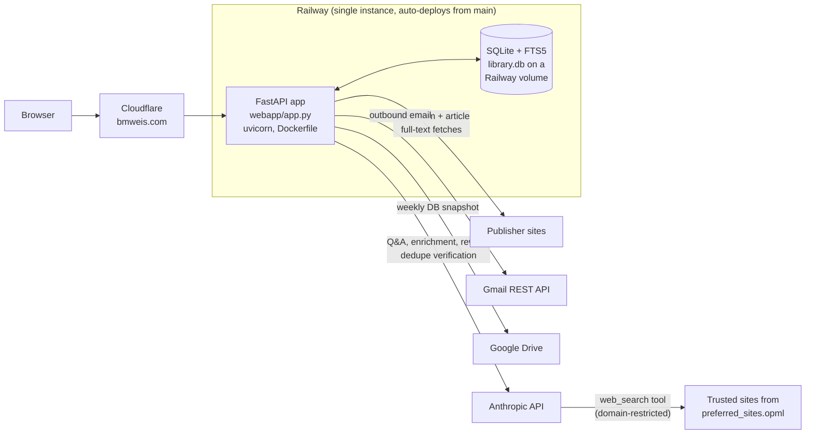
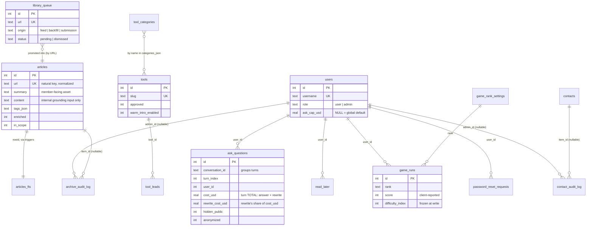
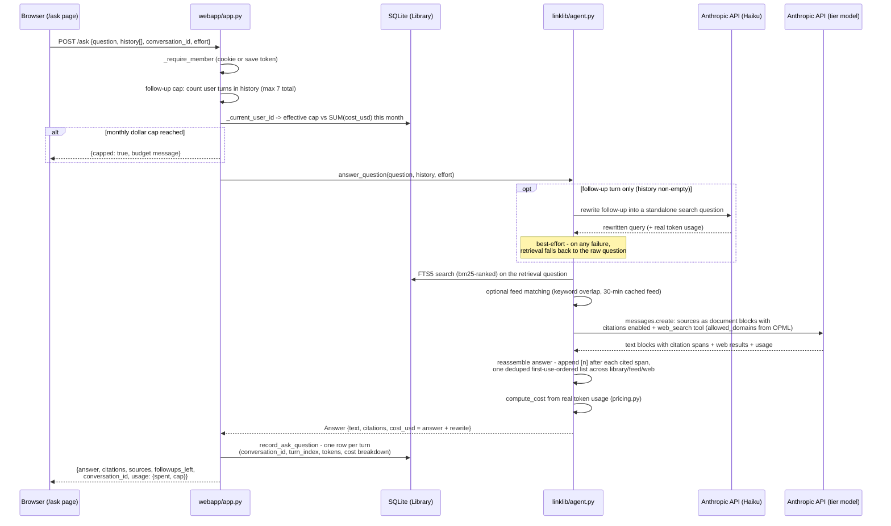

# Architecture

A living technical overview of CFO Navigator / bmweis.com, written for someone
seeing the codebase for the first time. It covers how the system is put
together and *why* it's put together that way — not a line-by-line tour.
Keep it current: see the **Documentation** section of `CLAUDE.md` for the
maintenance rules that apply to every PR.

## 1. System overview

The whole site is **one FastAPI monolith** (`webapp/app.py`) over **one SQLite
database** with FTS5 full-text search (`linklib/db.py`), running as a single
process on Railway. All HTML/CSS/JS is inline in Python strings — there is no
template framework and no frontend build step. The public face (bio, thought
leadership, CFO Toolbox, contact) needs no login; a signed-cookie login gates
the member tools (article archive, feed reader, FP&A Buddy) and a ~40-page
admin back office. Railway auto-deploys from `main` (all changes ship via PR),
the database lives on a Railway volume so it survives deploys, and Cloudflare
sits in front of Railway serving the `bmweis.com` domain.



Notes on the edges:

- **Cloudflare** is infrastructure outside this repo — nothing in the codebase
  references it. Its config (proxy/caching/WAF rules) is managed in the
  Cloudflare dashboard. The app itself handles canonical-host redirects
  (www and the legacy `*.up.railway.app` hostname 301 to the apex) in a
  FastAPI middleware, not at the edge.
- **The volume path** is Railway configuration, not code: the app reads
  `LINKLIB_DB` (default `./library.db`); production points it at the mounted
  volume. The DB is deliberately not in git — it's personal reading history.
- **Web search never leaves the allowlist**: `preferred_sites.opml` (the same
  file that drives the `/feed` reader) is parsed into `allowed_domains` for
  Anthropic's `web_search` tool, so FP&A Buddy can only cite sources the
  curator already trusts.
- **Email is the Gmail REST API, not SMTP** — Railway's Hobby plan blocks SMTP
  ports. Every send is best-effort and must never block the underlying DB
  write; failures land in the `email_failures` table and surface as an admin
  badge instead of dying in a log.

## 2. Database schema

Everything is in one SQLite file, defined and migrated in `linklib/db.py`.
The `Library` class is the only write path; the schema script runs on every
boot (`CREATE TABLE IF NOT EXISTS`) followed by an **additive-only migration
list** of `ALTER TABLE ADD COLUMN` statements that ignore "already exists"
errors. There are no declared foreign-key constraints — relationships below
are by convention (`user_id`, `tool_id`, `item_id` columns), enforced in code.

### Content spine

| Table | Purpose | Columns that carry meaning |
|---|---|---|
| `articles` | The archive: ~1,500+ curated articles. **URL is the natural key** (`UNIQUE`, normalized) — upserts merge tags and fill empty fields, never duplicate. | `url`, `summary` (Claude-generated, the member-facing asset), `content` (fetched full text — internal input only, never served), `tags_json`/`tags_text` (structured list + flattened copy for FTS), `enriched`/`enrich_model`/`enrich_rules` (provenance), `in_scope`/`scope_reason` (off-audience review flags) |
| `articles_fts` | FTS5 virtual table (`content='articles'`, porter tokenizer) over title/author/source/summary/content/notes/tags_text. | Kept in sync by three triggers (`articles_ai`/`_ad`/`_au`) on insert/delete/update — no manual reindex, ever. |
| `library_queue` | Staging area for proposed additions (RSS scan, sitemap backfill, reader submissions). Candidates arrive enriched-but-unsaved for review; promoting moves the row into `articles`, preserving enrichment already paid for. | `url` (unique, same natural key), `origin` (`feed` \| `backfill:<source>` \| `submission:<who>`), `status` (`pending` \| `dismissed` — dismissed rows stay, so a rejected candidate is never re-proposed) |
| `dedupe_decisions` | Curator verdicts on near-duplicate *pairs*, keyed by the sorted URL pair. Suppresses already-judged pairs from future scans and teaches the Claude verifier. | `pair_key` (unique), `verdict` (`dup` \| `distinct`) |
| `read_later` | Per-user private bookmark list, never shared or mixed into the archive. | `user_id` + `url` (unique together — enforced by a post-migration index because the column arrived by migration) |

### FP&A Buddy (Ask)

| Table | Purpose | Columns that carry meaning |
|---|---|---|
| `ask_questions` | One row per conversation **turn**; the single table behind all three surfaces (admin report, a user's own history, the member-public community view). | `conversation_id` (groups follow-up turns; `= str(id)` of the first turn) + `turn_index`; token columns for the answer call; `rewrite_input_tokens`/`rewrite_output_tokens`/`rewrite_cost_usd` for the follow-up query-rewrite call; **`cost_usd` is the turn TOTAL (answer + rewrite)** so every `SUM(cost_usd)` — the monthly cap, the reports — needs no special handling; `hidden_public`/`anonymized` affect only the community view |

Cost figures are computed from **real API token usage** at call time
(`linklib/pricing.py`) — never estimates.

### Accounts

| Table | Purpose | Columns that carry meaning |
|---|---|---|
| `users` | Member accounts. Passwords are scrypt-hashed (`linklib/passwords.py`, stdlib only). | `role` (`user` \| `admin`), `active`, `ask_cap_usd` (per-user monthly dollar-cap override; `NULL` = inherit the global default from `settings`) |
| `password_reset_requests` | Self-service "forgot password" requests. | `token_hash` (SHA-256 of the emailed token — never the raw token, so a DB leak alone can't reset a password), `expires_at`, `resolved_at` (`''` = pending — the empty-string-sentinel idiom used throughout) |

### CFO Toolbox

| Table | Purpose | Columns that carry meaning |
|---|---|---|
| `tools` | The vendor directory on `/tools`. Seeded once from `scripts/seed_tools.py`; the DB owns the data afterward. | `slug` (unique), `approved` (reader submissions wait for approval), `advisor`, `promoted`, `warm_intro_enabled` + `vendor_name`/`vendor_email` (the intro button needs both) |
| `tool_categories` | Controlled vocabulary of filter pills — can exist empty, unlike article tags which are purely usage-derived. | `name` (unique), `sort_order` |
| `benchmarks` | The Benchmarking Resources section on `/tools`. | `coverage` (`Private`\|`Public`\|`Both`), `pricing` (`free`\|`paid`\|`freemium`) |
| `tool_leads` | Warm Intro request submissions per tool. | `tool_id`, contact fields |

### Site operations

| Table | Purpose | Columns that carry meaning |
|---|---|---|
| `settings` | Generic key/value store (global Ask cap default, editable email copy, tag-style guide, …). | `key`/`value` |
| `contacts` | Contact-form submissions. | `deleted_at` (`''` = live — soft delete for spam, never hard delete) |
| `email_failures` | Durable record of failed outbound-email attempts, so "best-effort" email never means "silent". | `context` (which send path), `resolved_at` |
| `archive_audit_log` | Who did what to the archive: one row per admin add/edit/delete. | `admin_id` (nullable — the break-glass login has no `users` row), `item_id` (an `articles.id`; `NULL` = bulk operation with a summary in `detail`) |
| `contact_audit_log` | Same shape for contact deletions — kept separate so `item_id` is never ambiguous about which table it references. | as above, `item_id` → `contacts.id` |

### "Sail, Don't Row" (the /play game)

| Table | Purpose | Columns that carry meaning |
|---|---|---|
| `game_rank_settings` | One row per difficulty rank — the tunable knobs the game engine reads, editable from `/admin/game-settings` without a redeploy. Contains deliberately-kept dead columns (`row_speed`, `stamina_*`) from a removed mechanic — migrations here are additive-only. | `rank` (PK), speed/obstacle/shark tuning columns |
| `game_runs` | Public leaderboard, one row per submitted run. Client-reported scores (client-authoritative game, bounds-checked at write time only). | `score`, `course_week`, `difficulty_index`/`difficulty_label` (**frozen at write time** — a later admin retune can't relabel past runs) |



(Diagram shows key columns and conventional relationships only; `settings`,
`contacts`, `email_failures`, `benchmarks`, `dedupe_decisions`, `read_later`,
`tool_categories`, and the audit tables carry no columns beyond what the
tables above describe.)

## 3. Key request flows

### FP&A Buddy — `POST /ask`

The retrieval-augmented Q&A flow. The UI exposes only a Quick/Standard/Deep
effort tier; each tier maps internally to a model, retrieval counts, token
budget, and per-source/global grounding-character caps (`EFFORT_SETTINGS` in
`linklib/agent.py`). The client holds the conversation history and sends it
back with every turn; the server holds the money guards.



Details worth knowing:

- **Two API calls can happen per turn.** On follow-ups, a cheap Haiku call
  first rewrites e.g. *"what about at Series A?"* into a standalone search
  question so FTS5 retrieval sees the conversation's subject. It's
  retrieval-only (the answering prompt always gets the verbatim question plus
  raw history), strictly best-effort (10s timeout, malformed output rejected,
  silent fallback), and its spend is still recorded — folded into the same
  row's `cost_usd` with `rewrite_*` columns breaking out its share.
- **Citations are API-verified, not prompted.** Library/feed sources ride as
  Citations-API `document` blocks; web search cites automatically. The
  response's cited spans are reassembled server-side into `[n]` markers
  against one continuous, deduplicated, first-use-ordered list spanning all
  three source types. Any surprise in citation metadata degrades to plain
  text — citation handling can never fail an answer.
- **Cost guards are layered**: per-turn grounding-character caps, a max-tokens
  budget per tier, a follow-up cap (6 extra turns), a history-character cap
  carried into the prompt, and the authoritative monthly per-user dollar cap
  checked against real recorded spend before any API call.

### Archive save / enrichment pipeline

All capture paths converge on `linklib/pipeline.py::ingest_url` or the
`library_queue` review flow:

- **Direct saves** (trusted — go straight into `articles`): the bookmarklet →
  `POST /save` (token auth), `POST /feed/save` from the feed reader (admin),
  and the CLI (`scripts/add_link.py`). `ingest_url` fetches the page
  (trafilatura preferred, BeautifulSoup fallback — `linklib/extract.py`),
  upserts by normalized URL, then enriches: one Haiku call
  (`linklib/enrich.py`) generates a summary and tags biased toward the
  existing tag vocabulary (`linklib/tagstyle.py` learns the curator's tagging
  style and feeds the prompt). Enrichment is **additive and optional** — a
  save without an API key just leaves `enriched=0` for
  `scripts/enrich_backfill.py` to fill later.
- **Queued candidates** (reviewed — land in `library_queue` first): the RSS
  scan and one-time sitemap backfill (`linklib/queue.py`), and member reader
  submissions (`POST /library/submit`, honeypot-protected, deliberately
  un-enriched until review). `linklib/suggest.py` adds an advisory
  Claude-predicted keep/skip. The admin reviews at `/admin/queue`;
  **promoting** moves the row into `articles` preserving any enrichment
  already paid for, **dismissing** keeps the row so it's never re-proposed.
- FTS5 stays in sync automatically via the triggers — every insert/update
  cascades into the index.

### Auth: three tiers, one cookie

Implemented with the stdlib only (`hmac`/`hashlib`/scrypt) — deliberately no
`itsdangerous`/SessionMiddleware dependency.

- **Login** (`POST /login`): username + password verified against `users`
  (scrypt). One **break-glass** path: the host password
  (`LINKLIB_PASSWORD`, falling back to `LINKLIB_SAVE_TOKEN`) with a reserved
  admin username works even with an empty `users` table, so a lost password
  can't lock the owner out. Success sets `cfo_session`: an HMAC-SHA256-signed
  value `exp|role|username` (key: `LINKLIB_SECRET_KEY`, falling back to the
  password — unset means restarts invalidate sessions), HttpOnly,
  SameSite=Lax, 30-day TTL.
- **Three surfaces**:
  - *Public* — no auth: `/`, `/thought-leadership`, `/growth-engine-ratio`,
    `/tools`, `/contact`, `/play`, `/login`, `/static/*`, `/health`.
  - *Member* (`_is_member` — any valid session): `/library`, `/archive`,
    `/feed`, `/read`, `/ask`, `/questions`, `/library/submit`. HTML pages
    redirect to `/login`; APIs return 401.
  - *Admin* (`_is_authed` — session with `role=admin`): everything under
    `/admin/*`, plus admin-only actions on shared pages.
- **Token auth in parallel**: `POST /save` is token-only
  (`X-Save-Token`/`?token=`) because the bookmarklet calls it cross-origin
  where the cookie can't be sent; member/admin APIs (`/ask`, `/api/search`,
  `/feed/save`) accept the token as an alternative to the cookie. All token
  comparisons are constant-time (`hmac.compare_digest`).
- If **no password is configured at all**, private routes are open — a
  local-development convenience, never the hosted configuration.
- Two middlewares wrap everything: a canonical-host 301 (www + legacy Railway
  hostname → apex, guarded so dev instances and `/health` never redirect) and
  `Cache-Control: no-store` on `/admin/*` (so task badges are never served
  stale from the back-forward cache).

## 4. Design decisions and their reasons

Short entries: what was decided, and why. Rationale below is taken from code
comments, docstrings, `CLAUDE.md`, and PR history — where the "why" isn't
recorded anywhere, it's flagged rather than invented.

- **Inline HTML in Python strings; no template framework.** The whole UI lives
  in `webapp/app.py` (~130 routes) as f-strings, with vanilla JS only where a
  page needs interactivity. *Why:* not explicitly recorded in the repo. It is
  consistent with the codebase's documented minimal-dependency ethos (see the
  stdlib-only auth note below), and it keeps every page greppable in one
  file — but treat that as inference, not recorded rationale.
- **SQLite + FTS5 on a Railway volume, not a hosted database.** *Why:* the
  scale is one curator plus a small member base; a single file needs zero
  operational overhead, backs up by copying (`/admin/download-db`, weekly
  Drive snapshots), and FTS5 gives ranked full-text search for free.
  `db.py`'s docstring records the exit path: the same schema works on
  libSQL/Turso/D1 later — only the connection changes.
- **Dollar-based rate limiting, computed from real token usage.** Each Ask
  turn records exact USD cost from the API response's token counts against a
  published-rate table (`linklib/pricing.py` — "no approximation"), and the
  monthly cap compares `SUM(cost_usd)` to a per-user cap. *Why:* query counts
  misprice reality — a Deep Opus answer costs ~60× a Quick Haiku one. Caps
  are data (a settings row + a per-user column), not logic, so a future paid
  tier is a different row, not a code branch.
- **Citations link to original external URLs only; stored full text is never
  served to members.** The archive's `content` column is an internal
  grounding/search input; the member-facing surface is summary + tags +
  a link out. The Ask system prompt forbids verbatim reproduction, and
  `/admin/library` states the rule explicitly. *Why:* resale-safety — the
  archive is built from other people's articles, so the product is the
  curation and synthesis, never republication.
- **Client-held conversation history.** The `/ask` page keeps the running
  `[{role, content}]` list in the browser and sends it back each turn; the
  server is stateless per request. *Why:* the simplest thing that works with
  one process and no session store. Server-side conversation persistence is
  planned (the per-turn rows in `ask_questions` already capture the
  transcript). Note the layering this creates today: the follow-up cap counts
  turns in *client-supplied* history, so the authoritative guard is the
  monthly dollar cap, which is fully server-side.
- **Per-turn citation numbering.** Each answer's `[n]` markers resolve against
  that turn's own citation list (the frontend re-scopes `CITES` per response);
  numbering restarts every turn rather than accumulating across the
  conversation. *Why:* each turn's list is verified against that API
  response's citation metadata; a conversation-global numbering would need
  server-held state (see previous entry).
- **Additive-only schema migrations.** Boot runs `CREATE TABLE IF NOT EXISTS`
  then a list of `ALTER TABLE ADD COLUMN`s that swallow "duplicate column"
  errors; columns are never dropped (dead game columns are kept and labeled).
  Indexes on migrated-in columns must go in `_POST_MIGRATION_INDEXES`, never
  in the schema script — the comment in `db.py` records the real incident: an
  index in the schema referencing a not-yet-migrated column crashed every
  boot against pre-existing DBs. *Why:* no migration tooling, one writer, and
  a production DB that predates most columns — additive is the only shape
  that's always safe to re-run.
- **URL is the natural key, aggressively normalized.** `normalize_url` forces
  https, strips `www.`, fragments, tracking params, and trailing slashes
  before any insert; upserts merge tags and fill blanks. *Why:* the same
  article arrives from Feedly boards, share links, and feeds — idempotent
  re-imports and safe double-saves matter more than surrogate-key purity.
- **Single-process in-memory state.** Long-running admin jobs
  (enrich/backfill progress), the `/contact` rate limiter, and the 30-minute
  feed cache are all module-level dicts behind locks. *Why:* the deployment
  is one Railway instance; a queue or Redis would be pure overhead. This is a
  standing constraint: the app does not scale horizontally without moving
  that state.
- **Best-effort everywhere an AI or email call rides along a user action.**
  Enrichment, the follow-up rewrite, citation assembly, and every outbound
  email are wrapped so failure degrades (unenriched row, raw-question
  retrieval, uncited text, logged failure) instead of blocking the save or
  the answer. Failures that need a human land in durable tables
  (`email_failures`) with admin badges — best-effort must not mean silent.
- **Seed once, then the DB owns it.** Tool categories, benchmarks, and game
  tuning are seeded on first boot from source constants but never re-synced
  (except the tools `advisor` flag, deliberately) — admin edits survive every
  deploy. *Why:* recorded in the seeding docstrings; the admin UI is the
  editor of record, source constants are just day-one data.
- **Effort tiers instead of a model picker.** `/ask` exposes
  Quick/Standard/Deep; the model behind each tier is an implementation detail
  (`EFFORT_SETTINGS`). *Why:* members shouldn't need model literacy to make a
  cost/quality choice (PR #84 collapsed the previous model+effort UI).
  Elsewhere, enrichment model pickers stay curated (no auto-surfacing of new
  models) so a whole-archive re-enrich can't accidentally target a pricey new
  model.
- **stdlib-only auth primitives.** HMAC-signed cookie, scrypt password
  hashing, constant-time comparisons — no `itsdangerous`, no
  SessionMiddleware. *Why:* recorded in `CLAUDE.md`: one fewer dependency for
  a small, well-understood surface.
- **The game is client-authoritative.** `/play` is a DOM+CSS game; scores are
  client-reported and only bounds-checked. *Why:* recorded in the schema
  comment — server-side simulation isn't worth it for a leaderboard among
  members; the trust model is stated, not accidental.

## 5. Directory map

```
webapp/
  app.py                    # THE app: ~130 routes, all inline HTML/CSS/JS, auth, admin hub
  checks.py                 # aggregates automated checks for /admin/checks (mirrors CI)
  tasks.py                  # open-task badge counts for the admin hub
  thought_leadership_data.py# curated content for /thought-leadership
  static/                   # served assets (headshot etc.) via GET /static/{filename}
linklib/                    # the core library — everything durable lives here
  db.py                     # SQLite + FTS5 schema, migrations, Library class — the spine
  agent.py                  # FP&A Buddy: retrieval, rewrite, Citations API, cost capture
  pricing.py                # exact per-call USD cost from real token usage
  pipeline.py               # shared ingest (fetch → upsert → enrich) for CLI and web
  enrich.py                 # Claude summary + auto-tags per article
  extract.py                # full-text fetch (trafilatura preferred, BS4 fallback)
  archive.py                # parses the one-time Feedly "Download your data" export
  feed.py                   # RSS/Atom reader over the OPML list (concurrent, 30-min cache)
  sources.py                # preferred_sites.opml → web-search domain allowlist
  queue.py                  # fills the Archive Queue from RSS (ongoing) + sitemaps (backfill)
  suggest.py                # advisory Claude keep/skip predictions for queue candidates
  dedupe.py                 # near-duplicate detection (similarity + Claude verification)
  tagstyle.py               # learns the curator's tagging style; feeds enrichment
  models.py                 # curated model registry reconciled with the live Models API
  passwords.py              # scrypt hashing (stdlib only)
  social.py                 # BRIAN_VOICE prompt (reused by Ask) + LinkedIn drafting (CLI only)
  email_utils.py            # outbound email via Gmail REST API (Railway blocks SMTP)
  backup.py                 # weekly off-site DB snapshot to Google Drive
  authcheck.py              # probes paywall auth cookies so a stale one surfaces
  brand_check.py, voice_review.py  # deterministic BRAND.md palette/voice checks
scripts/                    # CLI entry points (import, add_link, enrich_backfill, ask,
                            #   post, seed_tools, backfill_queue, mcp_server, …)
tests/                      # pytest suite run by CI (.github/workflows/qa.yml)
preferred_sites.opml        # dual-purpose: web-search allowlist AND /feed subscriptions
Dockerfile, Procfile, railway.toml  # Railway deploy (uvicorn, /health healthcheck)
CLAUDE.md, BRAND.md         # working agreements: context for agents, design system
```

## 6. Known limitations / deferred work

- **Citation markers render as literal text outside `/ask`.** The `[n]`
  markers are linkified only on the live `/ask` page (and `/archive`'s
  quick-ask widget). In `/ask/history`, the `/questions` community view, and
  the admin CSV export, they appear as plain `[1]`/`[2]` text with no
  resolution to their source list.
- **No server-side conversation persistence yet.** History lives in the
  browser; a reload orphans the conversation (the turns are recorded in
  `ask_questions`, but there's no UI to resume one). Planned.
- **Retrieval is FTS5 keyword search only.** `_safe_fts_query` ORs the
  question's keywords; feed matching is plain keyword overlap. No embeddings,
  so a question phrased entirely in synonyms can miss relevant saved
  articles. Semantic/hybrid search is planned.
- **The follow-up cap trusts client-supplied history.** A client sending a
  trimmed history could exceed the 7-turn limit; the monthly dollar cap
  (server-side, from recorded spend) is the real guard.
- **Single-instance assumptions.** Job progress, the contact rate limiter,
  and the feed cache are in-process memory; SQLite is a local file. Scaling
  beyond one instance means externalizing all of that.
- **Model pricing is a manual table.** `pricing.py` has no live pricing API to
  reconcile against; a stale row silently mis-records spend. Standing example:
  Sonnet 5's introductory pricing row must be hand-edited after 2026-08-31.
- **iOS Share Sheet shortcut** (from the original migration plan) remains
  unbuilt; capture from a phone goes through the bookmarklet.
